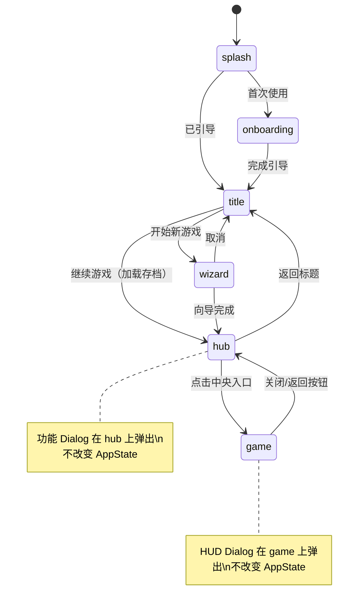

# Game Hub 功能中枢设计方案

**版本**：1.0  
**性质**：UI 架构重构设计文档  
**前置依赖**：无  

---

## 1. 设计目标与动机

### 1.1 当前问题

当前游戏界面（`appState === "game"`）的所有功能入口都挤在 `AppShell` 的 Header 右侧按钮带中：

```
Header: [Logo] ··· [角色][世界书][预设][记忆][检查点][联机][存档][⚙]
```

**痛点**：
1. **扩展性差**：Header 是线性布局，每新增一个功能就多一个图标，空间有限
2. **移动端拥挤**：8 个按钮在小屏上严重拥挤，部分文字被 `hidden sm:inline` 隐藏
3. **视觉表达力不足**：每个入口只是 16-18px 的小图标，无法传达功能状态和描述
4. **缺乏游戏感**：工具栏式的 Header 不符合 Lyra 作为 RPG 运行时的定位

### 1.2 设计目标

引入 **Hub（功能中枢）** 作为中间层，将功能入口按 **"系统级"** 和 **"游戏级"** 分层：

- **Hub 层**：放置系统/元信息功能（低频、配置性质）
- **GameView 层**：保留游戏状态 HUD（高频、玩家需要实时看到的）
- **移除 AppShell Header**：GameView 变为全屏沉浸式，不再有顶部工具栏

### 1.3 核心原则

- **聊天即游戏**：Hub 的中央入口通往 GameView（聊天/叙事界面），GameView 是游戏的核心
- **随时可退**：从 GameView 返回 Hub 不影响游戏状态，不中断任何进行中的流程
- **功能发现性**：Hub 上的功能入口自带图标、标签和状态摘要，新用户能快速理解
- **风格化优先**：Hub 是玩家进入游戏世界的"大厅"，视觉应有沉浸感

---

## 2. 信息架构：功能分层

### 2.1 分类原则

| 分类维度 | Hub 侧 | GameView HUD 侧 |
|---------|--------|----------------|
| 使用频率 | 低频（偶尔配置） | 高频（游戏中随时查看） |
| 功能性质 | 系统级、元信息 | 游戏状态、实时数据 |
| 典型操作 | 打开编辑器、调整配置 | 瞥一眼状态、快速操作 |
| 中断游戏流 | 可以接受 | 不应中断 |

### 2.2 功能分配表

#### Hub 侧功能入口（四角散布）

| 功能 | 位置建议 | 图标 | 标签 | 状态摘要示例 | 对应现有组件 |
|------|---------|------|------|------------|------------|
| **预设 (Preset)** | 左上 | 🔮 / Wand | 提示词 / PRESET | 当前预设名 | `PresetButton` → `PresetWorkspace` |
| **世界书 (Lorebook)** | 右上 | 📖 / BookOpen | 世界书 / LOREBOOK | "12 个条目" | `LorebookButton` → `LorebookWorkspace` |
| **记忆系统 (Memory)** | 左中 | 🧠 / Brain | 记忆 / MEMORY | "3 条活跃" | `MemoryButton` → Dialog |
| **联机 (Room)** | 右中 | 🌐 / Globe | 联机 / ONLINE | "未连接" / "房间 #ABC" | `RoomInfoButton` → Dialog |
| **返回标题 (Home)** | 左下 | 🏠 / Home | 返回标题 / HOME | - | `onTitleClick` |
| **系统设置 (Settings)** | 右下 | ⚙️ / Settings | 设置 / SETTINGS | - | `SettingsDialog` |
| **存档管理 (Save)** | 下方中部 | 💾 / FolderOpen | 存档 / SAVES | "存档 3/5" | `SaveManagerDialog` |
| **检查点 (Checkpoint)** | 下方中部 | 📌 / Pin | 检查点 / CHECKPOINT | "最近: 2分钟前" | `CheckpointButton` → Dialog |
| **📕 进入冒险（中央）** | 正中央 | 大尺寸主视觉 | 继续冒险 | 角色名 + 等级 | → `GameView` |

#### GameView HUD 侧（游戏内浮动面板）

| 功能 | 位置建议 | 说明 | 来源 |
|------|---------|------|------|
| **角色状态** | 左侧面板 | 头像、HP/MP 条、等级 | 从 `CharacterPanel` 提取轻量版 |
| **返回 Hub** | 右上角 × | 关闭按钮，返回 Hub | 新增 |
| **背包快捷栏** | *未来* | 游戏中快速查看/使用物品 | *Phase 2* |
| **小地图** | *未来* | 当前位置可视化 | *Phase 3* |
| **冒险日志** | *未来* | 所在地、天气、日期 | *Phase 3* |

> **注意**：角色面板的完整版（含总览、天赋、技能、背包、NPC 标签页）仍然可以从 GameView HUD 的角色状态面板中打开（点击头像/角色名 → 弹出 `CharacterPanelDialog`）。Hub 侧不放角色入口。

---

## 3. 导航流程

### 3.1 AppState 状态机变化

```
当前：
splash → onboarding → title → wizard → game

改后：
splash → onboarding → title → wizard → hub ⇄ game
```

```typescript
// src/App.tsx
type AppState = "splash" | "onboarding" | "title" | "wizard" | "hub" | "game";
//                                                            ^^^
//                                                          新增状态
```

### 3.2 状态流转规则

```
title ──[开始新游戏]──→ wizard ──[完成]──→ hub
title ──[继续游戏]───→ hub（加载存档后）

hub ──[点击中央入口]──→ game
hub ──[返回标题]──────→ title
hub ──[点击功能入口]──→ 弹出对应 Dialog（停留在 hub）

game ──[点击关闭/返回]──→ hub
game ──[游戏内 HUD 操作]──→ 弹出 Dialog（停留在 game）
```

### 3.3 关键流程图



---

## 4. 组件架构设计

### 4.1 新增/修改文件总览

```
src/
├── App.tsx                              ← 修改：AppState 增加 "hub"，重构路由逻辑
├── components/
│   ├── layout/
│   │   ├── AppShell.tsx                 ← 保留但不再用于游戏界面（仅 Hub 可选复用）
│   │   └── GameHub/                     ← 🆕 新增目录
│   │       ├── index.tsx                ← Hub 主组件
│   │       ├── HubBackground.tsx        ← Hub 背景层（星空 + 网格 + 粒子）
│   │       ├── HubFeatureIcon.tsx       ← 功能入口图标组件
│   │       └── HubCenterEntry.tsx       ← 中央入口组件（进入冒险）
│   ├── GameHUD/                         ← 🆕 新增目录（GameView 内的 HUD）
│   │   ├── index.tsx                    ← HUD 容器
│   │   ├── CharacterStatusBar.tsx       ← 角色状态条（轻量版）
│   │   └── HubReturnButton.tsx          ← 返回 Hub 按钮
│   ├── CharacterPanel/                  ← 保留不变（从 HUD 中打开完整面板）
│   └── ...其他现有组件保留不变
└── modules/
    └── chat/components/
        └── GameView.tsx                 ← 修改：移除 AppShell 包裹，集成 HUD
```

### 4.2 核心组件设计

#### 4.2.1 `GameHub` — Hub 主组件

```typescript
// src/components/layout/GameHub/index.tsx

interface GameHubProps {
  /** 点击中央入口，进入游戏 */
  onEnterGame: () => void;
  /** 返回标题画面 */
  onBackToTitle: () => void;
  /** 打开设置 */
  onSettings: () => void;
  /** 打开存档管理 */
  onSaveManager: () => void;
  /** 打开预设工作区 */
  onPresetWorkspace: () => void;
  /** 打开世界书工作区 */
  onLorebookWorkspace: () => void;
  /** 打开检查点 */
  onCheckpoint: () => void;
  /** 记忆系统（可能是直接触发命令） */
  onMemory: () => void;
  /** 联机信息 */
  onRoomInfo: () => void;
}

export function GameHub(props: GameHubProps) {
  return (
    <div className="relative w-full h-dvh overflow-hidden">
      {/* 背景层 */}
      <HubBackground />

      {/* 功能入口 - 四角散布布局 */}
      {/* 左上：预设 */}
      <HubFeatureIcon
        position="top-left"
        icon={Wand}
        label="提示词"
        sublabel="PRESET"
        onClick={props.onPresetWorkspace}
      />
      
      {/* 右上：世界书 */}
      <HubFeatureIcon
        position="top-right"
        icon={BookOpen}
        label="世界书"
        sublabel="LOREBOOK"
        onClick={props.onLorebookWorkspace}
      />
      
      {/* 左中：记忆 */}
      <HubFeatureIcon
        position="middle-left"
        icon={Brain}
        label="记忆系统"
        sublabel="MEMORY"
        onClick={props.onMemory}
      />

      {/* 右中：联机 */}
      <HubFeatureIcon
        position="middle-right"
        icon={Globe}
        label="联机"
        sublabel="ONLINE"
        onClick={props.onRoomInfo}
      />

      {/* 左下：返回标题 */}
      <HubFeatureIcon
        position="bottom-left"
        icon={Home}
        label="返回标题"
        sublabel="HOME"
        onClick={props.onBackToTitle}
      />

      {/* 右下：设置 */}
      <HubFeatureIcon
        position="bottom-right"
        icon={Settings}
        label="系统设置"
        sublabel="SETTINGS"
        onClick={props.onSettings}
      />

      {/* 下方中部：存档 + 检查点 */}
      <div className="absolute bottom-8 left-1/2 -translate-x-1/2 flex gap-6">
        <HubFeatureIcon
          icon={FolderOpen}
          label="存档"
          sublabel="SAVES"
          onClick={props.onSaveManager}
        />
        <HubFeatureIcon
          icon={Pin}
          label="检查点"
          sublabel="CHECKPOINT"
          onClick={props.onCheckpoint}
        />
      </div>

      {/* 中央入口 */}
      <HubCenterEntry onClick={props.onEnterGame} />
    </div>
  );
}
```

#### 4.2.2 `HubFeatureIcon` — 功能入口图标

```typescript
// src/components/layout/GameHub/HubFeatureIcon.tsx

type HubPosition = 
  | "top-left" | "top-right" 
  | "middle-left" | "middle-right"
  | "bottom-left" | "bottom-right"
  | "inline"; // 用于底部行内排列

interface HubFeatureIconProps {
  position?: HubPosition;
  icon: LucideIcon;
  label: string;        // 中文标签
  sublabel?: string;    // 英文副标签
  status?: string;      // 可选的状态摘要文字
  onClick: () => void;
  className?: string;
}
```

**视觉规格**（MVP 简洁版）：
- 图标尺寸：32-40px
- 标签：中文 14px + 英文副标签 10px uppercase
- 悬停效果：发光扩散 + scale(1.05)
- 使用现有 token 系统：`color("primary")`、`glow()`、`colorAlpha()` 等

**位置映射**（使用 `absolute` 定位）：
```css
top-left:     { top: 2rem,  left: 2rem  }
top-right:    { top: 2rem,  right: 2rem }
middle-left:  { top: 50%,   left: 2rem,  transform: translateY(-50%) }
middle-right: { top: 50%,   right: 2rem, transform: translateY(-50%) }
bottom-left:  { bottom: 2rem, left: 2rem  }
bottom-right: { bottom: 2rem, right: 2rem }
```

#### 4.2.3 `HubCenterEntry` — 中央入口

```typescript
// src/components/layout/GameHub/HubCenterEntry.tsx

interface HubCenterEntryProps {
  onClick: () => void;
}
```

**MVP 视觉方案**：
- 一个大尺寸的卡片/容器（约 200-280px），居中放置
- 显示内容：角色种族/职业 + 等级（如 "人类 · LEVEL 1"）
- 可复用现有的 `HexButton` 或创建新的六边形/菱形容器
- 点击动效：scale + glow 扩散
- **设计简洁即可，后续会有单独任务重构视觉**

#### 4.2.4 `HubBackground` — Hub 背景

```typescript
// src/components/layout/GameHub/HubBackground.tsx
```

**MVP 方案**：
- 复用现有特效系统：`StarfieldBackground` + 网格叠加
- 使用 `color("bgBase")` 作为基础色
- 可选叠加 `createGridBackground()` 网格效果
- **不需要自定义场景图**（后续由单独任务处理）

#### 4.2.5 `GameHUD` — 游戏内 HUD

```typescript
// src/components/GameHUD/index.tsx

interface GameHUDProps {
  onReturnToHub: () => void;
  onOpenCharacterPanel: () => void;
}

export function GameHUD({ onReturnToHub, onOpenCharacterPanel }: GameHUDProps) {
  return (
    <>
      {/* 右上角：返回 Hub 按钮 */}
      <HubReturnButton onClick={onReturnToHub} />

      {/* 左侧：角色状态条 */}
      <CharacterStatusBar onClick={onOpenCharacterPanel} />
    </>
  );
}
```

**关键约束**：
- HUD 元素使用 `fixed` 或 `absolute` 定位，浮动在 GameView 之上
- `pointer-events-none` 容器 + `pointer-events-auto` 子元素，不阻挡叙事区交互
- z-index 需要高于 GameView 的叙事内容，低于 Dialog

#### 4.2.6 `CharacterStatusBar` — 角色状态条（轻量版）

```typescript
// src/components/GameHUD/CharacterStatusBar.tsx

interface CharacterStatusBarProps {
  onClick: () => void; // 点击打开完整角色面板
}
```

**显示内容**（从现有 `usePlayerCharacter()` hook 获取）：
- 角色头像（小尺寸）
- 角色名
- 等级
- HP/MP 条（如果有）
- 点击整个面板 → 打开 `CharacterPanelDialog`

#### 4.2.7 `HubReturnButton` — 返回 Hub 按钮

```typescript
// src/components/GameHUD/HubReturnButton.tsx
```

- 位置：GameView 右上角
- 样式：半透明圆形按钮，`X` 或 `←` 图标
- 悬停：提示文字 "返回大厅"

---

## 5. App.tsx 改动详解

### 5.1 状态增加

```typescript
type AppState = "splash" | "onboarding" | "title" | "wizard" | "hub" | "game";
```

### 5.2 路由逻辑变化

**当前**（`appState === "game"` 时）：
```tsx
<AppShell
  onTitleClick={handleBackToTitle}
  onSettings={handleSettings}
  onSaveManager={handleSaveManager}
  headerExtra={<>...8个按钮...</>}
>
  <GameView className="h-full" />
</AppShell>
```

**改为**：
```tsx
{/* Hub 功能中枢 */}
{appState === "hub" && (
  <GameHub
    onEnterGame={handleEnterGame}           // → setAppState("game")
    onBackToTitle={handleBackToTitle}        // → setAppState("title")
    onSettings={handleSettings}             // → setSettingsOpen(true)
    onSaveManager={handleSaveManager}       // → setSaveManagerOpen(true)
    onPresetWorkspace={handleOpenPresetWorkspace}
    onLorebookWorkspace={handleOpenLorebookWorkspace}
    onCheckpoint={handleOpenCheckpoint}     // 新增 handler
    onMemory={handleOpenMemory}             // 新增 handler
    onRoomInfo={handleOpenRoomInfo}         // 新增 handler
  />
)}

{/* 游戏主界面 - 全屏，无 AppShell 包裹 */}
{appState === "game" && (
  <div className="relative h-dvh">
    <GameView className="h-full" />
    <GameHUD
      onReturnToHub={handleReturnToHub}     // → setAppState("hub")
      onOpenCharacterPanel={handleOpenCharacterPanel}
    />
  </div>
)}
```

### 5.3 流转 Handler 变化

```typescript
// 新增
const handleEnterGame = () => setAppState("game");
const handleReturnToHub = () => setAppState("hub");

// 修改（wizard 完成后进入 hub 而非 game）
const handleWizardComplete = async (result: WizardResult) => {
  // ... 原有存档创建逻辑 ...
  setAppState("hub");  // 原来是 "game"，改为 "hub"
};

// 修改（继续游戏进入 hub）
const handleContinue = async () => {
  // ... 加载存档 ...
  setAppState("hub");  // 原来是 "game"，改为 "hub"
};

// 修改（返回标题）
const handleBackToTitle = () => setAppState("title");
```

### 5.4 Dialog 挂载位置

所有 Dialog（Settings、PresetWorkspace、LorebookWorkspace、SaveManager、CharacterPanel 等）仍然挂载在 `App.tsx` 的全局级别，不受 `appState` 切换影响。这保证了：
- 从 Hub 打开的 Dialog 在切换到 Game 后仍然可见（如果还没关闭）
- Dialog 的 open/close 状态与 AppState 完全独立

---

## 6. GameView 改动详解

### 6.1 移除 AppShell 包裹

GameView 不再被 `AppShell` 包裹，变为全屏组件：
- 移除 Header
- 背景效果直接在 GameView 内或由父级处理
- HUD 元素作为浮动层叠加

### 6.2 GameView 本身的改动极小

`GameView.tsx` 内部逻辑基本不变，仍然负责：
- 区分单人/联机模式
- 渲染 NarrativeFlow + PlayerInput
- 处理消息发送

唯一可能的微调：
- 背景样式可能需要调整以适配全屏无 Header 的情况
- 叙事区的 padding-top 可能需要为 HUD 留出空间

---

## 7. 移动端适配

### 7.1 Hub 移动端

- **与桌面同构**：同样的绝对定位散布布局
- 图标尺寸适当缩小（24-28px）
- 标签字号缩小
- 中央入口适当缩小
- 利用 `dvh` 确保全屏

### 7.2 GameView 移动端

- HUD 浮动元素适配小屏：
  - 角色状态条可收缩为仅头像 + HP 条
  - 返回按钮保持右上角

---

## 8. 样式策略

### 8.1 Token 复用

所有新组件必须使用现有的 Token 系统（`src/styles/tokens.ts`）：
- 颜色：`color()`, `colorAlpha()`
- 发光：`glow()`
- 渐变：`gradients.*()`
- 动画：`animation.*`
- 排版：`typography.*`

### 8.2 动画

- Hub 入场：整体 fade-in + 各图标 stagger 入场（使用 framer-motion）
- 图标悬停：scale(1.05) + glow 扩散
- 中央入口悬停：较大的 scale + 发光增强
- Hub ↔ Game 切换：`AnimatePresence` + fade/slide 过渡

### 8.3 背景

- 复用 `StarfieldBackground`（已有）
- 复用 `createGridBackground()`（已有）
- 整体暗调，与现有赛博朋克/科技风格一致

---

## 9. 数据流与状态管理

### 9.1 无新增 Store

Hub 本身不持有业务状态，它只是功能入口的展示层。所有状态摘要信息通过现有 hook 获取：

| 信息 | 数据来源 |
|------|----------|
| 角色信息 | `usePlayerCharacter()` hook |
| 预设名 | `usePresetStore()` |
| 记忆数 | 通过 memory 模块 API |
| 联机状态 | `useRoomStore()` |
| 存档数 | `useSaveSlots()` |

### 9.2 Hub ↔ Game 切换不触发数据加载

- 存档在进入 Hub 之前已经加载（title → wizard → hub 流程中）
- Hub 和 Game 之间的切换只是 UI 视图切换，不涉及数据操作
- 所有 Yjs 数据、Zustand store 在两个视图间共享

---

## 10. 实施路线

### Phase 1: 核心骨架（本次实施）

1. **AppState 扩展**：增加 `"hub"` 状态，修改流转逻辑
2. **GameHub 组件**：实现 Hub 主界面（背景 + 功能图标 + 中央入口）
3. **GameHUD 组件**：实现返回 Hub 按钮 + 角色状态条
4. **移除 AppShell 包裹**：GameView 全屏化
5. **调整 App.tsx 路由**：Hub 和 Game 之间的切换逻辑
6. **Dialog 保持不变**：所有功能弹窗的触发方式从 Header 按钮改为 Hub 图标

### Phase 2: HUD 增强（后续任务）

- 游戏内 HUD 面板细化（背包快捷栏、冒险日志等）
- 角色状态条的详细展示
- HUD 面板的展开/收起动画

### Phase 3: Hub 视觉升级（后续单独任务）

- 中央入口的精细化视觉设计
- 功能图标的风格化重构
- 自定义背景图支持（WorldConfig 驱动）
- 功能入口的状态摘要信息接入

---

## 11. 风险与注意事项

### 11.1 AppShell 的处置

`AppShell` 当前还承担了以下职责：
- 加载用户设置（`useSettingsStore().loadSettings()`）
- 渲染网格背景
- 渲染边角装饰

**处理方案**：
- 设置加载逻辑移到 `App.tsx` 层级（或独立 hook）
- 网格背景复用到 `HubBackground`
- 边角装饰可选择保留在 Hub 或全局
- `AppShell` 组件保留代码但不再使用，后续可清理

### 11.2 联机模式的特殊处理

联机模式下，Hub 上的某些功能入口可能需要：
- 禁用（如存档管理在联机时不可用）
- 显示不同状态（如联机图标显示当前房间信息）
- `RoomInfoButton` 的 `onLeave` 回调需要调整为返回到 title 而非直接在 Header 中处理

### 11.3 快捷键支持

建议为 Hub ↔ Game 切换预留快捷键支持（如 `Escape` 从 Game 返回 Hub），但 MVP 阶段可以只做按钮点击。

### 11.4 AnimatePresence 过渡

Hub 和 Game 之间的切换应使用 `AnimatePresence` + `motion` 实现平滑过渡，避免生硬的组件切换。需要注意：
- `key` 属性正确设置
- `mode="wait"` 确保退出动画完成后再入场
- 过渡时长不宜过长（200-300ms）

### 11.5 向后兼容

- 现有的所有 Dialog 组件（Settings、Preset、Lorebook 等）**零修改**
- 现有的 GameView、NarrativeFlow、PlayerInput **零修改或极小修改**
- 主要工作量在 App.tsx 的路由重构和新增 Hub/HUD 组件

## TODO LIST

<!-- LIMCODE_TODO_LIST_START -->
- [ ] 修改 App.tsx：AppState 增加 "hub" 状态，修改状态流转逻辑  `#1`
- [ ] 创建 GameHub 组件目录结构：index.tsx, HubBackground.tsx, HubFeatureIcon.tsx, HubCenterEntry.tsx  `#2`
- [ ] 实现 HubBackground：复用 StarfieldBackground + 网格特效  `#3`
- [ ] 实现 HubFeatureIcon：四角散布定位 + 图标/标签/悬停动效  `#4`
- [ ] 实现 HubCenterEntry：居中主入口 + 角色信息摘要  `#5`
- [ ] 实现 GameHub 主组件：组合所有子组件 + 连接 props  `#6`
- [ ] 创建 GameHUD 组件目录：index.tsx, HubReturnButton.tsx, CharacterStatusBar.tsx  `#7`
- [ ] 实现 HubReturnButton：右上角返回 Hub 按钮  `#8`
- [ ] 实现 CharacterStatusBar：轻量角色状态面板（头像/名字/HP）  `#9`
- [ ] 修改 App.tsx 渲染逻辑：Hub 和 Game 视图切换 + 移除 AppShell 包裹  `#10`
- [ ] 处理 AppShell 遗留职责：设置加载逻辑迁移  `#11`
- [ ] Hub ↔ Game 切换动画（AnimatePresence）  `#12`
- [ ] 移动端适配验证  `#13`
- [ ] 联机模式下 Hub 功能入口状态处理  `#14`
<!-- LIMCODE_TODO_LIST_END -->
