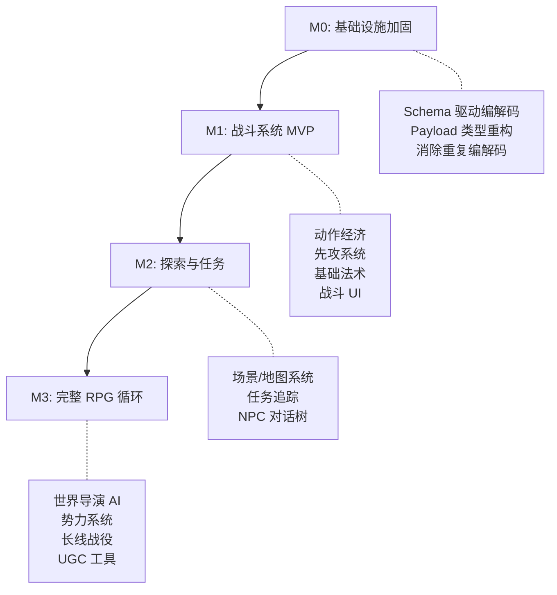

# 架构演进评估：当前数据架构能否支撑"文字版博德之门3"

> **文档状态**：评估报告  
> **评估日期**：2026-02-20  
> **评估范围**：实体模型、命令/事件系统、持久化层、规则引擎、模块化架构  

---

## 0. 执行摘要

**核心结论：当前架构的骨架设计优秀，已经走在正确的道路上，但有几个关键的结构性问题如果不在早期解决，将导致后续重构成本指数级增长。**

| 维度                 | 当前状态                                                | BG3 级别需求                         | 差距评级       |
| -------------------- | ------------------------------------------------------- | ------------------------------------ | -------------- |
| 实体模型             | 半 ECS（Character 扁平 + EntityData 运行时转换）        | 完整 ECS 组件化                      | ⚠️ 中等         |
| 命令/事件系统        | 手工定义，类型安全                                      | 需要泛型化 + 领域分组                | 🟡 可控         |
| 持久化层（Yjs）      | 逐字段手写编解码                                        | 需要 Schema 驱动 + 迁移机制          | 🔴 高风险       |
| 规则引擎             | RuleScript JSON DSL，已支持 check/damage/tag/item/skill | 需要 JIT 路径 + 更丰富的 action 类型 | 🟢 已有良好基础 |
| 模块化架构           | EventBus + CommandBus + Service Token                   | 足够支撑，需要更多领域模块           | 🟢 良好         |
| WorldConfig 配置驱动 | 属性/衍生属性/检定/天赋/物品/技能                       | 需要扩展种族/职业/法术/地图等        | 🟡 可控         |

---

## 1. 实体模型的可扩展性

### 1.1 现状分析

当前存在**两层实体模型**：

```
┌─────────────────────────────────────────────────────────────┐
│ 持久层：Character 接口（扁平结构，存储在 Yjs Y.Map 中）       │
│   - name, controlType, status, attributes, tags...          │
│   - attributes: Record<string, unknown>（万能口袋）          │
│   - tags: Record<string, unknown>（序列化的 TagMetadata）    │
├─────────────────────────────────────────────────────────────┤
│ 运行时层：EntityData（规则引擎使用）                          │
│   - fields: Record<string, number | string | boolean>       │
│   - tags: Map<string, TagMetadata>                          │
│   - 由 characterToEntityData() 从 Character 转换而来         │
└─────────────────────────────────────────────────────────────┘
```

**关键观察**：

1. [`Character`](src/domain/entities/character.ts:31) 接口是**扁平的**——所有字段直接挂在接口上，没有组件化分层
2. [`attributes: Record<string, unknown>`](src/domain/entities/character.ts:76) 实际上已经是一个**隐式的组件容器**——所有数值属性（str, vit, agi, hp, mp 等）都存储在这里
3. [`EntityData`](src/domain/types/entity.ts:17) 是规则引擎的运行时视图，通过 [`characterToEntityData()`](src/modules/game/repository/entity-codec.ts:201) 从 Character 转换
4. 物品（[`ItemInstance`](src/domain/entities/item.ts:57)）和技能（[`SkillInstance`](src/domain/entities/skill.ts:62)）已经是**独立的实体**，通过角色 ID 关联存储在 Yjs 的 `inventories` 和 `skills` Map 中

### 1.2 BG3 级别需求对比

BG3（D&D 5e）的角色系统需要：

| 组件                                | BG3 复杂度                       | 当前支持情况                                                            | 差距 |
| ----------------------------------- | -------------------------------- | ----------------------------------------------------------------------- | ---- |
| 基础属性（STR/DEX/CON/INT/WIS/CHA） | 6 属性 + 修正值                  | ✅ `primaryAttributes` + `derivedStats` 完全支持                         | 无   |
| 种族/亚种                           | 50+ 种族，各有被动特性           | ⚠️ `dimensions` 系统可承载，但特性效果需要 Tag 系统支持                  | 小   |
| 职业/子职业                         | 12 职业 × 3+ 子职业              | ⚠️ 同上，可用 `dimensions` 承载选择，但职业特性需要更丰富的 Tag/Modifier | 中   |
| 法术系统                            | 法术位、准备法术、施法组件、专注 | ❌ 当前 Skill 系统过于简单，缺少法术位资源管理                           | 大   |
| 装备系统                            | 武器精通、护甲类型、附魔         | ⚠️ 基础框架已有（ItemTemplate + EquipSlot），缺少精通和附魔              | 中   |
| 状态效果                            | 100+ 状态（中毒、魅惑、石化...） | ✅ Tag 系统 + ConditionTrigger 可以支撑                                  | 小   |
| 多重攻击/额外攻击                   | 战斗动作经济                     | ❌ 需要动作点/动作类型系统                                               | 大   |
| 先攻/回合顺序                       | 先攻检定 + 效果排序              | ⚠️ Phase 系统有回合概念，但缺少先攻排序                                  | 中   |

### 1.3 是否需要 ECS？

**结论：不需要引入完整的 ECS 框架，但需要将 Character 的 `attributes` 重新设计为组件化的结构。**

当前的 `attributes: Record<string, unknown>` 实际上已经是一个**原始的组件容器**。问题在于：

1. **缺乏类型安全**：`unknown` 类型无法在编译时检查
2. **缺乏组件语义**：所有属性都平铺在一个 Record 中，没有逻辑分组
3. **缺乏生命周期管理**：没有组件的添加/移除/查询机制

**推荐方案：引入"命名组件包"（Named Component Bags）模式**

```typescript
// 不是完整的 ECS，而是对 attributes 的结构化升级
interface CharacterComponents {
  // 基础属性组件（由 WorldConfig.primaryAttributes 驱动）
  stats: Record<string, number>;
  
  // 资源组件（hp, mp 等，由 WorldConfig.derivedStats[isResource=true] 驱动）
  resources: Record<string, number>;
  
  // 装备槽组件（装备的物品实例 ID）
  equipment: Partial<Record<EquipSlot, string>>;
  
  // 扩展数据（种族/职业特性等，预设作者自定义）
  extensions: Record<string, unknown>;
}
```

**为什么不需要完整 ECS**：

- 完整 ECS（如 bitECS/ECSY）适合**高频实体遍历**（每帧处理 10000+ 实体），我们的场景是**低频交互**（每回合几个角色）
- 我们的"组件"数量有限且变化缓慢，不需要 ECS 的位掩码查询优化
- 当前的 `EntityData.fields` + `EntityData.tags` 模式在规则引擎层面已经提供了足够的抽象

### 1.4 评级

| 项目             | 评估                                                            |
| ---------------- | --------------------------------------------------------------- |
| 是否阻塞后续开发 | **否**，当前 `attributes: Record<string, unknown>` 可以继续使用 |
| 是否需要现在重构 | **否**，但建议在 V2（战斗系统）之前完成组件化                   |
| 重构成本         | 中等——主要影响 entity-codec 和 WorldConfig                      |

---

## 2. 命令/事件系统的伸缩性

### 2.1 现状分析

当前的命令系统采用**显式定义**模式：

```
每种操作 = 命令常量 + Payload 接口 + Handler 函数
```

现有命令数量统计：

| 模块       | 命令数量 | 复杂度 |
| ---------- | -------- | ------ |
| Chat       | 9        | 中     |
| Room       | 30+      | 高     |
| Save       | 4        | 低     |
| Data       | 3        | 低     |
| Checkpoint | 3        | 低     |
| Inventory  | 4        | 低     |
| Memory     | 7        | 中     |
| **总计**   | **~60**  | -      |

### 2.2 BG3 级别的命令爆炸风险

如果引入地图/战斗/任务等系统，命令数量可能增长到：

```
当前 ~60 命令
+ 战斗系统（attack, cast_spell, use_ability, move, dodge, dash, disengage, hide...）~20
+ 地图系统（enter_area, discover_location, interact_object, open_door...）~15
+ 任务系统（accept_quest, complete_objective, turn_in, abandon...）~10
+ 社交系统（dialogue_choice, persuasion_check, trade, gift...）~10
+ 制作/合成（craft, disenchant, learn_recipe...）~5
───────────────────────
预计 ~120 命令
```

### 2.3 当前模式的可持续性

**结论：当前模式可以支撑 120 个命令，但需要更好的组织方式。**

当前模式的**优点**：
- 每个命令有明确的类型定义，TypeScript 编译器提供完整的类型检查
- Handler 函数是纯函数，易于测试
- 命令历史和回放天然支持

当前模式的**痛点**（已在 [`character-data-architecture-optimization.md`](plans/character-data-architecture-optimization.md) 中识别）：
- Payload 接口手动重复实体字段（方案 A 已提出解决方案）
- 新增命令的模板代码较多（但这是类型安全的代价，可接受）

**不建议引入泛型 CRUD 命令的原因**：
- 游戏命令天然有业务语义（`CAST_SPELL` ≠ `UPDATE_ENTITY`）
- 通用 CRUD 会丢失意图信息，不利于事件溯源和审计
- AI 生成的 RuleScript 已经是一种"泛型操作"层，不需要在命令层重复

### 2.4 推荐改进

1. **命令分组**：按领域对命令文件进行分组（已经在做，但可以更细粒度）

```
domain/commands/
├── chat/         # 聊天相关
├── combat/       # 战斗相关（新增）
├── exploration/  # 探索/地图相关（新增）
├── quest/        # 任务相关（新增）
├── inventory/    # 背包/装备
├── room/         # 房间管理
├── save/         # 存档
└── index.ts
```

1. **Payload 工厂**：使用类型工具减少重复（方案 A 中的 `Omit<CreateCharacterParams, ...>` 模式推广）

### 2.5 评级

| 项目             | 评估                                                                               |
| ---------------- | ---------------------------------------------------------------------------------- |
| 是否阻塞后续开发 | **否**                                                                             |
| 是否需要现在调整 | **方案 A+B 应尽快实施**（已规划在 character-data-architecture-optimization.md 中） |
| 长期风险         | 低——TypeScript 的类型系统天然约束了命令爆炸问题                                    |

---

## 3. 持久化层（Yjs）的适配性

### 3.1 现状分析

当前的 Yjs 持久化模式：

```
Character ──→ Y.Map<unknown>    （characterToYMap / yMapToCharacter）
ItemInstance ──→ Y.Map 中的数组  （inventories Map）
SkillInstance ──→ Y.Map 中的数组 （skills Map）
Message ──→ Y.Array
Conversation ──→ Y.Map
```

**关键问题**：

1. **逐实体手写编解码**：[`characterToYMap()`](src/modules/game/repository/entity-codec.ts:36) 和 [`yMapToCharacter()`](src/modules/game/repository/entity-codec.ts:101) 对每个字段都有显式的 get/set 调用
2. **无 Schema 版本管理**：如果字段被重命名或删除，旧数据无法迁移
3. **三套重复实现**（已在优化分析文档中识别，方案 B 解决）

### 3.2 BG3 级别的挑战

面对几十种实体类型（角色、NPC、物品、技能、法术、地图格子、任务、对话树节点...），逐实体手写编解码**不可行**。

```
当前实体类型数量：~8（Character, Conversation, Message, ItemInstance, SkillInstance, Checkpoint, Memory, Phase）
BG3 级别预计：~25-30
每种类型需要：toYMap() + fromYMap() + applyUpdates() = 3 个函数
总计：75-90 个手写编解码函数
```

### 3.3 关系型数据在 Yjs 中的挑战

Yjs 的 Y.Map 是**文档型存储**，不擅长处理关系查询：

| 关系类型           | 当前实现                               | 问题                         |
| ------------------ | -------------------------------------- | ---------------------------- |
| 角色 → 物品        | `inventories.get(characterId)`         | ✅ OK，一对多 Map 结构        |
| 角色 → 技能        | `skills.get(characterId)`              | ✅ OK                         |
| 角色 → 装备        | `equipped: boolean` 在 ItemInstance 上 | ⚠️ 查询已装备物品需要遍历背包 |
| 物品 → 模板        | `templateId` 引用                      | ✅ OK，模板在 WorldConfig 中  |
| 任务 → 目标 → 条件 | 未实现                                 | ❌ 深层嵌套关系，Yjs 处理困难 |
| 地图 → 房间 → 出口 | 未实现                                 | ❌ 图结构，需要特殊处理       |

### 3.4 推荐方案

#### 3.4.1 声明式 Schema + 自动编解码（🔴 必须现在做）

这是 [`character-data-architecture-optimization.md`](plans/character-data-architecture-optimization.md) 方案 C 的升级版。考虑到实体类型会持续增加，**声明式编解码不再是可选的长期优化，而是必须的基础设施**。

```typescript
// schema/character.schema.ts
export const CharacterSchema = defineEntitySchema({
  name: 'Character',
  version: 2,
  fields: {
    id:                { type: 'string', required: true },
    name:              { type: 'string', required: true },
    controlType:       { type: 'string', required: true, default: 'player' },
    status:            { type: 'string', required: true, default: 'active' },
    description:       { type: 'string' },
    personality:       { type: 'string' },
    appearance:        { type: 'string' },
    age:               { type: 'number' },
    gender:            { type: 'string' },
    creatorUniqueTag:  { type: 'string', required: true },
    operatorUserId:    { type: 'string', required: true },
    operatorUniqueTag: { type: 'string', required: true },
    dimensionSelections: { type: 'json' },
    talentIds:         { type: 'array', itemType: 'string' },
    attributes:        { type: 'record' },
    tags:              { type: 'record' },
    createdAt:         { type: 'number', required: true },
    updatedAt:         { type: 'number', required: true },
  },
});

// 自动生成 toYMap / fromYMap / applyUpdates
const characterCodec = createCodecFromSchema(CharacterSchema);
```

**收益**：
- 新增实体类型只需定义 Schema，编解码自动生成
- Schema 版本号支持数据迁移
- 减少 ~70% 的编解码代码量

#### 3.4.2 数据迁移机制（🟡 下一阶段做）

```typescript
// migrations/002-add-spell-slots.ts
export const migration002: Migration = {
  version: 2,
  up(data: Y.Map<unknown>) {
    if (!data.has('spellSlots')) {
      data.set('spellSlots', {});
    }
  }
};
```

#### 3.4.3 关系型数据的处理策略

对于复杂关系（如任务系统），**不在 Yjs 层面建模关系图**，而是：

1. **扁平化存储**：每种实体独立存储在各自的 Y.Map 中
2. **ID 引用**：通过 ID 字段建立关系（类似文档数据库的 ref）
3. **运行时索引**：在内存中构建关系索引（类似 Redux normalized state）

```
Yjs 存储（扁平化）：
  quests:     { questId → QuestInstance }
  objectives: { objectiveId → ObjectiveInstance }
  
运行时索引（内存中）：
  questObjectiveIndex: Map<questId, objectiveId[]>
```

### 3.5 评级

| 项目             | 评估                                                |
| ---------------- | --------------------------------------------------- |
| 是否阻塞后续开发 | **是**——每新增一种实体类型都需要手写大量编解码代码  |
| 是否需要现在做   | **🔴 是**——声明式 Schema 是扩展到 25+ 实体类型的前提 |
| 重构成本         | 中等——需要替换现有的 entity-codec.ts，但不影响上层  |
| 风险             | 低——新旧 codec 可以并存，逐步迁移                   |

---

## 4. 规则引擎的需求

### 4.1 现状分析

当前的 IRNR Pipeline 已经实现了一个相当完整的规则引擎：


已支持的 RuleAction 类型（17 种）：

| 类别 | Action 类型                                 | 说明                         |
| ---- | ------------------------------------------- | ---------------------------- |
| 检定 | `check`                                     | 能力/技能/豁免/攻击/对抗检定 |
| 数值 | `damage`, `gain`, `lose`, `setValue`        | 资源变更                     |
| 骰子 | `roll`                                      | 通用骰子表达式               |
| 标签 | `addTag`, `removeTag`, `modifyTag`          | 状态效果管理                 |
| 流程 | `conditional`, `sequence`                   | 控制流                       |
| 伤害 | `modifyDamage`                              | on_damage 触发器专用         |
| NPC  | `npcCreate`, `npcStatusChange`, `npcAction` | NPC 生命周期                 |
| 物品 | `grantItem`, `removeItem`                   | 背包操作                     |
| 技能 | `grantSkill`, `removeSkill`                 | 技能操作                     |

### 4.2 BG3（D&D 5e）需要什么级别的规则引擎？

D&D 5e 的规则复杂度分层：

```
┌─────────────────────────────────────────────────────────────┐
│ 层 3：自由叙事（AI JIT 处理）                                │
│   "我想用绳索荡到对面去"                                     │
│   "我尝试说服龙放过我们"                                     │
│   → Parser AI 动态生成 RuleScript                           │
├─────────────────────────────────────────────────────────────┤
│ 层 2：标准规则的组合应用（规则模板 + 参数化）                  │
│   施放一个有效果的法术                                        │
│   多重攻击 + 武器精通 + 额外伤害                              │
│   → 预定义的 RuleScript 模板，参数化实例化                    │
├─────────────────────────────────────────────────────────────┤
│ 层 1：原子级规则（当前 RulesEngine 已覆盖）                   │
│   掷骰 → 加修正 → 比较 DC → 成功/失败                       │
│   造成伤害 → 应用抗性 → 扣减 HP                              │
│   添加/移除状态效果                                          │
└─────────────────────────────────────────────────────────────┘
```

**关键发现：当前引擎已经覆盖了层 1，并且 JIT 路径（Parser AI 生成 RuleScript）已经覆盖了层 3。真正缺失的是层 2——标准规则模板。**

### 4.3 缺失的关键能力

| 能力           | 重要性 | 当前状态                           | 实现复杂度                        |
| -------------- | ------ | ---------------------------------- | --------------------------------- |
| **法术位管理** | 高     | ❌ 缺失                             | 中——可扩展为特殊的资源类型        |
| **动作经济**   | 高     | ❌ 缺失                             | 中——需要在 Phase 中引入动作点概念 |
| **先攻排序**   | 中     | ❌ 缺失                             | 低——在 Phase 层面实现             |
| **规则模板库** | 高     | ❌ 缺失                             | 中——需要设计模板格式和实例化机制  |
| **反应动作**   | 中     | ⚠️ 部分——on_damage 触发器是一种反应 | 中——需要更通用的触发时机          |
| **集中检定**   | 中     | ❌ 缺失                             | 低——新增一种触发时机              |
| **区域效果**   | 中     | ❌ 缺失                             | 高——需要地图/位置系统             |

### 4.4 规则引擎应该在哪一层实现？

```
┌─────────────────────────────────────────────────────────────┐
│ WorldConfig（配置层）                                        │
│   定义规则：属性公式、检定规则、法术位配置、动作类型         │
│   → 预设作者 / 世界构建器编辑                                │
├─────────────────────────────────────────────────────────────┤
│ RulesEngine（执行层） ← 当前位置：src/lib/rules/            │
│   执行规则：解析 RuleScript → 读取 EntityData → 输出结果      │
│   → 纯计算，无副作用，确定性                                 │
├─────────────────────────────────────────────────────────────┤
│ IRNR Pipeline（编排层） ← 当前位置：src/modules/game/        │
│   编排流程：AI → Parse → Execute → Narrate                  │
│   → 协调 AI 和引擎的交互                                    │
├─────────────────────────────────────────────────────────────┤
│ CommandBus Handler（应用层）                                  │
│   应用结果：读取 Pipeline 输出 → 写入 Yjs → 发布事件          │
│   → 状态变更的唯一入口                                       │
└─────────────────────────────────────────────────────────────┘
```

**当前分层是正确的。** 规则引擎应该继续待在 `src/lib/rules/`，保持纯计算、无副作用。

### 4.5 当前的预设系统能否承担规则定义？

**结论：可以，但需要扩展。**

当前 [`WorldConfig`](src/lib/world/types.ts) 已经承担了规则定义的角色：
- `primaryAttributes` — 属性定义
- `derivedStats` — 衍生属性公式
- `checkRules` — 检定规则
- `conditions` — 状态效果配置
- `talents` — 天赋及被动效果
- `itemTemplates` / `skillTemplates` — 物品/技能模板

需要扩展的方向：

```typescript
interface WorldConfig {
  // ... 现有字段 ...
  
  // 新增：法术系统配置
  spellSystem?: {
    spellSlotProgression?: SpellSlotTable;
    concentrationEnabled?: boolean;
    ritualCastingEnabled?: boolean;
  };
  
  // 新增：战斗系统配置  
  combatRules?: {
    actionTypes?: ActionTypeConfig[];  // 动作/附赠动作/反应
    initiativeFormula?: string;         // 先攻公式
    deathSaveRules?: DeathSaveConfig;
  };
  
  // 新增：规则模板库（预定义的 RuleScript 片段）
  ruleTemplates?: RuleTemplate[];
}
```

### 4.6 AI 与规则引擎的协作模式

当前的协作模式已经很好：

```
用户输入 → Parser AI 生成 RuleScript → RulesEngine 执行 → 叙事 AI 渲染结果
```

BG3 级别需要的增强：

1. **规则模板提示**：当用户使用已知法术/技能时，Parser AI 应该能引用预定义模板而不是每次从头生成
2. **AI 裁判**：当 AI 生成的 RuleScript 不合理时（如伤害 999 点），需要校验/修正机制
3. **世界导演 AI**：长期叙事一致性（已在 [`director-ai-memory-system-design.md`](plans/director-ai-memory-system-design.md) 规划中）

### 4.7 评级

| 项目             | 评估                                                         |
| ---------------- | ------------------------------------------------------------ |
| 是否阻塞后续开发 | **否**——当前引擎已经足以支撑 MVP 和 V1.5                     |
| 是否需要现在做   | **否**——法术位/动作经济等在战斗系统 V2 阶段引入              |
| 长期风险         | 低——引擎的 action 类型是可扩展的，新增 action 不影响现有逻辑 |

---

## 5. 模块化架构的演进方向

### 5.1 现有模块分析

```
src/modules/
├── chat/        # 聊天/消息管理
├── checkpoint/  # 存档点/回溯
├── data/        # 导入/导出
├── game/        # 游戏核心（IRNR Pipeline, Repository, EntityAccessor）
├── inventory/   # 物品/技能管理
├── memory/      # 记忆系统（小总结/大总结/手动记忆）
├── room/        # 多人房间管理
└── save/        # 存档槽位管理
```

### 5.2 BG3 级别需要的新模块

```
src/modules/
├── chat/           # 保持
├── checkpoint/     # 保持
├── data/           # 保持
├── game/           # 保持（核心引擎）
├── inventory/      # 保持
├── memory/         # 保持
├── room/           # 保持
├── save/           # 保持
│
├── combat/         # 🆕 战斗系统（回合管理、先攻、动作经济）
├── exploration/    # 🆕 探索系统（地图、场景、环境交互）
├── quest/          # 🆕 任务系统（目标追踪、奖励发放）
├── dialogue/       # 🆕 对话系统（分支对话、技能检定选项）
├── spell/          # 🆕 法术系统（法术位、准备法术、施法管理）
└── faction/        # 🆕 势力系统（声望、关系、阵营）
```

### 5.3 模块间通信机制是否足够？

**结论：EventBus + CommandBus + Service Token 模式完全足够。**

当前的通信模式：
- **CommandBus**：模块间的写操作（`dispatch` 命令）
- **EventBus**：模块间的通知（事件订阅，解耦）
- **Service Token**：模块间的读操作（只读查询服务）

这三个机制覆盖了所有跨模块通信需求，不需要引入额外的通信原语。

**需要注意的是**：随着模块增加，事件类型会增多。建议按命名空间组织事件，避免事件名冲突（当前已经用 `chat.xxx`、`room.xxx` 前缀区分，模式正确）。

### 5.4 评级

| 项目             | 评估                           |
| ---------------- | ------------------------------ |
| 是否阻塞后续开发 | **否**——新模块可以渐进式添加   |
| 是否需要现在调整 | **否**——模块结构不影响现有功能 |
| 长期风险         | 极低——插件化架构天然支持新模块 |

---

## 6. 重构时机评估与优先级

### 6.1 必须现在做（否则后续成本指数级增长）

#### P0-1: 声明式 Entity Schema + 自动编解码

**为什么必须现在做**：
- 每新增一种实体类型，都需要手写 3 个函数（toYMap/fromYMap/applyUpdates）
- 随着实体类型从 8 → 25+，手写编解码代码量将达到 2000+ 行
- 更严重的是：每次修改字段都要同步修改编解码，容易遗漏导致数据丢失

**具体工作**：
1. 设计 `EntitySchema` 类型定义（字段名、类型、是否必填、默认值、序列化方式）
2. 实现 `createCodecFromSchema()` 自动生成编解码函数
3. 将现有 Character 迁移到 Schema 驱动
4. 为 ItemInstance/SkillInstance 添加 Schema

**收益**：新增实体类型的成本从"手写 3 个函数"降低到"定义 1 个 Schema 对象"

**风险**：低——可以与现有手写编解码并存，逐步迁移

#### P0-2: 命令/事件 Payload 类型引用重构（方案 A+B）

**为什么必须现在做**：
- 已在 [`character-data-architecture-optimization.md`](plans/character-data-architecture-optimization.md) 中详细分析
- 每新增一个角色字段需要修改 8 个文件 11 处——这个成本随功能增加线性增长
- 三套重复的 Y.Map 编解码已经导致了实际的维护负担

**具体工作**：见 character-data-architecture-optimization.md 方案 A + 方案 B

**收益**：新增角色字段的修改点从 11 处降至 4 处

**风险**：极低

### 6.2 近期应做（V2 战斗系统之前）

#### P1-1: WorldConfig 的模块化拆分

**为什么要做**：
- 当前所有配置挤在一个 `WorldConfig` 接口中（已经有 15+ 个顶层字段）
- 随着法术/战斗/地图配置的加入，单文件 `types.ts` 将膨胀到不可维护
- 预设文件（JSON）也会变得巨大

**推荐方案**：WorldConfig 支持模块化引用

```typescript
interface WorldConfig {
  version: 1;
  // 核心配置（保持内联）
  primaryAttributes: PrimaryAttributeConfig[];
  derivedStats: DerivedStatConfig[];
  checkRules: CheckRuleConfig;
  
  // 模块配置（支持独立文件引用）
  modules?: {
    combat?: CombatConfig | string;      // string = 文件引用
    spell?: SpellConfig | string;
    exploration?: ExplorationConfig | string;
    // ...
  };
  
  // 内容配置（保持现有结构）
  conditions?: ConditionConfig[];
  talents?: TalentConfig[];
  itemTemplates?: ItemTemplate[];
  skillTemplates?: SkillTemplate[];
}
```

#### P1-2: EntityData 的组件化升级

**为什么要做**：
- 当前 `attributes: Record<string, unknown>` 缺乏结构
- 装备槽、法术位等需要更明确的组件边界
- 组件化后可以支持按需加载和按组件的权限控制

**推荐方案**：见 1.3 节的"命名组件包"模式

#### P1-3: 数据迁移机制

**为什么要做**：
- 一旦有用户数据存储在 IndexedDB 中，字段结构变更就需要迁移
- 没有迁移机制，只能要求用户清除数据（不可接受）

**推荐方案**：Schema 版本号 + 迁移函数链

### 6.3 可以渐进式演进（按需实施）

#### P2-1: 新领域模块（combat/exploration/quest/dialogue/spell/faction）

每个模块都可以独立开发，不影响现有系统。建议按用户需求优先级排序。

#### P2-2: 规则模板库

预定义常见操作的 RuleScript 模板（如"火球术"），让 Parser AI 直接引用而非每次从头生成。可以在战斗系统成熟后再做。

#### P2-3: 世界导演 AI

长线叙事管理。已有规划文档，可以在核心游戏循环稳定后实施。

#### P2-4: 完整的 ECS 评估

如果未来需要处理大量实体（如策略游戏中的军队），再评估是否引入 bitECS 等专业 ECS 框架。当前文字 RPG 的实体数量级（<100）不需要。

### 6.4 不需要做

| 项目                       | 为什么不需要                             |
| -------------------------- | ---------------------------------------- |
| 引入完整 ECS 框架          | 实体数量太少，over-engineering           |
| 替换 Yjs 为关系型数据库    | Yjs 的 CRDT 多人同步是核心优势，不可替代 |
| 引入 GraphQL 式查询层      | 前端项目，数据就在本地，直接访问更高效   |
| 泛型 CRUD 命令替代显式命令 | 丢失业务语义，不利于事件溯源             |
| 引入 ORM                   | Yjs 不是关系型存储，ORM 模式不适用       |

---

## 7. 里程碑建议



### M0: 基础设施加固（当前最高优先级）

- [ ] 实施 Schema 驱动的声明式编解码（P0-1）
- [ ] 实施 Payload 类型引用重构 - 方案 A+B（P0-2）
- [ ] 装备/背包/技能 V1 完成（已有详细规划）

### M1: 战斗系统 MVP

- [ ] WorldConfig 模块化拆分（P1-1）
- [ ] EntityData 组件化升级（P1-2）
- [ ] 数据迁移机制（P1-3）
- [ ] 动作经济系统（动作/附赠动作/反应）
- [ ] 先攻系统
- [ ] 基础法术（法术位管理）
- [ ] 战斗 UI

### M2: 探索与任务

- [ ] 场景/地图系统
- [ ] 任务追踪系统
- [ ] NPC 对话系统
- [ ] 探索交互

### M3: 完整 RPG 循环

- [ ] 世界导演 AI
- [ ] 势力/声望系统
- [ ] 长线战役支持
- [ ] UGC 世界构建工具

---

## 8. 核心结论

### 8.1 架构评分卡

| 维度            | 评分（/10） | 说明                                         |
| --------------- | ----------- | -------------------------------------------- |
| **设计理念**    | 9/10        | IRNR 流水线 + AI/规则分离的理念非常先进      |
| **规则引擎**    | 8/10        | RuleScript DSL 设计精良，action 类型丰富     |
| **模块化**      | 8/10        | EventBus/CommandBus/Service Token 三件套足够 |
| **WorldConfig** | 7/10        | 配置驱动理念正确，但需要模块化拆分           |
| **实体模型**    | 6/10        | 可工作但缺乏组件化结构                       |
| **持久化层**    | 5/10        | 手写编解码不可扩展，缺乏迁移机制             |
| **类型复用**    | 5/10        | Payload 冗余问题已识别，待修复               |

### 8.2 一句话总结

> **骨架设计优秀（IRNR + 配置驱动 + 插件化），但"肌肉"（持久化编解码、类型复用）的质量跟不上"骨架"的野心。M0 阶段的基础设施加固是通往 BG3 级别自由度的必经之路。**
