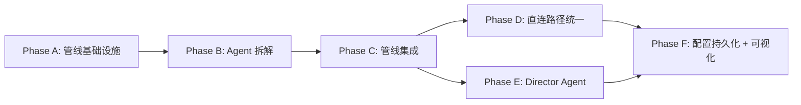

# 黑板架构 + 声明式管线设计

> **文档状态**：架构决策已确认，待实施。
> **前置文档**：[director-ai-memory-system-design.md](director-ai-memory-system-design.md)（Director AI 四层协作架构）
> **替代范围**：本文替代 `executePipeline()` 的硬编码管线实现，不影响 Director AI 的功能设计。
> **术语说明**：本文中的"Agent"指管线执行节点，不等于"AI 智能体"。部分 Agent 内部调用 LLM，部分是纯计算/数据处理。

---

## 1. 设计决策摘要

| 决策项        | 方案                                                                 |
| ------------- | -------------------------------------------------------------------- |
| 管线架构      | **黑板 + 声明式 Agent 描述符 + 拓扑排序编排器**                      |
| 否决方案      | ❌ Director Tool Calling（LLM 调度确定性流程 = 用错工具）             |
| 否决方案      | ❌ 可视化节点编辑器（开发成本高，用户门槛高，可在此架构之上远期追加） |
| Director 定位 | **编剧**（写入剧情指令），不是**调度员**（不调用工具编排管线）       |
| 依赖管理      | Agent 声明 `requires` / `produces`，编排器自动推导执行顺序           |
| 扩展机制      | 注册新 Agent 即可，零修改现有代码                                    |
| 向后兼容      | 无（项目未上线，直接替换 `executePipeline()`）                       |

---

## 2. 问题诊断

### 2.1 当前管线的线性数据依赖

当前 `executePipeline()` 是一个 ~700 行的大函数，硬编码了 6 个 Phase：

```
Phase 0: EntityAccessor 构建
   ↓ entityAccessor, aliasMap
Phase 1: Parser AI → ruleScript
   ↓ ruleScript
Phase 2a: TriggerPipeline → preResultFrame
Phase 2b: RulesEngine → resultFrame
   ↓ resultFrame, 更新后的 entityAccessor
Phase 3: Buffer - DelayedCommit
   ↓
Phase 4: Narrative AI → narrativeText
   ↓ narrativeText
Phase 4.5: PostProcess → miniSummary + cleanText
   ↓
Phase 5: Commit
```

每一步都**必须**等前一步完成——Narrative AI 不可能在没有 `resultFrame` 的情况下工作。这个依赖关系是**领域本质决定的**，不是架构选择决定的。

### 2.2 当前架构的痛点

| 痛点         | 说明                                                                 |
| ------------ | -------------------------------------------------------------------- |
| **扩展困难** | 新增一种 AI 角色（如 Director）需要修改 `executePipeline()` 的大函数 |
| **无法跳过** | 无 Parser 预设时走完全不同的代码路径，而非管线自动跳过               |
| **无法并行** | 管线完全串行，未来 Emotion AI + BGM AI 等可并行的节点也只能串行      |
| **不可组合** | 管线结构硬编码，无法根据场景切换管线组合                             |

### 2.3 为什么不用 Director Tool Calling

如果把 Director 设计成 Tool Calling 中心：

```
Director LLM: 我要调用 parse_input 工具     → LLM 调用 1（决策）
  → Parser AI 执行                          → LLM 调用 2（执行）
Director LLM: 解析完了，调用 run_engine      → LLM 调用 3（决策）
  → Engine 执行                             → 纯计算
Director LLM: 结算完了，调用 narrate         → LLM 调用 4（决策）
  → Narrator AI 执行                        → LLM 调用 5（执行）
Director LLM: 叙事完了，调用 post_process    → LLM 调用 6（决策）
  → PostProcessor 执行                      → 纯计算

= 6 次 LLM 调用，其中 3 次是 Director 在做 if-then 路由
```

| 问题         | 说明                                                   |
| ------------ | ------------------------------------------------------ |
| **冗余调用** | Director 的 3 次决策调用在做显而易见的路由，不需要 LLM |
| **延迟放大** | 每次 Director 决策增加 1-3 秒延迟，总延迟翻倍          |
| **幻觉风险** | Director 可能跳过步骤、打乱顺序、发明不存在的工具      |
| **成本翻倍** | Director 的 prompt 要包含所有工具描述 + 上下文         |
| **调试困难** | 管线执行路径变成 LLM 输出，不可预测                    |

**核心矛盾**：管线依赖关系是**确定性的**，用非确定性的 LLM 来调度确定性的流程是用错了工具。

---

## 3. 架构设计

### 3.1 核心概念

```
┌─────────────────────────────────────────────────────────────────┐
│                      PipelineBlackboard                         │
│                                                                 │
│  输入层 — 管线启动前填充                                          │
│    playerInput     gameState      memoryData                    │
│    worldConfig     activeNpcs     entityAccessor                │
│                                                                 │
│  Director 层 — 可选，Director Agent 写入                         │
│    plotDirectives?    narrativeHints?    planUpdates?            │
│                                                                 │
│  解析层 — Parser Agent 写入                                      │
│    ruleScript?                                                  │
│                                                                 │
│  结算层 — Engine Agent 写入                                      │
│    resultFrame?     createdNpcs?                                │
│                                                                 │
│  叙事层 — Narrator Agent 写入                                    │
│    narrativeText?                                               │
│                                                                 │
│  后处理层 — PostProcessor 写入                                   │
│    cleanNarrative?   miniSummary?                               │
│                                                                 │
└─────────────────────────────────────────────────────────────────┘
        ▲写           ▲写           ▲写           ▲写
        │              │              │              │
   ┌────┴────┐   ┌────┴────┐   ┌────┴────┐   ┌────┴────┐
   │Director │   │ Parser  │   │Narrator │   │PostProc │
   │ Agent   │   │  Agent  │   │  Agent  │   │  Agent  │
   │         │   │         │   │         │   │         │
   │requires:│   │requires:│   │requires:│   │requires:│
   │ input   │   │ input   │   │ result  │   │ narr.   │
   │ memory  │   │ state   │   │  Frame  │   │  Text   │
   │         │   │         │   │ hints?  │   │         │
   │produces:│   │produces:│   │produces:│   │produces:│
   │ hints   │   │ rule    │   │ narr.   │   │ clean   │
   │ direct. │   │ Script  │   │  Text   │   │ summary │
   │optional │   │         │   │         │   │         │
   └─────────┘   └─────────┘   └─────────┘   └─────────┘
```

**核心思想**：Director 不做调度，只做决策注入。管线依赖关系由代码声明，编排器自动执行。

### 3.2 与现有代码的映射

| 现有代码                       | 黑板架构中的角色        | 改造量          |
| ------------------------------ | ----------------------- | --------------- |
| `VariableContext`              | Blackboard 的子集映射   | 小 — 加几个字段 |
| `executePipeline()` 的各 Phase | 各 Agent 的 `execute()` | 中 — 拆函数     |
| `buildGameStateSnapshot()`     | 黑板初始化时的数据准备  | 零              |
| `buildEntityEffects()`         | 黑板初始化时的数据准备  | 零              |
| `MarkerRegistry`               | Agent 内部使用          | 零              |
| `Preset + MessageAssembler`    | Agent 内部使用          | 零              |
| `AiExecutor`                   | Agent 内部使用          | 零              |
| `EventBus`                     | Agent 完成时发布事件    | 零              |
| `DelayedCommitManager`         | 编排器完成后统一处理    | 小              |
| `StreamSession`                | Narrator Agent 内部使用 | 零              |

> **关键发现**：`VariableContext` 已经是黑板的雏形。它包含 `resultFrame`、`memoryData`、`gameState`、`entityEffects`——这些就是跨 Agent 共享的数据。差别只是目前它是"只读输入"，黑板模式下它变成"可写共享状态"。

---

## 4. 核心类型定义

### 4.1 PipelineBlackboard

```typescript
/**
 * 管线黑板 — Agent 间的共享数据空间
 *
 * 设计原则：
 * - 输入字段在管线启动前填充，不可修改
 * - 产出字段由 Agent 写入，初始为 undefined
 * - 字段名 = Agent 间的契约，添加字段 = 扩展契约
 */
interface PipelineBlackboard {
  // ═══ 输入层（管线启动前填充，不可修改） ═══

  /** 命令 ID */
  readonly commandId: string;

  /** 玩家输入文本 */
  readonly playerInput: string;

  /** AI 配置 */
  readonly aiConfig: AIConfig;

  /** 基础变量上下文（供 Agent 内部构建 VariableContext） */
  readonly baseVariableContext: VariableContext;

  /** 实体数据（用于构建 EntityAccessor） */
  readonly entities?: EntityData[];

  /** 世界配置 */
  readonly worldConfig: WorldConfig;

  /** 行动者 ID */
  readonly actorId: string;

  /** 目标 ID */
  readonly targetId?: string;

  /** 房间 ID（联机模式） */
  readonly roomId?: string;

  /** 预设集合（各 Agent 按需取用） */
  readonly presets: {
    readonly parser?: Preset;
    readonly narrative: Preset;
    readonly director?: Preset;
    readonly summarizer?: Preset;
  };

  /** 流式输出回调 */
  readonly callbacks: {
    readonly onNarrativeChunk?: (chunk: string) => void;
    readonly onNarrativeComplete?: (text: string) => void;
  };

  /** 消息定位信息 */
  readonly messageLocation?: {
    readonly conversationId: string;
    readonly messageId: string;
    readonly messageIndex: number;
  };

  // ═══ EntityAccessor 层（Phase 0 产出） ═══

  /** 实体访问器（Phase 0 构建，后续 Agent 共享读写） */
  entityAccessor?: EntityAccessor;

  /** 实体别名映射 */
  aliasMap?: EntityAliasMap;

  // ═══ Director 层（可选） ═══

  /** 剧情指令 */
  plotDirectives?: PlotDirective[];

  /** 叙事提示 */
  narrativeHints?: string;

  /** 规划更新（回写到 Director 持久化状态） */
  planUpdates?: PlanUpdate[];

  // ═══ 解析层 ═══

  /** 解析后的 RuleScript */
  ruleScript?: RuleScript;

  // ═══ 结算层 ═══

  /** 结算结果帧 */
  resultFrame?: ResultFrame;

  /** 引擎创建的 NPC 数据 */
  createdNpcs?: CreatedNpcData[];

  // ═══ 叙事层 ═══

  /** 叙事文本（完整） */
  narrativeText?: string;

  // ═══ 后处理层 ═══

  /** 清理后的叙事文本 */
  cleanNarrative?: string;

  /** 提取的小总结 */
  miniSummary?: string;

  // ═══ 最终输出 ═══

  /** 最终实体状态（供调用方回写到 Yjs） */
  finalEntityStates?: EntityFinalState[];

  // ═══ 执行跟踪 ═══

  /** Agent 执行跟踪记录 */
  _trace: AgentTraceEntry[];
}

/**
 * Agent 执行跟踪条目
 */
interface AgentTraceEntry {
  /** Agent ID */
  agentId: string;
  /** Agent 名称 */
  agentName: string;
  /** 执行开始时间 */
  startedAt: number;
  /** 执行结束时间 */
  completedAt: number;
  /** 是否成功 */
  success: boolean;
  /** 是否被跳过 */
  skipped: boolean;
  /** 跳过原因 */
  skipReason?: string;
  /** 错误信息 */
  error?: string;
  /** 写入的黑板字段 */
  producedFields: string[];
}
```

### 4.2 AgentDescriptor

```typescript
/**
 * Agent 描述符 — 声明依赖而非接收调度
 *
 * 每个 Agent 声明：
 * - requires: 执行前黑板上必须已填充的字段
 * - produces: 执行后会写入黑板的字段
 * - optional: 是否可跳过（依赖未满足或执行失败时）
 *
 * 编排器根据 requires/produces 构建 DAG，拓扑排序后执行。
 */
interface AgentDescriptor {
  /** 唯一标识 */
  id: string;

  /** 显示名称 */
  name: string;

  /**
   * 硬依赖：黑板上哪些字段必须已被填充才能激活
   * 编排器检查这些字段是否非 undefined
   */
  requires: (keyof PipelineBlackboard)[];

  /**
   * 产出声明：此 Agent 会向黑板写入哪些字段
   * 编排器据此构建依赖 DAG
   */
  produces: (keyof PipelineBlackboard)[];

  /**
   * 可选 Agent：跳过不影响管线
   * - 依赖未满足时自动跳过
   * - 执行失败时自动跳过（不中断管线）
   */
  optional?: boolean;

  /**
   * 执行函数：读取黑板 → 处理 → 写回黑板
   *
   * Agent 内部可以：
   * - 读取黑板任意字段（不限于 requires）
   * - 写入黑板任意字段（不限于 produces，但应保持声明一致）
   * - 使用现有的 AiExecutor / MessageAssembler / RulesEngine 等
   * - 调用 StreamSession 进行流式输出
   *
   * @throws 抛出异常时：
   *   - optional Agent → 自动跳过，管线继续
   *   - 必须 Agent → 管线终止，返回错误
   */
  execute: (blackboard: PipelineBlackboard) => Promise<void>;
}
```

### 4.3 PipelineOrchestrator

```typescript
/**
 * 管线编排器 — 拓扑排序自动执行
 *
 * 职责：
 * 1. 注册 Agent
 * 2. 根据 requires/produces 构建依赖 DAG
 * 3. 拓扑排序确定执行顺序
 * 4. 按序执行，跳过 optional Agent（依赖未满足或执行失败）
 * 5. 记录执行跟踪
 */
class PipelineOrchestrator {
  private agents: AgentDescriptor[] = [];

  /**
   * 注册 Agent
   */
  register(agent: AgentDescriptor): this;

  /**
   * 执行管线
   *
   * @param initial - 预填充的黑板字段（输入层数据）
   * @returns 填充完成的黑板
   * @throws PipelineError — 必须 Agent 依赖未满足或执行失败
   */
  async execute(initial: PipelineBlackboardInput): Promise<PipelineBlackboard>;

  /**
   * 拓扑排序
   *
   * 算法：Kahn 算法
   * - 根据 requires/produces 交集计算依赖图
   * - 输入层字段（initial 中预填充的）不算依赖
   * - optional Agent 的 produces 也参与排序（如果它执行了，后续 Agent 可以用）
   */
  private topologicalSort(): AgentDescriptor[];
}

/**
 * 管线错误
 */
class PipelineError extends Error {
  constructor(
    message: string,
    public readonly agentId: string,
    public readonly phase: 'dependency' | 'execution',
    public readonly blackboard: Partial<PipelineBlackboard>,
  );
}
```

---

## 5. Agent 实现（对应现有 Phase）

### Agent 总览

| Agent          | 执行类型  | 对应 Phase  | 是否可选 | 说明                                     |
| -------------- | --------- | ----------- | -------- | ---------------------------------------- |
| EntityAccessor | 🔧 纯计算  | Phase 0     | 否       | 从 Yjs 读取实体，注入天赋/装备效果       |
| Director       | 🤖 AI 调用 | 新增        | **是**   | LLM 调用，剧情规划（远期）               |
| Parser         | 🤖 AI 调用 | Phase 1     | 否       | LLM 调用，解析用户输入→RuleScript        |
| Engine         | 🔧 纯计算  | Phase 2a+2b | 否       | TriggerPipeline + RulesEngine 确定性执行 |
| Narrator       | 🤖 AI 调用 | Phase 4     | 否       | LLM 调用，基于 ResultFrame 生成叙事      |
| PostProcessor  | 🔧 纯计算  | Phase 4.5   | **是**   | 正则替换 + 提取 miniSummary              |
| Finalizer      | 🔧 纯计算  | Phase 5     | 否       | 遍历 EntityAccessor 收集最终状态         |

> **7 个 Agent 中只有 3 个涉及 LLM 调用**（Director/Parser/Narrator），其余均为纯数据处理/确定性计算。"Agent"在本文中指管线执行节点，共享统一的 `AgentDescriptor` 接口以获得一致的依赖声明、编排和错误处理能力，不等于"AI 智能体"。

### 5.1 EntityAccessor Agent（Phase 0）

```typescript
const entityAccessorAgent: AgentDescriptor = {
  id: 'entity-accessor',
  name: '实体构建器',
  requires: ['worldConfig'],
  produces: ['entityAccessor', 'aliasMap'],

  async execute(bb) {
    const { entityAccessor, aliasMap, talentIdsByEntityId } =
      buildEntityAccessor(bb.entities ?? [], bb.worldConfig);

    // 注入天赋 shadow tags
    const inventoryQuery = services.getRequired(INVENTORY_QUERY_SERVICE_TOKEN);
    for (const entityId of entityAccessor.getAllEntityIds()) {
      const entity = entityAccessor.getEntityData(entityId);
      if (!entity || entity.type !== 'character') continue;

      const talentIds = talentIdsByEntityId.get(entityId) ?? [];
      if (talentIds.length > 0) {
        applyTalentsToEntity(entity, talentIds, bb.worldConfig);
      }

      const equippedItems = inventoryQuery.getEquippedItems(entityId);
      if (equippedItems.length > 0) {
        applyEquipmentEffectsToEntity(entity, equippedItems);
      }
    }

    bb.entityAccessor = entityAccessor;
    bb.aliasMap = aliasMap;
  },
};
```

### 5.2 Director Agent（可选，远期）

```typescript
const directorAgent: AgentDescriptor = {
  id: 'director',
  name: '导演AI',
  requires: ['playerInput', 'entityAccessor'],
  produces: ['plotDirectives', 'narrativeHints'],
  optional: true, // ← 关键：渐进增强

  async execute(bb) {
    const directorPreset = bb.presets.director;
    if (!directorPreset) return; // 无预设则跳过

    const executor = createAiExecutor(bb.aiConfig);
    const directorContext: VariableContext = {
      ...bb.baseVariableContext,
      worldConfig: bb.worldConfig,
      gameState: buildGameStateSnapshot(bb.entityAccessor!, bb.aliasMap!),
      // memoryData 中包含剧情大纲、NPC 计划等 Director 需要的长期记忆
    };

    const result = await executor.execute({
      preset: directorPreset,
      variableContext: directorContext,
    });

    if (result.success && result.content) {
      const parsed = parseDirectorOutput(result.content);
      bb.plotDirectives = parsed.directives;
      bb.narrativeHints = parsed.hints;
    }
  },
};
```

### 5.3 Parser Agent（Phase 1）

```typescript
const parserAgent: AgentDescriptor = {
  id: 'parser',
  name: '解析AI',
  requires: ['playerInput', 'entityAccessor', 'aliasMap'],
  produces: ['ruleScript'],

  async execute(bb) {
    const parserPreset = bb.presets.parser;
    if (!parserPreset) {
      // 无 parser 预设 → 写入空 ruleScript，Engine 将产出空 resultFrame
      bb.ruleScript = { version: 2, actions: [] };
      return;
    }

    const inventoryData = buildInventoryData(bb.entityAccessor!, bb.aliasMap!);
    const parserContext: VariableContext = {
      ...bb.baseVariableContext,
      worldConfig: bb.worldConfig,
      gameState:
        bb.baseVariableContext.gameState ??
        buildGameStateSnapshot(bb.entityAccessor!, bb.aliasMap!),
      entityEffects: buildEntityEffects(bb.entityAccessor!, bb.aliasMap!),
      operationDefinitions: generateOperationDefinitions({
        worldConfig: bb.worldConfig,
        entities: bb.entities?.map(toEntityInfo),
      }),
      inventoryData,
      // 如果 Director 写入了 plotDirectives，注入到 Parser 上下文
      ...(bb.plotDirectives && {
        plotDirectives: formatDirectivesForParser(bb.plotDirectives),
      }),
    };

    const executor = createAiExecutor(bb.aiConfig);
    let parserResponse = '';
    const parserResult = await executor.execute({
      preset: parserPreset,
      variableContext: parserContext,
      onChunk: (chunk) => { parserResponse += chunk; },
      onComplete: (text) => { parserResponse = text; },
    });

    if (!parserResult.success) {
      throw new Error(
        `解析 AI 调用失败: ${parserResult.error?.message ?? '未知错误'}`
      );
    }

    const parsed = parseRuleScriptFromResponse(
      parserResult.content ?? parserResponse
    );
    if (!parsed) {
      throw new Error(
        '解析 AI 未返回有效的 RuleScript（JSON 解析失败或格式不符）'
      );
    }

    bb.ruleScript = parsed;
  },
};
```

### 5.4 Engine Agent（Phase 2a + 2b）

```typescript
const engineAgent: AgentDescriptor = {
  id: 'engine',
  name: '规则引擎',
  requires: ['ruleScript', 'entityAccessor', 'aliasMap'],
  produces: ['resultFrame', 'createdNpcs'],

  async execute(bb) {
    const seed = Date.now();

    // 消费操作日志
    const operationLogFrames = useOperationLogStore.getState().consumeAll();

    // Phase 2a: TriggerPipeline（回合前触发器）
    let preResultFrame: ResultFrame | undefined;
    try {
      const triggerResult = executeTurnStartTriggers(
        bb.worldConfig,
        bb.entityAccessor!,
        {
          worldConfig: bb.worldConfig,
          seed,
          entities: bb.entityAccessor!,
          commandId: bb.commandId,
          aliasMap: bb.aliasMap!,
        }
      );

      preResultFrame = triggerResult.resultFrame;

      if (triggerResult.resultFrame) {
        applyValueChangesToAccessor(
          bb.entityAccessor!,
          triggerResult.resultFrame.valueChanges
        );
      }

      if (triggerResult.tagChanges.length > 0) {
        applyTagChangesToAccessor(bb.entityAccessor!, triggerResult.tagChanges);
      }
    } catch (error) {
      console.warn('[Pipeline] TriggerPipeline 执行异常:', error);
    }

    // Phase 2b: RulesEngine
    const executionContext: ExecutionContext = {
      worldConfig: bb.worldConfig,
      seed,
      entities: bb.entityAccessor!,
      actorId: bb.actorId,
      targetId: bb.targetId,
      commandId: bb.commandId,
      aliasMap: bb.aliasMap!,
    };

    const executionResult = rulesEngine.execute(bb.ruleScript!, executionContext);

    if (!executionResult.success || !executionResult.resultFrame) {
      throw new Error(
        `规则执行失败: ${executionResult.error ?? '未生成 ResultFrame'}`
      );
    }

    // 写回变更
    if (executionResult.tagChanges?.length) {
      applyTagChangesToAccessor(bb.entityAccessor!, executionResult.tagChanges);
    }
    if (executionResult.resultFrame.valueChanges.length > 0) {
      applyValueChangesToAccessor(
        bb.entityAccessor!,
        executionResult.resultFrame.valueChanges
      );
    }

    bb.createdNpcs = executionResult.createdNpcs;
    bb.resultFrame = mergeAllResultFrames(
      operationLogFrames,
      preResultFrame,
      executionResult.resultFrame
    );
  },
};
```

### 5.5 Narrator Agent（Phase 4）

```typescript
const narratorAgent: AgentDescriptor = {
  id: 'narrator',
  name: '叙事AI',
  requires: ['resultFrame', 'entityAccessor', 'aliasMap'],
  produces: ['narrativeText'],

  async execute(bb) {
    const narrativeInventoryData = buildInventoryData(
      bb.entityAccessor!,
      bb.aliasMap!
    );
    const narrativeContext: VariableContext = {
      ...bb.baseVariableContext,
      worldConfig: bb.worldConfig,
      resultFrame: bb.resultFrame,
      gameState: buildGameStateSnapshot(bb.entityAccessor!, bb.aliasMap!),
      entityEffects: buildEntityEffects(bb.entityAccessor!, bb.aliasMap!),
      entityDisplayNames: bb.aliasMap!.displayNames,
      inventoryData: narrativeInventoryData,
      // Director 的叙事提示——有就注入，没有也行（软依赖）
      ...(bb.narrativeHints && { narrativeHints: bb.narrativeHints }),
    };

    const executor = createAiExecutor(bb.aiConfig);
    let narrativeText = '';
    const narrativeResult = await executor.execute({
      preset: bb.presets.narrative,
      variableContext: narrativeContext,
      onChunk: (chunk) => {
        narrativeText += chunk;
        bb.callbacks.onNarrativeChunk?.(chunk);
      },
      onComplete: (text) => {
        narrativeText = text;
      },
    });

    if (!narrativeResult.success) {
      throw new Error(
        `叙事 AI 调用失败: ${narrativeResult.error?.message ?? '未知错误'}`
      );
    }

    bb.narrativeText = narrativeText;
    bb.callbacks.onNarrativeComplete?.(narrativeText);
  },
};
```

### 5.6 PostProcessor Agent（Phase 4.5）

```typescript
const postProcessorAgent: AgentDescriptor = {
  id: 'post-processor',
  name: '后处理器',
  requires: ['narrativeText'],
  produces: ['cleanNarrative', 'miniSummary'],
  optional: true, // 后处理失败不阻塞管线

  async execute(bb) {
    const postProcessResult = postProcessForPersist(
      bb.narrativeText!,
      bb.presets.narrative.postProcessRules
    );

    bb.cleanNarrative = postProcessResult.text;

    const miniSummaryContent =
      postProcessResult.extracted['miniSummary']?.join('\n');
    if (miniSummaryContent) {
      bb.miniSummary = miniSummaryContent;

      // 分发小总结命令
      if (bb.messageLocation) {
        commandBus.dispatch({
          type: MemoryCommands.ADD_MINI_SUMMARY,
          payload: {
            conversationId: bb.messageLocation.conversationId,
            messageId: bb.messageLocation.messageId,
            messageIndex: bb.messageLocation.messageIndex,
            content: miniSummaryContent,
          },
        });
      }
    }
  },
};
```

### 5.7 Finalizer Agent（Phase 5）

```typescript
const finalizerAgent: AgentDescriptor = {
  id: 'finalizer',
  name: '状态提交',
  requires: ['entityAccessor'],
  produces: ['finalEntityStates'],

  async execute(bb) {
    const finalEntityStates: EntityFinalState[] = [];
    for (const entityId of bb.entityAccessor!.getAllEntityIds()) {
      const fields = bb.entityAccessor!.getAllFields(entityId);
      const tags = bb.entityAccessor!.getTagsWithMetadata(entityId);
      if (fields) {
        finalEntityStates.push({
          id: entityId,
          fields,
          tags: filterTagsForPersistence(tags),
        });
      }
    }
    bb.finalEntityStates = finalEntityStates;
  },
};
```

---

## 6. 编排器实现

### 6.1 拓扑排序算法

```typescript
class PipelineOrchestrator {
  private agents: AgentDescriptor[] = [];

  register(agent: AgentDescriptor): this {
    this.agents.push(agent);
    return this;
  }

  async execute(
    initial: PipelineBlackboardInput
  ): Promise<PipelineBlackboard> {
    const bb: PipelineBlackboard = {
      ...initial,
      _trace: [],
    };

    // 收集初始已填充的字段
    const filledFields = new Set<string>(
      Object.entries(bb)
        .filter(([, v]) => v !== undefined)
        .map(([k]) => k)
    );

    const order = this.topologicalSort();

    for (const agent of order) {
      const traceEntry: AgentTraceEntry = {
        agentId: agent.id,
        agentName: agent.name,
        startedAt: performance.now(),
        completedAt: 0,
        success: false,
        skipped: false,
        producedFields: [],
      };

      // 检查依赖是否满足
      const unmetDeps = agent.requires.filter(
        (k) => !filledFields.has(k as string)
      );

      if (unmetDeps.length > 0) {
        if (agent.optional) {
          traceEntry.skipped = true;
          traceEntry.skipReason =
            `依赖未满足: ${unmetDeps.join(', ')}`;
          traceEntry.completedAt = performance.now();
          bb._trace.push(traceEntry);
          continue;
        }
        throw new PipelineError(
          `Agent "${agent.name}" 依赖未满足: ${unmetDeps.join(', ')}`,
          agent.id,
          'dependency',
          bb
        );
      }

      try {
        await agent.execute(bb);
        traceEntry.success = true;

        // 记录实际写入的字段
        for (const field of agent.produces) {
          if (bb[field] !== undefined) {
            filledFields.add(field as string);
            traceEntry.producedFields.push(field as string);
          }
        }
      } catch (error) {
        traceEntry.error =
          error instanceof Error ? error.message : String(error);

        if (agent.optional) {
          traceEntry.skipped = true;
          traceEntry.skipReason = `执行失败: ${traceEntry.error}`;
          console.warn(
            `[Pipeline] 可选 Agent "${agent.name}" 失败，跳过:`,
            traceEntry.error
          );
        } else {
          traceEntry.completedAt = performance.now();
          bb._trace.push(traceEntry);
          throw new PipelineError(
            `Agent "${agent.name}" 执行失败: ${traceEntry.error}`,
            agent.id,
            'execution',
            bb
          );
        }
      }

      traceEntry.completedAt = performance.now();
      bb._trace.push(traceEntry);
    }

    return bb;
  }

  private topologicalSort(): AgentDescriptor[] {
    // 构建 producerOf 映射：field → agentId
    const producerOf = new Map<string, string>();
    const agentMap = new Map<string, AgentDescriptor>();

    for (const agent of this.agents) {
      agentMap.set(agent.id, agent);
      for (const field of agent.produces) {
        producerOf.set(field as string, agent.id);
      }
    }

    // 构建邻接表和入度
    const graph = new Map<string, Set<string>>();
    const inDegree = new Map<string, number>();

    for (const agent of this.agents) {
      graph.set(agent.id, new Set());
      inDegree.set(agent.id, 0);
    }

    for (const agent of this.agents) {
      for (const field of agent.requires) {
        const producer = producerOf.get(field as string);
        if (producer && producer !== agent.id) {
          graph.get(producer)!.add(agent.id);
          inDegree.set(
            agent.id,
            (inDegree.get(agent.id) ?? 0) + 1
          );
        }
      }
    }

    // Kahn 算法
    const queue = [...inDegree.entries()]
      .filter(([, deg]) => deg === 0)
      .map(([id]) => id);
    const result: AgentDescriptor[] = [];

    while (queue.length > 0) {
      const id = queue.shift()!;
      result.push(agentMap.get(id)!);
      for (const neighbor of graph.get(id) ?? []) {
        const newDeg = (inDegree.get(neighbor) ?? 1) - 1;
        inDegree.set(neighbor, newDeg);
        if (newDeg === 0) queue.push(neighbor);
      }
    }

    if (result.length !== this.agents.length) {
      const missing = this.agents
        .filter((a) => !result.includes(a))
        .map((a) => a.id);
      throw new Error(`管线存在循环依赖: ${missing.join(', ')}`);
    }

    return result;
  }
}
```

### 6.2 使用方式

```typescript
// 在 game 模块初始化时构建管线
function createPipeline(options?: {
  directorEnabled?: boolean;
}): PipelineOrchestrator {
  const orchestrator = new PipelineOrchestrator();

  // 必须 Agent
  orchestrator.register(entityAccessorAgent);
  orchestrator.register(parserAgent);
  orchestrator.register(engineAgent);
  orchestrator.register(narratorAgent);
  orchestrator.register(postProcessorAgent);
  orchestrator.register(finalizerAgent);

  // 可选 Agent
  if (options?.directorEnabled) {
    orchestrator.register(directorAgent);
  }

  return orchestrator;
}

// IrnrPipelineServiceImpl 中使用
class IrnrPipelineServiceImpl implements IrnrPipelineServiceContract {
  async runSolo(input: SoloIrnrInput): Promise<IrnrPipelineResult> {
    const pipeline = createPipeline({
      directorEnabled: !!input.presets?.director,
    });

    try {
      const bb = await pipeline.execute({
        commandId: input.commandId,
        playerInput: input.userInput,
        aiConfig: input.aiConfig,
        baseVariableContext: input.baseVariableContext,
        entities: input.entities,
        worldConfig: input.worldConfig ?? getRuntimeWorldConfig(),
        actorId: input.actorId ?? '',
        targetId: input.targetId,
        presets: {
          parser: input.parserPreset,
          narrative: input.narrativePreset,
          director: input.directorPreset,
        },
        callbacks: {
          onNarrativeChunk: input.onNarrativeChunk,
          onNarrativeComplete: input.onNarrativeComplete,
        },
        messageLocation: input.conversationId
          ? {
              conversationId: input.conversationId,
              messageId: input.messageId!,
              messageIndex: input.messageIndex!,
            }
          : undefined,
      });

      return {
        success: true,
        ruleScript: bb.ruleScript,
        resultFrame: bb.resultFrame,
        narrativeText: bb.cleanNarrative ?? bb.narrativeText,
        finalEntityStates: bb.finalEntityStates,
        createdNpcs: bb.createdNpcs,
      };
    } catch (error) {
      if (error instanceof PipelineError) {
        return {
          success: false,
          error: error.message,
          ruleScript: error.blackboard.ruleScript as RuleScript | undefined,
          resultFrame: error.blackboard.resultFrame as
            | ResultFrame
            | undefined,
        };
      }
      throw error;
    }
  }
}
```

---

## 7. 关键设计决策详解

### 7.1 软依赖 vs 硬依赖

Agent 只声明硬依赖（`requires`），软依赖通过运行时检查实现：

```typescript
// Narrator 的 execute 函数中
const narrativeContext: VariableContext = {
  ...bb.baseVariableContext,
  resultFrame: bb.resultFrame,          // 硬依赖，requires 声明，必有
  gameState: bb.gameState,              // 硬依赖，requires 声明，必有

  // 软依赖——有就用，没有也行
  // Director 未启用时这些字段是 undefined，Narrator 忽略即可
  narrativeHints: bb.narrativeHints,    // Director 的叙事提示
};
```

- **没有 Director**：Parser 和 Narrator 正常工作
- **有 Director**：plotDirectives 自动注入 Parser，narrativeHints 自动注入 Narrator
- **未来新增情感 AI**：往黑板写情感分析结果，Narrator 如果认识就用

### 7.2 Director 的管线短路能力

NPC 主动对话等场景，Director 可以跳过 Parser：

```typescript
const directorAgent: AgentDescriptor = {
  id: 'director',
  produces: ['plotDirectives', 'narrativeHints', 'ruleScript'], // ← 注意：也可以产出 ruleScript
  async execute(bb) {
    const plan = await runDirectorLLM(bb);

    if (plan.type === 'npc_initiated_dialog') {
      // 纯剧情回合，不需要解析玩家行动
      // 直接写入空 RuleScript，Parser 会被跳过
      bb.ruleScript = { version: 2, actions: [] };
      bb.narrativeHints = plan.dialogContent;
    } else {
      bb.plotDirectives = plan.directives;
    }
  },
};
```

编排器检测到 `ruleScript` 已被填充，Parser 的依赖"已满足"（因为 `ruleScript` 在 `filledFields` 中），Parser 的 execute 函数检查到 `bb.ruleScript` 已存在则直接返回——**零特殊逻辑**。

> **注意**：TriggerPipeline 在 Engine Agent 中执行，即使 Director 跳过了 Parser，回合开始触发器（tag 到期、buff 倒计时等）仍然正常运行。

### 7.3 并行执行的自然发现

当前所有 Agent 是串行执行的，但拓扑排序天然发现同层可并行的节点：

```
拓扑排序后的执行层级：

Layer 0: [EntityAccessor]            ← 基础构建
Layer 1: [Director]                  ← 可选，独立执行
Layer 2: [Parser]                    ← 依赖 Director 的产出（或跳过）
Layer 3: [Engine]                    ← 依赖 Parser
Layer 4: [Narrator]                  ← 依赖 resultFrame
Layer 5: [PostProcessor, Finalizer]  ← 可并行！
```

如果未来加入 Emotion AI 和 BGM 选择 AI：

```
Layer 4: [Narrator, EmotionAI, BgmSelector]  ← 都只依赖 resultFrame，可并行
Layer 5: [PostProcessor, Finalizer]
```

编排器自动发现它们同层，未来可并行执行——不需要手动编排。当前阶段保持串行（简单可靠），远期可将同层 Agent 包装为 `Promise.allSettled()` 并行执行。

### 7.4 流式输出处理

黑板中 `narrativeText` 存最终结果，但 Agent 的 execute 函数内部仍然使用流式回调做实时推送：

```typescript
async execute(bb) {
  // 流式推送到 UI（不经过黑板）
  const onChunk = bb.callbacks.onNarrativeChunk;

  // 最终结果写入黑板（供 PostProcessor 使用）
  bb.narrativeText = await narrativeExecutor.execute({
    preset, context, onChunk
  });
}
```

黑板只负责 Agent 间的数据传递，不替代 Agent 内部的实时流式输出。

### 7.5 取消/中断机制

编排器在每个 Agent 执行前检查 AbortSignal：

```typescript
// 可以扩展 PipelineBlackboard 增加 abortSignal
interface PipelineBlackboard {
  readonly abortSignal?: AbortSignal;
  // ...
}

// 编排器中
for (const agent of order) {
  if (bb.abortSignal?.aborted) {
    // 中断 → 不 commit，已有 DelayedCommitManager 保护
    break;
  }
  // ... 执行 Agent
}
```

### 7.6 管线配置持久化（远期）

声明式管线的一个额外好处是管线配置可以作为预设的一部分持久化和分享：

```typescript
interface PipelineConfig {
  /** 启用的 Agent ID 列表 + 覆盖参数 */
  agents: AgentRef[];
}

interface Preset {
  // ...现有字段
  /** 管线配置（可选，默认使用标准管线） */
  pipelineConfig?: PipelineConfig;
}
```

用户可以创建"轻量叙事预设"（跳过 Parser/Engine）和"完整 TRPG 预设"（全管线），而不需要修改代码。

---

## 8. 目录结构

```
src/core/pipeline/
├── types.ts              # PipelineBlackboard, AgentDescriptor, AgentTraceEntry
├── orchestrator.ts       # PipelineOrchestrator 实现
├── errors.ts             # PipelineError
└── index.ts              # 导出

src/modules/game/agents/
├── entity-accessor.ts    # EntityAccessor Agent（Phase 0）
├── parser.ts             # Parser Agent（Phase 1）
├── engine.ts             # Engine Agent（Phase 2a + 2b）
├── narrator.ts           # Narrator Agent（Phase 4）
├── post-processor.ts     # PostProcessor Agent（Phase 4.5）
├── finalizer.ts          # Finalizer Agent（Phase 5）
└── index.ts              # 导出 + createPipeline() 工厂

src/modules/director/agents/  # 远期
├── director.ts           # Director Agent
└── index.ts
```

- `src/core/pipeline/` — 通用管线基础设施，不依赖任何业务模块
- `src/modules/game/agents/` — 游戏管线的具体 Agent 实现，从 `executePipeline()` 拆解而来
- `src/modules/director/agents/` — Director Agent（远期，独立模块）

---

## 9. 与现有设计文档的关系

### 9.1 与 Director AI 设计的关系

[director-ai-memory-system-design.md](director-ai-memory-system-design.md) 中的四层 AI 协作架构保持不变：

| 原文档描述                                           | 黑板架构中的实现                                                                 |
| ---------------------------------------------------- | -------------------------------------------------------------------------------- |
| Director AI 作为 IRNR 管道的前置阶段                 | Director Agent，`optional: true`                                                 |
| PlotDirectives + NarrativeHints 通过 Marker/变量注入 | 写入 `bb.plotDirectives` / `bb.narrativeHints`，Agent 内部注入到 VariableContext |
| 每回合调用                                           | Director Agent 在拓扑排序中排在 Parser 之前                                      |
| 预留 Marker 条目                                     | 不变，仍然通过 `plotDirectives` / `narrativeHints` Marker 注入 prompt            |
| AI Profile 多角色绑定                                | `bb.presets.director` 可绑定独立 AIProfile                                       |

**本文不改变 Director AI 的功能设计，只改变它的集成方式**——从"修改 executePipeline() 插入新 Phase"变为"注册一个 AgentDescriptor"。

### 9.2 与 NPC 设计的关系

[npc-full-entity-design.md](npc-full-entity-design.md) 中的 NPC 系统不受本设计影响。NPC 的行为仍然由 Parser AI 代理推演。

远期如果要实现 NPC 独立 Agent 化，可以：

```typescript
const npcAgent: AgentDescriptor = {
  id: 'npc-autonomous',
  name: 'NPC自主决策',
  requires: ['entityAccessor', 'resultFrame'],
  produces: ['npcDecisions'],
  optional: true,
  async execute(bb) {
    // 为每个高优先级 NPC 独立调用 AI
    // 低优先级 NPC 仍由 Narrator 代演
  },
};
```

### 9.3 与 RuleScript v2 的关系

[rulescript-v2-definitive-design.md](rulescript-v2-definitive-design.md) 中的 RuleScript 格式和 ActionSchema 系统完全不受影响。Engine Agent 内部使用的 `rulesEngine.execute()` 和 `ActionSchemaRegistry` 保持原样。

---

## 10. 分阶段实施计划

> 由于项目未上线，不需要考虑旧数据兼容与迁移。直接替换 `executePipeline()` 即可。

### Phase A：管线基础设施（核心骨架）

目标：建立 `PipelineBlackboard` + `AgentDescriptor` + `PipelineOrchestrator` 的核心框架，不改变任何现有行为。

| 步骤 | 任务                                                                          | 涉及文件                            | 验证方式                                              |
| ---- | ----------------------------------------------------------------------------- | ----------------------------------- | ----------------------------------------------------- |
| A.1  | 创建 `PipelineBlackboard` 接口                                                | `src/core/pipeline/types.ts`        | 类型编译通过                                          |
| A.2  | 创建 `AgentDescriptor` 接口                                                   | `src/core/pipeline/types.ts`        | 类型编译通过                                          |
| A.3  | 创建 `AgentTraceEntry` 接口                                                   | `src/core/pipeline/types.ts`        | 类型编译通过                                          |
| A.4  | 创建 `PipelineError` 错误类                                                   | `src/core/pipeline/errors.ts`       | 单元测试                                              |
| A.5  | 实现 `PipelineOrchestrator`（拓扑排序 + 依赖检查 + optional 跳过 + 执行跟踪） | `src/core/pipeline/orchestrator.ts` | 单元测试：依赖排序、optional 跳过、循环检测、错误传播 |
| A.6  | 创建 `src/core/pipeline/index.ts` 聚合导出                                    | `src/core/pipeline/index.ts`        | 编译通过                                              |

**产出**：`src/core/pipeline/` 目录，纯基础设施代码，不依赖任何业务模块。

#### Phase A 实施记录

> **实施状态**：✅ 已完成
> **实施日期**：2026-02-26

**实际实现与设计差异**：

| #   | 设计文档                                                                                          | 实际实现                                                                                                                                                            | 原因                                                                                                                                         |
| --- | ------------------------------------------------------------------------------------------------- | ------------------------------------------------------------------------------------------------------------------------------------------------------------------- | -------------------------------------------------------------------------------------------------------------------------------------------- |
| D1  | `PipelineBlackboard` 定义为包含 20+ 业务字段的具体接口（§4.1），放在 `src/core/pipeline/types.ts` | 拆分为泛型 `BlackboardBase`（仅含 `_trace` + `abortSignal`）放在 `core/pipeline/types.ts`；具体 `PipelineBlackboard` 接口留给 Phase B 在 `src/domain/types/` 中定义 | `src/core/` 是基础设施层，不能依赖业务类型（`AIConfig`、`WorldConfig` 等来自 `@/lib/`、`@/domain/`）。泛型设计使管线框架可复用于任意黑板类型 |
| D2  | `AgentDescriptor` 和 `PipelineOrchestrator` 非泛型                                                | 泛型化为 `AgentDescriptor<T extends BlackboardBase>` 和 `PipelineOrchestrator<T extends BlackboardBase>`                                                            | 对应 D1 的分层决策，保持类型安全的同时不引入业务依赖                                                                                         |
| D3  | `requires: (keyof PipelineBlackboard)[]`                                                          | `requires: (keyof T & string)[]`                                                                                                                                    | `& string` 确保键在运行时可用作 `Map` / `Set` 的 key（排除 `symbol` 和 `number`）                                                            |
| D4  | `PipelineOrchestrator.register()` 无重复检查                                                      | 增加 Agent ID 唯一性检查，重复注册时抛出 Error                                                                                                                      | 防御性编程，避免静默覆盖导致的调试困难                                                                                                       |
| D5  | §6.1 中 `producerOf.set(field, agent.id)` 后注册者覆盖先注册者                                    | 使用 `if (!producerOf.has(field))` 先注册者优先                                                                                                                     | 修复设计文档伪代码与文档注释（"第一个注册的优先"）的不一致                                                                                   |
| D6  | §6.1 中邻接表 `add` 无去重，可能导致入度重复计算                                                  | 增加 `!neighbors.has(agent.id)` 去重检查                                                                                                                            | 修复设计文档中 Kahn 算法的入度计算 bug                                                                                                       |
| D7  | §7.5 AbortSignal 取消后 `break` 终止循环                                                          | 取消后 `continue` 逐个标记剩余 Agent 为 skipped 并记录到 `_trace`                                                                                                   | 提供完整的执行跟踪记录，便于调试取消场景                                                                                                     |
| D8  | `PipelineError` 定义在 §4.3 编排器类内部                                                          | 拆为独立文件 `src/core/pipeline/errors.ts`                                                                                                                          | 更好的模块组织，与项目 `core/` 下其他模块的文件结构一致                                                                                      |
| D9  | 无 `BlackboardInput` 类型辅助                                                                     | 新增 `BlackboardInput<T> = Omit<T, "_trace">` 并导出                                                                                                                | 为调用方提供类型安全保障（无需手动构造 `_trace`）                                                                                            |
| D10 | 无 `getAgents()` 方法                                                                             | 新增只读的 `getAgents()` 方法                                                                                                                                       | 便于测试和调试                                                                                                                               |
| D11 | `filledFields` 收集黑板所有非 undefined 字段                                                      | 排除 `_trace` 和 `abortSignal` 等编排器内部字段                                                                                                                     | 防止 Agent 错误声明对内部字段的依赖                                                                                                          |

**目录结构调整**：

设计文档中 §8 的目录结构保持不变，但 `types.ts` 的内容分层如下：

```
src/core/pipeline/types.ts        → BlackboardBase, AgentDescriptor<T>, AgentTraceEntry（泛型，无业务依赖）
src/domain/types/pipeline-blackboard.ts  → PipelineBlackboard（Phase B 创建，包含具体业务字段）
```

### Phase B：Agent 拆解（从大函数到独立节点）

目标：将 `executePipeline()` 的 6 个 Phase 拆解为 6 个独立的 Agent，每个 Agent 可独立测试。

| 步骤 | 任务                                        | 涉及文件                                     | 从何处拆出                                    |
| ---- | ------------------------------------------- | -------------------------------------------- | --------------------------------------------- |
| B.1  | 拆出 EntityAccessor Agent                   | `src/modules/game/agents/entity-accessor.ts` | `executePipeline()` Phase 0（行 159-198）     |
| B.2  | 拆出 Parser Agent                           | `src/modules/game/agents/parser.ts`          | `executePipeline()` Phase 1（行 222-281）     |
| B.3  | 拆出 Engine Agent                           | `src/modules/game/agents/engine.ts`          | `executePipeline()` Phase 2a+2b（行 288-509） |
| B.4  | 拆出 Narrator Agent                         | `src/modules/game/agents/narrator.ts`        | `executePipeline()` Phase 4（行 526-631）     |
| B.5  | 拆出 PostProcessor Agent                    | `src/modules/game/agents/post-processor.ts`  | `executePipeline()` Phase 4.5（行 567-618）   |
| B.6  | 拆出 Finalizer Agent                        | `src/modules/game/agents/finalizer.ts`       | `executePipeline()` Phase 5（行 634-662）     |
| B.7  | 创建 `createPipeline()` 工厂函数 + 聚合导出 | `src/modules/game/agents/index.ts`           | 新建                                          |

**拆解原则**：
- 每个 Agent 的 `execute()` 函数直接从 `executePipeline()` 对应 Phase 的代码复制+适配
- 将闭包变量替换为黑板字段的读写
- 保持内部逻辑完全不变，只改数据来源和输出目标

**验证**：每个 Agent 编写对应的单元测试，确保输入→输出的行为与原 Phase 一致。

#### Phase B 实施记录

> **实施状态**：✅ 已完成
> **实施日期**：2026-02-26

**实际实现与设计差异**：

| #   | 设计文档                                                                         | 实际实现                                                                                                                                         | 原因                                                                                                                                                |
| --- | -------------------------------------------------------------------------------- | ------------------------------------------------------------------------------------------------------------------------------------------------ | --------------------------------------------------------------------------------------------------------------------------------------------------- |
| D1  | `PipelineBlackboard` 包含所有业务字段（§4.1），放在 `src/core/pipeline/types.ts` | 单独定义在 `src/domain/types/pipeline-blackboard.ts`，继承 Phase A 的泛型 `BlackboardBase`                                                       | 延续 Phase A 的分层决策（`core/` 不依赖业务类型），`PipelineBlackboard` 属于领域层                                                                  |
| D2  | `entityAccessor` 字段类型为具体 `MapEntityAccessor` 或宽接口                     | 使用 `EntityAccessor` 接口，但扩展接口添加了 `getAllFields`/`getAllEntityIds`/`getTagsWithMetadata`/`getEntityData`/`setEntity`/`hasEntity` 方法 | 保持 domain 层不依赖 modules 层实现，同时满足各 Agent 对可变方法的需求                                                                              |
| D3  | 辅助函数直接在各 Agent 文件中使用                                                | 提取到独立文件 `src/modules/game/services/pipeline-helpers.ts`，各 Agent 共享导入                                                                | 避免代码重复，11 个辅助函数（`buildGameStateSnapshot`、`buildEntityEffects` 等）在多个 Agent 间复用                                                 |
| D4  | §5.6 PostProcessor Agent 为 `optional: true`                                     | 改为 `optional: false`，内部用 try-catch 包裹后处理逻辑                                                                                          | 确保 `onNarrativeComplete` 回调始终触发（optional Agent 被编排器跳过时回调会丢失），内部容错等效于 optional 语义                                    |
| D5  | §5.7 Finalizer Agent 仅 `requires: ['entityAccessor']`                           | 改为 `requires: ['entityAccessor', 'resultFrame', 'narrativeText']`                                                                              | 修复拓扑排序下可能早于 Engine/Narrator 执行的 bug，确保采集时点在所有状态变更完成之后                                                               |
| D6  | §5.4 Engine Agent 中 `buildEntityAccessor()` 函数                                | 不存在该函数，Phase 0 使用 `MapEntityAccessor` 无参构造 + `setEntity()` 逐个注入                                                                 | 设计文档的示例代码与实际代码不一致，以实际代码为准                                                                                                  |
| D7  | 原 `executePipeline()` 的 DelayedCommitManager buffer/discard/commit             | 未添加对应 Agent，由管线错误传播机制天然覆盖                                                                                                     | DelayedCommitManager 当前实现仅做状态机标记无实际 side effect，管线中 Narrator 失败→终止→不产出 finalEntityStates→调用方不回写，等效于 discard 语义 |
| D8  | 工厂函数名 `createPipeline()`                                                    | 改为 `createGamePipeline()`                                                                                                                      | 避免与未来通用 `createPipeline` 冲突，明确表达是游戏管线的工厂                                                                                      |

**新增文件清单**：

| 文件                                            | 职责                                       |
| ----------------------------------------------- | ------------------------------------------ |
| `src/domain/types/pipeline-blackboard.ts`       | `PipelineBlackboard` 接口定义              |
| `src/modules/game/services/pipeline-helpers.ts` | 管线辅助函数（从 `irnr-pipeline.ts` 提取） |
| `src/modules/game/agents/entity-accessor.ts`    | EntityAccessor Agent（Phase 0）            |
| `src/modules/game/agents/parser.ts`             | Parser Agent（Phase 1）                    |
| `src/modules/game/agents/engine.ts`             | Engine Agent（Phase 2a + 2b）              |
| `src/modules/game/agents/narrator.ts`           | Narrator Agent（Phase 4）                  |
| `src/modules/game/agents/post-processor.ts`     | PostProcessor Agent（Phase 4.5）           |
| `src/modules/game/agents/finalizer.ts`          | Finalizer Agent（Phase 5）                 |
| `src/modules/game/agents/index.ts`              | 聚合导出 + `createGamePipeline()` 工厂函数 |

**修改文件清单**：

| 文件                         | 变更                                          |
| ---------------------------- | --------------------------------------------- |
| `src/domain/types/entity.ts` | 扩展 `EntityAccessor` 接口，添加 6 个可变方法 |
| `src/domain/types/index.ts`  | 添加 `pipeline-blackboard` 导出               |

### Phase C：管线集成（切换入口）

目标：用 `createPipeline().execute()` 替换 `executePipeline()` 调用，完成架构切换。

| 步骤 | 任务                                                                                                          | 涉及文件                                     |
| ---- | ------------------------------------------------------------------------------------------------------------- | -------------------------------------------- |
| C.1  | 修改 `IrnrPipelineServiceImpl.runSolo()` — 构建 `PipelineBlackboardInput` 并调用 `createPipeline().execute()` | `src/modules/game/services/irnr-pipeline.ts` |
| C.2  | 修改 `IrnrPipelineServiceImpl.runMultiplayer()` — 同上                                                        | `src/modules/game/services/irnr-pipeline.ts` |
| C.3  | 将 `PipelineBlackboard` 的结果映射回 `IrnrPipelineResult`                                                     | `src/modules/game/services/irnr-pipeline.ts` |
| C.4  | 处理 `PipelineError` → `IrnrPipelineResult { success: false }`                                                | `src/modules/game/services/irnr-pipeline.ts` |
| C.5  | 删除旧的 `executePipeline()` 函数及其辅助函数（已迁移到各 Agent 中）                                          | `src/modules/game/services/irnr-pipeline.ts` |

**验证**：
- 端到端测试：单人模式完整流程（有 Parser 预设 + 无 Parser 预设两条路径）
- 端到端测试：联机模式完整流程
- 验证 `_trace` 输出正确记录了每个 Agent 的执行状态

### Phase D：直连路径统一（消除分支代码）

目标：将 Chat Handler 中"有 Parser 预设走 IRNR，无 Parser 走直连"的分支代码统一为管线。

| 步骤 | 任务                                                           | 涉及文件                                              |
| ---- | -------------------------------------------------------------- | ----------------------------------------------------- |
| D.1  | Parser Agent 内部处理"无 Parser 预设"场景——写入空 `ruleScript` | 已在 Phase B.2 中处理                                 |
| D.2  | 修改 `sendMessageHandler` — 移除直连 AI 路径，统一走管线       | `src/modules/chat/commands/handlers.ts`（行 256-340） |
| D.3  | 确保无 Parser 预设时管线行为与原直连路径一致                   | 端到端测试                                            |

**说明**：当前 `sendMessageHandler` 在行 256-258 有一个 `if (hasParserPreset)` 分支。统一后，所有场景都走管线：
- 有 Parser 预设：EntityAccessor → Parser → Engine → Narrator → PostProcessor → Finalizer
- 无 Parser 预设：EntityAccessor → Parser（写入空 ruleScript）→ Engine（产出空 resultFrame）→ Narrator → PostProcessor → Finalizer

### Phase E：Director Agent 集成（远期）

目标：实现 Director Agent 并注册到管线，验证"可选 Agent 渐进增强"的架构能力。

| 步骤 | 任务                                                                 | 涉及文件                                  |
| ---- | -------------------------------------------------------------------- | ----------------------------------------- |
| E.1  | 扩展 `PresetPurpose` 类型 — 添加 `'director'`                        | `src/lib/prompt/types.ts`                 |
| E.2  | 注册 `plotDirectives` / `narrativeHints` Marker 到 `MARKER_REGISTRY` | `src/lib/prompt/marker-registry.ts`       |
| E.3  | 扩展 `VariableContext` — 添加 `plotDirectives?` / `narrativeHints?`  | `src/lib/prompt/types.ts`                 |
| E.4  | 实现 Director Agent                                                  | `src/modules/director/agents/director.ts` |
| E.5  | 在 `createPipeline()` 中条件注册 Director Agent                      | `src/modules/game/agents/index.ts`        |
| E.6  | UI：Director 预设编辑支持                                            | `src/components/PresetWorkspace/`         |

**前置条件**：依赖 [director-ai-memory-system-design.md](director-ai-memory-system-design.md) 中的数据结构定义（`PlotDirective`、`NarrativeHint`、`PlanUpdate` 等）。

### Phase F：管线配置持久化 + 可视化调试（远期）

目标：管线配置可作为预设的一部分持久化和分享；提供管线执行的可视化调试面板。

| 步骤 | 任务                                                    |
| ---- | ------------------------------------------------------- |
| F.1  | 定义 `PipelineConfig` 类型，扩展 `Preset` 接口          |
| F.2  | 实现管线配置的序列化/反序列化                           |
| F.3  | UI：管线 Agent 启用/禁用开关（在预设编辑器中）          |
| F.4  | UI：`_trace` 可视化面板（Agent 执行时间线、字段流转图） |
| F.5  | 考虑同层 Agent 的并行执行（`Promise.allSettled()`）     |

### 阶段依赖关系



### 风险评估

| 阶段    | 风险等级 | 主要风险                               | 缓解措施                                                     |
| ------- | -------- | -------------------------------------- | ------------------------------------------------------------ |
| Phase A | 🟢 低     | 接口设计不合理                         | 先实现再调整，类型定义可以随时重构                           |
| Phase B | 🟡 中     | 拆解时遗漏闭包变量、状态副作用         | 对照原函数逐行比对；为每个 Agent 编写覆盖原 Phase 行为的测试 |
| Phase C | 🟡 中     | 集成后行为不一致                       | 端到端测试覆盖所有路径；保留旧函数作为回退（可临时切换）     |
| Phase D | 🟢 低     | 直连路径的特殊处理遗漏                 | 空 ruleScript + 空 resultFrame 路径需要特别测试              |
| Phase E | 🟡 中     | Director 的 prompt 设计 + 输出格式解析 | 独立于管线架构的问题，可单独迭代                             |
| Phase F | 🟢 低     | UI 工作量                              | 可根据实际需求裁剪                                           |

---

## 11. 总结

### 核心原则

> **确定性的数据流用确定性的代码调度，LLM 只负责它擅长的事——理解语义、生成内容、做创造性决策。Director 不是调度员，是编剧。**

### 架构收益

| 维度         | 改进                                                   |
| ------------ | ------------------------------------------------------ |
| **可扩展性** | 新增 Agent 注册即可，零修改现有代码                    |
| **可调试性** | `_trace` 记录每个 Agent 的执行时间、成功/失败/跳过状态 |
| **可组合性** | 不同预设可组合不同的 Agent 集合                        |
| **渐进增强** | Director Agent `optional: true`，不影响现有流程        |
| **并行潜力** | 拓扑排序自动发现同层可并行节点                         |
| **代码质量** | 700 行大函数拆解为 6 个独立、可测试的 Agent            |
