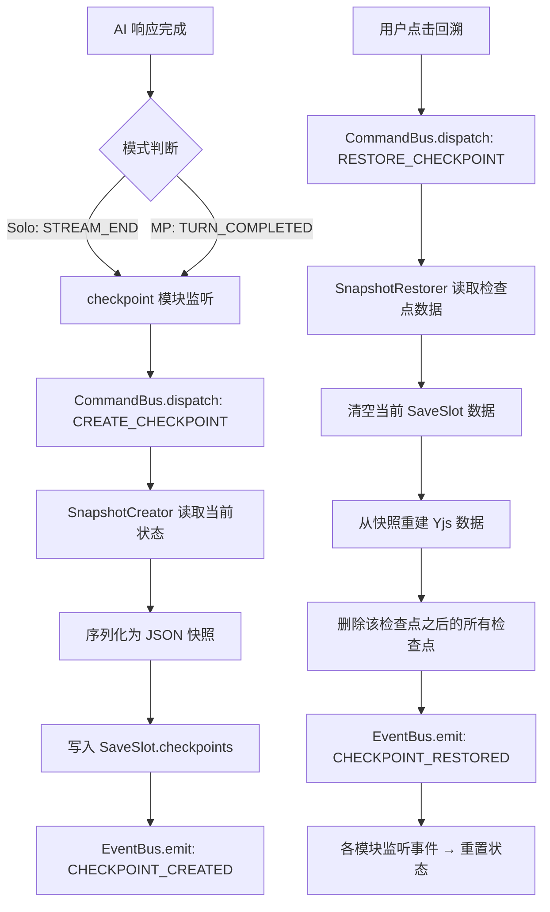

# 检查点系统设计方案

## 1. 概述

检查点系统允许玩家在游戏过程中自动保存状态快照，并在需要时回溯到过去的某个检查点。所有状态数据（消息、角色属性、物品、技能、记忆等）都会恢复到检查点创建时的状态。

### 1.1 核心需求

- **自动创建**：每回合 AI 处理完毕后自动创建检查点
- **手动回溯**：玩家可以选择任意检查点进行回溯
- **完整回滚**：回溯时丢弃检查点之后的所有数据
- **双模式支持**：单人模式 + 联机模式（仅 Host 可操作）
- **不限数量**：检查点数量不做硬限制
- **UI 集成**：在存档管理界面中展示检查点列表

### 1.2 触发时机

| 模式             | 触发事件                    | 说明              |
| ---------------- | --------------------------- | ----------------- |
| 单人 Solo        | `ChatEvents.STREAM_END`     | AI 流式响应完成后 |
| 联机 Multiplayer | `RoomEvents.TURN_COMPLETED` | 回合完成归档后    |

## 2. 数据架构

### 2.1 存储位置

检查点数据存储在 **SaveSlot** 内部，与存档生命周期绑定。

```
root (Y.Map)
└── saves (Y.Map)
    └── {saveId} (Y.Map)  ← 当前存档
        ├── conversations (Y.Map)
        ├── messages (Y.Map<Y.Array>)
        ├── characters (Y.Map<Y.Map>)
        ├── inventories (Y.Map<Y.Array<Y.Map>>)
        ├── skills (Y.Map<Y.Array<Y.Map>>)
        ├── memory (Y.Map)
        ├── gameState (Y.Map)
        └── checkpoints (Y.Array<Checkpoint>)  ← 新增
```

### 2.2 Checkpoint 实体

```typescript
interface Checkpoint {
  /** 检查点 ID */
  id: string;
  /** 创建时间 */
  createdAt: number;
  /** 人类可读标签 */
  label: string;
  /** 触发来源 */
  source: "auto" | "manual";

  // ── 快照数据（JSON 序列化后存储） ──
  /** 会话快照 */
  conversations: Record<string, ConversationSnapshot>;
  /** 消息快照：按 conversationId 分组的消息数组 */
  messages: Record<string, MessageSnapshot[]>;
  /** 角色快照 */
  characters: CharacterSnapshot[];
  /** 物品快照：按 characterId 分组 */
  inventories: Record<string, ItemSnapshot[]>;
  /** 技能快照：按 characterId 分组 */
  skills: Record<string, SkillSnapshot[]>;
  /** 记忆快照 */
  memory: MemorySnapshot;
  /** 游戏状态快照 */
  gameState: Record<string, unknown>;

  // ── 联机模式专用 ──
  /** 当前回合号（联机模式） */
  turnNumber?: number;
  /** 归档回合数量（用于裁剪） */
  archivedTurnCount?: number;
}
```

### 2.3 快照子类型

快照使用纯 JSON 对象存储（从 Yjs 类型序列化而来），便于存储和恢复：

```typescript
/** 会话快照 */
interface ConversationSnapshot {
  id: string;
  title: string;
  createdAt: number;
  updatedAt: number;
  metadata?: Record<string, unknown>;
}

/** 消息快照 */
interface MessageSnapshot {
  id: string;
  role: "user" | "assistant" | "system";
  content: string;
  status?: string;
  createdAt: number;
  updatedAt?: number;
  metadata?: Record<string, unknown>;
  error?: string;
}

/** 角色快照 — 复用 ExportCharacterData 结构 */
type CharacterSnapshot = ExportCharacterData;

/** 物品快照 — 复用 ItemInstance 结构 */
type ItemSnapshot = ItemInstance;

/** 技能快照 — 复用 SkillInstance 结构 */
type SkillSnapshot = SkillInstance;

/** 记忆快照 */
interface MemorySnapshot {
  miniSummaries: Record<string, MiniSummary[]>;
  megaSummaries: Record<string, MegaSummary[]>;
  manualMemories: Record<string, ManualMemory[]>;
}
```

## 3. 模块架构

遵循项目的 DDD + 事件驱动架构，新增 `checkpoint` 模块：

```
src/
├── domain/
│   ├── commands/checkpoint.ts    # 命令定义
│   ├── events/checkpoint.ts      # 事件定义
│   └── entities/checkpoint.ts    # 实体类型
├── modules/
│   └── checkpoint/
│       ├── index.ts              # 模块注册入口
│       ├── handlers.ts           # 命令处理器
│       ├── services/
│       │   ├── snapshot-creator.ts   # 快照创建服务
│       │   └── snapshot-restorer.ts  # 快照恢复服务
│       └── hooks/
│           └── useCheckpoints.ts     # UI Hooks
```

### 3.1 数据流



## 4. 领域层设计

### 4.1 命令定义

```typescript
// src/domain/commands/checkpoint.ts

export const CheckpointCommands = {
  CREATE_CHECKPOINT: "checkpoint.create",
  RESTORE_CHECKPOINT: "checkpoint.restore",
  DELETE_CHECKPOINT: "checkpoint.delete",
} as const;

export interface CreateCheckpointPayload {
  /** 检查点标签（默认自动生成） */
  label?: string;
  /** 来源 */
  source: "auto" | "manual";
}

export interface RestoreCheckpointPayload {
  /** 要恢复的检查点 ID */
  checkpointId: string;
}

export interface DeleteCheckpointPayload {
  /** 要删除的检查点 ID */
  checkpointId: string;
}
```

### 4.2 事件定义

```typescript
// src/domain/events/checkpoint.ts

export const CheckpointEvents = {
  CHECKPOINT_CREATED: "checkpoint.created",
  CHECKPOINT_RESTORED: "checkpoint.restored",
  CHECKPOINT_DELETED: "checkpoint.deleted",
} as const;

export interface CheckpointCreatedPayload {
  checkpointId: string;
  label: string;
  createdAt: number;
  source: "auto" | "manual";
}

export interface CheckpointRestoredPayload {
  checkpointId: string;
  /** 被丢弃的检查点数量 */
  discardedCount: number;
}

export interface CheckpointDeletedPayload {
  checkpointId: string;
}
```

## 5. 核心实现

### 5.1 SnapshotCreator（快照创建服务）

从当前 SaveSlot 的 Yjs 数据中提取完整状态快照：

```typescript
// src/modules/checkpoint/services/snapshot-creator.ts

export function createSnapshot(saveDoc: Y.Map<unknown>): CheckpointData {
  return {
    conversations: extractConversations(saveDoc),
    messages: extractMessages(saveDoc),
    characters: extractCharacters(saveDoc),
    inventories: extractInventories(saveDoc),
    skills: extractSkills(saveDoc),
    memory: extractMemory(saveDoc),
    gameState: extractGameState(saveDoc),
  };
}
```

**提取逻辑**：
- `conversations`：遍历 `saveDoc.get("conversations")` Y.Map，序列化为普通对象
- `messages`：遍历 `saveDoc.get("messages")` Y.Map<Y.Array>，展开为数组
- `characters`：遍历 `saveDoc.get("characters")` Y.Map<Y.Map>，使用 `yMapToCharacter` 解码
- `inventories`：遍历 `saveDoc.get("inventories")` Y.Map<Y.Array<Y.Map>>，使用 `yMapToItemInstance` 解码
- `skills`：遍历 `saveDoc.get("skills")` Y.Map<Y.Array<Y.Map>>，使用 `yMapToSkillInstance` 解码
- `memory`：遍历 `saveDoc.get("memory")` Y.Map 下的三个子 Map
- `gameState`：遍历 `saveDoc.get("gameState")` Y.Map，使用 `.toJSON()` 序列化

### 5.2 SnapshotRestorer（快照恢复服务）

将检查点快照数据写回 SaveSlot：

```typescript
// src/modules/checkpoint/services/snapshot-restorer.ts

export function restoreSnapshot(
  saveDoc: Y.Map<unknown>,
  snapshot: CheckpointData,
  rootDoc: Y.Doc
): void {
  rootDoc.transact(() => {
    // 1. 清空现有数据
    clearSaveDocData(saveDoc);

    // 2. 重建 conversations
    rebuildConversations(saveDoc, snapshot.conversations);

    // 3. 重建 messages
    rebuildMessages(saveDoc, snapshot.messages);

    // 4. 重建 characters
    rebuildCharacters(saveDoc, snapshot.characters);

    // 5. 重建 inventories
    rebuildInventories(saveDoc, snapshot.inventories);

    // 6. 重建 skills
    rebuildSkills(saveDoc, snapshot.skills);

    // 7. 重建 memory
    rebuildMemory(saveDoc, snapshot.memory);

    // 8. 重建 gameState
    rebuildGameState(saveDoc, snapshot.gameState);

    // 9. 更新时间戳
    saveDoc.set("updatedAt", Date.now());
  });
}
```

**关键设计**：
- 使用 `rootDoc.transact()` 包裹所有操作，确保原子性
- 清空操作通过遍历 Y.Map 删除所有 key 实现
- 重建操作使用与创建存档相同的编码器（`characterToYMap`、`itemInstanceToYMap` 等）

### 5.3 CREATE_CHECKPOINT Handler

```typescript
async function createCheckpointHandler(
  command: Command<CreateCheckpointPayload>,
  context: CommandContext
): Promise<CommandResult<string>> {
  const { label, source } = command.payload;
  const saveDoc = yjsManager.getCurrentSave();
  if (!saveDoc) return { success: false, error: "No active save" };

  const rootDoc = yjsManager.getDoc();

  // 1. 创建快照
  const snapshotData = createSnapshot(saveDoc);

  // 2. 构建检查点对象
  const checkpoint: Checkpoint = {
    id: crypto.randomUUID(),
    createdAt: Date.now(),
    label: label || generateAutoLabel(saveDoc),
    source,
    ...snapshotData,
  };

  // 3. 写入 checkpoints 数组
  rootDoc.transact(() => {
    let checkpoints = saveDoc.get("checkpoints") as Y.Array<unknown> | undefined;
    if (!checkpoints) {
      checkpoints = new Y.Array();
      saveDoc.set("checkpoints", checkpoints);
    }
    checkpoints.push([checkpoint]);
  });

  // 4. 发布事件
  eventBus.emit(
    eventBus.createEvent(CheckpointEvents.CHECKPOINT_CREATED, {
      checkpointId: checkpoint.id,
      label: checkpoint.label,
      createdAt: checkpoint.createdAt,
      source,
    })
  );

  return { success: true, data: checkpoint.id };
}
```

### 5.4 RESTORE_CHECKPOINT Handler

```typescript
async function restoreCheckpointHandler(
  command: Command<RestoreCheckpointPayload>,
  context: CommandContext
): Promise<CommandResult<void>> {
  const { checkpointId } = command.payload;
  const saveDoc = yjsManager.getCurrentSave();
  if (!saveDoc) return { success: false, error: "No active save" };

  const rootDoc = yjsManager.getDoc();

  // 1. 查找检查点
  const checkpoints = saveDoc.get("checkpoints") as Y.Array<unknown>;
  if (!checkpoints) return { success: false, error: "No checkpoints" };

  const checkpointIndex = findCheckpointIndex(checkpoints, checkpointId);
  if (checkpointIndex === -1) return { success: false, error: "Checkpoint not found" };

  const checkpoint = checkpoints.get(checkpointIndex) as Checkpoint;

  // 2. 恢复快照
  restoreSnapshot(saveDoc, checkpoint, rootDoc);

  // 3. 删除该检查点之后的所有检查点
  const discardedCount = checkpoints.length - checkpointIndex - 1;
  rootDoc.transact(() => {
    if (discardedCount > 0) {
      checkpoints.delete(checkpointIndex + 1, discardedCount);
    }
  });

  // 4. 发布事件（触发各模块重置）
  eventBus.emit(
    eventBus.createEvent(CheckpointEvents.CHECKPOINT_RESTORED, {
      checkpointId,
      discardedCount,
    })
  );

  // 5. 触发 SAVE_LOADED 事件以重置各模块状态
  const saveId = yjsManager.getCurrentSaveId()!;
  const saveType = yjsManager.getSaveType(saveId);
  eventBus.emit(
    eventBus.createEvent(SaveEvents.SAVE_LOADED, {
      saveId,
      previousSaveId: saveId,
      saveType,
    }),
    { correlationId: context.commandId }
  );

  return { success: true };
}
```

## 6. 模块注册

### 6.1 事件监听

```typescript
// src/modules/checkpoint/index.ts

const manifest: ModuleManifest = {
  id: "lyra.checkpoint",
  version: "0.1.0",
  commands: createCheckpointCommandHandlers(),
  eventHandlers: {
    // 单人模式：AI 流式响应完成后自动创建检查点
    [ChatEvents.STREAM_END]: (_event) => {
      const saveType = getCurrentSaveType();
      if (saveType !== "solo") return; // 联机模式跳过

      commandBus.dispatch({
        type: CheckpointCommands.CREATE_CHECKPOINT,
        payload: { source: "auto" },
      }).catch(console.error);
    },

    // 联机模式：回合完成后自动创建检查点（仅 Host）
    [RoomEvents.TURN_COMPLETED]: (event) => {
      const { turnNumber } = event.payload as TurnCompletedEvent;
      const currentRoom = useRoomStore.getState().currentRoom;
      if (!currentRoom?.isHost) return; // 非 Host 跳过

      commandBus.dispatch({
        type: CheckpointCommands.CREATE_CHECKPOINT,
        payload: {
          source: "auto",
          label: `回合 ${turnNumber} 完成`,
        },
      }).catch(console.error);
    },

    // 存档删除时清理
    [SaveEvents.SAVE_DELETED]: (_event) => {
      // 检查点随存档一起删除，无需额外清理
    },
  },
};
```

### 6.2 注册顺序

```typescript
// src/modules/index.ts

export async function registerAllModules(): Promise<void> {
  await registerSaveModule();
  await registerChatModule();
  await registerMemoryModule();
  await registerDataModule();
  await registerGameModule();
  await registerInventoryModule();
  await registerCheckpointModule(); // ← 新增（在 Chat/Memory/Inventory 之后）
  registerRoomModule();
}
```

## 7. 联机模式特殊处理

### 7.1 权限控制

- **创建检查点**：仅 Host 可触发（通过 `TURN_COMPLETED` 事件中检查 `isHost`）
- **恢复检查点**：仅 Host 可操作（Handler 内校验）
- **查看检查点**：所有玩家可查看列表（只读）

### 7.2 联机运行时回溯流程

联机模式下支持**游戏运行时**回溯，Host 操作后所有 Guest 自动同步：

```
Host 触发回溯
  → 1. 中止正在进行的 AI 调用（如果有）
  → 2. 恢复本地 SaveSlot（同单人模式）
  → 3. 回写 MainDoc.characters（角色属性回滚）
  → 4. 回退 MainDoc.config.currentTurnNumber
  → 5. 清理 HistoryDoc 多余消息和归档回合
  → 6. Hocuspocus 自动同步到所有 Guest
  → 7. Guest 的 SyncBridge 自动更新 UI
  → 8. 发布 CHECKPOINT_RESTORED 事件 → Guest 显示 Toast 通知
```

**联机回溯需要额外处理的数据**：

| 数据           | 存储位置                         | 回溯操作         |
| -------------- | -------------------------------- | ---------------- |
| 角色状态       | MainDoc.characters               | 从快照覆盖写入   |
| 回合号         | MainDoc.config.currentTurnNumber | 回退到检查点值   |
| 消息历史       | HistoryDoc.messages              | 裁剪多余消息     |
| 归档回合       | HistoryDoc.archivedTurns         | 裁剪多余回合     |
| 当前 TurnDoc   | SubdocManager                    | 断开多余 TurnDoc |
| 物品/技能/记忆 | SaveSlot（本地）                 | 同单人模式恢复   |

### 7.3 回溯前置检查

联机回溯时需要确保安全：

1. **中止 AI 调用**：如果 AI 正在处理，先调用 `CANCEL_AI_TURN` 中止
2. **阻止行动提交**：回溯期间暂时禁止玩家提交新行动
3. **检查点快照中记录联机元数据**：`turnNumber`、`messageCount`、`archivedTurnCount`

## 8. UI 设计

### 8.1 集成位置

检查点 UI 同时在**两个位置**提供：

#### A. 游戏界面内（运行时操作）

在聊天界面工具栏新增"检查点"按钮，点击展开检查点面板：

```
┌──────────────────────────────────────────┐
│ 📍 检查点                          [收起] │
├──────────────────────────────────────────┤
│ 📍 回合 5 完成      14:30   [回溯到此]  │
│ 📍 回合 4 完成      14:25   [回溯到此]  │
│ 📍 回合 3 完成      14:20   [回溯到此]  │
│ 📍 回合 2 完成      14:15   [回溯到此]  │
│ 📍 回合 1 完成      14:10   [回溯到此]  │
└──────────────────────────────────────────┘
```

#### B. 存档管理界面（离线浏览）

在 SaveManager 中展示各存档的检查点列表（只读预览 + 回溯入口）。

### 8.2 交互流程

1. 在游戏界面点击「检查点」按钮 → 展开检查点列表
2. 点击某个检查点的「回溯到此」 → 弹出确认对话框
3. 确认对话框显示警告："将丢弃此检查点之后的所有游戏进度，是否继续？"
4. 确认后 → dispatch `RESTORE_CHECKPOINT` 命令
5. 恢复完成 → 界面自动刷新（通过 `SAVE_LOADED` 事件触发各模块重置）
6. 联机模式下，Guest 收到 Toast 通知："Host 已回溯到 [检查点名称]"

### 8.3 Hook API

```typescript
// src/modules/checkpoint/hooks/useCheckpoints.ts

/** 获取当前存档的所有检查点 */
export function useCheckpoints(): Checkpoint[];

/** 获取检查点数量 */
export function useCheckpointCount(): number;
```

## 9. 性能与存储考量

### 9.1 快照大小估算

| 数据类型       | 典型大小     | 说明           |
| -------------- | ------------ | -------------- |
| 会话元数据     | ~100B        | 1-2 个会话     |
| 消息           | ~5-50KB      | 取决于对话轮数 |
| 角色           | ~1-5KB       | 属性、标签等   |
| 物品/技能      | ~1-5KB       | 取决于数量     |
| 记忆           | ~2-10KB      | 小总结、大总结 |
| 游戏状态       | ~1-5KB       | 自定义状态     |
| **单个检查点** | **~10-80KB** | 压缩前         |

### 9.2 优化策略

1. **延迟创建**：检查点在事件触发后异步创建，不阻塞 AI 响应
2. **增量标识**：每个检查点包含 `messageCount` 等摘要信息，避免反序列化所有数据来展示列表
3. **按需加载**：UI 列表只展示元数据（id、label、createdAt），恢复时才读取完整快照
4. **Yjs 事务**：所有写操作包裹在 `transact()` 中，减少事件触发次数

### 9.3 存储上限建议

虽然不做硬限制，但在 UI 层显示提示：
- 当检查点超过 50 个时，提示用户可以手动清理早期检查点
- 每个检查点约 10-80KB，50 个约 0.5-4MB，在 IndexedDB 容量范围内

## 10. 实现步骤

### Step 1: 领域层定义

- 新建 `src/domain/entities/checkpoint.ts`
- 新建 `src/domain/commands/checkpoint.ts`
- 新建 `src/domain/events/checkpoint.ts`

### Step 2: 快照服务

- 新建 `src/modules/checkpoint/services/snapshot-creator.ts`
- 新建 `src/modules/checkpoint/services/snapshot-restorer.ts`

### Step 3: 命令处理器

- 新建 `src/modules/checkpoint/handlers.ts`
- 实现 CREATE_CHECKPOINT / RESTORE_CHECKPOINT / DELETE_CHECKPOINT

### Step 4: 模块入口

- 新建 `src/modules/checkpoint/index.ts`
- 注册事件监听（STREAM_END、TURN_COMPLETED）
- 在 `src/modules/index.ts` 中注册模块

### Step 5: UI Hooks

- 新建 `src/modules/checkpoint/hooks/useCheckpoints.ts`

### Step 6: UI 组件

- 在 `src/components/SaveManager/` 中新增检查点列表和回溯确认对话框

### Step 7: 集成测试

- 验证单人模式下自动创建和回溯
- 验证联机模式下 Host 限制
- 验证回溯后各模块状态正确重置

## 11. 风险与对策

| 风险                 | 影响               | 对策                                 |
| -------------------- | ------------------ | ------------------------------------ |
| 快照数据量过大       | IndexedDB 空间不足 | 监控大小，提供清理入口               |
| Yjs 类型序列化遗漏   | 恢复后数据不完整   | 使用 .toJSON 兜底 + 完备的编解码测试 |
| 恢复后模块状态不同步 | UI 显示旧数据      | 复用 SAVE_LOADED 事件触发全模块重置  |
| 联机模式回溯的一致性 | 其他玩家状态不一致 | 限制为离线回溯，回溯后需创建新房间   |
| 检查点自身数据损坏   | 无法恢复           | 创建时验证快照完整性                 |
