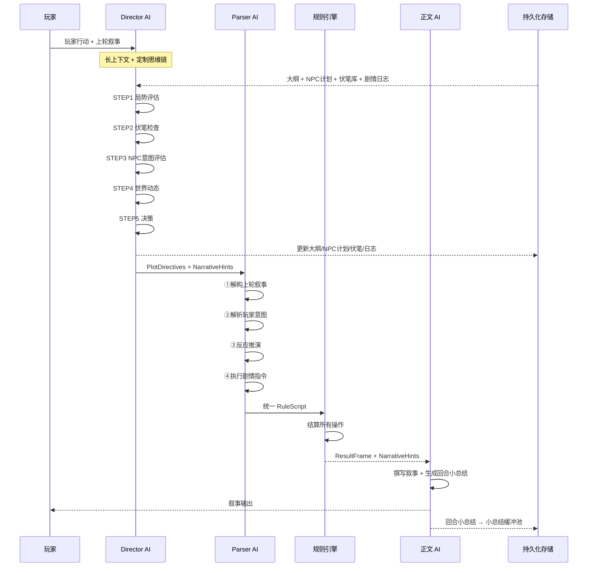
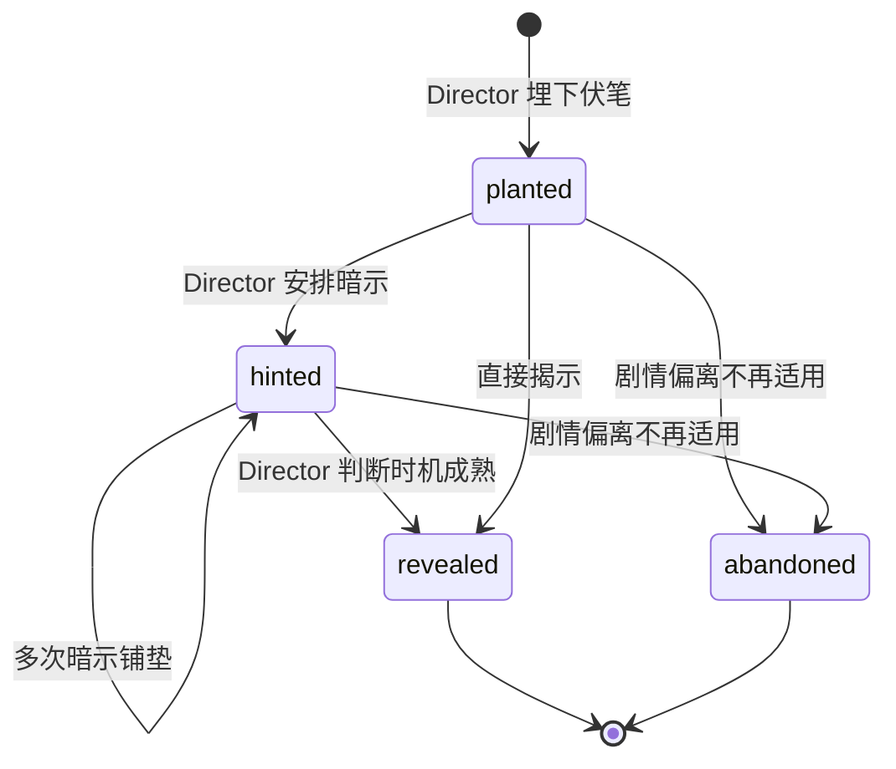
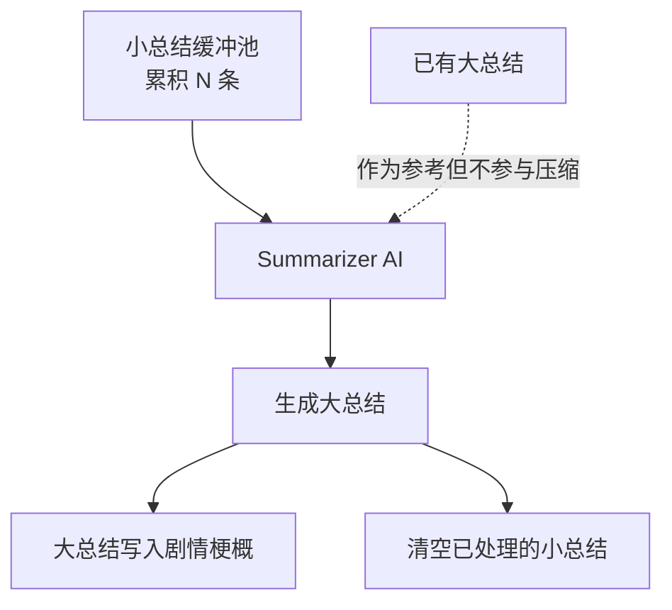

# Director AI 与分段记忆系统设计（远期规划）

> **文档状态**：概念设计阶段，记录讨论达成的共识与架构方向。具体实现细节待各功能进入开发时再细化。
> **实现对齐注记（2026-02）**：多 AI Profile 基础系统已实现（`profiles` + `preset.aiProfileId` + `resolveAIConfig`）。本文中的远期方案以此为基线，避免与现有实现冲突。

---

## 1. 设计决策摘要

| 决策项            | 方案                                                                 |
| ----------------- | -------------------------------------------------------------------- |
| Director AI 定位  | IRNR 管道的**前置阶段**，负责剧情规划与世界模拟                      |
| Director 调用频率 | **每回合调用**（AI 调用，非规则匹配）                                |
| 微观层实现        | AI 调用 + 定制思维链（用户按次计费，token 影响小）                   |
| 信息传递          | 显式的 PlotDirectives + NarrativeHints，通过 Marker/变量注入         |
| 伏笔触发判断      | Director AI 语义评估（非条件比较）                                   |
| 分段记忆          | 正文 AI 输出回合小总结 → 累积后 AI 压缩为大总结 → 注入剧情梗概       |
| AI 配置基线       | 已实现 `AIProfile` 与 `Preset.aiProfileId`，远期在其上扩展多角色绑定 |
| 大纲初始化        | 基于玩家开局信息 + 世界观设定生成（待细化）                          |
| 与 Phase 4 关系   | 不影响 Phase 4 实施，仅预留 Marker/变量接口                          |

---

## 2. 问题背景

### 2.1 涌现内容的来源问题

在 IRNR v2 管道（Phase 4）中，各 AI 的职责划分为：

```
Parser AI  = 解构 + 解析 + 反应推演（机械性反应）
正文 AI    = 描写结算结果 + 即时叙事涌现
```

**即时叙事涌现**（NPC 对话/情绪/氛围/伏笔暗示）在当前阶段不会导致游戏状态不一致（因为这些内容是纯叙事文本，不涉及结构化数据）。但这种架构存在两个远期不足：

1. **缺乏长线规划**：正文 AI 的涌现是逐回合即兴的，无法实现跨场景/跨章节的故事弧线
2. **世界缺乏自主运转**：没有机制让世界背景事件独立发展并影响玩家的叙事体验

### 2.2 记忆上下文的瓶颈

随着游戏回合数增加，对话历史会不断膨胀。AI 需要的不是原始对话文本，而是**结构化的剧情摘要**。需要一个独立的记忆管理系统来提供高效的上下文。

---

## 3. 整体架构

### 3.1 四层 AI 协作架构

```
┌─────────────────────────────────────────────────────────┐
│  Director AI（导演）                                      │
│  职责：剧情规划 / 世界模拟 / 伏笔管理 / NPC 长线塑造     │
│  输出：PlotDirectives + NarrativeHints + 规划更新         │
│  频率：每回合                                             │
├─────────────────────────────────────────────────────────┤
│  Parser AI（规则解析器）                                   │
│  职责：解构 + 解析 + 反应推演 + 执行剧情指令              │
│  输出：统一 RuleScript                                    │
│  频率：每回合                                             │
├─────────────────────────────────────────────────────────┤
│  规则引擎（确定性执行）                                    │
│  职责：执行 RuleScript → ResultFrame                      │
│  频率：每回合                                             │
├─────────────────────────────────────────────────────────┤
│  正文 AI（叙事作家）                                       │
│  职责：描写结算结果 + 即时叙事润色 + 输出回合小总结        │
│  输出：叙事文本 + 结构化小总结                            │
│  频率：每回合                                             │
├─────────────────────────────────────────────────────────┤
│  Summarizer AI（记忆整理）                                 │
│  职责：小总结累积压缩为大总结                              │
│  输出：大总结 → 写入剧情梗概                              │
│  频率：每 N 回合（累积触发）                              │
└─────────────────────────────────────────────────────────┘
```

### 3.2 每回合管道流程



### 3.3 与 Phase 4 管道的关系

Phase 4 的 `executePipeline()` 流程（Parse → Engine → Narrative）**不需要修改**。Director AI 作为管道的**前置阶段**插入：

```typescript
// 未来扩展（不改变现有流程）
async function executePipeline() {
  // 🆕 Step 0: Director（如果启用）
  if (directorEnabled) {
    const directorResult = await runDirector(context);
    context.plotDirectives = directorResult.directives;
    context.narrativeHints = directorResult.narrativeHints;
    await persistOutlineUpdates(directorResult);
  }
  
  // Step 1: Parse（现有，不变）
  // Step 2: Engine（现有，不变）
  // Step 3: Narrative（现有，不变）
  
  // 🆕 Step 4: 正文后处理（提取小总结）
  if (memorySystemEnabled) {
    const miniSummary = extractMiniSummary(narrativeOutput);
    await appendToSummaryBuffer(miniSummary);
    await checkAndTriggerCompression();
  }
}
```

### 3.4 AI Profile 配置对齐（当前已实现）

> 本节用于约束远期设计与现有实现的兼容关系，避免后续引入 `activeProfileId` / `defaultProfileId` 一类已移除概念。

当前实现基线（已落地）：

- `Settings Store` 使用 `profiles: AIProfile[]` 管理配置，不维护 `activeProfileId` 或 `defaultProfileId`。
- Profile 解析统一通过 `getProfileOrFallback(id?)`：按 ID 查找，找不到则回退 `profiles[0]`。
- `Preset` 当前类型为 `aiProfileId?: string` + `aiSettings?: Partial<AdvancedSettings>`。
- 最终执行配置通过 `resolveAIConfig(profile, preset.aiSettings)` 生成，优先级：`presetOverrides > profile.advanced > DEFAULT_ADVANCED_SETTINGS`。
- 导出格式使用 `LyraExportFormat` v1.1，可嵌入 `ExportedAIProfile { name, advanced }`（不含连接敏感信息）。

```typescript
// 远期实现 Director/Parser/Narrator/Summarizer 调用时，配置解析建议统一遵循此流程
function resolvePresetConfig(preset: Preset): AIConfig {
  const settings = useSettingsStore.getState();
  const profile = settings.getProfileOrFallback(preset.aiProfileId);

  if (!preset.aiProfileId || !settings.getProfileById(preset.aiProfileId)) {
    console.warn("[AI] preset.aiProfileId 未绑定或不存在，回退到 profiles[0]");
  }

  return resolveAIConfig(profile, preset.aiSettings);
}
```

#### 3.4.1 多角色绑定的远期扩展（兼容策略）

为支持 `director / parser / narrator / summarizer` 分角色模型绑定，建议在保持当前字段不变的前提下扩展：

- 保留 `aiProfileId` 作为“全局默认绑定”（当前已实现）。
- `roleProfiles` 作为远期可选扩展字段（当前**未实现**）：
  ```typescript
  roleProfiles?: Partial<
    Record<"director" | "parser" | "narrator" | "summarizer", string>
  >;
  ```
- 远期解析优先级建议：
  1. `roleProfiles[role]`（若存在）
  2. `aiProfileId`
  3. `getProfileOrFallback()`（最终兜底到 `profiles[0]`）

---

## 4. Director AI 详细设计

### 4.1 职责定义

Director AI 是**游戏的编剧和世界模拟器**，负责：

| 职责         | 描述                                | 输出                         |
| ------------ | ----------------------------------- | ---------------------------- |
| 剧情规划     | 维护故事弧线、推进里程碑            | 大纲更新                     |
| 伏笔管理     | 埋下伏笔、判断触发时机、揭示伏笔    | 伏笔状态更新 + PlotDirective |
| NPC 长线塑造 | 管理 NPC 动机、后台演化、登退场计划 | NPC 计划更新 + PlotDirective |
| 世界模拟     | 推进世界时间线、生成背景事件        | 世界事件 + PlotDirective     |
| 局势评估     | 判断玩家行动对大纲的偏离程度        | 大纲修订                     |

### 4.2 输入数据

```
Director AI 输入：
  ┌─ 剧情大纲（当前弧线 + 里程碑状态）
  ├─ NPC 发展计划（所有活跃 NPC 的动机/目标/关系）
  ├─ 伏笔数据库（已埋伏笔 + 状态）
  ├─ 剧情日志（压缩摘要 + 最近 N 回合的完整条目）
  ├─ 当前游戏状态（实体属性快照）
  ├─ 在场 NPC 信息
  ├─ 本轮玩家行动（原始输入）
  └─ 世界观设定（WorldConfig 摘要）
```

### 4.3 定制思维链（强制结构）

Director AI 的 prompt 强制要求按以下步骤进行思考：

```
STEP 1 - 局势评估
  "玩家当前在[地点]，正在做[事情]。
   与当前弧线[弧线名]的关系：[在主线上/小偏离/大偏离/无关]。
   周围有[NPC列表]。"

STEP 2 - 伏笔检查
  "遍历伏笔数据库：
   伏笔A [描述]：触发条件[条件]，当前状态：[是否满足/接近满足/不满足]
   伏笔B [描述]：触发条件[条件]，当前状态：[是否满足/接近满足/不满足]
   ..."

STEP 3 - NPC 意图评估
  "在场 NPC 的当前动机和可能行为：
   NPC-X：核心动机[目的]，当前目标[目标]，面对当前局势会[行为判断]
   NPC-Y：不在场，后台正在[活动]，对故事的影响[影响]"

STEP 4 - 世界动态
  "世界时间线中即将或应该发生的事件：
   事件A：[描述]，是否该在本轮体现？[判断及理由]
   玩家不在事件发生地时的间接影响方式：[方式]"

STEP 5 - 决策
  "本轮应该推进的内容：
   - [指令1]：原因[xxx]
   - [指令2]：原因[xxx]
   本轮应该更新的规划：
   - [更新1]
   - [更新2]
   本轮应该埋下的新伏笔：
   - [伏笔描述]"
```

### 4.4 输出格式

```typescript
interface DirectorOutput {
  /** 本轮剧情指令 */
  directives: PlotDirective[];
  /** 大纲修订 */
  outlineUpdates: OutlineUpdate[];
  /** NPC 计划更新 */
  npcPlanUpdates: NpcPlanUpdate[];
  /** 伏笔状态更新 */
  foreshadowUpdates: ForeshadowUpdate[];
  /** 新埋的伏笔 */
  newForeshadows: Foreshadow[];
  /** 本轮剧情日志条目 */
  logEntry: PlotLogEntry;
}
```

### 4.5 PlotDirective 类型

```typescript
interface PlotDirective {
  type: 'introduce_npc' | 'trigger_event' | 'reveal_foreshadow' 
      | 'world_event' | 'npc_initiative' | 'scene_transition';
  
  /** 指令描述（给 Parser 理解上下文用） */
  description: string;
  
  /** 如果需要创建实体/检定，转为 RuleScript 操作 */
  operations?: RuleScriptAction[];
  
  /** 叙事提示（给正文 AI 的创作方向） */
  narrativeHint?: string;
  
  /** 优先级/紧迫度 */
  urgency: 'immediate' | 'this_turn' | 'soon' | 'whenever';
}
```

**指令类型说明**：

| 类型                | 描述             | 操作                  | 叙事          |
| ------------------- | ---------------- | --------------------- | ------------- |
| `introduce_npc`     | 引入新 NPC       | npcCreate + npcAction | 描写 NPC 登场 |
| `trigger_event`     | 触发剧情事件     | 视情况                | 描写事件发生  |
| `reveal_foreshadow` | 揭示伏笔         | 视情况                | 描写伏笔揭示  |
| `world_event`       | 世界背景事件影响 | 通常无                | 间接暗示      |
| `npc_initiative`    | NPC 主动行为     | npcAction             | 描写 NPC 行为 |
| `scene_transition`  | 场景转换         | 视情况                | 描写场景变化  |

### 4.6 信息传递机制

**Director → Parser**：通过 `plotDirectives` Marker/变量注入

```
【本轮剧情指令】
1. [npc_initiative] リナ主动向玩家透露弟弟的事情
   意图：リナ犹豫后鼓起勇气倾诉
   操作建议：npcAction type=dialogue, directEffect
   
2. [world_event] 远处传来轰鸣声，北方天际出现红光
   操作建议：无需操作
```

**Director → 正文 AI**：通过 `narrativeHints` Marker/变量注入

```
【叙事提示】
- リナ欲言又止，最终鼓起勇气向玩家倾诉弟弟的病情
- 远方天际偶尔闪过红光，暗示北方战事升级
- 环境氛围：公会中冒险者们在低声讨论北方的传闻
```

**正文 AI → Director**（间接，通过持久化存储）：
- 回合小总结 → 剧情日志 → Director 下轮读取

**引擎 → Director**（间接，通过持久化存储）：
- 结算结果 → 游戏状态 → Director 下轮读取

### 4.7 处理"玩家不在关键地点"

Director AI 的思维链 STEP 4 中需要推理**间接影响方式**：

| 世界事件     | 玩家位置 | Director 的间接影响策略                         |
| ------------ | -------- | ----------------------------------------------- |
| 北方战事升级 | 南方城镇 | 城镇出现难民 / NPC 讨论北方传闻 / 物价变化      |
| NPC-A 被暗杀 | 不在场   | 下次去相关地点时发现 / 其他 NPC 告知 / 传闻流传 |
| 地下城开放   | 别的区域 | 公会发布新委托 / 冒险者们兴奋讨论               |

Director AI 的智能在于：**不强行打断玩家，而是通过间接方式让世界事件渗透到玩家的当前场景中**。

---

## 5. 剧情大纲系统

### 5.1 数据结构

```typescript
interface PlotOutline {
  /** 大纲 ID */
  id: string;
  /** 当前故事阶段 */
  currentArc: StoryArc;
  /** 已完成的阶段 */
  completedArcs: StoryArc[];
  /** 规划中的未来阶段（可被玩家行动改变） */
  plannedArcs: StoryArc[];
  /** 全局伏笔池 */
  foreshadows: Foreshadow[];
  /** 世界事件时间线 */
  worldTimeline: WorldEvent[];
}

interface StoryArc {
  id: string;
  title: string;
  /** 这个弧线的核心冲突/目标 */
  premise: string;
  /** 关键节点（非线性，玩家可能跳过/提前触发） */
  milestones: Milestone[];
  /** 涉及的关键 NPC */
  involvedNpcs: string[];
  /** 弧线状态 */
  status: 'active' | 'completed' | 'abandoned' | 'modified';
  /** 玩家行动导致的偏离记录 */
  deviations: string[];
}

interface Milestone {
  id: string;
  description: string;
  /** 触发条件描述（自然语言，由 Director AI 语义评估） */
  triggerConditions: string;
  /** 触发后产生的效果描述 */
  effects: string;
  status: 'pending' | 'triggered' | 'skipped';
}
```

### 5.2 伏笔系统

```typescript
interface Foreshadow {
  id: string;
  /** 伏笔内容描述 */
  description: string;
  /** 伏笔类型 */
  type: 'character' | 'event' | 'item' | 'location' | 'mystery';
  /** 埋下时的回合 */
  plantedAtTurn: number;
  /** 触发条件描述（自然语言，Director AI 语义评估） */
  triggerCondition: string;
  /** 揭示时的效果描述 */
  revealEffect: string;
  /** 状态 */
  status: 'planted' | 'hinted' | 'revealed' | 'abandoned';
  /** 已暗示的次数（逐步铺垫） */
  hintCount: number;
  /** 关联实体 */
  relatedEntities: string[];
}
```

**伏笔生命周期**：



### 5.3 世界事件时间线

```typescript
interface WorldEvent {
  id: string;
  /** 事件描述 */
  description: string;
  /** 预计发生的时机（回合数或条件描述） */
  scheduledAt: number | string;
  /** 对世界的影响 */
  worldImpact: string;
  /** 玩家可能感知到的信息 */
  playerPerception: string;
  /** 是否已触发 */
  triggered: boolean;
  /** 关联的 NPC/地点 */
  relatedEntities: string[];
}
```

**示例：活的世界时间线**

```
回合 1-10:   魔王军在北方边境集结（玩家不知道）
回合 11:     难民开始南下，玩家可能在路上遇到
回合 15:     公会发布紧急讨伐令（公共事件）
回合 20:     如果玩家没有参与，某座城市被攻破
回合 25:     暗杀者受雇来刺杀参与讨伐的冒险者
```

### 5.4 大纲初始化（待细化）

游戏开始时的大纲生成方式（待实现时进一步讨论）：

```
输入：
  - 玩家角色信息（种族/背景/性格/外貌）
  - 世界观设定（WorldConfig）
  - 开局场景设定（scenario）
  - 可能的开局选择（如选择开局任务/起始地点等）

输出：
  - 初始 StoryArc（第一章大纲）
  - 初始 NPC 发展计划（开局关键 NPC）
  - 初始世界时间线（背景事件安排）
  - 初始伏笔（开局埋下的种子）
```

**待讨论的问题**：
- 大纲的详细程度：是只规划第一章，还是粗略规划整个故事？
- 玩家是否可见大纲？（可能只展示"当前目标"而隐藏后续规划）
- 如何避免大纲过于线性？（保持多个可能的发展方向）

---

## 6. NPC 长线塑造

### 6.1 NPC 发展计划

```typescript
interface NpcDevelopmentPlan {
  npcId: string;
  /** NPC 的核心动机（不变的内在驱动力） */
  coreMotive: string;
  /** NPC 的当前目标（会随剧情变化） */
  currentGoal: string;
  /** NPC 的态度/关系变化轨迹 */
  relationshipTrajectory: {
    /** 对玩家的态度发展方向 */
    towardsPlayer: string;
    /** 触发态度变化的条件描述 */
    triggers: string[];
  };
  /** NPC 的后台时间线——不在场时在做什么 */
  offscreenActivities: OffscreenActivity[];
  /** 预定的登场/退场计划 */
  appearancePlan: AppearancePlan[];
}

interface OffscreenActivity {
  /** 时间范围 */
  fromTurn: number;
  toTurn: number;
  /** NPC 在幕后做什么 */
  activity: string;
  /** 这个活动对 NPC 的影响 */
  consequence: string;
  /** 当 NPC 再次出场时如何体现这段经历 */
  narrativeImpact: string;
}

interface AppearancePlan {
  /** 预计登场的时机描述 */
  timing: string;
  /** 登场的原因/方式 */
  method: string;
  /** 登场时 NPC 的状态变化 */
  stateChanges?: Record<string, unknown>;
}
```

### 6.2 NPC 长线塑造示例

**初始计划（Director AI 生成）**：

```
NPC: 受付嬢リナ
核心动机: 保护家人（有一个生病的弟弟）
当前目标: 在公会努力工作攒钱
关系轨迹: 对玩家从职业礼貌 → 信任 → 可能求助
后台活动:
  回合 1-15: 正常工作，偶尔担心弟弟
  回合 16+: 如果玩家好感度高，可能透露弟弟的事
登场计划:
  - 玩家每次去公会时自然在场
  - 信任度足够时：下班后主动找玩家
伏笔:
  - リナ偶尔看手中的小挂坠（弟弟送的）
  - リナ会拒绝加班后的聚餐邀请（要回去照顾弟弟）
```

**回合 5**——正常互动：

```
Director: 无特殊指令（正常互动）
叙事提示: リナ微笑着翻开委托册...可以顺带描写她看了一眼挂坠（伏笔铺垫）
```

**回合 12**——触发关系升级：

```
Director 判断: 玩家帮リナ解围 → 好感度事件 → 更新关系轨迹
  リナ对玩家的态度: 职业礼貌 → 真诚感谢
修订 NPC 计划: 提前透露弟弟的事
```

**回合 15**——NPC 主动行为：

```
Director 指令:
  type: npc_initiative
  description: リナ犹豫后向玩家透露弟弟生病的事
  narrativeHint: リナ欲言又止，最终鼓起勇气...
```

**回合 20-30**——后台演化：

```
玩家去寻找稀有药材期间:
Director 更新后台活动:
  弟弟病情恶化 → リナ焦虑加重 → 工作出错
  
玩家带着药材回来时:
Director 指令:
  リナ形象变化（面容憔悴、眼圈发红）
  リナ看到药材时的强烈情绪反应
```

---

## 7. 分段记忆系统

### 7.1 核心理念

```
正文 AI 每回合输出 → 叙事文本 + 回合小总结
                         ↓
              小总结累积到缓冲池
                         ↓
              累积 N 条后触发压缩
                         ↓
              Summarizer AI 压缩为大总结
                         ↓
              大总结写入剧情梗概
                         ↓
              剧情梗概通过 scenario Marker/变量
              注入到各 AI 的上下文中
```

### 7.2 回合小总结

**生成方式**：正文 AI 在每次输出叙事文本时，同时输出一个特定格式的小总结。

**格式约定**（需要正文正则处理提取）：

```
正文 AI 的输出：
  [叙事文本...]

  ---SUMMARY---
  地点：冒险者公会
  事件：玩家接取讨伐哥布林的委托，与受付嬢リナ交谈
  NPC：リナ（友好，提供了委托信息）
  状态变化：获得委托书
  伏笔：リナ看了一眼手中的挂坠
  ---END---
```

**正则提取**：
```typescript
const SUMMARY_REGEX = /---SUMMARY---([\s\S]*?)---END---/;
```

提取后的小总结存入缓冲池，叙事文本中的总结标记被清除后展示给玩家。

### 7.3 小总结数据结构

```typescript
interface MiniSummary {
  turn: number;
  /** 地点 */
  location: string;
  /** 关键事件 */
  events: string;
  /** 涉及的 NPC */
  npcs: string;
  /** 状态变化 */
  stateChanges?: string;
  /** 伏笔相关 */
  foreshadowNotes?: string;
  /** 原始文本（AI 输出的完整小总结） */
  rawText: string;
}
```

### 7.4 大总结压缩

**触发条件**：小总结缓冲池中累积达到 N 条（建议 N = 5~10，可配置）。

**压缩流程**：



**关键设计**：大总结生成时，已有的大总结**作为参考上下文**（让 AI 知道之前发生过什么），但**不作为需要压缩的素材**。这避免了反复压缩导致的信息丢失。

```
Summarizer AI 输入：
  ┌─ 已有大总结列表（只读参考，提供历史背景）
  ├─ 待压缩的 N 条小总结
  └─ 压缩指引（保留关键事件/NPC变化/伏笔/地点转移）

Summarizer AI 输出：
  "第X-Y回合摘要：
   玩家在[地点]完成了[事件]。与[NPC]的关系发展到[阶段]。
   发现了[线索/伏笔]。世界背景中[事件]正在发生。
   当前状态：[HP/装备/关键物品等变化]。"
```

### 7.5 剧情梗概的组成

剧情梗概（scenario Marker/变量的内容）由以下部分组成：

```
┌──────────────────────────────────────────┐
│  剧情梗概                                 │
│                                           │
│  ┌─────────────────────────────┐          │
│  │ 用户编写的初始梗概           │ ← 手动  │
│  │ （世界背景/开局设定）        │          │
│  └─────────────────────────────┘          │
│                                           │
│  ┌─────────────────────────────┐          │
│  │ 大总结 1（回合 1-8）        │ ← 自动  │
│  │ 大总结 2（回合 9-16）       │ ← 自动  │
│  │ 大总结 3（回合 17-24）      │ ← 自动  │
│  │ ...                         │          │
│  └─────────────────────────────┘          │
│                                           │
│  ┌─────────────────────────────┐          │
│  │ 未压缩的小总结（最近几条）   │ ← 缓冲  │
│  └─────────────────────────────┘          │
└──────────────────────────────────────────┘
```

**注入策略**：
- 初始梗概：始终注入
- 大总结：全部注入（按时间顺序）
- 未压缩的小总结：注入最近的缓冲内容
- 如果总长度超过限制，可以对早期大总结进行**二次压缩**（超远期总结只保留核心事件）

### 7.6 与 Director AI 的关系

分段记忆系统是 Director AI 的**输入来源之一**：

```
Director AI 的剧情日志输入：
  ┌─ 大总结列表（提供历史全貌）
  ├─ 最近 N 条小总结（提供近期细节）
  └─ Director 自己的日志条目（结构化的关键事件记录）
```

Director AI 的日志（PlotLog）与分段记忆的大/小总结是**互补**的：
- **大/小总结**：关注叙事内容（发生了什么故事）
- **Director 日志**：关注结构化决策（大纲如何变化、伏笔如何演进）

### 7.7 正文 AI 输出处理（正则提取功能）

这是一个需要在正文 AI 输出后添加的处理步骤：

```typescript
interface NarrativePostProcessor {
  /** 从正文 AI 的原始输出中提取结构化内容 */
  process(rawOutput: string): {
    /** 清理后的叙事文本（展示给玩家） */
    narrative: string;
    /** 提取的小总结 */
    miniSummary?: MiniSummary;
    /** 未来可能扩展的其他结构化内容 */
    metadata?: Record<string, unknown>;
  };
}
```

**处理流程**：

```
正文 AI 原始输出
  ↓
正则匹配 ---SUMMARY---...---END---
  ↓
├─ 有匹配 → 提取小总结 + 清理叙事文本
└─ 无匹配 → 叙事文本原样输出（小总结缺失，不影响主流程）
  ↓
叙事文本 → 展示给玩家
小总结 → 写入缓冲池
```

**容错设计**：如果正文 AI 未按格式输出小总结（AI 不稳定性），系统不会崩溃。缺失的小总结不会写入缓冲池，压缩触发条件基于实际收到的数量。

---

## 8. 持久化存储设计

### 8.1 存储位置

所有 Director/记忆系统的数据存储在 Yjs Doc 中（与角色/聊天数据同级）：

```
Yjs MainDoc
├── characters (Map)          ← 现有
├── chatMessages (Array)      ← 现有
├── gameState (Map)           ← 现有
├── plotOutline (Map)         ← 🆕 剧情大纲
├── npcPlans (Map)            ← 🆕 NPC 发展计划
├── foreshadows (Array)       ← 🆕 伏笔数据库
├── plotLog (Map)             ← 🆕 Director 剧情日志
├── memorySummaries (Map)     ← 🆕 分段记忆
│   ├── miniSummaries (Array) ← 小总结缓冲池
│   └── megaSummaries (Array) ← 大总结列表
└── worldTimeline (Array)     ← 🆕 世界事件时间线
```

### 8.2 联机同步

这些数据通过 Yjs CRDT 自动同步到所有联机玩家。Director AI 只在**房主端**运行，结果通过 Yjs 同步给其他玩家。

---

## 9. Marker/变量接口预留

Phase 4 的 Marker 注册表中需要预留以下条目（当前渲染为空字符串，Director 实现后替换）：

```typescript
// marker-registry.ts 预留条目

{
  id: "plotDirectives",
  displayName: "剧情指令",
  description: "Director AI 的本轮剧情指令（远期功能）",
  render: (ctx) => ctx.plotDirectives ?? "",
  defaultRole: "system",
},
{
  id: "narrativeHints",
  displayName: "叙事提示",
  description: "Director AI 的叙事创作指引（远期功能）",
  render: (ctx) => ctx.narrativeHints ?? "",
  defaultRole: "system",
}
```

`VariableContext` 接口需要预留字段：

```typescript
interface VariableContext {
  // ... 现有字段 ...
  
  /** Director AI 的剧情指令（远期） */
  plotDirectives?: string;
  /** Director AI 的叙事提示（远期） */
  narrativeHints?: string;
}
```

---

## 10. 执行优先级与死亡中断

### 10.1 问题

当 Director AI 安排 NPC 突袭玩家，同时玩家也有行动时，需要确定执行顺序，并处理可能的死亡中断：

```
Director 指令: 暗杀者突袭玩家
玩家行动: 走向商店

如果暗杀者突袭杀死了玩家，玩家的行动应该被取消
```

### 10.2 RuleScript 执行优先级

规则引擎按以下优先级执行 RuleScript 中的操作：

```
1. 解构操作（上轮叙事的结构化处理）
2. Director 指令中的即时操作（NPC 突袭等）
3. 玩家行动
4. NPC 反应推演（对玩家行动的反击等）

每组之间检查死亡状态，死亡实体的后续操作取消
```

这是**规则引擎层面**的改动，不影响 AI 架构。

---

## 11. 分阶段实施建议

### Phase A：分段记忆系统（优先级较高）

> 这是最独立、最易实现的部分，不依赖 Director AI。

- [ ] 正文 AI 预设修改：在系统角色块中添加小总结格式要求
- [ ] 正文输出后处理器：正则提取小总结
- [ ] 小总结缓冲池存储（Yjs）
- [ ] Summarizer AI 调用逻辑：累积 N 条后触发压缩
- [ ] 大总结写入剧情梗概
- [ ] scenario Marker 渲染增强：组合初始梗概 + 大总结 + 未压缩小总结

### Phase B：Director AI 核心

> 依赖分段记忆系统作为输入。

- [ ] PlotOutline / Foreshadow / NpcDevelopmentPlan 数据结构定义
- [ ] Director AI 预设设计（定制思维链）
- [ ] Director AI 调用逻辑（管道前置阶段，配置解析遵循 `preset.aiProfileId -> getProfileOrFallback() -> resolveAIConfig()`）
- [ ] 多角色 Profile 绑定扩展（`roleProfiles` 远期可选字段，按角色覆盖 `aiProfileId`，保持向后兼容）
- [ ] PlotDirectives / NarrativeHints 注入到 Parser 和正文 AI
- [ ] Director 输出解析与持久化写回
- [ ] plotDirectives / narrativeHints Marker 渲染实现

### Phase C：大纲初始化

> 依赖 Director AI 核心。

- [ ] 开局信息收集（角色/世界观/开局设定）
- [ ] 初始大纲生成 AI 调用
- [ ] 初始 NPC 计划生成
- [ ] 初始世界时间线生成
- [ ] 初始伏笔埋设

### Phase D：增强与优化

- [ ] 大纲偏离检测与自动修订
- [ ] 伏笔铺垫策略（逐步暗示而非突然揭示）
- [ ] 世界事件的间接影响渲染
- [ ] 大总结二次压缩（超长游戏场景）
- [ ] Director 决策日志的可视化（用户可查看导演的规划？）
- [ ] RuleScript 执行优先级与死亡中断

---

## 12. 风险与待讨论事项

| 风险/议题            | 描述                                              | 缓解策略                             |
| -------------------- | ------------------------------------------------- | ------------------------------------ |
| Director AI 输出质量 | Director 需要同时理解游戏状态、NPC 动机和剧情规划 | 定制思维链强制分步推理               |
| 大纲灵活性           | 大纲可能过于限制 AI 的创意                        | 大纲只定义方向，不定义细节           |
| 信息过载             | Director 输入太多导致 AI 混乱                     | 剧情日志压缩 + 分层摘要              |
| 正文 AI 小总结质量   | AI 可能不稳定地输出格式化总结                     | 容错设计 + 缺失不影响主流程          |
| 伏笔连贯性           | 伏笔可能被遗忘或矛盾                              | 伏笔数据库持久化 + Director 每轮检查 |
| 多人游戏兼容         | Director 在房主端运行，其他玩家如何感知           | 通过 Yjs 同步 Director 的输出        |
| 大纲初始化           | 如何基于有限的开局信息生成有趣的大纲              | 待实现时细化讨论                     |
| Token 消耗           | Director 每轮调用增加成本                         | 用户按次计费，影响可控               |
