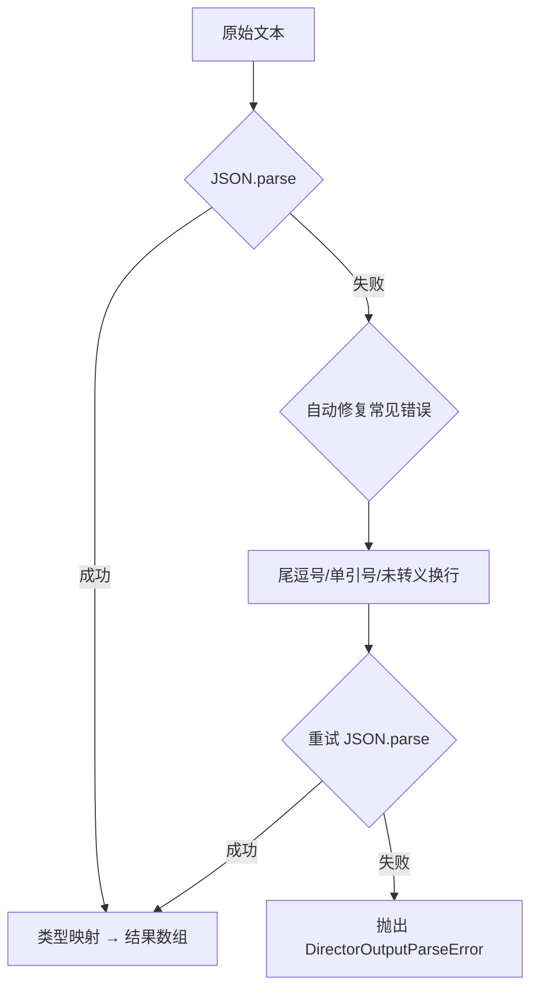

# Director AI 结构化输出格式重设计

## 1. 问题

Director AI 的 `<archive_updates>` 和 `<outline_updates>` 使用纯文本列表格式，导致：

1. **AI 格式漂移**：纯文本约束力弱，AI 经常添加 Markdown 格式（`[老班恩](NPC_Bane)`）、粗体、额外换行等
2. **正则地狱**：[`parseArchiveUpdates()`](src/modules/director/output-parser.ts:278) 用了 730+ 行代码处理各种 AI 输出变体
3. **语义模糊**：`新增实体` vs `首次出现` vs `更新状态` 靠关键词匹配，容易误判
4. **引号变体**：`outline_updates` 中伏笔/里程碑引用需要处理 `""`、`''`、`""`、`''`、``` `` ``` 等各种引号

**对比**：Parser AI 使用纯 JSON 输出（[`parseRuleScriptFromResponse()`](src/modules/game/services/pipeline-helpers.ts:19)），仅 20 行解析代码，稳定运行无问题。

---

## 2. 方案：XML 分区 + JSON 内容

保持 XML 标签做大区域分隔（`plot_directives`、`narrative_hints` 仍为自然语言），将 `archive_updates` 和 `outline_updates` 内容改为 JSON 数组。

**为什么不全部改 JSON**：`plotDirectives` 和 `narrativeHints` 是自然语言长文本，放进 JSON string 字段需要处理转义（`\n`、`\"`），反而增加出错概率。XML 标签内的内容零转义，对自然语言友好。

**为什么 outline_updates 一起改**：同一次 AI 输出中混用 JSON 和纯文本格式会让 AI 困惑——它可能在纯文本区域也用 JSON，导致解析失败。统一格式让 AI 遵循度更高。

---

## 3. archive_updates JSON 格式

### 3.1 操作类型

| op         | 含义         | 必需字段                              | 可选字段                |
| ---------- | ------------ | ------------------------------------- | ----------------------- |
| `create`   | 创建新实体   | `name`, `type`, `state`               | `id`, `essence`, `tags` |
| `update`   | 更新实体状态 | `ref`, `state`                        | —                       |
| `essence`  | 更新实体本质 | `ref`, `essence`                      | —                       |
| `presence` | 更新存在状态 | `ref`, `presence`                     | —                       |
| `relate`   | 添加关系     | `ref`, `target`, `relType`, `relDesc` | —                       |

### 3.2 字段说明

| 字段       | 说明                                                                                                            |
| ---------- | --------------------------------------------------------------------------------------------------------------- |
| `ref`      | 实体引用（名称或 ID），解析端通过 `entityLookup` 做模糊匹配                                                     |
| `type`     | 实体原型枚举（`character` / `event` / `faction` / `location` / `item_unique` / `quest` / `mystery` / `custom`） |
| `id`       | 建议的游戏实体 ID（仅 create，可选）                                                                            |
| `presence` | 存在状态枚举（`active` / `nearby` / `dormant` / `resolved`）                                                    |

### 3.3 示例

```json
[
  {"op":"create","type":"character","name":"老班恩","id":"NPC_Bane","essence":"边境旅店老板，胆小但精于察言观色","state":"初次登场，因恐惧而苍白"},
  {"op":"update","ref":"PC","state":"身份待定，处于被通缉的嫌疑中"},
  {"op":"presence","ref":"npc_guard_01","presence":"dormant"},
  {"op":"relate","ref":"PC","target":"老班恩","relType":"acquaintance","relDesc":"旅店偶遇"}
]
```

### 3.4 扩展性

新增操作只需添加新的 `op` 值和对应字段，不影响已有操作的解析。例如：

- `"op":"rename"` — 更新实体名称
- `"op":"tag"` — 添加/移除标签
- `"op":"remove"` — 标记实体移除

新增 archetype 只需在 `type` 枚举中添加值，解析逻辑零改动。

---

## 4. outline_updates JSON 格式

### 4.1 操作类型

| op                  | 含义           | 必需字段        | 可选字段            |
| ------------------- | -------------- | --------------- | ------------------- |
| `arc_deviation`     | 弧线偏离记录   | `desc`          | —                   |
| `arc_status`        | 弧线状态变更   | `status`        | —                   |
| `milestone`         | 里程碑状态变更 | `ref`, `status` | —                   |
| `foreshadow_hint`   | 伏笔暗示次数   | `ref`, `delta`  | —                   |
| `foreshadow_status` | 伏笔状态变更   | `ref`, `status` | —                   |
| `add_foreshadow`    | 新增伏笔       | `desc`          | `trigger`, `reveal` |
| `remove_foreshadow` | 移除伏笔       | `ref`           | —                   |

### 4.2 示例

```json
[
  {"op":"arc_deviation","desc":"玩家使用伪造通行证，可能提前触发通缉支线"},
  {"op":"foreshadow_hint","ref":"莉娜的秘密","delta":1},
  {"op":"milestone","ref":"到达北方城镇","status":"triggered"},
  {"op":"add_foreshadow","desc":"神秘商人的身份","trigger":"玩家调查商队","reveal":"商人是王国间谍"}
]
```

---

## 5. 提示词模板

Director 预设中 `<archive_updates>` 和 `<outline_updates>` 的格式说明需要更新为 JSON 格式示例。提示词应包含每种操作类型的简短示例，让 AI 明确知道字段结构。无更新时输出空数组 `[]`。

---

## 6. 容错策略



- **JSON 修复层**：处理尾逗号、单引号、未转义换行等 AI 常见 JSON 错误
- **无旧版兼容**：项目未上线，直接替换，不保留旧版纯文本解析逻辑

---

## 7. 变更影响范围

| 文件                                                                | 变更                                                     |
| ------------------------------------------------------------------- | -------------------------------------------------------- |
| [`output-parser.ts`](src/modules/director/output-parser.ts)         | 重写解析函数，移除旧版纯文本解析逻辑                     |
| [`default-director.ts`](src/lib/prompt/presets/default-director.ts) | 更新 `<archive_updates>` 和 `<outline_updates>` 格式说明 |
| 新增测试文件                                                        | `output-parser.test.ts` 覆盖 JSON 解析 + 边界情况        |

**不变**：[`ArchiveUpdate`](src/modules/world-archive/types.ts:49) 类型、[`OutlineUpdateInstruction`](src/modules/director/output-parser.ts:101) 类型、[`applyArchiveUpdatesAndSync()`](src/modules/world-archive/apply-updates.ts)、Store — 下游全部无感。

---

## 8. 实施步骤

- [ ] 重写 `parseArchiveUpdates()`：JSON 解析 + 类型校验 + `entityLookup`，移除旧版纯文本逻辑
- [ ] 重写 `parseOutlineUpdates()`：JSON 解析 + 类型校验，移除旧版纯文本逻辑
- [ ] 实现 JSON 修复层（尾逗号、单引号等常见错误自动修复）
- [ ] 清理不再需要的辅助函数（`normalizeArchiveUpdateMarkdown`、`tryParseCreateEntity`、`tryParsePresence`、`tryParseRelationship` 等）
- [ ] 更新 Director 预设模板提示词（两个标签的格式说明改为 JSON）
- [ ] 编写单元测试（正常 JSON、修复场景、边界情况）
