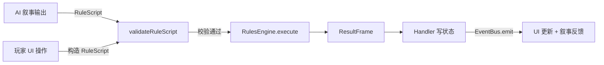
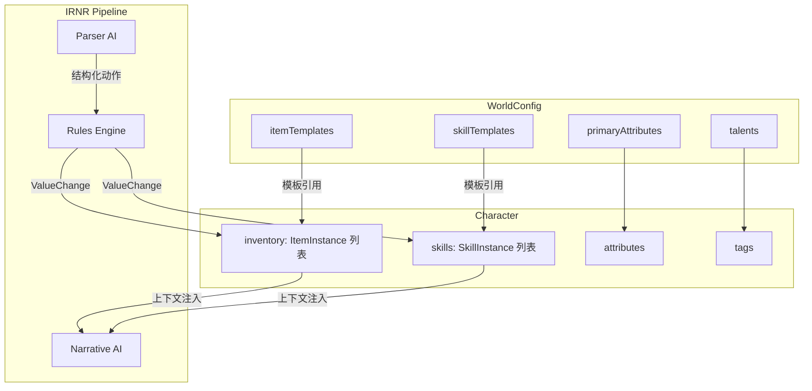

# 00 — 总览与核心原则

> **文档状态**：已评审 · 决策已确认
> **所属系统**：装备 / 背包 / 技能
> **最后更新**：2026-02

---

## 1. 目标

为 Lyra Next 引入**装备（Equipment）、背包（Inventory）、技能（Skill）**三大子系统，使 AI 叙事能够引用角色持有的物品与能力，从而增强沉浸感与角色成长体验。

### 1.1 核心目标

| #   | 目标           | 说明                                                                          |
| --- | -------------- | ----------------------------------------------------------------------------- |
| G1  | **叙事数据化** | 装备/技能作为结构化数据注入 AI 上下文，让叙事引用具体物品和能力名称、效果描述 |
| G2  | **轻交互增强** | 玩家可主动使用物品/释放技能，触发资源消耗（MP/体力等），增加合理性            |
| G3  | **角色成长感** | 技能可升级，装备可获取/替换，呈现角色渐进式成长                               |
| G4  | **架构一致性** | 与现有 DDD + 事件溯源 + 插件系统完全对齐，不引入新的架构范式                  |

### 1.2 非目标（当前不做）

| #   | 非目标          | 说明                                                   |
| --- | --------------- | ------------------------------------------------------ |
| N1  | 重战斗系统      | 不做回合制战棋、技能树 UI、装备强化/附魔等 MMORPG 机制 |
| N2  | 技能冷却        | 当前阶段不做 CD 系统，改用资源消耗作为使用约束         |
| N3  | 物品交易/合成   | 不做玩家间交易、物品合成配方系统                       |
| N4  | 装备数值化战斗  | 装备属性主要用于叙事参考，不做精密的 DPS 计算          |
| N5  | 可视化装备栏 UI | V1 阶段使用文本列表展示，不做纸娃娃/拖拽装备栏         |

---

## 2. 范围边界

```
┌─────────────────────────────────────────────────┐
│                  叙事优先区域                      │
│                                                   │
│  AI 看到角色持有什么装备/会什么技能                  │
│  AI 在叙事中引用这些数据                            │
│  AI 输出结构化动作 → Handler 执行状态变更            │
│                                                   │
├─────────────────────────────────────────────────┤
│                  轻交互区域                        │
│                                                   │
│  玩家主动使用物品/技能 → 资源消耗 → 叙事结果         │
│  AI 建议获得/失去物品 → Handler 修改背包             │
│  技能升级（同 ID 原地升级）                         │
│                                                   │
├─────────────────────────────────────────────────┤
│                  未来扩展区域（不在本期）             │
│                                                   │
│  装备强化/附魔 · 技能树 · 物品合成 · 交易系统        │
│  回合制战斗 · 技能冷却 · 装备耐久度                  │
│                                                   │
└─────────────────────────────────────────────────┘
```

---

## 3. 核心原则

### 3.1 模板/实例分离（Template / Instance）

所有物品和技能采用**两层数据模型**：

- **模板层（Template）**：定义在 `WorldConfig` 中，描述"世界中存在哪些物品/技能类型"
- **实例层（Instance）**：存在于角色身上，描述"某角色拥有的某个具体物品/技能"

```
WorldConfig.itemTemplates[]     →  角色背包中的 ItemInstance
WorldConfig.skillTemplates[]    →  角色技能列表中的 SkillInstance
```

> **为什么这样做？** AI 可以从模板库中挑选物品授予角色，也可以动态创造模板库中不存在的物品（标记为 `ai-generated`），与现有天赋系统的 `predefined` / `ai-generated` 模式一致。

### 3.2 AI 决策与状态执行分离（统一 RulesEngine 路径）



- **AI 只输出意图**：如 `{ type: "grantItem", target: "player", templateId: "healing_potion" }`
- **玩家操作也构造 RuleScript**：UI Handler 将操作封装为 `RuleScript`，喂入同一条管线
- **RulesEngine 是唯一执行入口**：两条路径共享同一套校验（白名单、参数、归属、业务规则）和结果记录
- **AI 禁止直接写状态**：所有状态修改必须经过 `RulesEngine` → `ResultFrame` → Handler 路径

> **[决策] 共享校验逻辑放置层**：校验逻辑统一在 `RulesEngine` 内部实现，玩家操作也构造 `RuleScript` 走同一管线。不在模块 Handler 层或 `src/lib/` 层单独维护校验函数。这保证两条路径产出完全相同格式的 `ResultFrame`，后续加战斗系统时零改动。

### 3.3 可回放与可扩展

- **ResultFrame 双轨记录**：
  - **资源类变更**（MP/HP/属性值）→ 继续走 `valueChanges`，与现有结构完全兼容
  - **结构类变更**（获得物品/学习技能/装备切换/技能升级）→ 新增 `structuralChanges` 可选字段（详见 [01-data-model-and-lifecycle.md §7](./01-data-model-and-lifecycle.md)）
  - **叙事摘要** → `mechanicSummary` 不变，仍为人类与 AI 可读的一句话总结
- **模块化注册**：装备/背包/技能以独立模块注册（如 `lyra.inventory`），通过 `ActionSchemaRegistry` 注册新的 Action 类型
- **WorldConfig 驱动**：预设作者可在 `WorldConfig` 中自定义物品/技能模板，无需修改代码

> **[决策] ValueChange 表达策略**：`ValueChange` 保持现有结构不变（仅记录标量字段变更），新增 `structuralChanges` 可选字段记录背包/技能的结构化变更。现有消费端零改动。

---

## 4. 与现有模块化架构的对齐

### 4.1 CommandBus 视角

| 关注点   | 现有模式                               | 新系统对齐方式                                  |
| -------- | -------------------------------------- | ----------------------------------------------- |
| 命令定义 | `ChatCommands` 常量 + Payload 接口     | 新增 `InventoryCommands` / `SkillCommands` 常量 |
| 命令处理 | `handlers.ts` 导出处理器函数           | 在 `modules/inventory/handlers.ts` 中实现       |
| 命令分发 | `commandBus.dispatch({type, payload})` | UI 和 AI Action 统一通过 dispatch 触发          |

### 4.2 EventBus 视角

| 关注点     | 现有模式                      | 新系统对齐方式                         |
| ---------- | ----------------------------- | -------------------------------------- |
| 事件定义   | `SaveEvents` 常量             | 新增 `InventoryEvents` / `SkillEvents` |
| 事件发布   | Handler 内 `eventBus.emit()`  | 物品获得/消耗/技能使用后发布事件       |
| 跨模块响应 | 其他模块 `eventBus.on()` 订阅 | Chat 模块可订阅以在叙事中自动引用      |

### 4.3 ServiceToken 视角

| 关注点     | 现有模式                      | 新系统对齐方式                                           |
| ---------- | ----------------------------- | -------------------------------------------------------- |
| 服务注册   | `IRNR_PIPELINE_SERVICE_TOKEN` | 新增 `INVENTORY_SERVICE_TOKEN`（只读查询）               |
| 服务契约   | `IrnrPipelineServiceContract` | 如 `getInventory(characterId)`, `getSkills(characterId)` |
| 跨模块调用 | `services.get(Token)`         | Game 模块可查询角色装备/技能用于 AI 上下文注入           |

### 4.4 ActionSchema 视角

| 关注点      | 现有模式                                                               | 新系统对齐方式                                             |
| ----------- | ---------------------------------------------------------------------- | ---------------------------------------------------------- |
| Schema 注册 | `actionSchemaRegistry.registerActions("lyra.game", gameActionSchemas)` | 新模块注册 `inventoryActionSchemas` / `skillActionSchemas` |
| Schema 分类 | `ActionCategory` 含 `"inventory"` / `"skill"`                          | 直接使用已预留的分类                                       |
| Prompt 生成 | `generateOperationDefinitions()` 自动包含已注册 Schema                 | 新 Action 自动出现在 AI Prompt 中                          |
| 校验流程    | `validateRuleScript()` 自动校验                                        | 新 Action 遵循相同校验管线                                 |

### 4.5 模块注册视角

```typescript
// 预期注册方式（伪代码，不实现）
// src/modules/inventory/index.ts
const manifest: ModuleManifest = {
  id: "lyra.inventory",
  version: "0.1.0",
  commands: createInventoryCommandHandlers(),
  // 未来可扩展 eventHandlers、aiTools
};

// src/modules/index.ts
await registerInventoryModule();  // 新增注册调用
```

> 与 `registerGameModule()` / `registerChatModule()` 等现有模块注册方式完全一致。

---

## 5. 与现有系统的关系



### 关键交互点

1. **WorldConfig 扩展**：在 `WorldConfig` 中新增 `itemTemplates` 和 `skillTemplates` 配置
2. **角色关联数据**：为角色新增独立存储的 `inventory` 和 `skills` 数据（通过 `characterId` 关联，不修改 `Character` 接口）
3. **EntityType 复用**：现有 `EntityType` 已包含 `"item"` 类型，可直接复用
4. **RuleAction 扩展**：新增 `grantItem` / `removeItem` / `useSkill` 等 Action 类型
5. **ActionCategory 复用**：现有 `ActionCategory` 已预留 `"inventory"` 和 `"skill"` 分类

---

## 6. 关键设计决策摘要

| 决策                 | 选择                                              | 理由                                           |
| -------------------- | ------------------------------------------------- | ---------------------------------------------- |
| 系统定位             | 叙事增强，非战斗核心                              | 项目当前阶段是文字叙事优先                     |
| 使用约束             | 资源消耗（MP/体力），无冷却                       | 提升合理性，避免过度复杂                       |
| 技能升级模式         | 同 ID 原地升级为默认                              | 简化数据管理，ID 稳定便于引用                  |
| 技能进化             | 旧退场 + 新创建，保留来源关系                     | 仅在"进化为不同能力"时使用                     |
| AI 状态修改          | 禁止直接写，必须走 RulesEngine                    | 安全性 + 可审计 + 可回放                       |
| 模块边界             | 独立 `lyra.inventory` 模块                        | 可热插拔，与现有模块无代码依赖                 |
| **ValueChange 策略** | 资源走 `valueChanges`，结构走 `structuralChanges` | 现有消费端零改动，新增字段仅影响新功能         |
| **RuleAction 组织**  | 集中定义 + 注释分组，超 35 个再拆文件             | 当前增量可控，避免过早拆分增加导入复杂度       |
| **共享校验逻辑层**   | 统一在 RulesEngine 内，玩家也构造 RuleScript      | 两条路径产出完全相同 ResultFrame，校验只写一次 |
