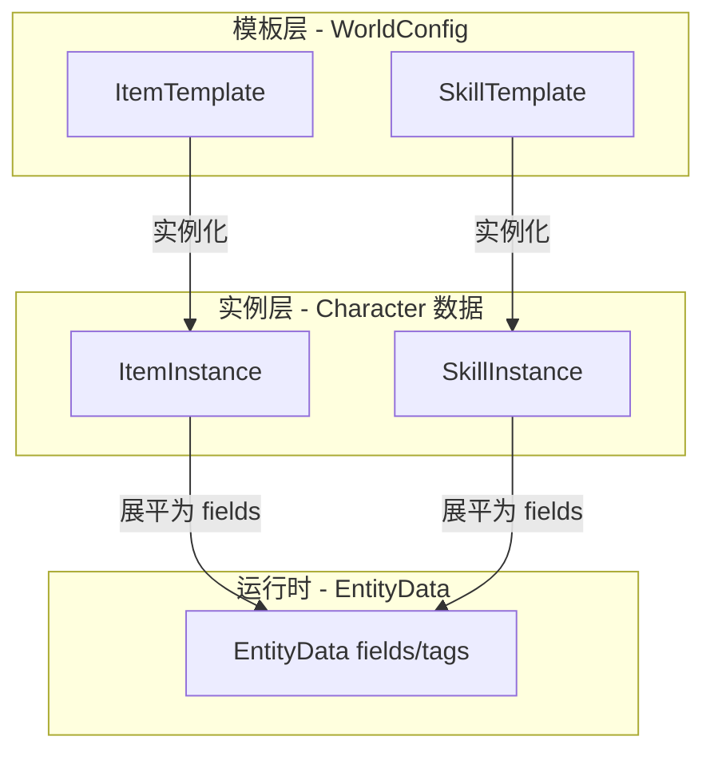
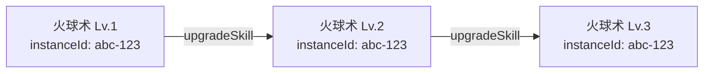
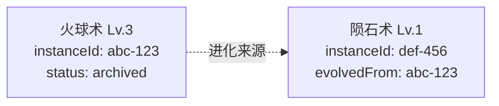
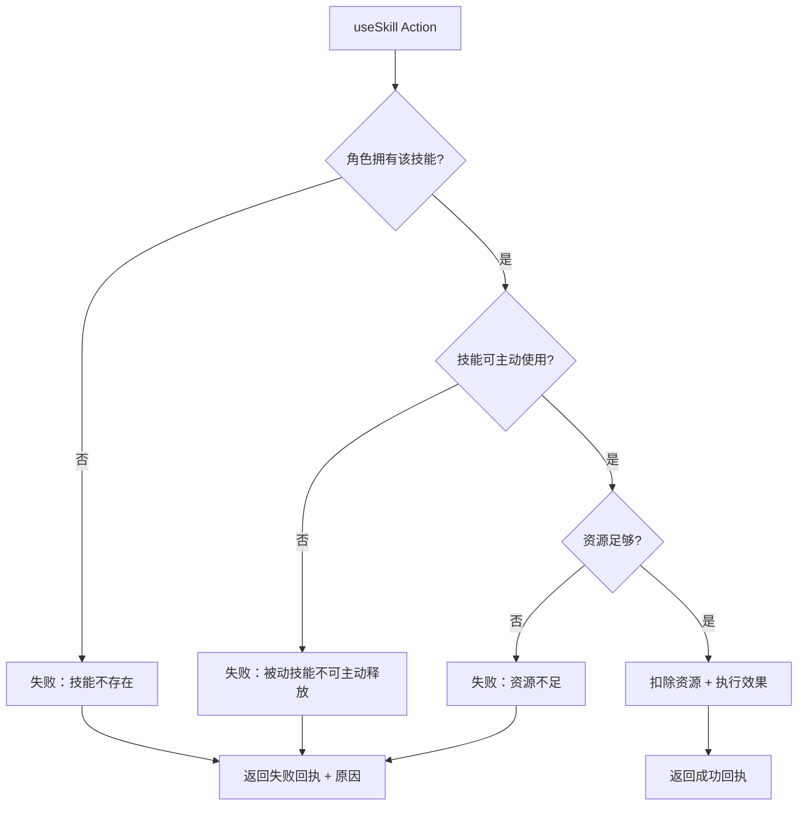
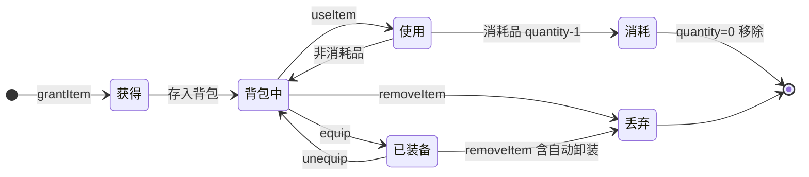
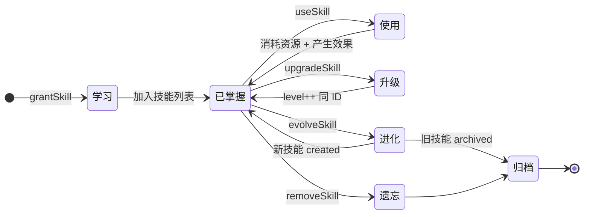

# 01 — 数据模型与生命周期

> **文档状态**：已评审 · 决策已确认
> **前置文档**：[00-overview-and-principles.md](./00-overview-and-principles.md)
> **最后更新**：2026-02

---

## 1. 数据分层概览



| 层级     | 存储位置                                                   | 谁写入                    | 谁读取                           |
| -------- | ---------------------------------------------------------- | ------------------------- | -------------------------------- |
| 模板层   | `WorldConfig.itemTemplates` / `WorldConfig.skillTemplates` | 预设作者 / 世界配置编辑器 | AI Prompt 注入、Handler 校验     |
| 实例层   | 角色关联数据（Yjs Map）                                    | CommandBus Handler        | UI 展示、AI 上下文、Rules Engine |
| 运行时层 | `EntityData.fields`                                        | Rules Engine              | ResultFrame 记录                 |

---

## 2. 模板层数据模型

### 2.1 ItemTemplate — 物品模板

```typescript
// 概念定义（非实现代码）
interface ItemTemplate {
  // ── MVP 字段 ──
  id: string;                    // 模板 ID，全局唯一
  name: string;                  // 物品名称
  description: string;           // 物品描述（AI 叙事参考）
  category: ItemCategory;        // 物品分类
  stackable: boolean;            // 是否可堆叠（默认 false）
  maxStack?: number;             // 最大堆叠数（stackable=true 时有效）

  // ── MVP 可选字段 ──
  equipSlot?: EquipSlot;         // 可装备的槽位（无此字段=不可装备）
  consumable?: boolean;          // 是否为消耗品（使用后数量-1）
  effects?: ItemEffect[];        // 使用/装备时的效果描述

  // ── Future 扩展字段 ──
  // rarity?: "common"|"uncommon"|"rare"|"epic"|"legendary"
  // weight?: number
  // durability?: number
  // craftRecipe?: CraftRecipe
  // icon?: string
  // prerequisites?: Record<string, number>
}

type ItemCategory =
  | "weapon"       // 武器
  | "armor"        // 防具
  | "accessory"    // 饰品
  | "consumable"   // 消耗品
  | "material"     // 素材
  | "quest"        // 任务物品
  | "misc";        // 其他

type EquipSlot =
  | "mainHand"     // 主手
  | "offHand"      // 副手
  | "head"         // 头部
  | "body"         // 身体
  | "legs"         // 腿部
  | "feet"         // 脚部
  | "accessory1"   // 饰品槽1
  | "accessory2";  // 饰品槽2

interface ItemEffect {
  type: "narrative" | "modifier";  // narrative=纯叙事描述, modifier=结构化修正
  description: string;             // 效果描述（AI 参考）
  modifiers?: PassiveModifier[];   // 结构化修正（复用现有 PassiveModifier 类型）
}
```

### 2.2 SkillTemplate — 技能模板

```typescript
// 概念定义（非实现代码）
interface SkillTemplate {
  // ── MVP 字段 ──
  id: string;                    // 模板 ID，全局唯一
  name: string;                  // 技能名称
  description: string;           // 技能描述（AI 叙事参考）
  category: SkillCategory;       // 技能分类
  maxLevel: number;              // 最大等级（默认 1 = 不可升级）

  // ── 资源消耗（MVP）──
  cost?: ResourceCost;           // 使用时的资源消耗

  // ── MVP 可选字段 ──
  activeUsable?: boolean;        // 是否可主动释放（默认 false = 被动技能）
  effects?: SkillEffect[];       // 各等级的效果描述
  prerequisites?: {              // 学习前置条件
    attributes?: Record<string, number>;
    skillIds?: string[];         // 需要先学会的技能
    level?: number;              // 需要的角色等级
  };

  // ── 技能进化（MVP）──
  evolvesInto?: {
    templateId: string;          // 进化后的技能模板 ID
    condition: string;           // 进化条件描述（AI 参考）
  };

  // ── Future 扩展字段 ──
  // cooldown?: number
  // targetType?: "self"|"single"|"area"
  // range?: number
  // castTime?: number
  // icon?: string
  // animation?: string
}

type SkillCategory =
  | "combat"       // 战斗技能
  | "magic"        // 魔法技能
  | "survival"     // 生存技能
  | "social"       // 社交技能
  | "craft"        // 制作技能
  | "misc";        // 其他

interface ResourceCost {
  field: string;    // 消耗的资源字段名（如 "mp", "stamina", "hp"）
  amount: number;   // 消耗量（支持负数=恢复，但不推荐）
}

interface SkillEffect {
  level: number;            // 生效的技能等级
  description: string;      // 该等级的效果描述（AI 参考）
  modifiers?: PassiveModifier[];  // 结构化修正
  costOverride?: ResourceCost;    // 该等级覆盖的资源消耗
}
```

### 2.3 WorldConfig 扩展

```typescript
// 概念定义 — WorldConfig 新增字段
interface WorldConfig {
  // ... 现有字段 ...

  /** 物品模板列表（预设作者定义） */
  itemTemplates?: ItemTemplate[];

  /** 技能模板列表（预设作者定义） */
  skillTemplates?: SkillTemplate[];

  /** 背包规则（可选） */
  inventoryRules?: {
    /** 默认背包容量（0 = 无限制），默认 20 */
    defaultCapacity?: number;
    /** 默认装备槽位列表 */
    equipSlots?: EquipSlot[];
  };
}
```

---

## 3. 实例层数据模型

### 3.1 ItemInstance — 物品实例

```typescript
// 概念定义（非实现代码）
interface ItemInstance {
  // ── MVP 字段 ──
  instanceId: string;            // 实例 ID（UUID），全局唯一
  templateId: string;            // 关联的模板 ID
  name: string;                  // 物品名称（可被 AI 覆盖，如 "附魔长剑"）
  description: string;           // 当前描述
  category: ItemCategory;        // 继承自模板
  quantity: number;              // 数量（不可堆叠时固定为 1）
  equipped: boolean;             // 是否已装备
  equipSlot?: EquipSlot;         // 装备在哪个槽位

  // ── 来源追踪 ──
  source: "predefined" | "ai-generated";  // 来源标记
  acquiredAt: number;            // 获得时间戳

  // ── Future 扩展字段 ──
  // durability?: number
  // enchantments?: string[]
  // customProperties?: Record<string, unknown>
}
```

### 3.2 SkillInstance — 技能实例

```typescript
// 概念定义（非实现代码）
interface SkillInstance {
  // ── MVP 字段 ──
  instanceId: string;            // 实例 ID（UUID），全局唯一
  templateId: string;            // 关联的模板 ID
  name: string;                  // 技能名称
  description: string;           // 当前等级的效果描述
  category: SkillCategory;       // 继承自模板
  level: number;                 // 当前等级（从 1 开始）
  maxLevel: number;              // 最大等级（继承自模板）
  activeUsable: boolean;         // 是否可主动释放

  // ── 资源消耗 ──
  cost?: ResourceCost;           // 当前等级的资源消耗

  // ── 来源追踪 ──
  source: "predefined" | "ai-generated";
  acquiredAt: number;            // 学习时间戳
  evolvedFrom?: string;          // 进化来源的 instanceId（如有）

  // ── Future 扩展字段 ──
  // experience?: number          // 技能经验值（用于自动升级）
  // lastUsedAt?: number
  // useCount?: number
}
```

### 3.3 角色数据扩展

角色的装备/背包/技能数据以**关联数据**形式存储，而非直接嵌入 `Character` 接口：

```typescript
// 概念层面的存储方式（非实际代码）

// 方案：在 Yjs 中为每个角色维护独立的 inventory 和 skills Map
// 路径示例：MainDoc.inventories.get(characterId) → Y.Array<ItemInstance>
// 路径示例：MainDoc.skills.get(characterId) → Y.Array<SkillInstance>

// 为什么不直接放在 Character.attributes 中？
// 1. attributes 是 Record<string, unknown>，缺乏类型安全
// 2. 物品/技能是结构化数组，不适合扁平 key-value
// 3. 独立存储便于模块热插拔（inventory 模块卸载不影响角色核心数据）
```

> **与现有类型的关系**：该方案不修改 `Character` 接口（`src/domain/entities/character.ts`）。`inventory` 和 `skills` 作为独立 Yjs 数据结构，通过 `characterId` 建立关联。

---

## 4. 技能升级与进化

### 4.1 升级（同 ID 原地升级）— 默认模式



- **ID 不变**：`instanceId` 保持 `abc-123`
- **字段更新**：`level++`，`description` 更新为新等级描述，`cost` 可能更新
- **触发方式**：AI 输出 `{ type: "upgradeSkill", target: "player", instanceId: "abc-123" }`
- **约束**：`level < maxLevel` 时才允许升级

### 4.2 进化（旧退场 + 新创建）— 特殊模式

仅在"技能进化为根本不同的能力"时使用：



- **旧技能归档**：`abc-123` 标记为 `archived`，不再可用但保留记录
- **新技能创建**：`def-456` 的 `evolvedFrom` 指向 `abc-123`
- **触发方式**：AI 输出 `{ type: "evolveSkill", target: "player", instanceId: "abc-123", newTemplateId: "meteor_strike" }`
- **前置条件**：旧技能达到 `maxLevel` 且模板声明了 `evolvesInto`

### 4.3 升级 vs 进化的判断标准

| 场景                   | 使用方式            | 示例                      |
| ---------------------- | ------------------- | ------------------------- |
| 同一技能变强           | 升级（ID 不变）     | 火球术 Lv.1 → Lv.2 → Lv.3 |
| 技能变为完全不同的能力 | 进化（旧退场+新建） | 火球术 Lv.3 → 陨石术 Lv.1 |
| 学会全新技能           | 新建                | 学会治疗术                |
| 忘记技能               | 归档                | 遗忘火球术                |

---

## 5. 资源消耗设计

### 5.1 ResourceCost 与 DerivedStat 的关系

资源消耗引用的 `field` 必须是 `WorldConfig.derivedStats` 中 `isResource: true` 的字段：

```typescript
// WorldConfig 中的资源定义示例
derivedStats: [
  { key: "max_mp", label: "最大魔力", formula: "int * 5 + 20", isResource: false },
  { key: "mp", label: "魔力", formula: "max_mp", isResource: true, maxField: "max_mp" },
  { key: "max_stamina", label: "最大体力", formula: "vit * 3 + 10", isResource: false },
  { key: "stamina", label: "体力", formula: "max_stamina", isResource: true, maxField: "max_stamina" },
]

// 技能消耗示例
cost: { field: "mp", amount: 15 }      // 消耗 15 点魔力
cost: { field: "stamina", amount: 10 }  // 消耗 10 点体力
```

### 5.2 消耗校验流程



---

## 6. 生命周期流程

### 6.1 物品生命周期



### 6.2 技能生命周期



---

## 7. MVP 与 Future 字段对比

### 7.1 ItemTemplate

| 字段            |  MVP  | Future | 说明              |
| --------------- | :---: | :----: | ----------------- |
| `id`            |   ✅   |        | 模板唯一标识      |
| `name`          |   ✅   |        | 物品名称          |
| `description`   |   ✅   |        | 效果/外观描述     |
| `category`      |   ✅   |        | 物品分类          |
| `stackable`     |   ✅   |        | 是否可堆叠        |
| `maxStack`      |   ✅   |        | 最大堆叠数        |
| `equipSlot`     |   ✅   |        | 可装备槽位        |
| `consumable`    |   ✅   |        | 是否消耗品        |
| `effects`       |   ✅   |        | 使用/装备效果     |
| `rarity`        |       |   ✅    | 稀有度            |
| `weight`        |       |   ✅    | 重量（负重系统）  |
| `durability`    |       |   ✅    | 耐久度            |
| `craftRecipe`   |       |   ✅    | 合成配方          |
| `icon`          |       |   ✅    | 图标标识          |
| `prerequisites` |       |   ✅    | 使用/装备前置条件 |

### 7.2 SkillTemplate

| 字段            |  MVP  | Future | 说明         |
| --------------- | :---: | :----: | ------------ |
| `id`            |   ✅   |        | 模板唯一标识 |
| `name`          |   ✅   |        | 技能名称     |
| `description`   |   ✅   |        | 技能描述     |
| `category`      |   ✅   |        | 技能分类     |
| `maxLevel`      |   ✅   |        | 最大等级     |
| `cost`          |   ✅   |        | 资源消耗     |
| `activeUsable`  |   ✅   |        | 可否主动释放 |
| `effects`       |   ✅   |        | 各等级效果   |
| `prerequisites` |   ✅   |        | 学习前置条件 |
| `evolvesInto`   |   ✅   |        | 进化路径     |
| `cooldown`      |       |   ✅    | 冷却时间     |
| `targetType`    |       |   ✅    | 目标类型     |
| `range`         |       |   ✅    | 射程         |
| `castTime`      |       |   ✅    | 施法时间     |
| `icon`          |       |   ✅    | 图标标识     |
| `animation`     |       |   ✅    | 动画标识     |

### 7.3 实例层

| 字段           |  MVP  | Future | 适用  | 说明                      |
| -------------- | :---: | :----: | ----- | ------------------------- |
| `instanceId`   |   ✅   |        | 通用  | 实例唯一标识              |
| `templateId`   |   ✅   |        | 通用  | 关联模板                  |
| `name`         |   ✅   |        | 通用  | 可被 AI 覆盖的名称        |
| `description`  |   ✅   |        | 通用  | 当前描述                  |
| `source`       |   ✅   |        | 通用  | predefined / ai-generated |
| `acquiredAt`   |   ✅   |        | 通用  | 获得时间                  |
| `quantity`     |   ✅   |        | Item  | 数量                      |
| `equipped`     |   ✅   |        | Item  | 是否已装备                |
| `equipSlot`    |   ✅   |        | Item  | 装备槽位                  |
| `level`        |   ✅   |        | Skill | 当前等级                  |
| `cost`         |   ✅   |        | Skill | 当前消耗                  |
| `activeUsable` |   ✅   |        | Skill | 可否主动释放              |
| `evolvedFrom`  |   ✅   |        | Skill | 进化来源                  |
| `durability`   |       |   ✅    | Item  | 耐久度                    |
| `enchantments` |       |   ✅    | Item  | 附魔列表                  |
| `experience`   |       |   ✅    | Skill | 技能经验                  |
| `useCount`     |       |   ✅    | Skill | 使用次数                  |
| `lastUsedAt`   |       |   ✅    | Skill | 上次使用时间              |

---

## 8. 与现有类型的关系映射

| 新概念                 | 对应现有类型            | 关系                                |
| ---------------------- | ----------------------- | ----------------------------------- |
| `ItemTemplate`         | `TalentConfig`          | 类似模式：模板定义在 WorldConfig 中 |
| `SkillTemplate`        | `TalentConfig`          | 技能模板结构参考天赋配置            |
| `ItemInstance`         | `TagMetadata`           | 实例附着在角色上，有 source 标记    |
| `SkillInstance`        | `TagMetadata`           | 类似模式，但增加 level/cost         |
| `ItemEffect.modifiers` | `PassiveModifier`       | 直接复用现有被动修正类型            |
| `ResourceCost.field`   | `DerivedStatConfig.key` | 消耗字段引用世界配置中的资源定义    |
| `EntityType: "item"`   | 已存在                  | 物品作为实体参与规则引擎计算        |

---

## 9. Yjs 存储结构草案

```
MainDoc (Y.Doc)
├── characters (Y.Map)           // 现有
│   └── {characterId} (Y.Map)
│       ├── name, status, ...    // 现有字段
│       └── attributes (Y.Map)   // 现有字段
│
├── inventories (Y.Map)          // 新增
│   └── {characterId} (Y.Array)
│       └── ItemInstance (Y.Map)
│           ├── instanceId
│           ├── templateId
│           ├── name, quantity, equipped, ...
│           └── ...
│
└── skills (Y.Map)               // 新增
    └── {characterId} (Y.Array)
        └── SkillInstance (Y.Map)
            ├── instanceId
            ├── templateId
            ├── name, level, cost, ...
            └── ...
```

> **设计考量**：
> - 独立于 `characters` 存储，模块卸载时不影响角色核心数据
> - 使用 `Y.Array` 存储实例列表，支持有序操作
> - 每个 `ItemInstance` / `SkillInstance` 是一个 `Y.Map`，支持字段级同步
> - `characterId` 作为 key，O(1) 查找某角色的全部物品/技能

---

## 10. ResultFrame 扩展：StructuralChange

> **[决策]** 资源类变更（MP/HP/属性值）继续走现有 `valueChanges`，结构类变更（物品/技能操作）通过新增的 `structuralChanges` 可选字段记录。现有消费端零改动。

### 10.1 StructuralChange 类型定义

```typescript
// 概念定义（非实现代码）

interface StructuralChange {
  /** 变更类型 */
  readonly type:
    | "item_added"
    | "item_removed"
    | "item_used"
    | "item_equipped"
    | "item_unequipped"
    | "skill_learned"
    | "skill_removed"
    | "skill_used"
    | "skill_upgraded"
    | "skill_evolved";
  /** 关联角色 ID */
  readonly entityId: string;
  /** 物品/技能实例 ID */
  readonly targetId: string;
  /** 模板 ID（方便查名称，可选） */
  readonly templateId?: string;
  /** 额外细节（如 quantity, newLevel, evolvedFromId） */
  readonly details?: Record<string, ValuePrimitive>;
  /** 变更原因 */
  readonly reason?: string;
}
```

### 10.2 ResultFrame 扩展

```typescript
interface ResultFrame {
  // ...现有字段完全不变
  readonly valueChanges: readonly ValueChange[];          // 资源/标量变更
  readonly structuralChanges?: readonly StructuralChange[]; // 新增，可选
  readonly mechanicSummary: string;                        // 人类可读摘要
}
```

### 10.3 各动作对应的记录方式

| 动作           | `valueChanges`         | `structuralChanges`             | `mechanicSummary`         |
| -------------- | ---------------------- | ------------------------------- | ------------------------- |
| `grantItem`    | —                      | `item_added`                    | 获得了 [物品名]           |
| `removeItem`   | —                      | `item_removed`                  | 失去了 [物品名]           |
| `useItem`      | 可能含 HP/MP 恢复/消耗 | `item_used`                     | 使用 [物品名]，恢复 20 HP |
| `equip`        | —                      | `item_equipped`                 | 装备 [物品名] 至 [槽位]   |
| `unequip`      | —                      | `item_unequipped`               | 卸下 [物品名]             |
| `useSkill`     | MP/体力扣除            | `skill_used`                    | 消耗 15 MP 释放 [技能名]  |
| `grantSkill`   | —                      | `skill_learned`                 | 学会了 [技能名]           |
| `upgradeSkill` | —                      | `skill_upgraded` + newLevel     | [技能名] 升级至 Lv.X      |
| `evolveSkill`  | —                      | `skill_evolved` + evolvedFromId | [旧技能] 进化为 [新技能]  |

> **阶段策略**：V1 叙事版可以只填 `mechanicSummary`，不填 `structuralChanges`；V1.5 补上 `structuralChanges` 以支持 UI 结构化渲染和回放校验。

---

## 11. RuleAction 类型组织策略

> **[决策]** 当前阶段（~25 个 Action）维持集中定义在 `rule-script.ts` 中，用注释分组新增装备/技能 Action。当 Action 总数超过 ~35 个时再拆分为按功能域分文件 + 中心聚合的模式。

### 11.1 当前文件组织

```
src/domain/types/rule-script.ts
├── // ─── 基础动作 ───  (check/damage/gain/lose/roll/setValue)
├── // ─── 状态效果 ───  (addTag/removeTag/modifyTag)
├── // ─── 流程控制 ───  (conditional/sequence)
├── // ─── NPC 操作 ───  (npcCreate/npcStatusChange/npcAction)
├── // ─── 伤害修正 ───  (modifyDamage)
├── // ─── 装备/背包 ─── (grantItem/removeItem/useItem/equip/unequip)  ← 新增
└── // ─── 技能操作 ───  (grantSkill/removeSkill/useSkill/upgradeSkill/evolveSkill) ← 新增
```

### 11.2 联合类型扩展

```typescript
// rule-script.ts 中的联合类型
export type RuleAction =
  | CheckAction | DamageAction | GainAction | LoseAction
  | RollAction | AddTagAction | RemoveTagAction | ModifyTagAction
  | SetValueAction | ConditionalAction | SequenceAction
  | ModifyDamageAction
  | NpcCreateAction | NpcStatusChangeAction | NpcActionAction
  // ─── 装备/背包 ───
  | GrantItemAction | RemoveItemAction | UseItemAction
  | EquipAction | UnequipAction
  // ─── 技能操作 ───
  | GrantSkillAction | RemoveSkillAction | UseSkillAction
  | UpgradeSkillAction | EvolveSkillAction;
```

### 11.3 未来拆分阈值

当 Action 总数超过 ~35 个（预计 V2 战斗扩展时），迁移到按功能域分文件模式：

```
src/domain/types/
├── rule-script.ts              ← RuleScript, RuleAction 聚合, 基础类型
├── rule-actions-combat.ts      ← 战斗相关
├── rule-actions-npc.ts         ← NPC 相关
├── rule-actions-inventory.ts   ← 装备/背包
└── rule-actions-skill.ts       ← 技能
```

此迁移属于低风险重构，消费端只需更新 import 路径。
