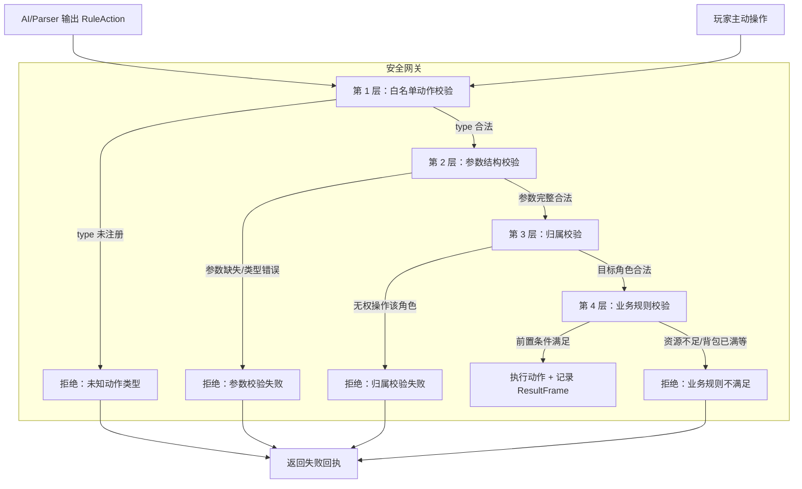
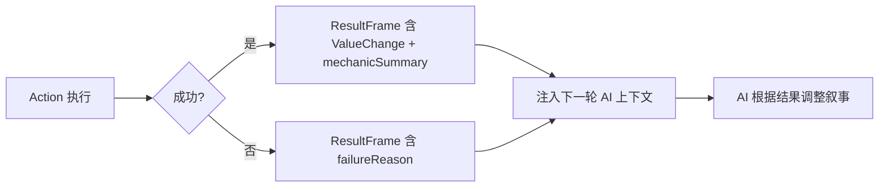
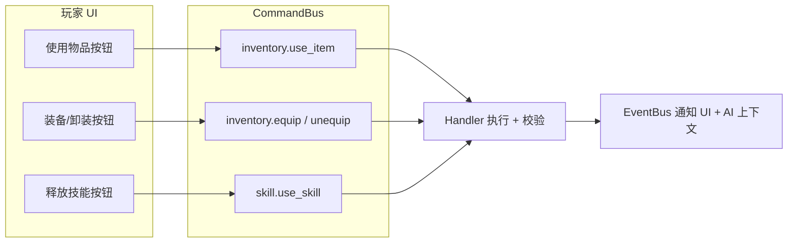

# 02 — AI 操作网关与动作设计

> **文档状态**：已评审 · 决策已确认
> **前置文档**：[01-data-model-and-lifecycle.md](./01-data-model-and-lifecycle.md)
> **最后更新**：2026-02

---

## 1. 核心约束：AI 禁止直接写状态

```
┌──────────────────────────────────────────────────────────┐
│  ❌ 禁止路径                                              │
│                                                          │
│  AI 输出 → 直接修改 Store / Yjs                           │
│                                                          │
├──────────────────────────────────────────────────────────┤
│  ✅ 唯一合法路径                                          │
│                                                          │
│  AI 输出 → RuleAction → ActionSchema 校验                 │
│         → RulesEngine 执行 → Handler 写状态               │
│         → ResultFrame 记录 → EventBus 通知                │
│                                                          │
└──────────────────────────────────────────────────────────┘
```

**为什么？**

1. **安全性**：AI 可能输出不合法的操作（给不存在的角色加物品、扣除超过持有量的资源）
2. **可审计**：所有状态变更通过 ResultFrame 记录，支持历史回放和调试
3. **一致性**：与现有 `RuleAction` → `RulesEngine` 管线完全一致，无需引入新范式
4. **多人安全**：CommandBus 在联机模式下可添加权限校验中间件

---

## 2. 安全网关设计

### 2.1 四层校验管线



### 2.2 各层校验详情

| 层级          | 校验内容                                           | 实现位置                                       | 失败处理                      |
| ------------- | -------------------------------------------------- | ---------------------------------------------- | ----------------------------- |
| **L1 白名单** | `action.type` 是否在 `ActionSchemaRegistry` 中注册 | `validateRuleScript()`                         | 移除未知 action，记录 warning |
| **L2 参数**   | 必填参数是否存在、类型是否正确、枚举值是否合法     | `validateRuleScript()` + `ActionSchema.params` | error 级别阻止执行            |
| **L3 归属**   | `target` 实体是否存在、操作者是否有权操作该实体    | `RulesEngine` 执行时                           | 跳过该 action，记录 error     |
| **L4 业务**   | 背包容量、资源余额、技能前置条件、堆叠上限等       | `RulesEngine` 内的具体 action handler          | 标记失败，附带原因描述        |

### 2.3 白名单动作注册

新动作通过 `ActionSchemaRegistry` 注册，与现有 Game 模块模式一致：

```typescript
// 概念示例（非实现代码）
actionSchemaRegistry.registerActions("lyra.inventory", [
  grantItemSchema,
  removeItemSchema,
  useItemSchema,
  equipSchema,
  unequipSchema,
  grantSkillSchema,
  removeSkillSchema,
  useSkillSchema,
  upgradeSkillSchema,
  evolveSkillSchema,
]);
```

未注册的 `action.type` 会在 `validateRuleScript()` 阶段被移除，AI 无法通过伪造 type 绕过校验。

---

## 3. 动作列表

### 3.1 物品/背包动作

#### grantItem — 授予物品

> AI 判断角色在叙事中获得物品时输出此动作。

| 参数          | 类型      | 必填  | 说明                          |
| ------------- | --------- | :---: | ----------------------------- |
| `target`      | entityRef |   ✅   | 目标角色 ID                   |
| `templateId`  | string    |       | 物品模板 ID（已知模板时使用） |
| `name`        | string    |   ✅   | 物品名称                      |
| `description` | string    |   ✅   | 物品描述                      |
| `category`    | enum      |   ✅   | 物品分类                      |
| `quantity`    | number    |       | 数量（默认 1）                |
| `reason`      | string    |       | 获得原因                      |

**校验规则**：
- `templateId` 存在时，校验其是否在 `WorldConfig.itemTemplates` 中
- `templateId` 不存在时，视为 AI 动态创造物品（`source: "ai-generated"`）
- 背包容量检查（非堆叠物品占用格数 + 新物品 ≤ 容量上限）
- 堆叠物品检查已有同模板实例，合并数量

**成功回执**：`StructuralChange { type: "item_added", entityId, targetId: instanceId, reason: "获得了 {name}" }`

---

#### removeItem — 移除物品

> 物品丢弃、被偷、损坏等场景。

| 参数         | 类型      | 必填  | 说明                 |
| ------------ | --------- | :---: | -------------------- |
| `target`     | entityRef |   ✅   | 目标角色 ID          |
| `instanceId` | string    |   ✅   | 物品实例 ID          |
| `quantity`   | number    |       | 移除数量（默认全部） |
| `reason`     | string    |       | 移除原因             |

**校验规则**：
- `instanceId` 必须存在于目标角色的背包中
- 数量不超过持有量
- 已装备的物品自动先卸装再移除

---

#### useItem — 使用物品

> 玩家主动使用或 AI 叙事中角色使用物品。

| 参数           | 类型      | 必填  | 说明                             |
| -------------- | --------- | :---: | -------------------------------- |
| `target`       | entityRef |   ✅   | 使用者角色 ID                    |
| `instanceId`   | string    |   ✅   | 物品实例 ID                      |
| `targetEntity` | entityRef |       | 使用目标（如对他人使用治疗药水） |
| `reason`       | string    |       | 使用场景描述                     |

**校验规则**：
- 物品必须存在且数量 ≥ 1
- 消耗品使用后 `quantity--`，归零时移除
- 非消耗品使用后数量不变

**成功回执**：包含物品效果的 `mechanicSummary`（如 "使用治疗药水，恢复 20 HP"）

---

#### equip — 装备物品

| 参数         | 类型      | 必填  | 说明                                 |
| ------------ | --------- | :---: | ------------------------------------ |
| `target`     | entityRef |   ✅   | 角色 ID                              |
| `instanceId` | string    |   ✅   | 物品实例 ID                          |
| `slot`       | enum      |       | 目标槽位（不指定则使用物品默认槽位） |

**校验规则**：
- 物品必须有 `equipSlot` 定义
- 目标槽位已有装备时，自动卸装旧装备（交换）
- 装备效果（modifiers）立即生效

---

#### unequip — 卸装物品

| 参数         | 类型      | 必填  | 说明        |
| ------------ | --------- | :---: | ----------- |
| `target`     | entityRef |   ✅   | 角色 ID     |
| `instanceId` | string    |   ✅   | 物品实例 ID |

**校验规则**：
- 物品必须处于 `equipped: true` 状态
- 装备效果（modifiers）立即移除

---

### 3.2 技能动作

#### grantSkill — 授予/学习技能

| 参数           | 类型      | 必填  | 说明                         |
| -------------- | --------- | :---: | ---------------------------- |
| `target`       | entityRef |   ✅   | 目标角色 ID                  |
| `templateId`   | string    |       | 技能模板 ID                  |
| `name`         | string    |   ✅   | 技能名称                     |
| `description`  | string    |   ✅   | 技能描述                     |
| `category`     | enum      |   ✅   | 技能分类                     |
| `activeUsable` | boolean   |       | 是否可主动释放（默认 false） |
| `cost`         | object    |       | 资源消耗 `{ field, amount }` |
| `reason`       | string    |       | 学习原因/场景                |

**校验规则**：
- 不允许学习已拥有的同 `templateId` 技能（去重）
- `templateId` 存在时校验前置条件（属性、等级、前置技能）
- 动态创造技能标记为 `source: "ai-generated"`

---

#### removeSkill — 遗忘/移除技能

| 参数         | 类型      | 必填  | 说明        |
| ------------ | --------- | :---: | ----------- |
| `target`     | entityRef |   ✅   | 目标角色 ID |
| `instanceId` | string    |   ✅   | 技能实例 ID |
| `reason`     | string    |       | 移除原因    |

**校验规则**：
- 技能必须存在于角色技能列表中
- 被动修正立即移除

---

#### useSkill — 使用技能

> 玩家主动释放或 AI 叙事中角色施展技能。

| 参数           | 类型      | 必填  | 说明          |
| -------------- | --------- | :---: | ------------- |
| `target`       | entityRef |   ✅   | 施放者角色 ID |
| `instanceId`   | string    |   ✅   | 技能实例 ID   |
| `targetEntity` | entityRef |       | 技能目标      |
| `reason`       | string    |       | 使用场景描述  |

**校验规则**：
- 技能必须存在且 `activeUsable: true`
- **当前阶段不做冷却校验**：MVP / V1.5 仅校验可主动释放与资源余额，冷却系统留到 V2
- **资源消耗校验**：`角色当前资源[cost.field] >= cost.amount`
- 资源不足时返回失败回执（附带当前资源值和所需资源值）
- 成功时自动扣除资源（生成 `ValueChange`）

**成功回执**：
```json
{
  "valueChanges": [
    { "entityId": "player", "field": "mp", "oldValue": 50, "newValue": 35, "delta": -15, "reason": "释放火球术" }
  ],
  "mechanicSummary": "消耗 15 MP 释放火球术"
}
```

---

#### upgradeSkill — 升级技能

| 参数         | 类型      | 必填  | 说明              |
| ------------ | --------- | :---: | ----------------- |
| `target`     | entityRef |   ✅   | 角色 ID           |
| `instanceId` | string    |   ✅   | 技能实例 ID       |
| `reason`     | string    |       | 升级原因/触发场景 |

**校验规则**：
- 技能 `level < maxLevel`
- **ID 不变**，仅更新 `level`、`description`、`cost` 等字段
- 如模板定义了该等级的 `SkillEffect`，应用新效果

---

#### evolveSkill — 技能进化

| 参数            | 类型      | 必填  | 说明                |
| --------------- | --------- | :---: | ------------------- |
| `target`        | entityRef |   ✅   | 角色 ID             |
| `instanceId`    | string    |   ✅   | 旧技能实例 ID       |
| `newTemplateId` | string    |   ✅   | 进化后的技能模板 ID |
| `reason`        | string    |       | 进化原因            |

**校验规则**：
- 旧技能必须达到 `maxLevel`
- 旧技能模板的 `evolvesInto.templateId` 必须匹配 `newTemplateId`
- 旧技能标记为归档（保留记录）
- 新技能的 `evolvedFrom` 指向旧技能 `instanceId`

---

### 3.3 动作分类与 ActionCategory 映射

| 动作           | ActionCategory | 说明     |
| -------------- | -------------- | -------- |
| `grantItem`    | `inventory`    | 物品获取 |
| `removeItem`   | `inventory`    | 物品移除 |
| `useItem`      | `inventory`    | 物品使用 |
| `equip`        | `inventory`    | 装备物品 |
| `unequip`      | `inventory`    | 卸装物品 |
| `grantSkill`   | `skill`        | 学习技能 |
| `removeSkill`  | `skill`        | 遗忘技能 |
| `useSkill`     | `skill`        | 使用技能 |
| `upgradeSkill` | `skill`        | 升级技能 |
| `evolveSkill`  | `skill`        | 技能进化 |

> `ActionCategory` 中已预留 `"inventory"` 和 `"skill"` 分类，无需修改现有类型定义。

---

## 4. 成功/失败回执与 AI 叙事反哺

### 4.1 回执数据流



### 4.2 成功回执格式

成功的物品/技能操作会产生以下数据，注入 AI 下一轮上下文。资源变更走 `valueChanges`，结构变更走 `structuralChanges`（详见 [01-data-model-and-lifecycle.md §10](./01-data-model-and-lifecycle.md)）：

```json
{
  "success": true,
  "valueChanges": [
    {
      "entityId": "char_001",
      "entityType": "character",
      "field": "mp",
      "oldValue": 50,
      "newValue": 35,
      "delta": -15,
      "reason": "释放火球术"
    }
  ],
  "structuralChanges": [
    {
      "type": "skill_used",
      "entityId": "char_001",
      "targetId": "skill_fireball_001",
      "templateId": "fireball",
      "reason": "释放火球术"
    }
  ],
  "mechanicSummary": "角色消耗 15 MP 成功释放火球术"
}
```

### 4.3 失败回执格式

失败时附带结构化原因，AI 可据此调整叙事（如描述"魔力不足，火球术施放失败"）：

```json
{
  "success": false,
  "failureReason": "资源不足：需要 15 MP，当前仅有 10 MP",
  "mechanicSummary": "火球术施放失败 - MP 不足"
}
```

### 4.4 AI 叙事反哺机制

| 场景                    | ResultFrame 内容                                      | AI 叙事预期                   |
| ----------------------- | ----------------------------------------------------- | ----------------------------- |
| 使用治疗药水成功        | `mechanicSummary: "使用治疗药水，恢复 20 HP"`         | AI 描述角色饮下药水、伤口愈合 |
| 技能释放失败（MP 不足） | `failureReason: "MP 不足"`                            | AI 描述角色尝试施法但力竭     |
| 获得新装备              | `mechanicSummary: "获得 精钢长剑"`                    | AI 描述角色捡起/被授予武器    |
| 装备交换                | `mechanicSummary: "装备 精钢长剑 至 主手，卸下 铁剑"` | AI 描述角色换装               |
| 技能升级                | `mechanicSummary: "火球术升级至 Lv.2"`                | AI 描述角色领悟更强技法       |

---

## 5. 异常处理策略

### 5.1 AI 输出异常分类

| 异常类型     | 示例                           | 处理策略                                          |
| ------------ | ------------------------------ | ------------------------------------------------- |
| 未知动作类型 | `{ type: "createItem" }`       | L1 白名单拦截，移除该 action，记录 warning        |
| 参数缺失     | `grantItem` 无 `target`        | L2 参数校验，标记 fatal error，整个 action 不执行 |
| 参数值非法   | `category: "legendary_weapon"` | L2 枚举校验，记录 warning，尝试自动修复或跳过     |
| 目标不存在   | `target: "不存在的角色"`       | L3 归属校验，跳过该 action                        |
| 物品不存在   | `instanceId: "xxx"`            | L4 业务校验，返回失败回执                         |
| 资源不足     | MP 不够释放技能                | L4 业务校验，返回失败回执（附带资源详情）         |
| 背包已满     | 超过容量上限                   | L4 业务校验，返回失败回执                         |
| 重复学习     | 已拥有同模板技能               | L4 业务校验，返回失败回执                         |

### 5.2 自动修复策略

与现有 `validateRuleScript()` 的修复模式一致：

- **warning 级别**：记录日志，尝试修复后继续执行（如枚举值纠正）
- **error 级别**：该 action 不执行，但不影响同批次其他 action
- **fatal 级别**：整个 RuleScript 不执行（极少触发）

### 5.3 AI 重试引导

当操作失败时，失败原因会注入 AI 下一轮上下文。AI 可选择：

1. **调整叙事**：描述操作失败的场景（"魔力枯竭，火球术未能成形"）
2. **替代方案**：尝试其他操作（改用不消耗 MP 的物理攻击）
3. **忽略**：在叙事中跳过该操作

> AI **不应**在同一回合内重试失败的操作，因为前置条件未变。Handler 在同一 RuleScript 批次内会去重。

---

## 6. 玩家主动操作入口

除了 AI 通过 RuleAction 触发外，玩家也可以主动操作：



| 操作      | CommandBus 命令                         | 说明                           |
| --------- | --------------------------------------- | ------------------------------ |
| 使用物品  | `inventory.use_item`                    | 玩家从背包选择物品使用         |
| 装备/卸装 | `inventory.equip` / `inventory.unequip` | 玩家管理装备                   |
| 释放技能  | `skill.use_skill`                       | 玩家从技能列表选择主动技能释放 |

> **[决策] 统一 RulesEngine 路径**：玩家主动操作的 Handler 将操作封装为 `RuleScript`，喂入 `RulesEngine.execute()` 同一条管线。与 AI 触发路径共享完全相同的校验逻辑（白名单、参数、归属、业务规则）和结果记录（`ResultFrame`）。不存在"特权路径"——两条路径仅入口不同：
>
> ```
> AI 路径：  Parser AI → RuleScript → validateRuleScript() → RulesEngine.execute() → ResultFrame
> 玩家路径：UI → CommandBus → Handler 构造 RuleScript → RulesEngine.execute() → ResultFrame
> ```
>
> 校验逻辑只写一次（在 RulesEngine 内部），后续加战斗系统时零改动。

---

## 7. 上下文注入策略

### 7.1 AI 可见的角色数据

在每轮 AI 调用时，将角色的装备/技能信息注入 Prompt 上下文：

```markdown
## 角色状态 - 艾琳

### 装备
- 主手：精钢长剑（物理攻击+5）
- 身体：皮甲（物理防御+3）

### 背包（4/20 格）
- 治疗药水 x3（消耗品，恢复 20 HP）
- 魔力水晶 x1（消耗品，恢复 30 MP）

### 技能
- 火球术 Lv.2（主动，消耗 15 MP）—— 发射火焰弹攻击目标
- 铁壁 Lv.1（被动）—— 物理防御+2
- 治疗术 Lv.1（主动，消耗 20 MP）—— 恢复目标 30 HP
```

### 7.2 注入时机

| 时机             | 注入内容                                  | 目的                          |
| ---------------- | ----------------------------------------- | ----------------------------- |
| 叙事 AI 调用前   | 角色装备/背包/技能完整列表                | AI 在叙事中引用具体物品和能力 |
| Parser AI 调用前 | 可用动作列表（含物品/技能 Action Schema） | AI 知道可以输出哪些结构化动作 |
| 操作结果后       | 上一轮 ResultFrame 的 mechanicSummary     | AI 根据操作结果调整后续叙事   |
