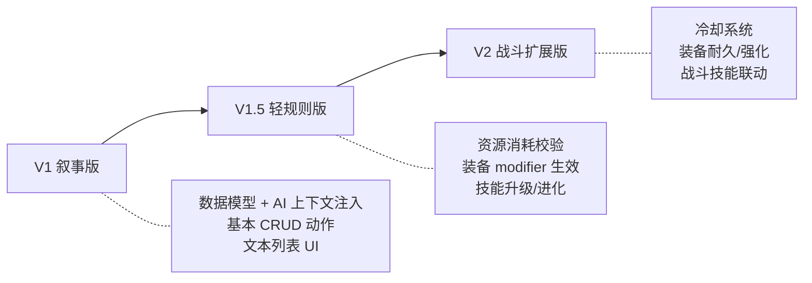
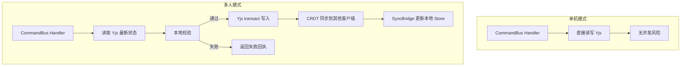
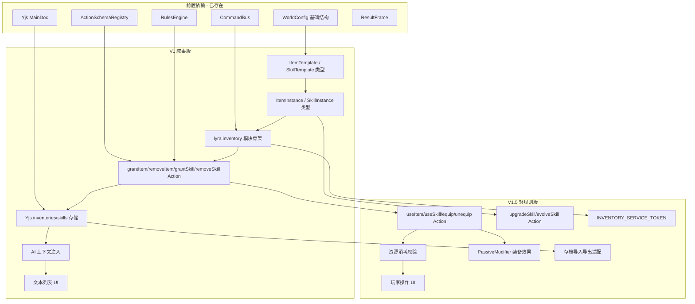

# 03 — 分阶段路线图与风险

> **文档状态**：已评审 · 决策已确认
> **前置文档**：[02-ai-operation-gateway-and-actions.md](./02-ai-operation-gateway-and-actions.md)
> **最后更新**：2026-02

---

## 1. 阶段总览

---

## 2. V1 — 叙事版

### 2.1 目标

> 让 AI 叙事能"看到"并"引用"角色的物品和技能，实现基本的获取/移除/展示。

### 2.2 范围

| 模块             | V1 包含                                                           | V1 不含                                                                  |
| ---------------- | ----------------------------------------------------------------- | ------------------------------------------------------------------------ |
| **数据模型**     | ItemTemplate, SkillTemplate, ItemInstance, SkillInstance 完整定义 | Future 扩展字段（rarity, durability, cooldown 等）                       |
| **WorldConfig**  | `itemTemplates`, `skillTemplates`, `inventoryRules` 配置          | 装备强化/合成配置                                                        |
| **动作**         | `grantItem`, `removeItem`, `grantSkill`, `removeSkill`            | `useItem`, `useSkill`, `equip`, `unequip`, `upgradeSkill`, `evolveSkill` |
| **ActionSchema** | 上述 4 个动作的 Schema 定义 + 注册                                | 资源消耗校验、业务规则校验                                               |
| **AI 上下文**    | 角色物品/技能列表注入 Prompt                                      | 装备效果数值注入                                                         |
| **UI**           | 角色面板中的文本列表展示（背包/技能）                             | 装备槽 UI、技能释放按钮                                                  |
| **存储**         | Yjs `inventories` / `skills` Map 结构                             | 存档导入/导出适配                                                        |
| **模块**         | `lyra.inventory` 模块注册、Command 定义                           | Service Token 跨模块查询                                                 |

### 2.3 验收标准

| #   | 验收项                                       | 通过条件                                        |
| --- | -------------------------------------------- | ----------------------------------------------- |
| A1  | 预设作者可在 WorldConfig 中定义物品/技能模板 | 加载含模板的预设后，模板可被系统读取            |
| A2  | AI 叙事可输出 `grantItem` 动作               | Parser AI 输出有效的 grantItem action，通过校验 |
| A3  | 物品写入角色背包                             | grantItem 执行后，角色数据中可查到该物品        |
| A4  | AI 可在叙事中引用角色物品                    | Prompt 上下文包含角色物品列表                   |
| A5  | AI 可动态创造非模板物品                      | source 标记为 ai-generated，物品正常存入        |
| A6  | 物品/技能在 UI 中可见                        | 角色面板中显示简单文本列表                      |
| A7  | Yjs 持久化正常                               | 刷新页面后物品/技能数据不丢失                   |

---

## 3. V1.5 — 轻规则版

### 3.1 目标

> 引入资源消耗、装备效果和技能升级，使系统具有轻量级的游戏规则感。

### 3.2 范围

| 模块         | V1.5 新增                                                                |
| ------------ | ------------------------------------------------------------------------ |
| **动作**     | `useItem`, `useSkill`, `equip`, `unequip`, `upgradeSkill`, `evolveSkill` |
| **资源消耗** | useSkill 扣除 MP/体力等资源，资源不足时返回失败回执                      |
| **装备效果** | equip 时应用 `PassiveModifier`，unequip 时移除                           |
| **技能升级** | upgradeSkill 同 ID 升级，更新 level/description/cost                     |
| **技能进化** | evolveSkill 旧归档+新创建，保留 evolvedFrom                              |
| **玩家操作** | 使用物品/释放技能/装备管理的 UI 按钮                                     |
| **Service**  | `INVENTORY_SERVICE_TOKEN` 跨模块只读查询                                 |
| **导入导出** | 存档导入/导出包含物品和技能数据                                          |

### 3.3 验收标准

| #   | 验收项                  | 通过条件                                            |
| --- | ----------------------- | --------------------------------------------------- |
| B1  | 使用技能消耗 MP         | useSkill 执行后 MP 减少，ResultFrame 含 ValueChange |
| B2  | MP 不足时技能使用失败   | 返回失败回执，AI 叙事反映失败                       |
| B3  | 装备物品生效            | equip 后 PassiveModifier 在检定中生效               |
| B4  | 技能升级正常            | level++ 后描述和消耗更新，ID 不变                   |
| B5  | 技能进化正常            | 旧技能归档，新技能含 evolvedFrom                    |
| B6  | 玩家可主动使用物品/技能 | UI 按钮触发 CommandBus，与 AI 路径共享校验          |
| B7  | 存档导入导出完整        | 导出含物品/技能，导入后数据完整恢复                 |
| B8  | 消耗品使用后数量减少    | 归零时物品自动移除                                  |

### 3.4 V1 → V1.5 迁移策略

| 迁移项              | 策略                                        | 风险                               |
| ------------------- | ------------------------------------------- | ---------------------------------- |
| RuleAction 类型扩展 | 在 `RuleAction` 联合类型中新增 6 种 Action  | 低：纯追加，不影响现有 Action      |
| ActionSchema 注册   | 在 `lyra.inventory` 模块中追加注册新 Schema | 低：追加注册不影响已有 Schema      |
| 资源字段引用        | cost.field 引用 WorldConfig.derivedStats    | 中：需确保预设中定义了对应资源字段 |
| UI 新增操作按钮     | 角色面板中添加操作入口                      | 低：纯 UI 追加                     |

---

## 4. V2 — 战斗扩展版

### 4.1 目标

> 在轻规则基础上扩展更完整的战斗和物品系统，支持更丰富的游戏机制。

### 4.2 范围（概念层面）

| 模块             | V2 新增方向                            |
| ---------------- | -------------------------------------- |
| **冷却系统**     | 技能使用后 CD 回合数，每回合递减       |
| **装备耐久**     | 使用/战斗中耐久度下降，可修理          |
| **装备强化**     | 附魔/升级/镶嵌系统                     |
| **物品合成**     | 配方系统，素材组合产出新物品           |
| **战斗技能联动** | 技能与战斗阶段深度结合（连击、反击等） |
| **装备栏 UI**    | 可视化装备槽、拖拽操作                 |
| **技能树 UI**    | 可视化技能树/天赋树                    |

### 4.3 验收标准

| #   | 验收项         | 通过条件                               |
| --- | -------------- | -------------------------------------- |
| C1  | 冷却系统正常   | 技能使用后进入 CD，CD 期间使用返回失败 |
| C2  | 耐久度系统正常 | 战斗后耐久下降，归零后装备失效         |
| C3  | 物品合成正常   | 素材消耗 + 产出新物品                  |
| C4  | 装备栏 UI      | 可视化拖拽装备                         |

### 4.4 V1.5 → V2 迁移策略

| 迁移项   | 策略                                   | 风险             |
| -------- | -------------------------------------- | ---------------- |
| 冷却字段 | SkillInstance 新增 `cooldownRemaining` | 低：可选字段追加 |
| 耐久字段 | ItemInstance 新增 `durability`         | 低：可选字段追加 |
| 合成系统 | WorldConfig 新增 `craftRecipes`        | 中：新增配置结构 |
| UI 大改  | 纸娃娃装备栏替换文本列表               | 高：UI 重构      |

---

## 5. 风险清单

### 5.1 技术风险

| #   | 风险                              | 影响                            | 等级  | 缓解措施                                                     |
| --- | --------------------------------- | ------------------------------- | :---: | ------------------------------------------------------------ |
| R1  | AI 输出的物品/技能数据不规范      | 校验失败率高，影响叙事流畅度    |  高   | 完善 ActionSchema 描述和示例；自动修复降级为 warning         |
| R2  | Yjs 数据结构迁移                  | 版本升级时旧存档不兼容          |  中   | 预留 version 字段；编写迁移脚本                              |
| R3  | 性能：大量物品/技能的 Prompt 注入 | Token 用量激增，AI 调用成本上升 |  中   | 设置注入上限（如仅注入装备中和前 N 个背包物品）；摘要模式    |
| R4  | 模板/实例一致性                   | 模板修改后已有实例数据过时      |  低   | 实例冗余关键字段（name/description），模板变更不自动更新实例 |
| R5  | RuleAction 联合类型膨胀           | 新增 10 种 Action，类型联合变大 |  低   | 按模块分文件定义，运行时通过 ActionSchemaRegistry 管理       |

### 5.2 产品风险

| #   | 风险                 | 影响                                   | 等级  | 缓解措施                                      |
| --- | -------------------- | -------------------------------------- | :---: | --------------------------------------------- |
| R6  | 过度设计偏离叙事核心 | 系统过于游戏化，偏离"文字叙事优先"定位 |  高   | 严格遵循"非目标"清单；V1 仅做叙事增强         |
| R7  | 预设作者配置负担     | 物品/技能模板配置复杂度提升            |  中   | 提供默认模板集；AI 可动态创造，降低预配置依赖 |
| R8  | 玩家认知负担         | 系统概念过多（装备/背包/技能/资源）    |  中   | V1 仅文本展示；渐进式引入复杂度               |

### 5.3 架构风险

| #   | 风险       | 影响                                                 | 等级  | 缓解措施                                           |
| --- | ---------- | ---------------------------------------------------- | :---: | -------------------------------------------------- |
| R9  | 模块间耦合 | inventory 模块需要读取 WorldConfig 和 Character 数据 |  中   | 通过 ServiceToken 只读查询；不直接 import 其他模块 |
| R10 | 存储层膨胀 | Yjs MainDoc 新增两个顶层 Map                         |  低   | 独立存储路径，模块卸载时不影响核心数据             |

---

## 6. 与多人/同步（Yjs）的潜在冲突

### 6.1 并发冲突场景

| 场景         | 冲突描述                        | 风险等级 |
| ------------ | ------------------------------- | :------: |
| **同时拾取** | 两个玩家同时 grantItem 同一物品 |    中    |
| **背包容量** | 多个 grantItem 并发，超出容量   |    中    |
| **装备交换** | 两人同时修改同一角色的装备槽    |    低    |
| **技能使用** | 两人同时对同一 NPC 使用技能     |    低    |
| **资源消耗** | 并发 useSkill 可能导致资源超扣  |    高    |

### 6.2 Yjs CRDT 特性分析

| Yjs 类型           | 并发行为               | 对本系统的影响                   |
| ------------------ | ---------------------- | -------------------------------- |
| `Y.Map.set()`      | Last-Writer-Wins       | 装备状态（equipped）最后写入者胜 |
| `Y.Array.push()`   | 全部保留（追加不冲突） | grantItem 并发安全，但可能超容量 |
| `Y.Array.delete()` | 幂等（删除不冲突）     | removeItem 并发安全              |
| `Y.Map` 内嵌字段   | 字段级 LWW             | quantity 并发修改可能丢失增量    |

### 6.3 前置规避建议

| 冲突场景          | 规避策略                                                                                                            | 阶段 |
| ----------------- | ------------------------------------------------------------------------------------------------------------------- | ---- |
| **资源超扣**      | Handler 执行前从 Yjs 读取最新值做本地校验；接受 CRDT 最终一致性（极端情况允许小幅超扣，下次同步时修正）             | V1   |
| **背包超容量**    | grantItem Handler 在写入前检查当前容量；超容量时拒绝并返回失败回执；依赖 CRDT 最终一致性在短暂窗口内可能超出 1-2 格 | V1   |
| **同时拾取**      | "世界物品"概念（V2 引入）：物品实体独立于角色，拾取时先锁定再转移；V1 不做世界物品，AI 直接 grantItem 给特定角色    | V2   |
| **装备状态冲突**  | 单角色通常由单玩家控制，Companion 由 AI 控制；多人模式下限制非本人角色操作权限                                      | V1   |
| **quantity 并发** | 使用 Yjs 事务（`doc.transact()`）将读取-校验-写入原子化；不能完全防止并发但缩小窗口                                 | V1.5 |

### 6.4 架构层面的保护措施

**关键原则**：

1. **乐观执行**：Handler 基于本地最新状态校验并执行，不等待全局确认
2. **最终一致**：依赖 Yjs CRDT 保证数据最终收敛
3. **容忍窗口**：接受并发窗口内的短暂不一致（如背包短暂超容量 1-2 格）
4. **下游修正**：SyncBridge 同步后触发二次校验，超出部分可通过 AI 叙事合理化（如"背包太重，掉落了一件物品"）

---

## 7. 各阶段依赖关系

---

## 8. 实施建议

### 8.1 V1 推荐实施顺序

1. **定义数据类型**：在 `src/domain/` 下新增 ItemTemplate、SkillTemplate、ItemInstance、SkillInstance 类型
2. **扩展 WorldConfig**：添加 `itemTemplates`、`skillTemplates`、`inventoryRules` 字段
3. **创建模块骨架**：`src/modules/inventory/` 目录结构（index.ts, handlers.ts, store.ts）
4. **实现 ActionSchema**：4 个基础动作的 Schema 定义和注册
5. **实现 Handler**：grantItem / removeItem / grantSkill / removeSkill 的命令处理器
6. **Yjs 存储**：inventories / skills Map 结构创建和 SyncBridge
7. **AI 上下文注入**：在 Prompt 组装阶段注入角色物品/技能列表
8. **UI 展示**：角色面板中的简单文本列表

### 8.2 风险缓解优先级

| 优先级 | 风险                 | 行动                                  |
| :----: | -------------------- | ------------------------------------- |
|   P0   | R6 过度设计          | V1 严格控制范围，只做叙事增强         |
|   P0   | R1 AI 输出不规范     | 完善 Schema 描述和示例，充分测试      |
|   P1   | R3 Token 用量        | 设计摘要注入模式，限制注入量          |
|   P1   | R9 模块耦合          | 从 V1 开始使用 ServiceToken 模式      |
|   P2   | R2 数据迁移          | 预留 version 字段，但 V1 不需实际迁移 |
|   P2   | 并发资源超扣（§6.1） | V1 不含资源消耗，V1.5 时处理          |
