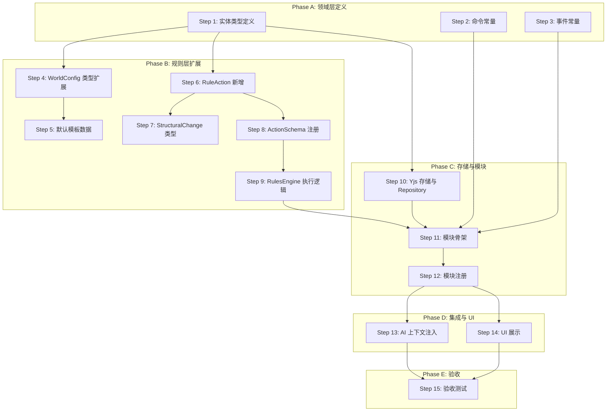

# 04 — V1 叙事版实现计划

> **文档状态**：已确认 · 待实施
> **前置文档**：[03-phased-roadmap-and-risks.md](./03-phased-roadmap-and-risks.md)
> **覆盖范围**：仅 V1 叙事版（V1.5 另行规划）
> **最后更新**：2026-02

---

## 1. V1 目标回顾

> 让 AI 叙事能"看到"并"引用"角色的物品和技能，实现基本的获取/移除/展示。

**V1 包含**：数据模型、WorldConfig 扩展、4 个基础 Action（grantItem/removeItem/grantSkill/removeSkill）、Yjs 存储、AI 上下文注入、文本列表 UI

**V1 不含**：useItem/useSkill/equip/unequip、资源消耗、装备效果、技能升级/进化、玩家操作按钮

---

## 2. 实施步骤总览



---

## 3. 详细步骤

### Step 1: 领域层 — 定义物品/技能类型

**目标**：在 `src/domain/` 下定义 MVP 数据类型

**涉及文件**：
- 新建 `src/domain/entities/item.ts`
- 新建 `src/domain/entities/skill.ts`
- 修改 `src/domain/entities/index.ts`（导出新类型）

**产出**：
```typescript
// item.ts
interface ItemTemplate {
  id: string;
  name: string;
  description: string;
  category: ItemCategory;
  stackable: boolean;
  maxStack: number;
  equipSlot?: EquipSlot;
  consumable: boolean;
  effects?: ItemEffect;
}

type ItemCategory = "weapon" | "armor" | "accessory" | "consumable" | "material" | "quest" | "misc";
type EquipSlot = "main_hand" | "off_hand" | "head" | "body" | "legs" | "feet" | "accessory";

interface ItemInstance {
  instanceId: string;
  templateId: string;
  name: string;
  description: string;
  category: ItemCategory;
  quantity: number;
  equipped: boolean;
  equipSlot?: EquipSlot;
  source: "predefined" | "ai-generated";
  acquiredAt: number;
}

// skill.ts
interface SkillTemplate {
  id: string;
  name: string;
  description: string;
  category: SkillCategory;
  maxLevel: number;
  activeUsable: boolean;
  cost?: ResourceCost;
  effects?: SkillEffect[];
  prerequisites?: SkillPrerequisites;
  evolvesInto?: { templateId: string; name: string };
}

type SkillCategory = "combat" | "magic" | "support" | "passive" | "utility";

interface ResourceCost {
  field: string;   // 引用 DerivedStatConfig.key，如 "mp"
  amount: number;
}

interface SkillInstance {
  instanceId: string;
  templateId: string;
  name: string;
  description: string;
  category: SkillCategory;
  level: number;
  maxLevel: number;
  activeUsable: boolean;
  cost?: ResourceCost;
  source: "predefined" | "ai-generated";
  acquiredAt: number;
  evolvedFrom?: string;
}
```

**参考设计文档**：[01-data-model-and-lifecycle.md §2-3](./01-data-model-and-lifecycle.md)

---

### Step 2: 领域层 — 定义命令常量与 Payload

**目标**：定义 inventory 模块的 CommandBus 命令

**涉及文件**：
- 新建 `src/domain/commands/inventory.ts`
- 修改 `src/domain/commands/index.ts`（导出）

**产出**：
```typescript
export const InventoryCommands = {
  GRANT_ITEM: "inventory.grant_item",
  REMOVE_ITEM: "inventory.remove_item",
  GRANT_SKILL: "inventory.grant_skill",
  REMOVE_SKILL: "inventory.remove_skill",
} as const;

// + 对应的 Payload 接口
```

**命名规范**：遵循现有 `ChatCommands` 的 `"module.action_name"` 模式

---

### Step 3: 领域层 — 定义事件常量与 Payload

**目标**：定义 inventory 模块的 EventBus 事件

**涉及文件**：
- 新建 `src/domain/events/inventory.ts`
- 修改 `src/domain/events/index.ts`（导出）

**产出**：
```typescript
export const InventoryEvents = {
  ITEM_GRANTED: "inventory.item_granted",
  ITEM_REMOVED: "inventory.item_removed",
  SKILL_GRANTED: "inventory.skill_granted",
  SKILL_REMOVED: "inventory.skill_removed",
  INVENTORY_CHANGED: "inventory.changed",  // 通用变更事件
} as const;

// + 对应的 Payload 接口
```

---

### Step 4: WorldConfig 扩展 — 添加模板配置字段

**目标**：在 WorldConfig 类型中增加物品/技能模板配置

**涉及文件**：
- 修改 `src/lib/world/types.ts`（WorldConfig 接口）
- 修改 `src/lib/world/index.ts`（导出新类型）

**产出**：
```typescript
interface WorldConfig {
  // ...现有字段
  itemTemplates?: ItemTemplate[];
  skillTemplates?: SkillTemplate[];
  inventoryRules?: {
    defaultCapacity?: number;    // 默认 20
    equipSlots?: EquipSlot[];
  };
}
```

**约束**：所有新字段均为可选，确保现有预设向后兼容

---

### Step 5: WorldConfig 扩展 — 添加默认示例模板

**目标**：在默认世界配置中提供 2-3 个示例物品和技能模板

**涉及文件**：
- 修改 `src/lib/world/defaults.ts`（DEFAULT_WORLD_CONFIG）

**产出示例**：
- 物品模板：治疗药水（消耗品）、铁剑（武器/可装备）
- 技能模板：火球术（主动/魔法）、坚韧体魄（被动）

**目的**：让预设作者有参考样板；开箱即用的测试数据

---

### Step 6: RuleAction 扩展 — 新增 4 个 Action 接口

**目标**：在 RuleAction 联合类型中添加 grantItem/removeItem/grantSkill/removeSkill

**涉及文件**：
- 修改 `src/domain/types/rule-script.ts`

**产出**：
```typescript
// ─── 装备/背包 Action ────────────────────────────────────
interface GrantItemAction extends RuleActionBase {
  type: "grantItem";
  target: string;          // 角色 ID
  templateId?: string;     // 模板 ID（可选，AI 可动态创造）
  name: string;
  description: string;
  category: string;
  quantity?: number;       // 默认 1
  reason?: string;
}

interface RemoveItemAction extends RuleActionBase {
  type: "removeItem";
  target: string;
  instanceId: string;
  quantity?: number;       // 默认全部
  reason?: string;
}

// ─── 技能操作 Action ────────────────────────────────────
interface GrantSkillAction extends RuleActionBase {
  type: "grantSkill";
  target: string;
  templateId?: string;
  name: string;
  description: string;
  category: string;
  activeUsable?: boolean;  // 默认 false
  cost?: { field: string; amount: number };
  reason?: string;
}

interface RemoveSkillAction extends RuleActionBase {
  type: "removeSkill";
  target: string;
  instanceId: string;
  reason?: string;
}
```

并将这 4 个类型追加到 `RuleAction` 联合类型中。

---

### Step 7: RuleAction 扩展 — 新增 StructuralChange 类型

**目标**：在 ResultFrame 中增加结构化变更记录能力

**涉及文件**：
- 修改 `src/domain/types/result-frame.ts`

**产出**：
```typescript
interface StructuralChange {
  readonly type:
    | "item_added" | "item_removed"
    | "skill_learned" | "skill_removed";
    // V1.5 再追加: item_used/item_equipped/item_unequipped/skill_used/skill_upgraded/skill_evolved
  readonly entityId: string;
  readonly targetId: string;
  readonly templateId?: string;
  readonly details?: Record<string, ValuePrimitive>;
  readonly reason?: string;
}

interface ResultFrame {
  // ...现有字段不变
  readonly structuralChanges?: readonly StructuralChange[];  // 新增
}
```

**约束**：`structuralChanges` 为可选字段，现有消费端零改动

---

### Step 8: ActionSchema — 定义并注册 4 个动作的 Schema

**目标**：为 grantItem/removeItem/grantSkill/removeSkill 创建 ActionSchema 并注册到 Registry

**涉及文件**：
- 新建 `src/modules/inventory/schemas/` 目录
- 或在现有 `src/modules/game/services/action-schemas.ts` 中追加（两种方式均可，推荐新建以保持模块独立性）

**每个 Schema 需定义**：
- `displayName` / `description`（面向 AI）
- `category`：`"inventory"` 或 `"skill"`
- `params[]`（参数定义 + 必填/类型/枚举）
- `examples[]`（JSON 示例，帮助 AI 输出正确格式）
- `validate()`（可选校验函数）

**注册方式**：
```typescript
actionSchemaRegistry.registerActions("lyra.inventory", [
  grantItemSchema, removeItemSchema, grantSkillSchema, removeSkillSchema,
]);
```

**参考设计文档**：[02-ai-operation-gateway-and-actions.md §3](./02-ai-operation-gateway-and-actions.md)

---

### Step 9: RulesEngine 扩展 — 实现 4 个 Action 的执行逻辑

**目标**：在 RulesEngine 中添加 grantItem/removeItem/grantSkill/removeSkill 的执行分支

**涉及文件**：
- 修改 `src/lib/rules/engine.ts`（新增 case 分支）
- 可能修改 `src/lib/rules/result-builder.ts`（支持 structuralChanges）

**核心逻辑**（每个 Action）：
1. 从 `ExecutionContext` 读取角色实例数据
2. 校验（背包容量、实例存在性、去重等）
3. 产生 `StructuralChange` 记录
4. 更新 Shadow State
5. 校验失败时 → `success: false` + `failureReason`

**关键依赖**：需要扩展 `EntityAccessor` 接口以支持读取 inventory/skill 数据

---

### Step 10: Yjs 存储 — 创建 inventories/skills Map 与 Repository

**目标**：在 Yjs MainDoc 中创建 inventories/skills 顶层 Map，并封装 Repository

**涉及文件**：
- 新建 `src/modules/inventory/repository/inventory-repository.ts`
- 可能修改 `src/core/yjs/init.ts`（初始化新 Map）
- 可能修改 `src/core/yjs/migrations.ts`（数据迁移兼容）

**Repository API**：
```typescript
interface InventoryRepository {
  getItems(characterId: string): ItemInstance[];
  addItem(characterId: string, item: ItemInstance): void;
  removeItem(characterId: string, instanceId: string, quantity?: number): void;
  getSkills(characterId: string): SkillInstance[];
  addSkill(characterId: string, skill: SkillInstance): void;
  removeSkill(characterId: string, instanceId: string): void;
}
```

**存储结构**：
```
MainDoc.inventories.get(characterId) → Y.Array<Y.Map>
MainDoc.skills.get(characterId) → Y.Array<Y.Map>
```

---

### Step 11: 模块骨架 — 创建 modules/inventory/ 目录

**目标**：创建 `lyra.inventory` 模块的完整骨架

**涉及文件**：
- 新建 `src/modules/inventory/index.ts`
- 新建 `src/modules/inventory/handlers.ts`
- 新建 `src/modules/inventory/store.ts`

**handlers.ts 核心**：
- 4 个命令处理器（grantItem/removeItem/grantSkill/removeSkill）
- 每个 Handler 内部构造 `RuleScript`，调用 `RulesEngine.execute()`
- 根据 `ResultFrame` 结果写入 Yjs（通过 Repository）
- 发布对应 EventBus 事件

**store.ts 核心**：
- Zustand store，维护从 Yjs 同步来的本地状态
- 只读 selectors 供 UI 使用

**index.ts 核心**：
```typescript
const manifest: ModuleManifest = {
  id: "lyra.inventory",
  version: "0.1.0",
  commands: createInventoryCommandHandlers(),
};
await registry.register(manifest);
```

---

### Step 12: 模块注册 — 在 modules/index.ts 中注册

**目标**：将 `lyra.inventory` 模块加入启动流程

**涉及文件**：
- 修改 `src/modules/index.ts`

**变更**：
```typescript
export async function registerAllModules(): Promise<void> {
  // Phase 1: 核心模块
  await registerSaveModule();
  await registerChatModule();
  await registerDataModule();
  // Phase 2: IRNR 模块
  await registerGameModule();
  // Phase 2.5: 装备/技能模块
  await registerInventoryModule();  // ← 新增
  // Phase 3: 联机模块
  registerRoomModule();
}
```

**注册顺序**：在 `registerGameModule()` 之后（依赖 RulesEngine），在 `registerRoomModule()` 之前

---

### Step 13: AI 上下文注入 — Prompt Marker 注入

**目标**：在 AI 调用时将角色的物品/技能信息注入 Prompt 上下文

**涉及文件**：
- 修改 Prompt 组装逻辑（`src/lib/prompt/` 相关文件）
- 可能新增 marker 类型或扩展现有 `characterState` marker

**注入格式示例**：
```markdown
## 角色状态 - 艾琳

### 背包（3/20 格）
- 治疗药水 x3（消耗品）
- 铁剑 x1（武器，已装备）

### 技能
- 火球术 Lv.1（主动/魔法）
- 坚韧体魄 Lv.1（被动）
```

**约束**：
- V1 不设注入上限，全量注入角色物品和技能列表（后续有 Token 用量问题时再加限制）
- 空背包/空技能列表时注入"无物品"/"无技能"

---

### Step 14: UI 展示 — 角色面板文本列表

**目标**：在角色面板中展示背包物品和技能的简单文本列表

**涉及文件**：
- 修改 `src/components/CharacterPanel/index.tsx`
- 可能新建 `src/components/CharacterPanel/InventoryList.tsx`
- 可能新建 `src/components/CharacterPanel/SkillList.tsx`

**UI 要求**：
- 文本列表形式，显示物品名称/数量/类别
- 技能显示名称/等级/类型
- 空列表时显示"暂无物品"/"暂无技能"
- 不做操作按钮（V1.5 再加）
- 遵循现有 Token 系统，不硬编码颜色

---

### Step 15: 验收测试

**目标**：验证 V1 全部 7 项验收标准通过

| #   | 验收项                                       | 测试方式                                                      |
| --- | -------------------------------------------- | ------------------------------------------------------------- |
| A1  | 预设作者可在 WorldConfig 中定义物品/技能模板 | 加载含模板的预设，检查模板可被系统读取                        |
| A2  | AI 叙事可输出 `grantItem` 动作               | 发送消息触发 AI，检查 Parser 输出有效的 grantItem action      |
| A3  | 物品写入角色背包                             | grantItem 执行后，角色 Yjs 数据中可查到该物品                 |
| A4  | AI 可在叙事中引用角色物品                    | 检查 Prompt 上下文包含角色物品列表                            |
| A5  | AI 可动态创造非模板物品                      | AI 输出无 templateId 的 grantItem，source 标记为 ai-generated |
| A6  | 物品/技能在 UI 中可见                        | 角色面板中显示简单文本列表                                    |
| A7  | Yjs 持久化正常                               | 刷新页面后物品/技能数据不丢失                                 |

---

## 4. 推荐实施路径

```
Day 1-2:  Phase A（Step 1-3）— 纯类型定义，快速完成
Day 3-4:  Phase B（Step 4-9）— 规则层，核心逻辑
Day 5:    Phase C（Step 10-12）— 存储与模块串联
Day 6:    Phase D（Step 13-14）— 集成与 UI
Day 7:    Phase E（Step 15）— 验收与修复
```

> 以上为推荐节奏参考，实际进度根据开发情况调整。

---

## 5. 风险缓解检查点

| 检查点       | 时机           | 验证内容                                                  |
| ------------ | -------------- | --------------------------------------------------------- |
| **CP1**      | Step 6 完成后  | RuleAction 联合类型编译通过，现有测试无回归               |
| **CP2**      | Step 9 完成后  | RulesEngine 可执行 grantItem，产出正确的 StructuralChange |
| **CP3**      | Step 12 完成后 | 模块注册成功，命令可 dispatch，事件可接收                 |
| **CP4**      | Step 13 完成后 | AI Prompt 中可见角色物品/技能列表                         |
| **最终验收** | Step 15        | A1-A7 全部通过                                            |
