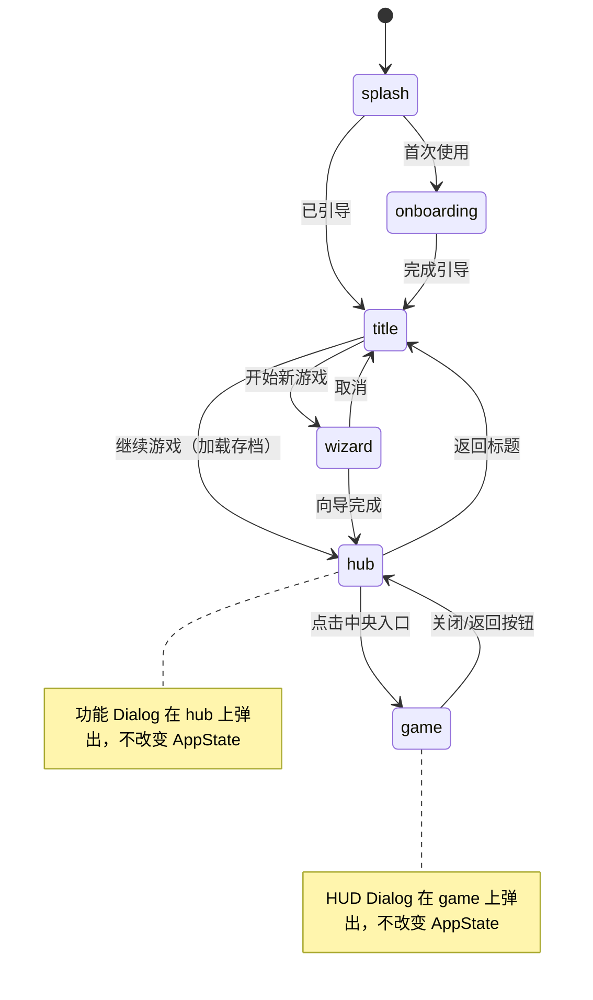

# Game Hub 功能中枢设计方案

**版本**：1.0
**性质**：UI 架构重构设计文档
**前置依赖**：无
**设计日期**：2025-07-14

---

## 1. 设计目标与动机

### 1.1 当前问题

当前游戏界面（`appState === "game"`）的所有功能入口都挤在 `AppShell` 的 Header 右侧按钮带中：

```
Header: [Logo] ··· [角色][世界书][预设][记忆][检查点][联机][存档][⚙]
```

**痛点**：
1. **扩展性差**：Header 是线性布局，每新增一个功能就多一个图标，空间有限
2. **移动端拥挤**：8 个按钮在小屏上严重拥挤，部分文字被 `hidden sm:inline` 隐藏
3. **视觉表达力不足**：每个入口只是 16-18px 的小图标，无法传达功能状态和描述
4. **缺乏游戏感**：工具栏式的 Header 不符合 Lyra 作为 RPG 运行时的定位

### 1.2 设计目标

引入 **Hub（功能中枢）** 作为中间层，将功能入口按 **"系统级"** 和 **"游戏级"** 分层：

- **Hub 层**：放置系统/元信息功能（低频、配置性质）
- **GameView 层**：保留游戏状态 HUD（高频、玩家需要实时看到的）
- **移除 AppShell Header**：GameView 变为全屏沉浸式，HUD 元素浮动在内容之上

### 1.3 核心原则

- **聊天即游戏**：Hub 的中央入口通往 GameView（聊天/叙事界面），GameView 是游戏的核心
- **随时可退**：从 GameView 返回 Hub 不影响游戏状态，不中断任何进行中的流程
- **功能发现性**：Hub 上的功能入口自带图标、中英文标签和状态摘要，新用户能快速理解
- **风格化优先**：Hub 是玩家进入游戏世界的"大厅"，视觉应有沉浸感

### 1.4 参考设计

灵感来源于类似项目的「场景 + 散布功能入口」模式：

- 全屏背景场景，营造沉浸式氛围
- 功能入口以图标+标签的形式散布在四角和边缘
- 中央放置主入口（如一本书），点击后进入聊天/游戏界面
- 游戏内的角色状态、背包等 HUD 放在游戏界面内部，不在 Hub 中

---

## 2. 信息架构：功能分层

### 2.1 分类原则

| 分类维度 | Hub 侧 | GameView HUD 侧 |
|---------|--------|----------------|
| 使用频率 | 低频（偶尔配置） | 高频（游戏中随时查看） |
| 功能性质 | 系统级、元信息 | 游戏状态、实时数据 |
| 典型操作 | 打开编辑器、调整配置 | 瞥一眼状态、快速操作 |
| 中断游戏流 | 可以接受 | 不应中断 |

### 2.2 功能分配表

#### Hub 侧功能入口（四角散布）

| 功能 | 位置 | 图标 | 标签 | 状态摘要示例 | 对应现有组件 |
|------|------|------|------|------------|------------|
| **预设 (Preset)** | 左上 | 🔮 Wand | 提示词 / PRESET | 当前预设名 | `PresetButton` → `PresetWorkspace` |
| **世界书 (Lorebook)** | 右上 | 📖 BookOpen | 世界书 / LOREBOOK | "12 个条目" | `LorebookButton` → `LorebookWorkspace` |
| **记忆系统 (Memory)** | 左中 | 🧠 Brain | 记忆 / MEMORY | "3 条活跃" | `MemoryButton` → Dialog |
| **联机 (Room)** | 右中 | 🌐 Globe | 联机 / ONLINE | "未连接" / "房间 #ABC" | `RoomInfoButton` → Dialog |
| **返回标题 (Home)** | 左下 | 🏠 Home | 返回标题 / HOME | - | `onTitleClick` |
| **系统设置 (Settings)** | 右下 | ⚙️ Settings | 设置 / SETTINGS | - | `SettingsDialog` |
| **存档管理 (Save)** | 下方中部 | 💾 FolderOpen | 存档 / SAVES | "存档 3/5" | `SaveManagerDialog` |
| **检查点 (Checkpoint)** | 下方中部 | 📌 Pin | 检查点 / CHECKPOINT | "最近: 2分钟前" | `CheckpointButton` → Dialog |
| **📕 进入冒险（中央入口）** | 正中央 | 大尺寸主视觉 | 继续冒险 | 角色名 + 等级 | → `GameView` |

#### GameView HUD 侧（游戏内固定侧边栏）

| 功能 | 位置 | 说明 | 来源 | 响应式 |
|------|------|------|------|--------|
| **角色状态面板** | 左侧固定侧边栏 | 头像、HP/MP 条、等级等核心角色状态 | 从 `CharacterPanel` 提取轻量版 | 桌面端固定显示，移动端自动折叠 |
| **NPC 列表** | 右侧固定侧边栏 | 当前场景的 NPC 列表 | 复用现有 `NpcList` | 桌面端固定显示，移动端自动折叠 |
| **返回 Hub** | 右上角 × | 关闭按钮，返回 Hub | 新增 | 始终显示 |

> **注意**：角色面板的完整版（含总览、天赋、技能、背包、NPC 标签页）仍然可以从左侧边栏的角色状态区域打开（点击头像/角色名 → 弹出 `CharacterPanelDialog`）。Hub 侧不放角色入口。

---

## 3. 导航流程

### 3.1 AppState 状态机变化

```
当前：
splash → onboarding → title → wizard → game

改后：
splash → onboarding → title → wizard → hub ⇄ game
```

```typescript
// src/App.tsx
type AppState = "splash" | "onboarding" | "title" | "wizard" | "hub" | "game";
//                                                            ^^^
//                                                          新增状态
```

### 3.2 状态流转规则

```
title ──[开始新游戏]──→ wizard ──[完成]──→ hub
title ──[继续游戏]───→ hub（加载存档后）

hub ──[点击中央入口]──→ game
hub ──[返回标题]──────→ title
hub ──[点击功能入口]──→ 弹出对应 Dialog（停留在 hub）

game ──[点击关闭/返回]──→ hub
game ──[游戏内 HUD 操作]──→ 弹出 Dialog（停留在 game）
```

### 3.3 状态机图



---

## 4. Hub 界面布局

### 4.1 布局方案：四角散布（桌面端与移动端同构）

```
┌─────────────────────────────────────────────────────────────────┐
│                                                                 │
│  ┌──────┐                                               ┌──────┐│
│  │🔮    │                                               │📖    ││
│  │提示词│                                               │世界书││
│  │PRESET│                                               │LORE  ││
│  └──────┘                                               └──────┘│
│                                                                 │
│  ┌──────┐           ┌─────────────────┐                 ┌──────┐│
│  │🧠    │           │                 │                 │🌐    ││
│  │记忆  │           │   中央入口       │                 │联机  ││
│  │MEMORY│           │   继续冒险       │                 │ONLINE││
│  └──────┘           │   角色名 · 等级  │                 └──────┘│
│                     │                 │                         │
│                     └─────────────────┘                         │
│                                                                 │
│  ┌──────┐       ┌──────┐  ┌──────┐                      ┌──────┐│
│  │🏠    │       │💾存档│  │📌检查│                      │⚙️    ││
│  │返回  │       │SAVES │  │CHKPT │                      │设置  ││
│  │HOME  │       └──────┘  └──────┘                      │SETUP ││
│  └──────┘                                               └──────┘│
│                                                                 │
│                    (星空 / 网格 / 粒子背景)                       │
└─────────────────────────────────────────────────────────────────┘
```

### 4.2 位置映射（绝对定位）

```css
top-left:     { top: 2rem,    left: 2rem    }
top-right:    { top: 2rem,    right: 2rem   }
middle-left:  { top: 50%,     left: 2rem,   transform: translateY(-50%) }
middle-right: { top: 50%,     right: 2rem,  transform: translateY(-50%) }
bottom-left:  { bottom: 2rem, left: 2rem    }
bottom-right: { bottom: 2rem, right: 2rem   }
bottom-center:{ bottom: 2rem, left: 50%,    transform: translateX(-50%) }
center:       { top: 50%,     left: 50%,    transform: translate(-50%, -50%) }
```

### 4.3 移动端适配

与桌面同构的绝对定位散布布局，差异仅在尺寸：

| 属性 | 桌面端 | 移动端 |
|------|--------|--------|
| 图标尺寸 | 32-40px | 24-28px |
| 标签字号 | 14px / 10px | 12px / 8px |
| 边距 | 2rem | 1rem |
| 中央入口 | 200-280px | 150-200px |
| 整体 | `h-dvh` 全屏 | `h-dvh` 全屏 |

---

## 5. Game View 变化

### 5.1 全屏化：移除 AppShell

当前 GameView 被 `AppShell` 组件包裹，有一个 64px 高的 Header 工具栏。

**改后**：
- GameView 变为全屏组件，不再有 Header
- 采用三栏布局：左侧边栏（角色状态）+ 中央叙事区 + 右侧边栏（NPC 列表）
- 侧边栏在桌面端固定显示，移动端（窄屏）自动折叠为可展开的抽屉
- 返回 Hub 按钮浮动在右上角
- 右侧边栏当前由 NPC 列表独占，后续通过底部标签导航切换右侧边栏内容

### 5.2 桌面端布局（三栏固定）

```
┌──────────────────────────────────────────────────────────────────────┐
│                                                                      │
│  ┌─────────────┐  ┌──────────────────────────┐  ┌─────────────┐     │
│  │ 左侧边栏     │  │                          │  │ 右侧边栏     │ [×] │
│  │ (固定 ~240px)│  │                          │  │ (固定 ~240px)│     │
│  │              │  │                          │  │              │     │
│  │ ┌──────────┐ │  │      叙事 / 聊天区域      │  │ ┌──────────┐ │     │
│  │ │ 角色头像  │ │  │                          │  │ │ NPC 列表  │ │     │
│  │ │ 角色名    │ │  │                          │  │ │           │ │     │
│  │ │ LV.5      │ │  │                          │  │ │ · 酒馆老板 │ │     │
│  │ │ ████ HP   │ │  │                          │  │ │ · 旅行商人 │ │     │
│  │ │ ████ MP   │ │  │                          │  │ │ · 神秘法师 │ │     │
│  │ └──────────┘ │  │                          │  │ │           │ │     │
│  │              │  │                          │  │ └──────────┘ │     │
│  │              │  │                          │  │ │ (当前: NPC  │ │     │
│  │ (仅角色状态) │  │                          │  │ │  占据整栏)  │ │     │
│  │              │  ├──────────────────────────┤  │ │           │ │     │
│  │              │  │ 输入框 ...                │  │ └──────────┘ │     │
│  │              │  └──────────────────────────┘  │              │     │
│  └─────────────┘                                 └─────────────┘     │
│                                                                      │
└──────────────────────────────────────────────────────────────────────┘
```

### 5.3 移动端布局（侧边栏自动折叠）

移动端（断点 `md` 以下，即 < 768px）时，左右侧边栏自动折叠：

```
┌──────────────────────────────┐
│ [☰左]                 [右☰] [×] │
│                              │
│                              │
│      叙事 / 聊天区域          │
│      （全屏宽度）              │
│                              │
│                              │
├──────────────────────────────┤
│ 输入框 ...                    │
└──────────────────────────────┘
```

- 左上角「☰」按钮：点击展开左侧边栏（Drawer 模式，覆盖在叙事区之上）
- 右上角「☰」按钮：点击展开右侧边栏（Drawer 模式）
- 展开时点击遮罩层或再次点击按钮可收起

### 5.4 技术约束

- **布局方式**：使用 CSS Flexbox 三栏布局，侧边栏 `shrink-0` 固定宽度，中央 `flex-1`
- **响应式断点**：`md`（768px）以上显示固定侧边栏，以下自动折叠
- **z-index 分层**：`叙事内容 < 移动端 Drawer 遮罩/侧边栏 < 返回按钮 < Dialog`
- **返回按钮**：始终浮动在右上角（`absolute` 定位），不受侧边栏影响
- **侧边栏边框**：使用 `colorAlpha("primary", 0.15)` 的竖向分隔线

---

## 6. 组件架构设计

### 6.1 文件结构

```
src/
├── App.tsx                              ← 修改：AppState 增加 "hub"，重构路由逻辑
├── components/
│   ├── layout/
│   │   ├── AppShell.tsx                 ← 保留代码但不再用于游戏界面
│   │   └── GameHub/                     ← 🆕 新增目录
│   │       ├── index.tsx                ← Hub 主组件
│   │       ├── HubBackground.tsx        ← Hub 背景层（星空 + 网格 + 粒子）
│   │       ├── HubFeatureIcon.tsx       ← 功能入口图标组件（可复用）
│   │       └── HubCenterEntry.tsx       ← 中央入口组件（进入冒险）
│   ├── GameHUD/                         ← 🆕 新增目录（GameView 内的 HUD 层）
│   │   ├── index.tsx                    ← HUD 布局容器（三栏布局 + 响应式折叠）
│   │   ├── LeftSidebar.tsx              ← 左侧边栏（角色状态面板）
│   │   ├── RightSidebar.tsx             ← 右侧边栏（NPC 列表）
│   │   ├── SidebarDrawer.tsx            ← 移动端侧边栏 Drawer 包装器
│   │   └── HubReturnButton.tsx          ← 返回 Hub 浮动按钮
│   ├── CharacterPanel/                  ← 保留不变（从 HUD 中打开完整面板）
│   └── ...其他现有组件保留不变
└── modules/
    └── chat/components/
        └── GameView.tsx                 ← 修改：被 GameHUD 包裹，适配三栏布局
```

### 6.2 GameHub 主组件

```typescript
// src/components/layout/GameHub/index.tsx

interface GameHubProps {
  /** 点击中央入口，进入游戏 */
  onEnterGame: () => void;
  /** 返回标题画面 */
  onBackToTitle: () => void;
  /** 打开设置 */
  onSettings: () => void;
  /** 打开存档管理 */
  onSaveManager: () => void;
  /** 打开预设工作区 */
  onPresetWorkspace: () => void;
  /** 打开世界书工作区 */
  onLorebookWorkspace: () => void;
  /** 打开检查点 */
  onCheckpoint: () => void;
  /** 记忆系统 */
  onMemory: () => void;
  /** 联机信息 */
  onRoomInfo: () => void;
}

export function GameHub(props: GameHubProps) {
  return (
    <div className="relative w-full h-dvh overflow-hidden">
      {/* 背景层 */}
      <HubBackground />

      {/* 功能入口 - 四角散布 */}
      <HubFeatureIcon position="top-left" icon={Wand}
        label="提示词" sublabel="PRESET"
        onClick={props.onPresetWorkspace} />

      <HubFeatureIcon position="top-right" icon={BookOpen}
        label="世界书" sublabel="LOREBOOK"
        onClick={props.onLorebookWorkspace} />

      <HubFeatureIcon position="middle-left" icon={Brain}
        label="记忆系统" sublabel="MEMORY"
        onClick={props.onMemory} />

      <HubFeatureIcon position="middle-right" icon={Globe}
        label="联机" sublabel="ONLINE"
        onClick={props.onRoomInfo} />

      <HubFeatureIcon position="bottom-left" icon={Home}
        label="返回标题" sublabel="HOME"
        onClick={props.onBackToTitle} />

      <HubFeatureIcon position="bottom-right" icon={Settings}
        label="系统设置" sublabel="SETTINGS"
        onClick={props.onSettings} />

      {/* 下方中部：存档 + 检查点 */}
      <div className="absolute bottom-8 left-1/2 -translate-x-1/2 flex gap-6">
        <HubFeatureIcon icon={FolderOpen}
          label="存档" sublabel="SAVES"
          onClick={props.onSaveManager} />
        <HubFeatureIcon icon={Pin}
          label="检查点" sublabel="CHECKPOINT"
          onClick={props.onCheckpoint} />
      </div>

      {/* 中央入口 */}
      <HubCenterEntry onClick={props.onEnterGame} />
    </div>
  );
}
```

### 6.3 HubFeatureIcon 组件

```typescript
// src/components/layout/GameHub/HubFeatureIcon.tsx

type HubPosition =
  | "top-left" | "top-right"
  | "middle-left" | "middle-right"
  | "bottom-left" | "bottom-right"
  | "inline";

interface HubFeatureIconProps {
  position?: HubPosition;
  icon: LucideIcon;
  label: string;        // 中文标签
  sublabel?: string;    // 英文副标签（大写）
  status?: string;      // 可选状态摘要
  onClick: () => void;
  disabled?: boolean;   // 禁用状态（如联机时某些功能不可用）
  className?: string;
}
```

**视觉规格（MVP 版）**：
- 图标尺寸：32-40px
- 中文标签：14px，`color("textPrimary")`
- 英文副标签：10px uppercase tracking-wider，`colorAlpha("textSecondary", 0.6)`
- 悬停：`scale(1.05)` + `glow("primary", "md", 0.3)` 发光扩散
- 点击：`scale(0.95)` 反馈
- 使用 `framer-motion` 的 `whileHover` / `whileTap`
- 所有颜色使用 Token 系统

### 6.4 HubCenterEntry 组件

```typescript
// src/components/layout/GameHub/HubCenterEntry.tsx

interface HubCenterEntryProps {
  onClick: () => void;
}
```

**MVP 视觉方案**：
- 尺寸：约 200-280px 的卡片/容器，居中放置（`translate(-50%, -50%)`）
- 内容：角色种族/职业 + 等级（如 "人类 · LEVEL 1"），从 `usePlayerCharacter()` 读取
- 样式：使用现有 Token 系统的发光和渐变效果
- 悬停：较大 `scale(1.05)` + glow 增强
- **设计保持简洁，后续有单独任务进行视觉重构**

### 6.5 HubBackground 组件

```typescript
// src/components/layout/GameHub/HubBackground.tsx
```

**MVP 方案**：
- 基础色：`color("bgBase")`
- 叠加层 1：`StarfieldBackground`（复用现有组件，`transparentBackground useThemeColors`）
- 叠加层 2：`createGridBackground()`（可选，根据主题开关）
- **不支持自定义场景图**（后续单独任务处理）

### 6.6 GameHUD 组件

```typescript
// src/components/GameHUD/index.tsx

interface GameHUDProps {
  onReturnToHub: () => void;
  onOpenCharacterPanel: () => void;
  children: ReactNode; // GameView 作为中央内容
}

export function GameHUD({ onReturnToHub, onOpenCharacterPanel, children }: GameHUDProps) {
  const [leftOpen, setLeftOpen] = useState(false);  // 移动端左侧边栏状态
  const [rightOpen, setRightOpen] = useState(false); // 移动端右侧边栏状态

  return (
    <div className="relative h-dvh flex">
      {/* 左侧边栏 — 桌面端固定，移动端 Drawer */}
      {/* 桌面端：直接渲染 */}
      <div className="hidden md:block w-60 shrink-0 border-r overflow-y-auto">
        <LeftSidebar onOpenCharacterPanel={onOpenCharacterPanel} />
      </div>
      {/* 移动端：Drawer 模式 */}
      <SidebarDrawer side="left" open={leftOpen} onClose={() => setLeftOpen(false)}>
        <LeftSidebar onOpenCharacterPanel={onOpenCharacterPanel} />
      </SidebarDrawer>

      {/* 中央内容区（GameView） */}
      <div className="flex-1 min-w-0 relative">
        {children}

        {/* 移动端侧边栏展开按钮 */}
        <button className="md:hidden absolute top-3 left-3 ..." onClick={() => setLeftOpen(true)}>☰</button>
        <button className="md:hidden absolute top-3 right-12 ..." onClick={() => setRightOpen(true)}>☰</button>
      </div>

      {/* 右侧边栏 — 桌面端固定，移动端 Drawer */}
      <div className="hidden md:block w-60 shrink-0 border-l overflow-y-auto">
        <RightSidebar />
      </div>
      <SidebarDrawer side="right" open={rightOpen} onClose={() => setRightOpen(false)}>
        <RightSidebar />
      </SidebarDrawer>

      {/* 返回 Hub 按钮 — 始终浮动在右上角 */}
      <HubReturnButton onClick={onReturnToHub} />
    </div>
  );
}
```

**关键约束**：
- GameHUD 是**布局容器**，内部使用 `flex` 三栏布局，GameView 作为 `children` 传入中央
- 桌面端（`md` 以上）：左右侧边栏固定显示，宽度 `w-60`（240px），`shrink-0` 不可压缩
- 移动端（`md` 以下）：侧边栏通过 `SidebarDrawer` 以 Drawer 模式展开，覆盖在内容之上
- z-index 分层：`叙事内容 < 移动端 Drawer 遮罩 < 返回按钮 < Dialog`

### 6.7 LeftSidebar 组件（角色状态面板）

```typescript
// src/components/GameHUD/LeftSidebar.tsx

interface LeftSidebarProps {
  onOpenCharacterPanel: () => void; // 点击头像/角色名打开完整面板
}
```

**显示内容**（数据来源：`usePlayerCharacter()` hook）：
- 角色头像
- 角色名
- 等级 + 经验条
- HP/MP 条
- 金币 / 职业
- 点击角色头像/名字区域 → 打开 `CharacterPanelDialog`

**样式**：
- 背景：`colorAlpha("bgSurface", 0.8)` 半透明
- 右边框：`colorAlpha("primary", 0.15)` 分隔线
- 内部间距：`p-4`，各区块之间 `space-y-4`

### 6.8 RightSidebar 组件（NPC 列表）

```typescript
// src/components/GameHUD/RightSidebar.tsx
```

**显示内容**：
- 当前：复用现有 `NpcList` 组件（`src/components/CharacterPanel/NpcList.tsx`），NPC 列表占据整个右侧边栏
- 未来：在右侧边栏底部增加标签导航栏，通过标签切换边栏主体内容（NPC / 地图 / 事件 等）

**样式**：
- 与 LeftSidebar 对称风格
- 左边框：`colorAlpha("primary", 0.15)` 分隔线
- 当前阶段不预留分区，不做“上半 NPC + 下半其他模块”的布局

### 6.9 SidebarDrawer 组件（移动端 Drawer 包装器）

```typescript
// src/components/GameHUD/SidebarDrawer.tsx

interface SidebarDrawerProps {
  side: "left" | "right";
  open: boolean;
  onClose: () => void;
  children: ReactNode;
}
```

**行为**：
- 仅在 `md` 以下生效（桌面端不渲染）
- `open` 为 true 时：遮罩层 fade-in + 侧边栏从对应方向 slide-in
- 点击遮罩层 → 调用 `onClose`
- 过渡动画：`framer-motion` 的 `AnimatePresence` + `slide` variants

### 6.10 HubReturnButton 组件

```typescript
// src/components/GameHUD/HubReturnButton.tsx
```

- 位置：GameView 右上角，`absolute` 定位（z-index 高于侧边栏）
- 样式：半透明圆形按钮，`X` 或 `←` 图标
- 悬停：提示文字 "返回大厅"，发光效果

---

## 7. App.tsx 改动详解

### 7.1 状态类型

```typescript
type AppState = "splash" | "onboarding" | "title" | "wizard" | "hub" | "game";
```

### 7.2 渲染逻辑变化

**当前**（`appState === "game"` 时）：
```tsx
<AppShell
  onTitleClick={handleBackToTitle}
  onSettings={handleSettings}
  onSaveManager={handleSaveManager}
  headerExtra={<>...8个按钮...</>}
>
  <GameView className="h-full" />
</AppShell>
```

**改为**：
```tsx
{/* Hub 功能中枢 */}
{appState === "hub" && (
  <GameHub
    onEnterGame={handleEnterGame}
    onBackToTitle={handleBackToTitle}
    onSettings={handleSettings}
    onSaveManager={handleSaveManager}
    onPresetWorkspace={handleOpenPresetWorkspace}
    onLorebookWorkspace={handleOpenLorebookWorkspace}
    onCheckpoint={handleOpenCheckpoint}
    onMemory={handleOpenMemory}
    onRoomInfo={handleOpenRoomInfo}
  />
)}

{/* 游戏主界面 - GameHUD 包裹 GameView 提供三栏布局 */}
{appState === "game" && (
  <GameHUD
    onReturnToHub={handleReturnToHub}
    onOpenCharacterPanel={handleOpenCharacterPanel}
  >
    <GameView className="h-full" />
  </GameHUD>
)}
```

### 7.3 Handler 变化

```typescript
// 新增
const handleEnterGame = () => setAppState("game");
const handleReturnToHub = () => setAppState("hub");

// 修改：wizard 完成后进入 hub 而非 game
const handleWizardComplete = async (result: WizardResult) => {
  // ... 原有存档创建逻辑 ...
  setAppState("hub");  // 原来是 "game"
};

// 修改：继续游戏进入 hub
const handleContinue = async () => {
  // ... 加载存档 ...
  setAppState("hub");  // 原来是 "game"
};
```

### 7.4 Dialog 挂载

所有 Dialog（Settings、PresetWorkspace、LorebookWorkspace、SaveManager、CharacterPanel 等）仍然挂载在 `App.tsx` 的全局级别。这保证了：
- Dialog 的 open/close 状态与 AppState 完全独立
- 从 Hub 打开的 Dialog 切换到 Game 后仍然可见（如果还没关闭）
- **Dialog 组件本身零修改**

---

## 8. GameView 改动说明

### 8.1 改动范围：小

`GameView.tsx` 不再被 `AppShell` 包裹，而是作为 `children` 传入 `GameHUD` 的中央内容区。其内部逻辑基本不变，仍然负责：
- 区分单人/联机模式
- 渲染 `NarrativeFlow` + `PlayerInput`（或联机模式的 `TurnNarrativeFlow` + `ActionInput`）
- 处理消息发送

### 8.2 需要的微调

- **不再需要处理侧边栏空间**：GameView 的父容器（`GameHUD` 中央区）已经是排除侧边栏后的 `flex-1` 区域，GameView 只需填满即可
- **背景样式**：适配全屏无 Header 的情况，移除 64px Header 高度相关的计算
- **高度**：从 `calc(100vh - 64px)` 简化为 `h-full`（父容器 `GameHUD` 已处理 `h-dvh`）
- **返回按钮空间**：右上角返回按钮浮动在 GameView 之上，叙事区不需要特意留空间（按钮半透明且尺寸小）

### 8.3 NpcList 迁移说明

`NpcList` 当前位于 `CharacterPanel` 中作为一个标签页。改后它将被复用到 `RightSidebar` 中独立展示。原 `CharacterPanel` 中的 NPC 标签页可以保留（作为完整面板的一部分），`RightSidebar` 中直接引用同一个 `NpcList` 组件即可。

---

## 9. 数据流与状态管理

### 9.1 无新增 Store

Hub 本身不持有业务状态，仅作为功能入口的展示层。状态摘要信息通过现有 hook 获取：

| 信息 | 数据来源 |
|------|----------|
| 角色信息 | `usePlayerCharacter()` |
| 预设名 | `usePresetStore()` |
| 记忆数 | `memory` 模块 API |
| 联机状态 | `useRoomStore()` |
| 存档数 | `useSaveSlots()` |

### 9.2 Hub ↔ Game 切换不触发数据加载

- 存档在进入 Hub 之前已经加载（title → wizard → hub 流程中）
- Hub ↔ Game 切换只是 UI 视图切换，不涉及数据操作
- 所有 Yjs 数据、Zustand store 在两个视图间共享

---

## 10. 样式与动画策略

### 10.1 Token 复用

所有新组件必须使用现有 Token 系统（`src/styles/tokens.ts`）：

| 用途 | Token |
|------|-------|
| 颜色 | `color()`, `colorAlpha()` |
| 发光 | `glow()` |
| 渐变 | `gradients.*()` |
| 渐变文字 | `gradientText()` |
| 动画参数 | `animation.*` |
| 排版 | `typography.*` |

### 10.2 动画方案

| 场景 | 动画 | 实现 |
|------|------|------|
| Hub 入场 | 整体 fade-in + 图标 stagger 依次入场 | `framer-motion` variants + staggerChildren |
| 图标悬停 | `scale(1.05)` + glow 扩散 | `whileHover` |
| 中央入口悬停 | 较大 `scale(1.08)` + 发光增强 | `whileHover` |
| Hub → Game | fade-out Hub + fade-in Game | `AnimatePresence mode="wait"` |
| Game → Hub | fade-out Game + fade-in Hub | `AnimatePresence mode="wait"` |
| 过渡时长 | 200-300ms | `animation.duration.normal` |

### 10.3 背景

- 复用 `StarfieldBackground`（`src/components/effects/StarfieldBackground.tsx`）
- 复用 `createGridBackground()`（`src/styles/tokens.ts`）
- 整体暗调，与现有赛博朋克/科技风格一致

---

## 11. 风险与注意事项

### 11.1 AppShell 遗留职责处理

`AppShell` 当前还承担以下职责，需要迁移：

| 职责 | 当前位置 | 迁移方案 |
|------|---------|----------|
| 加载用户设置 | `AppShell` 内 `useEffect` | 移至 `App.tsx` 或独立 hook |
| 网格背景渲染 | `AppShell` 内 | 复用到 `HubBackground` |
| 边角装饰 | `AppShell` 内 | 可选保留在 Hub 全局 |

`AppShell` 组件保留代码但不再使用，后续可清理。

### 11.2 联机模式特殊处理

联机模式下，Hub 上的某些功能入口需要特殊处理：
- **禁用**：存档管理在联机时可能不可用 → `disabled` prop
- **状态差异**：联机图标显示当前房间信息
- **回调调整**：`RoomInfoButton` 的 `onLeave` 需要调整为返回 title

### 11.3 快捷键支持

建议为 Hub ↔ Game 切换预留快捷键（如 `Escape` 从 Game 返回 Hub），但 MVP 阶段可仅做按钮点击。

### 11.4 AnimatePresence 注意事项

- `key` 属性正确设置以区分 Hub 和 Game
- `mode="wait"` 确保退出动画完成后再入场
- 过渡时长不宜过长（200-300ms），避免用户感到迟钝

### 11.5 向后兼容

| 组件 | 改动量 |
|------|--------|
| Dialog 组件（Settings、Preset、Lorebook 等） | **零修改** |
| GameView、NarrativeFlow、PlayerInput | **小修改**（适配三栏布局、移除 Header 相关） |
| CharacterPanel | **零修改**（仍从 HUD 打开） |
| NpcList | **零修改**（直接复用到 RightSidebar） |
| App.tsx | **中等修改**（路由重构） |
| 新增 GameHub + GameHUD | **新增** |

---

## 12. 实施路线

### Phase 1：核心骨架（本次实施）

1. 扩展 `AppState` 增加 `"hub"` 状态，修改流转逻辑
2. 创建 `GameHub` 组件（背景 + 功能图标 + 中央入口）
3. 创建 `GameHUD` 三栏布局容器（LeftSidebar + 中央 GameView + RightSidebar）
4. 实现 `LeftSidebar`（角色状态面板）
5. 实现 `RightSidebar`（复用 NpcList）
6. 实现 `SidebarDrawer`（移动端侧边栏 Drawer）
7. 实现 `HubReturnButton`（右上角返回按钮）
8. 修改 `App.tsx` 渲染逻辑（Hub / Game 视图切换，GameHUD 包裹 GameView）
9. 处理 `AppShell` 遗留职责迁移
10. Hub ↔ Game 切换过渡动画
11. 移动端适配验证（侧边栏折叠/Drawer 展开）
12. 联机模式下 Hub 功能入口状态处理

### Phase 2：HUD 增强（后续任务）

- 角色状态面板详细展示优化
- 右侧边栏底部标签导航栏（TabBar）框架
- 右侧边栏内容切换状态管理（当前标签、切换动画）

### Phase 3：Hub 视觉升级（后续单独任务）

- 中央入口精细化视觉设计
- 功能图标风格化重构
- 自定义背景图支持（WorldConfig 驱动）
- 功能入口状态摘要信息接入
- 右侧边栏新增标签页内容（如小地图等）

---

## 附录 A：与参考项目的对应关系

| 参考项目 | Lyra Hub |
|---------|----------|
| 左上「提示词 PROMPT」 | 左上「提示词 PRESET」 |
| 右上「世界地图 WORLD MAP」 | 右上「世界书 LOREBOOK」 |
| 左中「记忆系统 MEMORY」 | 左中「记忆系统 MEMORY」 |
| 右中「变量系统 VARIABLES」 | 右中「联机 ONLINE」 |
| 左下「返回标题 HOME」 | 左下「返回标题 HOME」 |
| 右下「系统设置 SETTINGS」 | 右下「系统设置 SETTINGS」 |
| 中央「书本 → 聊天界面」 | 中央「入口 → GameView」 |
| 游戏界面内左侧角色面板 | GameHUD LeftSidebar（固定侧边栏） |
| 游戏界面内右侧事件/NPC | GameHUD RightSidebar（固定侧边栏，当前 NPC 独占；未来通过底部标签栏切换） |
