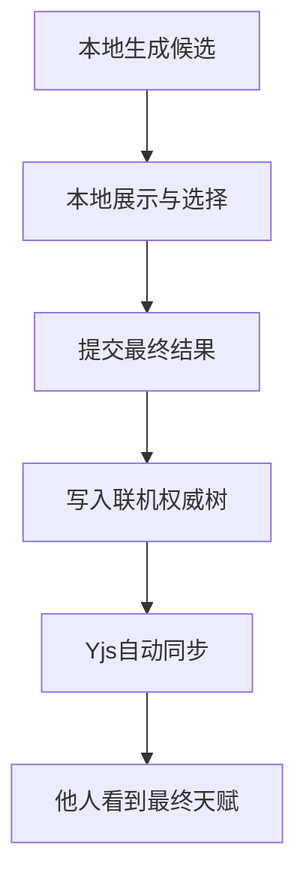
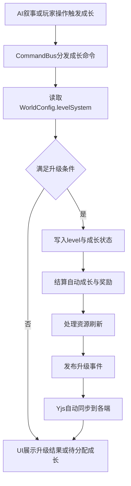

# Lyra Next 等级升级系统设计方案

**版本**：1.0  
**性质**：产品与架构联合设计文档  
**目标文件**：[`plans/level-up-system-design.md`](plans/level-up-system-design.md)

---

## 1. 背景与设计目标

Lyra Next 的等级系统不能只服务于某一种 RPG 规则，而必须服务于框架定位：**不同世界可以拥有完全不同的成长逻辑**。

结合现状，当前系统已经具备三项非常重要的基础：

1. [`level`](src/lib/world/types.ts:377) 已经是 [`WorldConfig`](src/lib/world/types.ts:291) 驱动的主属性，而不是硬编码字段
2. [`computeFullStats()`](src/lib/rules/stats-pipeline.ts:52) 已经能基于基础属性与公式统一重算衍生属性
3. 默认世界中的 [`max_hp`](src/lib/world/types.ts:421) 与 [`max_mp`](src/lib/world/types.ts:439) 已经直接引用 `level`

这意味着：**Lyra Next 并不是从零开始做等级系统，而是已经有了可被扩展的成长骨架**。缺失的不是 `level` 本身，而是围绕升级的触发机制、奖励机制、叙事协作机制与多人同步语义。

本方案的目标是补齐这四个层面，同时满足以下约束：

- 必须保持 [`WorldConfig`](src/lib/world/types.ts:291) 配置驱动
- 必须兼容现有 [`character.attributes`](src/domain/entities/character.ts:76) 存储模型
- 必须优先复用 [`computeFullStats()`](src/lib/rules/stats-pipeline.ts:52) 与 [`derivedStats`](src/lib/world/types.ts:296) 公式体系
- 必须遵循 CommandBus → Handler → Event 的业务改写路径，而不是把升级做成新的直写旁路
- 必须能渐进式实施，而不是一次性引入完整 MMORPG 复杂度

---

## 2. 现状约束与设计判断

### 2.1 当前系统最重要的现实约束

1. **等级仍应继续保存在属性层**  
   当前等级并不是根字段，而是 [`character.attributes`](src/domain/entities/character.ts:76) 中的 `level`。考虑到 [`computeFullStats()`](src/lib/rules/stats-pipeline.ts:57) 会先根据 [`primaryAttributes`](src/lib/world/types.ts:295) 建默认值，再由 `attributes` 覆盖，因此**不建议把 level 迁移到角色实体根层**。这样会破坏现有公式引用习惯，也会增加兼容成本。

2. **升级后已经可以天然驱动一部分成长**  
   默认世界中，`level` 变化会立刻影响 HP 与 MP 上限，因为 [`derivedStats`](src/lib/world/types.ts:418) 已经引用它。这说明 Lyra 可以先支持“仅升级等级，也会带来成长感”的世界，而不必一上来就做复杂加点 UI。

3. **创建期点数分配不能直接等价于运行时成长点数**  
   [`PointBuyRules`](src/lib/world/types.ts:191) 明确是角色创建规则，语义上表达的是起始建卡，而不是升级成长。运行时若直接复用这套配置，会把“开局构建”和“中途成长”耦合到一起，导致世界作者无法分别控制两者。

4. **现有系统存在两条属性写入路径**  
   一条是房间侧基于 [`UpdateCharacterPayload`](src/domain/commands/room.ts:471) 的 CommandBus 更新路径，另一条是 [`GameStateServiceContract.updateAttribute()`](src/core/services/tokens.ts:48) 这样的直接写入路径。升级系统作为高价值业务规则，**应以前者为主，后者仅保留为基础设施逃生口**。

5. **多人联机要求升级语义是原子且可同步的**  
   [`RoomSyncBridge`](src/modules/room/sync/RoomSyncBridge.ts:16) 已经明确：普通业务逻辑仍然要通过 CommandBus 修改状态，随后由同步桥接层把 Yjs 状态分发到各端。因此等级增长、奖励发放、点数扣减必须被视为**一个原子业务事务**。

### 2.2 设计结论

升级系统不应被设计成单一玩法，而应拆成四个可配置层：

- **触发层**：为什么现在可以升级，例如进度达到参考阈值、叙事里程碑、主持人手动判定
- **成长层**：升级后数值如何变化，例如自动成长、属性点分配、混合制
- **奖励层**：除了数值外还奖励什么，例如天赋、技能、物品、可选奖励
- **呈现层**：升级怎样进入 AI 叙事与 UI，不打断或按需打断流程

这四层共同构成一个世界可裁剪的等级系统。

---

## 3. 方案对比与推荐

## 3.1 方案 A：属性点分配制

### 定义

升级后发放可分配属性点，玩家手动把点数投入力量、敏捷、精神等属性。

### 优势

- 玩家参与感强，成长反馈明确
- 角色 build 多样性高
- 对传统 CRPG、数值构筑型世界非常友好
- 允许世界作者把成长的乐趣放在“选择”而不是“抽象等级”本身

### 劣势

- 会打断叙事节奏，尤其在 AI 连续输出剧情时
- 需要新增运行时分配 UI、校验逻辑、多人同步逻辑
- AI 很难自然判断“现在是否要暂停剧情等待你点属性”
- 若升级频率较高，会让每次成长都变成管理动作，而不是叙事事件

### 适配结论

适合偏系统构筑型世界，不适合作为 Lyra Next 的统一默认体验。

---

## 3.2 方案 B：自动属性提升制

### 定义

升级后系统根据世界规则自动提高基础属性或直接依赖 `level` 重算衍生值，不要求玩家立即参与分配。

### 优势

- 不打断叙事，最符合 AI RP 连续体验
- 与现有公式系统天然兼容
- UI 成本最低，多人同步逻辑也最简单
- 对“升级本身就是剧情结果”的世界非常自然

### 劣势

- 玩家定制空间较弱
- 若世界只做固定成长，长线构筑感会偏弱
- 如果所有升级都自动完成，玩家可能觉得自己只是被动观看成长

### 适配结论

适合作为 AI RP 世界的默认成长基线，但单独使用时会牺牲部分 build 深度。

---

## 3.3 方案 C：混合制与可配置制

### 定义

由世界配置决定升级的触发方式与成长方式。一个世界可以是：

- 纯自动成长
- 纯属性点分配
- 自动成长 + 少量可分配点数
- 自动成长 + 里程碑免费天赋抽取
- 进度值积累 + 叙事确认升级
- 纯叙事升级，不依赖进度值

### 优势

- 最符合 Lyra Next 作为框架的定位
- 能覆盖 AI RP、JRPG、CRPG、轻 MMO、爽游等不同世界
- 世界作者可以把“成长定制感”放在天赋、技能或少量属性点上，而不是每级都弹窗
- 可以把复杂功能作为可选项渐进启用，而不是强制所有世界承担复杂度

### 劣势

- 配置模型需要设计得足够清晰，否则容易失控
- 若同时开放太多组合，文档与编辑器支持必须跟上
- 实现上需要先定义一个稳定的最小子集，再逐步扩展

---

## 3.4 推荐结论

> **推荐采用方案 C：WorldConfig 驱动的可配置混合制。**

但这个推荐不是“所有世界都默认开混合制 UI”，而是：

### 框架层推荐默认值

- **默认触发方式**：叙事判定 / 手动触发
- **默认进度表现**：经验或进度值只作为展示与参考，不自动触发升级
- **默认成长方式**：自动属性提升制
- **默认可选定制**：关键等级提供免费线抽或少量成长点
- **默认资源刷新**：采用 `delta` 策略，避免升级即满血成为通用漏洞

### 为什么这是 Lyra 最优解

1. **Lyra 是 AI RP 框架，不是纯数值刷子框架**  
   默认体验应优先保证叙事连续，而不是每次升级都中断剧情。

2. **现有系统已经让 `level` 对衍生属性生效**  
   只要升级命令存在，很多世界即使没有复杂加点，也已经能获得成长感。

3. **定制感不必全靠属性点**
   现有角色已具备 [`talentIds`](src/domain/entities/character.ts:81)，世界配置也有运行时获得天赋开关 [`allowAcquireDuringGame`](src/lib/world/types.ts:308)。这意味着 Lyra 完全可以采用“自动成长做底座，关键等级给天赋抽取/技能/物品奖励”的混合模型，把定制感从频繁加点转移到更叙事友好的选择节点上。

4. **多人同步复杂度可控**  
   自动成长的原子事务最简单；把“玩家必须交互的选择”限制在少量里程碑节点，能显著降低并发与 UI 阻塞问题。

---

## 4. 推荐的配置模型设计

## 4.1 在 [`WorldConfig`](src/lib/world/types.ts:291) 中新增 `levelSystem`

建议新增一个独立配置块，而不是把升级逻辑散落在 `primaryAttributes`、`pointBuyRules` 或 `talentRules` 里。

### 配置草案概览

```ts
levelSystem?: {
  enabled?: boolean
  levelAttributeKey?: string
  triggerModes?: Array<"narrative" | "manual">

  progress?: {
    progressAttributeKey?: string
    thresholdMode?: "table" | "formula"
    thresholdTable?: Array<{ level: number; requiredProgress: number }>
    thresholdFormula?: string
    carryOverflow?: boolean
    visibility?: "hidden" | "summary" | "detailed"
  }

  growthMode?: "auto" | "allocation" | "hybrid"

  autoGrowth?: {
    perLevel?: Record<string, number | string>
    milestoneGrowth?: Array<{
      level: number
      attributes: Record<string, number | string>
    }>
  }

  allocation?: {
    pointAttributeKey?: string
    allocatableAttributes?: string[]
    pointsPerLevel?: number | string
    minPerAttribute?: number
    maxPerAttribute?: number
    allowDeferredAllocation?: boolean
  }

  rewards?: {
    autoApply?: boolean
    perLevel?: RewardPackage[]
    milestones?: Array<{ level: number; rewards: RewardPackage[] }>
  }

  resourceRecovery?: {
    mode?: "none" | "full" | "delta" | "ratio"
    resourceKeys?: string[]
  }

  narrative?: {
    allowAiTrigger?: boolean
    requirePlayerConfirmation?: boolean
    emitSystemLog?: boolean
    visibility?: "hidden" | "summary" | "ceremony"
    requireProgressReference?: boolean
  }
}
```

这里的重点不是字段命名细节，而是**把升级系统拆成触发、成长、奖励、资源、叙事五个子维度**。这样世界作者不需要在一个巨型枚举里赌运气，而是可以按需启用。

---

## 4.2 各配置块的设计意图

### 4.2.1 `levelAttributeKey`

默认值建议为 `level`，并继续对应 [`primaryAttributes`](src/lib/world/types.ts:295) 中的等级字段。

**建议保持 `level` 继续作为属性字段，而不是迁移为实体根字段。**

原因：

- 现有公式已经把 `level` 当作属性上下文的一部分使用
- [`computeFullStats()`](src/lib/rules/stats-pipeline.ts:57) 与 [`computeDerivedStats()`](src/lib/rules/derived-stats.ts:82) 已经围绕这种结构运作
- 迁移到根字段会迫使公式引擎、序列化和更新路径都适配双来源字段

### 4.2.2 `triggerModes`

推荐只保留两种正式触发来源：

- `narrative`：由 AI、GM 或剧情系统判定故事节点达成后升级
- `manual`：玩家或主持人手动执行升级命令

这里**不再把 `experience` 视为直接触发源**。原因是 Lyra Next 的主体是 AI RP，而不是传统刷怪数值游戏；如果经验值一到阈值就自动升级，很容易出现“原地刷刷刷就突破等级”的体验偏差。

建议允许世界配置启用多种来源，而不是只能二选一。例如：

- 叙事世界：`["narrative", "manual"]`
- 半规则世界：`["narrative"]`
- GM 主持世界：`["manual"]`

若世界仍然希望显示成长进度，则通过下方 `progress` 配置提供参考值，但**真正的等级变化仍然只由 `LEVEL_UP` 完成**。

### 4.2.3 `progress`

进度值模型建议只负责回答四件事：

1. 进度值存在哪里
2. 升级参考阈值如何定义
3. 阈值溢出是否保留
4. 进度在 UI 中如何展示

它的定位是：**展示成长过程，并为 `LEVEL_UP` 提供参考条件**，而不是自动触发升级。

#### 推荐策略

- P1 先支持 `thresholdTable`
- `thresholdFormula` 作为后续增强，而不是首版必做
- 默认保留溢出进度 `carryOverflow = true`
- 达到阈值后也不自动升级，而是由 AI、GM、玩家或剧情系统决定何时执行 `LEVEL_UP`

原因很简单：这样既能保留传统 RPG 中“成长条在推进”的反馈，又不会让数值积累凌驾于叙事判定之上。

### 4.2.4 `growthMode`

建议提供三个模式：

- `auto`：升级后按规则自动提升属性
- `allocation`：升级只发点数，由玩家分配
- `hybrid`：自动提升一部分，再额外给予玩家可分配成长点或选择奖励

其中：

- **框架默认推荐 `auto`**
- **构筑型世界推荐 `hybrid`**
- **只有强 build 世界才建议 `allocation` 作为主模式**

### 4.2.5 `autoGrowth`

这里描述升级自动带来的基础属性变化。

建议支持两类规则：

- **每级固定成长**：例如每级 `vit +1`
- **关键等级成长**：例如 10 级时额外 `str +2`

自动成长值建议允许使用数字或轻量公式字符串。这样世界作者可以写出：

- 每级固定 +1
- 每 5 级额外 +1
- 某些世界中随现有属性比例增长

### 4.2.6 `allocation`

该配置表示运行时成长点分配规则，建议与 [`PointBuyRules`](src/lib/world/types.ts:191) **分离定义**。

原因：

- 创建期点数分配描述的是初始 build
- 升级点数分配描述的是长期成长
- 两者的可分配属性、单次奖励点数、延后分配规则、是否允许留存，通常都不同

因此推荐：

- 可以在字段结构上借鉴 `allocatableAttributes`、`minPerAttribute`、`maxPerAttribute`
- 但不要直接复用同一个配置对象

### 4.2.7 `rewards`

升级奖励不应只等于数值增长，但它们也**不应被暴露为独立 AI 动作或独立领奖步骤**。更合理的做法是把奖励设计为组合包 `RewardPackage`，由 `LEVEL_UP` 在 handler 内部自动结算。

也就是说：

- 奖励是 `LEVEL_UP` 的自动结果
- 奖励不是 `grant_level_reward` 之类额外动作
- 若存在玩家可选项，也应表现为升级后的本地待处理状态，而不是新的 AI 动作

在天赋改造后，产品层建议至少预留以下奖励类型：

- `attribute_points`：给予可分配属性点
- `attribute_bonus`：直接增加指定属性
- `free_talent_draw`：授予一次或多次免费线抽，可附带 `poolId`、`offersPerDraw`、`guaranteedRarity`
- `grant_talent`：作为内部奖励效果直接授予指定天赋，适合固定里程碑、剧情奇遇、维度馈赠
- `skill_pick`：允许选择一个技能
- `grant_skill`：直接授予技能
- `grant_item`：发放物品

其中与现有系统关联最紧密的是天赋：

- 升级奖励中的天赋奖励应默认表达为 `free_talent_draw`，而不是继续让玩家从全库手选
- `grant_talent` 可以保留为奖励包中的内部效果，用于固定里程碑或剧情型奖励，但不应变成独立 AI 动作
- 若 [`allowAcquireDuringGame`](src/lib/world/types.ts:308) 为 `false`，运行时奖励配置中不应出现 `free_talent_draw` 与 `grant_talent`

技能与物品奖励则分别与 [`skillTemplates`](src/lib/world/types.ts:319) 和 [`itemTemplates`](src/lib/world/types.ts:317) 对齐，适合放到后续阶段实现。

### 4.2.8 `resourceRecovery`

升级时的资源刷新策略必须是显式配置，因为当前 [`computeFullStats()`](src/lib/rules/stats-pipeline.ts:121) 会优先保留角色当前资源值，不会因为等级提高就自动补满资源。

建议提供四种模式：

- `none`：不恢复，只做上限重算与截断
- `full`：直接补满到新的上限
- `delta`：当前值增加与上限增加量相同的数值
- `ratio`：按当前百分比映射到新的上限

### 默认推荐：`delta`

`delta` 最适合作为框架层默认值，原因：

- 它能体现升级带来的立即收益
- 不会像 `full` 那样在高频成长世界里形成通用回血漏洞
- 比 `ratio` 更直观，玩家容易理解

如果世界主题是“突破即回满状态”，则世界作者可以改成 `full`。

### 4.2.9 `narrative`

这是 Lyra Next 区别于普通 RPG 框架的关键配置。

建议它至少回答四件事：

- AI 是否允许主动触发升级
- 升级是否需要玩家确认
- 是否生成系统日志或剧情提示
- 升级在界面中以怎样的仪式感呈现

例如：

- `hidden`：只改数值，不弹升级卡
- `summary`：显示简短系统提示
- `ceremony`：播放升级卡、展示奖励、允许选择

---

## 4.3 与现有系统的关系

### 与 [`primaryAttributes`](src/lib/world/types.ts:295) 的关系

- `levelSystem.levelAttributeKey` 应指向一个已存在的主属性键，默认是 `level`
- `allocation.allocatableAttributes` 默认应从主属性里筛选，且排除 `level`
- 自动成长和奖励所修改的基础属性，本质上仍然是 `attributes` 中的基础字段

### 与 [`derivedStats`](src/lib/world/types.ts:296) 的关系

- 升级后无需单独写死 HP/MP 上限增长公式
- 只要基础属性或 `level` 变化，重新执行 [`computeFullStats()`](src/lib/rules/stats-pipeline.ts:52) 即可得到新衍生值
- `resourceRecovery` 只负责处理当前资源值，**不负责定义上限计算规则**

### 与 [`PointBuyRules`](src/lib/world/types.ts:191) 的关系

- `pointBuyRules` 继续专注于角色创建
- 运行时成长分配使用 `levelSystem.allocation`
- UI 可以复用创建期点数分配的交互思路，但规则对象不要混用

### 与天赋系统的关系

- 升级奖励中的天赋项应以“授予免费线抽次数”为主，而不是直接从全库挑选
- 若世界关闭运行时获取天赋，则升级奖励中不应配置运行时 `free_talent_draw` 或 `grant_talent`
- 高品质天赋应通过等级门槛或抽取池配置与里程碑奖励联动，而不是继续依赖前置属性与互斥规则控制出现时机

---

## 4.4 天赋系统改造与升级联动

### 4.4.1 改造目标

- 天赋继续以 [`Character.talentIds`](src/domain/entities/character.ts:81) 作为持有状态，以 [`applyTalentsToEntity()`](src/modules/game/services/entity-accessor.ts:148) 与现有 `modifiers` 作为生效路径
- 从 [`TalentConfig`](src/lib/world/types.ts:98) 中移除 `prerequisites` 与 `exclusiveWith`，避免把传统游戏性限制强行套进 AI RP 叙事
- 运行时不设置天赋槽位上限，创建期只限制初始抽取次数
- 升级奖励中的天赋奖励默认改为免费线抽；剧情中的天赋变化优先复用通用角色更新路径处理
- 天赋抽取候选只作为玩家本地交互状态存在；真正需要多人同步的是最终提交后的 `talentIds` 与相关属性变更

### 4.4.2 推荐的数据模型草案

```ts
interface TalentConfig {
  id: string
  name: string
  description: string
  category?: "combat" | "magic" | "survival" | "social" | "misc"
  icon?: string
  rarity?: string
  modifiers?: PassiveModifier[]
  draw?: {
    weight?: number
    poolIds?: string[]
    minLevel?: number
  }
}

talentRules?: {
  initialDrawCount?: number
  initialOffersPerDraw?: number
  allowAcquireDuringGame?: boolean
  freeDrawAttributeKey?: string
  drawPointAttributeKey?: string
  drawPointCost?: number
  duplicatePolicy?: "exclude_owned" | "allow_repeat"
  rarities?: Array<{
    id: string
    label: string
    weight: number
    colorToken?: string
    glowToken?: string
    minLevel?: number
  }>
  pools?: Array<{
    id: string
    label?: string
    allowedCategories?: string[]
    allowedRarities?: string[]
    includeTalentIds?: string[]
    excludeTalentIds?: string[]
    minLevel?: number
  }>
  pity?: Array<{
    afterMisses: number
    guaranteeRarity: string
  }>
}
```

设计判断：

- `rarity` 推荐作为字符串 ID，引用 `talentRules.rarities`，这样品质层级仍由 [`WorldConfig`](src/lib/world/types.ts:291) 配置驱动，而不是写死在框架枚举里
- `initialDrawCount` 用于表示创建期初始抽取次数
- `drawPointAttributeKey` 与 `freeDrawAttributeKey` 允许世界同时支持消耗点数抽取和免费线抽

### 4.4.3 天赋品质与稀有度设计

推荐框架默认提供 `common`、`uncommon`、`rare`、`epic`、`legendary` 作为示例，但不把它们硬编码为唯一合法值。

建议规则如下：

- **品质定义**：由 `talentRules.rarities` 配置标签、权重、颜色 token、光效 token、可选等级门槛
- **出现概率**：先按品质权重选层级，再在该层级内按 `TalentConfig.draw.weight` 抽取具体天赋
- **等级解锁**：`rarities.minLevel` 用于整档品质解锁，`TalentConfig.draw.minLevel` 用于单个天赋解锁
- **UI 表现**：以边框、标题徽记、背景辉光、掉落动画强度体现品质，但颜色来源应是 token 而不是硬编码
- **保底机制**：作为可选能力放入 `talentRules.pity`，适合长线构筑世界；不建议作为首版强制规则

### 4.4.4 天赋抽取机制

建议把天赋获取统一抽象为“消耗一次抽取机会，生成若干候选，玩家从候选中选择一个”。

#### 抽取来源

- **创建期基础抽取**：由 `talentRules.initialDrawCount` 提供
- **升级与里程碑奖励**：由 `levelSystem.rewards` 自动发放 `free_talent_draw`
- **剧情奖励**：可通过升级奖励包或通用角色更新改变天赋相关状态
- **世界货币化抽取**：可选使用 `drawPointAttributeKey` 指向角色属性中的抽取点数

#### 候选生成流程

1. 先确定抽取上下文：创建期、升级、里程碑、剧情、商店等
2. 构建抽取池：合并 `poolId`、等级门槛、维度排除、世界过滤条件
3. 默认排除已拥有天赋，推荐 `duplicatePolicy = exclude_owned`
4. 按品质权重与天赋权重抽出 `N` 个互不重复候选，推荐默认 `N = 3`
5. 若目标品质或池内数量不足，则按世界配置回退到低一档品质或更宽池
6. 玩家只在候选集内做选择，不再面对全量天赋列表

#### 与创建期的关系

[`SoloCharTalentsStep`](src/components/GameWizard/steps/SoloCharTalentsStep.tsx) 应从“全库手选”改为“抽取式选择”流程：

- `initialDrawCount` 表示初始抽取次数，而不是最终可持有天赋上限
- 维度赠送天赋仍然直接写入，不消耗抽取次数
- 维度排除天赋继续过滤抽取池
- 已移除的前置属性与互斥状态不再进入创建期 UI 状态机

### 4.4.5 运行时无槽位限制与动作面收敛

运行时 [`Character.talentIds`](src/domain/entities/character.ts:81) 应继续是唯一 ID 列表，但**没有长度上限**。这既符合剧情奇遇、传承、诅咒、觉醒等后天获得场景，也避免出现“槽位满了还要转译成叙事”的割裂体验。

在 AI 与规则层，建议只把“等级提升”视为独立领域动作，因此：

- 正式新增的独立成长动作仅保留 `LEVEL_UP`
- 升级产生的成长点、免费线抽、固定天赋等奖励，都由 `LEVEL_UP` handler 自动处理，不再拆成额外奖励动作
- 对于剧情中的直接天赋获得或失去，优先复用现有角色更新路径；若当前动作集不够用，优先小幅扩展 [`set`](src/modules/game/services/action-schemas.ts:405) 或通用角色 patch 语义，使其支持对 `talentIds` 追加 / 删除，而不是新增 `GRANT_TALENT`、`REMOVE_TALENT` 两个独立动作

天赋抽取候选的生成与展示不需要成为共享命令语义。创建期与运行时都可以在本地 UI 或本地状态中生成候选；玩家确认选择后，再通过标准角色更新路径一次性提交 `talentIds` 以及必要的抽取资源扣减。

### 4.4.6 联机下的天赋抽取同步原则

多人房间中，天赋抽取应视为“私有选择，公开结果”的交互：



设计重点：

- 候选生成与展示完全本地化，可使用 React state 或模块内本地 store
- 玩家确认后，复用 [`updateCharacterHandler()`](src/modules/room/commands/handlers.ts:25) → [`applyCharacterUpdates()`](src/modules/game/repository/entity-codec.ts:280) 这一类现有角色写入模式，把 `talentIds` 与相关属性写入 `MainDoc.characters`
- 其他玩家只看到“某角色获得了新天赋”的结果，不需要同步抽取界面、候选列表或升级动画
- 这与现有装备、背包、技能变更的联机模式一致，不需要额外发明新的同步机制

### 4.4.7 清理范围

- 在 [`TalentConfig`](src/lib/world/types.ts:98) 中新增 `rarity`，移除 `prerequisites` 与 `exclusiveWith`
- 重做 [`SoloCharTalentsStep`](src/components/GameWizard/steps/SoloCharTalentsStep.tsx) 的状态机，删除 `prereq_fail` 与 `exclusive` 相关分支
- 世界编辑器移除前置属性与互斥输入，新增品质、抽取池、等级解锁等结构化字段
- 保持 `modifiers` 生效链路不变，仍由 [`applyTalentsToEntity()`](src/modules/game/services/entity-accessor.ts:148) 与现有被动系统消费

---

## 5. 数据模型与运行时状态建议

## 5.1 核心原则：基础成长状态尽量继续留在 `character.attributes`

为了最大限度兼容现有系统，建议把以下状态继续放在 [`character.attributes`](src/domain/entities/character.ts:76) 中：

- `level`
- `level_progress` 或 `exp`
- `unspent_attribute_points`
- `free_talent_draws`
- `talent_draw_points`
- 其他世界自定义成长货币

这样做的好处是：

- 与现有属性更新路径兼容
- 可直接参与公式系统或条件判断
- 在多人同步中仍然是角色状态的一部分

与之对应，[`Character.talentIds`](src/domain/entities/character.ts:81) 继续作为角色实体根层的天赋持有列表，且**运行时不设置长度上限**。创建期的限制只体现在抽取规则上，而不体现在角色最终可持有天赋数量上。

## 5.2 复杂待选奖励的本地状态边界

对于升级带来的天赋抽取候选，当前设计明确将其视为玩家私有交互状态，可保存在 React state、本地 store 或向导上下文中，不进入共享 Yjs 文档。

需要进入共享状态的仍然只有最终提交后的角色数据，例如：

- `talentIds`
- `free_talent_draws`
- 其他成长货币或属性余额

只要这些最终结果通过 [`updateCharacterHandler()`](src/modules/room/commands/handlers.ts:25) 或同类房间命令处理器写入 `MainDoc.characters`，Yjs 就会自动把结果广播给其他客户端。

若未来出现“必须让主持人旁观候选”“必须跨端恢复未完成选择”这类新需求，再评估专门的共享草稿结构；本方案当前不引入该机制。

---

## 6. AI 叙事系统协作设计

## 6.1 AI 不应直接把升级降级为普通 `set level`

当前系统中，AI 动作 schema 已经展示了可通过 `set` 把等级直接改为 2 的例子，见 [`action-schemas.ts`](src/modules/game/services/action-schemas.ts:443)。

这条路径适合作为：

- 调试或 GM 强制修正
- 极简世界中的底层管理入口
- 测试与工具链验证

但它**不应成为标准升级 API**，因为它会绕过：

- 升级奖励自动结算
- 资源刷新策略
- 多级连升处理
- 待分配点数生成
- 升级事件与 UI 提示

### 推荐做法

AI 层应尽量只学习**一个新的独立成长动作**：`level_up`。

设计原则如下：

- 若世界需要展示成长进度，进度值仍可通过现有通用属性更新语义维护
- 但进度值只用于展示与参考，不自动触发升级
- 真正的等级变化、自动成长、奖励结算、资源刷新与相关天赋变化，都由 `level_up` 一次性完成
- 对于非升级场景下的天赋增删，默认继续复用现有角色更新能力；若动作集不足，优先轻量扩展 [`set`](src/modules/game/services/action-schemas.ts:405) 或通用 patch，而不是增加新的独立天赋动作

---

## 6.2 让升级融入叙事而不突兀

推荐把升级流程分成两层：

### 第一层：叙事判定层

AI 可以在这些时机表达成长意图：

- 完成主线节点
- 赢得关键战斗
- 达成世界观中的突破条件
- 经历一段训练、领悟、献祭、晋升、觉醒

这一层的产物不是“直接改属性”，而是“现在可以执行一次 `level_up`”。

### 第二层：规则结算层

系统读取 `levelSystem` 后决定：

- 当前进度是否达到参考阈值
- 是否真的提升等级
- 是自动提升属性
- 还是生成待分配点数
- 是否自动发放免费线抽、固定天赋、技能或物品奖励
- 是否刷新资源

这样的好处是：**AI 只负责叙事上的为什么与何时升级，系统负责规则上的如何。**

---

## 6.3 玩家需要手动参与时，必须是非阻塞设计

若世界开启属性点分配或奖励选择，不建议强制打断当前剧情回合。

推荐做法：

- 升级先完成等级变更与可立即生效的自动奖励
- 把可分配点数或可选奖励记录为未结算状态
- UI 在侧栏、角色面板或升级卡中显示“待分配成长”
- 玩家可以立即处理，也可以稍后处理

这对 AI RP 尤其重要，因为它允许叙事继续推进，而不会因为“你还没点属性，所以故事不能往下走”。

### 叙事上的解释方式

世界作者甚至可以把这种延后结算包装成：

- 尚未炼化的修为
- 尚未分配的成长潜能
- 尚未选择的专精路线
- 尚未领取的晋升恩赐

这比传统系统里“升级了立刻弹窗点六个属性”更自然。

---

## 7. 业务命令、事件与数据流设计

## 7.1 建议新增的业务命令

从架构角度，建议只把真正独立的成长领域收敛为少量正式命令，避免为了降低 AI 学习负担而把每个奖励步骤都拆成新动作。

建议最小命令集如下：

- `LEVEL_UP`
- `ALLOCATE_LEVEL_POINTS`，仅在 `allocation` 或 `hybrid` 世界开启时需要

其余能力的处理原则：

- 进度值变更继续复用现有角色属性更新路径
- 升级奖励不设计独立 `CLAIM_LEVEL_REWARD`
- 天赋抽取候选生成不设计独立共享命令
- 非升级场景的天赋增删优先复用现有角色更新路径，必要时仅轻量扩展通用 `set` / patch 语义

### 最小可实施子集

P0 先引入：

- `LEVEL_UP`

P1 再增加：

- `ALLOCATE_LEVEL_POINTS`，当世界确实启用运行时属性点时

这样可以把新增动作面压到最小，同时保持升级作为独立领域能力的清晰边界。

## 7.2 建议新增的业务事件

建议至少预留这些事件：

- `LEVEL_UP`
- `LEVEL_POINTS_ALLOCATED`

其中：

- 升级带来的自动奖励、天赋变化、资源刷新应包含在 `LEVEL_UP` 事件摘要中
- 不再为每一种奖励单独拆 `LEVEL_REWARD_GRANTED`、`TALENT_GRANTED`、`TALENT_REMOVED` 等事件，除非后续确有观测需求
- 其他普通字段变化仍可继续复用 [`CharacterUpdatedEvent`](src/domain/events/room.ts:473) 风格

这些事件的设计风格应与现有 [`CharacterUpdatedEvent`](src/domain/events/room.ts:473) 保持一致：

- 带房间上下文
- 带角色 ID
- 带操作者身份
- 带本次变化摘要
- 带时间戳

## 7.3 推荐的数据流



## 7.4 与现有更新路径的关系

为保证渐进式实施，升级命令的 handler 在早期可以**内部复用**现有角色更新能力，但外部语义上应是独立命令。

也就是说：

- 对外：世界、AI、UI 都调用 `LEVEL_UP`
- 对内：handler 可以在一次事务里写入 `attributes.level`、点数余额、奖励结果、资源值等字段

这比继续暴露“请自行拼接一份 `UpdateCharacterParams`”更安全。

---

## 8. 多人联机与 Yjs CRDT 设计原则

## 8.1 统一同步原则：写入 `MainDoc.characters` 即自动同步

当前多人同步的关键结论不是“升级系统需要新同步层”，而是：**所有角色数据变更，只要最终写入联机权威树 `MainDoc.characters`，Yjs 就已经会自动同步到其他客户端。**

现有 [`updateCharacterHandler()`](src/modules/room/commands/handlers.ts:25) 会读取房间角色节点，并通过 [`applyCharacterUpdates()`](src/modules/game/repository/entity-codec.ts:280) 增量写入角色字段；[`RoomSyncBridge`](src/modules/room/sync/RoomSyncBridge.ts:717) 再把这份权威状态映射回本地镜像。这已经构成了 `UPDATE_CHARACTER` 的标准联机模式。

因此新增的 `LEVEL_UP` 命令，以及后续可能存在的成长相关通用更新提交，应当沿用同一原则：

- 在 handler 中基于最新房间状态校验
- 直接写入 `MainDoc.characters`
- 让 Yjs 自动把最终状态同步到其他客户端
- 不再额外设计独立的升级同步通道、抽取同步通道或 UI 广播机制

## 8.2 天赋抽取与升级表现对他人应保持静默

联机模式下，升级和天赋抽取对其他玩家的可见性应保持简洁：

- 抽取候选生成与展示只存在于本地
- 其他玩家不需要看到抽取候选界面
- 其他玩家不需要看到升级动画或中间步骤
- 其他玩家只需要在最终状态同步后看到角色 `talentIds`、属性或状态发生变化

也就是说，联机语义应是“同步结果，不同步私有过程”。这与装备、背包、技能链路已经成立的同步模式一致。

## 8.3 P0-前置架构缺口：统一联机属性写入路径

当前 [`createGameStateService()`](src/modules/game/services/game-state-service.ts:84) 通过 [`getActiveGameStateRepository()`](src/modules/game/services/game-state-service.ts:28) 获取仓库时，会从 [`yjsManager.getCurrentSave()`](src/core/yjs/manager.ts:405) 读取角色树。这条路径拿到的是本地 `SaveSlot` 镜像，不是 [`updateCharacterHandler()`](src/modules/room/commands/handlers.ts:25) 所写入的联机权威树 `MainDoc.characters`，因此 [`gameStateService.updateAttribute()`](src/modules/game/services/game-state-service.ts:96) 在联机模式下不会自动进入标准同步链路。

升级系统必须先补齐这个架构缺口，因为升级、消耗品效果与规则引擎 `set` 动作都会触发属性变更；只要这些写入仍停留在本地镜像，联机状态就会出现静默分叉。

推荐修复方案：

- 让 [`createGameStateService()`](src/modules/game/services/game-state-service.ts:84) / [`createGameStateRepository()`](src/modules/game/repository/game-state-repository.ts:106) 在联机模式下自动切换到 `MainDoc.characters` 作为写入目标
- 或统一通过 [`updateCharacterHandler()`](src/modules/room/commands/handlers.ts:25) 这一类房间命令处理器落库，保持与现有角色更新路径一致
- 确保所有角色数据变更都走联机权威树，包括属性、`talentIds`、状态标签，以及消耗品效果和规则引擎 `set` 动作触发的改写
- 本地 `SaveSlot` 镜像只负责消费同步结果，不再承担联机权威写入口

## 8.4 并发与权限原则

对于多人房间中的成长操作，建议遵循以下权限原则：

- 角色拥有者可以为自己角色执行本地选择后的确认命令
- Host 或 GM 可以执行叙事裁定型升级命令，以及剧情驱动的通用角色更新
- 所有命令在 handler 中基于最新状态重新校验，而不是相信客户端本地缓存
- 当多个客户端同时尝试修改同一角色成长状态时，以联机权威树上的最新状态作为唯一判定依据

这样可以把多人同步问题收敛为“谁能写权威树、写入什么最终结果”，而不是扩展成新的共享 UI 状态系统。

---

## 9. 推荐的世界模板策略

为了让世界作者快速理解该系统，建议在文档中明确给出几类推荐模板：

| 世界类型     | 触发方式           | 成长方式             | 推荐奖励                        | 资源刷新      |
| ------------ | ------------------ | -------------------- | ------------------------------- | ------------- |
| 纯叙事 AI RP | narrative + manual | auto                 | 关键等级免费线抽或固定属性提升  | delta 或 full |
| 日式成长 RPG | narrative + manual | auto 或 hybrid       | 固定成长 + 里程碑技能或稀有抽取 | delta         |
| 构筑型 CRPG  | narrative + manual | hybrid 或 allocation | 属性点 + 定向天赋抽取           | none 或 delta |
| 爽游刷宝世界 | manual             | auto                 | 物品、技能与高频低稀有天赋抽取  | full          |
| 修仙突破世界 | narrative + manual | hybrid               | 境界提升 + 高阶天赋池抽取       | full          |

> 注：这些模板仍然可以显示 `level_progress` 或 `exp` 作为成长条，但进度值只作为升级参考，不直接触发升级。

这里最重要的产品判断是：**Lyra 默认模板应优先站在第一列，而不是第三列。**

即，默认先服务 AI RP 世界，再向重数值 build 世界扩展，而不是反过来。

---

## 10. 分阶段实施路线

## P0-前置：联机属性写入路径统一

### 目标

修复 [`createGameStateService()`](src/modules/game/services/game-state-service.ts:84) 在联机模式下的写入目标，确保所有角色数据变更都进入联机权威树。

### 范围

- 修复 [`createGameStateService()`](src/modules/game/services/game-state-service.ts:84) 在联机模式下的仓库选择逻辑
- 让 [`getActiveGameStateRepository()`](src/modules/game/services/game-state-service.ts:28) 自动切到 `MainDoc.characters`，或统一改走 [`updateCharacterHandler()`](src/modules/room/commands/handlers.ts:25) 路径
- 确保属性、`talentIds`、状态标签等角色数据变更在联机模式下自动同步
- 覆盖消耗品效果、规则引擎 `set` 动作等基础设施写路径，避免继续写入本地 `SaveSlot` 镜像

### 价值

- 补齐升级系统的前置条件
- 消除联机模式下角色状态写入分叉
- 为后续所有成长相关能力提供统一的联机权威落点

---

## P0：等级系统核心 + 天赋系统基础改造

### 目标

在联机权威写路径统一后，建立最小可用的正式升级闭环，并完成天赋系统基础模型的收敛。

### 范围

- 在 [`WorldConfig`](src/lib/world/types.ts:291) 中新增 `levelSystem` 配置模型
- 新增 `LEVEL_UP` 命令与事件，完成等级提升、自动成长、奖励自动结算与资源刷新
- 在 [`TalentConfig`](src/lib/world/types.ts:98) 中新增 `rarity`
- 移除 `exclusiveWith` 和 `prerequisites` 字段
- 必要时小幅扩展现有通用角色更新语义，使其能安全改写 `talentIds`

### 价值

- 建立升级系统的正式业务语义，而不是继续把升级视作普通属性改写
- 为 AI、剧情与运行时奖励提供稳定的成长入口
- 在不扩大 AI 动作面的前提下完成天赋系统基础收口

---

## P1：进度表现、运行时属性点与天赋模型扩展

### 目标

在保持叙事主导的前提下，为成长系统补齐长期进度反馈与可选构筑能力，并完成抽取式天赋流程所需的运行时能力。

### 范围

- 支持 `progress` 配置块
- 支持进度表阈值、溢出进度保留、多级连升参考
- 让进度达到阈值后可作为 `LEVEL_UP` 的参考条件，而不是自动升级
- 引入 `allocation` 配置
- 新增运行时属性点余额与分配命令
- 在 [`TalentConfig`](src/lib/world/types.ts:98) 中补齐 `draw` 元数据
- 将 [`SoloCharTalentsStep`](src/components/GameWizard/steps/SoloCharTalentsStep.tsx) 从全库手选改为抽取式流程
- 新增非阻塞的成长待处理 UI

### 价值

- 覆盖传统 RPG 与部分构筑型世界的进度反馈需求
- 完成天赋系统从手选制到抽取制的基础切换
- 仍保持与叙事世界兼容

---

## P2：天赋抽取奖励与高级成长内容

### 目标

把升级从“数值变化”扩展为“世界内容发放入口”，并让天赋奖励正式与升级里程碑联动。

### 范围

- 支持 `free_talent_draw` 奖励类型
- 支持本地候选生成与最终结果确认
- 多人房间中仅同步最终提交后的 `talentIds` 与相关属性变更
- 支持品质权重、抽取池、等级解锁与可选保底
- 支持技能选择奖励
- 支持物品奖励
- 升级卡可展示免费抽取、候选分支与叙事说明

### 价值

- 大幅提升世界差异化能力
- 将构筑深度从属性点扩展到品质驱动的天赋池
- 让升级奖励与剧情奇遇共享同一套天赋获取语义

---

## P3：编辑器与模板生态完善

### 目标

降低世界作者配置成长系统与天赋抽取规则的心智负担。

### 范围

- 为 `levelSystem` 提供可视化编辑 UI
- 为 `talentRules.rarities`、`talentRules.pools` 提供结构化编辑
- 提供预设模板
- 提供配置校验与预览
- 提供升级与天赋抽取模拟器，允许作者验证成长曲线与候选池

### 价值

- 让该系统真正具备框架级可用性
- 防止“功能强但无人会配”

---

## 11. 风险边界

## 11.1 首版不宜解决的问题

以下内容建议明确列为后续增强，而不是首版强行覆盖：

- 复杂技能树
- 完整职业晋阶系统
- 重置加点与洗点
- 奖励选择的复杂分支 UI
- 极复杂的多人并发抢领奖励场景

首版的核心是：**让升级成为正式业务能力，而不是继续把它伪装成一次普通属性修改。**

---

## 12. 最终推荐摘要

## 12.1 推荐方案

采用**方案 C：WorldConfig 驱动的可配置混合制**，但把默认世界体验设置为：

- **触发**：叙事判定 / 手动触发优先
- **进度**：经验或进度值只作为展示与升级参考
- **成长**：自动属性成长优先
- **定制**：关键等级给予免费线抽、少量点数或固定奖励
- **资源刷新**：默认 `delta`
- **天赋持有**：运行时无槽位上限

## 12.2 推荐的核心设计决策

1. 在 [`WorldConfig`](src/lib/world/types.ts:291) 中新增 `levelSystem`
2. 保持 `level` 继续存储在 [`character.attributes`](src/domain/entities/character.ts:76)
3. 以 [`computeFullStats()`](src/lib/rules/stats-pipeline.ts:52) 和现有公式系统为成长结算核心
4. 不直接复用 [`PointBuyRules`](src/lib/world/types.ts:191)，而是为运行时成长定义独立 `allocation` 配置
5. 创建期使用 `initialDrawCount` 表示初始抽取次数
6. 在 [`TalentConfig`](src/lib/world/types.ts:98) 中新增 `rarity` 与 `draw` 元数据，并移除 `prerequisites` 与 `exclusiveWith`
7. 升级奖励中的天赋奖励默认使用 `free_talent_draw`，里程碑可配置不同池与品质门槛
8. 保持 [`Character.talentIds`](src/domain/entities/character.ts:81) 为无槽位上限的运行时持有模型
9. 为 AI、剧情与 UI 只新增一个独立成长动作 `LEVEL_UP`；升级奖励与相关天赋变化由该动作自动结算
10. 非升级场景下的天赋增删优先复用现有角色更新路径，必要时仅轻量扩展通用 `set` 或角色 patch 语义
11. 先修复 [`createGameStateService()`](src/modules/game/services/game-state-service.ts:84) / [`getActiveGameStateRepository()`](src/modules/game/services/game-state-service.ts:28) 在联机模式下的写入目标，使基础设施写路径指向 `MainDoc.characters` 或统一走房间命令处理器
12. 多人房间复用现有角色更新模式，只同步最终写入 `MainDoc.characters` 的成长结果，不同步私有抽取候选
13. 把 AI 的职责限定为“提出是否升级与何时升级”，把系统职责限定为“根据世界规则自动结算成长结果”
14. 通过分阶段实施，先统一联机属性写入路径，再落地等级系统核心，随后扩展到进度表现、加点与天赋抽取奖励

## 12.3 一句话结论

**Lyra Next 的等级系统不应被设计成单一 RPG 机制，而应被设计成一个由世界配置驱动的成长编排层：默认不打断 AI 叙事，以 `LEVEL_UP` 作为唯一正式升级动作，以进度值作为展示与参考，以自动成长 + 品质驱动的天赋抽取作为主要构筑节点，并复用 `MainDoc.characters` 的既有 Yjs 自动同步能力，只同步最终成长结果而不广播私有抽取过程。**
