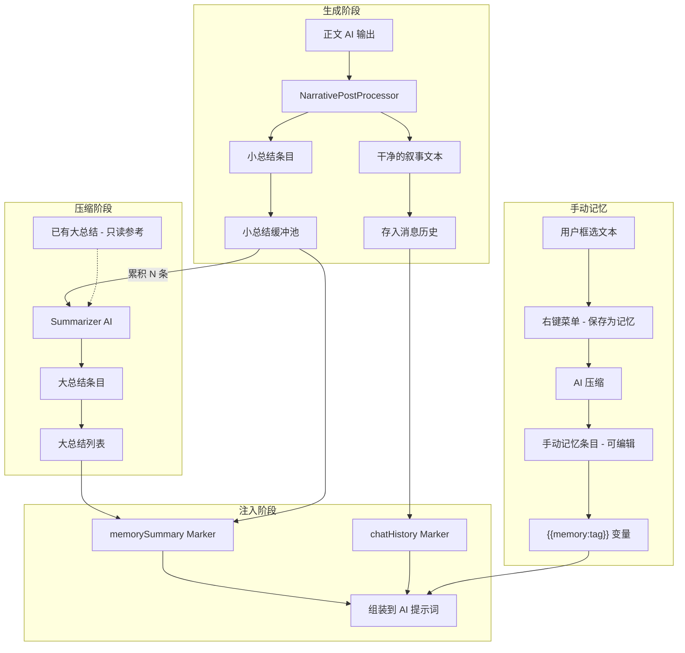
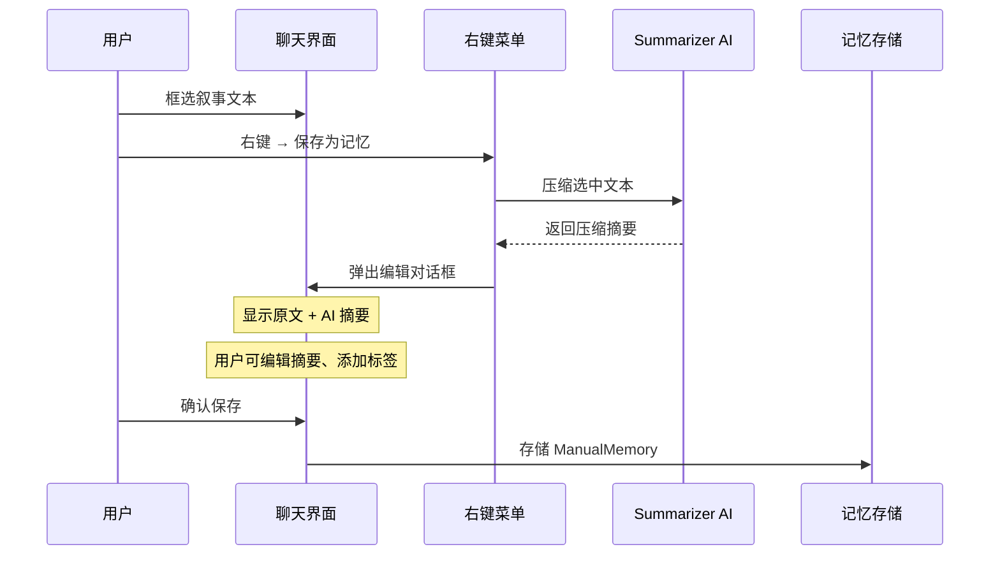

# 分段记忆系统详细设计

> **文档状态**：已实施（含 v2 架构重构记录）
> **前置条件**：不依赖 Director AI，可独立实现和使用。
> **设计日期**：2026-02-15
> **更新日期**：2026-02-16

---

## 1. 设计决策摘要

| 决策项                | 方案                                                                    |
| --------------------- | ----------------------------------------------------------------------- |
| 小总结标记格式        | XML 标签 `<memory_summary>` （与现有 `<choices>` 一致）                 |
| 小总结提取            | 独立的 `NarrativePostProcessor` 管道（不扩展 `parseGameContent`）       |
| 记忆注入方式          | 新增独立的 `memorySummary` Marker                                       |
| chatHistory 协调      | 显式联动（memorySummary 读取 chatHistory 配置）                         |
| 手动记忆注入          | 函数式变量 `{{memory:标签}}` / `{{memory:all}}`，用户可嵌入任意提示词块 |
| 手动记忆入口          | 聊天界面右键菜单（框选文本 → 保存为记忆）                               |
| 手动记忆存储          | AI 压缩 + 用户可编辑                                                    |
| 计数单位              | 按消息条数（每条 assistant 回复对应一个小总结）                         |
| 注入策略              | 联动模式为主 + 自定义范围可选                                           |
| Summarizer AI 配置    | 独立的 AI Profile + 专用预设（不复用 narrative 预设）                   |
| 右键菜单              | 通用可扩展框架（首期入口：保存为记忆）                                  |
| 旧预设兼容            | 不需要处理（项目未上线，无数据迁移需求）                                |
| 远期 Director AI 注入 | 也通过预设系统管理提示词，与 memorySummary Marker 配合                  |

---

## 2. 系统总览

### 2.1 数据流全貌



### 2.2 与现有管道的关系

```
现有管道：
  用户输入 → [Parser AI] → [规则引擎] → [正文 AI] → 叙事输出 → 展示给玩家

扩展后：
  用户输入 → [Parser AI] → [规则引擎] → [正文 AI] → NarrativePostProcessor
                                                         ├→ 叙事文本 → 展示给玩家
                                                         └→ 小总结 → 缓冲池 → [累积] → [Summarizer AI] → 大总结
```

插入点：
- IRNR 路径：在 `irnr-pipeline.ts` Phase 4 叙事完成后、`commitManager.commit()` 之前
- 直连路径：在 `StreamSession.complete()` 调用之前
- 联机路径：在 `ai-handlers.ts` 的 AI 响应完成后

---

## 3. 数据模型

### 3.1 小总结

```typescript
/**
 * 回合小总结条目
 *
 * 每条 assistant 消息对应最多一个小总结。
 * 由 NarrativePostProcessor 从正文 AI 输出中提取。
 */
interface MiniSummary {
  /** 唯一 ID */
  id: string;
  /** 关联的消息 ID（assistant message） */
  messageId: string;
  /** 消息在对话中的序号（用于排序和范围计算） */
  messageIndex: number;
  /** 创建时间戳 */
  createdAt: number;
  /** AI 输出的原始小总结文本 */
  content: string;
  /** 是否已被压缩为大总结 */
  compressed: boolean;
  /** 所属的大总结 ID（压缩后填入） */
  megaSummaryId?: string;
}
```

### 3.2 大总结

```typescript
/**
 * 大总结条目
 *
 * 由 Summarizer AI 将 N 条小总结压缩生成。
 * 大总结一旦生成不会再被二次压缩（避免信息反复丢失）。
 */
interface MegaSummary {
  /** 唯一 ID */
  id: string;
  /** 创建时间戳 */
  createdAt: number;
  /** 压缩后的摘要文本 */
  content: string;
  /** 源小总结 ID 列表 */
  sourceMiniSummaryIds: string[];
  /** 覆盖的消息索引范围 */
  messageRange: {
    /** 最早的消息索引 */
    from: number;
    /** 最晚的消息索引 */
    to: number;
  };
}
```

### 3.3 手动记忆

```typescript
/**
 * 手动记忆条目
 *
 * 用户从聊天内容中选择并保存的重要信息。
 * AI 压缩后用户可自由编辑。
 */
interface ManualMemory {
  /** 唯一 ID */
  id: string;
  /** 用户选择的原始文本 */
  sourceContent: string;
  /** AI 压缩 / 用户编辑后的摘要 */
  summary: string;
  /** 用户标签（用于 {{memory:标签}} 变量查询） */
  tags: string[];
  /** 创建时间戳 */
  createdAt: number;
  /** 最后编辑时间戳 */
  updatedAt: number;
  /** 来源消息 ID（可选，关联到原始消息） */
  sourceMessageId?: string;
}
```

### 3.4 记忆系统配置

```typescript
/**
 * 记忆系统配置
 *
 * 存储在 memorySummary Marker 的 markerConfig 中。
 */
interface MemoryMarkerConfig {
  /** 注入策略模式 */
  strategy: 'linked' | 'custom';

  /**
   * 联动模式配置（strategy === 'linked'）
   *
   * 小总结覆盖范围 = chatHistory.maxMessages + 1 ~ chatHistory.maxMessages + miniSummaryCount
   * 大总结覆盖范围 = 小总结之后的所有
   */
  linked: {
    /** 小总结发送数量（在 chatHistory 覆盖范围之后紧接着的 N 条） */
    miniSummaryCount: number;
  };

  /**
   * 自定义模式配置（strategy === 'custom'）
   */
  custom: {
    /** 小总结发送数量 */
    miniSummaryCount: number;
    /** 大总结发送策略 */
    megaSummaryMode: 'all' | 'recent';
    /** 大总结最多发送数量（megaSummaryMode === 'recent' 时生效） */
    megaSummaryLimit: number;
  };

  /** 压缩触发阈值：每累积多少条未压缩的小总结触发一次压缩 */
  compressionThreshold: number;
}
```

默认配置：

```typescript
const DEFAULT_MEMORY_CONFIG: MemoryMarkerConfig = {
  strategy: 'linked',
  linked: {
    miniSummaryCount: 10,
  },
  custom: {
    miniSummaryCount: 10,
    megaSummaryMode: 'all',
    megaSummaryLimit: 5,
  },
  compressionThreshold: 8,
};
```

---

## 4. NarrativePostProcessor — 正文后处理器

### 4.1 设计理念

独立于 `parseGameContent`（UI 展示层解析），在**消息持久化之前**处理 AI 输出。
采用管道模式，后续 Director AI 等结构化输出也可注册处理器。

### 4.2 接口定义

```typescript
/**
 * 正文后处理器
 *
 * 从正文 AI 的原始输出中提取结构化内容，
 * 返回清理后的叙事文本和提取的数据。
 */
interface PostProcessResult {
  /** 清理后的叙事文本（移除所有结构化标记，展示给玩家） */
  narrative: string;
  /** 提取的小总结（如果 AI 未输出则为 undefined） */
  miniSummary?: string;
  /** 未来扩展：Director AI 输出等 */
  metadata?: Record<string, unknown>;
}

/**
 * 后处理管道
 */
function processNarrativeOutput(rawOutput: string): PostProcessResult {
  let narrative = rawOutput;
  let miniSummary: string | undefined;

  // 1. 提取小总结
  const summaryMatch = MEMORY_SUMMARY_REGEX.exec(narrative);
  if (summaryMatch) {
    miniSummary = summaryMatch[1].trim();
    narrative = narrative.replace(summaryMatch[0], '').trim();
  }

  // 2. 保留 choices 标签（由 parseGameContent 在 UI 层处理）
  // 不在此处处理，保持职责分离

  return { narrative, miniSummary };
}
```

### 4.3 小总结标记格式

```xml
<memory_summary>
地点：冒险者公会
事件：玩家接取讨伐哥布林的委托，与受付嬢リナ交谈
NPC：リナ（友好，提供了委托信息）
状态变化：获得委托书
备注：リナ看了一眼手中的挂坠
</memory_summary>
```

正则提取：

```typescript
const MEMORY_SUMMARY_REGEX = /<memory_summary>([\s\S]*?)<\/memory_summary>/;
```

### 4.4 容错与提醒设计

- AI 未输出 `<memory_summary>` 标签：`miniSummary` 为 `undefined`，**显式通知用户**
- AI 输出了多个标签：只取第一个（后续可扩展为合并）
- 标签格式不完整（如缺少闭合标签）：正则不匹配，等同于未输出
- 小总结缺失**不阻断**消息展示和存储，但需要让用户知晓

#### 提醒策略

当小总结提取失败时，通过 Toast 通知用户：

```typescript
function handleMiniSummaryResult(
  postProcessed: PostProcessResult,
  messageId: string,
): void {
  if (postProcessed.miniSummary) {
    // 正常：写入缓冲池
    memoryStore.addMiniSummary({ ... });
  } else {
    // 提取失败：显式通知
    toast.warning(
      '本轮未能提取回合摘要',
      '正文 AI 未输出 <memory_summary> 标签。这不影响游戏继续，但本轮内容不会被记忆系统记录。',
      { duration: 5000 }
    );
    console.warn(
      `[Memory] 消息 ${messageId} 未包含 <memory_summary> 标签，跳过小总结提取`
    );
  }
}
```

**提醒频率控制**：
- 避免每回合都弹 toast 导致骚扰
- 可选方案：连续 N 次失败才提醒，或只在首次失败时提醒并附带"不再提醒"选项
- 实现时具体策略可根据用户反馈调整

### 4.5 插入点

#### IRNR 路径（单机 + 联机）

位于 `irnr-pipeline.ts` 的 Phase 4 叙事完成后：

```typescript
// irnr-pipeline.ts executePipeline() 中

// Phase 4: Narrative AI 完成后
// ...原有的 narrativeResult 处理...

// 🆕 Phase 4.5: 后处理 — 提取小总结
const postProcessed = processNarrativeOutput(narrativeText);
narrativeText = postProcessed.narrative; // 覆盖为清理后的文本

if (postProcessed.miniSummary) {
  // 将小总结写入记忆系统（通过事件或直接调用）
  memorySystem.addMiniSummary({
    messageId: currentMessageId,
    messageIndex: currentMessageIndex,
    content: postProcessed.miniSummary,
  });
}

// Phase 5: Commit（不变）
```

#### 直连路径（单机无 IRNR）

位于 `chat/commands/handlers.ts` 的 `onComplete` 回调中：

```typescript
// handlers.ts sendMessageHandler 中
onComplete: (finalContent) => {
  // 🆕 后处理
  const postProcessed = processNarrativeOutput(finalContent);

  if (postProcessed.miniSummary) {
    memorySystem.addMiniSummary({
      messageId: assistantMessage.id,
      messageIndex: repository.getMessages(conversationId).length,
      content: postProcessed.miniSummary,
    });
  }

  session!.complete(postProcessed.narrative);
},
```

#### 联机路径

位于 `room/commands/ai-handlers.ts` 的 AI 响应完成后：

```typescript
// ai-handlers.ts 中
if (irnrResult.success) {
  // 🆕 后处理（IRNR 路径在 pipeline 内部已处理）
  // 直连路径需要在此处处理
  // ...
}
```

---

## 5. memorySummary Marker

### 5.1 注册

在 `marker-registry.ts` 的 `MARKER_REGISTRY` 数组中添加：

```typescript
{
  id: "memorySummary",
  displayName: "分段记忆",
  description: "注入大总结和小总结（分段记忆系统）",
  render: renderMemorySummary,
  defaultRole: "system" as const,
  hasConfig: true,
},
```

同步更新 `MARKER_IDS`：

```typescript
export const MARKER_IDS = [
  "chatHistory",
  "userPersona",
  "npcInfo",
  "gameState",
  "resultFrame",
  "operationDefs",
  "worldInfo",
  "scenario",
  "turnInfo",
  "memorySummary",  // 🆕
] as const;
```

### 5.2 渲染逻辑

```typescript
function renderMemorySummary(context: VariableContext): string {
  const memoryData = context.memoryData;
  if (!memoryData) return "";

  const { megaSummaries, miniSummaries } = memoryData;
  const sections: string[] = [];

  // 1. 渲染大总结
  if (megaSummaries.length > 0) {
    sections.push("【剧情回顾】");
    for (const mega of megaSummaries) {
      sections.push(mega.content);
    }
  }

  // 2. 渲染未压缩的小总结
  if (miniSummaries.length > 0) {
    sections.push("【近期事件摘要】");
    for (const mini of miniSummaries) {
      sections.push(mini.content);
    }
  }

  return sections.join("\n\n");
}
```

### 5.3 VariableContext 扩展

在 `types.ts` 的 `VariableContext` 中添加：

```typescript
interface VariableContext {
  // ...现有字段...

  /** 分段记忆数据（由 memorySummary marker 渲染） */
  memoryData?: {
    /** 应注入的大总结列表（按时间排序） */
    megaSummaries: Array<{ id: string; content: string }>;
    /** 应注入的小总结列表（未被 chatHistory 覆盖的部分） */
    miniSummaries: Array<{ id: string; content: string }>;
  };
}
```

### 5.4 与 chatHistory 的联动计算

记忆数据注入时的范围计算逻辑（在构建 `VariableContext` 时执行）：

```typescript
/**
 * 计算应注入的记忆数据
 *
 * 联动模式下：
 * - chatHistory 覆盖最近 N 条消息（完整对话）
 * - 小总结覆盖第 N+1 ~ N+M 条（M = miniSummaryCount）
 * - 大总结覆盖 N+M+1 之后的所有
 *
 * @param allMiniSummaries 所有小总结（按 messageIndex 排序）
 * @param allMegaSummaries 所有大总结（按 messageRange.from 排序）
 * @param chatHistoryMaxMessages chatHistory marker 的 maxMessages 配置
 * @param memoryConfig memorySummary marker 的配置
 * @param totalMessageCount 当前会话总消息数
 */
function computeMemoryData(
  allMiniSummaries: MiniSummary[],
  allMegaSummaries: MegaSummary[],
  chatHistoryMaxMessages: number,
  memoryConfig: MemoryMarkerConfig,
  totalMessageCount: number,
): VariableContext['memoryData'] {

  if (memoryConfig.strategy === 'linked') {
    // 联动模式
    const chatHistoryCutoff = totalMessageCount - chatHistoryMaxMessages;
    const miniSummaryCutoff = chatHistoryCutoff - memoryConfig.linked.miniSummaryCount;

    // 小总结：messageIndex 在 [miniSummaryCutoff, chatHistoryCutoff) 范围内
    // 边界处理：如果可用小总结不足 miniSummaryCount，有多少发多少
    const miniSummaries = allMiniSummaries.filter(
      s => !s.compressed
        && s.messageIndex >= Math.max(0, miniSummaryCutoff)
        && s.messageIndex < chatHistoryCutoff
    );

    // 大总结：覆盖 miniSummaryCutoff 之前的范围
    // 边界处理：如果没有大总结，返回空数组
    const megaSummaries = allMegaSummaries.filter(
      s => s.messageRange.to < Math.max(0, miniSummaryCutoff)
    );

    return {
      megaSummaries: megaSummaries.map(s => ({ id: s.id, content: s.content })),
      miniSummaries: miniSummaries.map(s => ({ id: s.id, content: s.content })),
    };

  } else {
    // 自定义模式
    const { miniSummaryCount, megaSummaryMode, megaSummaryLimit } = memoryConfig.custom;

    // 边界处理：有多少发多少（不足 miniSummaryCount 时全部发送）
    const uncompressedMinis = allMiniSummaries.filter(s => !s.compressed);
    const miniSummaries = uncompressedMinis.slice(-miniSummaryCount);

    let megaSummaries = allMegaSummaries;
    if (megaSummaryMode === 'recent') {
      megaSummaries = megaSummaries.slice(-megaSummaryLimit);
    }

    return {
      megaSummaries: megaSummaries.map(s => ({ id: s.id, content: s.content })),
      miniSummaries: miniSummaries.map(s => ({ id: s.id, content: s.content })),
    };
  }
}
```

**联动模式图示：**

```
消息序列（从旧到新）：
msg-1  msg-2  msg-3 ... msg-50  msg-51 ... msg-60  msg-61 ... msg-70

                │←── 大总结覆盖 ──→│←── 小总结覆盖 ──→│←── chatHistory ──→│
                │  megaSummaries   │  miniSummaries   │  完整对话消息     │
                │                  │  (10条)          │  (10条)          │
```

### 5.5 Marker 配置面板

在 `MarkerConfigPanel.tsx` 中为 `memorySummary` 添加配置组件：

```
┌──────────────────────────────────────────────────────┐
│ 分段记忆配置                                          │
│                                                      │
│ 注入策略                                              │
│ ● 与对话历史联动                                      │
│   小总结数量：[10] 条                                  │
│   （大总结自动覆盖更早的范围）                          │
│                                                      │
│ ○ 自定义范围                                          │
│   小总结数量：[10] 条                                  │
│   大总结：● 全部发送  ○ 最近 [5] 个                    │
│                                                      │
│ ── 压缩设置 ──                                        │
│ 压缩阈值：每 [8] 条小总结触发一次压缩                   │
│                                                      │
│ ── 状态 ──                                            │
│ 当前小总结：23 条（未压缩：7 条）                       │
│ 当前大总结：2 个                                       │
│ 手动记忆：5 条                                         │
└──────────────────────────────────────────────────────┘
```

---

## 6. Summarizer AI — 大总结压缩

### 6.1 触发条件

当未压缩的小总结数量达到 `compressionThreshold` 时自动触发。

触发时机：
- 新小总结写入缓冲池后检查
- 非阻塞执行（不影响当前回合的消息展示）

### 6.2 压缩流程

```typescript
async function triggerCompression(
  conversationId: string,
  memoryStore: MemoryStore,
  aiConfig: AIConfig,
): Promise<void> {
  const uncompressed = memoryStore.getUncompressedMiniSummaries(conversationId);
  const threshold = memoryStore.getCompressionThreshold(conversationId);

  if (uncompressed.length < threshold) return;

  // 取出待压缩的小总结
  const toCompress = uncompressed.slice(0, threshold);

  // 已有大总结作为参考上下文（不参与压缩）
  const existingMegaSummaries = memoryStore.getMegaSummaries(conversationId);

  // 构建 Summarizer AI 输入
  const summarizerInput = buildSummarizerPrompt(
    toCompress,
    existingMegaSummaries,
  );

  // 调用 AI
  const executor = createAiExecutor(aiConfig);
  const result = await executor.execute({
    preset: summarizerPreset,
    variableContext: summarizerInput,
  });

  if (result.success) {
    // 创建大总结
    const megaSummary: MegaSummary = {
      id: crypto.randomUUID(),
      createdAt: Date.now(),
      content: result.finalContent,
      sourceMiniSummaryIds: toCompress.map(s => s.id),
      messageRange: {
        from: toCompress[0].messageIndex,
        to: toCompress[toCompress.length - 1].messageIndex,
      },
    };

    // 存储大总结并标记小总结为已压缩
    memoryStore.addMegaSummary(conversationId, megaSummary);
    memoryStore.markAsCompressed(
      conversationId,
      toCompress.map(s => s.id),
      megaSummary.id,
    );
  }
}
```

### 6.3 Summarizer 预设

Summarizer AI 使用一个内置的轻量预设（不需要用户配置）：

```typescript
const summarizerSystemPrompt = `你是一个叙事摘要专家。你的任务是将多条回合摘要压缩为一个连贯的剧情概要。

要求：
1. 保留关键事件、重要 NPC 互动、状态变化
2. 保留伏笔线索和未解决的悬念
3. 保留地点转移和时间推进
4. 使用简洁但信息完整的叙述风格
5. 按时间顺序组织内容
6. 不要添加原文中没有的信息`;
```

输入格式：

```
【已有剧情回顾（仅供参考，不需要重复）】
{existingMegaSummaries}

【待压缩的近期事件摘要】
回合摘要 1：{miniSummary1.content}
回合摘要 2：{miniSummary2.content}
...
回合摘要 N：{miniSummaryN.content}

请将上述近期事件摘要压缩为一段连贯的剧情概要。
```

### 6.4 AI 配置：独立 Profile + 专用预设

Summarizer AI 使用**独立的 AI Profile 和专用预设**，不复用 narrative 预设：

```typescript
/**
 * Summarizer AI 配置解析
 *
 * Summarizer 有自己的 AI Profile 绑定和专用预设，
 * 与 narrative/parser 预设完全独立。
 * 这允许用户为总结任务选择更便宜/更快的模型。
 */
function resolveSummarizerConfig(): {
  aiConfig: AIConfig;
  preset: Preset;
} {
  const settings = useSettingsStore.getState();
  const presetStore = usePresetStore.getState();

  // 获取 summarizer 专用预设
  const summarizerPreset = presetStore.getPresetForPurpose('summarizer');
  if (!summarizerPreset) {
    throw new Error('Summarizer 预设未配置');
  }

  // 解析 AI Profile（从预设的 aiProfileId 查找）
  const profile = settings.getProfileOrFallback(summarizerPreset.aiProfileId);
  const aiConfig = resolveAIConfig(profile, summarizerPreset.aiSettings);

  return { aiConfig, preset: summarizerPreset };
}
```

#### 6.4.1 PresetPurpose 扩展

需要扩展现有的 `PresetPurpose` 类型：

```typescript
// 当前
export type PresetPurpose = "narrative" | "parser";

// 扩展后
export type PresetPurpose = "narrative" | "parser" | "summarizer";
```

#### 6.4.2 Summarizer 默认预设

系统提供内置的 Summarizer 默认预设：

```typescript
// src/lib/prompt/presets/default-summarizer.ts
export const defaultSummarizerPreset: Preset = {
  id: "default-summarizer",
  name: "默认总结预设",
  description: "用于分段记忆系统的自动总结",
  purpose: "summarizer",
  blocks: [
    {
      id: "summarizer-system",
      name: "总结系统提示词",
      role: "system",
      marker: false,
      content: `你是一个叙事摘要专家...`, // 见 §6.3
      injectionDepth: 0,
      order: 0,
      enabled: true,
    },
    {
      id: "summarizer-memory",
      name: "分段记忆",
      role: "system",
      marker: true,
      markerType: "memorySummary",
      content: "",
      // Summarizer 的 memorySummary 配置可以与叙事预设不同
      markerConfig: { ... },
      injectionDepth: 0,
      order: 1,
      enabled: true,
    },
    // 可选：注入已有大总结作为参考
  ],
  blockOrder: ["summarizer-system", "summarizer-memory"],
  metadata: {
    version: "1.0.0",
    source: "lyra",
    createdAt: Date.now(),
    updatedAt: Date.now(),
  },
};
```

用户可以在预设管理界面编辑 Summarizer 预设，调整系统提示词、修改 Marker 配置。
这与 narrative/parser 预设的管理方式完全一致，保持了架构统一性。

---

## 7. 手动记忆系统

### 7.1 用户交互流程



### 7.2 右键菜单设计

```
右键菜单（框选文本时）：
┌──────────────────────┐
│ 📌 保存为记忆        │  ← 分段记忆系统
│ ── 分隔线 ──         │
│ 📋 复制              │  ← 基础功能
│ 🔍 查询世界书        │  ← 未来扩展
│ ...                  │  ← 更多扩展入口
└──────────────────────┘
```

右键菜单作为可扩展的通用组件设计，支持后续添加更多操作。

### 7.3 变量系统集成

手动记忆通过函数式变量注入，注册到 `variableResolver`：

```typescript
// 模块初始化时注册
variableResolver.registerFunction(
  'memory',
  (args: string[], context: VariableContext) => {
    const manualMemories = context.manualMemories ?? [];

    if (args.length === 0 || args[0] === 'all') {
      // {{memory:all}} 或 {{memory}} — 返回所有手动记忆
      return manualMemories
        .map(m => m.summary)
        .join('\n');
    }

    // {{memory:标签名}} — 返回指定标签的手动记忆
    const tag = args[0];
    return manualMemories
      .filter(m => m.tags.includes(tag))
      .map(m => m.summary)
      .join('\n');
  }
);
```

`VariableContext` 扩展：

```typescript
interface VariableContext {
  // ...现有字段...

  /** 手动记忆列表（供 {{memory:xxx}} 变量渲染） */
  manualMemories?: ManualMemory[];
}
```

### 7.4 使用示例

用户可以在**任意普通提示词块**中使用手动记忆变量：

```
// 在系统角色块中
你是一个 RPG 游戏的叙事 AI。

以下是玩家标记的重要记忆：
{{memory:all}}

// 或按标签分类
重要 NPC 关系：
{{memory:npc}}

关键剧情线索：
{{memory:plot}}
```

这种设计比 Marker 更灵活——用户可以决定手动记忆出现在提示词的哪个位置、以什么格式包装。

---

## 8. 持久化存储

### 8.1 存储结构

#### 单机模式（Yjs SaveDoc）

```
Yjs SaveDoc
├── conversations (Map)       ← 现有
├── messages (Map)            ← 现有
├── characters (Map)          ← 现有
└── memory (Map)              ← 🆕 分段记忆
    ├── miniSummaries (Array) ← 小总结列表
    ├── megaSummaries (Array) ← 大总结列表
    └── manualMemories (Array) ← 手动记忆列表
```

#### 联机模式（Yjs HistoryDoc）

```
Yjs HistoryDoc
├── conversations (Map)       ← 现有
├── messages (Map)            ← 现有
├── archivedTurns (Array)     ← 现有
└── memoryRoot (Map)          ← 🆕 分段记忆
    ├── miniSummaries (Map<Array>) ← 按 conversationId 分组的小总结
    ├── megaSummaries (Map<Array>) ← 按 conversationId 分组的大总结
    └── manualMemories (Map<Array>) ← 按 conversationId 分组的手动记忆
```

> **设计决策**：Memory 数据存储在 HistoryDoc（而非 MainDoc），原因：
> - Memory 与消息同生命周期（按 conversationId 分组）
> - `completeTurnHandler` 已加载 HistoryDoc，无需额外加载
> - RoomSyncBridge 已有 HistoryDoc 消息镜像逻辑，Memory 可复用相同模式

### 8.2 Memory Store

```typescript
/**
 * 记忆系统存储接口
 *
 * 封装 Yjs 操作，提供类型安全的记忆数据读写。
 */
interface MemoryStore {
  // ── 小总结 ──
  addMiniSummary(conversationId: string, summary: Omit<MiniSummary, 'id' | 'createdAt' | 'compressed'>): MiniSummary;
  getMiniSummaries(conversationId: string): MiniSummary[];
  getUncompressedMiniSummaries(conversationId: string): MiniSummary[];
  markAsCompressed(conversationId: string, ids: string[], megaSummaryId: string): void;

  // ── 大总结 ──
  addMegaSummary(conversationId: string, summary: MegaSummary): void;
  getMegaSummaries(conversationId: string): MegaSummary[];

  // ── 手动记忆 ──
  addManualMemory(conversationId: string, memory: Omit<ManualMemory, 'id' | 'createdAt' | 'updatedAt'>): ManualMemory;
  updateManualMemory(conversationId: string, id: string, updates: Partial<ManualMemory>): void;
  deleteManualMemory(conversationId: string, id: string): void;
  getManualMemories(conversationId: string): ManualMemory[];
  getManualMemoriesByTag(conversationId: string, tag: string): ManualMemory[];

  // ── 配置 ──
  getCompressionThreshold(conversationId: string): number;
}
```

---

## 9. 预设系统集成

### 9.1 默认预设更新

在 `presets/default.ts` 的 `blocks` 数组中添加 memorySummary marker 块：

```typescript
{
  id: "memory-summary",
  name: "分段记忆",
  role: "system",
  marker: true,
  markerType: "memorySummary",
  content: "",
  markerConfig: {
    strategy: 'linked',
    linked: { miniSummaryCount: 10 },
    custom: { miniSummaryCount: 10, megaSummaryMode: 'all', megaSummaryLimit: 5 },
    compressionThreshold: 8,
  },
  injectionDepth: 0,
  order: 4.5,  // 在 scenario (order 4) 之后、gameState (order 5) 之前
  enabled: true,
},
```

对应 `blockOrder` 更新：

```typescript
blockOrder: [
  "system-role",
  "user-persona",
  "npc-info",
  "world-info",
  "scenario",
  "memory-summary",  // 🆕
  "gameState",
  "resultFrame",
  "chat-history",
],
```

### 9.2 PromptBlock.markerConfig 类型扩展

当前 `markerConfig` 只支持 chatHistory 的配置。保持 `Record<string, unknown>` 的灵活性，在各 marker 渲染函数内部做类型断言和验证：

```typescript
// 保持现有接口不变
interface PromptBlock {
  // ...现有字段...
  markerConfig?: Record<string, unknown>;
}

// 各 Marker 在渲染时做类型断言
function renderMemorySummary(context: VariableContext, block?: PromptBlock): string {
  const config = parseMemoryMarkerConfig(block?.markerConfig);
  // ...
}

function parseMemoryMarkerConfig(raw?: Record<string, unknown>): MemoryMarkerConfig {
  // 类型验证 + 默认值回退
  return { ...DEFAULT_MEMORY_CONFIG, ...raw };
}
```

### 9.3 正文 AI 预设修改

在正文 AI（narrative）的系统角色块中添加小总结输出要求：

```
...原有的系统提示词...

【输出格式要求】
在你的叙事回复末尾，请用以下格式附加一个简短的回合摘要标签：

<memory_summary>
地点：当前场景地点
事件：本回合发生的关键事件（简短描述）
NPC：本回合涉及的 NPC 及其态度/行为
状态变化：角色/物品/关系的重要变化
备注：值得记住的细节或伏笔
</memory_summary>

注意：
- 摘要应简洁（3-5行），只保留关键信息
- 摘要标签不会展示给玩家，仅用于系统记忆
- 如果本回合没有特别值得记录的内容，可以省略此标签
```

---

## 10. 正文 AI 预设修改方案

### 10.1 问题：如何将小总结要求注入正文 AI？

有两种方式：

**方式 A：硬编码追加**
- 在 `executePipeline` 中，向叙事 AI 的系统提示词末尾硬编码追加小总结格式要求
- 优点：用户无需手动配置
- 缺点：不灵活，用户无法自定义格式

**方式 B：通过预设配置（推荐）**
- 在默认预设的系统角色块模板中包含小总结格式要求
- 用户可以修改/禁用这段提示词
- 如果用户删除了这段要求，AI 不会输出小总结标签，系统容错处理（缺失不影响主流程）

### 10.2 推荐方案

采用方式 B。在默认预设的系统角色块中包含小总结要求，但标注为可选。配合 `NarrativePostProcessor` 的容错设计，确保即使 AI 不输出小总结标签，系统也能正常运行。

---

## 11. 模块结构

```
src/modules/memory/
├── index.ts                  # 模块入口，注册到 registry
├── types.ts                  # MiniSummary, MegaSummary, ManualMemory 等类型
├── store.ts                  # MemoryStore Zustand store
├── repository.ts             # 封装 Yjs 操作的数据访问层
├── post-processor.ts         # NarrativePostProcessor
├── summarizer.ts             # Summarizer AI 调用逻辑
├── compression.ts            # 压缩触发与执行逻辑
├── memory-injector.ts        # computeMemoryData 记忆注入计算
├── variable-registry.ts      # 注册 {{memory:xxx}} 变量
└── components/
    ├── MemoryContextMenu.tsx  # 右键菜单组件
    ├── ManualMemoryDialog.tsx # 手动记忆编辑对话框
    └── MemoryMarkerConfig.tsx # memorySummary Marker 配置面板
```

### 11.1 模块注册

```typescript
// src/modules/memory/index.ts
import { variableResolver } from "@/lib/prompt";
import { registerMemoryVariable } from "./variable-registry";

export function registerMemoryModule(registry: ModuleRegistry) {
  // 注册 {{memory:xxx}} 变量
  registerMemoryVariable(variableResolver);

  registry.register({
    id: 'lyra.memory',
    commands: {
      'memory.addManual': addManualMemoryHandler,
      'memory.updateManual': updateManualMemoryHandler,
      'memory.deleteManual': deleteManualMemoryHandler,
      'memory.triggerCompression': triggerCompressionHandler,
    },
    eventHandlers: {
      // 监听消息完成事件，触发压缩检查
      [ChatEvents.STREAM_END]: onStreamEnd,
    },
  });
}
```

---

## 12. 分阶段实施计划

### Phase 1：核心数据管道（已完成）

- [x] 定义 `MiniSummary` / `MegaSummary` / `ManualMemory` 类型
- [x] 实现 `NarrativePostProcessor`（`<memory_summary>` 标签提取）
- [x] 实现 `MemoryStore`（Yjs 持久化）
- [x] 在 IRNR 管道和直连路径中插入后处理器
- [x] 在默认叙事预设的系统角色块中添加小总结格式要求

### Phase 2：memorySummary Marker

- [x] 注册 `memorySummary` Marker 到注册表
- [x] 实现 `renderMemorySummary` 渲染函数
- [x] 实现 `computeMemoryData` 联动计算逻辑
- [x] 扩展 `VariableContext` 添加 `memoryData` 字段
- [x] 在 `buildVariableContext` 中注入记忆数据
- [x] 实现 `MemoryMarkerConfig` 配置面板
- [x] 更新默认预设添加 memorySummary 块

### Phase 3：Summarizer AI 压缩

- [x] 扩展 `PresetPurpose` 添加 `"summarizer"`
- [x] 创建 Summarizer 默认预设（`default-summarizer.ts`）
- [x] 预设管理界面支持 Summarizer 预设的创建/编辑
- [x] 实现 `resolveSummarizerConfig()`（独立 AI Profile 解析）
- [x] 实现压缩触发逻辑
- [x] 实现 Summarizer AI 调用
- [x] 实现大总结写入和小总结标记

### Phase 4：手动记忆 + 右键菜单框架

- [x] 实现通用右键菜单框架组件（`ContextMenu`）
  - 支持动态注册菜单项
  - 支持框选文本时的上下文菜单
  - 后续可扩展其他功能入口
- [x] 首期菜单项：「保存为记忆」
- [x] 实现手动记忆编辑对话框
- [x] 实现 AI 压缩选中文本（使用 Summarizer 预设）
- [x] 注册 `{{memory:xxx}}` 变量函数
- [x] 扩展 `VariableContext` 添加 `manualMemories` 字段

### Phase 5：联机支持（已完成）

- [x] 联机模式下的 Memory Store 适配（HistoryDoc）
  - 新增 `getMultiplayerMemoryRepository()` 工厂函数（从 HistoryDoc 获取 memoryRoot Map）
  - 命令 Payload 扩展可选 `roomId` 字段，handlers 根据 roomId 自动选择正确的 Repository
  - 在 `completeTurnHandler` 中插入后处理器，提取 miniSummary 并通过 CommandBus 写入
- [x] Yjs CRDT 同步验证
  - 新增 `sync.ts` 联机同步桥接（observeDeep 监听 HistoryDoc memoryRoot 变化 → 同步 Store + 镜像 SaveSlot）
  - Memory 模块订阅 `RoomEvents.RECONNECTED` / `DISCONNECTED` 事件管理同步生命周期
  - 联机 AI handler 中注入 memoryData 到 variableContext（通过 `subdocManager.getHistoryMessageCount` 计算 totalMessageCount）
- [x] Summarizer AI 只在房主端运行
  - `checkAndTriggerCompression` 在联机模式下动态导入 Room Store，非 Host 直接返回

---

## 13. 风险与缓解

| 风险                   | 描述                                             | 缓解策略                                                        |
| ---------------------- | ------------------------------------------------ | --------------------------------------------------------------- |
| AI 不输出小总结        | 正文 AI 可能不稳定地遵循 `<memory_summary>` 格式 | 容错设计：缺失不影响主流程，压缩基于实际收到的数量              |
| 小总结质量差           | AI 可能输出过于简略或包含错误的小总结            | 手动记忆作为补充；后续可加入用户编辑小总结的功能                |
| 压缩信息丢失           | Summarizer 可能遗漏重要细节                      | 大总结不参与二次压缩；已有大总结作为参考上下文                  |
| Token 消耗             | Summarizer AI 调用增加成本                       | 按需触发（累积到阈值才压缩）；用户可调整阈值                    |
| chatHistory 联动复杂度 | 联动计算可能边界情况多                           | 提供自定义模式作为降级方案                                      |
| markerConfig 类型膨胀  | 不同 marker 的配置结构差异大                     | 保持 `Record<string, unknown>` 灵活性，在渲染函数内部做类型断言 |

---

## 14. 与 Director AI 的远期对接点

分段记忆系统为 Director AI 预留以下对接点：

1. **大/小总结作为 Director 输入**：`MemoryStore.getMegaSummaries()` + `getMiniSummaries()` 可直接被 Director AI 读取
2. **NarrativePostProcessor 扩展**：后处理管道可注册 Director AI 输出的标记提取器
3. **memorySummary Marker 扩展**：未来可注入 Director 的剧情日志条目
4. **VariableContext 扩展**：`memoryData` 结构可扩展 `directorLog` 字段

### 14.1 Director AI 的提示词管理

Director AI 的大小总结注入也通过**预设系统**管理——为 Director 配置专用预设，在预设中放置 `memorySummary` Marker 块来控制记忆注入。这与 narrative/parser/summarizer 预设的管理方式完全一致：

```
预设用途 (PresetPurpose) 远期扩展：
  "narrative"   → 正文 AI 预设
  "parser"      → 解析 AI 预设
  "summarizer"  → 总结 AI 预设     ← 本期新增
  "director"    → 导演 AI 预设     ← 远期扩展
```

每种预设都可以独立绑定 AI Profile、自由配置 Marker 块和提示词内容。
用户可以通过预设管理界面灵活编辑各 AI 角色的提示词，而不是硬编码在系统中。

这些对接点在当前阶段无需实现，只需确保数据结构和接口设计不阻碍远期扩展。

---

## 15. 已知技术债

### 15.1 messageIndex 并发漂移（已缓解）

**问题描述**：

当前 `messageIndex` 的计算方式是基于本地消息计数（`repository.getMessages(conversationId).length - 1`），见 `src/modules/chat/commands/handlers.ts` 中的 `assistantMessageIndex` 赋值。

在单机场景下，这种计算方式是可靠的，因为消息写入是串行的。但在联机多人场景下，多个客户端可能同时写入消息，导致：

1. **索引冲突**：两个客户端同时获取消息数量 N，各自生成 messageIndex = N，导致两条小总结的 messageIndex 相同
2. **索引跳跃**：Yjs CRDT 合并后实际消息顺序可能与本地计数不一致，导致 messageIndex 出现间隙或错位
3. **边界偏移**：后续 `computeMemoryData()` 基于 messageIndex 计算注入范围时，边界会出现偏差

**影响范围**：
- 小总结的 `messageIndex` 字段
- 大总结的 `messageRange` 字段
- `computeMemoryData()` 的联动计算逻辑

**修复方案（待联机阶段实施）**：

方案 A：**使用消息自身的唯一 ID 替代数字索引**
- 将 `messageIndex` 改为 `afterMessageId`（指向前一条消息的 ID）
- 注入范围计算改为基于消息 ID 链而非数字范围
- 优点：天然避免并发冲突
- 缺点：范围计算复杂度增加

方案 B：**使用 Yjs Array 的自然顺序**
- 不维护独立的 `messageIndex`，改为依赖 Yjs `chatMessages` Array 的插入顺序
- 运行时通过遍历 Array 确定消息的实际位置
- 优点：与 CRDT 合并语义一致
- 缺点：每次查询需要遍历

方案 C：**由房主统一分配索引**
- 联机模式下，messageIndex 由房主端集中计算和分配
- 通过 Yjs 的原子操作确保索引单调递增
- 优点：简单可靠
- 缺点：依赖房主在线

**建议**：Phase 5 联机支持阶段评估以上方案，结合 Yjs `chatMessages` 的实际合并行为选择最优解。

**临时缓解**（当前已就位）：
- 单机路径下 messageIndex 是准确的
- 联机路径暂不独立计算 messageIndex（由 IRNR 管道统一处理，房主端串行执行）

**Phase 5 实施方案（方案 C：房主统一分配索引）**：
- 联机模式下，messageIndex 由房主在 `completeTurnHandler` 中从 `HistoryDoc.messagesArray.length - 1` 计算
- 房主端串行处理回合，保证索引单调递增
- 远期如需支持无中心联机或消息编辑，可迁移到方案 A（消息 ID 链）

### 15.2 多标签处理策略（已修复）

**问题描述**：
最初 `processNarrativeOutput()` 仅提取第一个 `<memory_summary>` 标签，导致 AI 输出多个标签时，残留标签会污染正文。

**修复方案**：
已改为全局正则匹配，提取所有标签内容并合并为一个小总结，同时确保从正文中清理所有标签。

---

## 16. 重构记录（v2 架构，2026-02-16）

> 本章节记录 `memory-system-refactor-unify-history.md` 落地后的最终实现。若与前文历史设计存在差异，以本章节为准。

### 16.1 关键实施决策（最终版）

1. **chatHistory Marker 保留不变**
   - `chatHistory` Marker 的注册条目、渲染逻辑、配置 UI 均保留。
   - 用户仍可在自定义预设中手动添加 `chatHistory` 块。

2. **memorySummary 升级为 multiMessage 模式**
   - `memorySummary` 以多消息形式输出：
     - 大总结：`system` 消息
     - 小总结：`system` 消息
     - 最近完整正文：`assistant` 消息

3. **MemoryMarkerConfig 统一为扁平结构（5 字段）**
   - `recentNarrativeCount`（默认 4）
   - `miniSummaryCount`（默认 10）
   - `megaSummaryMode`（`"all" | "recent"`）
   - `megaSummaryLimit`（默认 5）
   - `compressionThreshold`（默认 8）

4. **默认预设移除 chatHistory 块**
   - Lyra 默认叙事预设与默认解析预设不再内置 `chatHistory`。
   - 默认改用 `memorySummary` 作为记忆注入主路径。

5. **酒馆预设兼容策略**
   - 不做 chatHistory 的特殊映射转换。
   - 保持导入行为直观，具体调整由用户自行完成。

6. **executor 层新增 appendMessages 机制**
   - 在 `assemble()` 结束后允许 handler 追加消息（含用户消息）。
   - 避免将“当前用户输入”绑定到单一 Marker 语义中，降低耦合。

7. **记忆管理弹窗落地**
   - 新增 Header 入口 `MemoryButton`。
   - 新增 `MemoryManagerDialog` 三 Tab 管理界面（小总结 / 大总结 / 手动记忆）。

8. **新增总结编辑命令**
   - 新增 `UPDATE_MINI_SUMMARY`
   - 新增 `UPDATE_MEGA_SUMMARY`

### 16.2 v2 配置结构与默认值

```typescript
interface MemoryMarkerConfig {
  recentNarrativeCount: number; // 默认 4
  miniSummaryCount: number; // 默认 10
  megaSummaryMode: "all" | "recent";
  megaSummaryLimit: number; // 默认 5
  compressionThreshold: number; // 默认 8
}

const DEFAULT_MEMORY_CONFIG: MemoryMarkerConfig = {
  recentNarrativeCount: 4,
  miniSummaryCount: 10,
  megaSummaryMode: "all",
  megaSummaryLimit: 5,
  compressionThreshold: 8,
};
```

### 16.3 兼容与使用说明（实施后）

- `chatHistory` 已从“默认预设内置能力”转为“可选手动能力”：
  - 新用户默认走 `memorySummary`
  - 进阶用户仍可在自定义预设中按需启用 `chatHistory`
- 三级记忆主链路保持为：
  - 最近正文（assistant）→ 小总结（system）→ 大总结（system）
- 记忆内容治理统一在记忆管理弹窗中完成，可直接编辑小/大总结与手动记忆。
