# 消息右键菜单功能扩展方案

## 1. 概述

为游戏聊天界面的消息添加三个右键菜单功能：

| 功能         | 适用消息           | 说明                                        |
| ------------ | ------------------ | ------------------------------------------- |
| **编辑消息** | 用户消息 + AI 消息 | 纯文本编辑，修正小错误/瑕疵，不触发后续操作 |
| **回溯到此** | AI 消息            | 快速回溯到该 AI 回复对应的检查点            |
| **重新生成** | AI 消息            | 恢复到上一个检查点 + 重新发送用户消息       |

### 1.1 现状分析

- **右键菜单**：AI 消息（`NarrativeBlock`）已有 `ContextMenu`，仅含"保存为记忆"；用户消息是裸 `<div>`，无右键菜单
- **消息编辑**：`ChatRepository.updateMessage()` 已实现，但无 UI 入口，也无 `EDIT_MESSAGE` 命令
- **检查点系统**：`CREATE/RESTORE/DELETE_CHECKPOINT` 命令及处理器已完整实现，快照包含全部游戏状态
- **重新生成**：`ChatCommands.REGENERATE_MESSAGE` 已定义但未实现处理器

## 2. 架构设计

### 2.1 数据流

```mermaid
flowchart TD
    subgraph 编辑消息
        E1[右键菜单: 编辑消息] --> E2[进入内联编辑模式]
        E2 --> E3[用户修改文本并确认]
        E3 --> E4[dispatch EDIT_MESSAGE]
        E4 --> E5[ChatRepository.updateMessage]
        E5 --> E6[EventBus: MESSAGE_UPDATED]
    end

    subgraph 回溯到此
        R1[右键 AI 消息: 回溯到此] --> R2[查找该消息对应的检查点]
        R2 --> R3[弹出确认对话框]
        R3 --> R4[dispatch RESTORE_CHECKPOINT]
        R4 --> R5[恢复快照 + 发布 SAVE_LOADED]
        R5 --> R6[各模块重置 UI 刷新]
    end

    subgraph 重新生成
        G1[右键 AI 消息: 重新生成] --> G2[查找该消息对应的检查点]
        G2 --> G3[从检查点快照中提取最后一条用户消息]
        G3 --> G4[弹出确认对话框]
        G4 --> G5[dispatch RESTORE_CHECKPOINT]
        G5 --> G6[dispatch SEND_MESSAGE - 原用户消息内容]
        G6 --> G7[AI 重新生成回复]
    end
```



### 2.2 检查点与消息的关联

检查点在 AI 流式响应完成后（`STREAM_END`）自动创建，因此：

- 每个检查点对应一次完整的 AI 回复
- 检查点快照中的 `messages` 包含了截至该回复时的所有消息
- 要找到某条 AI 消息对应的检查点，需要在检查点列表中查找其 `messages` 快照**包含该 messageId** 的最新检查点

更精确的策略：**每条 AI 消息的 messageId 应该是其对应检查点中 messages 数组最后一条 assistant 消息的 id**。因为检查点在该 AI 回复完成后创建，所以该检查点的消息快照中最后一条 assistant 消息就是触发创建的那条。

## 3. 领域层变更

### 3.1 新增命令：EDIT_MESSAGE

```typescript
// src/domain/commands/chat.ts 中新增

export const ChatCommands = {
  // ... 现有命令
  EDIT_MESSAGE: "chat.edit_message",  // 新增
} as const;

export interface EditMessagePayload {
  messageId: string;
  conversationId: string;
  content: string;
}
```

### 3.2 REGENERATE_MESSAGE 命令

该命令已在 `ChatCommands` 中定义（`chat.regenerate_message`），需要实现处理器。但根据需求分析，"重新生成"实际上是一个**组合操作**（恢复检查点 + 重发消息），不是简单的 AI 重新生成。因此：

- **不使用** 现有的 `REGENERATE_MESSAGE` 命令（它的语义是"删除最后一条 AI 回复并重新生成"）
- **新增** `REGENERATE_FROM_CHECKPOINT` 命令，语义为"恢复检查点 + 重新发送用户消息"

```typescript
// src/domain/commands/chat.ts 中新增

export const ChatCommands = {
  // ... 现有命令
  REGENERATE_FROM_CHECKPOINT: "chat.regenerate_from_checkpoint",
} as const;

export interface RegenerateFromCheckpointPayload {
  /** 要恢复的检查点 ID */
  checkpointId: string;
  /** 重新发送的用户消息内容 */
  userMessage: string;
  /** 会话 ID */
  conversationId: string;
}
```

## 4. 核心实现

### 4.1 编辑消息

#### 4.1.1 命令处理器

```typescript
// src/modules/chat/commands/handlers.ts 中新增

const editMessageHandler: CommandHandler<EditMessagePayload, void> = async (
  command,
  _context,
) => {
  const { messageId, conversationId, content } = command.payload;
  const repository = getChatRepository();
  repository.updateMessage(conversationId, messageId, { content });
  return { success: true };
};
```

#### 4.1.2 内联编辑 UI

在 `NarrativeFlow` 中，为每条消息添加编辑状态管理：

- 右键菜单点击"编辑消息" → 进入编辑模式
- 用户消息：将 `<div>` 替换为 `<textarea>`
- AI 消息：将 Markdown 渲染区替换为 `<textarea>`
- 提供"保存"和"取消"按钮
- 保存时 dispatch `EDIT_MESSAGE` 命令

需要新建组件：

```
src/modules/chat/components/
├── EditableUserMessage.tsx    # 可编辑的用户消息组件
└── MessageContextMenuItems.ts # 右键菜单项配置（抽取复用）
```

#### 4.1.3 用户消息组件改造

当前用户消息在 `NarrativeFlow` 中是内联的裸 `<div>`，需要提取为独立组件 `UserMessageBlock`，具备：

- 右键菜单（编辑消息）
- 编辑模式切换
- 内联文本编辑器

### 4.2 回溯到此

#### 4.2.1 检查点查找逻辑

```typescript
// src/modules/checkpoint/utils/find-checkpoint.ts

/**
 * 根据 AI 消息 ID 查找对应的检查点
 *
 * 策略：遍历所有检查点，查找 messages 快照中包含该 messageId 的检查点。
 * 由于检查点在 AI 回复完成后创建，该 messageId 应是快照中最后一条 assistant 消息。
 */
export function findCheckpointByMessageId(
  checkpoints: Checkpoint[],
  messageId: string,
): Checkpoint | null {
  // 按创建时间降序（最新的在前）
  for (const checkpoint of checkpoints) {
    for (const messages of Object.values(checkpoint.messages)) {
      if (messages.some((m) => m.id === messageId)) {
        return checkpoint;
      }
    }
  }
  return null;
}
```

#### 4.2.2 交互流程

1. 用户右键 AI 消息 → 点击"回溯到此"
2. 调用 `findCheckpointByMessageId` 查找对应检查点
3. 如果未找到，显示 toast 提示"未找到对应的检查点"
4. 如果找到，弹出确认对话框：
   - 标题："回溯到此检查点？"
   - 内容："将恢复到「{检查点标签}」，此检查点之后的所有游戏进度将被丢弃。"
   - 按钮："确认回溯" / "取消"
5. 确认后 dispatch `RESTORE_CHECKPOINT`

### 4.3 重新生成

#### 4.3.1 处理器实现

```typescript
// src/modules/chat/commands/handlers.ts 中新增

const regenerateFromCheckpointHandler: CommandHandler<
  RegenerateFromCheckpointPayload,
  void
> = async (command, _context) => {
  const { checkpointId, userMessage, conversationId } = command.payload;

  // 1. 恢复检查点
  const restoreResult = await commandBus.dispatch({
    type: CheckpointCommands.RESTORE_CHECKPOINT,
    payload: { checkpointId },
  });

  if (!restoreResult.success) {
    return { success: false, error: restoreResult.error };
  }

  // 2. 重新发送用户消息（会触发新的 AI 生成）
  const sendResult = await commandBus.dispatch({
    type: ChatCommands.SEND_MESSAGE,
    payload: { content: userMessage, conversationId, role: "user" },
  });

  return sendResult;
};
```

#### 4.3.2 交互流程

1. 用户右键 AI 消息 → 点击"重新生成"
2. 调用 `findCheckpointByMessageId` 查找该 AI 消息**之前**的检查点（即上一个检查点）
3. 从当前消息列表中找到该 AI 消息前面的用户消息
4. 弹出确认对话框：
   - 标题："重新生成？"
   - 内容："将回溯到上一个检查点并重新发送您的消息，当前回复及之后的内容将被丢弃。"
5. 确认后 dispatch `REGENERATE_FROM_CHECKPOINT`

#### 4.3.3 查找"上一个检查点"的逻辑

"重新生成"需要找到**触发当前 AI 回复之前**的那个检查点。由于检查点在 AI 回复完成后创建：

- 当前 AI 消息对应的检查点 = 该回复完成后创建的检查点（包含该消息）
- **上一个**检查点 = 该检查点在列表中的前一个

```typescript
/**
 * 查找某条 AI 消息的"上一个"检查点（用于重新生成）
 *
 * 返回该 AI 消息对应检查点的前一个检查点。
 */
export function findPreviousCheckpoint(
  checkpoints: Checkpoint[],  // 按 createdAt 升序
  messageId: string,
): Checkpoint | null {
  const sortedAsc = [...checkpoints].sort(
    (a, b) => a.createdAt - b.createdAt,
  );

  for (let i = 0; i < sortedAsc.length; i++) {
    const checkpoint = sortedAsc[i];
    const containsMessage = Object.values(checkpoint.messages)
      .flat()
      .some((m) => m.id === messageId);

    if (containsMessage && i > 0) {
      return sortedAsc[i - 1];
    }
  }

  return null;
}
```

## 5. UI 组件变更

### 5.1 新建组件

| 组件                   | 路径                                                   | 说明                                       |
| ---------------------- | ------------------------------------------------------ | ------------------------------------------ |
| `UserMessageBlock`     | `src/modules/chat/components/UserMessageBlock.tsx`     | 用户消息组件，支持右键菜单和内联编辑       |
| `InlineEditor`         | `src/modules/chat/components/InlineEditor.tsx`         | 内联文本编辑器（textarea + 保存/取消按钮） |
| `RestoreConfirmDialog` | `src/modules/chat/components/RestoreConfirmDialog.tsx` | 回溯/重新生成确认对话框                    |

### 5.2 修改组件

| 组件             | 变更                                                                 |
| ---------------- | -------------------------------------------------------------------- |
| `NarrativeFlow`  | 用户消息从裸 div 改为 `UserMessageBlock`；管理编辑状态               |
| `NarrativeBlock` | 右键菜单新增"编辑消息"、"回溯到此"、"重新生成"三个选项；支持编辑模式 |

### 5.3 右键菜单项配置

```typescript
// 用户消息的右键菜单
const userMessageMenuItems: ContextMenuItem[] = [
  {
    id: "edit-message",
    label: "编辑消息",
    icon: <Pencil className="h-4 w-4" />,
    onAction: () => { /* 进入编辑模式 */ },
  },
];

// AI 消息的右键菜单（在现有"保存为记忆"基础上新增）
const aiMessageMenuItems: ContextMenuItem[] = [
  {
    id: "save-as-memory",
    label: "保存为记忆",
    icon: <BookmarkPlus className="h-4 w-4" />,
    requiresSelection: true,
    onAction: () => { /* 现有逻辑 */ },
  },
  {
    id: "edit-message",
    label: "编辑消息",
    icon: <Pencil className="h-4 w-4" />,
    onAction: () => { /* 进入编辑模式 */ },
  },
  {
    id: "revert-to-checkpoint",
    label: "回溯到此",
    icon: <Undo2 className="h-4 w-4" />,
    onAction: () => { /* 查找检查点 → 确认 → 恢复 */ },
  },
  {
    id: "regenerate",
    label: "重新生成",
    icon: <RefreshCw className="h-4 w-4" />,
    onAction: () => { /* 查找上一个检查点 → 确认 → 恢复+重发 */ },
  },
];
```

### 5.4 内联编辑器设计

```
┌─────────────────────────────────────────────┐
│ ┌─────────────────────────────────────────┐ │
│ │ 这是消息内容，现在可以编辑...           │ │
│ │                                         │ │
│ │                                         │ │
│ └─────────────────────────────────────────┘ │
│                           [取消]  [保存]    │
└─────────────────────────────────────────────┘
```

- `textarea` 自动适应内容高度
- Esc 键取消编辑
- Ctrl+Enter 保存
- 保存时 dispatch `EDIT_MESSAGE` 命令

## 6. 实现步骤

### Step 1：领域层扩展

- 在 `src/domain/commands/chat.ts` 新增 `EDIT_MESSAGE` 和 `REGENERATE_FROM_CHECKPOINT` 命令及 Payload 类型
- 在 `ChatCommandPayloads` 映射中注册

### Step 2：命令处理器

- 在 `src/modules/chat/commands/handlers.ts` 实现 `editMessageHandler`
- 实现 `regenerateFromCheckpointHandler`
- 在 `createChatCommandHandlers()` 中注册两个处理器

### Step 3：检查点查找工具

- 新建 `src/modules/checkpoint/utils/find-checkpoint.ts`
- 实现 `findCheckpointByMessageId()` 和 `findPreviousCheckpoint()`

### Step 4：用户消息组件

- 新建 `src/modules/chat/components/UserMessageBlock.tsx`
- 包含 `ContextMenu` 和编辑模式

### Step 5：内联编辑器

- 新建 `src/modules/chat/components/InlineEditor.tsx`
- 自适应高度 textarea + 保存/取消操作

### Step 6：AI 消息右键菜单扩展

- 修改 `NarrativeBlock`：新增三个菜单项
- 编辑模式下切换为内联编辑器

### Step 7：确认对话框

- 新建 `src/modules/chat/components/RestoreConfirmDialog.tsx`
- 用于"回溯到此"和"重新生成"的确认提示

### Step 8：NarrativeFlow 集成

- 将用户消息渲染替换为 `UserMessageBlock`
- 管理编辑状态和确认对话框状态

## 7. 边界情况处理

| 场景                       | 处理方式                                             |
| -------------------------- | ---------------------------------------------------- |
| AI 消息无对应检查点        | "回溯到此"和"重新生成"菜单项禁用或隐藏，toast 提示   |
| "重新生成"时无上一个检查点 | 菜单项禁用，toast 提示"这是第一条回复，无法重新生成" |
| 正在流式输出时             | 所有三个菜单项禁用                                   |
| 编辑正在流式输出的消息     | 不允许，编辑菜单项在流式输出时禁用                   |
| 编辑空内容并保存           | 不允许，保存按钮在内容为空时禁用                     |
| 联机模式                   | "回溯到此"和"重新生成"仅 Host 可操作                 |
