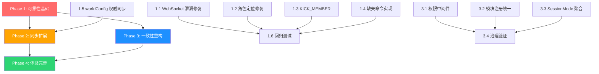

# Lyra Next 联机系统完善 — 实施方案

> **方案**：系统性修补 + 局部重构  
> **原则**：保留所有核心架构资产，补齐实现空洞，建立缺失的抽象层  
> **分析依据**：5 份分层差距分析报告（见文末索引）

---

## 1. 架构现状概要

### 1.1 保留不动的核心资产

当前联机架构方向正确，以下组件经过验证，**不需要重构**：

| 核心资产                 | 所在位置                                       | 设计质量                                      |
| ------------------------ | ---------------------------------------------- | --------------------------------------------- |
| Yjs 三文档模型           | `src/core/yjs/subdoc-manager.ts`               | MainDoc/TurnDoc/HistoryDoc 分层清晰，职责明确 |
| RoomSyncBridge           | `src/modules/room/sync/RoomSyncBridge.ts`      | 快照差异检测 + 事件派生，当前质量最高的部分   |
| SharedWebSocket 多路复用 | `src/core/yjs/shared-ws-manager.ts`            | 引用计数 + 连接复用设计正确（仅需修 bug）     |
| 联机 Provider 体系       | `src/core/yjs/multiplayer-provider.ts` 等      | MainDoc/TurnDoc/HistoryDoc 各有独立 Provider  |
| 回合制核心链路           | `src/modules/room/commands/handlers.ts`        | 行动→锁定→AI→完成→归档完整打通                |
| EventBus / CommandBus    | `src/core/event-bus/`, `src/core/command-bus/` | 模式中立设计正确，已预留 middleware 扩展点    |
| GameWizard 联机流程      | `src/components/GameWizard/steps/`             | 建房/入房/等待大厅/续玩流程完整               |

### 1.2 问题根因分布

| 根因类别     | 问题数量 | 占比   | 典型表现                                                  |
| ------------ | -------- | ------ | --------------------------------------------------------- |
| 实现不完整   | 15 项    | ~58%   | 命令已定义未注册处理器、同步未覆盖 Inventory/WorldArchive |
| 一致性缺失   | 7 项     | ~27%   | 权限校验分散、模块注册方式不统一、模式状态源分散          |
| 抽象缺失     | 4 项     | ~15%   | 无 SessionMode 聚合层、无统一 useMultiplayer 抽象         |
| **架构缺陷** | **0 项** | **0%** | **无**                                                    |

### 1.3 Yjs 文档结构参考

```
RootDoc（本地 IndexedDB）
├── saves（存档槽位）
├── settings
├── assets
└── rooms（roomId -> mainDocGuid 映射）

MainDoc（room:{roomId}:main，长期共享）
├── metadata（房间配置/状态）
├── members（成员列表）
├── config（currentTurnNumber/currentPhaseId/historyDocGuid/flowTemplateId/saveId）
├── turnDocRefs（回合号 -> turn doc guid）
├── characters（所有玩家角色 + NPC）
└── preGamePhases

TurnDoc（room:{roomId}:turn:{n}，回合瞬态）
├── config（status/deadline/resolveStatus/currentPhaseIndex/aiStatus/aiError/aiAborted）
├── actions（玩家行动）
├── readyPlayers
├── aiResponse（Y.Text，流式同步）
├── resultFrame
└── phases

HistoryDoc（room:{roomId}:history，归档）
├── messages（会话消息数组）
├── archivedTurns
└── memoryRoot（记忆数据）
```

---

## 2. 完整问题清单

### P0 — 必须修复（不修复则联机不可用或数据不一致）

#### P0-1：KICK_MEMBER 命令无处理器

- **表现**：`TimeoutDialog` 在"踢出未提交玩家"路径 dispatch `room/member/kick`，运行时失败
- **涉及文件**：
  - 命令定义：`src/domain/commands/room.ts`
  - 需新增处理器：`src/modules/room/commands/handlers.ts`
  - 调用方：超时弹窗组件
- **解决方向**：在 Room handlers 实现 KICK_MEMBER 处理器，含 Host 权限校验 + MainDoc 成员移除 + 事件派生

#### P0-2：多个命令已定义但未实现

- **未实现命令清单**：
  - `room/delete` — 房间删除
  - `room/settings/update` — 房间设置修改
  - `room/turn/action/update` — 行动修改/撤回
  - `room/history/load` — 历史加载
  - `room/history/archive` — 历史归档
  - `room/npc/create` — NPC 创建
  - `room/npc/status/update` — NPC 状态更新
  - `room/npc/info/update` — NPC 信息更新
  - `chat.regenerate_message` — 消息重新生成
  - `chat.stop_generation` — 停止生成
  - `chat.update_conversation` — 更新会话
- **涉及文件**：
  - 命令定义：`src/domain/commands/room.ts`、`src/domain/commands/chat.ts`
  - 处理器：`src/modules/room/commands/handlers.ts`、`src/modules/chat/handlers.ts`
- **解决方向**：评估 MVP 必需性，优先实现 NPC 管理、settings update、action update

#### P0-3：Inventory/Skill 联机同步缺失

- **表现**：`InventorySyncBridge` 仅从 SaveSlot 本地同步到 InventoryStore，不跨玩家
- **影响**：装备变更、战利品分配、技能使用无法跨客户端一致
- **涉及文件**：
  - 当前同步：`src/modules/inventory/sync/`
  - 需扩展：MainDoc 结构（新增 inventory 命名空间）
- **解决方向**：将 Inventory/Skill 状态挂入 MainDoc.inventory，建立联机 SyncBridge

#### P0-4：WorldArchive 联机同步缺失

- **表现**：`WorldArchiveSyncBridge` 仅本地同步，实体档案不跨玩家
- **影响**：玩家看到的世界实体状态可能分叉，AI 基于不一致状态生成内容
- **涉及文件**：
  - 当前同步：`src/modules/world-archive/sync/`
  - 需扩展：HistoryDoc 结构（新增 worldArchive 命名空间）
- **解决方向**：将 WorldArchive 数据挂入 HistoryDoc.worldArchive，建立跨端 SyncBridge

#### P0-5：worldConfig 缺少 Host 权威同步

- **表现**：Guest 新建联机存档时 worldConfig 取本地 preset 快照，未对齐 Host 配置
- **影响**：规则计算、UI 推导、AI prompt 构建与 Host 不一致
- **涉及文件**：
  - JOIN_ROOM 处理器：`src/modules/room/commands/handlers.ts`
  - Save 处理器：`src/modules/save/handlers.ts`
  - MainDoc 结构需扩展
- **解决方向**：在 MainDoc 中同步 worldConfig 权威快照，Guest 加入时从 MainDoc 回填

#### P0-6：共享 WebSocket 引用计数泄漏

- **表现**：`TurnDocProvider.disconnectAll()` 未对共享 WebSocket 引用逐一 release
- **影响**：离房后连接残留，下次联机状态异常
- **涉及文件**：
  - `src/core/yjs/turn-doc-provider.ts`（disconnectAll 方法）
  - `src/core/yjs/shared-ws-manager.ts`（引用计数逻辑）
- **解决方向**：确保 disconnectAll 逐连接调用 release，与 SharedWebSocketManager 引用计数配对

#### P0-7：usePlayerCharacter 联机角色定位错误

- **表现**：取"第一个 player 角色"，联机下所有玩家角色都在 characters 列表中
- **影响**：角色面板、HUD 侧栏可能展示他人角色
- **涉及文件**：`src/components/CharacterPanel/usePlayerCharacter.ts`
- **解决方向**：改为按 `operatorUserId` / `operatorUniqueTag` 匹配当前用户身份

---

### P1 — 重要缺失（严重影响联机体验）

#### P1-1：联机权限校验不一致

- **表现**：`EXTEND_TURN_DEADLINE`/`FORCE_START_TURN`/`LOCK_ACTION` 等 Host-only 命令缺少 Handler 级身份校验；`SUBMIT_ACTION` 未校验 userId 与成员身份绑定
- **涉及文件**：`src/modules/room/commands/handlers.ts`、`src/core/command-bus/index.ts`
- **解决方向**：实现 CommandBus 权限中间件，基于 sender + room membership/role 统一预校验

#### P1-2：模块注册体系不统一

- **表现**：save/data/room 三个模块绕过 Registry 直接注册命令；`unregisterAllModules` 未调用 `unregisterRoomModule`
- **涉及文件**：
  - `src/modules/index.ts`
  - `src/modules/save/index.ts`
  - `src/modules/data/index.ts`
  - `src/modules/room/index.ts`
  - `src/core/registry/index.ts`
- **解决方向**：让 save/data/room 以 manifest 进入 Registry，补齐 unregister 路径

#### P1-3：模式状态源分散

- **表现**：AppState/SaveType/RoomStore.mode 三者共同决定"当前模式"，缺少统一聚合
- **涉及文件**：`src/App.tsx`、`src/modules/room/store.ts`、`src/modules/save/`
- **解决方向**：新增 SessionMode 聚合层，统一派生 mode/saveType/roomId/isHost/connectionStatus

#### P1-4：游戏内缺少常驻联机状态入口

- **表现**：GameHUD 没有常驻连接状态、成员数、回合剩余时间、房主身份提示
- **涉及文件**：
  - `src/components/GameHUD/index.tsx`
  - 可复用：`src/components/Multiplayer/RoomInfoButton.tsx`、`ConnectionIndicator.tsx`
- **解决方向**：在 GameHUD 顶部或右上角接入常驻联机胶囊

#### P1-5：联机角色创建与单机能力不对齐

- **表现**：单机有多步骤完整向导（维度/属性/天赋/确认），联机仅 SimpleForm
- **涉及文件**：
  - `src/components/GameWizard/steps/WaitingLobby.tsx`
  - `src/components/GameWizard/components/CharacterCreation/SimpleForm.tsx`
  - 单机向导：`SoloCharNameStep/SoloCharAttributesStep/SoloCharTalentsStep/SoloCharConfirmStep`
- **解决方向**：在 WaitingLobby 提供"快速创建/详细创建"二选一

#### P1-6：联机消息编辑/删除链路缺失

- **表现**：联机主视图由 Turn/History 驱动，chat 编辑语义面向单机消息，联机下消息级编辑不可用
- **涉及文件**：
  - `src/modules/room/components/TurnNarrativeFlow.tsx`
  - `src/modules/chat/components/NarrativeBlock.tsx`
- **解决方向**：在 TurnDoc 层增加 action update 语义，为已提交行动提供修改/撤回命令闭环

#### P1-7：右侧栏缺少玩家协作视图

- **表现**：当前偏 NPC 视图，缺少成员提交状态/在线状态主入口
- **涉及文件**：`src/components/GameHUD/RightSidebarSceneTab.tsx`
- **解决方向**：增加"玩家协作区"tab，展示成员在线状态、提交进度、当前回合动作概览

#### P1-8：currentSaveId 监听采用轮询

- **表现**：`useCurrentSaveId()` 通过 `setInterval(100ms)` 轮询
- **涉及文件**：相关 hooks、`src/core/yjs/yjs-manager.ts`
- **解决方向**：在 yjsManager load/save 切换时提供 subscribe API，替代轮询

#### P1-9：缺少同步一致性测试

- **表现**：联机逻辑复杂但缺少自动化测试覆盖
- **解决方向**：建立专项测试集覆盖断线重连、回合切换竞态、离房清理、联机续玩等场景

---

### P2 — 优化改进（后续迭代）

| 编号  | 问题                                                        | 涉及文件                                                                          |
| ----- | ----------------------------------------------------------- | --------------------------------------------------------------------------------- |
| P2-1  | Chat 单机高级能力未在联机等价落地（消息级编辑/重生成/分支） | `src/modules/chat/`、`src/modules/room/components/`                               |
| P2-2  | Data/Save 对联机专有状态保真不足（members/lastRoomId 等）   | `src/modules/data/handlers.ts`                                                    |
| P2-3  | Multiplayer 组件复用不足（WaitingLobby 重复实现）           | `src/components/GameWizard/steps/WaitingLobby.tsx`、`src/components/Multiplayer/` |
| P2-4  | aiTools manifest 能力未落地                                 | 各模块 `index.ts`                                                                 |
| P2-5  | 缺少统一 useMultiplayer/useYjs 抽象层                       | `src/modules/room/hooks/`、`src/modules/chat/hooks/`                              |
| P2-6  | 联机设置缺少诊断工具                                        | `src/components/Settings/MultiplayerSettings.tsx`                                 |
| P2-7  | 历史消息分页性能问题（O(n) 全量读取）                       | 历史消息读取、AI 处理链路                                                         |
| P2-8  | Awareness 缺少独立模块化封装                                | `src/core/yjs/multiplayer-provider.ts`                                            |
| P2-9  | AppShell 与现有主流程关系未收敛                             | `src/components/layout/AppShell.tsx`、`src/App.tsx`                               |
| P2-10 | SubdocManager 残留 TODO 注释                                | `src/core/yjs/subdoc-manager.ts`                                                  |

---

## 3. 四阶段实施方案

### Phase 1：可靠性基础（修复 P0 Bug）

**目标**：消除运行时错误和数据不一致风险，确保现有联机功能稳定可用。

**原则**：只修不改架构，最小化变更范围。

| 任务                     | 问题编号 | 涉及文件                                                               | 具体工作                                                                                                               |
| ------------------------ | -------- | ---------------------------------------------------------------------- | ---------------------------------------------------------------------------------------------------------------------- |
| 1.1 修复 WebSocket 泄漏  | P0-6     | `src/core/yjs/turn-doc-provider.ts`                                    | `disconnectAll()` 逐连接调用 `sharedWsManager.release()`，确保引用计数归零                                             |
| 1.2 修复角色定位         | P0-7     | `src/components/CharacterPanel/usePlayerCharacter.ts`                  | 改为按 `operatorUserId`/`operatorUniqueTag` 匹配当前用户                                                               |
| 1.3 实现 KICK_MEMBER     | P0-1     | `src/modules/room/commands/handlers.ts`                                | 含 Host 权限校验 + MainDoc.members 移除 + 派生 MEMBER_LEFT 事件                                                        |
| 1.4 实现 MVP 必需命令    | P0-2     | `src/modules/room/commands/handlers.ts`、`src/domain/commands/room.ts` | `room/settings/update`、`room/turn/action/update`、`room/npc/create`、`room/npc/status/update`、`room/npc/info/update` |
| 1.5 worldConfig 权威同步 | P0-5     | `src/modules/room/commands/handlers.ts`（CREATE_ROOM/JOIN_ROOM）       | MainDoc 新增 worldConfig 命名空间；Host CREATE_ROOM 时写入；Guest JOIN_ROOM 时从 MainDoc 回填而非取本地 preset         |
| 1.6 回归测试             | —        | —                                                                      | 验证联机核心链路：建房→入房→角色创建→行动提交→AI生成→回合完成→历史归档                                                 |

**验收标准**：
- 离房后 WebSocket 引用计数归零
- 联机角色面板显示当前操作者的角色
- KICK_MEMBER 能正常踢出成员并派生事件
- NPC 可在联机中创建和更新
- Guest 的 worldConfig 与 Host 一致

---

### Phase 2：同步覆盖扩展（P0-3、P0-4）

**目标**：将 Inventory、WorldArchive 纳入联机同步，消除玩家间状态分叉。

**与 Phase 3 无依赖关系，可并行推进。**

#### 2.1 Inventory/Skill 联机同步

**挂载位置**：MainDoc.inventory（与 characters 同层，便于 Host 权威控制）

```
MainDoc 扩展
└── inventory
    ├── {characterId}
    │   ├── items（装备/物品列表）
    │   └── skills（技能列表）
    └── ...
```

| 任务                             | 涉及文件                                    | 具体工作                                                                                    |
| -------------------------------- | ------------------------------------------- | ------------------------------------------------------------------------------------------- |
| 2.1.1 定义 InventoryYjsData 结构 | `src/core/yjs/subdoc-manager.ts`            | 在 MainDoc 初始化中增加 inventory Y.Map                                                     |
| 2.1.2 改造 InventorySyncBridge   | `src/modules/inventory/sync/`               | 联机模式下：Host 写入 MainDoc.inventory → 广播；Guest 从 MainDoc.inventory 同步到本地 Store |
| 2.1.3 命令层适配                 | `src/modules/inventory/handlers.ts`（如有） | 装备/卸装/使用物品命令在联机模式下写入 MainDoc                                              |

#### 2.2 WorldArchive 联机同步

**挂载位置**：HistoryDoc.worldArchive（只增/低频修改数据，与历史消息同层）

```
HistoryDoc 扩展
└── worldArchive
    ├── entities（实体列表）
    ├── relationships（关系列表）
    └── metadata（版本/时间戳）
```

| 任务                                | 涉及文件                                  | 具体工作                                                             |
| ----------------------------------- | ----------------------------------------- | -------------------------------------------------------------------- |
| 2.2.1 定义 WorldArchiveYjsData 结构 | `src/core/yjs/subdoc-manager.ts`          | 在 HistoryDoc 初始化中增加 worldArchive Y.Map                        |
| 2.2.2 改造 WorldArchiveSyncBridge   | `src/modules/world-archive/sync/`         | 联机模式下双向同步：AI 驱动的实体更新通过 CommandBus 写入 HistoryDoc |
| 2.2.3 RoomSyncBridge 扩展           | `src/modules/room/sync/RoomSyncBridge.ts` | 在同步处理中包含 worldArchive 的快照差异检测                         |

**验收标准**：
- 任一玩家的装备/技能变更，其他玩家实时可见
- AI 驱动的世界实体更新，所有玩家状态一致
- 断线重连后同步状态正确

---

### Phase 3：结构性一致性重构（P1-1、P1-2、P1-3）

**目标**：建立权限中间件、统一模块注册、新增 SessionMode 聚合层。

**这是唯一需要"重构"的阶段，但范围严格限定。与 Phase 2 无依赖关系，可并行推进。**

#### 3.1 CommandBus 权限中间件

**新增文件**：`src/core/middleware/room-permission.ts`

```typescript
// 权限规则表
interface PermissionRule {
  commandPattern: string       // 如 room/member/kick
  requiredRole: 'host' | 'member'
  validatePayload?: (payload: unknown, context: CommandContext) => boolean
}

// 中间件挂载到 CommandBus middleware 链
function roomPermissionMiddleware(command, context, next) {
  // 1. 检查命令是否匹配权限规则
  // 2. 从 context.sender 获取调用者身份
  // 3. 从 RoomStore 获取当前房间成员/Host 信息
  // 4. 校验通过则 next()，否则 reject
}
```

| 任务                   | 涉及文件                                      | 具体工作                               |
| ---------------------- | --------------------------------------------- | -------------------------------------- |
| 3.1.1 定义权限规则表   | 新建 `src/core/middleware/room-permission.ts` | 覆盖所有 `room/*` 命令的权限要求       |
| 3.1.2 实现中间件       | 同上                                          | 拦截逻辑 + 错误处理                    |
| 3.1.3 挂载到 Room 模块 | `src/modules/room/index.ts`                   | Room 模块注册时将中间件加入 CommandBus |

**影响范围**：仅新增中间件 + 挂载。现有 handler 内的权限校验可保留作为二次防线，兼容性好。

#### 3.2 模块注册统一

| 任务                | 涉及文件                    | 具体工作                                  |
| ------------------- | --------------------------- | ----------------------------------------- |
| 3.2.1 save 模块迁移 | `src/modules/save/index.ts` | 新增 manifest，改用 `registry.register()` |
| 3.2.2 data 模块迁移 | `src/modules/data/index.ts` | 新增 manifest，改用 `registry.register()` |
| 3.2.3 room 模块迁移 | `src/modules/room/index.ts` | 新增 manifest，改用 `registry.register()` |
| 3.2.4 补齐卸载      | `src/modules/index.ts`      | `unregisterAllModules` 覆盖所有模块       |

**风险控制**：manifest 注册最终还是调用 `commandBus.register`（由 Registry 代理），handler 代码完全不动。

#### 3.3 SessionMode 聚合层

**新增文件**：`src/stores/session.ts`

```typescript
interface SessionState {
  mode: 'offline' | 'online'
  saveType: 'solo' | 'multiplayer'
  saveId: string | null
  roomId: string | null
  isHost: boolean
  connectionStatus: ConnectionStatus
  localUserId: string
}

// 派生自：
// - SaveType: 来自 SAVE_LOADED 事件
// - RoomStore: mode/connectionStatus/currentRoom
// - Settings: localUser
```

| 任务                    | 涉及文件                     | 具体工作                                  |
| ----------------------- | ---------------------------- | ----------------------------------------- |
| 3.3.1 定义 SessionState | 新建 `src/stores/session.ts` | Zustand store + 事件订阅自动更新          |
| 3.3.2 订阅事件源        | 同上                         | 监听 `SAVE_LOADED`、`RoomEvents.*` 等事件 |
| 3.3.3 替换分散判断      | 各模块中分散的模式判断逻辑   | 改为从 `useSessionStore()` 读取           |

**验收标准**：
- `registry.getModuleStatus()` 可观测所有模块状态
- Guest dispatch Host-only 命令被中间件拦截
- 任意位置读取 `useSessionStore()` 获得一致的模式信息

---

### Phase 4：联机体验完善（P1-4 ~ P1-9 + P2）

**目标**：补齐联机 UI 感知、角色创建对齐、测试覆盖。

| 任务                     | 问题编号 | 涉及文件                                                                               | 具体工作                                                                   |
| ------------------------ | -------- | -------------------------------------------------------------------------------------- | -------------------------------------------------------------------------- |
| 4.1 常驻联机状态胶囊     | P1-4     | `src/components/GameHUD/index.tsx`                                                     | 复用 `RoomInfoButton`/`ConnectionIndicator`，显示连接状态/人数/回合/倒计时 |
| 4.2 玩家协作视图         | P1-7     | `src/components/GameHUD/RightSidebarSceneTab.tsx`                                      | 增加成员在线状态、提交进度、当前回合动作概览                               |
| 4.3 行动撤回命令闭环     | P1-6     | `src/modules/room/commands/handlers.ts`、`src/modules/room/components/ActionInput.tsx` | 实现 `room/turn/action/update` 处理器 + UI 撤回按钮接入真实命令            |
| 4.4 联机角色创建增强     | P1-5     | `src/components/GameWizard/steps/WaitingLobby.tsx`                                     | 增加"快速/详细"二选一，详细模式复用单机向导组件                            |
| 4.5 Multiplayer 组件复用 | P2-3     | `WaitingLobby.tsx`、`src/components/Multiplayer/`                                      | WaitingLobby 复用 ConnectionIndicator/MemberList                           |
| 4.6 currentSaveId 事件化 | P1-8     | `src/core/yjs/yjs-manager.ts`、相关 hooks                                              | 提供 subscribe API 替代 setInterval 轮询                                   |
| 4.7 联机测试集           | P1-9     | 测试目录                                                                               | 覆盖断线重连、回合切换竞态、离房清理、联机续玩                             |
| 4.8 P2 优化项            | P2-*     | 见 P2 清单                                                                             | 按需推进                                                                   |

---

## 4. 任务依赖关系



**关键路径**：Phase 1 → Phase 2/3（可并行）→ Phase 4

---

## 5. 数据同步完整性矩阵（当前 vs 目标）

| 数据域                           | 当前实时跨玩家同步 |  目标  |     实施阶段     |
| -------------------------------- | :----------------: | :----: | :--------------: |
| 房间元数据（状态/房主/人数上限） |         ✅          |   ✅    |        —         |
| 成员列表与状态                   |         ✅          |   ✅    |        —         |
| 当前回合号/阶段号                |         ✅          |   ✅    |        —         |
| 玩家行动                         |         ✅          |   ✅    |        —         |
| AI 流式响应                      |         ✅          |   ✅    |        —         |
| 历史消息                         |         ✅          |   ✅    |        —         |
| archivedTurns                    |         ✅          |   ✅    |        —         |
| 角色数据                         |         ✅          |   ✅    |        —         |
| Memory                           |         ✅          |   ✅    |        —         |
| worldConfig                      |         ❌          |   ✅    |     Phase 1      |
| Inventory/Skill                  |         ❌          |   ✅    |     Phase 2      |
| WorldArchive                     |         ❌          |   ✅    |     Phase 2      |
| Checkpoint                       |         ❌          | ⚠️ 评估 |     Phase 4      |
| 预设/AI Profile/Lorebook         |         ❌          |   ❌    | 设计上为本地配置 |

---

## 6. 风险控制

### 技术风险

| 风险                                  | 级别  | 缓解措施                                                 |
| ------------------------------------- | :---: | -------------------------------------------------------- |
| 同步扩展导致 MainDoc 体积膨胀         |  中   | Inventory 数据按需同步，不同步历史版本；定期评估文档大小 |
| 权限中间件与现有 handler 权限检查冲突 |  低   | 中间件前置拦截，handler 内检查保留为二次防线             |
| Registry 迁移导致模块加载顺序变化     |  低   | manifest 注册最终调用 commandBus.register，执行逻辑不变  |
| SessionMode 聚合引入新的状态同步问题  |  中   | SessionMode 为只读派生状态，不引入新写入路径             |

### 回滚策略

| 阶段    | 回滚方式                                                                           |
| ------- | ---------------------------------------------------------------------------------- |
| Phase 1 | 每个修复独立提交，可按 commit 级别回滚                                             |
| Phase 2 | 同步扩展在新命名空间中进行，不影响现有字段，可通过 feature flag 控制               |
| Phase 3 | 权限中间件通过 middleware 链挂载，可一行代码禁用；Registry 迁移不影响 handler 代码 |
| Phase 4 | UI 增强均为增量添加，不修改现有 UI 逻辑                                            |

---

## 7. 功能对照矩阵（单机 vs 联机完整参考）

### 对话/消息系统

| 功能                    | 单机  | 联机  |        状态         |
| ----------------------- | :---: | :---: | :-----------------: |
| 发送用户消息            |   ✅   |   ✅   |       ✅ 可用        |
| AI 流式回复             |   ✅   |   ✅   |       ✅ 可用        |
| 消息编辑（用户）        |   ✅   |   ❌   |       ⚠️ 缺失        |
| 消息编辑（AI）          |   ✅   |   ❌   |       ⚠️ 缺失        |
| 消息删除                |   ✅   |   ❌   |       ⚠️ 缺失        |
| 重新生成 AI 回复        |   ✅   |   ✅   |       ✅ 可用        |
| 会话创建/选择/清空/删除 |   ✅   |   —   |  ℹ️ 联机采用回合制   |
| 消息分支管理            |   ✅   |   ❌   |       ⚠️ 缺失        |
| 行动撤回                |   —   |   ❌   | ⚠️ UI 有但命令未闭环 |

### 角色系统

| 功能                 | 单机  | 联机  |        状态         |
| -------------------- | :---: | :---: | :-----------------: |
| 角色创建（完整向导） |   ✅   |   ❌   | ⚠️ 联机仅 SimpleForm |
| 角色属性展示         |   ✅   |   ✅   |       ✅ 可用        |
| 角色跨端同步         |   —   |   ✅   |       ✅ 可用        |
| 装备系统             |   ✅   |   ❌   |   ⚠️ 不跨玩家同步    |
| 背包系统             |   ✅   |   ❌   |   ⚠️ 不跨玩家同步    |
| 技能系统             |   ✅   |   ❌   |   ⚠️ 不跨玩家同步    |
| 状态标签             |   ✅   |   ✅   |    ✅ 随角色同步     |

### NPC 系统

| 功能              | 单机  | 联机  |     状态     |
| ----------------- | :---: | :---: | :----------: |
| NPC 列表展示      |   ✅   |   ✅   |    ✅ 可用    |
| NPC 详情弹窗      |   ✅   |   ✅   |    ✅ 可用    |
| NPC 创建          |   ✅   |   ❌   | ⚠️ 命令未实现 |
| NPC 状态/信息更新 |   ✅   |   ❌   | ⚠️ 命令未实现 |

### 其他系统

| 功能                  | 单机  | 联机  |          状态          |
| --------------------- | :---: | :---: | :--------------------: |
| 存档创建/加载/删除    |   ✅   |   ✅   |         ✅ 可用         |
| 自动保存              |   ✅   |   ✅   |         ✅ 可用         |
| 联机续玩              |   —   |   ✅   |         ✅ 可用         |
| WorldArchive 实体管理 |   ✅   |   ❌   |     ⚠️ 不跨玩家同步     |
| AI 调用/工具/后处理   |   ✅   |   ✅   |         ✅ 可用         |
| 预设系统              |   ✅   |   ✅   |       ℹ️ 本地配置       |
| Lorebook              |   ✅   |   ✅   |       ℹ️ 本地配置       |
| 回合制                |   —   |   ✅   | ✅ 可用（部分命令缺失） |
| 踢出成员              |   —   |   ❌   |     ❌ 命令无处理器     |

---

## 8. 详细分析文档索引

| #   | 文档                                                     | 关注点                                                                          | 关键发现                                                                |
| --- | -------------------------------------------------------- | ------------------------------------------------------------------------------- | ----------------------------------------------------------------------- |
| 1   | [核心基础设施分析](./multiplayer-gap-analysis-1-core.md) | EventBus/CommandBus/Registry/Yjs 基础设施/模块注册/应用层模式切换               | 核心总线模式中立但缺少权限语义；模块注册不统一；联机能力集中在 core/yjs |
| 2   | [功能模块分析](./multiplayer-gap-analysis-2-modules.md)  | Chat/Data/Room/Save/Domain 各模块单机 vs 联机能力对比                           | 双轨并行架构；命令定义与实现不对齐；权限校验覆盖不均                    |
| 3   | [UI 组件层分析](./multiplayer-gap-analysis-3-ui.md)      | 聊天 UI/GameHUD/Multiplayer 组件/GameWizard/CharacterPanel/SaveManager/Settings | 组件能力可用但接入分散；游戏内联机感知不足；角色创建深度不对齐          |
| 4   | [Yjs 同步层分析](./multiplayer-gap-analysis-4-sync.md)   | 文档结构/SyncBridge 覆盖/数据同步完整性/可靠性评估                              | 三文档模型完整；Inventory/WorldArchive/Checkpoint 未联机同步；性能隐患  |
| 5   | [综合报告](./multiplayer-gap-analysis-summary.md)        | 功能对照矩阵 + P0/P1/P2 问题清单 + 三阶段实施路线图                             | 覆盖 11 个功能域共 50+ 功能点的完整对照                                 |

## 9. 现实优先延后项台账（已并入）

> 以下延后项已并入本实施方案主文档，后续可直接在此维护与更新。
> 如删除“联机现实优先修复计划”文档，不影响本台账追踪。

| 延后项                               | 延后原因                                                      | 触发条件                                            | 最晚处理阶段                           |
| ------------------------------------ | ------------------------------------------------------------- | --------------------------------------------------- | -------------------------------------- |
| 全量 CommandBus 权限中间件统一化     | 本轮可由后端 host-only 与成员复核先完成风险兜底，立即收益更高 | 出现非房间接口的权限绕过，或 host-only 接口继续增长 | 下一轮联机稳定化阶段                   |
| `action update` 细粒度冲突合并策略   | 当前目标是先堵越权与锁后写入，复杂并发合并属于优化项          | 出现高频并发编辑冲突，且影响玩家可用性              | 联机体验增强阶段                       |
| 解散后历史数据压缩与异步归档治理     | 不影响当前正确性，属于容量和维护性优化                        | 房间历史体量增长导致存储或恢复成本上升              | 联机稳定化后半阶段                     |
| `worldConfig` 跨版本迁移自动修复工具 | 本轮只需权威回填即可保证一致；迁移工具属 schema 治理          | `worldConfig` schema 升级引入兼容分支               | 下一次 `worldConfig` schema 变更发布前 |
| 全链路重连退避与抖动参数治理         | 本轮先修引用释放对称性，避免把故障放大；退避策略可后置        | 连接失败重试频率过高并影响服务稳定                  | 联机稳定化回归阶段                     |
