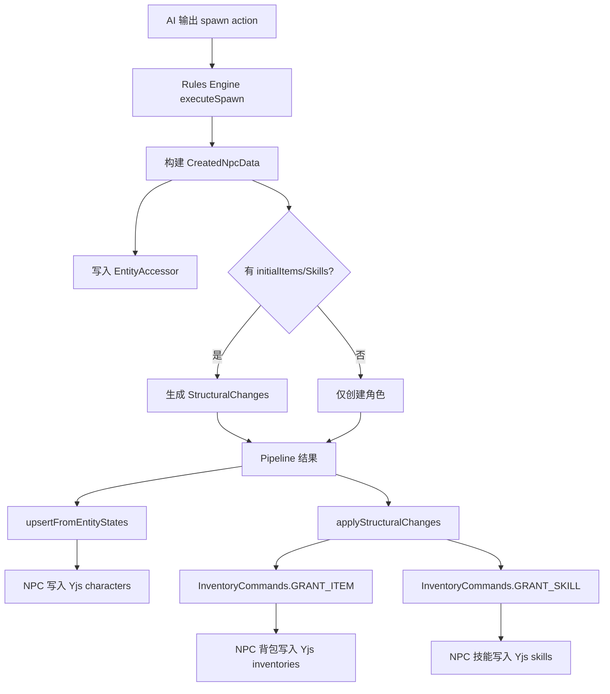
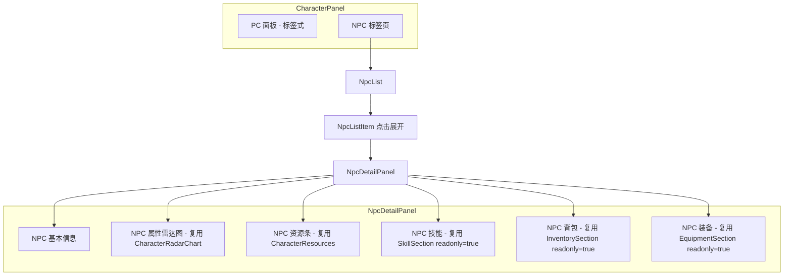
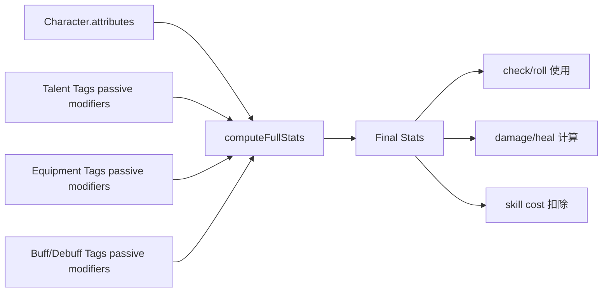
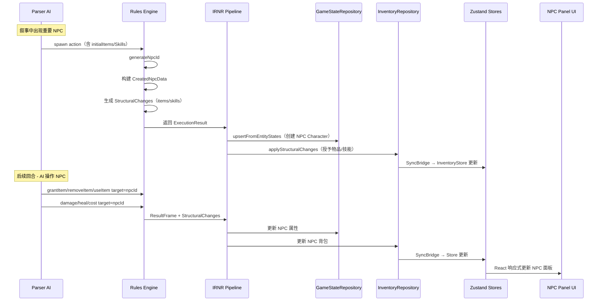

# NPC 与玩家实体统一方案 — 架构设计文档

> **文档状态**: Draft v1.0  
> **创建日期**: 2026-02-25  
> **关联文档**: [equipment-system-and-dual-pipeline.md](./equipment-system-and-dual-pipeline.md) · [phase4-unified-effects-and-enhanced-ux.md](./phase4-unified-effects-and-enhanced-ux.md) · [rulescript-v2-definitive-design.md](./rulescript-v2-definitive-design.md) · [entity-naming-convention.md](../docs/entity-naming-convention.md)

---

## 0. 现状分析

### 0.1 核心发现：数据层已经统一，差距在创建路径和 UI

```
┌─────────────────────────────────────────────────────────────┐
│            统一 Character 接口                               │
│  controlType: "player" | "npc" | "companion"                │
├──────────────┬──────────────────────────────────────────────┤
│  PC 路径      │  NPC 路径                                   │
│  ✅ 完整属性   │  ⚠️ 精简属性（缺少 age/gender/dimensions）  │
│  ✅ 背包/技能  │  ❌ 无初始物品/技能                          │
│  ✅ 装备系统   │  ❌ 无装备                                   │
│  ✅ 丰富 UI   │  ❌ 仅基本信息面板                           │
│  ✅ 雷达图     │  ❌ 无属性可视化                             │
│  ✅ 资源条     │  ❌ 无资源展示                               │
└──────────────┴──────────────────────────────────────────────┘
```

### 0.2 各层统一程度

| 层级                                                                                        | 统一程度   | 说明                                                                                         |
| ------------------------------------------------------------------------------------------- | ---------- | -------------------------------------------------------------------------------------------- |
| [`Character`](../src/domain/entities/character.ts:31) 接口                                  | ✅ 完全统一 | PC/NPC 共用同一接口，通过 `controlType` 区分                                                 |
| [`EntityAccessor`](../src/modules/game/services/entity-accessor.ts:29)                      | ✅ 完全统一 | 对所有 `Character` 统一构建 `EntityData`，应用天赋和装备效果                                 |
| [`InventoryRepository`](../src/modules/inventory/repository/inventory-repository.ts:28)     | ✅ 完全统一 | 以 `characterId` 为 key，不区分 PC/NPC                                                       |
| [`useInventoryStore`](../src/modules/inventory/store.ts:17)                                 | ✅ 完全统一 | `Record<string, ItemInstance[]>` 按 `characterId` 索引                                       |
| [`computeFullStats()`](../src/lib/rules/stats-pipeline.ts)                                  | ✅ 完全统一 | 基于 `WorldConfig` 公式计算，不区分角色类型                                                  |
| [`StructuralChangeConsumer`](../src/modules/game/services/structural-change-consumer.ts:86) | ✅ 完全统一 | 使用 `change.targetId`，可操作任意角色                                                       |
| [`DirectActionService`](../src/modules/game/services/direct-action-service.ts:27)           | ✅ 逻辑统一 | 使用 `action.actorId`，无 PC/NPC 校验；但仅从 PC 面板 UI 触发                                |
| **`spawn` Action Schema**                                                                   | ⚠️ 不完整   | 缺少 `initialItems`、`initialSkills`、`gender`、`age` 字段                                   |
| [`CreatedNpcData`](../src/domain/types/entity.ts:92)                                        | ⚠️ 字段不足 | `attributes: Record<string, number>`（与 Character 的 `Record<string, unknown>` 不一致）     |
| **NPC 面板 UI**                                                                             | ❌ 缺失     | [`NpcList.tsx`](../src/components/CharacterPanel/NpcList.tsx) 仅展示名称/性格/描述/属性/天赋 |

### 0.3 已有的关键能力证明

以下代码证明 **NPC 已可通过 IRNR Pipeline 获得物品和技能**（只是 spawn 时没有初始化）：

```typescript
// grantItem/grantSkill 的 target 是 entityRef，可引用任意实体
// src/modules/inventory/schemas/action-schemas.ts
{ name: "target", type: "entityRef", required: true, description: "目标角色 ID" }

// StructuralChangeConsumer 以 targetId 分发，不检查角色类型
// src/modules/game/services/structural-change-consumer.ts:149-152
const result = await commandBus.dispatch({
  type: InventoryCommands.GRANT_ITEM,
  payload: { characterId: change.targetId, ... },
});
```

---

## 1. 总体策略选择

### 推荐方案：方案 B — 渐进扩展

| 方案            | 描述                                                  | 优势                             | 劣势                                                 |
| --------------- | ----------------------------------------------------- | -------------------------------- | ---------------------------------------------------- |
| A. 完全统一     | NPC/PC 使用完全相同的数据和 UI                        | 最大化代码复用                   | NPC 不需要玩家创建向导；强制统一会引入不必要的复杂度 |
| **B. 渐进扩展** | **保持 Character 统一接口，逐步为 NPC 补充数据和 UI** | **改动最小、风险可控、路径清晰** | 需要持续关注 NPC/PC 差异点                           |
| C. 分层抽象     | 引入 Capability 层按需组合                            | 理论上最灵活                     | 过度工程化，当前规模不需要                           |

**选择 B 的理由**：

1. **数据层已统一**：`Character` 接口、`InventoryRepository`、`EntityAccessor` 已经不区分 PC/NPC，无需引入新的抽象层
2. **改动定位清晰**：主要工作集中在三个方面 —— 扩展 `spawn` Schema、复用现有组件构建 NPC 面板、扩展 AI 集成
3. **项目未上线**：无需考虑旧数据迁移或向后兼容，可以直接修改类型定义和数据结构
4. **方案 C 是未来的选项**：如果后续实体类型增多（载具、建筑、宠物等），可以在方案 B 基础上演进到 Capability 模式

### 核心原则

```
PC 创建 = 玩家手动配置（GameWizard）+ 完整向导流程
NPC 创建 = AI 自动决策（spawn Action）+ 简化配置 + 可选初始装备
两者创建后 → 共享同一套数据层和规则引擎
```

---

## 2. 数据层改动

### 2.1 扩展 `CreatedNpcData`

修改 [`src/domain/types/entity.ts`](../src/domain/types/entity.ts:92)：

```typescript
export interface CreatedNpcData {
  id: string;
  name: string;
  description?: string;
  personality?: string;
  appearance?: string;
  /** 年龄 */
  age?: number;
  /** 性别 */
  gender?: string;

  /**
   * 初始属性
   * 
   * 统一为 Record<string, unknown> 与 Character.attributes 保持一致。
   * 规则引擎和 EntityAccessor 内部会筛选 number/string/boolean 类型。
   */
  attributes: Record<string, unknown>;

  /** 天赋 ID 列表 */
  talentIds?: string[];

  /** 初始物品列表（spawn 时批量授予） */
  initialItems?: SpawnItemDef[];
  /** 初始技能列表（spawn 时批量授予） */
  initialSkills?: SpawnSkillDef[];
}

/**
 * Spawn 时附带的物品定义
 * 
 * 与 GrantItemAction 结构对齐，但去除 target（隐含为新创建的 NPC）。
 */
export interface SpawnItemDef {
  templateId?: string;
  name: string;
  description?: string;
  category: "weapon" | "armor" | "accessory" | "consumable" | "material" | "quest" | "misc";
  quantity?: number;
  equipSlot?: string;
  /** 是否在创建时自动装备 */
  autoEquip?: boolean;
  effects?: import("./rule-script").ItemEffect[];
}

/**
 * Spawn 时附带的技能定义
 */
export interface SpawnSkillDef {
  templateId?: string;
  name: string;
  description?: string;
  category: "combat" | "magic" | "survival" | "social" | "craft" | "misc";
  activeUsable?: boolean;
  cost?: { field: string; amount: number };
}
```

### 2.2 扩展 `SpawnAction` 类型

修改 [`src/domain/types/rule-script.ts`](../src/domain/types/rule-script.ts:172)：

```typescript
export interface SpawnAction extends RuleActionBase {
  type: "spawn";
  entity: {
    name: string;
    description?: string;
    personality?: string;
    appearance?: string;
    age?: number;        // 新增
    gender?: string;     // 新增
    attributes?: Record<string, number>;
    talentIds?: string[];
    /** 初始物品（可选，AI 可根据角色身份自动决定） */
    initialItems?: SpawnItemDef[];   // 新增
    /** 初始技能（可选，AI 可根据角色职业自动决定） */
    initialSkills?: SpawnSkillDef[]; // 新增
  };
}
```

### 2.3 `attributes` 类型一致性修复

**问题**：`Character.attributes` 是 `Record<string, unknown>`，而 `CreatedNpcData.attributes` 和 `SpawnAction.entity.attributes` 是 `Record<string, number>`。

**修复策略**：

- `SpawnAction.entity.attributes` **保持 `Record<string, number>`** — AI 输出的属性值始终是数值
- `CreatedNpcData.attributes` **改为 `Record<string, unknown>`** — 与 `Character.attributes` 对齐
- [`executeSpawn()`](../src/lib/rules/engine.ts:96) 中构建 `npcData` 时直接传递 `attributes`，类型宽化不影响运行时行为
- [`characterToEntityData()`](../src/modules/game/repository/entity-codec.ts:202) 已经内部筛选 `number | string | boolean`，无需改动

### 2.4 NPC 如何获得初始技能/物品/装备

#### 数据流



#### 引擎层改动

修改 [`executeSpawn()`](../src/lib/rules/engine.ts:96)：

```typescript
function executeSpawn(
  action: SpawnAction,
  context: ExecutionContext,
  state: InternalExecutionState,
): void {
  const npcId = generateNpcId(state.random);
  const attributes = action.entity.attributes ?? {};

  const npcData: CreatedNpcData = {
    id: npcId,
    name: action.entity.name,
    description: action.entity.description,
    personality: action.entity.personality,
    appearance: action.entity.appearance,
    age: action.entity.age,           // 新增
    gender: action.entity.gender,       // 新增
    attributes,
    talentIds: action.entity.talentIds,
    initialItems: action.entity.initialItems,   // 新增
    initialSkills: action.entity.initialSkills, // 新增
  };

  state.createdNpcs.push(npcData);

  // ... 现有的别名注册逻辑 ...

  // ── 生成初始物品的 StructuralChanges ──
  if (action.entity.initialItems) {
    for (const item of action.entity.initialItems) {
      const instanceId = crypto.randomUUID();
      state.structuralChanges.push({
        type: "item_added",
        entityId: instanceId,
        targetId: npcId,
        templateId: item.templateId,
        details: {
          name: item.name,
          description: item.description ?? "",
          category: item.category,
          quantity: item.quantity ?? 1,
          ...(item.equipSlot ? { equipSlot: item.equipSlot } : {}),
          // effects 序列化为 JSON 字符串（StructuralChange.details 只接受原始类型）
          ...(item.effects ? { effects: JSON.stringify(item.effects) } : {}),
        },
        reason: `${action.entity.name} 的初始装备`,
      });

      // 如果 autoEquip，追加装备变更
      if (item.autoEquip && item.equipSlot) {
        state.structuralChanges.push({
          type: "item_equipped",
          entityId: instanceId,
          targetId: npcId,
          details: { targetSlot: item.equipSlot },
          reason: `${action.entity.name} 自动装备`,
        });
      }
    }
  }

  // ── 生成初始技能的 StructuralChanges ──
  if (action.entity.initialSkills) {
    for (const skill of action.entity.initialSkills) {
      state.structuralChanges.push({
        type: "skill_learned",
        entityId: crypto.randomUUID(),
        targetId: npcId,
        templateId: skill.templateId,
        details: {
          name: skill.name,
          description: skill.description ?? "",
          category: skill.category,
          activeUsable: skill.activeUsable ?? false,
          ...(skill.cost
            ? {
                costField: skill.cost.field,
                costAmount: skill.cost.amount,
              }
            : {}),
        },
        reason: `${action.entity.name} 的初始技能`,
      });
    }
  }
}
```

**关键设计决策**：通过 `StructuralChanges` 复用现有的 [`StructuralChangeConsumer`](../src/modules/game/services/structural-change-consumer.ts:86) 管线，避免在 `executeSpawn` 中直接操作 `InventoryRepository`。这保持了引擎层的纯粹性（引擎只产出变更记录，不直接执行副作用）。

---

## 3. AI 集成

### 3.1 Spawn Action Schema 扩展

修改 [`src/modules/game/services/action-schemas.ts`](../src/modules/game/services/action-schemas.ts:658) 中的 `spawnSchema`：

```typescript
const spawnSchema: ActionSchema = {
  type: "spawn",
  category: "npc",
  displayName: "创建实体",
  description:
    "在场景中创建新实体。识别到叙事中出现新的重要角色时使用。" +
    "可为实体配置初始物品和技能，使其从出场就拥有完整的游戏能力。" +
    "不要为路人创建实体。",
  params: [
    {
      name: "entity",
      type: "object",
      required: true,
      description: "实体数据对象",
      properties: [
        { name: "name", type: "string", required: true, description: "实体名称" },
        { name: "description", type: "string", required: false, description: "简要描述" },
        { name: "personality", type: "string", required: false, description: "性格特征" },
        { name: "appearance", type: "string", required: false, description: "外貌描述" },
        { name: "age", type: "number", required: false, description: "年龄" },         // 新增
        { name: "gender", type: "string", required: false, description: "性别" },       // 新增
        { name: "attributes", type: "object", required: false,
          description: "属性值对象。key 必须是世界配置中定义的属性 key" },
        { name: "talentIds", type: "talentRef", required: false,
          description: "天赋 ID 列表" },
        // ── 新增 ──
        {
          name: "initialItems",
          type: "array",
          required: false,
          description: "初始物品列表。根据角色身份/职业合理配置。每项包含 name, category, 可选 equipSlot/autoEquip/effects",
        },
        {
          name: "initialSkills",
          type: "array",
          required: false,
          description: "初始技能列表。根据角色职业/背景合理配置。每项包含 name, category, 可选 activeUsable/cost",
        },
      ],
    },
  ],
  constraints: [
    "entity.name 是必填项，不能为空",
    "entity.attributes 中的 key 必须与世界配置的 primaryAttributes 匹配",
    "entity.talentIds 中的每个 ID 必须在世界配置的 talents 中存在",
    "initialItems 中的 category 必须为: weapon/armor/accessory/consumable/material/quest/misc",
    "initialItems 中的 equipSlot 必须匹配世界配置的 equipSlotDefinitions",
    "initialSkills 中的 category 必须为: combat/magic/survival/social/craft/misc",
    "不要为路人创建实体，只为对剧情有影响的角色使用",
    "初始物品和技能应与角色身份匹配（商人应有货物，战士应有武器和战斗技能）",
  ],
  examples: [
    {
      scenario: "创建一个武器商人 NPC",
      json: `{
  "type": "spawn",
  "entity": {
    "name": "老王",
    "description": "一位经验丰富的武器商人",
    "personality": "精明但诚实",
    "gender": "male",
    "age": 45,
    "attributes": { "str": 8, "int": 14 },
    "talentIds": ["bargain_master"],
    "initialItems": [
      { "name": "精钢长剑", "category": "weapon", "equipSlot": "main_hand" },
      { "name": "治疗药水", "category": "consumable", "quantity": 3 }
    ],
    "initialSkills": [
      { "name": "鉴定", "category": "social", "description": "识别物品价值和品质" }
    ]
  }
}`,
    },
    {
      scenario: "创建一个持剑守卫",
      json: `{
  "type": "spawn",
  "entity": {
    "name": "城门守卫",
    "description": "身着铠甲的城门守卫",
    "personality": "严肃尽职",
    "attributes": { "str": 14, "con": 12 },
    "initialItems": [
      { "name": "铁剑", "category": "weapon", "equipSlot": "main_hand", "autoEquip": true },
      { "name": "链甲", "category": "armor", "equipSlot": "body", "autoEquip": true }
    ],
    "initialSkills": [
      { "name": "格挡", "category": "combat", "description": "使用盾牌或武器格挡攻击", "activeUsable": true, "cost": { "field": "sp", "amount": 5 } }
    ]
  }
}`,
    },
  ],
};
```

### 3.2 AI 在战斗场景中操作 NPC 的技能和物品

**现状**：`grantItem`、`grantSkill`、`removeItem`、`removeSkill` 的 `target` 参数是 `entityRef` 类型，已支持引用任意实体（包括 NPC）。`damage`、`heal`、`cost`、`set` 等数值操作也以 `target` 引用实体。因此 **AI 已经可以在游戏中操作 NPC 的状态和物品**。

**需要补充的 AI 能力**：让 AI 在战斗场景中主动使用 NPC 的技能和物品（而非仅仅授予/移除）。

#### 方案：扩展 `useItem` 和新增 `useSkill` Action

当前 [`useItem`](../src/domain/types/rule-script.ts:261) 已存在，让 AI 可以命令 NPC 使用物品。需要新增 `useSkill` Action（待 RuleScript v3 或战斗系统设计时细化）：

```typescript
/** 使用技能（领域扩展指令） */
export interface UseSkillAction extends RuleActionBase {
  type: "useSkill";
  /** 使用者 ID（可以是 NPC） */
  target: string;
  /** 技能实例 ID */
  instanceId: string;
  /** 技能目标（被施放的对象） */
  skillTarget?: string;
  reason?: string;
}
```

> **注**：`useSkill` 的完整实现涉及技能消耗计算、冷却管理等，建议在战斗系统设计中统一规划。当前阶段仅预留类型定义。

### 3.3 对 IRNR Pipeline 的调整

Pipeline 核心流程 **无需改动**。变更集中在引擎层：

| 位置                                                                                      | 改动                                                          | 影响范围      |
| ----------------------------------------------------------------------------------------- | ------------------------------------------------------------- | ------------- |
| [`executeSpawn()`](../src/lib/rules/engine.ts:96)                                         | 处理 `initialItems`/`initialSkills`，生成 `StructuralChanges` | 仅 spawn 逻辑 |
| `spawnSchema`                                                                             | 扩展参数定义                                                  | 仅 AI 提示词  |
| [`upsertFromEntityStates()`](../src/modules/game/repository/game-state-repository.ts:180) | 写入 `age`/`gender` 字段到 Yjs                                | 仅 NPC 持久化 |

Pipeline 已有的 `applyStructuralChanges()` 调用会自动处理新增的物品/技能变更：

```typescript
// src/modules/room/commands/ai-handlers.ts:467-474
if (irnrResult.resultFrame?.structuralChanges) {
  await applyStructuralChanges(
    irnrResult.resultFrame.structuralChanges,
    commandBus,
  );
}
```

---

## 4. UI 层改动

### 4.1 NPC 面板扩展策略

**核心思路**：不另建一套组件，而是 **复用 PC 面板的 Section 组件**，通过 props 控制交互权限。

#### 4.1.1 NPC 详情面板架构



#### 4.1.2 复用组件的 Props 扩展

为 [`SkillSection`](../src/components/CharacterPanel/SkillSection.tsx)、[`InventorySection`](../src/components/CharacterPanel/InventorySection.tsx)、[`EquipmentSection`](../src/components/CharacterPanel/EquipmentSection.tsx) 添加 `readonly` prop：

```typescript
// SkillSection
interface SkillSectionProps {
  characterId: string;
  animationIndex?: number;
  readonly?: boolean;  // 新增：NPC 时为 true，隐藏主动操作按钮
}

// InventorySection
interface InventorySectionProps {
  characterId: string;
  worldConfig: WorldConfig;
  animationIndex?: number;
  readonly?: boolean;  // 新增：NPC 时为 true，禁用装备/使用/丢弃操作
}

// EquipmentSection
interface EquipmentSectionProps {
  characterId: string;
  worldConfig: WorldConfig;
  animationIndex?: number;
  readonly?: boolean;  // 新增：NPC 时为 true，禁用卸下装备操作
}
```

#### 4.1.3 NpcDetailPanel 设计

将现有的 [`NpcDetail`](../src/components/CharacterPanel/NpcList.tsx:175) 扩展为完整的详情面板：

```typescript
function NpcDetailPanel({ character }: { character: Character }) {
  const worldConfig = useRuntimeWorldConfig();
  const fullStats = useCharacterFullStats(character, worldConfig);
  const allocatableKeys = worldConfig.pointBuyRules?.allocatableAttributes ?? [];

  return (
    <div className="space-y-4">
      {/* 1. 基本信息（现有：维度、性格、外貌、背景） */}
      <NpcBasicInfo character={character} worldConfig={worldConfig} />

      {/* 2. 属性雷达图（复用 CharacterRadarChart） */}
      {allocatableKeys.length > 0 && (
        <CharacterRadarChart worldConfig={worldConfig} fullStats={fullStats} />
      )}

      {/* 3. 资源条（复用 CharacterResources） */}
      <CharacterResources fullStats={fullStats} worldConfig={worldConfig} />

      {/* 4. 技能列表（只读） */}
      <SkillSection characterId={character.id} readonly />

      {/* 5. 背包（只读） */}
      <InventorySection
        characterId={character.id}
        worldConfig={worldConfig}
        readonly
      />

      {/* 6. 装备栏（只读） */}
      <EquipmentSection
        characterId={character.id}
        worldConfig={worldConfig}
        readonly
      />
    </div>
  );
}
```

### 4.2 NPC 面板的交互限制

| 操作            |  PC   |  NPC  | 原因                         |
| --------------- | :---: | :---: | ---------------------------- |
| 查看属性/雷达图 |   ✅   |   ✅   | 纯展示，无副作用             |
| 查看资源条      |   ✅   |   ✅   | 纯展示                       |
| 查看技能列表    |   ✅   |   ✅   | 纯展示                       |
| 查看背包        |   ✅   |   ✅   | 纯展示                       |
| 查看装备栏      |   ✅   |   ✅   | 纯展示                       |
| 装备/卸下物品   |   ✅   |   ❌   | NPC 装备由 AI 通过 IRNR 管理 |
| 使用消耗品      |   ✅   |   ❌   | NPC 物品使用由 AI 决策       |
| 丢弃物品        |   ✅   |   ❌   | NPC 背包由 AI 管理           |
| 主动使用技能    |   ✅   |   ❌   | NPC 技能施放由 AI 决策       |

**设计原则**：玩家可以 **查看** NPC 的所有信息（了解对手/盟友的能力），但 **不能直接操作** NPC 的物品和装备。NPC 的状态变更通过 AI 的 IRNR Pipeline 执行。

### 4.3 NPC 面板展示模式

考虑两种展示方式：

**方案 A：内联展开（推荐）** — 在现有 `NpcList` 中点击展开详细信息
- 优点：不打断用户浏览流程，可以快速比较多个 NPC
- 适合：NPC 数量较多的场景

**方案 B：独立对话框** — 点击 NPC 打开独立的详情对话框
- 优点：显示空间更大，可以展示更完整的信息
- 适合：需要详细查看单个 NPC 时

**推荐混合方案**：
- 默认使用 **内联展开**（现有行为增强），展示属性摘要 + 资源条 + 装备/技能计数
- 提供 **「详情」按钮**，点击后打开独立对话框查看完整信息（雷达图 + 完整背包列表等）

---

## 5. 战斗系统铺垫

### 5.1 统一实体如何支持未来的战斗系统

当前架构已为战斗系统奠定了坚实基础：

```
┌────────────────────────────────────────────────────────┐
│                   战斗系统架构                          │
├────────────────────────────────────────────────────────┤
│                                                        │
│   EntityAccessor（统一实体访问）                        │
│   ├── PC: Character + Inventory + Skills + Tags        │
│   ├── NPC: Character + Inventory + Skills + Tags       │
│   └── 计算链: baseAttributes → talents → equipment     │
│             → passiveModifiers → derivedStats          │
│                                                        │
│   Rules Engine（统一规则执行）                          │
│   ├── damage/heal/cost/set → ValueChanges              │
│   ├── check/roll → DiceRolls + CheckResults            │
│   ├── addTag/removeTag → 状态效果管理                   │
│   ├── grantItem/removeItem → StructuralChanges         │
│   └── grantSkill/removeSkill → StructuralChanges       │
│                                                        │
│   ResultFrame（统一结算记录）                           │
│   └── 记录所有变更，供叙事 AI 和 UI 渲染使用            │
│                                                        │
└────────────────────────────────────────────────────────┘
```

**关键能力已就位**：

1. **统一属性计算**：[`computeFullStats()`](../src/lib/rules/stats-pipeline.ts) 已支持 base → talent → equipment → derived 的完整计算链
2. **统一效果系统**：`TagMetadata` 的 `trigger` 机制已支持 `passive`、`on_damage`、`on_heal` 等时机
3. **统一物品/技能**：NPC 拥有物品/技能后，引擎可以通过 `useItem`/`useSkill` 让 NPC 使用它们
4. **统一 ID 引用**：所有 Action 的 `target` 字段使用 `entityRef` 类型，AI 可以在同一回合中同时操作 PC 和 NPC

### 5.2 NPC 作为敌人/盟友的角色切换

通过 `controlType` 和 `tags` 的组合实现：

```typescript
// 角色阵营标签
interface FactionTag {
  type: "faction";
  value: "ally" | "enemy" | "neutral";
}

// 示例：AI 切换 NPC 阵营
{
  type: "addTag",
  target: "npc-guard-001",
  tagId: "faction:hostile",
  displayName: "敌对状态",
  effectDescription: "守卫发现了你的罪行，转为敌对",
  // ... trigger 配置
}
```

**现有机制已支持**：
- `controlType: "npc"` — 不变，表示 AI 控制
- `status: "active" | "off_scene"` — 表示是否在场
- `tags` — 可附加阵营、立场等标签
- AI 通过 `addTag`/`removeTag` 动态调整 NPC 的战斗立场

### 5.3 战斗中属性计算的统一性



**PC 和 NPC 使用完全相同的计算链**，无需为战斗系统做额外适配。

### 5.4 战斗系统扩展预留

当前方案为未来的战斗系统预留了以下扩展点：

| 扩展点         | 位置                           | 说明                                              |
| -------------- | ------------------------------ | ------------------------------------------------- |
| 回合制行动顺序 | 新增 `TurnOrderService`        | 基于 `agi`/`spd` 属性计算先攻值                   |
| AI NPC 决策    | `SpawnAction` 的 `personality` | AI 可根据 NPC 性格选择攻击/防御/逃跑策略          |
| 技能消耗       | `SkillInstance.cost`           | 已有 `field` + `amount` 定义                      |
| 技能冷却       | `SkillInstance` 扩展           | 预留 `cooldown`/`currentCooldown` 字段            |
| 战斗状态效果   | `TagMetadata.trigger`          | 已有 `on_damage`/`on_heal`/`on_turn_start` 等时机 |

---

## 6. 实施路径

### Phase 1：数据层对齐（无 UI 变更）

**目标**：让 NPC 在数据层面拥有与 PC 相同的能力，但不改变现有 UI 和用户体验。

| #   | 改动                                                                                                                       | 文件                                                                                                              | 风险                |
| --- | -------------------------------------------------------------------------------------------------------------------------- | ----------------------------------------------------------------------------------------------------------------- | ------------------- |
| 1.1 | 扩展 `CreatedNpcData` — 添加 `age`/`gender`/`initialItems`/`initialSkills`；将 `attributes` 改为 `Record<string, unknown>` | [`src/domain/types/entity.ts`](../src/domain/types/entity.ts)                                                     | 🟢 低 — 类型扩展     |
| 1.2 | 扩展 `SpawnAction` — 添加 `age`/`gender`/`initialItems`/`initialSkills`                                                    | [`src/domain/types/rule-script.ts`](../src/domain/types/rule-script.ts)                                           | 🟢 低 — 类型扩展     |
| 1.3 | 更新 `executeSpawn()` — 处理 `initialItems`/`initialSkills`，生成 `StructuralChanges`                                      | [`src/lib/rules/engine.ts`](../src/lib/rules/engine.ts)                                                           | 🟡 中 — 引擎逻辑扩展 |
| 1.4 | 更新 `upsertFromEntityStates()` — 写入 `age`/`gender` 到 Yjs                                                               | [`src/modules/game/repository/game-state-repository.ts`](../src/modules/game/repository/game-state-repository.ts) | 🟢 低 — 字段写入扩展 |
| 1.5 | 更新 `spawnSchema` — 扩展 AI 可见参数                                                                                      | [`src/modules/game/services/action-schemas.ts`](../src/modules/game/services/action-schemas.ts)                   | 🟢 低 — Schema 扩展  |
| 1.6 | 更新 `CreateNpcPayload` — 与 `CreatedNpcData` 对齐                                                                         | [`src/domain/commands/room.ts`](../src/domain/commands/room.ts)                                                   | 🟢 低 — 类型扩展     |

**验证方式**：AI 通过 spawn 创建 NPC 时带上 `initialItems`/`initialSkills`，在开发者工具中确认 Yjs 数据结构正确。

### Phase 2：NPC 面板 UI 扩展

**目标**：在 NPC 面板中展示属性雷达图、资源条、技能、背包、装备。

| #   | 改动                                               | 文件                                                                                                          | 风险              |
| --- | -------------------------------------------------- | ------------------------------------------------------------------------------------------------------------- | ----------------- |
| 2.1 | 为 `SkillSection` 添加 `readonly` prop             | [`src/components/CharacterPanel/SkillSection.tsx`](../src/components/CharacterPanel/SkillSection.tsx)         | 🟢 低 — Props 扩展 |
| 2.2 | 为 `InventorySection` 添加 `readonly` prop         | [`src/components/CharacterPanel/InventorySection.tsx`](../src/components/CharacterPanel/InventorySection.tsx) | 🟢 低 — Props 扩展 |
| 2.3 | 为 `EquipmentSection` 添加 `readonly` prop         | [`src/components/CharacterPanel/EquipmentSection.tsx`](../src/components/CharacterPanel/EquipmentSection.tsx) | 🟢 低 — Props 扩展 |
| 2.4 | 重构 `NpcDetail` 为 `NpcDetailPanel`，复用上述组件 | [`src/components/CharacterPanel/NpcList.tsx`](../src/components/CharacterPanel/NpcList.tsx)                   | 🟡 中 — UI 重构    |
| 2.5 | 添加 NPC 详情对话框（可选）                        | `src/components/CharacterPanel/NpcDetailDialog.tsx`（新文件）                                                 | 🟢 低 — 新增组件   |

**验证方式**：创建一个带有初始物品/技能的 NPC，确认 NPC 面板正确展示所有信息。

### Phase 3：战斗系统预备（可选，取决于路线图）

| #   | 改动                         | 文件                                                                    | 风险               |
| --- | ---------------------------- | ----------------------------------------------------------------------- | ------------------ |
| 3.1 | 定义 `UseSkillAction` 类型   | [`src/domain/types/rule-script.ts`](../src/domain/types/rule-script.ts) | 🟢 低 — 类型定义    |
| 3.2 | 实现 `useSkill` 引擎执行逻辑 | [`src/lib/rules/engine.ts`](../src/lib/rules/engine.ts)                 | 🟡 中 — 新 Action   |
| 3.3 | 注册 `useSkillSchema`        | `src/modules/inventory/schemas/action-schemas.ts`                       | 🟢 低 — Schema 注册 |
| 3.4 | NPC 阵营标签系统             | 世界配置扩展                                                            | 🟡 中 — 需要设计    |

### 设计备注

> 项目尚未上线，**无需考虑旧数据迁移或向后兼容**。可以直接修改现有类型定义和数据结构，不需要保留旧字段或做降级处理。
>
> `initialItems`/`initialSkills`/`age`/`gender` 等字段设为可选是出于**业务合理性**（AI spawn NPC 时不一定每次都需要指定全部字段），而非兼容性考虑。

---

## 附录 A：关键文件变更清单

```
# Phase 1 - 数据层
src/domain/types/entity.ts              # CreatedNpcData + SpawnItemDef + SpawnSkillDef
src/domain/types/rule-script.ts         # SpawnAction 扩展
src/domain/commands/room.ts             # CreateNpcPayload 对齐
src/lib/rules/engine.ts                 # executeSpawn() 扩展
src/modules/game/repository/game-state-repository.ts  # upsertFromEntityStates 扩展
src/modules/game/services/action-schemas.ts           # spawnSchema 扩展

# Phase 2 - UI 层
src/components/CharacterPanel/SkillSection.tsx         # readonly prop
src/components/CharacterPanel/InventorySection.tsx     # readonly prop
src/components/CharacterPanel/EquipmentSection.tsx     # readonly prop
src/components/CharacterPanel/NpcList.tsx              # NpcDetailPanel 重构
src/components/CharacterPanel/NpcDetailDialog.tsx      # 新文件（可选）

# Phase 3 - 战斗预备（可选）
src/domain/types/rule-script.ts         # UseSkillAction
src/lib/rules/engine.ts                 # executeUseSkill
src/modules/inventory/schemas/action-schemas.ts  # useSkillSchema
```

## 附录 B：NPC 生命周期完整流程


