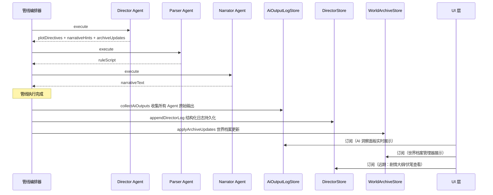

# Phase C：UI 与 AI 洞察系统设计方案

> **文档状态**：待确认
> **创建日期**：2026-02-28
> **前置文档**：[world-archive-and-director-ai-design.md](world-archive-and-director-ai-design.md)（Phase A-B）
>
> 本文档覆盖 Phase C 的全部功能设计，包含：
> - 右侧边栏底部 Tab 导航改造
> - AI 输出日志系统（AiOutputLogStore）
> - AI 洞察面板（AiInsightDialog）
> - 世界档案管理器（ArchiveManagerDialog）
> - 演变日志简化 / 移除
> - Store 方法补充

---

## 1. 设计决策摘要

| 决策项                   | 方案                                                |
| ------------------------ | --------------------------------------------------- |
| 右侧边栏布局             | 底部 Tab 导航切换不同视图，取代单一 NPC 列表        |
| AI 输出查看方式          | 侧边栏仅放入口按钮，内容在 Dialog 中查看            |
| AI 输出日志持久化        | 纯内存（会话级），不写入 Yjs                        |
| AI 输出日志范围          | 导演 / 解析 / 叙事 / 总结，所有 AI Agent 的原始输出 |
| 世界档案编辑方式         | 字段级更新方法（已有 + 补充），不引入 JSON Patch    |
| 演变日志（evolutionLog） | 移除 — 审计需求由 AI 输出日志替代                   |
| 实体类别扩展             | Phase C 不新增                                      |

---

## 2. 右侧边栏改造：底部 Tab 导航

### 2.1 改造动机

当前 [`RightSidebar`](../src/components/GameHUD/RightSidebar.tsx) 只包含 NPC 列表，功能单一。随着世界档案管理、AI 洞察等运行时功能的加入，需要一种扩展性好的入口安排方式。

### 2.2 布局设计

```
改造后的右侧边栏：

┌─────────────────────────┐
│                          │
│     Tab 内容区域          │
│     (根据选中 Tab 切换)   │
│                          │
│                          │
│                          │
│                          │
│                          │
├──────────────────────────┤
│  🎭 场景  │  🔧 工具箱   │ ← 底部 Tab 导航栏
└──────────────────────────┘
```

### 2.3 Tab 定义

| Tab     | 图标     | 标签   | 内容                                   |
| ------- | -------- | ------ | -------------------------------------- |
| scene   | `Users`  | 场景   | NPC 列表（当前 `RightSidebar` 的内容） |
| toolbox | `Wrench` | 工具箱 | 运行时功能入口按钮列表                 |

### 2.4 "场景" Tab 内容

保持现有 NPC 列表不变。未来可增加：点击某个 NPC 卡片后弹出其 NarrativeEntity 档案卡片（快速查看 essence + currentState）。

### 2.5 "工具箱" Tab 内容

工具箱 Tab 内容为一组**入口按钮**，每个按钮点击后打开对应的全屏 Dialog。侧边栏内不显示任何详细内容。

```
工具箱 Tab 内容：

┌─────────────────────────┐
│  📊 AI 洞察              │ → 点击打开 AiInsightDialog
│  查看各 AI 的返回内容     │
├─────────────────────────┤
│  📋 世界档案              │ → 点击打开 ArchiveManagerDialog
│  管理叙事实体             │
├─────────────────────────┤
│  (未来可扩展)             │
│  · 剧情大纲查看器         │
│  · 伏笔库管理器           │
│  · 性能/Token 统计        │
│  · ...                   │
└─────────────────────────┘
```

每个入口按钮的组件结构：

```tsx
interface ToolboxEntry {
  id: string;
  icon: LucideIcon;
  label: string;
  description: string;
  onClick: () => void;
  /** 角标，如 "3 条新日志" */
  badge?: number;
}
```

### 2.6 组件结构

```
src/components/GameHUD/
├── index.tsx                    # GameHUD（不变）
├── LeftSidebar.tsx              # 左侧边栏（不变）
├── RightSidebar.tsx             # 🔄 改造：加入 Tab 导航
├── RightSidebarSceneTab.tsx     # 🆕 场景 Tab（提取自原 RightSidebar）
├── RightSidebarToolboxTab.tsx   # 🆕 工具箱 Tab（入口按钮列表）
├── ToolboxEntryButton.tsx       # 🆕 工具箱入口按钮组件
├── SidebarDrawer.tsx            # 移动端 Drawer（不变）
├── HubReturnButton.tsx          # 返回 Hub 按钮（不变）
└── OperationLogPanel.tsx        # 操作日志面板（不变）
```

### 2.7 RightSidebar 改造伪代码

```tsx
type RightSidebarTab = "scene" | "toolbox";

export function RightSidebar() {
  const [activeTab, setActiveTab] = useState<RightSidebarTab>("scene");
  const [aiInsightOpen, setAiInsightOpen] = useState(false);
  const [archiveManagerOpen, setArchiveManagerOpen] = useState(false);

  return (
    <aside className="flex flex-col h-full">
      {/* 内容区域 — flex-1 占满剩余空间 */}
      <div className="flex-1 overflow-y-auto">
        {activeTab === "scene" && <RightSidebarSceneTab />}
        {activeTab === "toolbox" && (
          <RightSidebarToolboxTab
            onOpenAiInsight={() => setAiInsightOpen(true)}
            onOpenArchiveManager={() => setArchiveManagerOpen(true)}
          />
        )}
      </div>

      {/* 底部 Tab 导航栏 — 固定在底部 */}
      <nav className="shrink-0 flex border-t ...">
        <TabButton
          active={activeTab === "scene"}
          icon={Users}
          label="场景"
          onClick={() => setActiveTab("scene")}
        />
        <TabButton
          active={activeTab === "toolbox"}
          icon={Wrench}
          label="工具箱"
          onClick={() => setActiveTab("toolbox")}
        />
      </nav>

      {/* Dialog 层 */}
      <AiInsightDialog open={aiInsightOpen} onClose={() => setAiInsightOpen(false)} />
      <ArchiveManagerDialog open={archiveManagerOpen} onClose={() => setArchiveManagerOpen(false)} />
    </aside>
  );
}
```

---

## 3. AI 输出日志系统

### 3.1 设计动机

当前各 AI Agent 的原始输出只能通过浏览器控制台查看（如 `console.info("[IRNR Pipeline] Parser AI 返回内容:", ...)`）。这对玩家/开发者极不友好，尤其是：

- 需要对比导演指导和 Parser 实际生成的 RuleScript 是否一致
- 需要检查叙事 AI 是否遵循了导演的 narrativeHints
- 需要根据 AI 输出调整预设 prompt

### 3.2 数据结构

```typescript
/**
 * AI 输出日志条目
 *
 * 记录单个 Agent 在某一轮的原始输出。
 * 纯内存存储，不持久化到 Yjs。
 */
interface AiOutputEntry {
  /** 唯一 ID */
  id: string;
  /** 回合号 */
  turn: number;
  /** AI 来源 */
  source: AiOutputSource;
  /** AI 原始输出（完整文本） */
  rawOutput: string;
  /** 耗时（ms） */
  duration?: number;
  /** 是否成功 */
  success: boolean;
  /** 错误信息（失败时） */
  error?: string;
  /** 时间戳 */
  timestamp: number;
}

type AiOutputSource = "director" | "parser" | "narrator" | "summarizer";
```

### 3.3 AiOutputLogStore

```typescript
interface AiOutputLogState {
  /** 所有日志条目（按时间正序） */
  entries: AiOutputEntry[];

  /** 追加日志 */
  appendEntry(entry: Omit<AiOutputEntry, "id">): void;

  /** 清空日志 */
  clear(): void;
}

const AI_OUTPUT_LOG_LIMIT = 200; // 保留最近 200 条
```

### 3.4 数据采集：管线回调注入

不修改各 Agent 的 `execute()` 实现。通过在管线调用层（`runChatPipeline` 或类似的入口函数）包装 Agent 执行来收集输出。

**采集方式**：利用黑板的 `_trace` 机制 + 各 Agent 已有的输出字段：

```typescript
// 管线执行完成后，从黑板提取各 Agent 的输出
function collectAiOutputs(bb: PipelineBlackboard, turnNumber: number): void {
  const store = useAiOutputLogStore.getState();
  const trace = bb._trace;

  for (const entry of trace) {
    // 只收集 AI 调用类型的 Agent
    if (entry.agentId === "director" && entry.success) {
      store.appendEntry({
        turn: turnNumber,
        source: "director",
        rawOutput: bb.plotDirectives
          ? `<plot_directives>\n${bb.plotDirectives}\n</plot_directives>\n\n<narrative_hints>\n${bb.narrativeHints ?? ""}\n</narrative_hints>`
          : "",
        duration: entry.completedAt - entry.startedAt,
        success: true,
        timestamp: Date.now(),
      });
    }

    if (entry.agentId === "parser" && entry.success) {
      store.appendEntry({
        turn: turnNumber,
        source: "parser",
        rawOutput: JSON.stringify(bb.ruleScript, null, 2),
        duration: entry.completedAt - entry.startedAt,
        success: true,
        timestamp: Date.now(),
      });
    }

    // narrator, summarizer 类似...
  }
}
```

**更优方案**：在各 Agent 执行时，将原始 AI 响应文本写入黑板的新字段：

```typescript
interface PipelineBlackboard {
  // ... 现有字段 ...

  /** 各 Agent 的原始 AI 响应（用于 AI 洞察面板） */
  _agentRawOutputs?: Record<string, string>;
}

// 在 Agent execute 内：
parserResponse = text;
bb._agentRawOutputs ??= {};
bb._agentRawOutputs["parser"] = parserResponse;
```

这样管线结束后可以直接从 `bb._agentRawOutputs` 提取各 Agent 的完整原始输出。

### 3.5 与现有 DirectorLogEntry 的关系

|      | DirectorLogEntry                                         | AiOutputEntry                     |
| ---- | -------------------------------------------------------- | --------------------------------- |
| 存储 | 持久化（Yjs）                                            | 纯内存（会话级）                  |
| 内容 | 导演 AI 的结构化输出（plotDirectives, hints, summaries） | 所有 AI 的原始文本输出            |
| 用途 | 导演 AI 历史决策记录，供导演 AI 自身回顾                 | 开发者/玩家调试，查看 AI 原始返回 |
| 保留 | ✅ 保留不动                                               | 🆕 新增                            |

**两者共存**：`DirectorLogEntry` 继续持久化（导演 AI 可能需要回顾之前的决策），`AiOutputLogStore` 作为会话级调试工具独立存在。

### 3.6 模块归属

```
src/modules/game/
├── ai-output-log/
│   ├── store.ts          # AiOutputLogStore
│   └── types.ts          # AiOutputEntry, AiOutputSource
```

或者作为独立模块：

```
src/stores/
├── ai-output-log.ts      # 纯 UI 状态，不属于业务模块
```

推荐放在 `src/stores/` —— 这是一个全局配置/UI 状态 Store（类似主题设置），不属于任何业务模块，业务组件只读访问即可。

---

## 4. AI 洞察面板（AiInsightDialog）

### 4.1 入口

- **主入口**：右侧边栏 → 工具箱 Tab → "AI 洞察" 按钮
- **移动端**：右侧 Drawer → 工具箱 Tab → 同样的按钮

### 4.2 Dialog 布局

```
┌───────────────────────────────────────────────────┐
│  AI 洞察                                     [×]  │
├──────┬──────┬──────┬──────┬───────────────────────┤
│ 全部  │ 导演  │ 解析  │ 叙事  │ 总结               │  ← 筛选 Tab
├──────┴──────┴──────┴──────┴───────────────────────┤
│                                                   │
│  ┌───────────────────────────────────────────────┐│
│  │ 回合 #12  ·  导演 AI  ·  1.2s  ·  ✅         ││
│  │ ─────────────────────────────────────────── ──││
│  │ <plot_directives>                             ││
│  │ 1. 守卫验证通行证时发现伪造痕迹...             ││
│  │ </plot_directives>                            ││
│  │                                               ││
│  │ <narrative_hints>                             ││
│  │ - 氛围：紧张但不绝望...                        ││
│  │ </narrative_hints>                            ││
│  └───────────────────────────────────────────────┘│
│                                                   │
│  ┌───────────────────────────────────────────────┐│
│  │ 回合 #12  ·  解析 AI  ·  0.8s  ·  ✅         ││
│  │ ─────────────────────────────────────────── ──││
│  │ { "version": 2, "actions": [...] }            ││
│  └───────────────────────────────────────────────┘│
│                                                   │
│  ┌───────────────────────────────────────────────┐│
│  │ 回合 #11  ·  导演 AI  ·  1.5s  ·  ✅         ││
│  │ (折叠) ▶ 点击展开查看完整输出                  ││
│  └───────────────────────────────────────────────┘│
│                                                   │
│                                                   │
│  ┌───────────────────────────────────────────────┐│
│  │          [清空日志]                            ││
│  └───────────────────────────────────────────────┘│
└───────────────────────────────────────────────────┘
```

### 4.3 交互设计

- 顶部筛选 Tab：全部 / 导演 / 解析 / 叙事 / 总结
- 日志条目按回合分组，同一回合内按执行顺序排列
- **最新回合的条目默认展开**，历史回合默认折叠（点击展开）
- 每条日志显示：回合号、AI 来源标签（带颜色区分）、耗时、成功/失败状态
- 日志内容区域用等宽字体渲染，XML 标签和 JSON 做简单的语法着色
- 失败条目用红色边框高亮，展示错误信息
- 底部有"清空日志"按钮

### 4.4 AI 来源颜色标签

| Source     | 颜色语义           | 标签文本 |
| ---------- | ------------------ | -------- |
| director   | accent（橙/黄）    | 导演 AI  |
| parser     | info（蓝）         | 解析 AI  |
| narrator   | success（绿）      | 叙事 AI  |
| summarizer | secondary（紫/灰） | 总结 AI  |

### 4.5 组件结构

```
src/components/AiInsight/
├── AiInsightDialog.tsx         # Dialog 容器 + Tab 筛选
├── AiOutputCard.tsx            # 单条日志卡片（可折叠）
├── AiOutputContent.tsx         # 日志内容渲染（等宽字体 + 简单语法着色）
└── index.ts                    # 导出
```

---

## 5. 世界档案管理器（ArchiveManagerDialog）

### 5.1 入口

- **主入口**：右侧边栏 → 工具箱 Tab → "世界档案" 按钮
- **Game Hub 入口**：Hub 界面增加"世界档案"功能图标
- **NPC 快捷入口**（远期）：场景 Tab 中点击 NPC 卡片，跳转到档案管理器并选中该实体

### 5.2 Dialog 布局

采用类似 LorebookWorkspace 的双面板布局：

```
┌────────────────────────────────────────────────────────────┐
│  世界档案                                           [×]    │
├────────────┬───────────────────────────────────────────────┤
│ 实体列表    │  实体详情                                     │
│            │                                               │
│ [🔍 搜索]  │  名称: リナ                                    │
│ [筛选: 全部]│  类别: character        状态: 🟢 active        │
│            │                                               │
│ ── active ─│  ─── 本质 essence ───                         │
│ • リナ     │  ┌─────────────────────────────────────────┐  │
│ • 守卫     │  │ 冒险者公会受付嬢。性格温柔但内心坚强。    │  │
│            │  │ 有一个生病的弟弟，是她工作的核心动力。    │  │
│ ── nearby ─│  │ 佩戴弟弟送的银色挂坠。                   │  │
│ • 公会长   │  └─────────────────────────────────────────┘  │
│            │                                               │
│ ── dormant │  ─── 当前状态 currentState ───                │
│ • 药草商人  │  ┌─────────────────────────────────────────┐  │
│            │  │ 弟弟病情恶化，リナ面容憔悴。              │  │
│ ── event ──│  │ 正焦急等待玩家带回稀有药材。             │  │
│ • 北方战事  │  └─────────────────────────────────────────┘  │
│            │                                               │
│            │  ─── 关系 ───                                 │
│ [+ 新建]   │  弟弟 (family) · 公会长 (superior)            │
│            │  [+ 添加关系]                                 │
│            │                                               │
│            │  ─── 标签 ───                                 │
│            │  [npc] [guild] [+]                            │
│            │                                               │
│            │  ─── 元信息 ───                               │
│            │  首次登场: 回合 #3 · 最后活跃: 回合 #12       │
│            │  关联游戏实体: chr_xxxx                        │
└────────────┴───────────────────────────────────────────────┘
```

### 5.3 实体列表面板

- **搜索框**：按名称模糊搜索
- **筛选器**：按 presence 状态（全部 / active / nearby / dormant / resolved）或按 archetype（character / event）
- **分组显示**：按 presence 分组，组标题显示 active / nearby / dormant / resolved
- **实体项**：显示名称 + archetype 图标 + presence 状态指示点
- **底部**："+ 新建实体"按钮（手动创建叙事实体）

### 5.4 实体详情面板

可编辑字段：

| 字段          | 编辑方式         | 对应 Store 方法                                  |
| ------------- | ---------------- | ------------------------------------------------ |
| name          | 文本输入         | `updateEntityName()` 🆕                           |
| essence       | 多行文本         | `updateEssence()` ✅ 已有                         |
| currentState  | 多行文本         | `updateEntityState()` ✅ 已有                     |
| presence      | 下拉选择         | `updateEntityPresence()` ✅ 已有                  |
| relationships | 列表 + 添加/删除 | `addRelationship()` ✅ / `removeRelationship()` 🆕 |
| tags          | 标签输入         | `updateTags()` 🆕                                 |

只读字段：
- archetype（创建后不可更改）
- introducedAtTurn / lastActiveTurn
- gameEntityId
- createdAt / updatedAt

### 5.5 编辑保存策略

**即时保存**（auto-save）：每个字段失焦（blur）时自动保存到 Store + Yjs。不需要"保存"按钮。

理由：
- 与 LorebookWorkspace 的编辑体验一致
- 避免用户忘记保存
- 字段级更新方法天然适合即时保存

### 5.6 组件结构

```
src/components/ArchiveManager/
├── ArchiveManagerDialog.tsx     # Dialog 容器 + 双面板布局
├── ArchiveEntityList.tsx        # 左侧实体列表
├── ArchiveEntityDetail.tsx      # 右侧实体详情编辑
├── ArchiveRelationshipEditor.tsx# 关系编辑子组件
├── ArchiveTagEditor.tsx         # 标签编辑子组件
├── ArchiveCreateDialog.tsx      # 新建实体的小对话框
└── index.ts                     # 导出
```

### 5.7 Game Hub 入口

在 Hub 界面新增一个功能图标。考虑到现有位置的分布：

```
当前 Hub 布局：
  TL: 提示词    TR: 世界书
  ML: 记忆      MR: 联机
  BL: 返回标题  BR: 设置
  BC: 存档 + 检查点

方案：在底部中央区域新增 "世界档案" 图标

改造后：
  BC: 存档 + 检查点 + 世界档案
```

```tsx
// GameHub 新增 prop
interface GameHubProps {
  // ... 现有 props ...
  onWorldArchive: () => void;  // 🆕
}

// 底部中央区域新增
<HubFeatureIcon
  position="inline"
  icon={Archive}  // lucide-react 的 Archive 图标
  label="世界档案"
  sublabel="ARCHIVE"
  onClick={onWorldArchive}
/>
```

---

## 6. 演变日志处理

### 6.1 决策：移除 evolutionLog

从 `NarrativeEntity` 中移除 `evolutionLog` 字段。

**理由**：
1. 审计/调试需求由 AI 洞察面板完全替代——查看导演 AI 原始输出远比看压缩后的 log 有价值
2. 导演 AI 不需要逐条回顾历史——它通过 `currentState`（当前状态快照）和分段记忆（事件时序）已能做出连贯决策
3. 回溯需求由存档 checkpoint 承担
4. 移除后可省去"日志裁剪/压缩"的复杂逻辑

### 6.2 变更清单

| 文件                                         | 变更                                                                                                                 |
| -------------------------------------------- | -------------------------------------------------------------------------------------------------------------------- |
| `src/modules/world-archive/types.ts`         | 移除 `EvolutionEntry` 接口，移除 `NarrativeEntity.evolutionLog` 字段，移除 `ArchiveUpdate` 中的 `log_evolution` 类型 |
| `src/modules/world-archive/store.ts`         | 移除 `appendEvolutionEntry()` 方法，移除 `applyArchiveUpdates` 中 `log_evolution` case                               |
| `src/modules/director/director-agent.ts`     | 移除 evolutionLog 相关的解析和写入逻辑                                                                               |
| `src/modules/director/output-parser.ts`      | 移除 evolutionLog 解析                                                                                               |
| `src/modules/world-archive/auto-register.ts` | 移除 NPC 创建时的初始 evolutionLog                                                                                   |

---

## 7. Store 方法补充

### 7.1 WorldArchiveStore 新增方法

```typescript
interface WorldArchiveStore {
  // ── 已有方法（保留不变） ──
  getEntity(id: string): NarrativeEntity | undefined;
  getEntitiesByArchetype(archetype: EntityArchetype): NarrativeEntity[];
  getEntitiesByPresence(presence: EntityPresence): NarrativeEntity[];
  getEntityByGameId(gameEntityId: string): NarrativeEntity | undefined;
  createEntity(...): NarrativeEntity;
  updateEntityState(id: string, newState: string): void;
  updateEntityPresence(id: string, newPresence: EntityPresence): void;
  updateEssence(id: string, newEssence: string): void;
  addRelationship(id: string, relationship: EntityRelationship): void;
  removeEntity(id: string): void;
  applyArchiveUpdates(updates: ArchiveUpdate[], currentTurn: number): void;

  // ── 🆕 新增方法 ──
  /** 更新实体名称 */
  updateEntityName(id: string, newName: string): void;
  /** 替换实体的全部标签 */
  updateTags(id: string, newTags: string[]): void;
  /** 移除指定关系 */
  removeRelationship(id: string, targetEntityId: string): void;
  /** 更新指定关系 */
  updateRelationship(
    id: string,
    targetEntityId: string,
    updates: Partial<EntityRelationship>,
  ): void;
}
```

### 7.2 NarrativeEntity 类型简化

移除 `evolutionLog` 后的最终类型：

```typescript
interface NarrativeEntity {
  id: string;
  archetype: EntityArchetype;
  name: string;
  essence: string;
  currentState: string;
  presence: EntityPresence;
  introducedAtTurn: number;
  lastActiveTurn: number;
  gameEntityId?: string;
  relationships: EntityRelationship[];
  tags: string[];
  // evolutionLog: EvolutionEntry[];  ← 移除
  createdAt: number;
  updatedAt: number;
}
```

---

## 8. 分阶段实施（Phase C 任务清单）

### C-1：基础设施

- [ ] 移除 `evolutionLog` 相关类型和逻辑（types / store / agent / parser）
- [ ] 新增 `AiOutputLogStore`（`src/stores/ai-output-log.ts`）
- [ ] 管线执行后采集各 Agent 原始输出到 `AiOutputLogStore`
- [ ] 补充 WorldArchiveStore 方法：`updateEntityName` / `updateTags` / `removeRelationship` / `updateRelationship`

### C-2：右侧边栏改造

- [ ] 提取 `RightSidebarSceneTab`（原 NPC 列表内容）
- [ ] 创建 `RightSidebarToolboxTab`（入口按钮列表）
- [ ] 创建 `ToolboxEntryButton` 组件
- [ ] 改造 `RightSidebar`：加入底部 Tab 导航 + 内容切换
- [ ] 移动端 Drawer 内同步生效

### C-3：AI 洞察面板

- [ ] `AiInsightDialog` 组件（Dialog 容器 + Tab 筛选）
- [ ] `AiOutputCard` 组件（单条日志卡片，可折叠）
- [ ] `AiOutputContent` 组件（内容渲染，等宽字体 + 简单语法着色）
- [ ] 接入 `AiOutputLogStore` 数据
- [ ] 工具箱 Tab 内的入口按钮连线

### C-4：世界档案管理器

- [ ] `ArchiveManagerDialog` 组件（Dialog 容器 + 双面板布局）
- [ ] `ArchiveEntityList` 组件（左侧列表，搜索/筛选/分组）
- [ ] `ArchiveEntityDetail` 组件（右侧详情编辑）
- [ ] `ArchiveRelationshipEditor` / `ArchiveTagEditor` 子组件
- [ ] `ArchiveCreateDialog` 组件（手动新建实体）
- [ ] 即时保存逻辑（blur → Store → Yjs）
- [ ] 工具箱 Tab 内的入口按钮连线
- [ ] Game Hub 新增"世界档案"入口图标

---

## 9. 数据流概览



---

## 10. 风险与约束

| 风险                            | 缓解                                                           |
| ------------------------------- | -------------------------------------------------------------- |
| 侧边栏底部 Tab 在移动端空间不足 | Tab 标签使用图标+短文本，高度固定 40-44px                      |
| AI 原始输出文本过长             | 日志卡片默认折叠，只显示前 3 行预览                            |
| AiOutputLogStore 内存增长       | 限制 200 条，超出时淘汰最早的                                  |
| 移除 evolutionLog 后的数据迁移  | Yjs 中已有 evolutionLog 的数据——反序列化时忽略即可，不需要迁移 |
| 即时保存时的频繁 Yjs 写入       | 对多行文本使用 debounce（300ms），下拉/标签等离散操作立即保存  |
