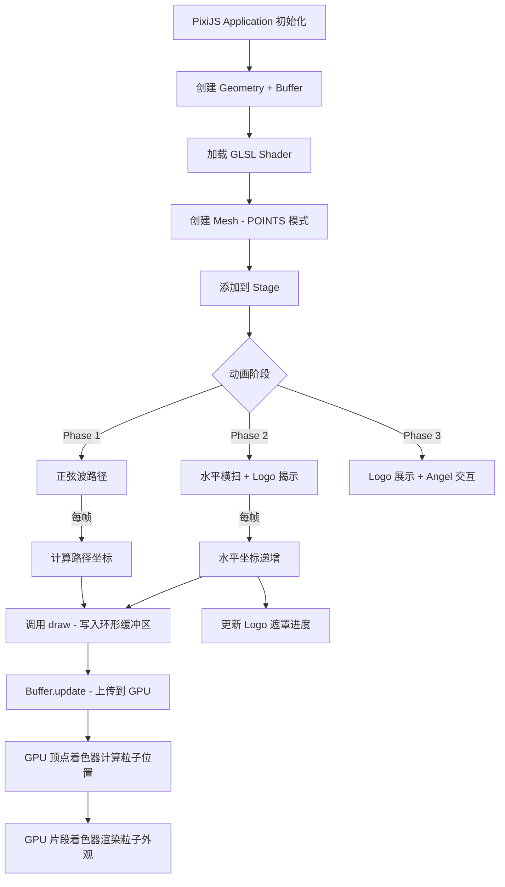

# PixiJS Mesh + 自定义 Shader 实现 GPU 粒子系统

## 一、原版 Shooting Star 的工作原理

### 1.1 核心架构

原版使用 Three.js 的 GPU 粒子系统，核心组件：

```
Three.js 版本：
  BufferGeometry   → 存储 32 万个粒子的顶点数据
  RawShaderMaterial → 自定义 GLSL 着色器
  Points           → 以 gl.POINTS 模式渲染（点精灵）
  AdditiveBlending → 叠加混合产生发光效果
```

### 1.2 粒子数据结构

每个粒子有 4 个属性（attribute），全部存储在 GPU Buffer 中：

| Attribute  | 类型  | 说明                                              |
| ---------- | ----- | ------------------------------------------------- |
| `position` | vec3  | 随机种子：x,y 用于极坐标扩散方向，z 用于深度/速度 |
| `mouse`    | vec4  | 出生点：x,y 是屏幕坐标，z 是时间戳，w 是移动速度  |
| `aFront`   | vec2  | 拖尾方向：移动方向的单位向量                      |
| `random`   | float | 随机值：影响粒子扩散速度和闪烁                    |

### 1.3 关键参数

```
PER_MOUSE = 800     // 每次鼠标移动产生 800 个粒子
COUNT = 320,000     // 总粒子数 (800 × 400)
```

每次 `draw()` 调用：
1. 在环形缓冲区中写入 800 个粒子的 `mouse` 和 `aFront` 数据
2. GPU 在顶点着色器中根据 `timestamp - mouse.z` 计算每个粒子的进度
3. 粒子从出生点向外扩散，然后淡出

### 1.4 顶点着色器核心逻辑

```glsl
// 计算粒子进度（0 → 1）
float progress = clamp((timestamp - mouse.z) * speed, 0., 1.);

// 起始位置 = 鼠标位置
vec3 startPosition = vec3(mouse.x - halfWidth, mouse.y - halfHeight, random);

// 终止位置 = 起始位置 + 径向扩散 + 反向拖尾
vec3 endPosition = startPosition;
endPosition.xy += radialSpread;     // 径向扩散（极坐标转笛卡尔）
endPosition.xy -= aFront * far;      // 沿移动方向的反向拖尾
endPosition.z += depthSpread;        // Z 轴深度扩散

// 插值得到当前位置
vec3 currentPosition = mix(startPosition, endPosition, cubicOut(progress));

// 点大小 = 深度 × 大小 × 速度系数
gl_PointSize = max(currentPosition.z * size * diff, minSize);
```

### 1.5 片段着色器核心逻辑

```glsl
// 圆形粒子形状
float shape = smoothstep(..., 1.0 / length(pointCoord));

// 随时间闪烁
float flicker = random(vProgress * flashingSpeed);

// 随时间淡出
float alpha = (1.0 - progress * fadeSpeed) * flicker * movementSpeed;

gl_FragColor = vec4(baseColor * darkness * flicker, shape * alpha);
```

### 1.6 动画编排

```
Phase 1: 正弦波（1080ms）
  x = cos(progress × 3π) × amplitude
  y = progress × height × 1.3
  → 粒子从上到下画出正弦曲线

Phase 2: 水平横扫（1080ms）
  x = -halfWidth → +halfWidth
  y = 0（屏幕中央）
  → 粒子水平扫过，同时用对角线遮罩揭示文字
```

---

## 二、PixiJS v7 的对应 API

### 2.1 核心映射

| Three.js                 | PixiJS v7                               | 说明               |
| ------------------------ | --------------------------------------- | ------------------ |
| `BufferGeometry`         | `Geometry`                              | 自定义顶点属性容器 |
| `Float32BufferAttribute` | `Buffer` + `geometry.addAttribute()`    | 顶点数据缓冲       |
| `RawShaderMaterial`      | `Shader.from(vert, frag, uniforms)`     | 自定义着色器       |
| `Points`                 | `Mesh` + `drawMode = DRAW_MODES.POINTS` | 点精灵渲染模式     |
| `AdditiveBlending`       | `mesh.blendMode = BLEND_MODES.ADD`      | 叠加混合           |

### 2.2 关键发现：PixiJS 支持 POINTS 绘制模式

PixiJS v7 的 `Mesh` 类支持自定义绘制模式，包括 `DRAW_MODES.POINTS`：

```typescript
import { Mesh, Geometry, Shader, Buffer, DRAW_MODES, BLEND_MODES } from 'pixi.js';

// 创建几何体
const geometry = new Geometry();

// 添加自定义属性
geometry.addAttribute('aPosition', new Buffer(positionData, false), 3);  // vec3
geometry.addAttribute('aMouse', new Buffer(mouseData, false), 4);        // vec4
geometry.addAttribute('aFront', new Buffer(frontData, false), 2);        // vec2
geometry.addAttribute('aRandom', new Buffer(randomData, false), 1);      // float

// 创建着色器
const shader = Shader.from(vertexShader, fragmentShader, {
  uTimestamp: 0,
  uResolution: [width, height],
  uPixelRatio: devicePixelRatio,
  uSize: 0.05,
  uSpeed: 0.012,
  // ... 其他 uniforms
});

// 创建 Mesh 并设置为 POINTS 模式
const mesh = new Mesh(geometry, shader as any);
mesh.drawMode = DRAW_MODES.POINTS;
mesh.blendMode = BLEND_MODES.ADD;
```

### 2.3 着色器差异

PixiJS v7 和 Three.js 的 GLSL 着色器有以下差异：

#### 顶点着色器

```glsl
// Three.js 版本
uniform mat4 modelViewMatrix;
uniform mat4 projectionMatrix;
attribute vec3 position;
// ...
gl_Position = projectionMatrix * modelViewMatrix * vec4(pos, 1.0);

// PixiJS v7 版本
uniform mat3 uTransformMatrix;    // 注意：PixiJS 2D 用 mat3
uniform mat3 uProjectionMatrix;
attribute vec3 aPosition;          // PixiJS 习惯用 a 前缀
// ...
// PixiJS 是 2D 引擎，投影矩阵是 mat3
// 但对于自定义 Shader.from()，我们可以完全跳过 PixiJS 的矩阵系统
// 直接用自己的投影逻辑
vec2 screenPos = currentPosition.xy / uResolution * 2.0 - 1.0;
screenPos.y *= -1.0;  // PixiJS Y 轴翻转
gl_Position = vec4(screenPos, 0.0, 1.0);
```

#### 片段着色器

```glsl
// 基本相同！两者都是 WebGL1 GLSL 100
// 唯一区别：PixiJS 中不需要 precision 声明（已默认）
```

### 2.4 数据更新

与 Three.js 版本完全一样的环形缓冲区模式：

```typescript
class ShootingStarRenderer {
  private mouseData: Float32Array;
  private frontData: Float32Array;
  private mouseBuffer: Buffer;
  private frontBuffer: Buffer;
  private mouseIndex = 0;

  draw(clientX: number, clientY: number) {
    const x = clientX + halfWidth;
    const y = height - (clientY + halfHeight);
    const newPos = { x, y };
    const diff = this.oldPos ? { x: newPos.x - this.oldPos.x, y: newPos.y - this.oldPos.y } : { x: 0, y: 0 };
    const length = Math.sqrt(diff.x * diff.x + diff.y * diff.y);
    const front = length > 0 ? { x: diff.x / length, y: diff.y / length } : { x: 0, y: 0 };

    for (let i = 0; i < PER_MOUSE; i++) {
      const ci = (this.mouseIndex % (COUNT * 4)) + i * 4;
      const t = i / PER_MOUSE;
      const pos = this.oldPos
        ? { x: this.oldPos.x + diff.x * t, y: this.oldPos.y + diff.y * t }
        : newPos;

      this.mouseData[ci]     = pos.x;
      this.mouseData[ci + 1] = pos.y;
      this.mouseData[ci + 2] = this.timestamp;
      this.mouseData[ci + 3] = length;

      this.frontData[ci]     = front.x;
      this.frontData[ci + 1] = front.y;
    }

    this.oldPos = newPos;

    // 更新 GPU Buffer
    this.mouseBuffer.update(this.mouseData);
    this.frontBuffer.update(this.frontData);

    this.mouseIndex += 4 * PER_MOUSE;
  }
}
```

---

## 三、与现有项目的集成方式

### 3.1 文件结构

```
src/components/SplashScreen/
├── index.tsx                    # React 组件（状态机 + 阶段切换）
├── renderers/
│   ├── ShootingStarRenderer.ts  # GPU 粒子系统（Mesh + Shader）
│   ├── LogoRevealRenderer.ts    # Logo SVG 揭示遮罩
│   └── AngelInteraction.ts      # Angel 风格的点击交互（Canvas 2D）
├── shaders/
│   ├── particle.vert.glsl       # 粒子顶点着色器
│   └── particle.frag.glsl       # 粒子片段着色器
└── AnimationOrchestrator.ts     # 动画编排器（正弦波 → 横扫）
```

### 3.2 PixiJS 导出扩展

需要在 `src/lib/pixi/index.ts` 中新增导出：

```typescript
export {
  Application,
  Container,
  Graphics,
  Mesh,            // 新增
  Geometry,        // 新增
  Shader,          // 新增
  Buffer,          // 新增
  DRAW_MODES,      // 新增
  BLEND_MODES,     // 新增
  Point,
  Sprite,
  Text,
  TextStyle,
  Texture,
} from 'pixi.js';
```

### 3.3 Shader 文件导入

使用 Vite 的 `?raw` 后缀直接导入 GLSL 文件：

```typescript
import vertexShader from './shaders/particle.vert.glsl?raw';
import fragmentShader from './shaders/particle.frag.glsl?raw';
```

### 3.4 与 AngryNoiseFilter 的对比

| 方面     | AngryNoiseFilter       | ShootingStarRenderer              |
| -------- | ---------------------- | --------------------------------- |
| 基类     | `Filter`（后处理滤镜） | `Mesh` + `Shader`（自定义几何体） |
| 着色器   | 仅片段着色器           | 顶点 + 片段着色器                 |
| 输入     | 采样现有纹理           | 自定义顶点属性                    |
| 渲染方式 | 全屏四边形后处理       | `gl.POINTS` 点精灵                |
| 数据更新 | uniform 参数           | Buffer 数据 + uniform 参数        |

AngryNoiseFilter 证明了项目中**自定义片段着色器**可行。ShootingStarRenderer 更进一步，使用了**自定义顶点着色器 + 自定义几何体**，但底层 WebGL 机制是相同的。

---

## 四、完整的 PixiJS 版粒子着色器（草案）

### 4.1 顶点着色器 `particle.vert.glsl`

```glsl
precision highp float;

// PixiJS 自定义属性
attribute vec3 aPosition;    // 随机种子 (x: 极角, y: 径向距离, z: 深度)
attribute vec4 aMouse;       // 出生点 (x, y, 时间戳, 移动速度)
attribute vec2 aFront;       // 移动方向
attribute float aRandom;     // 随机值

// Uniforms
uniform vec2 uResolution;
uniform float uPixelRatio;
uniform float uTimestamp;
uniform float uSize;
uniform float uMinSize;
uniform float uSpeed;
uniform float uFar;
uniform float uSpread;
uniform float uMaxSpread;
uniform float uMaxZ;
uniform float uMaxDiff;
uniform float uDiffPow;

// Varyings（传给片段着色器）
varying float vProgress;
varying float vRandom;
varying float vDiff;
varying float vSpreadLength;
varying float vPositionZ;

float cubicOut(float t) {
  float f = t - 1.0;
  return f * f * f + 1.0;
}

const float PI = 3.1415926;
const float PI2 = PI * 2.0;

void main() {
  // 计算粒子进度
  float progress = clamp((uTimestamp - aMouse.z) * uSpeed, 0.0, 1.0);
  progress *= step(0.0, aMouse.x);  // 未初始化的粒子不显示

  // 起始位置（屏幕坐标，原点在左下角）
  float startX = aMouse.x - uResolution.x / 2.0;
  float startY = aMouse.y - uResolution.y / 2.0;
  vec3 startPosition = vec3(startX, startY, aRandom);

  // 移动速度影响扩散范围
  float diff = clamp(aMouse.w / uMaxDiff, 0.0, 1.0);
  diff = pow(diff, uDiffPow);

  // 将随机种子转为扩散方向
  vec3 cPosition = aPosition * 2.0 - 1.0;
  float radian = cPosition.x * PI2 - PI;
  vec2 xySpread = vec2(cos(radian), sin(radian)) * uSpread * mix(1.0, uMaxSpread, diff) * cPosition.y;

  // 终止位置 = 起始 + 扩散 + 反向拖尾
  vec3 endPosition = startPosition;
  endPosition.xy += xySpread;
  endPosition.xy -= aFront * uFar * aRandom;
  endPosition.z += cPosition.z * uMaxZ * (uPixelRatio > 1.0 ? 1.2 : 1.0);

  // 插值当前位置
  float positionProgress = cubicOut(progress * aRandom);
  vec3 currentPosition = mix(startPosition, endPosition, positionProgress);

  // 传递给片段着色器
  vProgress = progress;
  vRandom = aRandom;
  vDiff = diff;
  vSpreadLength = cPosition.y;
  vPositionZ = aPosition.z;

  // 直接转换为 NDC 坐标（绕过 PixiJS 矩阵系统）
  vec2 ndc = currentPosition.xy / (uResolution / 2.0);
  gl_Position = vec4(ndc, 0.0, 1.0);

  // 点大小
  gl_PointSize = max(
    currentPosition.z * uSize * diff * uPixelRatio,
    uMinSize * (uPixelRatio > 1.0 ? 1.3 : 1.0)
  );
}
```

### 4.2 片段着色器 `particle.frag.glsl`

```glsl
precision highp float;

uniform float uFadeSpeed;
uniform float uShortRangeFadeSpeed;
uniform float uMinFlashingSpeed;
uniform float uBlur;

varying float vProgress;
varying float vRandom;
varying float vDiff;
varying float vSpreadLength;
varying float vPositionZ;

float random(vec2 co) {
  float dt = dot(co, vec2(12.9898, 78.233));
  float sn = mod(dt, 3.14);
  return fract(sin(sn) * 43758.5453);
}

float quadraticIn(float t) { return t * t; }
float sineOut(float t) { return sin(t * 1.5707963); }

// 主题色：青色/蓝色渐变
const vec3 baseColor = vec3(0.0, 0.9, 0.8);  // 青色 #00E5CC

void main() {
  vec2 p = gl_PointCoord * 2.0 - 1.0;
  float len = length(p);

  // 随机闪烁
  float cRandom = random(vec2(vProgress * mix(uMinFlashingSpeed, 1.0, vRandom)));
  cRandom = mix(0.3, 2.0, cRandom);

  // 圆形粒子 + 模糊边缘
  float cBlur = uBlur * mix(1.0, 0.3, vPositionZ);
  float shape = smoothstep(1.0 - cBlur, 1.0 + cBlur, (1.0 - cBlur) / len);
  shape *= mix(0.5, 1.0, vRandom);

  if (shape == 0.0) discard;

  // 深度影响亮度
  float darkness = mix(0.1, 1.0, vPositionZ);

  // 淡出
  float alphaProgress = vProgress * uFadeSpeed * mix(2.5, 1.0, pow(vDiff, 0.6));
  alphaProgress *= mix(uShortRangeFadeSpeed, 1.0, sineOut(vSpreadLength) * quadraticIn(vDiff));
  float alpha = 1.0 - min(alphaProgress, 1.0);
  alpha *= cRandom * vDiff;

  gl_FragColor = vec4(baseColor * darkness * cRandom, shape * alpha);
}
```

---

## 五、粒子数量

| 参数      | 值      | 说明                     |
| --------- | ------- | ------------------------ |
| PER_MOUSE | 400     | 每次 draw() 产生的粒子数 |
| COUNT     | 80,000  | 总粒子数（环形缓冲区）   |
| 内存占用  | ~3.2 MB | 4 个 Buffer 合计         |

**所有设备使用统一参数**，不做移动端降级。现代移动端设备性能足够支撑 80,000 个 GPU 粒子。

计算依据：
- 动画帧率 60fps × 持续时间 ~3s = ~180 帧
- 每帧 400 粒子 × 180 帧 = 72,000 粒子
- 取上限 80,000，确保环形缓冲区覆盖完整动画时长

---

## 六、与 Logo 揭示的集成

原版用 Three.js 的 `PlaneBufferGeometry` + `RawShaderMaterial` 渲染文字遮罩。
我们的方案改为 **显示 SVG 图标**，实现方式更简单：

### 方案：PixiJS Sprite + Alpha Mask 遮罩

```typescript
// 加载 SVG 为纹理
const logoTexture = Texture.from('/tsian.svg');
const logoSprite = new Sprite(logoTexture);
logoSprite.anchor.set(0.5);
logoSprite.position.set(width / 2, height / 2);

// 遮罩：用 Graphics 画一个从左到右移动的矩形
const maskGraphics = new Graphics();
logoSprite.mask = maskGraphics;

// 每帧更新遮罩位置（跟随粒子横扫进度）
function updateMask(progress: number) {
  maskGraphics.clear();
  maskGraphics.beginFill(0xffffff);
  // 对角线遮罩（模拟原版的斜切效果）
  maskGraphics.drawPolygon([
    progress - logoWidth, -logoHeight,
    progress, -logoHeight,
    progress - logoWidth * 0.3, logoHeight,
    progress - logoWidth * 1.3, logoHeight,
  ]);
  maskGraphics.endFill();
}
```

这比原版的 Shader 遮罩更简单，效果一样好，而且 SVG 图标在任何分辨率下都清晰。

---

## 七、完整的实现流程图



---

## 八、风险与备选方案

### 风险 1：`DRAW_MODES.POINTS` 兼容性

PixiJS v7 的 `Mesh` 类在文档中主要展示 `TRIANGLES` 模式。`POINTS` 模式虽然底层 WebGL 支持，但 PixiJS 的某些内部假设（如剔除、排序）可能需要额外处理。

**备选方案**：如果 `DRAW_MODES.POINTS` 有问题，可以用 **instanced quads**（实例化四边形）：
- 每个粒子用 4 个顶点的四边形代替 1 个点
- 使用 `geometry.addAttribute('...', buffer, size, false, TYPES.FLOAT, 0, 0, true)` 设置 instanced attribute
- 粒子数量从 8 万降到 2 万（每个粒子开销 ×4）

### 风险 2：PixiJS Shader uniform 命名冲突

PixiJS 内部会注入一些 uniform（如 `uSampler`, `uColor`）。自定义 Shader 的 uniform 名称需要避免冲突。

**解决方案**：使用带前缀的命名，如 `uSSTimestamp`, `uSSSize` 等。

### 风险 3：坐标系统差异

Three.js 使用 3D 透视投影（相机 + 正交投影），PixiJS 是 2D 屏幕坐标。

**解决方案**：在顶点着色器中直接计算 NDC 坐标，绕过 PixiJS 的投影矩阵。已在上方着色器草案中实现。
