# 可自定义正则后处理扩展方案

> 版本：v1.0 | 日期：2026-02-20

---

## 1. 现状与问题分析

### 1.1 现有后处理系统

当前系统有两个独立的后处理函数，分散在不同层：

| 处理器                                                                | 位置   | 职责                               | 阶段                    |
| --------------------------------------------------------------------- | ------ | ---------------------------------- | ----------------------- |
| [`processNarrativeOutput()`](src/lib/memory/post-processor.ts:21)     | lib 层 | 提取并清理 `<memory_summary>` 标签 | AI 完成后、消息持久化前 |
| [`parseGameContent()`](src/modules/chat/utils/parseGameContent.ts:17) | UI 层  | 提取并清理 `<choices>` 标签        | UI 渲染前               |

三条调用链路：

```
单人直连 ─→ chat/commands/handlers.ts:385 ─→ processNarrativeOutput()
IRNR 叙事 ─→ irnr-pipeline.ts:506 ─→ processNarrativeOutput()
联机归档 ─→ room/commands/handlers.ts:2238 ─→ processNarrativeOutput()
```

### 1.2 存在的问题

1. **规则硬编码**：仅支持 `<memory_summary>` 和 `<choices>` 两类固定正则，无法扩展
2. **无统一管道**：三条链路各自调用 `processNarrativeOutput()`，代码重复且行为不一致
3. **联机链路缺陷**：`resolvedAiResponse`（原始 AI 文本）被传入 `convertTurnToMessages()` 写入消息，而 `processNarrativeOutput()` 在消息写入之后执行，仅提取了摘要但未用清理后的文本替换消息内容，导致 `<memory_summary>` 标签泄漏到最终消息
4. **无用户自定义能力**：用户无法添加自己的正则替换规则

---

## 2. 设计目标

1. **用户可自定义正则规则**：创建、编辑、排序、启用/禁用正则替换规则
2. **统一后处理管道**：将分散的后处理逻辑统一为可编排的 pipeline
3. **内置规则不可删除**：`<memory_summary>` 和 `<choices>` 作为内置规则始终存在
4. **与预设系统集成**：后处理规则作为预设的一部分，支持导入导出
5. **修复联机链路**：确保所有链路在消息写入前经过完整的后处理
6. **安全性**：无效正则不应导致系统崩溃

---

## 3. 数据模型

### 3.1 正则规则实体

```typescript
// src/domain/entities/post-process-rule.ts

/**
 * 后处理规则的处理阶段
 *
 * - persist: AI 完成后、消息持久化前执行（清理结构化标签）
 * - render: UI 渲染前执行（提取展示用数据如 choices）
 */
type PostProcessPhase = "persist" | "render";

/**
 * 后处理规则来源
 *
 * - builtin: 内置规则，不可删除/编辑模式和正则
 * - user: 用户自定义规则
 */
type PostProcessRuleSource = "builtin" | "user";

/**
 * 正则匹配后的处理方式
 *
 * - remove: 直接移除匹配内容（replacement 为空字符串）
 * - replace: 用 replacement 替换匹配内容
 * - extract-and-remove: 提取捕获组内容到 metadata，然后从正文移除
 */
type PostProcessAction = "remove" | "replace" | "extract-and-remove";

/**
 * 后处理规则实体
 */
interface PostProcessRule {
  /** 唯一标识符 */
  id: string;

  /** 规则显示名称 */
  name: string;

  /** 规则描述（可选） */
  description?: string;

  /** 正则表达式模式字符串（不含分隔符和 flags） */
  pattern: string;

  /** 正则 flags（如 "gi", "gis"） */
  flags: string;

  /** 替换字符串（支持 $1 等捕获组引用），action 为 remove 时忽略 */
  replacement: string;

  /** 处理方式 */
  action: PostProcessAction;

  /** 提取到 metadata 时的键名（action 为 extract-and-remove 时必填） */
  extractKey?: string;

  /** 处理阶段 */
  phase: PostProcessPhase;

  /** 规则来源 */
  source: PostProcessRuleSource;

  /** 是否启用 */
  enabled: boolean;

  /** 排序权重（数值越小越先执行） */
  order: number;
}
```

### 3.2 内置规则定义

```typescript
// src/lib/post-process/builtin-rules.ts

const BUILTIN_RULES: PostProcessRule[] = [
  {
    id: "builtin:memory-summary",
    name: "Memory Summary 提取",
    description: "提取 <memory_summary> 标签内容到记忆系统，并从正文移除",
    pattern: "<memory_summary>([\\s\\S]*?)</memory_summary>",
    flags: "g",
    replacement: "",
    action: "extract-and-remove",
    extractKey: "miniSummary",
    phase: "persist",
    source: "builtin",
    enabled: true,
    order: 0,
  },
  {
    id: "builtin:choices",
    name: "选项提取",
    description: "提取 <choices> 标签内容用于 UI 选项展示，并从正文移除",
    pattern: "<choices>([\\s\\S]*?)</choices>",
    flags: "g",
    replacement: "",
    action: "extract-and-remove",
    extractKey: "choices",
    phase: "render",
    source: "builtin",
    enabled: true,
    order: 0,
  },
];
```

### 3.3 与预设系统的关系

**方案：嵌入预设**

后处理规则作为 [`Preset`](src/lib/prompt/types.ts:81) 的可选字段存储：

```typescript
// 扩展 Preset 接口
interface Preset {
  // ...现有字段...

  /** 后处理规则列表（可选，未定义时使用内置规则） */
  postProcessRules?: PostProcessRule[];
}
```

**理由**：

- 后处理规则与预设的 prompt 紧密关联（不同的 prompt 可能产生不同的结构化标签）
- 随预设导入/导出，无需额外处理
- 用户切换预设时后处理规则自动切换
- 复用现有 IndexedDB 存储（`lyra-presets` 数据库），无需新建存储

**合并逻辑**：

```
最终规则集 = 内置规则（始终存在） + 预设自定义规则（如果有）
```

内置规则始终生效，用户可以在预设中**覆盖**内置规则的 `enabled` 状态（通过存储同 id 的覆盖配置），但不能删除内置规则。

### 3.4 内置规则覆盖机制

预设中的 `postProcessRules` 可包含与内置规则同 id 的条目，此时只允许覆盖 `enabled` 和 `order` 字段：

```typescript
interface PostProcessRuleOverride {
  id: string; // 必须匹配 builtin 规则 id
  enabled?: boolean;
  order?: number;
}
```

合并算法：

```typescript
function mergeRules(
  builtinRules: PostProcessRule[],
  presetRules?: PostProcessRule[]
): PostProcessRule[] {
  if (!presetRules) return [...builtinRules];

  const overrides = new Map<string, PostProcessRule>();
  const userRules: PostProcessRule[] = [];

  for (const rule of presetRules) {
    if (rule.source === "builtin") {
      overrides.set(rule.id, rule);
    } else {
      userRules.push(rule);
    }
  }

  // 合并内置规则（应用覆盖）
  const merged = builtinRules.map((builtin) => {
    const override = overrides.get(builtin.id);
    if (override) {
      return {
        ...builtin,
        enabled: override.enabled ?? builtin.enabled,
        order: override.order ?? builtin.order,
      };
    }
    return builtin;
  });

  // 追加用户规则
  merged.push(...userRules);

  // 按 order 排序
  return merged.sort((a, b) => a.order - b.order);
}
```

---

## 4. 统一后处理管道架构

### 4.1 Pipeline 设计

```typescript
// src/lib/post-process/pipeline.ts

/**
 * 后处理管道的执行结果
 */
interface PostProcessResult {
  /** 清理后的文本 */
  text: string;

  /** 提取的元数据（key 为 extractKey） */
  extracted: Record<string, string[]>;

  /** 执行过程中的警告信息（如无效正则） */
  warnings: string[];
}

/**
 * 执行后处理管道
 *
 * @param rawText - 原始 AI 输出文本
 * @param rules - 已合并排序的规则列表
 * @param phase - 当前执行阶段
 * @returns 处理结果
 */
function executePostProcessPipeline(
  rawText: string,
  rules: PostProcessRule[],
  phase: PostProcessPhase
): PostProcessResult {
  let text = rawText;
  const extracted: Record<string, string[]> = {};
  const warnings: string[] = [];

  // 只执行当前阶段的已启用规则
  const activeRules = rules
    .filter((r) => r.phase === phase && r.enabled)
    .sort((a, b) => a.order - b.order);

  for (const rule of activeRules) {
    try {
      const regex = new RegExp(rule.pattern, rule.flags);

      switch (rule.action) {
        case "remove":
          text = text.replace(regex, "");
          break;

        case "replace":
          text = text.replace(regex, rule.replacement);
          break;

        case "extract-and-remove": {
          const matches: string[] = [];
          let match: RegExpExecArray | null;
          // 使用新的 RegExp 实例避免 lastIndex 问题
          const extractRegex = new RegExp(rule.pattern, rule.flags);
          while ((match = extractRegex.exec(text)) !== null) {
            // 取第一个捕获组，无捕获组则取整个匹配
            const content = (match[1] ?? match[0]).trim();
            if (content) matches.push(content);
            // 防止零宽匹配无限循环
            if (match[0].length === 0) extractRegex.lastIndex++;
          }
          if (matches.length > 0 && rule.extractKey) {
            extracted[rule.extractKey] = [
              ...(extracted[rule.extractKey] ?? []),
              ...matches,
            ];
          }
          text = text.replace(new RegExp(rule.pattern, rule.flags), "");
          break;
        }
      }
    } catch (error) {
      // 无效正则：记录警告，跳过该规则，不中断管道
      const message =
        error instanceof Error ? error.message : String(error);
      warnings.push(
        `规则 "${rule.name}" (${rule.id}) 执行失败: ${message}`
      );
    }
  }

  return {
    text: text.trim(),
    extracted,
    warnings,
  };
}
```

### 4.2 阶段划分

```mermaid
flowchart TD
    A[AI 原始输出] --> B[Phase: persist]
    B --> |提取 miniSummary| C[清理后文本]
    C --> D[写入消息存储]
    D --> E[Phase: render]
    E --> |提取 choices| F[最终展示文本]
    F --> G[UI 渲染]

    style B fill:#1a3a4a,stroke:#00e5cc
    style E fill:#1a3a4a,stroke:#00e5cc
```



| 阶段        | 时机                    | 职责                     | 示例规则                |
| ----------- | ----------------------- | ------------------------ | ----------------------- |
| **persist** | AI 完成后、消息持久化前 | 提取结构化数据，清理标签 | `<memory_summary>` 提取 |
| **render**  | UI 读取消息后、渲染前   | 提取展示用数据，最终清理 | `<choices>` 提取        |

**设计考量**：

- `persist` 阶段的规则结果会写入存储，保证存储的消息是干净的
- `render` 阶段的规则在每次渲染时执行，可用于不需要持久化的临时处理
- 用户自定义规则默认为 `persist` 阶段（多数场景是清理不想展示的内容）

### 4.3 便捷入口函数

为保持向后兼容和简化调用，提供高层封装：

```typescript
// src/lib/post-process/index.ts

export { BUILTIN_RULES } from "./builtin-rules";
export { executePostProcessPipeline } from "./pipeline";
export { mergeRules } from "./merge";
export type {
  PostProcessRule,
  PostProcessPhase,
  PostProcessAction,
  PostProcessRuleSource,
  PostProcessResult,
} from "./types";

/**
 * 持久化阶段后处理（替代原 processNarrativeOutput）
 *
 * @param rawText - AI 原始输出
 * @param presetRules - 预设中的自定义规则
 * @returns 包含清理文本和提取数据的结果
 */
function postProcessForPersist(
  rawText: string,
  presetRules?: PostProcessRule[]
): PostProcessResult {
  const rules = mergeRules(BUILTIN_RULES, presetRules);
  return executePostProcessPipeline(rawText, rules, "persist");
}

/**
 * 渲染阶段后处理（替代原 parseGameContent）
 *
 * @param text - 已持久化的消息文本
 * @param presetRules - 预设中的自定义规则
 * @returns 包含最终文本和提取数据的结果
 */
function postProcessForRender(
  text: string,
  presetRules?: PostProcessRule[]
): PostProcessResult {
  const rules = mergeRules(BUILTIN_RULES, presetRules);
  return executePostProcessPipeline(text, rules, "render");
}
```

### 4.4 错误处理策略

```mermaid
flowchart LR
    A[规则执行] --> B{正则有效?}
    B -->|是| C[执行替换/提取]
    B -->|否| D[记录警告]
    D --> E[跳过该规则]
    C --> F[继续下一规则]
    E --> F

    style D fill:#4a1a1a,stroke:#e55050
```



- **无效正则**：`new RegExp()` 抛出异常 → 捕获并记录到 `warnings` 数组 → 跳过该规则 → 继续执行后续规则
- **性能保护**：可选的执行超时（ReDoS 防护），通过 `performance.now()` 检查单条规则执行时间，超过阈值则中断
- **警告上报**：`warnings` 数组返回给调用方，调用方可选择 toast 通知用户

---

## 5. 配置存储方案

### 5.1 存储方案

**嵌入预设存储**：后处理规则作为 `Preset.postProcessRules` 字段存储在 IndexedDB 的 `lyra-presets` 数据库中。

- 无需新建 Store 或数据库
- 随预设的创建/更新/删除/导入/导出自动处理
- 预设切换时自动切换规则集

### 5.2 运行时缓存（可选优化）

如果频繁调用 `mergeRules()` 带来性能开销，可在预设加载时缓存合并后的规则列表：

```typescript
// 在预设 Store 中缓存
interface PresetStoreState {
  // ...现有字段...

  /** 当前激活预设的合并后处理规则（缓存） */
  activePostProcessRules: PostProcessRule[];
}
```

当激活预设变更时，自动重新计算：

```typescript
// 在 setActivePreset / loadActivePreset 中
const merged = mergeRules(
  BUILTIN_RULES,
  preset.postProcessRules
);
set({ activePostProcessRules: merged });
```

### 5.3 预设导入导出兼容性

- **导出**：`postProcessRules` 字段随预设 JSON 一起导出
- **导入**：
  - 旧版预设（无 `postProcessRules`）：使用默认内置规则
  - 新版预设：合并内置规则 + 导入的自定义规则
  - 导入时验证每条规则的正则有效性，无效的标记为 `enabled: false` 并附加警告

---

## 6. 调用集成点改造

### 6.1 改造概览

```mermaid
flowchart TD
    subgraph 改造前
        A1[chat handler] -->|直接调用| P1[processNarrativeOutput]
        A2[irnr-pipeline] -->|直接调用| P1
        A3[room handler] -->|直接调用| P1
        A4[parseGameContent] -->|UI 层独立| U1[choices 提取]
    end

    subgraph 改造后
        B1[chat handler] -->|统一调用| PP[postProcessForPersist]
        B2[irnr-pipeline] -->|统一调用| PP
        B3[room handler] -->|统一调用| PP
        B4[NarrativeFlow] -->|统一调用| PR[postProcessForRender]
        PP --> |mergeRules| MR[内置 + 预设规则]
        PR --> |mergeRules| MR
    end

    style PP fill:#1a3a4a,stroke:#00e5cc
    style PR fill:#1a3a4a,stroke:#00e5cc
```



### 6.2 单人直连链路改造

**文件**：[`src/modules/chat/commands/handlers.ts`](src/modules/chat/commands/handlers.ts:384)

```typescript
// 改造前
const postProcessed = processNarrativeOutput(finalContent);
narrative = postProcessed.narrative;

// 改造后
import { postProcessForPersist } from "@/lib/post-process";

const activePreset = usePresetStore.getState().activePreset;
const result = postProcessForPersist(
  finalContent,
  activePreset?.postProcessRules
);
narrative = result.text;

// 提取 miniSummary（从 extracted 中取）
const miniSummaryParts = result.extracted["miniSummary"];
if (miniSummaryParts && miniSummaryParts.length > 0) {
  const miniSummary = miniSummaryParts.join("\n");
  // ...dispatch ADD_MINI_SUMMARY...
}

// 输出警告
if (result.warnings.length > 0) {
  console.warn("[Chat] 后处理警告:", result.warnings);
}
```

### 6.3 IRNR 叙事链路改造

**文件**：[`src/modules/game/services/irnr-pipeline.ts`](src/modules/game/services/irnr-pipeline.ts:504)

```typescript
// 改造前
const postProcessed = processNarrativeOutput(narrativeText);
narrativeText = postProcessed.narrative;

// 改造后
import { postProcessForPersist } from "@/lib/post-process";

const result = postProcessForPersist(
  narrativeText,
  input.narrativePreset?.postProcessRules
);
narrativeText = result.text;

const miniSummaryParts = result.extracted["miniSummary"];
if (miniSummaryParts && miniSummaryParts.length > 0) {
  // ...dispatch ADD_MINI_SUMMARY...
}
```

### 6.4 联机归档链路改造（修复缺陷）

**文件**：[`src/modules/room/commands/handlers.ts`](src/modules/room/commands/handlers.ts:2174)

**关键修复**：在消息写入前执行后处理，用清理后的文本替换原始文本。

```typescript
// 改造前（有缺陷）：
// 1. resolvedAiResponse（原始文本）→ convertTurnToMessages → 写入消息
// 2. processNarrativeOutput（仅提取摘要，消息已写入未清理）

// 改造后：
import { postProcessForPersist } from "@/lib/post-process";

// 步骤 1：先执行后处理
const activePreset = /* 从房间配置获取激活预设 */;
const result = postProcessForPersist(
  resolvedAiResponse,
  activePreset?.postProcessRules
);
const cleanedAiResponse = result.text;

// 步骤 2：用清理后的文本生成消息
const conversionResult = convertTurnToMessages({
  turnNumber,
  actions,
  members,
  characters,
  aiResponse: cleanedAiResponse, // ← 使用清理后的文本
  completedAt: now,
  conversationId,
});

// 步骤 3：写入消息
for (const msg of messageEntities) {
  messagesArray.push([msg]);
}

// 步骤 4：处理提取的数据
const miniSummaryParts = result.extracted["miniSummary"];
if (miniSummaryParts && miniSummaryParts.length > 0) {
  // ...dispatch ADD_MINI_SUMMARY...
}
```

### 6.5 UI 渲染链路改造

**文件**：[`src/modules/chat/utils/parseGameContent.ts`](src/modules/chat/utils/parseGameContent.ts:17)

```typescript
// 改造前
export function parseGameContent(content: string): ParsedContent {
  // 硬编码 choices 正则
}

// 改造后
import { postProcessForRender } from "@/lib/post-process";

export function parseGameContent(
  content: string,
  presetRules?: PostProcessRule[]
): ParsedContent {
  const result = postProcessForRender(content, presetRules);

  // 从 extracted 中获取 choices
  const choicesRaw = result.extracted["choices"];
  const choices = choicesRaw
    ? choicesRaw
        .flatMap((block) =>
          block.split("\n").map((line) => line.trim()).filter(Boolean)
        )
    : [];

  return {
    narrative: result.text,
    choices,
  };
}
```

### 6.6 流式处理

**结论：不在流式阶段执行后处理。**

理由：
1. 流式输出的正则标签可能不完整（如 `<memory_summa` 还在传输中），正则匹配会失败
2. 流式阶段的目的是尽快展示文本，后处理引入延迟无意义
3. `<memory_summary>` 等标签在流式阶段被用户短暂看到是可接受的（完成后立即清理）

处理时机：
- **persist 阶段**：在 `onComplete` 回调中执行，此时已获得完整文本
- **render 阶段**：在消息组件渲染时执行（可用 `useMemo` 缓存）

---

## 7. UI 交互设计

### 7.1 入口位置

**放在预设工作区中**，作为预设编辑的一个子面板。

理由：
- 后处理规则与预设绑定，在预设工作区中编辑最自然
- 复用预设工作区的全屏工作区布局
- 不增加设置页面的复杂度

入口方式：在预设工作区的工具栏 [`PresetWorkspaceToolbar`](src/components/PresetWorkspace/PresetWorkspaceToolbar.tsx) 中新增一个 **"后处理规则"** 按钮，点击后展开规则编辑面板。

### 7.2 规则编辑面板布局

```
┌──────────────────────────────────────────────────────┐
│ 后处理规则                                    [+ 新增] │
├──────────────────────────────────────────────────────┤
│ ☰ ✅ Memory Summary 提取      [persist] [内置] [···] │
│ ☰ ✅ 选项提取                  [render]  [内置] [···] │
│ ────────────────────────────────────────────────────  │
│ ☰ ✅ 清理 OOC 标记             [persist] [用户] [···] │
│ ☰ ☐ 移除思考标签               [persist] [用户] [···] │
│ ────────────────────────────────────────────────────  │
│                                                      │
│  [测试面板]                                           │
│  ┌──────────────────────────────────────────────┐    │
│  │ 输入文本:                                     │    │
│  │ ┌──────────────────────────────────────────┐  │    │
│  │ │ 这是一段测试文本<memory_summary>...       │  │    │
│  │ └──────────────────────────────────────────┘  │    │
│  │ 输出文本:                                     │    │
│  │ ┌──────────────────────────────────────────┐  │    │
│  │ │ 这是一段测试文本                          │  │    │
│  │ └──────────────────────────────────────────┘  │    │
│  │ 提取数据: miniSummary: [...]                  │    │
│  └──────────────────────────────────────────────┘    │
└──────────────────────────────────────────────────────┘
```

### 7.3 交互功能

| 功能          | 描述                                                    |
| ------------- | ------------------------------------------------------- |
| **规则列表**  | 显示所有规则（内置 + 用户），分组展示                   |
| **新增规则**  | 点击 [+ 新增] 按钮，弹出规则编辑对话框                  |
| **编辑规则**  | 点击规则行或 [...] 菜单中的"编辑"，弹出编辑对话框       |
| **删除规则**  | [...] 菜单中的"删除"，内置规则不显示此选项              |
| **启用/禁用** | 切换开关，内置规则也可以禁用                            |
| **拖拽排序**  | 通过拖拽手柄 ☰ 调整规则执行顺序                         |
| **实时测试**  | 底部测试面板：输入文本 → 实时显示处理后的输出和提取数据 |
| **正则验证**  | 编辑时实时校验正则有效性，无效时显示错误提示            |

### 7.4 规则编辑对话框

```
┌────────────────────────────────────────┐
│ 编辑后处理规则                          │
├────────────────────────────────────────┤
│ 名称:  [清理 OOC 标记              ]   │
│ 描述:  [移除玩家/AI 的 OOC 括号内容]   │
│                                        │
│ 正则:  [<ooc>[\s\S]*?</ooc>       ]   │
│ Flags: [g                          ]   │
│        ✅ 正则有效                      │
│                                        │
│ 处理方式: ○ 移除  ● 替换  ○ 提取并移除 │
│ 替换为:  [                         ]   │
│                                        │
│ 阶段:  ○ 持久化前  ● 渲染前            │
│                                        │
│         [取消]              [保存]      │
└────────────────────────────────────────┘
```

### 7.5 组件结构

```
src/components/PresetWorkspace/
├── PostProcessPanel/
│   ├── index.tsx              # 后处理规则面板主组件
│   ├── RuleList.tsx           # 规则列表（支持拖拽排序）
│   ├── RuleItem.tsx           # 单条规则行
│   ├── RuleEditorDialog.tsx   # 规则编辑对话框
│   └── RuleTestPanel.tsx      # 实时测试面板
```

---

## 8. 文件结构规划

### 8.1 新增文件

```
src/lib/post-process/
├── index.ts              # 公共 API 导出
├── types.ts              # 类型定义（PostProcessRule 等）
├── builtin-rules.ts      # 内置规则定义
├── pipeline.ts           # 管道执行引擎
├── merge.ts              # 规则合并算法
├── validate.ts           # 正则验证工具
└── tavern-import.ts      # SillyTavern 正则导入转换器

src/components/PresetWorkspace/PostProcessPanel/
├── index.tsx             # 面板主组件
├── RuleList.tsx          # 规则列表
├── RuleItem.tsx          # 规则行
├── RuleEditorDialog.tsx  # 编辑对话框
└── RuleTestPanel.tsx     # 测试面板
```

### 8.2 修改文件

| 文件                                                                                                                     | 变更                                                     |
| ------------------------------------------------------------------------------------------------------------------------ | -------------------------------------------------------- |
| [`src/lib/prompt/types.ts`](src/lib/prompt/types.ts:81)                                                                  | `Preset` 接口添加 `postProcessRules?` 字段               |
| [`src/modules/chat/commands/handlers.ts`](src/modules/chat/commands/handlers.ts:384)                                     | 替换 `processNarrativeOutput` 为 `postProcessForPersist` |
| [`src/modules/game/services/irnr-pipeline.ts`](src/modules/game/services/irnr-pipeline.ts:504)                           | 替换 `processNarrativeOutput` 为 `postProcessForPersist` |
| [`src/modules/room/commands/handlers.ts`](src/modules/room/commands/handlers.ts:2174)                                    | 修复联机缺陷 + 替换为 `postProcessForPersist`            |
| [`src/modules/chat/utils/parseGameContent.ts`](src/modules/chat/utils/parseGameContent.ts:17)                            | 替换为 `postProcessForRender`                            |
| [`src/components/PresetWorkspace/PresetWorkspaceToolbar.tsx`](src/components/PresetWorkspace/PresetWorkspaceToolbar.tsx) | 添加"后处理规则"按钮                                     |
| [`src/components/PresetWorkspace/PresetWorkspace.tsx`](src/components/PresetWorkspace/PresetWorkspace.tsx:47)            | 集成 PostProcessPanel                                    |
| [`src/lib/memory/post-processor.ts`](src/lib/memory/post-processor.ts:21)                                                | 标记废弃，保留兼容导出                                   |

---

## 9. 向后兼容与迁移

### 9.1 兼容策略

- [`processNarrativeOutput()`](src/lib/memory/post-processor.ts:21) 保留但标记 `@deprecated`，内部实现改为调用 `postProcessForPersist()`
- [`parseGameContent()`](src/modules/chat/utils/parseGameContent.ts:17) 保持函数签名兼容，新增可选的 `presetRules` 参数
- 无 `postProcessRules` 的旧预设自动使用内置规则，行为与改造前完全一致

### 9.2 迁移步骤

1. **Phase 1**：实现 `src/lib/post-process/` 核心库
2. **Phase 2**：扩展 `Preset` 类型，确保存储层兼容
3. **Phase 3**：改造三条调用链路（含联机缺陷修复）
4. **Phase 4**：实现 UI 组件（PostProcessPanel）
5. **Phase 5**：废弃旧函数，清理代码

---

## 10. 用户自定义规则常见场景

以下是用户可能创建的自定义规则示例：

| 场景             | 正则                            | Flags | 处理方式      | 阶段    |
| ---------------- | ------------------------------- | ----- | ------------- | ------- |
| 清理 OOC 标记    | `<ooc>[\s\S]*?</ooc>`           | `gi`  | 移除          | persist |
| 移除 AI 思考标签 | `<thinking>[\s\S]*?</thinking>` | `gi`  | 移除          | persist |
| 清理多余空行     | `\n{3,}`                        | `g`   | 替换为 `\n\n` | render  |
| 移除 AI 前缀     | `^(?:AI\|Assistant\|GPT):\s*`   | `gim` | 移除          | persist |
| 提取自定义标签   | `<status>([\s\S]*?)</status>`   | `g`   | 提取并移除    | persist |
| 替换角色名占位符 | `\{player_name\}`               | `g`   | 替换为玩家名  | render  |

---

## 11. SillyTavern 正则导入适配

### 11.1 SillyTavern 正则格式分析

SillyTavern 的正则脚本（Regex Scripts）是独立于预设的扩展，其 JSON 格式如下：

```json
{
  "id": "db72cdab-e735-4cf0-8e7d-29e313ff3f2f",
  "scriptName": "aether摘要一",
  "findRegex": "/(?<!<details>\\s*)<summary>(((?!<summary>)[\\s\\S])*?)<\\/summary>/gi",
  "replaceString": "<details><summary>摘要</summary>\n$1\n</details>",
  "trimStrings": [],
  "placement": [2],
  "disabled": false,
  "markdownOnly": true,
  "promptOnly": false,
  "runOnEdit": true,
  "substituteRegex": 0,
  "minDepth": null,
  "maxDepth": null
}
```

### 11.2 字段映射表

| SillyTavern 字段        | 类型         | 含义                          | Lyra 映射           | 适配策略               |
| ----------------------- | ------------ | ----------------------------- | ------------------- | ---------------------- |
| `id`                    | string       | UUID                          | `id`                | ✅ 生成新 ID            |
| `scriptName`            | string       | 脚本名称                      | `name`              | ✅ 直接映射             |
| `findRegex`             | string       | 正则（含 `/` 分隔符和 flags） | `pattern` + `flags` | ✅ 解析提取             |
| `replaceString`         | string       | 替换字符串（支持 `$1`）       | `replacement`       | ✅ 直接映射             |
| `trimStrings`           | string[]     | 额外裁剪字符串列表            | —                   | ⚠️ 转为额外 remove 规则 |
| `placement`             | number[]     | 应用位置枚举                  | `phase`             | ⚠️ 部分可映射           |
| `disabled`              | boolean      | 是否禁用                      | `enabled`           | ✅ 取反                 |
| `markdownOnly`          | boolean      | 仅 Markdown 渲染时应用        | `phase`             | ✅ true → render        |
| `promptOnly`            | boolean      | 仅发送 prompt 时应用          | —                   | ❌ 忽略（不适用）       |
| `runOnEdit`             | boolean      | 编辑时重新运行                | —                   | ❌ 忽略                 |
| `substituteRegex`       | number       | 变量替换模式                  | —                   | ❌ 忽略                 |
| `minDepth` / `maxDepth` | number\|null | 深度范围限制                  | —                   | ❌ 忽略                 |

### 11.3 placement 枚举值映射

SillyTavern 的 `placement` 是一个数组，表示规则在哪些位置生效：

| placement 值 | SillyTavern 含义             | Lyra 映射 | 说明                      |
| ------------ | ---------------------------- | --------- | ------------------------- |
| `0`          | MD Display（Markdown 展示）  | `render`  | 仅影响展示                |
| `1`          | User Input（用户输入后处理） | ❌ 忽略    | Lyra 不修改用户输入       |
| `2`          | AI Output（AI 输出后处理）   | `persist` | 最常用，清理 AI 输出      |
| `3`          | Send Prompt（发送前处理）    | ❌ 忽略    | Lyra 不支持 prompt 层正则 |
| `4`          | World Info（世界信息中应用） | ❌ 忽略    | Lyra 不支持               |

**映射规则**：
- 如果 `placement` 包含 `2`（AI Output）→ `phase: "persist"`
- 如果 `placement` 仅包含 `0`（MD Display）或 `markdownOnly: true` → `phase: "render"`
- 如果 `placement` 同时包含 `0` 和 `2` → 生成两条规则，分别对应两个阶段
- 其他值（`1`、`3`、`4`）→ 忽略，但记录导入警告

### 11.4 findRegex 解析

SillyTavern 的 `findRegex` 字段使用 `/pattern/flags` 格式（类似 JavaScript 字面量），需要解析：

```typescript
// src/lib/post-process/tavern-import.ts

/**
 * 解析 SillyTavern 格式的正则字符串
 * 格式：/pattern/flags
 *
 * @returns 解析后的 pattern 和 flags，解析失败返回 null
 */
function parseTavernRegex(
  findRegex: string
): { pattern: string; flags: string } | null {
  // 匹配 /pattern/flags 格式
  const match = findRegex.match(/^\/(.+)\/([gimsuy]*)$/s);
  if (!match) {
    // 如果不是 /.../ 格式，尝试作为纯 pattern 处理
    return { pattern: findRegex, flags: "g" };
  }
  return {
    pattern: match[1],
    flags: match[2] || "g",
  };
}
```

### 11.5 action 推断

由于 SillyTavern 不区分 remove/replace/extract-and-remove，需要根据 `replaceString` 推断：

```typescript
function inferAction(replaceString: string): PostProcessAction {
  if (replaceString === "") {
    return "remove";
  }
  return "replace";
}
```

> **注意**：SillyTavern 没有 extract-and-remove 概念。导入的规则只会是 `remove` 或 `replace`。用户如需提取功能，可在导入后手动修改。

### 11.6 trimStrings 处理

SillyTavern 的 `trimStrings` 是一个字符串数组，表示在正则替换后还需要额外裁剪的字符串。转换为额外的 `remove` 规则：

```typescript
function convertTrimStrings(
  trimStrings: string[],
  baseName: string,
  baseOrder: number,
  phase: PostProcessPhase
): PostProcessRule[] {
  return trimStrings
    .filter((s) => s.length > 0)
    .map((trimStr, i) => ({
      id: generateRuleId(),
      name: `${baseName} - trim: ${trimStr}`,
      description: `从 SillyTavern trimStrings 转换`,
      pattern: escapeRegExp(trimStr),
      flags: "g",
      replacement: "",
      action: "remove" as const,
      phase,
      source: "user" as const,
      enabled: true,
      order: baseOrder + 0.1 * (i + 1), // 紧跟主规则之后
    }));
}

/** 转义正则特殊字符 */
function escapeRegExp(str: string): string {
  return str.replace(/[.*+?^${}()|[\]\\]/g, "\\$&");
}
```

### 11.7 完整转换函数

```typescript
// src/lib/post-process/tavern-import.ts

/**
 * SillyTavern 正则脚本格式
 */
interface TavernRegexScript {
  id?: string;
  scriptName: string;
  findRegex: string;
  replaceString: string;
  trimStrings?: string[];
  placement?: number[];
  disabled?: boolean;
  markdownOnly?: boolean;
  promptOnly?: boolean;
  runOnEdit?: boolean;
  substituteRegex?: number;
  minDepth?: number | null;
  maxDepth?: number | null;
}

/**
 * 导入结果
 */
interface TavernRegexImportResult {
  /** 转换后的规则列表 */
  rules: PostProcessRule[];
  /** 导入警告 */
  warnings: string[];
}

/**
 * 检测是否为 SillyTavern 正则脚本格式
 */
function isTavernRegexScript(data: unknown): data is TavernRegexScript {
  if (!data || typeof data !== "object") return false;
  const obj = data as Record<string, unknown>;
  return (
    typeof obj.scriptName === "string" &&
    typeof obj.findRegex === "string" &&
    typeof obj.replaceString === "string"
  );
}

/**
 * 将 SillyTavern 正则脚本转换为 Lyra PostProcessRule
 */
function convertTavernRegex(
  script: TavernRegexScript,
  orderBase: number = 100
): TavernRegexImportResult {
  const warnings: string[] = [];
  const rules: PostProcessRule[] = [];

  // 1. 解析正则
  const parsed = parseTavernRegex(script.findRegex);
  if (!parsed) {
    warnings.push(
      `正则解析失败: "${script.findRegex}"，跳过此规则`
    );
    return { rules, warnings };
  }

  // 2. 验证正则有效性
  try {
    new RegExp(parsed.pattern, parsed.flags);
  } catch (e) {
    const msg = e instanceof Error ? e.message : String(e);
    warnings.push(
      `正则 "${script.scriptName}" 无效: ${msg}，规则将被禁用`
    );
    // 仍然导入但禁用
  }

  // 3. 确定阶段
  const phases = determinePhasesFromPlacement(
    script.placement ?? [2],
    script.markdownOnly ?? false,
    warnings,
    script.scriptName
  );

  // 4. 推断 action
  const action = inferAction(script.replaceString);

  // 5. 为每个阶段生成规则
  for (const phase of phases) {
    const rule: PostProcessRule = {
      id: generateRuleId(),
      name: script.scriptName,
      description: `从 SillyTavern 导入`,
      pattern: parsed.pattern,
      flags: parsed.flags,
      replacement: script.replaceString,
      action,
      phase,
      source: "user",
      enabled: !(script.disabled ?? false),
      order: orderBase,
    };
    rules.push(rule);
  }

  // 6. 处理 trimStrings
  if (script.trimStrings && script.trimStrings.length > 0) {
    for (const phase of phases) {
      rules.push(
        ...convertTrimStrings(
          script.trimStrings,
          script.scriptName,
          orderBase,
          phase
        )
      );
    }
  }

  // 7. 记录忽略的字段
  if (script.promptOnly) {
    warnings.push(
      `"${script.scriptName}": promptOnly=true 已忽略（Lyra 不支持 prompt 层正则）`
    );
  }
  if (script.substituteRegex && script.substituteRegex !== 0) {
    warnings.push(
      `"${script.scriptName}": substituteRegex=${script.substituteRegex} 已忽略`
    );
  }
  if (script.minDepth != null || script.maxDepth != null) {
    warnings.push(
      `"${script.scriptName}": minDepth/maxDepth 已忽略（Lyra 不支持深度范围）`
    );
  }

  return { rules, warnings };
}

/**
 * 根据 placement 和 markdownOnly 确定处理阶段
 */
function determinePhasesFromPlacement(
  placement: number[],
  markdownOnly: boolean,
  warnings: string[],
  scriptName: string
): PostProcessPhase[] {
  const phases = new Set<PostProcessPhase>();

  for (const p of placement) {
    switch (p) {
      case 0: // MD Display
        phases.add("render");
        break;
      case 2: // AI Output
        phases.add("persist");
        break;
      case 1: // User Input
      case 3: // Send Prompt
      case 4: // World Info
        warnings.push(
          `"${scriptName}": placement=${p} 不受支持，已忽略`
        );
        break;
      default:
        warnings.push(
          `"${scriptName}": 未知 placement=${p}，已忽略`
        );
    }
  }

  // markdownOnly 覆盖：如果 markdownOnly=true，强制 render
  if (markdownOnly && phases.size === 0) {
    phases.add("render");
  }

  // 如果没有有效的 placement，默认 persist
  if (phases.size === 0) {
    phases.add("persist");
    warnings.push(
      `"${scriptName}": 无可用 placement，默认使用 persist 阶段`
    );
  }

  return Array.from(phases);
}
```

### 11.8 导入示例

以 [`examples/regex-aether摘要一.json`](examples/regex-aether摘要一.json) 为例：

**输入**：
```json
{
  "scriptName": "aether摘要一",
  "findRegex": "/(?<!<details>\\s*)<summary>(((?!<summary>)[\\s\\S])*?)<\\/summary>/gi",
  "replaceString": "<details><summary>摘要</summary>\n$1\n</details>",
  "placement": [2],
  "disabled": false,
  "markdownOnly": true
}
```

**转换结果**：
```typescript
{
  id: "rule_xxx",
  name: "aether摘要一",
  description: "从 SillyTavern 导入",
  pattern: "(?<!<details>\\s*)<summary>(((?!<summary>)[\\s\\S])*?)<\\/summary>",
  flags: "gi",
  replacement: "<details><summary>摘要</summary>\n$1\n</details>",
  action: "replace",
  phase: "persist",  // placement=[2] → persist
  source: "user",
  enabled: true,
  order: 100,
}
```

**额外说明**：此规则的 `markdownOnly: true` 表示仅在 Markdown 渲染时应用。但 `placement: [2]`（AI Output）优先级更高，映射为 `persist`。若用户希望改为 `render` 阶段，可在导入后手动调整。

### 11.9 批量导入支持

SillyTavern 的正则脚本可以是单个对象或对象数组。导入时需同时支持：

```typescript
/**
 * 导入 SillyTavern 正则脚本（支持单个或批量）
 */
function importTavernRegexScripts(
  data: unknown
): TavernRegexImportResult {
  const allRules: PostProcessRule[] = [];
  const allWarnings: string[] = [];

  // 支持数组或单个对象
  const scripts: unknown[] = Array.isArray(data) ? data : [data];

  for (let i = 0; i < scripts.length; i++) {
    const item = scripts[i];
    if (!isTavernRegexScript(item)) {
      allWarnings.push(`第 ${i + 1} 项不是有效的 SillyTavern 正则脚本，已跳过`);
      continue;
    }
    const result = convertTavernRegex(item, 100 + i * 10);
    allRules.push(...result.rules);
    allWarnings.push(...result.warnings);
  }

  return { rules: allRules, warnings: allWarnings };
}
```

### 11.10 UI 集成

在后处理规则面板中添加"导入 SillyTavern 正则"按钮：

```
┌──────────────────────────────────────────────────────┐
│ 后处理规则                     [导入酒馆正则] [+ 新增] │
├──────────────────────────────────────────────────────┤
│ ...规则列表...                                        │
└──────────────────────────────────────────────────────┘
```

点击后弹出文件选择器，选择 `.json` 文件，解析并预览转换结果（含警告），用户确认后追加到当前预设的 `postProcessRules`。

### 11.11 文件结构补充

在 `src/lib/post-process/` 中新增：

```
src/lib/post-process/
├── ...（已有文件）
└── tavern-import.ts    # SillyTavern 正则导入转换器
```

### 11.12 不适配字段的设计决策总结

| 不适配字段              | 决策理由                                                                         |
| ----------------------- | -------------------------------------------------------------------------------- |
| `promptOnly`            | Lyra 的后处理系统面向 AI 输出和 UI 渲染，不修改发送给 AI 的 prompt               |
| `runOnEdit`             | Lyra 不支持消息编辑后重新运行正则（可作为未来扩展）                              |
| `substituteRegex`       | SillyTavern 特有的变量替换模式（如 `{{char}}`），Lyra 的变量系统独立于正则后处理 |
| `minDepth` / `maxDepth` | SillyTavern 的深度概念与 Lyra 不同，且 Lyra 的后处理不区分消息深度               |
| `placement=1,3,4`       | 分别对应用户输入、发送 prompt、世界信息，均不在 Lyra 后处理的职责范围内          |
