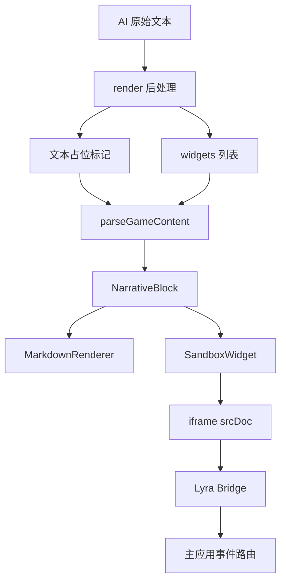

# Lyra Next 后处理系统升级设计

## 1. 概述与动机

当前后处理系统以 [`postProcess()`](src/lib/post-process/index.ts:39) 为统一入口，以 [`executePostProcessPipeline()`](src/lib/post-process/pipeline.ts:15) 为核心执行器，本质上是一个双阶段、线性的正则字符串管线。它非常适合做文本清洗、标签移除、简单替换与结构化片段提取，但无法承担以下新需求：

- 让预设作者继续沿用正则匹配思维，却把匹配结果渲染为交互式 UI
- 让玩家在叙事流内部直接点击、输入、关闭交互块，而不是只能看静态文本
- 在不破坏主页面 DOM、安全隔离和现有存档的前提下，支持 HTML、CSS、JS 级别的可扩展渲染

本次升级的核心目标不是放弃正则后处理，而是把正则从 纯文本变换器 升级为 结构化渲染触发器：

1. 保留现有 [`PostProcessRule`](src/lib/post-process/types.ts:29) 心智模型，仍由正则决定命中范围
2. 为渲染阶段新增 `sandbox` 动作，把命中结果转化为 widget 描述，而不是直接拼接到主文档
3. 使用 iframe 沙箱承载交互式 HTML/CSS/JS，并通过 Lyra Bridge 与主应用做最小化通信
4. 将系统级内部规则与用户可编辑规则彻底分层，避免 UI、引擎和内置行为继续耦合



---

## 2. 现状分析

### 2.1 数据模型现状

当前后处理规则契约定义在 [`PostProcessRule`](src/lib/post-process/types.ts:29)，阶段枚举定义在 [`PostProcessPhase`](src/lib/post-process/types.ts:7)，动作枚举定义在 [`PostProcessAction`](src/lib/post-process/types.ts:24)。目前数据模型具备以下特征：

- 规则字段围绕 `pattern`、`flags`、`replacement`、`action`、`extractKey` 展开，天然偏向字符串替换与提取
- 输出契约 [`PostProcessOutput`](src/lib/post-process/types.ts:71) 只有 `text`、`extracted`、`warnings`，没有任何渲染期 widget 描述能力
- 规则通过 [`Preset`](src/lib/prompt/types.ts:82) 上的 `postProcessRules` 字段挂接到预设，说明后处理能力天然属于预设的一部分，这一点适合继续保留

这意味着当前系统能描述 处理结果是什么文本，却不能描述 这里应该插入一个交互组件。

### 2.2 执行引擎现状

执行链路目前清晰但能力受限：

- 统一入口是 [`postProcess()`](src/lib/post-process/index.ts:39)
- 核心实现是 [`executePostProcessPipeline()`](src/lib/post-process/pipeline.ts:15)
- 持久化入口包装为 [`postProcessNarrativeForPersist()`](src/lib/post-process/persist-narrative.ts:34)
- 内置规则集中在 [`BUILTIN_RULES`](src/lib/post-process/builtin-rules.ts:7)
- 内置与预设规则合并依赖 [`mergeRules()`](src/lib/post-process/merge.ts:16)

当前引擎的工作方式是：

1. 根据 phase 过滤规则
2. 顺序修改同一份 `text`
3. 在 `extract-and-remove` 分支里把命中的第一个捕获组写入 `extracted`
4. 返回新的纯文本和提取结果

这套模型没有中间渲染 IR，也没有为 DOM 占位、widget 布局、事件桥接预留任何结构。

### 2.3 渲染链路现状

渲染侧目前把后处理视为 文本清洗前置步骤：

- [`parseGameContent()`](src/modules/chat/utils/parseGameContent.ts:22) 调用 render phase 的后处理，并把 `choices` 从 `extracted` 中拉平
- [`MarkdownRenderer`](src/components/ui/markdown.tsx:14) 使用 `rehypeRaw` 在主页面上下文渲染 HTML
- [`NarrativeBlock`](src/modules/chat/components/NarrativeBlock.tsx:265) 只接收最终字符串 `content`
- [`ChoicesPanel`](src/modules/chat/components/NarrativeFlow.tsx:275) 在正文块之外单独渲染选项
- [`TurnNarrativeFlow`](src/modules/room/components/TurnNarrativeFlow.tsx:83) 复用同一套解析逻辑用于联机回合叙事

现状的直接结果是：

- 可交互结构必须被先提取成普通字符串，再由宿主额外解释
- 交互块无法自然地内联在正文中间
- 原始 HTML 若直接落到 [`MarkdownRenderer`](src/components/ui/markdown.tsx:14)，会进入主页面 DOM，而不是隔离环境

### 2.4 编辑器与测试面板现状

预设编辑侧已经具备较好的规则管理能力，但仍完全围绕字符串规则设计：

- 规则总面板是 [`PostProcessPanel`](src/components/PresetWorkspace/PostProcessPanel/index.tsx:46)
- 规则编辑器是 [`RuleEditorDialog`](src/components/PresetWorkspace/PostProcessPanel/RuleEditorDialog.tsx:122)
- 列表项是 [`RuleItem`](src/components/PresetWorkspace/PostProcessPanel/RuleItem.tsx:48)
- 测试面板是 [`RuleTestPanel`](src/components/PresetWorkspace/PostProcessPanel/RuleTestPanel.tsx:34)

当前 UI 约束主要体现在：

- 可选动作只有 remove、replace、extract-and-remove
- 没有 `template` 编辑区
- 测试结果只展示清理后文本、提取数据与警告，无法预览 widget 描述
- 面板通过 [`BUILTIN_RULES`](src/lib/post-process/builtin-rules.ts:7) 和 [`mergeRules()`](src/lib/post-process/merge.ts:16) 把系统规则和用户规则混在一起展示

### 2.5 当前设计的核心瓶颈

综合来看，现状存在五个结构性问题：

1. 规则动作模型只面向字符串，没有面向渲染组件
2. 输出契约只返回文本，没有 widget 列表
3. 系统规则与用户规则混排，导致 UI 暴露了不应编辑的内部行为
4. 交互逻辑被迫走 [`ChoicesPanel`](src/modules/chat/components/NarrativeFlow.tsx:275) 这类特化 UI，而不是通用渲染块
5. 若直接允许 HTML 落在 [`MarkdownRenderer`](src/components/ui/markdown.tsx:14)，会把执行环境暴露给主页面

---

## 3. 目标设计

### 3.1 数据模型变更

目标数据模型应把 后处理结果 从 纯文本 输出升级为 文本加渲染描述 输出。

#### 3.1.1 规则模型扩展

在 [`PostProcessAction`](src/lib/post-process/types.ts:24) 中新增 `sandbox` 动作，在 [`PostProcessRule`](src/lib/post-process/types.ts:29) 中新增 `template: string` 字段。设计约束如下：

- `template` 始终存在
- 对非 `sandbox` 规则，`template` 默认为空字符串并被忽略
- 对 `sandbox` 规则，`replacement` 与 `extractKey` 不再参与主逻辑
- `sandbox` 规则只允许运行在 render phase，若配置到 persist phase，由校验器报错并由执行器跳过

示意类型如下：

```ts
export type PostProcessAction =
  | "remove"
  | "replace"
  | "extract-and-remove"
  | "sandbox";

export interface PostProcessRule {
  id: string;
  name: string;
  description?: string;
  pattern: string;
  flags: string;
  replacement: string;
  action: PostProcessAction;
  extractKey?: string;
  template: string;
  phase: PostProcessPhase;
  source: PostProcessRuleSource;
  enabled: boolean;
  order: number;
}
```

#### 3.1.2 输出契约扩展

在 [`PostProcessOutput`](src/lib/post-process/types.ts:71) 中新增 `widgets` 字段，用于表达 render phase 产生的沙箱块。

建议结构如下：

```ts
interface WidgetPosition {
  start: number;
  end: number;
  marker: string;
  order: number;
}

interface WidgetDescriptor {
  id: string;
  template: string;
  matches: string[];
  groups: Record<string, string>;
  position: WidgetPosition;
}

interface PostProcessOutput {
  text: string;
  extracted: Record<string, string[]>;
  widgets: WidgetDescriptor[];
  warnings: string[];
}
```

其中：

- `matches` 保存正则编号捕获组的值，不做模板插值
- `groups` 保存命名捕获组值
- `position.marker` 保存插回文本中的占位标记，建议使用私有保留串，例如 `\uE000LYRA_WIDGET:<id>\uE001`
- `position.start` 与 `position.end` 记录 render phase 输入文本中的原始偏移，便于调试和稳定排序

#### 3.1.3 解析结果扩展

[`parseGameContent()`](src/modules/chat/utils/parseGameContent.ts:22) 返回的 `ParsedContent` 新增 `widgets` 字段。`choices` 字段暂时保留，用于兼容旧规则与分阶段迁移，但新的规范渲染入口应以 `widgets` 为主。

### 3.2 执行引擎变更

执行引擎升级的关键不是替换正则，而是为正则执行结果增加 IR 层。

#### 3.2.1 管线行为变更

[`executePostProcessPipeline()`](src/lib/post-process/pipeline.ts:15) 需要新增 `sandbox` 分支，执行行为改为：

1. 过滤启用且 phase 匹配的规则
2. 依序执行 `remove`、`replace`、`extract-and-remove` 逻辑，保持现有行为不变
3. 遇到 `sandbox` 时，用独立正则实例遍历当前 `text`
4. 为每个匹配项生成一个 widget 描述对象，提取编号捕获组和命名捕获组
5. 把原匹配文本替换为唯一占位标记，而不是直接插入 HTML
6. 把 widget 推入 `widgets`
7. 返回 `text`、`extracted`、`widgets`、`warnings`

这样，渲染阶段拿到的不是 已执行的 HTML，而是 待挂载的沙箱描述。

#### 3.2.2 校验器变更

[`validatePostProcessRule()`](src/lib/post-process/validate.ts:79) 需要增加以下规则：

- `action=sandbox` 时 `template` 必填
- `action=sandbox` 时 `phase` 必须为 `render`
- `action=sandbox` 时允许 `replacement` 为空，且忽略 `extractKey`
- 旧规则若缺失 `template`，通过规范化补空字符串，而不是直接判定为非法

#### 3.2.3 系统规则组合方式变更

当前 [`mergeRules()`](src/lib/post-process/merge.ts:16) 与 [`BUILTIN_RULES`](src/lib/post-process/builtin-rules.ts:7) 的公开组合方式，会把系统规则直接暴露给 UI。升级后建议改为：

- persist phase 的系统规则只在 [`postProcessNarrativeForPersist()`](src/lib/post-process/persist-narrative.ts:34) 内部硬编码注入
- render phase 默认不再自动注入 `choices` 内置规则
- [`PostProcessPanel`](src/components/PresetWorkspace/PostProcessPanel/index.tsx:46) 不再直接消费 [`BUILTIN_RULES`](src/lib/post-process/builtin-rules.ts:7)
- [`mergeRules()`](src/lib/post-process/merge.ts:16) 若保留，应仅作为引擎内部组合工具，而不是 UI 可见默认源

### 3.3 Lyra Bridge API 规格

Lyra Bridge 是 iframe 内部唯一可信宿主接口，不使用字符串模板插值，全部数据通过桥接对象注入。

#### 3.3.1 只读数据

```ts
interface LyraBridge {
  readonly matches: string[];
  readonly groups: Record<string, string>;
  readonly theme: {
    primary: string;
    background: string;
    text: string;
    accent: string;
  };
  readonly context: {
    playerName?: string;
  };
  emit(type: string, data?: unknown): void;
  resize(height?: number): void;
}
```

数据来源说明：

- `matches` 与 `groups` 来自 `sandbox` 规则匹配结果
- `theme` 由宿主根据当前主题令牌整理而来，底层来源可对齐 [`src/styles/tokens.ts`](src/styles/tokens.ts)
- `context` 仅暴露有限游戏上下文，本阶段只开放 `playerName`

#### 3.3.2 事件协议

`lyra.emit()` 通过 `postMessage` 向宿主发送统一消息包。建议信封如下：

```ts
interface SandboxMessageEnvelope {
  channel: "lyra-sandbox";
  widgetId: string;
  kind: "event" | "resize";
  type?: string;
  data?: unknown;
  height?: number;
}
```

预定义事件如下：

| 事件 | 载荷 | 宿主行为 |
| --- | --- | --- |
| `fill-input` | `{ text: string }` | 复用 [`fillPlayerInput()`](src/modules/chat/utils/playerInputHelper.ts:11) 所在输入填充链路 |
| `send-input` | `{ text: string }` | 单机走 [`handleSendMessage`](src/modules/chat/components/GameView.tsx:116) 同路由，联机走 [`handleSubmit`](src/modules/room/components/ActionInput.tsx:168) 同语义 |
| `dismiss` | `{}` | 仅关闭当前 widget 的本地显示，不修改消息持久化内容 |

对未知事件类型，宿主应记录 warning 并忽略，保持桥接协议向后兼容。

#### 3.3.3 尺寸协议

`lyra.resize(height?)` 的行为建议为：

- 若调用方传入 `height`，直接使用该值
- 若未传入，则由 bridge 自动读取 `document.documentElement.scrollHeight`
- 宿主侧对高度做最小值、最大值和节流处理，避免抖动
- bridge 在 `DOMContentLoaded` 后主动执行一次 `resize`
- bridge 内部可挂接 `ResizeObserver`，在内容变更时自动上报

### 3.4 [src/modules/chat/components/SandboxWidget.tsx](src/modules/chat/components/SandboxWidget.tsx) 渲染组件设计

该组件是 render 层升级的核心宿主。

#### 3.4.1 组件职责

新增 [`src/modules/chat/components/SandboxWidget.tsx`](src/modules/chat/components/SandboxWidget.tsx) 后，职责建议限定为：

- 接收单个 widget 描述对象
- 生成 `srcDoc`，把 bridge bootstrap 脚本与用户 `template` 拼接到同一份 HTML 中
- 以 `sandbox=allow-scripts` 渲染 iframe
- 监听来自该 iframe 的 `postMessage`
- 处理 `fill-input`、`send-input`、`dismiss`、`resize`
- 维护当前 iframe 高度与本地隐藏状态

#### 3.4.2 与现有渲染链路的集成方式

建议把集成点放在 [`NarrativeBlock`](src/modules/chat/components/NarrativeBlock.tsx:265)，而不是直接扩展 [`MarkdownRenderer`](src/components/ui/markdown.tsx:14)。原因是：

- widget 与 markdown 文本是两种不同渲染载体
- 占位标记拆分应在 markdown 解析前完成
- 这样可以避免把沙箱 HTML 当作普通原始 HTML 继续送进 `rehypeRaw`

建议流程如下：

1. [`parseGameContent()`](src/modules/chat/utils/parseGameContent.ts:22) 返回 `narrative` 和 `widgets`
2. [`NarrativeBlock`](src/modules/chat/components/NarrativeBlock.tsx:265) 根据 `position.marker` 将文本切分为多个 segment
3. 纯文本 segment 继续用 [`MarkdownRenderer`](src/components/ui/markdown.tsx:14) 渲染
4. widget segment 使用新增的 [`src/modules/chat/components/SandboxWidget.tsx`](src/modules/chat/components/SandboxWidget.tsx)
5. [`NarrativeFlow`](src/modules/chat/components/NarrativeFlow.tsx:57) 与 [`TurnNarrativeFlow`](src/modules/room/components/TurnNarrativeFlow.tsx:83) 都传递 `widgets`

这样可以实现 叙事文字 与 交互组件 在同一消息块内按顺序交织渲染。

#### 3.4.3 事件路由设计

`sandbox` 不能直接操作业务 store，必须遵守现有架构约束，经 UI 路由或 CommandBus 间接完成：

- `fill-input`：宿主调用 [`fillPlayerInput()`](src/modules/chat/utils/playerInputHelper.ts:11)
- `send-input`：
  - 单机模式复用 [`handleSendMessage`](src/modules/chat/components/GameView.tsx:116) 的发送链路
  - 联机模式复用 [`handleSubmit`](src/modules/room/components/ActionInput.tsx:168) 的提交语义，最终仍进入房间命令处理器，如 [`submitActionHandler`](src/modules/room/commands/handlers.ts:40)
- `dismiss`：只修改本地 UI 可见性，不写回消息内容

这保证了沙箱不会绕过 Lyra 的命令边界。

### 3.5 安全模型

本次设计采用 明确隔离、有限桥接、开放网络 的策略。

#### 3.5.1 隔离边界

iframe 使用：

```html
<iframe sandbox="allow-scripts"></iframe>
```

该配置意味着：

- 允许执行用户模板中的脚本
- 不授予 `allow-same-origin`
- 因此沙箱无法直接访问主页面 DOM、`localStorage`、`IndexedDB`、Cookie 等主应用上下文资源
- 沙箱脚本与宿主之间唯一正式通信通道是 `postMessage`

#### 3.5.2 明确接受的风险

本方案 **不限制网络访问**。这意味着：

- 沙箱可以加载外部脚本、样式、图片和 API
- 若预设作者希望在沙箱中自行调用 AI API，需要在模板 JS 中自行处理 API Key
- 这属于能力开放的设计决策，而不是待补技术限制

#### 3.5.3 宿主侧仍需承担的防护责任

虽然不对网络做技术限制，但宿主仍应做以下最小防护：

1. 只接受来自当前 iframe 引用的 `postMessage`
2. 校验消息信封 `channel`、`widgetId`、`kind`
3. 对 `fill-input` 和 `send-input` 只接受字符串文本载荷
4. 对 `resize` 做范围收敛与节流
5. 在 UI 上标明该块来自第三方沙箱规则，风险由预设来源承担

#### 3.5.4 与主页面 HTML 渲染的关系

升级后，交互式 HTML 的规范入口是 [`src/modules/chat/components/SandboxWidget.tsx`](src/modules/chat/components/SandboxWidget.tsx)，而不是 [`MarkdownRenderer`](src/components/ui/markdown.tsx:14)。这能显著降低把可执行内容直接送入主页面 DOM 的压力。现有 `rehypeRaw` 仍可保留用于普通 HTML 片段兼容，但不再作为交互内容主通道。

### 3.6 系统规则内部化

这部分是本次升级能否落地的关键整理动作。

#### 3.6.1 `memory_summary` 内部化

当前 `memory_summary` 定义在 [`BUILTIN_RULES`](src/lib/post-process/builtin-rules.ts:7) 中，并由 [`postProcessNarrativeForPersist()`](src/lib/post-process/persist-narrative.ts:34) 间接使用。升级后建议：

- 保留该规则的引擎行为
- 从 [`PostProcessPanel`](src/components/PresetWorkspace/PostProcessPanel/index.tsx:46) 完全隐藏
- 不再允许用户在 UI 中编辑、重排或关闭这类纯内部规则
- 若需要稳定标识，可继续保留 [`BUILTIN_RULE_IDS`](src/lib/prompt/constants.ts:16) 中的 `MEMORY_SUMMARY`

#### 3.6.2 `choices` 去内置化

当前 `choices` 作为 [`BUILTIN_RULES`](src/lib/post-process/builtin-rules.ts:7) 的一部分，会让 render 层总是隐式拥有一个特化行为。升级后建议：

- 删除 `choices` 的内置自动执行语义
- 把它转为普通预设规则示例
- 将原本依赖 [`ChoicesPanel`](src/modules/chat/components/NarrativeFlow.tsx:275) 的逻辑保留为兼容路径，而不是新规范
- [`BUILTIN_RULE_IDS`](src/lib/prompt/constants.ts:16) 中的 `CHOICES` 可作为迁移识别符保留一个版本周期，随后再清理

#### 3.6.3 UI 只展示可编辑规则

升级后的 [`PostProcessPanel`](src/components/PresetWorkspace/PostProcessPanel/index.tsx:46) 应只展示预设真正拥有、并且用户可编辑的规则。这样做有三个直接好处：

- 规则列表语义更清晰
- 预设导入导出不再掺入内部实现细节
- 系统规则调整不必再考虑工作台 UI 向后兼容成本

### 3.7 choices 示例规则

`choices` 应作为一条普通 `sandbox` 规则随默认叙事预设提供，而不是由引擎偷偷附带。

#### 3.7.1 推荐示例规则

```ts
const choicesSandboxRule: PostProcessRule = {
  id: "example:choices-sandbox",
  name: "交互选项",
  description: "把 <choices> 块渲染为可点击按钮",
  pattern: "<choices>([\\s\\S]*?)</choices>",
  flags: "g",
  replacement: "",
  action: "sandbox",
  extractKey: undefined,
  template: `
<div id="choices"></div>
<script>
  const raw = lyra.matches[0] || "";
  const options = raw
    .split("\n")
    .map((line) => line.trim())
    .filter(Boolean);

  const root = document.getElementById("choices");
  root.innerHTML = options
    .map(
      (text, index) => `
        <button class="choice-btn" data-index="${index}">${text}</button>
      `,
    )
    .join("");

  root.addEventListener("click", (event) => {
    const target = event.target.closest(".choice-btn");
    if (!target) return;
    const text = target.textContent || "";
    lyra.emit("fill-input", { text });
  });

  lyra.resize();
</script>
<style>
  body {
    margin: 0;
    font-family: sans-serif;
    background: transparent;
    color: ${"${lyra.theme.text}"};
  }
  #choices {
    display: flex;
    flex-direction: column;
    gap: 8px;
  }
  .choice-btn {
    border: 1px solid currentColor;
    background: transparent;
    color: inherit;
    padding: 10px 12px;
    cursor: pointer;
  }
</style>
`,
  phase: "render",
  source: "user",
  enabled: true,
  order: 100,
};
```

上例中的样式字符串仅为示意。正式实现中不应依赖模板字符串插值去访问 `lyra` 数据，推荐把主题值放到脚本里读取后再写入 DOM 或 CSS 变量。核心要点只有两个：

- 正文数据通过 `lyra.matches[0]` 获取，而不是 `{{$1}}`
- 点击事件通过 `lyra.emit("fill-input", { text })` 与宿主交互

#### 3.7.2 推荐示例 HTML 写法

```html
<div id="app"></div>
<script>
  const raw = lyra.matches[0] || "";
  const list = raw
    .split("\n")
    .map((item) => item.trim())
    .filter(Boolean);

  const app = document.getElementById("app");
  app.innerHTML = list
    .map((item) => `<button class="item">${item}</button>`)
    .join("");

  app.addEventListener("click", (event) => {
    const button = event.target.closest(".item");
    if (!button) return;
    lyra.emit("fill-input", { text: button.textContent || "" });
  });

  lyra.resize();
</script>
```

这条示例规则建议直接挂入 [`defaultPreset`](src/lib/prompt/presets/default.ts:13) 的 `postProcessRules`，并在迁移期用于补齐旧预设的 choices 能力。

---

## 4. 实现路径

以下路径按风险从低到高拆分，每阶段都给出明确文件改动列表。

### 阶段一：扩展后处理契约与执行器

**目标**：先把引擎从 字符串结果 升级为 文本加 widget IR，而不立即改 UI。

**主要工作**：

1. 扩展规则与输出类型
2. 为 `sandbox` 增加校验逻辑
3. 让执行器能生成占位标记和 `widgets`
4. 将 `memory_summary` 的系统规则依赖收口到 persist 入口
5. 让 `choices` 退出内置系统规则主路径

**文件改动列表**：

- 修改 [`src/lib/post-process/types.ts`](src/lib/post-process/types.ts)
- 修改 [`src/lib/post-process/pipeline.ts`](src/lib/post-process/pipeline.ts)
- 修改 [`src/lib/post-process/validate.ts`](src/lib/post-process/validate.ts)
- 修改 [`src/lib/post-process/index.ts`](src/lib/post-process/index.ts)
- 修改 [`src/lib/post-process/persist-narrative.ts`](src/lib/post-process/persist-narrative.ts)
- 修改 [`src/lib/post-process/merge.ts`](src/lib/post-process/merge.ts)
- 修改 [`src/lib/post-process/builtin-rules.ts`](src/lib/post-process/builtin-rules.ts)
- 修改 [`src/lib/prompt/constants.ts`](src/lib/prompt/constants.ts)
- 新增 [`src/lib/post-process/widget-marker.ts`](src/lib/post-process/widget-marker.ts)

### 阶段二：接入渲染层与 iframe 沙箱

**目标**：把 render phase 的 widget IR 真实渲染为消息流中的交互块。

**主要工作**：

1. 扩展 [`parseGameContent()`](src/modules/chat/utils/parseGameContent.ts:22) 返回值
2. 在 [`NarrativeBlock`](src/modules/chat/components/NarrativeBlock.tsx:265) 中按占位标记拆分 segment
3. 新增 iframe 宿主组件与 `srcDoc` 构建逻辑
4. 统一单机与联机消息流的 widget 渲染
5. 将沙箱事件路由回当前输入体系和命令链路

**文件改动列表**：

- 修改 [`src/modules/chat/utils/parseGameContent.ts`](src/modules/chat/utils/parseGameContent.ts)
- 修改 [`src/modules/chat/components/NarrativeBlock.tsx`](src/modules/chat/components/NarrativeBlock.tsx)
- 修改 [`src/modules/chat/components/NarrativeFlow.tsx`](src/modules/chat/components/NarrativeFlow.tsx)
- 修改 [`src/modules/room/components/TurnNarrativeFlow.tsx`](src/modules/room/components/TurnNarrativeFlow.tsx)
- 修改 [`src/modules/chat/components/GameView.tsx`](src/modules/chat/components/GameView.tsx)
- 修改 [`src/modules/chat/utils/playerInputHelper.ts`](src/modules/chat/utils/playerInputHelper.ts)
- 新增 [`src/modules/chat/components/SandboxWidget.tsx`](src/modules/chat/components/SandboxWidget.tsx)
- 新增 [`src/modules/chat/utils/buildSandboxSrcDoc.ts`](src/modules/chat/utils/buildSandboxSrcDoc.ts)

### 阶段三：重构规则编辑器与测试面板

**目标**：让作者侧真正能创建和测试 `sandbox` 规则。

**主要工作**：

1. 后处理面板不再混入系统规则
2. 规则编辑器新增 `sandbox` 动作与 `template` 文本域
3. 测试面板展示 `widgets`、捕获组和占位标记，而不是只看 `extracted`
4. 规则列表显示 `sandbox` 类型标签
5. 保持 不做实时预览，只做结果可视检查

**文件改动列表**：

- 修改 [`src/components/PresetWorkspace/PostProcessPanel/index.tsx`](src/components/PresetWorkspace/PostProcessPanel/index.tsx)
- 修改 [`src/components/PresetWorkspace/PostProcessPanel/RuleEditorDialog.tsx`](src/components/PresetWorkspace/PostProcessPanel/RuleEditorDialog.tsx)
- 修改 [`src/components/PresetWorkspace/PostProcessPanel/RuleItem.tsx`](src/components/PresetWorkspace/PostProcessPanel/RuleItem.tsx)
- 修改 [`src/components/PresetWorkspace/PostProcessPanel/RuleTestPanel.tsx`](src/components/PresetWorkspace/PostProcessPanel/RuleTestPanel.tsx)

### 阶段四：预设迁移、导入导出与默认示例补齐

**目标**：让旧预设不掉功能，让新预设默认具备 choices sandbox 示例。

**主要工作**：

1. 旧规则缺失 `template` 时自动补空字符串
2. 将 legacy `choices` 逻辑迁移为显式预设规则
3. 在默认叙事预设中加入 choices sandbox 示例
4. 更新预设导入导出版本与兼容逻辑
5. 处理 Tavern 导入场景的非破坏性兼容

**文件改动列表**：

- 修改 [`src/lib/prompt/presets/default.ts`](src/lib/prompt/presets/default.ts)
- 修改 [`src/lib/prompt/store.ts`](src/lib/prompt/store.ts)
- 修改 [`src/lib/prompt/storage.ts`](src/lib/prompt/storage.ts)
- 修改 [`src/lib/prompt/converters/tavern.ts`](src/lib/prompt/converters/tavern.ts)
- 修改 [`src/components/PresetWorkspace/ImportExportDialog.tsx`](src/components/PresetWorkspace/ImportExportDialog.tsx)

### 阶段五：兼容收尾与验证

**目标**：保留兼容行为，同时把新路径变为默认规范。

**主要工作**：

1. 将 [`ChoicesPanel`](src/modules/chat/components/NarrativeFlow.tsx:275) 标记为兼容渲染通道
2. 为 pipeline、bridge、联机消息路由补测试
3. 验证单机与联机模式下的 `fill-input`、`send-input`、`dismiss`、`resize`
4. 验证旧预设、导入预设和默认预设的迁移结果

**文件改动列表**：

- 修改 [`src/modules/chat/components/NarrativeFlow.tsx`](src/modules/chat/components/NarrativeFlow.tsx)
- 修改 [`src/modules/room/components/TurnNarrativeFlow.tsx`](src/modules/room/components/TurnNarrativeFlow.tsx)
- 新增 [`src/lib/post-process/__tests__/pipeline.sandbox.test.ts`](src/lib/post-process/__tests__/pipeline.sandbox.test.ts)
- 新增 [`src/modules/chat/components/__tests__/SandboxWidget.test.tsx`](src/modules/chat/components/__tests__/SandboxWidget.test.tsx)

---

## 5. 迁移策略

迁移策略的目标是：**现有规则不受影响，现有消息不重写，现有预设逐步显式化 choices 能力。**

### 5.1 规则结构向后兼容

对已存在的 `remove`、`replace`、`extract-and-remove` 规则：

- 读取时若缺失 `template`，自动补为 `""`
- 执行时仅在 `action=sandbox` 分支读取 `template`
- 因此旧规则无需人工改写即可继续工作

这保证了升级不会破坏 [`PostProcessRule`](src/lib/post-process/types.ts:29) 的既有使用方式。

### 5.2 旧 `choices` 行为迁移为显式规则

由于 `choices` 将不再由 [`BUILTIN_RULES`](src/lib/post-process/builtin-rules.ts:7) 自动提供，因此需要一个显式迁移策略：

1. 若旧预设中存在 legacy `builtin:choices` 覆盖记录，则把它转换为真实的用户 `sandbox` 规则，保留 `enabled` 和 `order`
2. 若旧 narrative 预设没有任何显式 choices 规则，则在首次加载或首次保存时注入默认 choices sandbox 示例
3. 若预设已经有用户自定义的 `<choices>` 规则，则不做额外注入
4. 兼容期内继续保留 [`ChoicesPanel`](src/modules/chat/components/NarrativeFlow.tsx:275) 对旧提取式规则的渲染能力，避免一次性切断旧内容

### 5.3 存档与消息数据不做回填

`sandbox` widget 是 render phase 的派生物，而不是消息持久化的一部分。因此：

- 不需要回写历史消息
- 不需要重跑旧存档的数据迁移
- 历史消息在展示时按当前预设规则重新计算 `widgets`

这使升级成本集中在规则与渲染层，而不是存档层。

### 5.4 预设导入导出兼容

建议将 Lyra 预设导出版本从 [`exportLyraPreset()`](src/lib/prompt/converters/tavern.ts:435) 当前的 `1.1` 提升到 `1.2`，并让 [`importLyraPreset()`](src/lib/prompt/converters/tavern.ts:478) 继续兼容 `1.0` 与 `1.1`：

- `1.0`、`1.1` 导入时自动补齐 `template`
- `1.2` 导出时原样保留 `sandbox` 规则与 HTML 模板
- 导入逻辑只做 schema normalization，不对作者模板做额外改写

### 5.5 Tavern 导入保持非破坏性

[`convertTavernRegex()`](src/lib/post-process/tavern-import.ts:132) 当前把酒馆脚本转换为普通文本规则。升级后建议保持这一点不变：

- Tavern 导入规则默认仍是 `remove` 或 `replace`
- 不自动猜测或生成 `sandbox` 模板
- 作者若要升级为 `sandbox`，在工作台手动切换动作并粘贴 `template`

这可以避免伪智能转换带来的误判。

---

## 6. 风险与缓解

| 风险 | 表现 | 缓解 |
| --- | --- | --- |
| 恶意模板执行第三方脚本 | 预设可联网加载任意资源 | 使用 `sandbox=allow-scripts` 保持唯一来源隔离，风险声明交由社区审阅与来源信任承担 |
| `postMessage` 被伪造 | 非目标 iframe 发送宿主事件 | 宿主只接受已登记 iframe 引用、校验 `channel` 与 `widgetId` |
| iframe 高度抖动 | 内容重排导致频繁 resize | 为 `resize` 加节流、最小值和最大值限制，并在 bridge 内用 `ResizeObserver` 合并上报 |
| 流式输出中 widget 反复重建 | 正文还在 streaming，正则匹配尚未闭合 | 仅对完整匹配生成 widget，并使用 `rule.id + start + end + index` 生成稳定 ID |
| 老预设升级后丢失 choices | `choices` 不再内置 | 在 [`defaultPreset`](src/lib/prompt/presets/default.ts:13) 中提供示例规则，并在加载迁移时自动补齐 |
| 规则编辑体验下降 | 模板较长，且不做实时预览 | 在 [`RuleEditorDialog`](src/components/PresetWorkspace/PostProcessPanel/RuleEditorDialog.tsx:122) 中使用纯文本大输入区，在 [`RuleTestPanel`](src/components/PresetWorkspace/PostProcessPanel/RuleTestPanel.tsx:34) 中展示 widget 描述和捕获组结果 |
| 架构被绕过 | 沙箱直接改 store 或直接操作宿主 | 所有动作只经过 `fill-input`、`send-input`、`dismiss` 这类有限桥接事件，真正业务写入仍沿用现有 UI 路由和命令处理器 |

### 6.1 建议的验收标准

升级完成后，应至少满足以下验收结果：

1. 旧的文本型规则在单机与联机模式下行为保持一致
2. `memory_summary` 不再出现在 [`PostProcessPanel`](src/components/PresetWorkspace/PostProcessPanel/index.tsx:46)
3. `<choices>` 可通过普通预设规则渲染为内联 sandbox widget
4. widget 点击后可驱动输入填充、直接发送、关闭当前块
5. iframe 无法访问主应用存储与 DOM
6. 预设导入导出后，`sandbox` 模板不丢失

---

## 结论

本次升级本质上是把后处理系统从 纯文本正则清洗器 升级为 正则驱动的渲染描述层。其关键设计点包括：

- 在 [`PostProcessAction`](src/lib/post-process/types.ts:24) 中引入 `sandbox`
- 在 [`PostProcessRule`](src/lib/post-process/types.ts:29) 中加入 `template`
- 在 [`PostProcessOutput`](src/lib/post-process/types.ts:71) 中加入 `widgets`
- 以 [`src/modules/chat/components/SandboxWidget.tsx`](src/modules/chat/components/SandboxWidget.tsx) 承载 iframe 宿主逻辑
- 通过 Lyra Bridge 实现只读数据注入和最小动作回传
- 将系统规则内部化，把 `choices` 从内置行为改为普通预设示例

这样既保留了正则规则的作者体验，也为 Lyra Next 建立了一个足够通用、可扩展且与主应用隔离的交互式内容渲染基础设施。
