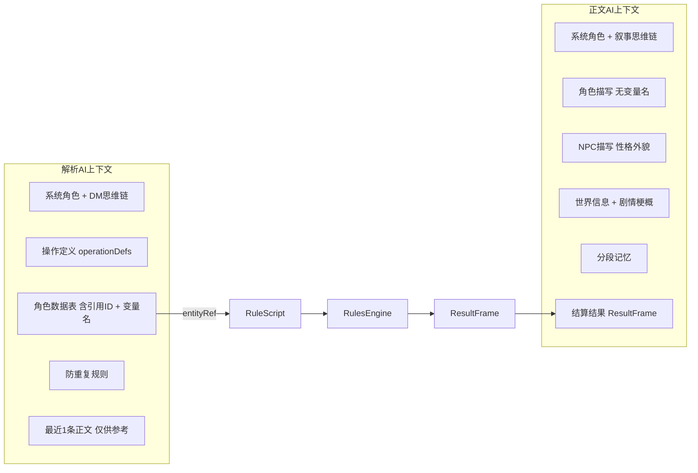

# 默认预设优化方案

## 一、问题诊断

### 1.1 信息冗余与错配

当前两个 AI 使用相同的 Marker 块渲染函数，但它们的信息需求截然不同：

| Marker 块       | Narrative AI 需要                     | Parser AI 需要                               | 当前问题                                                |
| --------------- | ------------------------------------- | -------------------------------------------- | ------------------------------------------------------- |
| `userPersona`   | 名称/种族/性格/外貌/背景（叙事素材）  | 实体引用 ID + 属性数值（构造指令）           | 正文AI看到属性数值但用不上；解析AI缺少变量名            |
| `npcInfo`       | 性格/外貌/当前状态（叙事素材）        | 实体引用 ID + 属性数值（构造指令）           | 两个AI看到的内容相同，但需求不同                        |
| `gameState`     | ❌ 不需要（变量名+属性值对叙事无帮助） | ✅ 核心参考（需要变量名+属性+效果+物品+技能） | 正文AI收到无用的变量信息；与npcInfo/userPersona大量重复 |
| `resultFrame`   | ✅ 核心参考（结算结果是叙事依据）      | ❌ 不需要（结算在Parser之后发生）             | 正确                                                    |
| `operationDefs` | ❌ 不需要                              | ✅ 必需                                       | 正确，但其中在场NPC列表与npcInfo重复                    |

### 1.2 解析 AI 行为问题

| 问题                              | 根因                                                                                    |
| --------------------------------- | --------------------------------------------------------------------------------------- |
| 重复结算：NPC/物品/技能被反复创建 | Parser 看到 3 条完整历史正文（recentNarrativeCount: 3），会从旧正文中提取已处理过的变化 |
| 无条件实现玩家意图                | 缺少 DM 检定思维链，Parser 只做翻译不做评估                                             |
| 叙事内容中已处理的行动被再次结算  | 职责一"解构上轮叙事"没有与当前 gameState 做对比校验                                     |

---

## 二、方案概述

### 核心思路

彻底重新定制 Marker 块渲染函数，为正文 AI 和解析 AI 分别提供精准匹配其职责的信息。通过新增普通块构建思维链，引导 AI 行为。



---

## 三、新增 Marker 类型

### 3.1 `characterSheet` — 角色数据表（Parser 专用）

**目的**：为 Parser AI 提供包含实体引用 ID 和变量名的完整角色数据，合并原 `userPersona` + `npcInfo` + `gameState` 三块信息。

**数据来源**：
- 玩家角色信息：`context.user` / `context.players`（名称、维度选择）
- 属性数值：`context.gameState`（按实体分组的 key-value）
- 资源字段：`context.worldConfig.derivedStats`（isResource + maxField 配对）
- 天赋/效果：`context.entityEffects`（按 entityId 分组的 TagMetadata 列表）
- 物品/技能：`context.inventoryData`（按角色分组的背包和技能数据）
- NPC 信息：`context.activeNpcs`（在场 NPC 列表）

**渲染格式示例**：

```
【角色数据表】

═══ 玩家角色 ═══
[引用ID: player] 流萤白沙
种族: 精灵 | 背景: 骑士
属性: str 17 | vit 9 | agi 16 | int 11 | spr 10 | luk 10
资源: hp 25/25 | mp 15/15
等级: 1
天赋: 暗视 - 能在完全黑暗的环境中视物，不受黑暗影响; 强韧 - 天生体魄强健，能承受更多伤害; 锐眼 - 观察力超群，攻击时更加精准
当前效果: （无）
背包: 铁剑x1（武器，已装备）、治疗药水x2（消耗品）
技能: 基础剑术 Lv.1（主动/combat）

═══ 在场 NPC ═══
[引用ID: 哥布林] 哥布林 Lv.3 - 状态: active
属性: str 10 | vit 8 | agi 12 | int 5 | spr 4 | luk 6
资源: hp 18/18
当前效果: 中毒（剩余 2 回合）[系统管理]
背包: 破旧匕首x1（武器，已装备）
技能: （无）
```

**关键特性**：
- 合并了原 `userPersona` + `npcInfo` + `gameState` 的所有信息
- 包含 `[引用ID: xxx]` 标记，Parser AI 在构造 RuleScript 时使用此 ID
- 包含变量名（str、hp 等），Parser 构造指令时直接引用
- 效果标注了 `[系统管理]` / `[AI管理]`，Parser 知道哪些需要处理
- 物品和技能列表嵌入角色下方，避免分散

### 3.2 `characterDescription` — 角色描写（Narrative 专用）

**目的**：为正文 AI 提供纯叙事性的角色信息，不含变量名和引用 ID。

**数据来源**：
- 玩家角色信息：`context.user` / `context.players`（名称、维度选择、外貌、性格、背景）
- NPC 信息：`context.activeNpcs`（名称、外貌、性格、描述）
- 天赋描述：`context.entityEffects` 中 `category === "talent"` 的条目（仅名称+描述，不含机械细节）

**渲染格式示例**：

```
【玩家角色】
流萤白沙 — 精灵骑士
外貌: 尖耳、纤细身材，发色多为银白或金色
性格: 正义感强，重视荣誉和誓言
背景故事: 曾效忠于某位领主的骑士，因故离开故士，以剑技谋生
天赋: 暗视（能在完全黑暗的环境中视物）、强韧（天生体魄强健）、锐眼（观察力超群）

【在场 NPC】
1. 哥布林 (Lv.3)
   外貌: 绿色皮肤的小矮人，手持破旧匕首
   性格: 凶残而狡猾
   当前状态: 身上弥漫着紫色的毒雾，看起来很痛苦
```

**关键特性**：
- 不含变量名（没有 str、hp 等技术标识）
- 不含引用 ID（没有 `[player]` 等标记）
- 效果用叙事性描述（NPC 的 `description` 字段）
- 重点在外貌、性格、背景——这些是叙事创作的核心素材

### 3.3 `narrativeState` — 叙事状态摘要（Narrative 专用）

**目的**：替代 gameState，为正文 AI 提供精简的资源状态摘要（不含变量名，使用角色名和中文标签），帮助叙事时体现角色的健康/状态。

**数据来源**：
- 属性数值：`context.gameState`（按实体分组）
- 资源配对：`context.worldConfig.derivedStats`（isResource 字段的 label）
- 效果：`context.entityEffects`（仅显示 displayName + 剩余回合数）
- 显示名映射：`context.entityDisplayNames`（将 entityId 转为角色名）

**渲染格式示例**：

```
【当前状态速览】
流萤白沙: 生命 25/25 | 魔力 15/15 | 状态正常
哥布林: 生命 18/18 | 中毒中（剩余2回合）
```

**关键特性**：
- 极度精简，只包含关键资源和当前效果
- 使用角色名而非变量名
- 使用中文标签（生命、魔力）而非变量名（hp、mp）
- 帮助正文 AI 在叙事中自然融入角色状态描写

---

## 四、预设块重构

### 4.1 Narrative AI 预设（正文 AI）

```
块顺序:
1. [普通块] 系统角色             — 精简核心职责
2. [Marker] characterDescription — 新！角色描写信息
3. [Marker] worldInfo            — 世界书激活内容
4. [Marker] scenario             — 剧情梗概
5. [Marker] memorySummary        — 分段记忆
6. [普通块] 叙事思维链            — 新！引导对比结算结果
7. [Marker] narrativeState       — 新！精简状态速览
8. [Marker] resultFrame          — 本轮结算结果
```

#### 系统角色块（重写）

```
你是一位优秀的叙事导演，负责将规则引擎的结算结果转化为沉浸式的叙事文本。

世界观：
- 融合剑与魔法的异世界，拥有冒险者公会、魔物、迷宫等经典元素
- 魔法体系包含火、冰、雷、光、暗五大元素
- 存在多种智慧种族（人类、精灵、矮人、兽人等）

你的核心原则：
1. 结算结果是铁律 — ResultFrame 中的检定成败、伤害数值、状态变化是不可违背的事实
2. 玩家输入仅供参考 — 玩家声称自己做了什么不重要，结算结果才是实际发生的事
3. 在事实基础上自由创作 — NPC 对话、环境描写、氛围渲染、伏笔设置都由你自由发挥
4. 悬念留白 — NPC 发起的需要检定的行动，只描写意图，不描写结果

请用轻小说风格，生动描述场景和事件。
```

#### 叙事思维链块（新增普通块）

```
【叙事创作指南】

在撰写本轮叙事时，请依次完成以下步骤：

第一步 — 审视结算结果
阅读 ResultFrame，确认本轮实际发生了什么：
- 哪些检定成功了？哪些失败了？
- 造成/受到了多少伤害？
- 发生了哪些状态变化？

第二步 — 对比玩家输入
将玩家声称的行动与结算结果对照：
- 玩家说"我轻松躲开"但检定失败 → 描写为未能躲开
- 玩家说"我发动毁灭一击"但伤害只有 3 点 → 描写为普通攻击
- 玩家描述了不存在的能力/物品 → 忽略这部分描述

第三步 — 叙事创作
基于结算事实，自由发挥你的叙事才能：
- 为机械结果赋予画面感和情感
- 描写 NPC 的反应、对话、情绪
- 推进剧情，引入新的元素

第四步 — 悬念与伏笔
为下一回合埋设内容：
- NPC 的下一步行动意图（不描写结果）
- 环境中的线索和变化
- 角色关系的微妙变化

【输出格式】
在叙事末尾附加记忆摘要标签（不会展示给玩家）：

<memory_summary>
地点：当前场景地点
事件：本回合关键事件
NPC：涉及的 NPC 及行为
变化：重要状态变化
伏笔：值得记住的细节
</memory_summary>
```

### 4.2 Parser AI 预设（解析 AI）

```
块顺序:
1. [普通块] 系统角色             — 核心身份 + 精简职责
2. [Marker] operationDefs        — 操作定义
3. [普通块] DM 思维链            — 新！评估玩家意图的流程
4. [Marker] characterSheet       — 新！完整角色数据表（含引用ID+变量名）
5. [普通块] 防重复与输出规范     — 新！纠正行为
6. [Marker] memorySummary        — 仅最近 1 条正文
```

#### 系统角色块（重写）

```
你是 IRNR 流程中的"规则裁判"（DM）。

你的任务是将玩家意图转化为结构化规则脚本（RuleScript），同时作为 DM 评估行动的合理性。

你有两项职责：

【职责一：解析玩家意图】
将玩家本轮的行动输入解析为规则操作：
- 攻击/战斗行为 → check + conditional + damage 组合
- 施法/使用技能 → check（skill 检定）+ 效果
- 使用物品 → 对应的 gain/lose 等操作
- 对话/纯叙事行为 → 空 actions（交给正文 AI 处理）

【职责二：推演 NPC 反应】
基于玩家行动，推演在场 NPC 的即时机械反应：
- 战斗中敌方的反击/防御 → npcAction
- 仅推演"因为玩家做了 X，NPC 立即 Y"的直接因果
- 不创造与玩家行动无关的独立 NPC 行为
- NPC 的对话、情绪等非机械反应由正文 AI 描写，不要推演

输出要求：
1) 仅输出 JSON（不要 Markdown 包裹，不要额外解释）
2) 顶层结构：{ "version": 1, "actions": [] }
3) 只使用 operationDefinitions 中定义的操作
4) 无法执行时返回 { "version": 1, "actions": [] }
```

#### DM 思维链块（新增普通块）

```
【DM 检定思维链 — 处理玩家意图前的评估流程】

收到玩家输入后，按以下步骤评估：

步骤 1 — 意图识别
玩家想做什么？提取核心行动。

步骤 2 — 可行性检查
对照角色数据表验证：
- 角色当前 hp > 0 吗？（hp=0 不能行动）
- 使用的物品在背包中吗？（没有的物品不能使用）
- 使用的技能已习得吗？（没有的技能不能施放）
- 魔力/体力足够吗？（资源不足则技能无法使用，设置该行动的检定失败或不执行）

步骤 3 — 合理性评估与意图转述
- 合理行动 → 忠实转化为对应操作
- 夸大行动 → 降级为合理版本（如"一拳打碎城墙" → 普通力量检定，DC 设高）
- 超能力行动 → 角色没有该能力时，返回空 actions（正文 AI 会描写失败）
- 多步行动 → 拆分为多个 check，使用 conditional 串联

步骤 4 — DC 难度设定
根据行动难度和世界观合理性设定 DC：
- 简单日常行为: DC 8-10
- 需要技巧的行为: DC 12-15
- 困难挑战: DC 16-18
- 接近极限的壮举: DC 20-25
- 参考角色属性值：属性 modifier 约等于 (属性值 - 10) / 2

步骤 5 — 组装 RuleScript
使用 check + conditional 模式处理需要检定的行动：
先 check 检定 → 用 conditional 根据结果分支 → 成功执行效果 / 失败无效果
```

#### 防重复与输出规范块（新增普通块）

```
【防重复规则 — 关键约束】

⚠️ 你只处理"新变化"。角色数据表中已经存在的实体/效果/物品/技能，不要重复创建。

判断规则：
1. NPC 已在角色数据表中 → 不要 npcCreate，可用 npcAction/npcStatusChange 操作已有 NPC
2. 效果已在角色当前效果中 → 不要重复 addTag，除非叙事明确描述效果刷新/叠加
3. 物品已在背包中 → 不要重复 grantItem
4. 技能已在技能列表中 → 不要重复 grantSkill

关于上一轮叙事（如果有）：
- 叙事正文中提到的 NPC 如果已在角色数据表中 → 说明已被处理，跳过
- 叙事中 NPC 的非机械行为（对话、情绪）→ 不需要结构化，忽略
- 只有叙事中明确出现了"新角色"且不在角色数据表中 → 才使用 npcCreate

效果管理规则：
- 标注 [系统管理] 的效果：由系统自动执行触发器，不要在 actions 中处理
- 标注 [AI管理] 的效果：需要你在 actions 中体现影响
- 被动效果的修正值：在相关检定的 modifier 中加上
- 新建效果时：务必填写 displayName 和 effectDescription

【引用规则】
- 引用玩家角色时使用角色数据表中的引用 ID（如 player）
- 引用 NPC 时使用角色数据表中的引用 ID（通常是 NPC 名称）
- 引用属性字段时使用变量名（如 str, hp, mp）
```

---

## 五、ResultFrame 渲染优化

### 5.1 当前问题

当前 `renderResultFrame()` 输出格式（`marker-registry.ts:487`）：

```
【结算摘要】力量检定：15+3=18 vs DC 15，成功。player.hp：25 → 20（-5）（哥布林反击）
【骰子结果】
- 2d6+3: [3, 5] +3 => 11
【检定结果】
- 力量检定(attack): d15 +3 vs DC15 = 18 (成功)
【状态变化】
- [character] player.hp: 25 → 20 (Δ-5)，原因：哥布林反击
- [character] 哥布林.hp: 18 → 7 (Δ-11)，原因：剑击
```

问题：
1. **信息重复** — `mechanicSummary` 与【检定结果】【状态变化】内容高度重复
2. **变量名暴露** — `player.hp`、`哥布林.hp` 对正文 AI 不友好
3. **骰子细节过多** — `[3, 5]` 每面结果对叙事无意义
4. **缺少叙事指引** — 只列数据，不告诉 AI 这意味着什么
5. **缺少 structuralChanges** — 物品/技能的添加/移除未被渲染

### 5.2 优化方案

重写 `renderResultFrame()`，输出面向叙事创作的结算摘要：

**新格式示例**：

```
【本轮结算结果】

▸ 流萤白沙 发起攻击检定 → 成功（掷骰 15+3=18，难度 15）
  → 对哥布林造成 11 点伤害（剑击），哥布林生命 18→7

▸ 哥布林 反击 → 成功（掷骰 12+2=14，难度 12）
  → 对流萤白沙造成 5 点伤害（反击），流萤白沙生命 25→20

▸ 获得物品: 哥布林的匕首 x1
▸ 流萤白沙 习得技能: 反击姿态
```

**设计原则**：
- **合并不重复** — 将检定结果和对应的状态变化合并到同一行
- **使用角色名** — 不用变量名，用角色显示名
- **简化骰子** — 只展示最终结果（掷骰值+修正=总值 vs 难度），不展示每面
- **关联因果** — 检定结果紧跟其引起的状态变化
- **渲染 structuralChanges** — 物品获得/失去、技能习得/遗忘

### 5.3 实现方式

重写 `renderResultFrame()` 函数：
1. 优先使用 `mechanicSummary`（已经是引擎生成的可读摘要），作为主体内容
2. 补充 `mechanicSummary` 中未覆盖的信息（如结构化变更 structuralChanges）
3. 使用 `entityDisplayNames` 替换所有 UUID/变量名为角色名
4. 简化骰子表示：`掷骰 {roll}+{modifier}={total}，难度 {dc}`
5. 检定与状态变化关联展示（通过 `reason` 字段匹配）
6. 渲染 `structuralChanges`（item_added → "获得物品"、skill_learned → "习得技能" 等）

---

## 六、影响范围分析

### 6.1 需要修改的文件

| 文件                                               | 修改内容                                                                                                    | 风险                 |
| -------------------------------------------------- | ----------------------------------------------------------------------------------------------------------- | -------------------- |
| `src/lib/prompt/marker-registry.ts`                | 新增 3 个渲染函数 + 重写 `renderResultFrame` + 移除 3 个旧渲染函数 + 更新 `MARKER_REGISTRY` 和 `MARKER_IDS` | 核心变更，需仔细测试 |
| `src/lib/prompt/presets/default.ts`                | 重写 Narrative 预设块组合                                                                                   | 低风险               |
| `src/lib/prompt/presets/default-parser.ts`         | 重写 Parser 预设块组合                                                                                      | 低风险               |
| `src/lib/prompt/__tests__/marker-registry.test.ts` | 移除旧 Marker 测试 + 新增新 Marker 测试                                                                     | 测试同步             |
| `src/lib/prompt/__tests__/presets.test.ts`         | 更新预设结构断言                                                                                            | 测试同步             |
| `src/lib/prompt/converters/tavern.ts`              | 更新酒馆预设映射表（`personaDescription` 映射目标）                                                         | 低风险               |

### 6.2 不需要修改的文件

| 文件                                                 | 原因                                                                                                 |
| ---------------------------------------------------- | ---------------------------------------------------------------------------------------------------- |
| `src/lib/prompt/types.ts`                            | `VariableContext` 字段不变（`gameState`、`activeNpcs` 等仍然存在，它们是数据字段名，不是 Marker ID） |
| `src/lib/prompt/utils.ts`                            | `buildVariableContext` 不变                                                                          |
| `src/modules/game/services/irnr-pipeline.ts`         | pipeline 构建 `VariableContext` 的逻辑不变                                                           |
| `src/core/yjs/manager.ts`                            | `gameState` 是 Yjs 存储字段名，与 Marker 无关                                                        |
| `src/modules/checkpoint/services/snapshot-config.ts` | `gameState` 是 checkpoint 字段名，与 Marker 无关                                                     |
| `src/lib/prompt/index.ts`                            | 导出入口不变（预设导出名不变）                                                                       |

### 6.3 类型影响

`MARKER_IDS` 是 `MarkerType` 联合类型的唯一来源：

```typescript
export type MarkerType = (typeof MARKER_IDS)[number];
```

修改 `MARKER_IDS`（移除旧 ID + 新增新 ID）后：
- `MarkerType` 自动更新，移除 `"userPersona" | "npcInfo" | "gameState"`，新增 `"characterSheet" | "characterDescription" | "narrativeState"`
- 所有引用旧 `MarkerType` 值的代码会在编译时报错（TypeScript 保护）
- 默认预设中的 `markerType` 字段会被新值替代，不存在类型冲突

### 6.4 酒馆预设转换器影响

`src/lib/prompt/converters/tavern.ts` 中有映射：

```typescript
personaDescription: "userPersona",  // → 改为 "characterDescription"
gameState: "gameState",              // → 改为 "characterSheet"（或移除映射）
```

需要决定酒馆预设导入时如何映射到新 Marker。建议：
- `personaDescription` → `characterDescription`（叙事性角色描写对应）
- `gameState` → 移除映射（酒馆预设通常不含 IRNR 概念）

---

## 七、预期效果

| 问题                     | 优化后                                                                                                                                          |
| ------------------------ | ----------------------------------------------------------------------------------------------------------------------------------------------- |
| 信息冗余                 | 正文 AI：`characterDescription` + `narrativeState` + `resultFrame`（精准、无冗余）；解析 AI：`characterSheet` + `operationDefs`（完整、结构化） |
| NPC/物品/技能反复创建    | 防重复规则块明确指导"对照角色数据表判断是否已存在"；`recentNarrativeCount` 从 3 降到 1                                                          |
| 玩家口胡被无条件实现     | DM 思维链块要求 Parser 评估合理性，不合理行动降级或拒绝                                                                                         |
| 正文 AI 不忠于结算结果   | 叙事思维链块要求"先读 ResultFrame，再对比玩家输入，以结算为准"                                                                                  |
| 解构上轮叙事导致重复     | 移除"解构上轮叙事"职责，改为"对照角色数据表判断新变化"                                                                                          |
| ResultFrame 冗余可读性差 | 合并重复信息，使用角色名，简化骰子细节，关联检定与状态变化，渲染 structuralChanges                                                              |

---

## 八、实施步骤

### Step 1：新增 Marker 渲染函数（marker-registry.ts）

在 `marker-registry.ts` 中新增三个渲染函数：

**1.1 `renderCharacterSheet(context)`**

合并原 `renderUserPersona` + `renderNpcInfo` + `renderGameState` 的逻辑，生成 Parser 专用的完整角色数据表。

关键逻辑：
- 从 `context.gameState` 按 `"."` 分割提取实体数据（复用现有分组逻辑）
- 从 `context.worldConfig.primaryAttributes` 获取属性 key 列表和显示名，但输出变量名（`str 17`）而非显示名（`力量 17`）
- 从 `context.worldConfig.derivedStats` 的 `isResource` + `maxField` 获取资源配对
- 从 `context.entityEffects` 渲染效果（保留 `[系统管理]` / `[AI管理]` 标注）
- 从 `context.inventoryData` 渲染背包和技能（嵌入对应角色下方）
- 从 `context.user`（单机）或 `context.players`（联机）获取维度选择信息
- 从 `context.activeNpcs` 获取 NPC 外貌/性格等（可选输出，因为 characterSheet 侧重数据）

**1.2 `renderCharacterDescription(context)`**

复用 `formatPlayer()` 的部分逻辑，但移除属性数值输出。

关键逻辑：
- 输出玩家角色：名称 + 维度（种族/背景）+ 外貌 + 性格 + 背景故事
- 天赋仅输出名称和描述（不含机械细节如 `[引擎自动: ...]`）
- 输出在场 NPC：名称 + 等级 + 外貌 + 性格 + 当前状态（`description` 字段）
- 效果用叙事描述（从 `activeNpcs.description` 或 `entityEffects.displayName` 提取）

**1.3 `renderNarrativeState(context)`**

精简状态速览。

关键逻辑：
- 遍历 `context.gameState` 按实体分组
- 对每个实体，仅输出资源字段（通过 `getResourcePairs()` 识别）
- 使用 `entityDisplayNames` 将 entityId 转为角色名
- 使用 `worldConfig.derivedStats` 的 `label` 作为中文标签（如 "HP" → "生命"）
- 附加当前效果的 `displayName`（从 `entityEffects` 提取）

### Step 2：更新 Marker 注册表（marker-registry.ts）

在 `MARKER_REGISTRY` 数组中：
- 移除 `userPersona`、`npcInfo`、`gameState` 三个条目
- 新增 `characterSheet`、`characterDescription`、`narrativeState` 三个条目

同步更新 `MARKER_IDS`：
```typescript
export const MARKER_IDS = [
  "chatHistory",
  "characterSheet",       // 新增（替代 userPersona + npcInfo + gameState）
  "characterDescription", // 新增（Narrative 专用角色描写）
  "narrativeState",       // 新增（Narrative 专用状态速览）
  "resultFrame",
  "operationDefs",
  "worldInfo",
  "scenario",
  "turnInfo",
  "memorySummary",
] as const;
```

### Step 3：重写 `renderResultFrame()`（marker-registry.ts）

核心变更：
- 移除分散的【骰子结果】【检定结果】【状态变化】分区
- 改为以"事件"为单位组织输出（一个检定 + 其关联的状态变化 = 一个事件块）
- 使用 `entityDisplayNames` 替换所有 entityId 为角色名
- 使用 `worldConfig.derivedStats` 的 `label` 替换变量名（如 `hp` → `生命`）
- 新增 `structuralChanges` 渲染（物品获得/失去、技能习得/遗忘）
- 简化骰子展示格式

### Step 4：重写默认 Narrative 预设（default.ts）

- 新的块组合：系统角色 + characterDescription + worldInfo + scenario + memorySummary + 叙事思维链 + narrativeState + resultFrame
- 移除 `userPersona`、`npcInfo`、`gameState` 的 Marker 块
- 新增叙事思维链普通块
- 版本号升级到 `2.0.0`

### Step 5：重写默认 Parser 预设（default-parser.ts）

- 新的块组合：系统角色 + operationDefs + DM思维链 + characterSheet + 防重复规范 + memorySummary
- 移除 `userPersona`、`npcInfo`、`gameState`、`scenario` 的 Marker 块
- 新增 DM 思维链 + 防重复规范普通块
- `memorySummary` 配置改为：`recentNarrativeCount: 1, miniSummaryCount: 0`
- 版本号升级到 `2.0.0`

### Step 6：清理旧渲染函数（marker-registry.ts）

移除不再使用的函数：
- `renderUserPersona()`
- `renderNpcInfo()`
- `renderGameState()`
- `formatPlayer()` 辅助函数（如果 `renderCharacterDescription` 不复用的话）

注意：`formatPlayer()` 的部分逻辑会被 `renderCharacterDescription` 和 `renderCharacterSheet` 拆分复用，具体复用方式在实现时决定。

### Step 7：更新酒馆预设转换器（converters/tavern.ts）

更新 Marker 映射表：
- `personaDescription: "userPersona"` → `personaDescription: "characterDescription"`
- `gameState: "gameState"` → 移除此行（酒馆预设不含 IRNR 概念）

### Step 8：更新测试文件

**8.1 `marker-registry.test.ts`**：
- 移除 `renderUserPersona`、`renderNpcInfo`、`renderGameState` 的测试用例
- 新增 `renderCharacterSheet`、`renderCharacterDescription`、`renderNarrativeState` 的测试用例
- 更新 `MARKER_IDS` 枚举验证
- 更新 `findMarkerByIdOrAlias` 测试（移除 `"user"` 别名测试）
- 更新 `renderResultFrame` 测试（验证新格式、structuralChanges 渲染）

**8.2 `presets.test.ts`**：
- 更新 Narrative 预设断言：验证新的块组合（characterDescription、narrativeState 等）
- 更新 Parser 预设断言：验证新的块组合（characterSheet、DM 思维链等）
- 验证 `memorySummary` 配置变更（`recentNarrativeCount: 1`）

### Step 9：编译与验证

- `pnpm build` 确认无类型错误
- `pnpm test` 确认所有测试通过
- 手动检查预设编辑器 UI 是否正常显示新 Marker 类型
