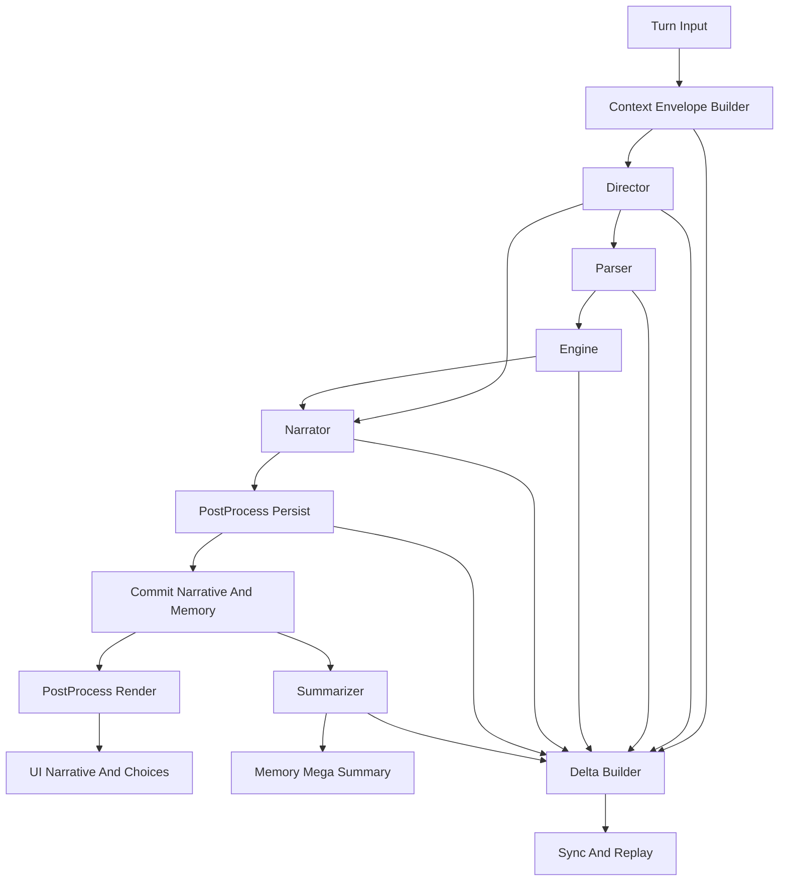

# 提示词演化协同架构设计基线

## 0. 文档目的与边界

本文为下一子任务 模板与接口重写 提供统一设计基线，范围仅包含：

- AI 演化能力矩阵
- Director Parser Narrator Summarizer PostProcess 协同架构
- Context Envelope 与回合 Delta 协议草案
- 决策优先级与里程碑建议

不包含任何业务代码改动与实现细节。

---

## 1. 现状断点与设计目标

### 1.1 已识别高优先断点

1. 联机链路 chatHistory 断裂，单机与联机上下文来源不一致
2. Director 输出契约与消费侧解析约束存在漂移风险
3. persist 后处理职责分散，抽取逻辑在多个层次割裂
4. Summarizer 未复用统一提示词拼装链，导致协议与可观测性不一致

### 1.2 总体目标

- 将提示词体系从 单 Agent 模板 转为 多 Agent 协议化协作
- 将上下文组织从散点拼接 转为统一 Envelope
- 将回合信息同步从整包快照 转为 Delta 增量协议
- 在保持现有兼容约束的前提下，支持后续可联动 可演化

---

## 2. AI 演化需求能力矩阵

| 阶段     | 能力项            | 所需上下文                                                 | 提示词职责                                           | 可观测指标                            |
| -------- | ----------------- | ---------------------------------------------------------- | ---------------------------------------------------- | ------------------------------------- |
| 当前可用 | 规则叙事分离      | resultFrame userInput basic gameState                      | Parser 生成 RuleScript Narrator 生成正文             | RuleScript 解析成功率 Narrator 成功率 |
| 当前可用 | 分用途预设激活    | activePresetByPurpose preset metadata                      | 各 Agent 按用途加载独立模板                          | 各 purpose 命中率 错用 purpose 次数   |
| 当前可用 | 三级记忆注入      | memoryData markerConfig                                    | Narrator Parser 读取 memorySummary marker            | 记忆注入命中率 压缩触发率             |
| 当前可用 | 标签抽取          | memory_summary choices                                     | PostProcess persist render 两阶段抽取                | 标签抽取成功率 标签残留率             |
| 近中期   | 上下文统一封装    | Envelope session turn history memory world entities        | 所有 Agent 只读同一上下文结构                        | 上下文字段缺失率 字段回退率           |
| 近中期   | 导演契约稳定化    | director output schema archive snapshot outline foreshadow | Director 严格输出结构化标签 Parser Narrator 严格消费 | Director 标签合规率 解析失败率        |
| 近中期   | 回合增量同步      | Delta patches commitStatus sequence                        | 各 Agent 只发增量并声明版本                          | Delta 应用成功率 重放成功率           |
| 近中期   | 后处理职责收敛    | persist render pipeline warnings extracted                 | PostProcess 成为唯一结构化提取入口                   | 抽取重复率 警告率                     |
| 近中期   | Summarizer 协同化 | summarizer preset envelope subset memory segment           | Summarizer 通过统一 assembler executor 链路调用      | Summarizer 输出可追踪率 压缩质量评分  |
| 长期     | 协同策略可演化    | capability flags policy profile                            | 按玩法动态切换协同策略                               | 策略切换成功率 回退率                 |
| 长期     | 跨模式一致性      | solo multiplayer 同构 Envelope Delta                       | 单机联机复用同一提示词协议                           | 模式间行为偏差率                      |
| 长期     | 全链路可观测      | trace span agent rawOutput metrics                         | 每个 Agent 可追踪 输入输出可审计                     | 端到端可追踪覆盖率                    |

能力矩阵核心结论：

- 当前能力已具备多 Agent 运行基础，但缺统一协议层
- 近中期收益最高的是 Envelope 统一 + Director 契约收敛 + Delta 增量
- 长期演化应建立在协议版本化与策略可切换之上

---

## 3. 提示词协同架构蓝图

### 3.1 角色边界与契约

| 角色        | 输入                                                                              | 输出                                                            | 必须负责                              | 禁止负责                          | 关键耦合点                    |
| ----------- | --------------------------------------------------------------------------------- | --------------------------------------------------------------- | ------------------------------------- | --------------------------------- | ----------------------------- |
| Director    | Envelope 中 history world archive outline foreshadow turn                         | plot_directives narrative_hints archive_updates outline_updates | 世界推演 剧情编排 指导下游            | 不直接写规则结果 不直接写最终叙事 | 与 Parser Narrator 的指导契约 |
| Parser      | Envelope 中 playerInput plotDirectives operationDefinitions characterSheet memory | RuleScript                                                      | 将意图与导演指导编译为可执行脚本      | 不生成文学叙事 不改写导演意图语义 | 与 Engine 的规则契约          |
| Narrator    | Envelope 中 resultFrame narrativeHints narrativeState memory world                | narrative raw text 可含结构化标签                               | 依据结果帧生成沉浸叙事                | 不虚构未经结算机械结果            | 与 PostProcess 的标签协议     |
| PostProcess | narrative raw text rules builtin ids                                              | cleanNarrative extracted warnings                               | persist render 两阶段结构化清洗与抽取 | 不承担剧情推演 不修改规则状态     | 与 UI Memory 的数据提取契约   |
| Summarizer  | Envelope 子集 memory segments history window                                      | megaSummary 或 memory delta                                     | 压缩记忆并维护长期可读性              | 不生成当回合规则结论              | 与 Memory 管线的压缩协议      |

### 3.2 状态流转与耦合点

### 3.3 耦合收敛原则

1. 所有 Agent 仅依赖 Envelope 字段，不直接感知上游内部实现
2. Agent 间只通过显式输出字段传递，不通过隐式变量共享
3. PostProcess 成为唯一标签抽取中枢，避免 persist render 逻辑漂移
4. Summarizer 接入统一拼装链，保证与 Parser Narrator 同协议同观测

---

## 4. 协同协议草案

## 4.1 Context Envelope

### 4.1.1 顶层结构

| 字段            | 类型   | 必填 | 说明                                                     |
| --------------- | ------ | ---- | -------------------------------------------------------- |
| envelopeVersion | string | 是   | 协议版本，建议 semver                                    |
| compatibility   | object | 是   | 兼容声明与降级策略                                       |
| session         | object | 是   | 会话身份与模式信息                                       |
| turn            | object | 是   | 回合编号 输入 提交信息                                   |
| presets         | object | 是   | activePresetByPurpose 快照与版本                         |
| history         | object | 是   | 历史消息窗口与截断元信息                                 |
| memory          | object | 是   | memorySummary 配置快照与分段数据                         |
| world           | object | 否   | scenario worldInfo archiveData                           |
| entities        | object | 否   | gameState entityEffects inventoryData entityDisplayNames |
| directives      | object | 否   | plotDirectives narrativeHints                            |
| operations      | object | 否   | operationDefinitions 与规则 schema                       |
| postProcess     | object | 是   | 内置规则 ID 与阶段策略                                   |
| ioContract      | object | 是   | 结构化标签约定与输出模式                                 |
| trace           | object | 否   | correlationId commandId agent spans                      |

### 4.1.2 关键子字段约定

| 字段路径                                                                                                  | 类型           | 必填 | 兼容要求                                             |
| --------------------------------------------------------------------------------------------------------- | -------------- | ---- | ---------------------------------------------------- |
| presets.activeByPurpose.narrative parser summarizer director                                              | string or null | 是   | 与 activePresetByPurpose 语义一致                    |
| history.messages                                                                                          | array          | 是   | 保持 role content 结构                               |
| history.window.limit total startIndex endIndex truncated                                                  | number bool    | 是   | 解决联机 chatHistory 断裂定位问题                    |
| memory.config.recentNarrativeCount miniSummaryCount megaSummaryMode megaSummaryLimit compressionThreshold | number string  | 是   | 与 memorySummary markerConfig 完全同语义             |
| postProcess.builtinRuleIds                                                                                | string array   | 是   | 必含 builtin:memory-summary builtin:choices          |
| ioContract.tags.memorySummary                                                                             | string         | 是   | 固定 memory_summary                                  |
| ioContract.tags.choices                                                                                   | string         | 是   | 固定 choices                                         |
| ioContract.director.requiredTags                                                                          | string array   | 是   | 固定 plot_directives narrative_hints archive_updates |
| ioContract.director.optionalTags                                                                          | string array   | 是   | 包含 outline_updates                                 |

### 4.1.3 与现有契约映射

- Envelope 输入域对齐现有 VariableContext 语义
- Envelope 管线域对齐 IRNR Pipeline Input 与 Blackboard 字段
- 输出域对齐 IrnrPipelineResult 中 ruleScript resultFrame narrativeText finalEntityStates createdNpcs archiveUpdates

## 4.2 回合 Delta 协议

### 4.2.1 Delta 包结构

| 字段            | 类型   | 必填 | 说明                                                   |
| --------------- | ------ | ---- | ------------------------------------------------------ |
| deltaVersion    | string | 是   | Delta 协议版本                                         |
| envelopeVersion | string | 是   | 对应 Envelope 版本                                     |
| turn            | number | 是   | 当前回合                                               |
| baseTurn        | number | 是   | 增量基线回合                                           |
| sequence        | number | 是   | 同回合增量序号                                         |
| source          | string | 是   | director parser engine narrator postprocess summarizer |
| commitStatus    | string | 是   | buffered committed discarded                           |
| patches         | array  | 是   | 增量变更集合                                           |
| checksum        | string | 否   | 重放一致性校验                                         |

### 4.2.2 Patch 类型

| patch.type            | payload                                   | 说明                  |
| --------------------- | ----------------------------------------- | --------------------- |
| history.append        | messages                                  | 新增历史消息          |
| directives.replace    | plotDirectives narrativeHints             | Director 指导更新     |
| rulescript.replace    | ruleScript                                | Parser 输出更新       |
| resultFrame.replace   | resultFrame                               | Engine 结算更新       |
| narrative.replace     | raw clean                                 | Narrator 与清洗后正文 |
| postprocess.extracted | miniSummary choices warnings              | 标签抽取结果          |
| memory.appendMini     | miniSummary entries                       | 小总结增量            |
| memory.appendMega     | megaSummary entries                       | 大总结增量            |
| archive.apply         | archiveUpdates                            | 世界档案增量          |
| entities.patch        | valueChanges tagChanges structuralChanges | 实体状态增量          |

### 4.2.3 Delta 约束

1. 同一回合 sequence 单调递增
2. 任何 committed 前可出现多条 buffered
3. 出现 discarded 时该回合后续 patch 必须停止
4. 可通过 baseTurn + sequence 完成确定性重放

## 4.3 标签与结构化输出约定

### 4.3.1 Director 输出标签

- 必须：plot_directives narrative_hints archive_updates
- 可选：outline_updates
- 不允许额外顶层标签混入协议区域

### 4.3.2 Narrator 输出标签

- memory_summary 用于 persist 阶段抽取 miniSummary
- choices 用于 render 阶段抽取交互选项
- 标签正文从 narrative 正文剥离后不得残留

### 4.3.3 Parser 输出约定

- 顶层结构固定 version actions
- 信息不足时返回最小安全脚本 actions 空数组

## 4.4 失败降级策略

| 失败点               | 触发条件           | 降级策略                                     | 风险控制           |
| -------------------- | ------------------ | -------------------------------------------- | ------------------ |
| history 缺窗         | 联机窗口读取异常   | history.truncated true 并继续最小上下文执行  | 避免整回合阻断     |
| Director 解析失败    | 必需标签缺失       | 回退到空 directives 并记录 parse_error delta | 保证 Parser 可执行 |
| Parser 非法 JSON     | 解析失败           | 强制写入 version 2 actions 空数组            | 保证 Engine 安全   |
| Narrator 失败        | AI 调用异常        | 不提交 narrative patch 仅保留规则结果        | 避免脏叙事落盘     |
| PostProcess 规则失败 | 正则异常           | 跳过失败规则并保留 warnings                  | 保证正文可持久化   |
| Summarizer 失败      | 压缩为空或调用失败 | 延后压缩并保留 miniSummary                   | 保证记忆不丢失     |

---

## 5. 决策记录与优先级

## 5.1 P0 P1 P2

| 优先级 | 事项                                   | 复杂度 | 风险 | 收益 | 取舍理由                                 |
| ------ | -------------------------------------- | ------ | ---- | ---- | ---------------------------------------- |
| P0     | 统一 Context Envelope                  | 中     | 中   | 高   | 直接修复上下文裂缝，是所有重写前置条件   |
| P0     | Director 契约 schema 化                | 中     | 中   | 高   | 消除提示模板与解析器漂移，避免全链路脆断 |
| P0     | PostProcess 职责收敛                   | 低     | 低   | 高   | 立即消除 persist render 抽取割裂         |
| P0     | 联机 history window 元数据标准化       | 中     | 中   | 高   | 直接解决 chatHistory 断裂可观测性        |
| P1     | Summarizer 接入统一 assembler executor | 中     | 中   | 中高 | 提升一致性并减少双轨维护成本             |
| P1     | Delta 协议落地                         | 中高   | 中   | 高   | 支撑联机可重放与演化扩展                 |
| P1     | 协议级可观测指标体系                   | 低中   | 低   | 中高 | 支持后续调优与回归定位                   |
| P2     | 协同策略编排化                         | 高     | 中高 | 中高 | 适合能力稳定后再演进                     |
| P2     | 标签协议扩展族                         | 中     | 中   | 中   | 需建立在基础标签稳定后                   |
| P2     | 玩法导向动态上下文裁剪                 | 高     | 中   | 中高 | 需要累计统计与策略反馈闭环               |

## 5.2 里程碑建议

- M0 协议冻结：冻结 Envelope 字段名 标签名 Delta 基本类型
- M1 基础协同：Director Parser Narrator PostProcess 全部改为协议输入输出
- M2 联机增量：Delta 在单机联机统一生效，支持重放与回滚
- M3 演化扩展：Summarizer 与策略编排进入统一协议治理

注：里程碑仅定义目标边界，不展开实现步骤细节。

---

## 6. 与现有约束兼容性说明

| 现有约束                           | 兼容策略                                                                                                    |
| ---------------------------------- | ----------------------------------------------------------------------------------------------------------- |
| Preset PresetPurpose               | 保持四用途 narrative parser summarizer director 不变                                                        |
| activePresetByPurpose              | Envelope 中原样快照 activeByPurpose 并作为运行时事实源                                                      |
| marker 协议                        | 不改 marker id 与 render 语义，仅将配置快照纳入 Envelope                                                    |
| memorySummary 配置语义             | 五字段 recentNarrativeCount miniSummaryCount megaSummaryMode megaSummaryLimit compressionThreshold 全量保留 |
| post-process 内置规则 ID           | 固定保留 builtin:memory-summary builtin:choices，禁止重命名                                                 |
| IRNR 契约字段                      | 输出继续兼容 ruleScript resultFrame narrativeText finalEntityStates createdNpcs archiveUpdates              |
| memory_summary 与 choices 标签协议 | 保持标签名不变，分别绑定 persist 与 render 抽取阶段                                                         |

---

## 7. 交付物定位

本设计文档作为下一子任务 模板与接口重写 的唯一架构基线，重点是协议边界与协同职责，不涉及任何代码实现或补丁。
