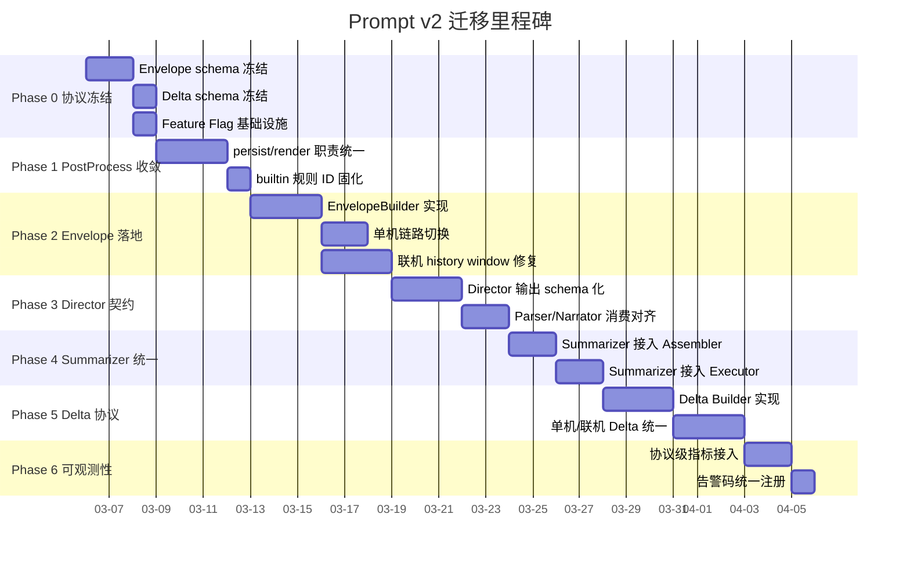
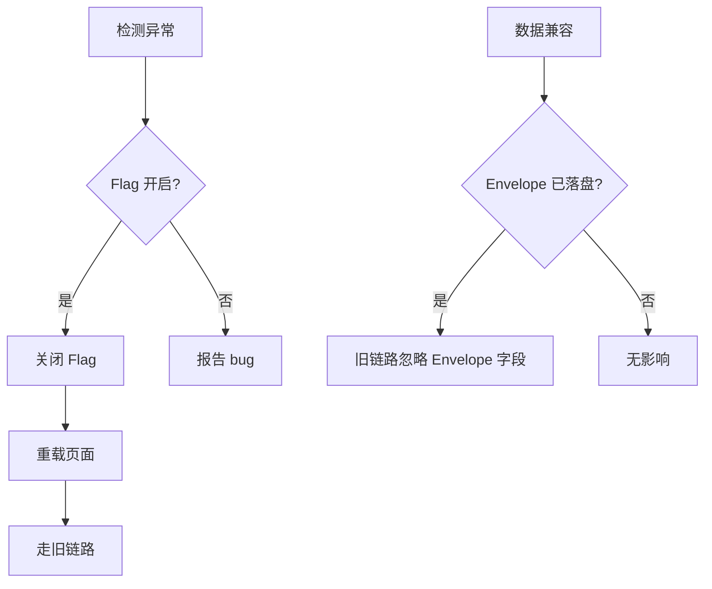
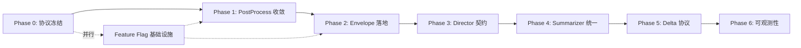

# 提示词 v2 迁移顺序、回归验证与风险控制方案

> **文档状态**：规划稿（仅规划，不改代码）
> **创建日期**：2026-03-05
> **继承输入**：
> 1. 现状盘点与断点（S1/S2/S3）
> 2. [协同架构设计基线](./prompt-evolution-collaboration-architecture.md)
> 3. [模板与接口规范](./prompt-v2-template-and-interface-spec.md)
>
> **严格边界**：不输出代码补丁；不重复前两份文档的定义细节。

---

## 0. 术语与引用约定

| 缩写        | 全称                                   | 出处            |
| ----------- | -------------------------------------- | --------------- |
| Envelope    | Context Envelope v2.0.0                | 协同架构 §4.1   |
| Delta       | 回合 Delta 协议 v1.0.0                 | 协同架构 §4.2   |
| IRNR        | Intent → RuleScript → Narrate → Render | 既有管线        |
| PostProcess | 后处理 persist/render 两阶段           | 模板规范 §4.2.4 |
| Assembler   | 统一拼装器                             | 模板规范 §4.2.2 |
| Executor    | 统一执行器                             | 模板规范 §4.2.3 |

**负责人角色定义**（风险台账用）：

| 角色         | 职责                                 | 主要涉及模块                      |
| ------------ | ------------------------------------ | --------------------------------- |
| 协议 Owner   | Envelope/Delta schema 治理与版本演进 | `lib/prompt`、`domain/`           |
| 管线 Owner   | IRNR 管线拼装与执行链路              | `modules/chat/handlers`、黑板管线 |
| 联机 Owner   | 联机链路 chatHistory/Yjs 同步        | `modules/room/`、`core/yjs/`      |
| 后处理 Owner | PostProcess persist/render 收敛      | `lib/prompt/post-process`         |
| 记忆 Owner   | Summarizer 与 Memory 管线            | `modules/memory/`                 |
| QA Owner     | 回归验证与自动化测试                 | 测试目录                          |

---

## 1. 迁移阶段总览



---

## 2. 分阶段迁移详细设计

### Phase 0：协议冻结与基础设施

| 维度             | 内容                                                                                                                                                                                          |
| ---------------- | --------------------------------------------------------------------------------------------------------------------------------------------------------------------------------------------- |
| **目标**         | 冻结 Envelope 字段名、标签名、Delta 基本类型；建立 Feature Flag 开关基础设施                                                                                                                  |
| **改动面**       | `domain/` 新增类型定义；`lib/prompt/` 新增 schema 常量文件；`stores/` 或 `lib/` 新增 feature flag 机制                                                                                        |
| **前置条件**     | 协同架构文档与模板规范文档已确认                                                                                                                                                              |
| **完成定义 DoD** | ① Envelope TypeScript interface 已导出且 CI 编译通过 ② Delta TypeScript interface 已导出 ③ feature flag `USE_ENVELOPE_V2` 可通过 localStorage 或 Settings 面板切换 ④ 所有冻结项列表有对应常量 |
| **回滚点**       | 删除新增类型文件即可；Flag 默认 `false`，不影响现有链路                                                                                                                                       |

**兼容约束核对**：
- `PresetPurpose` 四值不变
- `activePresetByPurpose` 语义保持
- `builtin:memory-summary` / `builtin:choices` ID 固化为常量

---

### Phase 1：PostProcess 职责收敛

| 维度             | 内容                                                                                                                                                                                         |
| ---------------- | -------------------------------------------------------------------------------------------------------------------------------------------------------------------------------------------- |
| **目标**         | 消除 persist/render 抽取逻辑在多层次割裂的问题，PostProcess 成为唯一标签抽取中枢                                                                                                             |
| **改动面**       | `lib/prompt/post-process` 重构为统一两阶段入口；移除管线中散落的标签正则抽取                                                                                                                 |
| **前置条件**     | Phase 0 完成（内置规则 ID 已冻结）                                                                                                                                                           |
| **完成定义 DoD** | ① `PostProcessInput`/`PostProcessOutput` 接口落地 ② persist 阶段抽取 `memory_summary`、render 阶段抽取 `choices` ③ 落盘文本不残留 `<memory_summary>` `<choices>` 标签 ④ 现有手测场景全部通过 |
| **回滚点**       | 保留旧抽取函数，flag 控制走新旧路径                                                                                                                                                          |

**兼容约束核对**：
- `builtin:memory-summary` 与 `builtin:choices` 语义保持
- 标签路径 `<memory_summary>` 与 `<choices>` 继续可被提取

---

### Phase 2：Context Envelope 落地与联机 history 修复

| 维度             | 内容                                                                                                                                                                                                                                                          |
| ---------------- | ------------------------------------------------------------------------------------------------------------------------------------------------------------------------------------------------------------------------------------------------------------- |
| **目标**         | 实现 EnvelopeBuilder，单机与联机上下文统一为 Envelope 结构；修复联机 chatHistory 断裂                                                                                                                                                                         |
| **改动面**       | 新增 `EnvelopeBuilder`（可放 `lib/prompt/envelope/`）；改造 `buildVariableContext` 产出 Envelope；联机链路 `HistoryBuilder` 加入 `window` 元数据                                                                                                              |
| **前置条件**     | Phase 1 完成（PostProcess 已收敛，Envelope 中 `postProcess.builtinRuleIds` 可正确填充）                                                                                                                                                                       |
| **完成定义 DoD** | ① MVP 字段清单全部可由现有管线构建 ② 单机回合走 Envelope 构建 → Assembler → Executor 链路 ③ 联机 `history.window.truncated` 可正确标记 ④ `compatibility.legacyTags = true` 保证旧链路兼容 ⑤ `presets.activeByPurpose` 快照与 `activePresetByPurpose` 语义一致 |
| **回滚点**       | Feature Flag `USE_ENVELOPE_V2 = false` 回退到旧 `VariableContext` 构建路径                                                                                                                                                                                    |

**兼容约束核对**：
- `activePresetByPurpose` 原样快照入 Envelope
- `memorySummary` 五字段配置语义保持
- marker 协议不改 id 与 alias

---

### Phase 3：Director 契约统一

| 维度             | 内容                                                                                                                                                                                                                                                   |
| ---------------- | ------------------------------------------------------------------------------------------------------------------------------------------------------------------------------------------------------------------------------------------------------ |
| **目标**         | Director 输出 schema 化，消除提示模板与解析器漂移；Parser/Narrator 严格按契约消费 directives                                                                                                                                                           |
| **改动面**       | Director 预设模板改为声明 `requiredTags`/`optionalTags`；`parseDirectorOutput` 增加 schema 校验；Parser/Narrator 输入槽位改为从 Envelope.directives 读取                                                                                               |
| **前置条件**     | Phase 2 完成（Envelope 已可提供 directives 字段）                                                                                                                                                                                                      |
| **完成定义 DoD** | ① Director 输出必含 `plot_directives` `narrative_hints` `archive_updates` ② 缺失必填标签时触发降级并记录 `director_parse_failed` ③ Parser 从 `Envelope.directives.plotDirectives` 读取指导 ④ Narrator 从 `Envelope.directives.narrativeHints` 读取提示 |
| **回滚点**       | 解析失败时回退空 directives（降级策略已在协同架构 §4.4 定义）                                                                                                                                                                                          |

---

### Phase 4：Summarizer 接入统一 Assembler/Executor

| 维度             | 内容                                                                                                                                                                             |
| ---------------- | -------------------------------------------------------------------------------------------------------------------------------------------------------------------------------- |
| **目标**         | Summarizer 不再直连 aiManager，改走统一 Assembler → Executor 链路                                                                                                                |
| **改动面**       | `modules/memory/` 中 Summarizer 调用改为 Assembler 输入 + Executor 执行；`summarizer` purpose 预设通过 Activation Resolver 加载                                                  |
| **前置条件**     | Phase 3 完成（统一 Assembler/Executor 已验证 Director/Parser/Narrator 三路）                                                                                                     |
| **完成定义 DoD** | ① Summarizer 通过 `ActivationResolver` 获取预设 ② 通过 `Assembler` 拼装消息 ③ 通过 `Executor` 调用 AI ④ 输出 `memoryDelta.appendMega` 结构化结果 ⑤ 失败时保留 miniSummary 不丢失 |
| **回滚点**       | Summarizer 保留旧直连 aiManager 路径，flag 控制                                                                                                                                  |

---

### Phase 5：Delta 协议与可观测性接入

| 维度             | 内容                                                                                                                                                                   |
| ---------------- | ---------------------------------------------------------------------------------------------------------------------------------------------------------------------- |
| **目标**         | Delta 在单机与联机统一生效，支持回合重放与回滚                                                                                                                         |
| **改动面**       | 新增 `DeltaBuilder`；各 Agent 执行后产出 Delta patch；联机 Yjs 层接入 Delta 同步                                                                                       |
| **前置条件**     | Phase 4 完成（所有 Agent 均走统一链路，Delta 可统一采集）                                                                                                              |
| **完成定义 DoD** | ① 每回合产出完整 Delta 链（sequence 单调递增）② `commitStatus` 终态（committed/discarded）可确定 ③ 通过 `baseTurn + sequence` 可确定性重放 ④ 单机与联机 Delta 结构一致 |
| **回滚点**       | Delta 构建为只读消费，不反向改写阶段产物；停用 DeltaBuilder 不影响管线正确性                                                                                           |

---

### Phase 6：协议级可观测指标体系

| 维度             | 内容                                                                                                |
| ---------------- | --------------------------------------------------------------------------------------------------- |
| **目标**         | 统一告警码注册、协议级指标体系，支持后续调优与回归定位                                              |
| **改动面**       | 统一 `warningCodes` 注册表；接入 `trace.correlationId`；输出 AiOutputLog 可查看全链路               |
| **前置条件**     | Phase 5 完成                                                                                        |
| **完成定义 DoD** | ① 全部 warningCodes 在注册表有定义 ② 每回合可追踪 correlationId ③ AiInsightDialog 可查看 Delta 链条 |
| **回滚点**       | 可观测性为增量功能，不影响核心链路                                                                  |

---

## 3. 回归验证矩阵

### 3.1 验证层级定义

| 层级          | 说明                                         | 触发条件          |
| ------------- | -------------------------------------------- | ----------------- |
| L1 单人链     | 单机模式完整回合                             | 每个 Phase 完成后 |
| L2 联机链     | 多人模式完整回合                             | Phase 2+          |
| L3 降级链     | 各 Agent 失败时的降级路径                    | Phase 2+          |
| L4 历史重放   | 已有存档加载后行为一致                       | Phase 2+          |
| L5 预设切换   | 运行时切换 purpose 预设                      | Phase 2+          |
| L6 内置标签   | `memory_summary` / `choices` 抽取            | Phase 1+          |
| L7 内置规则   | `builtin:memory-summary` / `builtin:choices` | Phase 1+          |
| L8 性能与成本 | Token 消耗、延迟、内存                       | Phase 4+          |

### 3.2 测试矩阵

| #   | 验证项                 | 层级     | 最小可执行步骤                                                     | 通过标准                                                                                         | 自动化建议        |
| --- | ---------------------- | -------- | ------------------------------------------------------------------ | ------------------------------------------------------------------------------------------------ | ----------------- |
| T01 | 单机完整回合           | L1       | 新建游戏 → 输入行动 → 等待 AI 回复 → 查看叙事                      | 叙事正常显示、规则结算正确、无控制台错误                                                         | Playwright E2E    |
| T02 | 单机 Director 指导生效 | L1       | 开启 Director → 查看 AiInsight 确认 plot_directives 非空           | Director 输出含必填三标签                                                                        | 管线单元测试      |
| T03 | 单机 PostProcess 抽取  | L1 L6 L7 | 回合结束 → 检查 miniSummary 已写入 Memory → 检查 choices 已渲染    | `memory_summary` 已抽取且落盘文本无残留                                                          | 后处理单元测试    |
| T04 | 单机预设切换           | L1 L5    | 游戏中切换 narrative 预设 → 下一回合使用新预设                     | 新预设生效、旧预设不残留                                                                         | 手测              |
| T05 | 联机完整回合           | L2       | Host 建房 → Guest 加入 → 双方提交行动 → AI 生成 → 双方看到一致叙事 | 双端叙事一致、history.window 元数据正确                                                          | Playwright 双实例 |
| T06 | 联机 history 连续性    | L2       | 连续进行 5+ 回合 → 检查 history.window                             | startIndex/endIndex 连续、truncated 标记正确                                                     | 管线集成测试      |
| T07 | Director 解析失败降级  | L3       | 模拟 Director 返回不含必填标签                                     | 记录 director_parse_failed → Parser 继续执行 → 回合不中断                                        | 管线单元测试      |
| T08 | Parser 解析失败降级    | L3       | 模拟 Parser 返回非法 JSON                                          | 回退最小安全脚本 `{version:2,actions:[]}` → Engine 安全                                          | 管线单元测试      |
| T09 | Narrator 失败降级      | L3       | 模拟 Narrator AI 调用异常                                          | 不提交脏叙事 → 规则结果保留 → 回合可继续                                                         | 管线单元测试      |
| T10 | Summarizer 失败降级    | L3       | 模拟 Summarizer 返回空                                             | 延后压缩 → miniSummary 保留 → 不丢记忆                                                           | 管线单元测试      |
| T11 | 历史存档加载           | L4       | 加载 Phase 前创建的存档 → 继续游戏                                 | 不 crash、旧格式可兼容、新回合走新链路                                                           | 手测 + 快照比对   |
| T12 | Envelope 字段完整性    | L1 L2    | 断点检查 Envelope 对象                                             | MVP 字段清单全部有值、无 undefined 必填字段                                                      | 类型守卫断言      |
| T13 | Delta 重放一致性       | L1 L2    | 记录 Delta 链 → 清空状态 → 重放                                    | 重放后状态与原始一致                                                                             | Delta 重放测试    |
| T14 | 标签与结构化并存       | L6       | Director 同时输出标签与结构化 → PostProcess 处理                   | 结构化优先、标签保留告警、无冲突                                                                 | 后处理单元测试    |
| T15 | builtin 规则 ID 固化   | L7       | 检查 PostProcess 注册的规则                                        | `builtin:memory-summary` 与 `builtin:choices` 存在且不可重命名                                   | 常量断言测试      |
| T16 | Token 消耗对比         | L8       | 同场景 v1 vs v2 对比                                               | v2 Token 消耗不超过 v1 的 120%                                                                   | 计量脚本          |
| T17 | 延迟对比               | L8       | 同场景 v1 vs v2 回合完成时间                                       | v2 端到端延迟不超过 v1 的 130%                                                                   | 计时脚本          |
| T18 | marker 协议兼容        | L5 L6    | 自定义预设中使用 memorySummary marker → 检查注入                   | marker id 与 alias 语义不变                                                                      | 手测              |
| T19 | IRNR 输出兼容          | L1 L2    | 检查管线输出                                                       | ruleScript/resultFrame/narrativeText/finalEntityStates/createdNpcs/archiveUpdates 字段名语义不变 | 类型断言          |
| T20 | Feature Flag 回退      | L1       | 关闭 `USE_ENVELOPE_V2` → 执行回合                                  | 完全走旧链路、无报错                                                                             | 手测              |

### 3.3 各 Phase 必须通过的验证项

| Phase | 必须通过                               | 建议通过         |
| ----- | -------------------------------------- | ---------------- |
| 0     | T15, T20                               | —                |
| 1     | T03, T15, T20                          | T01              |
| 2     | T01, T03, T05, T06, T12, T18, T19, T20 | T04, T11         |
| 3     | T02, T07, T14                          | T08              |
| 4     | T10, T16                               | T17              |
| 5     | T13                                    | T05 全链路 Delta |
| 6     | 全部                                   | —                |

---

## 4. 风险台账

### 4.1 风险登记簿

| #   | 风险项                                                                      | 概率 | 影响 | 检测信号                                                    | 应对策略                                                                                           | 负责人                        |
| --- | --------------------------------------------------------------------------- | ---- | ---- | ----------------------------------------------------------- | -------------------------------------------------------------------------------------------------- | ----------------------------- |
| R01 | **协议漂移**：Envelope 字段在实现中被非计划修改                             | 中   | 高   | CI 类型检查失败；Envelope schema hash 变化                  | ① schema 文件锁定 review 权限 ② CI 增加 schema hash 比对 ③ 变更需 RFC                              | 协议 Owner (`lib/prompt`)     |
| R02 | **时态漂移**：history.window 元数据在单机/联机间不一致                      | 中   | 高   | 联机回合 history.truncated 标记错误；单机与联机叙事质量差异 | ① HistoryBuilder 统一实现 ② 增加 T06 自动化 ③ 联机 SyncBridge 校验 window 元数据                   | 联机 Owner (`modules/room`)   |
| R03 | **双链行为不一致**：Feature Flag 切换后旧链路与新链路输出不同               | 中   | 高   | A/B 对比叙事差异超阈值                                      | ① T20 回归必测 ② 灰度期双链路对比日志 ③ 不一致时回退旧链路                                         | 管线 Owner                    |
| R04 | **缓存时序**：Envelope 构建读取的 store 快照与实际状态不同步                | 低   | 高   | 偶发的 Envelope 字段过期；联机端状态闪烁                    | ① EnvelopeBuilder 在 commandHandler 入口同步构建 ② 不缓存 Envelope 跨回合                          | 管线 Owner                    |
| R05 | **降级失效**：降级路径未被触发过，生产首次触发时 crash                      | 中   | 高   | 降级代码无测试覆盖；T07-T10 首次执行发现 bug                | ① Phase 3 前必须完成 T07-T10 ② 降级路径加入 CI                                                     | QA Owner                      |
| R06 | **成本飙升**：Envelope 字段过多导致 system prompt Token 膨胀                | 低   | 中   | 单回合 Token 超预算 120%                                    | ① T16 每 Phase 执行 ② Envelope 字段按需裁剪策略 ③ 超标时启用 context trimming                      | 协议 Owner                    |
| R07 | **PostProcess 抽取残留**：重构后标签未被完全清除                            | 低   | 中   | 落盘文本含 `<memory_summary>` 或 `<choices>` 残留           | ① T03 每 Phase 执行 ② 增加落盘文本扫描断言                                                         | 后处理 Owner                  |
| R08 | **Director 标签合规率低**：AI 输出不符合 schema 约束                        | 高   | 中   | director_parse_failed 告警率 > 20%                          | ① 优化 Director prompt 中的输出格式约束 ② 增加 few-shot 示例 ③ 合规率低于 80% 时暂停推进           | 管线 Owner                    |
| R09 | **Summarizer 双轨过渡期不一致**                                             | 低   | 中   | 新旧 Summarizer 产出大总结内容差异大                        | ① 灰度期新旧并行对比 ② 差异超阈值回退旧路径                                                        | 记忆 Owner (`modules/memory`) |
| R10 | **Delta 重放不确定**：Delta 链断裂导致重放失败                              | 中   | 中   | T13 重放后状态不一致                                        | ① sequence 单调递增断言 ② committed 终态检查 ③ 重放失败时降级为快照恢复                            | 协议 Owner                    |
| R11 | **预设兼容断裂**：用户自定义预设在 v2 下失效                                | 低   | 高   | 自定义预设加载报错或 slot 映射失败                          | ① Assembler 对 legacy preset 做兼容映射 ② slotDefaults 填充缺失字段 ③ 发现不兼容时保留旧 assembler | 管线 Owner                    |
| R12 | **联机 Envelope 构建延迟**：Guest 端 store 同步不及时导致 Envelope 字段缺失 | 低   | 高   | 联机 Envelope 必填字段为 undefined                          | ① Envelope 构建加入字段完整性校验 ② 缺失时 fallbackPolicy safe-minimal 生效                        | 联机 Owner                    |

### 4.2 风险概率-影响矩阵

```
影响 ↑
高  │ R04 R12 R11 │ R01 R02 R03 R05 │
    │              │                  │
中  │ R07 R09      │ R08 R10          │ R06
    │              │                  │
低  │              │                  │
    └──────────────┴──────────────────┴──────→ 概率
         低              中               高
```

---

## 5. 灰度策略

### 5.1 开关体系

| 开关名                    | 类型         | 默认值  | 控制范围                           | 回退动作                     |
| ------------------------- | ------------ | ------- | ---------------------------------- | ---------------------------- |
| `USE_ENVELOPE_V2`         | 全局 boolean | `false` | Envelope 构建路径                  | 回退 VariableContext         |
| `USE_UNIFIED_POSTPROCESS` | 全局 boolean | `false` | PostProcess 统一两阶段             | 回退分散抽取                 |
| `USE_DIRECTOR_SCHEMA`     | 全局 boolean | `false` | Director 输出 schema 校验          | 回退宽松解析                 |
| `USE_SUMMARIZER_UNIFIED`  | 全局 boolean | `false` | Summarizer Assembler/Executor 链路 | 回退直连 aiManager           |
| `USE_DELTA_PROTOCOL`      | 全局 boolean | `false` | Delta 构建与同步                   | 停用 Delta（不影响核心链路） |

### 5.2 分批策略

由于 Lyra Next 为客户端应用（非 SaaS 多租户），灰度分批以 Feature Flag 为核心：

| 批次  | 范围                    | 条件                      | 持续时间    |
| ----- | ----------------------- | ------------------------- | ----------- |
| 内测  | 开发者本地              | Flag 手动开启             | 每 Phase 内 |
| Alpha | 新建游戏                | Flag 默认开启 for 新存档  | 1-2 周      |
| Beta  | 全量新存档 + 旧存档可选 | Flag 对旧存档提供迁移入口 | 1-2 周      |
| GA    | 全量                    | Flag 移除，旧路径代码删除 | —           |

### 5.3 回退机制



### 5.4 数据兼容桥接

| 场景                        | 桥接策略                                                                |
| --------------------------- | ----------------------------------------------------------------------- |
| v1 存档在 v2 环境加载       | EnvelopeBuilder 对缺失字段填充默认值；`compatibility.legacyTags = true` |
| v2 存档回退到 v1 环境       | Envelope 字段为额外字段，v1 链路忽略；PostProcess 抽取逻辑兼容两种输入  |
| 联机房间 Host v2 / Guest v1 | Host 构建 Envelope 并执行；Guest 仅消费同步结果，不依赖 Envelope        |
| 自定义预设 v1 格式          | Assembler 兼容无 slotPolicy 的旧预设；缺失 slot 用 slotDefaults 填充    |

---

## 6. 交付建议

### 6.1 实施前检查门槛（Go/No-Go）

| #   | 检查项                                | 标准                                                   | 阻断级别                     |
| --- | ------------------------------------- | ------------------------------------------------------ | ---------------------------- |
| G01 | Envelope TypeScript interface CI 编译 | 零错误                                                 | 🔴 No-Go                      |
| G02 | Delta TypeScript interface CI 编译    | 零错误                                                 | 🔴 No-Go                      |
| G03 | Feature Flag 基础设施可用             | localStorage 切换即时生效                              | 🔴 No-Go                      |
| G04 | 冻结项常量覆盖                        | 四 purpose + 两 builtin ID + 两标签路径 = 8 项全有常量 | 🔴 No-Go                      |
| G05 | 协同架构文档已确认                    | 无未决议题                                             | 🔴 No-Go                      |
| G06 | 模板规范文档已确认                    | 无未决议题                                             | 🔴 No-Go                      |
| G07 | 回归验证矩阵 T15, T20 通过            | 冻结项与旧链路正常                                     | 🔴 No-Go                      |
| G08 | 开发环境 pnpm build 无新增 error      | 零新增                                                 | 🟡 条件通过                   |
| G09 | 联机测试环境可用                      | Host + Guest 可联机                                    | 🟡 条件通过（Phase 2 前必须） |

### 6.2 实施后验收门槛（Exit Criteria）

| #   | 验收项                                      | 标准                                        | 阻断级别 |
| --- | ------------------------------------------- | ------------------------------------------- | -------- |
| E01 | 全部 T01-T20 验证通过                       | 20/20 通过                                  | 🔴 必须   |
| E02 | Feature Flag 全部 `true` 运行 7 天无 P0 bug | 零 P0                                       | 🔴 必须   |
| E03 | Director 标签合规率                         | ≥ 80%                                       | 🔴 必须   |
| E04 | 降级路径覆盖率                              | T07-T10 全部自动化                          | 🔴 必须   |
| E05 | Token 消耗对比                              | v2 ≤ v1 × 120%                              | 🟡 建议   |
| E06 | 延迟对比                                    | v2 ≤ v1 × 130%                              | 🟡 建议   |
| E07 | Delta 重放成功率                            | ≥ 95%                                       | 🟡 建议   |
| E08 | 旧存档兼容加载                              | 加载不 crash + 可继续游戏                   | 🔴 必须   |
| E09 | 自定义预设兼容                              | v1 格式预设可正常加载与执行                 | 🔴 必须   |
| E10 | 旧链路代码标记待删除                        | 所有 flag 包裹的旧路径有 `@deprecated` 注释 | 🟡 建议   |
| E11 | 可观测指标注册完整                          | warningCodes 注册表覆盖全部已定义的告警码   | 🟡 建议   |

### 6.3 清理阶段（GA 后）

- 移除所有 Feature Flag 及旧链路代码
- 移除 `compatibility.legacyTags` 始终为 true 的判断
- Envelope schema 版本升级为 `2.1.0`（如有 GA 期间修正）
- 更新默认预设版本号

---

## 7. 附录：阶段依赖图



**关键路径**：P0 → P1 → P2 → P3 → P4 → P5 → P6

**可并行项**：
- Phase 0 中 Feature Flag 基础设施可独立开发
- Phase 5 Delta 协议的设计工作可在 Phase 3-4 期间预研
- Phase 6 可观测性可在 Phase 4 期间开始 warningCodes 注册表设计
