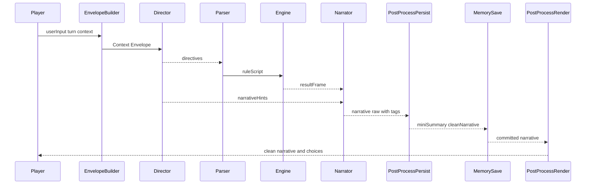
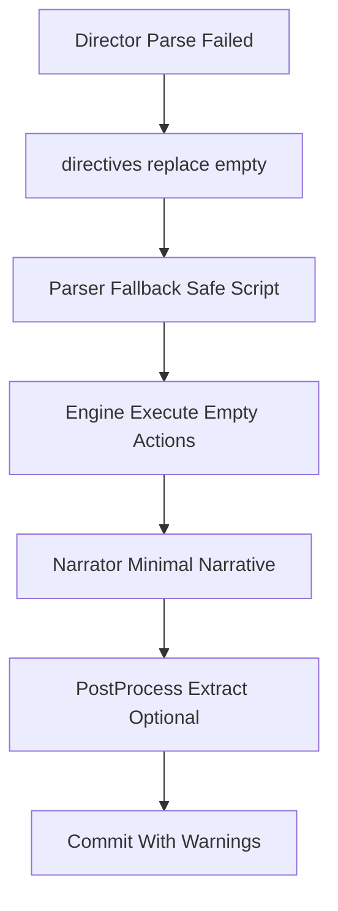

# 新版提示词体系模板与接口规范

## 0. 文档定位与边界

- 目标：给出可直接落地的提示词模板与模块接口设计稿，供下一步迁移实施直接执行。
- 继承输入：现状断点、协同架构基线、兼容性硬约束。
- 严格边界：不改业务代码，不讨论实现 patch，不展开背景动机，只定义模板与接口。
- 适用范围：Director、Parser、Narrator、Summarizer 四类 Agent，覆盖预设激活、拼装、执行、后处理、状态协议与样例链路。

---

## 1. 兼容冻结项与不可破坏约束

| 冻结项                     | 冻结值                                                                                                | 约束说明                                    |
| -------------------------- | ----------------------------------------------------------------------------------------------------- | ------------------------------------------- |
| Preset 与 PresetPurpose    | `narrative` `parser` `summarizer` `director`                                                          | 不新增破坏性 purpose，不改既有 purpose 名称 |
| activePresetByPurpose      | 运行时事实源                                                                                          | 继续作为各 Agent 激活预设来源               |
| marker 协议与别名          | 既有 marker id 与 alias 保持                                                                          | 不改 marker id，不改 alias 语义             |
| memorySummary markerConfig | `recentNarrativeCount` `miniSummaryCount` `megaSummaryMode` `megaSummaryLimit` `compressionThreshold` | 五字段语义保持一致                          |
| post-process 内置规则 ID   | `builtin:memory-summary` `builtin:choices`                                                            | 固定保留，禁止重命名                        |
| IRNR 输出契约字段          | `ruleScript` `resultFrame` `narrativeText` `finalEntityStates` `createdNpcs` `archiveUpdates`         | 字段名与语义保持兼容                        |
| 标签路径                   | `<memory_summary>` `<choices>`                                                                        | 继续可被既有 persist/render 路径提取        |

---

## 2. 四类模板统一骨架

### 2.1 统一四层结构

| 层级          | 目标                           | 约束                       |
| ------------- | ------------------------------ | -------------------------- |
| System 指令层 | 定义角色职责、硬约束、禁止事项 | 必须显式声明可做与不可做   |
| 输入槽位层    | 定义上下文槽位与可见范围       | 仅可读，不允许跨层写回     |
| 输出契约层    | 定义结构化输出与标签输出       | 必须声明必填字段与默认回退 |
| 失败处理层    | 定义可恢复失败、降级输出、告警 | 失败不阻断整回合可执行性   |

### 2.2 统一模板元接口 伪 JSON schema

```json
{
  "templateVersion": "2.0.0",
  "contractVersion": "role-specific-semver",
  "role": "director|parser|narrator|summarizer",
  "systemLayer": {
    "objective": "string",
    "mustRules": ["string"],
    "mustNotRules": ["string"],
    "stylePolicy": "string",
    "outputMode": "tags|structured|hybrid"
  },
  "inputSlotsLayer": {
    "requiredSlots": ["slot.path"],
    "optionalSlots": ["slot.path"],
    "slotDefaults": {
      "slot.path": "default value"
    },
    "visibility": {
      "slot.path": "read-only"
    }
  },
  "outputContractLayer": {
    "requiredStructured": ["field.path"],
    "optionalStructured": ["field.path"],
    "requiredTags": ["tag_name"],
    "optionalTags": ["tag_name"],
    "compatMode": "legacy-tags-first|structured-first|hybrid"
  },
  "failureLayer": {
    "recoverableErrors": ["parse_failed|missing_slot|empty_output"],
    "fallbackOutput": {
      "structured": {},
      "tags": {}
    },
    "warningCodes": ["string"],
    "commitPolicy": "allow_partial|abort_current_agent"
  }
}
```

### 2.3 统一字段规则

| 字段            | 规则                                      |
| --------------- | ----------------------------------------- |
| templateVersion | 必填，模板内容版本，默认 `2.0.0`          |
| contractVersion | 必填，角色输出契约版本，默认 `role-2.0.0` |
| outputMode      | 必填，默认 `hybrid`                       |
| requiredSlots   | 必填，必须可由 Context Envelope 提供      |
| fallbackOutput  | 必填，必须可序列化且可下游消费            |
| warningCodes    | 必填，供 Delta 可观测链路统一落盘         |

---

## 3. 四类模板字段级接口

## 3.1 Director 模板接口

### 3.1.1 字段定义

| 字段路径                               | 必填 | 默认值                                                           | 说明              |
| -------------------------------------- | ---- | ---------------------------------------------------------------- | ----------------- |
| role                                   | 是   | `director`                                                       | 固定角色          |
| templateVersion                        | 是   | `2.0.0`                                                          | 模板版本          |
| contractVersion                        | 是   | `director-2.0.0`                                                 | Director 契约版本 |
| systemLayer.objective                  | 是   | 世界推演与下游指导                                               | 仅负责编排与指导  |
| systemLayer.mustRules                  | 是   | 包含标签与结构化约束                                             | 必须声明必填标签  |
| systemLayer.mustNotRules               | 是   | 不写规则结果 不写最终叙事                                        | 明确职责边界      |
| inputSlotsLayer.requiredSlots          | 是   | `session` `turn` `history` `memory` `world` `directives.context` | 必需输入槽位      |
| inputSlotsLayer.optionalSlots          | 是   | `entities` `trace`                                               | 可选增强输入      |
| outputContractLayer.requiredTags       | 是   | `plot_directives` `narrative_hints` `archive_updates`            | 必填标签          |
| outputContractLayer.optionalTags       | 是   | `outline_updates`                                                | 选填标签          |
| outputContractLayer.requiredStructured | 是   | `directives.plot` `directives.narrative` `archive.updates`       | 结构化主通道      |
| failureLayer.fallbackOutput.structured | 是   | 空 directives 空 archiveUpdates                                  | 缺标签时兜底      |
| failureLayer.warningCodes              | 是   | `director_tag_missing` `director_parse_failed`                   | 可观测警报码      |

### 3.1.2 输出契约 伪 schema

```json
{
  "directives": {
    "plot": "string",
    "narrative": "string"
  },
  "archive": {
    "updates": [
      {
        "entityRef": "string",
        "change": "string"
      }
    ]
  },
  "outline": {
    "updates": ["string"]
  },
  "tags": {
    "plot_directives": "string",
    "narrative_hints": "string",
    "archive_updates": "string",
    "outline_updates": "string optional"
  }
}
```

## 3.2 Parser 模板接口

### 3.2.1 字段定义

| 字段路径                               | 必填 | 默认值                                                             | 说明                      |
| -------------------------------------- | ---- | ------------------------------------------------------------------ | ------------------------- |
| role                                   | 是   | `parser`                                                           | 固定角色                  |
| templateVersion                        | 是   | `2.0.0`                                                            | 模板版本                  |
| contractVersion                        | 是   | `parser-2.0.0`                                                     | Parser 契约版本           |
| systemLayer.objective                  | 是   | 意图编译到 RuleScript                                              | 不负责叙事润色            |
| inputSlotsLayer.requiredSlots          | 是   | `turn.userInput` `history.messages` `operations` `directives.plot` | 最小可执行输入            |
| inputSlotsLayer.optionalSlots          | 是   | `memory` `entities` `world`                                        | 增强推断输入              |
| outputContractLayer.requiredStructured | 是   | `ruleScript.version` `ruleScript.actions`                          | 固定顶层结构              |
| outputContractLayer.requiredTags       | 否   | 空                                                                 | Parser 默认走结构化主通道 |
| failureLayer.fallbackOutput.structured | 是   | `{version:2,actions:[]}`                                           | 最小安全脚本              |
| failureLayer.warningCodes              | 是   | `parser_json_invalid` `parser_empty_actions`                       | 可观测警报码              |

### 3.2.2 输出契约 伪 schema

```json
{
  "ruleScript": {
    "version": 2,
    "actions": [
      {
        "type": "string",
        "payload": {}
      }
    ]
  },
  "warnings": ["string"]
}
```

## 3.3 Narrator 模板接口

### 3.3.1 字段定义

| 字段路径                               | 必填 | 默认值                                                  | 说明                 |
| -------------------------------------- | ---- | ------------------------------------------------------- | -------------------- |
| role                                   | 是   | `narrator`                                              | 固定角色             |
| templateVersion                        | 是   | `2.0.0`                                                 | 模板版本             |
| contractVersion                        | 是   | `narrator-2.0.0`                                        | Narrator 契约版本    |
| systemLayer.objective                  | 是   | 基于 resultFrame 叙事                                   | 不虚构未结算机械结果 |
| inputSlotsLayer.requiredSlots          | 是   | `resultFrame` `directives.narrative` `history.messages` | 最小叙事输入         |
| inputSlotsLayer.optionalSlots          | 是   | `memory` `world` `entities`                             | 风格与记忆增强       |
| outputContractLayer.requiredStructured | 是   | `narrative.raw`                                         | 原始叙事主通道       |
| outputContractLayer.requiredTags       | 否   | 空                                                      | 标签作为兼容副通道   |
| outputContractLayer.optionalTags       | 是   | `memory_summary` `choices`                              | 兼容路径标签         |
| failureLayer.fallbackOutput.structured | 是   | 空叙事文本                                              | 允许规则结果继续提交 |
| failureLayer.warningCodes              | 是   | `narrator_empty` `narrator_call_failed`                 | 可观测警报码         |

### 3.3.2 输出契约 伪 schema

```json
{
  "narrative": {
    "raw": "string",
    "clean": "string optional after post-process"
  },
  "structured": {
    "miniSummary": "string optional",
    "choices": ["string"]
  },
  "tags": {
    "memory_summary": "string optional",
    "choices": "string optional"
  }
}
```

## 3.4 Summarizer 模板接口

### 3.4.1 字段定义

| 字段路径                               | 必填 | 默认值                                        | 说明                      |
| -------------------------------------- | ---- | --------------------------------------------- | ------------------------- |
| role                                   | 是   | `summarizer`                                  | 固定角色                  |
| templateVersion                        | 是   | `2.0.0`                                       | 模板版本                  |
| contractVersion                        | 是   | `summarizer-2.0.0`                            | Summarizer 契约版本       |
| systemLayer.objective                  | 是   | 压缩 mini 为 mega                             | 不写当回合规则结论        |
| inputSlotsLayer.requiredSlots          | 是   | `memory.segments.mini` `memory.segments.mega` | 压缩最小输入              |
| inputSlotsLayer.optionalSlots          | 是   | `history.window` `world`                      | 语义补全输入              |
| outputContractLayer.requiredStructured | 是   | `memoryDelta.appendMega`                      | 统一增量输出              |
| outputContractLayer.requiredTags       | 否   | 空                                            | Summarizer 默认无标签依赖 |
| failureLayer.fallbackOutput.structured | 是   | no-op delta                                   | 保证不丢 mini             |
| failureLayer.warningCodes              | 是   | `summarizer_empty` `summarizer_failed`        | 可观测警报码              |

### 3.4.2 输出契约 伪 schema

```json
{
  "memoryDelta": {
    "appendMega": [
      {
        "content": "string",
        "sourceMiniSummaryIds": ["string"],
        "messageRange": {
          "from": 0,
          "to": 0
        }
      }
    ]
  },
  "warnings": ["string"]
}
```

---

## 4. 模块接口规范

## 4.1 模块边界总览


## 4.2 关键接口定义 伪 schema

### 4.2.1 预设激活接口

```json
{
  "ActivationInput": {
    "purpose": "narrative|parser|summarizer|director"
  },
  "ActivationOutput": {
    "purpose": "string",
    "presetId": "string|null",
    "presetVersion": "string",
    "aiProfileId": "string optional",
    "postProcessRuleIds": ["string"]
  }
}
```

### 4.2.2 组装接口

```json
{
  "AssemblerInput": {
    "preset": {
      "id": "string",
      "purpose": "string",
      "blocks": [],
      "blockOrder": []
    },
    "envelope": {},
    "slotPolicy": {}
  },
  "AssemblerOutput": {
    "messages": [
      {
        "role": "system|user|assistant",
        "content": "string"
      }
    ],
    "markerSnapshots": {},
    "warnings": ["string"]
  }
}
```

### 4.2.3 执行接口

```json
{
  "ExecutorInput": {
    "agent": "director|parser|narrator|summarizer",
    "messages": [],
    "aiConfig": {},
    "trace": {
      "turn": 0,
      "sequence": 0,
      "correlationId": "string"
    }
  },
  "ExecutorOutput": {
    "success": true,
    "rawOutput": "string",
    "error": {
      "type": "string",
      "message": "string"
    }
  }
}
```

### 4.2.4 后处理接口

```json
{
  "PostProcessInput": {
    "rawText": "string",
    "phase": "persist|render",
    "rules": [],
    "builtinRuleIds": [
      "builtin:memory-summary",
      "builtin:choices"
    ]
  },
  "PostProcessOutput": {
    "text": "string",
    "extracted": {
      "miniSummary": ["string"],
      "choices": ["string"]
    },
    "warnings": ["string"]
  }
}
```

## 4.3 字段传递与禁穿透清单

| 边界                        | 必传字段                                       | 禁止穿透字段                                       |
| --------------------------- | ---------------------------------------------- | -------------------------------------------------- |
| PresetStorage -> Activation | purpose activePresetByPurpose preset metadata  | UI 面板状态 store 实例 localStorage key 细节       |
| Activation -> Assembler     | preset snapshot envelope slotPolicy            | setActivePresetForPurpose 等可变操作函数           |
| Assembler -> Executor       | messages warnings trace                        | VariableContext 原始可变引用 store/repository 句柄 |
| Executor -> OutputParser    | rawOutput success error                        | AIProvider 内部重试状态 API key 明文               |
| OutputParser -> PostProcess | narrative raw tags raw structured draft        | rule engine state entity accessor                  |
| PostProcess -> Commit       | cleanNarrative extracted warnings              | 正则引擎对象 rule 编辑态                           |
| Commit -> Memory Save       | miniSummary choices memoryDelta archiveUpdates | 上游 prompt 内容与 provider 请求细节               |

## 4.4 防耦合硬规则

1. Agent 间只通过显式契约对象通信，不共享黑板内部可变对象引用。
2. PostProcess 是唯一标签抽取入口，persist 与 render 仅消费其结果。
3. Summarizer 通过同一 assembler executor 链路接入，不允许直连 aiManager 绕开契约。
4. 激活逻辑仅输出快照，不向下游暴露存储实现。
5. Delta 构建只读消费各阶段输出，不反向改写阶段产物。

---

## 5. 状态传递协议细化

## 5.1 Context Envelope 最小必需字段 与 Phase 2 扩展

### 5.1.1 MVP 字段清单

| 字段路径                                                                                                  | 类型         | 必填 | 默认值                                                      | 生产方                      | 消费方                              |
| --------------------------------------------------------------------------------------------------------- | ------------ | ---- | ----------------------------------------------------------- | --------------------------- | ----------------------------------- |
| envelopeVersion                                                                                           | string       | 是   | `2.0.0`                                                     | EnvelopeBuilder             | 全 Agent                            |
| compatibility.legacyTags                                                                                  | boolean      | 是   | `true`                                                      | EnvelopeBuilder             | Parser Narrator PostProcess         |
| compatibility.structuredChannel                                                                           | boolean      | 是   | `true`                                                      | EnvelopeBuilder             | 全 Agent                            |
| compatibility.fallbackPolicy                                                                              | string       | 是   | `safe-minimal`                                              | EnvelopeBuilder             | Orchestrator                        |
| session.sessionId                                                                                         | string       | 是   | commandId                                                   | SessionResolver             | 全 Agent                            |
| session.mode                                                                                              | string       | 是   | `solo`                                                      | SessionResolver             | 全 Agent                            |
| session.roomId                                                                                            | string null  | 是   | `null`                                                      | SessionResolver             | Director Parser Narrator            |
| turn.number                                                                                               | number       | 是   | `0`                                                         | TurnResolver                | 全 Agent                            |
| turn.userInput                                                                                            | string       | 是   | 空字符串                                                    | TurnResolver                | Director Parser                     |
| turn.submittedAt                                                                                          | number       | 是   | 当前时间戳                                                  | TurnResolver                | Trace Delta                         |
| presets.activeByPurpose                                                                                   | object       | 是   | 四 purpose 快照                                             | ActivationResolver          | Assembler Executor                  |
| history.messages                                                                                          | array        | 是   | 空数组                                                      | HistoryBuilder              | Director Parser Narrator            |
| history.window.limit total startIndex endIndex truncated                                                  | object       | 是   | `{limit:0,total:0,startIndex:0,endIndex:0,truncated:false}` | HistoryBuilder              | Director Parser Narrator Sync       |
| memory.config.recentNarrativeCount miniSummaryCount megaSummaryMode megaSummaryLimit compressionThreshold | object       | 是   | 与 memorySummary 语义同构默认值                             | MemoryBuilder               | Director Parser Narrator Summarizer |
| memory.segments.recentNarratives miniSummaries megaSummaries                                              | object       | 是   | 三数组默认空                                                | MemoryBuilder               | Director Parser Narrator Summarizer |
| directives.plotDirectives narrativeHints                                                                  | object       | 是   | 两字段空字符串                                              | Director or FallbackBuilder | Parser Narrator                     |
| postProcess.builtinRuleIds                                                                                | string array | 是   | `builtin:memory-summary` `builtin:choices`                  | PostProcessPolicy           | PostProcess                         |
| ioContract.tags.memorySummary choices                                                                     | object       | 是   | `memory_summary` `choices`                                  | ContractRegistry            | Narrator PostProcess                |
| ioContract.director.requiredTags optionalTags                                                             | object       | 是   | required 固定三标签 optional 含 `outline_updates`           | ContractRegistry            | DirectorParser                      |
| trace.correlationId                                                                                       | string       | 是   | commandId                                                   | TraceBuilder                | 全链路可观测                        |

### 5.1.2 Phase 2 扩展字段

| 字段路径                            | 类型   | 必填 | 作用                  |
| ----------------------------------- | ------ | ---- | --------------------- |
| session.hostUserId                  | string | 否   | 联机房主身份绑定      |
| history.messageIds                  | array  | 否   | 提升重放稳定性        |
| world.archive.active nearby dormant | object | 否   | Director 长上下文治理 |
| entities.stateHash                  | string | 否   | 快照一致性校验        |
| operations.schemaHash               | string | 否   | 规则 schema 版本锁定  |
| trace.spans                         | array  | 否   | 细粒度性能追踪        |
| integrity.envelopeChecksum          | string | 否   | 防漂移校验            |
| sync.sequenceAck                    | number | 否   | 联机增量确认          |

### 5.1.3 Envelope 伪 schema

```json
{
  "envelopeVersion": "2.0.0",
  "compatibility": {
    "legacyTags": true,
    "structuredChannel": true,
    "fallbackPolicy": "safe-minimal"
  },
  "session": {
    "sessionId": "cmd-20260305-001",
    "mode": "multiplayer",
    "roomId": "room-a"
  },
  "turn": {
    "number": 27,
    "userInput": "我尝试劝守卫放行",
    "submittedAt": 1760000000000
  },
  "presets": {
    "activeByPurpose": {
      "director": "lyra-default-director",
      "parser": "lyra-default-parser",
      "narrative": "lyra-default",
      "summarizer": "default-summarizer"
    }
  },
  "history": {
    "messages": [],
    "window": {
      "limit": 50,
      "total": 88,
      "startIndex": 38,
      "endIndex": 87,
      "truncated": true
    }
  },
  "memory": {
    "config": {
      "recentNarrativeCount": 4,
      "miniSummaryCount": 10,
      "megaSummaryMode": "all",
      "megaSummaryLimit": 5,
      "compressionThreshold": 8
    },
    "segments": {
      "recentNarratives": [],
      "miniSummaries": [],
      "megaSummaries": []
    }
  },
  "postProcess": {
    "builtinRuleIds": [
      "builtin:memory-summary",
      "builtin:choices"
    ]
  },
  "ioContract": {
    "tags": {
      "memorySummary": "memory_summary",
      "choices": "choices"
    },
    "director": {
      "requiredTags": [
        "plot_directives",
        "narrative_hints",
        "archive_updates"
      ],
      "optionalTags": ["outline_updates"]
    }
  }
}
```

## 5.2 Turn Delta 最小交换子集

### 5.2.1 Delta 外层结构

```json
{
  "deltaVersion": "1.0.0",
  "envelopeVersion": "2.0.0",
  "turn": 27,
  "baseTurn": 26,
  "sequence": 3,
  "source": "parser",
  "commitStatus": "buffered|committed|discarded",
  "patches": [],
  "checksum": "optional"
}
```

### 5.2.2 四类 Agent 最小交换字段

| 源 Agent   | 目标 Agent      | 最小交换子集                                            | Delta patch          |
| ---------- | --------------- | ------------------------------------------------------- | -------------------- |
| Director   | Parser          | `directives.plotDirectives` `directives.narrativeHints` | `directives.replace` |
| Director   | Narrator        | `directives.narrativeHints`                             | `directives.replace` |
| Parser     | Narrator 下游链 | `ruleScript.version` `ruleScript.actions`               | `rulescript.replace` |
| Narrator   | PostProcess     | `narrative.raw`                                         | `narrative.replace`  |
| Summarizer | Memory          | `memoryDelta.appendMega`                                | `memory.appendMega`  |

### 5.2.3 协议约束

1. 同回合 `sequence` 单调递增。
2. `source` 一次只允许一个 Agent。
3. `commitStatus=discarded` 后本回合不可再追加新 patch。
4. 允许 `buffered` 多次，最终必须有一条 `committed` 或 `discarded` 终态。
5. `turn` `baseTurn` `sequence` 组成确定性重放键。

## 5.3 标签协议与结构化通道并存策略

### 5.3.1 并存策略总则

| 项目     | 规则                                               |
| -------- | -------------------------------------------------- |
| 主通道   | 结构化字段为主事实源                               |
| 兼容通道 | 标签字段用于兼容旧链路                             |
| 冲突处理 | 结构化优先 标签保留并记录告警                      |
| 清洗职责 | persist/render 阶段统一由 PostProcess 清洗         |
| 最终落盘 | 落盘文本不残留 `<memory_summary>` `<choices>` 标签 |

### 5.3.2 字段映射规则

| 语义项            | 结构化通道               | 标签通道            | 兼容动作               |
| ----------------- | ------------------------ | ------------------- | ---------------------- |
| Director 剧情指导 | `directives.plot`        | `<plot_directives>` | 缺结构化时回退标签     |
| Director 叙事提示 | `directives.narrative`   | `<narrative_hints>` | 缺结构化时回退标签     |
| 档案更新          | `archive.updates[]`      | `<archive_updates>` | 标签文本可解析为结构化 |
| 小总结            | `structured.miniSummary` | `<memory_summary>`  | persist 抽取并移除标签 |
| 选项              | `structured.choices[]`   | `<choices>`         | render 抽取并移除标签  |

### 5.3.3 角色输出模式

| 角色       | 默认模式         | 必须标签                                              | 必须结构化                     |
| ---------- | ---------------- | ----------------------------------------------------- | ------------------------------ |
| Director   | hybrid           | `plot_directives` `narrative_hints` `archive_updates` | `directives` `archive.updates` |
| Parser     | structured-first | 无                                                    | `ruleScript`                   |
| Narrator   | hybrid           | 可选 `memory_summary` `choices`                       | `narrative.raw`                |
| Summarizer | structured-first | 无                                                    | `memoryDelta.appendMega`       |

---

## 6. 样例附录

## 6.1 完整回合数据流样例

### 6.1.1 流程图



### 6.1.2 样例数据片段

#### 玩家输入

```json
{
  "turn": 27,
  "userInput": "我拿出伪造通行证尝试劝守卫放行"
}
```

#### Director 输出

```json
{
  "directives": {
    "plot": "守卫先质疑证件真实性 再要求额外口令检定",
    "narrative": "强调守卫态度由冷淡转为警觉"
  },
  "archive": {
    "updates": [
      {
        "entityRef": "gate-guard-01",
        "change": "currentState 更新为高度戒备"
      }
    ]
  },
  "tags": {
    "plot_directives": "守卫先质疑证件真实性 再要求额外口令检定",
    "narrative_hints": "强调守卫态度由冷淡转为警觉",
    "archive_updates": "守卫状态改为高度戒备"
  }
}
```

#### Parser 输出

```json
{
  "ruleScript": {
    "version": 2,
    "actions": [
      {
        "type": "check",
        "payload": {
          "actor": "player",
          "skill": "deception",
          "dc": 14
        }
      }
    ]
  }
}
```

#### Narrator 原始输出

```text
守卫接过证件后目光在封蜡上停留了片刻 他抬眼重新打量你 语气比先前更冷

<memory_summary>
地点：北门关卡
事件：玩家出示伪造通行证并触发口令检定
NPC：守卫由例行盘查转为戒备
状态变化：关卡警戒级别上升
备注：后续可能触发增援
</memory_summary>

<choices>
继续解释证件来源
尝试转移守卫注意力
立刻撤离关卡
</choices>
```

#### PostProcess persist 结果

```json
{
  "text": "守卫接过证件后目光在封蜡上停留了片刻 他抬眼重新打量你 语气比先前更冷",
  "extracted": {
    "miniSummary": [
      "地点：北门关卡\n事件：玩家出示伪造通行证并触发口令检定\nNPC：守卫由例行盘查转为戒备\n状态变化：关卡警戒级别上升\n备注：后续可能触发增援"
    ]
  },
  "warnings": []
}
```

#### PostProcess render 结果

```json
{
  "text": "守卫接过证件后目光在封蜡上停留了片刻 他抬眼重新打量你 语气比先前更冷",
  "extracted": {
    "choices": [
      "继续解释证件来源\n尝试转移守卫注意力\n立刻撤离关卡"
    ]
  }
}
```

### 6.1.3 回合结果投影到 IRNR

```json
{
  "ruleScript": {"version": 2, "actions": []},
  "resultFrame": {},
  "narrativeText": "cleanNarrative",
  "finalEntityStates": [],
  "createdNpcs": [],
  "archiveUpdates": []
}
```

## 6.2 降级链样例

### 6.2.1 场景 A Director 输出不可解析

触发条件：Director 缺少必填标签或结构化字段解析失败。

降级策略：

1. 记录 `director_parse_failed`。
2. 写入空指导补丁。
3. Parser 继续基于用户输入与历史执行。

#### 降级补丁样例

```json
{
  "source": "director",
  "commitStatus": "committed",
  "patches": [
    {
      "type": "directives.replace",
      "payload": {
        "plotDirectives": "",
        "narrativeHints": ""
      }
    }
  ],
  "warnings": ["director_parse_failed"]
}
```

### 6.2.2 场景 B Parser 解析失败

触发条件：Parser 返回非法 JSON 或不符合 `ruleScript` 结构。

降级策略：

1. 记录 `parser_json_invalid`。
2. 强制回退最小安全脚本。
3. Engine 与 Narrator 按空动作链继续，避免回合中断。

#### 降级补丁样例

```json
{
  "source": "parser",
  "commitStatus": "committed",
  "patches": [
    {
      "type": "rulescript.replace",
      "payload": {
        "ruleScript": {
          "version": 2,
          "actions": []
        }
      }
    }
  ],
  "warnings": ["parser_json_invalid"]
}
```

### 6.2.3 降级链流程图



---

## 7. 落地前校验清单

| 检查项                | 通过标准                                            |
| --------------------- | --------------------------------------------------- |
| 模板骨架完整性        | 四类模板均含四层结构与失败层                        |
| 兼容约束完整性        | 冻结项全部被显式保留                                |
| 接口边界清晰性        | 必传字段与禁穿透字段均有清单                        |
| Envelope MVP 可执行性 | MVP 字段可由现有管线构建                            |
| Delta 可重放性        | `turn` `baseTurn` `sequence` 满足单调与终态约束     |
| 标签兼容性            | `<memory_summary>` `<choices>` 与结构化并存策略明确 |
| 样例覆盖性            | 含完整链路与降级链路，均可映射到 IRNR 输出          |
