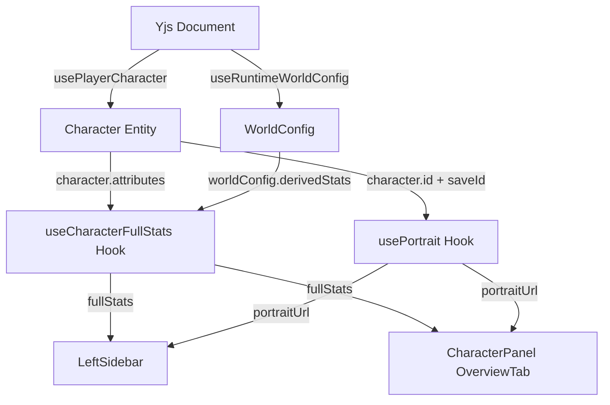

# 侧边栏角色状态重设计 — 实现方案

## 1. 概述

本方案对左侧边栏（`LeftSidebar`）进行全面重构，同时调整角色详情面板（`CharacterPanel`）的基础信息页，消除信息重复。

### 核心目标

| #   | 目标                      | 当前状态                        | 目标状态                                 |
| --- | ------------------------- | ------------------------------- | ---------------------------------------- |
| 1   | 头像                      | 圆形首字母占位                  | 大矩形 OPFS 肖像图                       |
| 2   | 资源条                    | 硬编码 HP/MP，直接读 attributes | 配置驱动，computeDerivedStats 计算       |
| 3   | 金币                      | 硬编码 gold section             | 移除                                     |
| 4   | 描述                      | 无                              | 显示 description，可折叠                 |
| 5   | CharacterPanel 基础信息页 | 包含描述+资源                   | 移除描述和资源，保留头像+基本信息+雷达图 |

---

## 2. 架构设计

### 2.1 数据流



### 2.2 提取共享 Hook：`useCharacterFullStats`

当前 `fullStats` 的计算逻辑内联在 [`OverviewTabContent`](src/components/CharacterPanel/index.tsx:379) 中。此计算涉及：

1. 将 `character.attributes` 提取为 `baseFields`
2. 调用 [`computeDerivedStats()`](src/lib/rules/derived-stats.ts:82) 计算衍生属性
3. 资源字段保护合并（current 优先 attributes，max 优先 computed）

需要将这段逻辑提取为可复用的自定义 Hook，供侧边栏和面板共同使用。

**新文件：`src/hooks/useCharacterFullStats.ts`**

```typescript
import { useMemo } from "react";
import type { Character } from "@/domain/entities/character";
import type { DerivedStatConfig } from "@/lib/world/types";
import { computeDerivedStats } from "@/lib/rules/derived-stats";

/**
 * 计算角色的完整属性集（基础 + 衍生），并对资源字段执行保护合并。
 *
 * @param character - 角色实体（可为 null）
 * @param derivedStats - 世界配置中的衍生属性定义列表
 * @returns 完整属性映射，character 为 null 时返回空对象
 */
export function useCharacterFullStats(
  character: Character | null,
  derivedStats: DerivedStatConfig[],
): Record<string, number | string | boolean> {
  return useMemo(() => {
    if (!character) return {};

    // 1. 提取基础字段
    const baseFields: Record<string, number | string | boolean> = {};
    const attrs = character.attributes ?? {};
    for (const [k, v] of Object.entries(attrs)) {
      if (
        typeof v === "number" ||
        typeof v === "string" ||
        typeof v === "boolean"
      ) {
        baseFields[k] = v;
      }
    }

    // 2. 计算衍生属性
    const computed = computeDerivedStats(baseFields, derivedStats);

    // 3. 资源字段保护合并
    for (const stat of derivedStats) {
      if (!stat.isResource || !stat.maxField) continue;

      // current: 优先读取 attributes（保留 AI 战斗中修改的值）
      const attrCurrent = attrs[stat.key];
      if (typeof attrCurrent === "number" && Number.isFinite(attrCurrent)) {
        computed[stat.key] = attrCurrent;
      }

      // max: 优先保持 computed（公式计算值），缺失时回退 attributes
      const computedMax = computed[stat.maxField];
      if (typeof computedMax !== "number" || !Number.isFinite(computedMax)) {
        const attrMax = attrs[stat.maxField];
        if (typeof attrMax === "number" && Number.isFinite(attrMax)) {
          computed[stat.maxField] = attrMax;
        }
      }
    }

    return computed;
  }, [character, derivedStats]);
}
```

---

## 3. 文件变更清单

### 3.1 新增文件

| 文件                                 | 用途                                                      |
| ------------------------------------ | --------------------------------------------------------- |
| `src/hooks/useCharacterFullStats.ts` | 共享 Hook：计算角色完整属性（基础 + 衍生 + 资源保护合并） |

### 3.2 修改文件

| 文件                                      | 变更类型 | 变更说明                                                      |
| ----------------------------------------- | -------- | ------------------------------------------------------------- |
| `src/components/GameHUD/LeftSidebar.tsx`  | **重构** | 大幅改造，详见 §4                                             |
| `src/components/CharacterPanel/index.tsx` | **精简** | OverviewTabContent 移除描述和资源，提取 fullStats 到共享 Hook |
| `src/hooks/index.ts`（如存在）            | **更新** | 导出 `useCharacterFullStats`                                  |

### 3.3 不变文件

| 文件                                                          | 原因                                                   |
| ------------------------------------------------------------- | ------------------------------------------------------ |
| `src/components/CharacterPanel/CharacterResources.tsx`        | 组件本身无需改动，仅从 OverviewTabContent 中移除其引用 |
| `src/components/CharacterPanel/CharacterDescriptionPanel.tsx` | 组件本身无需改动，仅从 OverviewTabContent 中移除其引用 |
| `src/components/CharacterPanel/CharacterPortraitPanel.tsx`    | 保持不变，OverviewTabContent 继续使用                  |
| `src/lib/portrait/index.ts`                                   | 保持不变，侧边栏直接使用 `usePortrait`                 |
| `src/lib/rules/derived-stats.ts`                              | 保持不变                                               |
| `src/components/GameHUD/index.tsx`                            | 保持不变，LeftSidebar 的 Props 接口不变                |
| `src/components/GameHUD/SidebarDrawer.tsx`                    | 保持不变                                               |

---

## 4. LeftSidebar 详细改造方案

### 4.1 当前结构（将被替换）

```
aside (p-4 space-y-4)
├── button (角色头部：圆形首字母 + 名称 + 等级)
├── section (资源：硬编码 HP/MP)
└── section (金币：硬编码 gold)
```

### 4.2 目标结构

```
aside (p-3 space-y-3，添加 overflow-y-auto)
├── section: 大矩形头像 (点击打开角色面板)
│   ├── 肖像图片 (usePortrait 加载，16:9 或 4:3 比例)
│   └── 无肖像时显示首字母占位 + User 图标
├── section: 角色信息摘要
│   ├── 角色名称 (font-semibold)
│   └── 等级 (LV.x)
├── section: 资源条 (配置驱动)
│   ├── 从 worldConfig.derivedStats 动态获取资源列表
│   └── 每个资源渲染 SidebarResourceBar 组件
└── section: 角色描述 (可折叠)
    ├── 默认显示 2-3 行截断
    └── 点击展开/收起完整描述
```

### 4.3 新增依赖

```typescript
// 新增 import
import { usePortrait } from "@/lib/portrait";
import { useCharacterFullStats } from "@/hooks/useCharacterFullStats";
import { useCurrentSaveId } from "@/modules";
import { getRuntimeWorldConfig } from "@/lib/world/resolve-config";
```

### 4.4 `useRuntimeWorldConfig` 统一

当前 `LeftSidebar` 和 `CharacterPanel` 各自内联了 [`useRuntimeWorldConfig()`](src/components/GameHUD/LeftSidebar.tsx:27) 的实现，逻辑几乎相同但存在微小差异：

- LeftSidebar 版本：手动解析 `Y.Map`，使用 `worldConfigFromYMap`
- CharacterPanel 版本：调用 `getRuntimeWorldConfig()` 工具函数

**方案**：LeftSidebar 统一改用 `getRuntimeWorldConfig()`，与 CharacterPanel 保持一致，减少重复代码。

```typescript
// 统一后的 useRuntimeWorldConfig (LeftSidebar 内)
function useRuntimeWorldConfig(): WorldConfig {
  const currentSaveId = useCurrentSaveId();
  return useMemo(() => {
    void currentSaveId;
    return getRuntimeWorldConfig();
  }, [currentSaveId]);
}
```

### 4.5 头像区域实现

```tsx
function SidebarPortrait({
  saveId,
  characterId,
  characterName,
  onClick,
}: {
  saveId: string | null;
  characterId: string;
  characterName: string;
  onClick: () => void;
}) {
  const { portraitUrl, isLoading } = usePortrait(saveId, characterId);
  const fallbackText = characterName?.slice(0, 1).toUpperCase() || "?";

  return (
    <button
      type="button"
      onClick={onClick}
      className="w-full rounded-lg overflow-hidden transition-all"
      style={{
        border: `1px solid ${colorAlpha("primary", 0.2)}`,
        // 高度自适应内容
      }}
    >
      <div
        className="relative w-full"
        style={{ aspectRatio: "3 / 4" }} // 竖版肖像比例
      >
        {isLoading ? (
          <LoadingPlaceholder />
        ) : portraitUrl ? (
          
        ) : (
          <FallbackAvatar text={fallbackText} />
        )}
      </div>
    </button>
  );
}
```

**设计要点**：

- 使用 `aspect-ratio: 3/4`（竖版肖像）适配侧边栏宽度（w-80 = 320px 减去 padding）
- 加载中显示脉冲动画占位
- 无肖像时显示首字母 + User 图标的大号占位
- 整个头像区域可点击，打开角色面板

### 4.6 资源条区域实现

复用 [`CharacterResources`](src/components/CharacterPanel/CharacterResources.tsx:48) 的数据提取逻辑，但使用更紧凑的 UI 样式（去掉标题行和百分比行）。

```tsx
/**
 * 从 worldConfig.derivedStats 动态提取资源列表，
 * 使用 fullStats 中的计算值渲染资源条。
 */
function SidebarResources({
  worldConfig,
  fullStats,
}: {
  worldConfig: WorldConfig;
  fullStats: Record<string, number | string | boolean>;
}) {
  const resources = useMemo(() => {
    const result: Array<{
      key: string;
      label: string;
      current: number;
      max: number;
    }> = [];

    for (const stat of worldConfig.derivedStats) {
      if (!stat.isResource || !stat.maxField) continue;

      const current = getNum(fullStats, stat.key, 0);
      const rawMax = getNum(fullStats, stat.maxField, 0);
      const max = Math.max(rawMax, 1);

      result.push({ key: stat.key, label: stat.label, current, max });
    }

    return result;
  }, [worldConfig.derivedStats, fullStats]);

  if (resources.length === 0) return null;

  return (
    <section
      className="rounded-lg p-3 space-y-3"
      style={{
        background: colorAlpha("bgElevated", 0.42),
        border: `1px solid ${colorAlpha("primary", 0.16)}`,
      }}
    >
      {resources.map((res) => (
        <ResourceBar
          key={res.key}
          label={res.label}
          current={res.current}
          max={res.max}
        />
      ))}
    </section>
  );
}
```

**与当前实现的关键差异**：

| 维度         | 当前实现                         | 改造后                                                             |
| ------------ | -------------------------------- | ------------------------------------------------------------------ |
| 资源列表来源 | 硬编码 `hp`/`mp`                 | 遍历 `worldConfig.derivedStats` 中 `isResource && maxField` 的条目 |
| 数值来源     | 直接读 `character.attributes.hp` | 从 `fullStats`（经 `computeDerivedStats` 计算）读取                |
| 颜色方案     | HP=success, MP=secondary         | 根据百分比动态选择 error/warning/primary                           |
| 资源项数量   | 固定 2 个                        | 动态，不同世界可能有不同数量                                       |

### 4.7 描述区域实现

```tsx
function SidebarDescription({ description }: { description?: string }) {
  const [expanded, setExpanded] = useState(false);

  if (!description) return null;

  const isLong = description.length > 100; // 约 2-3 行的阈值

  return (
    <section
      className="rounded-lg p-3"
      style={{
        background: colorAlpha("bgElevated", 0.42),
        border: `1px solid ${colorAlpha("primary", 0.16)}`,
      }}
    >
      <div className="flex items-center gap-1.5 mb-2">
        <ScrollText
          className="w-3.5 h-3.5"
          style={{ color: colorAlpha("primary", 0.7) }}
        />
        <span
          className="text-xs font-medium"
          style={{ color: colorAlpha("textSecondary", 0.85) }}
        >
          描述
        </span>
      </div>

      <p
        className={[
          "text-xs leading-relaxed whitespace-pre-wrap",
          !expanded && isLong ? "line-clamp-3" : "",
        ].join(" ")}
        style={{ color: colorAlpha("textMuted", 0.85) }}
      >
        {description}
      </p>

      {isLong && (
        <button
          type="button"
          onClick={() => setExpanded(!expanded)}
          className="text-xs mt-1.5 transition-colors"
          style={{ color: colorAlpha("primary", 0.7) }}
        >
          {expanded ? "收起" : "展开全部"}
        </button>
      )}
    </section>
  );
}
```

**设计要点**：

- 仅显示 `character.description`（背景故事），不显示 appearance/personality（这些信息仍保留在角色面板中）
- 使用 `line-clamp-3` 实现 3 行截断
- 展开/收起切换按钮
- 描述为空时不渲染该 section

### 4.8 `ResourceBar` 组件改进

保留现有的 [`ResourceBar`](src/components/GameHUD/LeftSidebar.tsx:46) 组件结构，但改进颜色逻辑：

```tsx
function ResourceBar({
  label,
  current,
  max,
}: {
  label: string;
  current: number;
  max: number;
}) {
  const safeMax = Math.max(max, 1);
  const percent = Math.max(0, Math.min(1, current / safeMax));

  // 根据百分比动态选择颜色（与 CharacterResources 一致）
  const barColorKey: "error" | "warning" | "primary" =
    percent < 0.25 ? "error" : percent < 0.5 ? "warning" : "primary";

  return (
    <div className="space-y-1.5">
      <div className="flex items-center justify-between text-xs">
        <span style={{ color: colorAlpha("textSecondary", 0.9) }}>
          {label}
        </span>
        <span style={{ color: colorAlpha("textMuted", 0.95) }}>
          {Math.round(current)} / {Math.round(safeMax)}
        </span>
      </div>
      <div
        className="h-2 rounded-full overflow-hidden"
        style={{
          background: colorAlpha(barColorKey, 0.12),
          border: `1px solid ${colorAlpha(barColorKey, 0.15)}`,
        }}
      >
        <div
          className="h-full rounded-full transition-all duration-500"
          style={{
            width: `${Math.round(percent * 100)}%`,
            background: `linear-gradient(90deg, ${colorAlpha(barColorKey, 0.6)}, ${colorAlpha(barColorKey, 0.9)})`,
            boxShadow: glow(barColorKey, "sm", 0.3),
          }}
        />
      </div>
    </div>
  );
}
```

### 4.9 移除项

- 删除 [`getResourceValue`](src/components/GameHUD/LeftSidebar.tsx:16) 函数（不再需要直接从 attributes 读值）
- 删除金币 section（第 196-217 行）
- 删除 `avatarText` 相关逻辑（改用 `usePortrait`）
- 删除硬编码的 `hp`/`maxHp`/`mp`/`maxMp`/`gold` 变量
- 删除 `hasHpResource`/`hasMpResource` 判断逻辑

### 4.10 完整组件伪代码

```tsx
export function LeftSidebar({ onOpenCharacterPanel }: LeftSidebarProps) {
  const character = usePlayerCharacter();
  const worldConfig = useRuntimeWorldConfig();
  const currentSaveId = useCurrentSaveId();
  const fullStats = useCharacterFullStats(character, worldConfig.derivedStats);

  if (!character) {
    return <EmptyState />;
  }

  const level = /* 从 fullStats 或 character.attributes 获取 level */;

  return (
    <aside className="p-3 space-y-3 overflow-y-auto">
      {/* 1. 大矩形头像 */}
      <SidebarPortrait
        saveId={currentSaveId}
        characterId={character.id}
        characterName={character.name}
        onClick={onOpenCharacterPanel}
      />

      {/* 2. 角色信息摘要 */}
      <button
        type="button"
        onClick={onOpenCharacterPanel}
        className="w-full text-left rounded-lg p-3 transition-colors"
        style={{
          background: colorAlpha("bgElevated", 0.5),
          border: `1px solid ${colorAlpha("primary", 0.2)}`,
        }}
      >
        <p className="text-base font-semibold truncate"
           style={{ color: color("textPrimary") }}>
          {character.name}
        </p>
        <p className="text-xs"
           style={{ color: colorAlpha("textSecondary", 0.8) }}>
          LV.{Math.max(1, Math.round(level))}
        </p>
      </button>

      {/* 3. 资源条（配置驱动） */}
      <SidebarResources worldConfig={worldConfig} fullStats={fullStats} />

      {/* 4. 角色描述（可折叠） */}
      <SidebarDescription description={character.description} />
    </aside>
  );
}
```

---

## 5. CharacterPanel 基础信息页改造

### 5.1 OverviewTabContent 变更

**文件**：[`src/components/CharacterPanel/index.tsx`](src/components/CharacterPanel/index.tsx:362)

#### 移除项

1. **`fullStats` 内联计算**（第 379-414 行）→ 替换为 `useCharacterFullStats(character, worldConfig.derivedStats)`
2. **`CharacterResources` 引用**（第 537 行）→ 删除整个资源区域
3. **`CharacterDescriptionPanel` 引用**（第 559-571 行）→ 删除整个描述区域

#### 保留项

1. **头像**（[`CharacterPortraitPanel`](src/components/CharacterPanel/index.tsx:468)）
2. **基本信息**（名称、状态标签、维度选择、性别、年龄、等级）
3. **属性雷达图**（[`CharacterRadarChart`](src/components/CharacterPanel/index.tsx:552)）

#### 修改后的 OverviewTabContent 结构

```
OverviewTabContent
├── grid (左头像 + 右基本信息)
│   ├── CharacterPortraitPanel
│   └── 基本信息 (名称 + 状态 + 维度 + 性别 + 年龄 + 等级)
└── 属性雷达图 (CharacterRadarChart)
```

#### 具体代码变更

```tsx
function OverviewTabContent({
  character,
  worldConfig,
}: {
  character: Character;
  worldConfig: WorldConfig;
}) {
  const currentSaveId = useCurrentSaveId();

  const allocatableKeys = useMemo(
    () => worldConfig.pointBuyRules?.allocatableAttributes ?? [],
    [worldConfig],
  );

  // ✅ 替换：使用共享 Hook
  const fullStats = useCharacterFullStats(character, worldConfig.derivedStats);

  // ... 维度解析、状态标签、性别显示等保持不变 ...

  return (
    <div className="space-y-5">
      {/* 顶部两列区域：左列大头像 + 右列基本信息 */}
      <motion.div
        className="grid grid-cols-1 sm:grid-cols-[2fr_3fr] gap-4 items-stretch"
        initial={{ opacity: 0, y: -8 }}
        animate={{ opacity: 1, y: 0 }}
        transition={{ duration: 0.3, ease: easeOut }}
      >
        {/* 左列：大头像 */}
        <CharacterPortraitPanel
          saveId={currentSaveId}
          characterId={character.id}
          className="aspect-square w-full max-w-50 sm:max-w-none rounded-lg overflow-hidden"
        />

        {/* 右列：仅基本信息（移除资源区域） */}
        <div className="flex flex-col gap-4 min-w-0">
          <div>
            {/* 角色名 + 状态标签 + 维度行 + 性别 + 年龄 + 等级 */}
            {/* ...保持不变... */}
          </div>
          {/* ❌ 删除: <CharacterResources worldConfig={worldConfig} fullStats={fullStats} /> */}
        </div>
      </motion.div>

      {/* 属性雷达图（保留） */}
      {allocatableKeys.length > 0 && (
        <motion.div custom={1} variants={sectionVariants} initial="hidden" animate="visible">
          <SectionTitle icon={<Shield className="w-4 h-4" />}>属性</SectionTitle>
          <CharacterRadarChart worldConfig={worldConfig} fullStats={fullStats} />
        </motion.div>
      )}

      {/* ❌ 删除: CharacterDescriptionPanel 区域 */}
    </div>
  );
}
```

### 5.2 Import 变更

```diff
 // CharacterPanel/index.tsx
+import { useCharacterFullStats } from "@/hooks/useCharacterFullStats";
-import { CharacterDescriptionPanel } from "./CharacterDescriptionPanel";
-import { CharacterResources } from "./CharacterResources";
```

> **注意**：`CharacterDescriptionPanel` 和 `CharacterResources` 组件文件本身不删除，因为未来可能有其他使用场景。仅从 `OverviewTabContent` 中移除引用。

---

## 6. 边界情况与降级策略

| 场景                    | 处理方式                                                       |
| ----------------------- | -------------------------------------------------------------- |
| OPFS 不可用（旧浏览器） | `usePortrait` 返回 `null`，显示首字母占位                      |
| 角色无肖像              | 显示大号首字母 + User 图标占位                                 |
| 角色无 description      | 不渲染描述 section                                             |
| worldConfig 无资源定义  | `SidebarResources` 返回 null，不渲染资源 section               |
| character 为 null       | 显示「暂无玩家角色数据」空态                                   |
| 资源值为 NaN/undefined  | `getNum` 降级到 0（current）或 1（max）                        |
| 描述文本极长            | `line-clamp-3` 截断 + 展开按钮                                 |
| 侧边栏内容溢出          | `aside` 添加 `overflow-y-auto`，外层容器已有 `overflow-y-auto` |

---

## 7. 实施步骤

### Step 1: 创建共享 Hook

- [ ] 创建 `src/hooks/useCharacterFullStats.ts`
- [ ] 将 `OverviewTabContent` 中的 `fullStats` 计算逻辑提取到新 Hook
- [ ] 确保 Hook 导出可被两个组件使用

### Step 2: 改造 LeftSidebar

- [ ] 替换 `useRuntimeWorldConfig` 为使用 `getRuntimeWorldConfig()` 的版本
- [ ] 添加 `usePortrait` + `useCurrentSaveId` 依赖
- [ ] 添加 `useCharacterFullStats` 依赖
- [ ] 实现 `SidebarPortrait` 子组件（大矩形头像）
- [ ] 实现 `SidebarResources` 子组件（配置驱动资源条）
- [ ] 实现 `SidebarDescription` 子组件（可折叠描述）
- [ ] 改进 `ResourceBar` 组件（动态颜色）
- [ ] 删除 `getResourceValue` 函数
- [ ] 删除硬编码的 HP/MP/gold 变量和对应 section
- [ ] 重组整体布局

### Step 3: 精简 CharacterPanel OverviewTabContent

- [ ] 替换内联 `fullStats` 计算为 `useCharacterFullStats` 调用
- [ ] 移除 `CharacterResources` 引用和 import
- [ ] 移除 `CharacterDescriptionPanel` 引用和 import
- [ ] 验证雷达图仍然正常工作（依赖 `fullStats`）

### Step 4: 验证与测试

- [ ] 验证不同世界配置下资源条正确显示（如仅有 HP 无 MP 的世界）
- [ ] 验证 OPFS 肖像加载/显示正常
- [ ] 验证无肖像时的降级显示
- [ ] 验证描述折叠/展开交互
- [ ] 验证移动端侧边栏 Drawer 中的显示效果
- [ ] 验证角色面板基础信息页的简化显示
- [ ] 验证属性雷达图数据来源正确

---

## 8. 视觉参考

### 侧边栏目标布局（桌面端，w-80 = 320px）

```
┌──────────────────────────┐
│                          │
│     ┌──────────────┐     │
│     │              │     │
│     │  大矩形肖像  │     │  ← 3:4 比例，可点击
│     │  (OPFS 图片) │     │
│     │              │     │
│     └──────────────┘     │
│                          │
│  ┌────────────────────┐  │
│  │ 角色名称      LV.5 │  │  ← 点击打开角色面板
│  └────────────────────┘  │
│                          │
│  ┌────────────────────┐  │
│  │ HP    45 / 60       │  │
│  │ ████████████░░░░    │  │  ← 配置驱动
│  │                     │  │
│  │ MP    12 / 20       │  │
│  │ ████████░░░░░░░░    │  │
│  └────────────────────┘  │
│                          │
│  ┌────────────────────┐  │
│  │ 📜 描述             │  │
│  │ 来自远方的冒险者... │  │  ← 3 行截断
│  │ [展开全部]          │  │
│  └────────────────────┘  │
│                          │
└──────────────────────────┘
```

---

## 9. 注意事项

1. **Token 系统一致性**：所有颜色使用 [`color()`](src/styles/tokens.ts)、[`colorAlpha()`](src/styles/tokens.ts)、[`glow()`](src/styles/tokens.ts) 函数，禁止硬编码颜色值。

2. **动画风格**：保持与现有 UI 一致的 Framer Motion 过渡效果（easeOut 曲线，200-300ms 时长）。

3. **无障碍**：
   - 头像按钮需要 `aria-label`
   - 描述展开/收起按钮需要 `aria-expanded` 属性
   - 资源条使用语义化 `role="progressbar"` + `aria-valuenow`/`aria-valuemin`/`aria-valuemax`

4. **性能**：
   - `useCharacterFullStats` 通过 `useMemo` 确保仅在 `character.attributes` 或 `derivedStats` 变化时重算
   - `usePortrait` 在 `saveId`/`characterId` 不变时不重复加载
   - `SidebarResources` 的资源列表通过 `useMemo` 缓存

5. **世界适配**：侧边栏完全配置驱动，不假设任何特定资源类型。科幻世界的 Shield/Energy 或奇幻世界的 HP/MP 都能正确显示。
