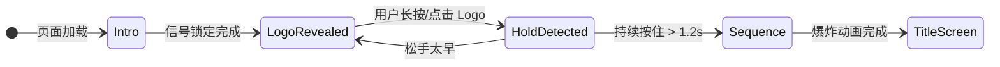
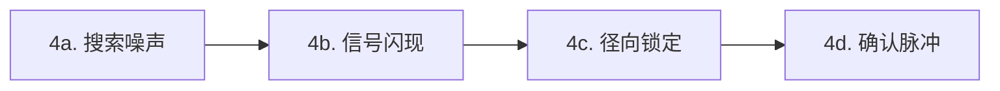
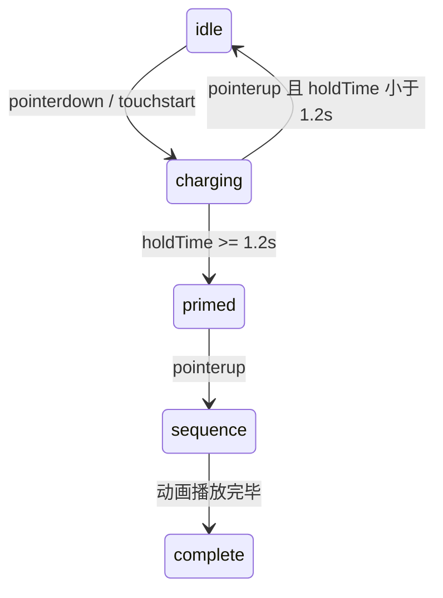
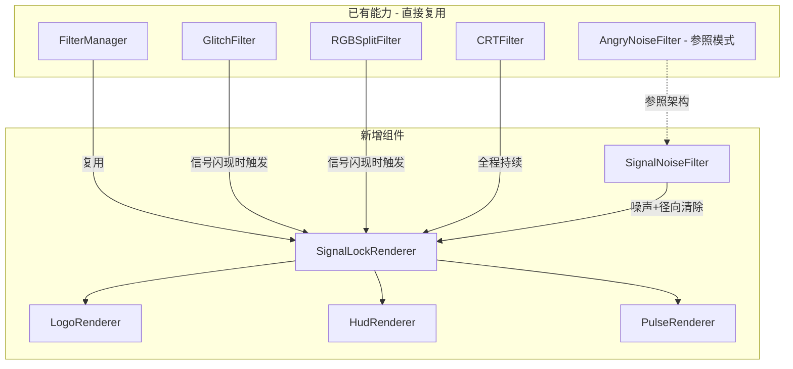

# 开屏动画重构设计文档

## 1. 概述

### 1.1 目标

将现有开屏动画（终端打字 → 扫描线揭示署名 → Glitch 切换）彻底替换为两段式沉浸动画：

1. **Phase 1 - 信号锁定**：画面从静态噪声中逐步"捕获"并锁定 Logo 信号
2. **Phase 2 - 能量启动**：点击 Logo 触发能量吸入→爆炸→进入标题画面

### 1.2 设计原则

- **不引入新的渲染依赖**：充分利用现有 PixiJS v7 + pixi-filters
- **统一体验**：桌面端与移动端使用相同效果参数，不做性能降级
- **最大复用**：核心效果完全基于现有 FilterManager 能力 + 一个新自定义滤镜

### 1.3 技术约束

| 约束     | 说明                                                            |
| -------- | --------------------------------------------------------------- |
| 渲染引擎 | PixiJS v7（已有）                                               |
| 滤镜     | pixi-filters v5（已有）+ 自定义 Filter（参照 AngryNoiseFilter） |
| 动画     | Framer Motion（UI 层）+ PixiJS ticker（Canvas 层）              |
| Logo     | `public/tsian.svg`（十字裂隙图标，颜色待更新为主题色）          |
| 状态管理 | React useState + 回调                                           |

### 1.4 与原 GPU 粒子方案的对比

| 维度            | 原方案（GPU 粒子系统）                           | 新方案（信号锁定）                         |
| --------------- | ------------------------------------------------ | ------------------------------------------ |
| 核心技术        | Mesh + 自定义顶点/片段着色器 + DRAW_MODES.POINTS | Filter（片段着色器）+ Graphics 遮罩        |
| 自定义 GLSL     | 顶点 + 片段着色器                                | 仅片段着色器（与 AngryNoiseFilter 同模式） |
| 新增 PixiJS API | Mesh, Geometry, Buffer, Shader, DRAW_MODES       | 无需新增（全部已导出）                     |
| 数据管理        | 80,000 粒子的环形缓冲区                          | 仅 uniform 参数                            |
| 实现风险        | POINTS 模式兼容性、坐标系统差异                  | 极低（Filter 模式已验证）                  |
| 视觉风格        | 流星拖尾→横扫揭示                                | 静态噪声→信号闪现→径向清除→锁定确认        |

---

## 2. 已确认的设计决策

| 决策项        | 结论                          | 说明                                               |
| ------------- | ----------------------------- | -------------------------------------------------- |
| Logo 揭示方式 | 信号锁定（Signal Lock）       | 从噪声中逐步锁定信号，符合赛博朋克/神经接续主题    |
| 核心渲染技术  | 自定义 Filter + Graphics 遮罩 | 不需要自定义 Geometry/Mesh/顶点着色器              |
| 噪声效果      | SignalNoiseFilter（新）       | 参照 AngryNoiseFilter 模式，纯片段着色器           |
| 滤镜复用      | FilterManager 全部复用        | GlitchFilter + RGBSplitFilter + CRTFilter 直接使用 |
| Logo 颜色     | 更新为主题色（青色渐变）      | 当前 SVG 是 indigo/pink，需更新                    |
| 动画完成后    | 直接进入 TitleScreen          | 暂不实现作者署名阶段                               |
| 鼠标跟随      | 不需要                        | 无交互式粒子                                       |

---

## 3. 整体流程



### 3.1 状态定义

```typescript
type SplashPhase =
  | "intro"      // 信号锁定阶段（自动播放）
  | "idle"       // Logo 已揭示，等待用户交互
  | "charging"   // 用户按住 Logo，能量聚集
  | "sequence"   // 启动序列（吸入→爆炸→冲击波）
  | "complete"   // 动画完成，进入标题画面
```

---

## 4. Phase 1 - 信号锁定（Signal Lock）

### 4.1 效果概述

画面模拟在搜索一个微弱的信号源，经历四个子阶段逐步锁定并显示 Logo：



### 4.2 子阶段详解

#### 4a. 搜索噪声 Search Static（0-800ms）

**视觉效果**：
- 全屏静态噪声/雪花覆盖（新的 SignalNoiseFilter）
- CRT 扫描线 + 轻微曲面变形
- 屏幕底部或顶部有模拟的 HUD 文字：`SCANNING... 频率 XXX.XX MHz`
- 噪声强度从 100% 开始，保持高强度

**技术实现**：
- `SignalNoiseFilter`：全屏覆盖的片段着色器，产生 TV 静态噪声纹理
- `CRTFilter`：已有，直接使用
- HUD 文字：PixiJS Text 或 DOM 覆盖层

#### 4b. 信号闪现 Signal Glimpse（800-2000ms）

**视觉效果**：
- Logo 在噪声中间歇性闪烁出现（每次 100-200ms 可见）
- 每次闪现伴随强烈的 RGB 色差抖动 + 水平撕裂
- 闪现间隔逐渐缩短（第一次 400ms 间隔 → 最后 150ms 间隔）
- 闪现时 Logo 有轻微位置偏移（像信号不稳定）
- HUD 文字更新：`SIGNAL DETECTED... LOCKING...`

**技术实现**：
- Logo 作为 `Sprite` 加载到 PixiJS Stage
- 通过 `logo.visible` 或 `logo.alpha` 控制闪烁
- 每次闪现同步触发 `FilterManager.triggerRGBSplit()` + `FilterManager.triggerTear()`
- Logo 位置用 `logo.position.set(x + jitter, y + jitter)` 做随机偏移

#### 4c. 径向锁定 Radial Lock（2000-3200ms）

**视觉效果**：
- Logo 固定在屏幕中心，不再消失
- 噪声从 Logo 中心开始**径向向外清除**
- 清除边界有明亮的青色扫描环（类似雷达扫描）
- 清除区域内 Logo 清晰可见，外部仍是噪声
- GlitchFilter 效果逐渐减弱

**技术实现**：
- `SignalNoiseFilter` 新增 `uClearCenter`（vec2）和 `uClearRadius`（float）uniform
- 片段着色器中：距离中心 < `uClearRadius` 的区域不施加噪声
- 清除边界用 `smoothstep` 做柔和过渡 + 青色发光环
- 每帧更新 `uClearRadius` 从 0 → 屏幕对角线长度

#### 4d. 确认脉冲 Confirm Pulse（3200-3800ms）

**视觉效果**：
- 噪声完全清除，画面变为纯黑背景 + Logo
- Logo 触发一次能量脉冲：从中心向外扩散的青色光环
- 脉冲过后 Logo 保持发光效果（呼吸发光）
- 底部淡入提示文字：`SIGNAL LOCKED · TOUCH TO INITIALIZE`

**技术实现**：
- 脉冲环：PixiJS `Graphics` 绘制扩散圆环，配合 alpha 淡出
- 或者用 DOM + CSS animation 做径向扩散
- Logo 发光：CSS/SVG filter 的 drop-shadow，或 PixiJS GlowFilter
- 提示文字：DOM 层 Framer Motion 淡入

### 4.3 SignalNoiseFilter 设计

参照 `AngryNoiseFilter` 的架构，创建新的自定义 Filter：

```typescript
class SignalNoiseFilter extends Filter {
  // Uniforms
  uniforms: {
    uTime: number;           // 时间（驱动噪声动画）
    uIntensity: number;      // 噪声强度 (0-1)
    uResolution: number[];   // 屏幕尺寸
    uClearCenter: number[];  // 清除区域中心 (NDC)
    uClearRadius: number;    // 清除半径 (0 = 全噪声, 1 = 全清除)
    uScanRingWidth: number;  // 扫描环宽度
    uScanRingColor: number[];// 扫描环颜色 (RGB)
    uNoiseScale: number;     // 噪声缩放
    uFlickerSpeed: number;   // 闪烁速度
  };
}
```

**片段着色器核心逻辑**（伪代码）：

```glsl
void main() {
  vec4 original = texture2D(uSampler, vTextureCoord);

  // 计算到清除中心的距离
  float dist = distance(vTextureCoord, uClearCenter);
  float normalizedDist = dist / uMaxDist;

  // 清除区域遮罩（中心清晰 → 外部噪声）
  float clearMask = smoothstep(uClearRadius, uClearRadius + 0.02, normalizedDist);

  // TV 静态噪声
  float noise = tvNoise(vTextureCoord, uTime, uNoiseScale);

  // 扫描环发光
  float ring = scanRing(normalizedDist, uClearRadius, uScanRingWidth);

  // 混合：清除区域显示原始内容，外部显示噪声
  vec3 noiseColor = vec3(noise) * 0.3;
  vec3 finalColor = mix(original.rgb, noiseColor, clearMask * uIntensity);

  // 叠加扫描环
  finalColor += uScanRingColor * ring;

  gl_FragColor = vec4(finalColor, 1.0);
}
```

### 4.4 视觉参数

| 参数         | 值                              | 说明                 |
| ------------ | ------------------------------- | -------------------- |
| 噪声颜色     | 灰白色（TV 雪花风格）           | 经典静态噪声         |
| 扫描环颜色   | `vec3(0.0, 0.9, 0.8)` (#00E5CC) | 主题青色             |
| 扫描环宽度   | 0.015（NDC 单位）               | 窄而明亮的扫描线     |
| CRT 扫描线   | lineContrast: 0.15              | 比当前略强           |
| RGB 色差峰值 | 15-25px                         | 信号闪现时的剧烈抖动 |
| 撕裂切片     | 8-15                            | 信号闪现时的水平撕裂 |

### 4.5 时间线

| 时间        | 事件                           | 技术操作                          |
| ----------- | ------------------------------ | --------------------------------- |
| 0ms         | 全屏噪声 + CRT 效果            | SignalNoiseFilter intensity=1.0   |
| 200ms       | HUD 文字显示 SCANNING...       | PixiJS Text 淡入                  |
| 800ms       | 第一次 Logo 闪现（100ms 可见） | logo.alpha=1 → 0, triggerRGBSplit |
| 1100ms      | 第二次 Logo 闪现（120ms 可见） | 同上，间隔缩短                    |
| 1350ms      | 第三次 Logo 闪现（150ms 可见） | 同上，更强的 RGB 色差             |
| 1550ms      | 第四次闪现（180ms 可见）       | 同上，位置偏移减小                |
| 1800ms      | 第五次闪现（200ms 可见）       | 信号趋于稳定                      |
| 2000ms      | Logo 固定显示，径向清除开始    | uClearRadius 从 0 开始递增        |
| 2000-3200ms | 清除半径扩大，扫描环向外推进   | 每帧更新 uClearRadius             |
| 3200ms      | 噪声完全清除                   | uIntensity → 0                    |
| 3400ms      | 确认脉冲（青色光环扩散）       | Graphics 圆环动画                 |
| 3600ms      | 提示文字淡入                   | DOM Framer Motion                 |
| 3800ms      | 进入 idle 状态                 | phase = "idle"                    |

---

## 5. Phase 2 - 能量启动（Angel 风格）

### 5.1 效果描述

参考 `examples/angel/index.html` 中的 Logo 交互效果（纯 Canvas 2D 实现）：

1. 用户**长按** Logo
2. 星空加速 + 能量环旋转加速 + 闪电效果
3. 松手后（如果按住超过 1.2 秒），触发**启动序列**：
   - 星空急停
   - 粒子吸入 Logo 中心
   - 闪白爆炸 + 冲击波扩散
   - 淡出进入标题画面

### 5.2 实现对照

| Angel 原版元素  | 新版实现         | 技术方案               |
| --------------- | ---------------- | ---------------------- |
| 星空背景 Canvas | 简单星空粒子     | PixiJS Graphics 小圆点 |
| tech-ring 旋转  | 能量环 CSS 动画  | Framer Motion / CSS    |
| 闪电效果        | Canvas 2D 折线   | PixiJS Graphics        |
| 吸入效果        | 粒子向中心运动   | PixiJS ticker 动画     |
| 闪白爆炸        | 全屏白色 overlay | DOM + CSS transition   |
| 冲击波          | Canvas 圆环扩散  | PixiJS Graphics        |
| 碎片粒子        | 爆炸碎片         | PixiJS Graphics        |
| Logo 样式层     | 简化为发光效果   | CSS glow + filter      |
| 3D 按钮效果     | 不需要           | -                      |

### 5.3 交互状态机



### 5.4 时间线

#### 按住阶段 charging

| 时间   | 效果                               |
| ------ | ---------------------------------- |
| 0ms    | Logo 添加 calibrating 类，星空加速 |
| 持续   | 能量环加速旋转，间歇闪电           |
| 1200ms | Logo 添加 primed 类，表示可以释放  |

#### 启动序列 sequence

| 时间        | 效果                             |
| ----------- | -------------------------------- |
| 0ms         | 星空急停                         |
| 0-100ms     | 密集闪电爆发                     |
| 100ms       | 进入吸入模式                     |
| 100-1200ms  | 所有粒子螺旋吸入中心             |
| 1200ms      | Logo 内缩 + 隐藏能量环           |
| 1400ms      | 闪白爆炸 + 色差冲击              |
| 1400-1600ms | 所有星星向外爆炸 + 碎片 + 冲击波 |
| 1600-1900ms | 淡出所有效果                     |
| 1900ms      | 调用 onComplete，进入标题画面    |

---

## 6. 组件架构

### 6.1 文件结构

```
src/components/SplashScreen/
├── index.tsx                        # 主组件（状态管理）
├── SplashCanvas.tsx                 # PixiJS 统一画布
├── renderers/
│   ├── SignalLockRenderer.ts        # 信号锁定动画编排器
│   ├── LogoRenderer.ts             # Logo Sprite 管理（闪现/固定/发光）
│   ├── HudRenderer.ts              # HUD 文字渲染（SCANNING... / LOCKED）
│   ├── PulseRenderer.ts            # 确认脉冲 + 冲击波效果
│   ├── StarfieldRenderer.ts        # 星空背景渲染器
│   └── ExplosionRenderer.ts        # 爆炸效果渲染器
├── filters/
│   └── SignalNoiseFilter.ts        # 自定义 TV 噪声滤镜（片段着色器）
├── LogoContainer.tsx                # Logo + 能量环 DOM 组件
└── types.ts                         # 类型定义
```

### 6.2 组件职责

| 组件                 | 职责                                           |
| -------------------- | ---------------------------------------------- |
| `SplashScreen`       | 状态机管理、Phase 切换、生命周期               |
| `SplashCanvas`       | PixiJS 画布初始化、渲染器调度、帧循环          |
| `SignalLockRenderer` | Phase 1 动画编排（噪声→闪现→径向清除→脉冲）    |
| `LogoRenderer`       | Logo SVG 加载为 Sprite，闪烁/固定显示/发光控制 |
| `HudRenderer`        | 模拟 HUD 状态文字的打字效果                    |
| `PulseRenderer`      | 确认脉冲光环 + Phase 2 冲击波                  |
| `StarfieldRenderer`  | 星空粒子管理（idle/加速/吸入/爆炸）            |
| `ExplosionRenderer`  | 闪电、碎片效果                                 |
| `SignalNoiseFilter`  | 自定义片段着色器：TV 静态噪声 + 径向清除遮罩   |
| `LogoContainer`      | Logo SVG、能量环、交互事件、CSS 动画           |

### 6.3 技术依赖图



### 6.4 数据流

```
页面加载
   ↓
SplashScreen（phase: intro）
   ↓
SplashCanvas 初始化 PixiJS
   ↓
SignalLockRenderer 开始编排动画
   ├── SignalNoiseFilter（噪声覆盖）
   ├── FilterManager（GlitchFilter + RGBSplitFilter + CRTFilter）
   ├── LogoRenderer（Logo 闪烁/固定/发光）
   ├── HudRenderer（状态文字）
   └── PulseRenderer（确认脉冲）
   ↓
动画完成 → phase: idle
   ↓
用户交互（pointer events）
   ↓
LogoContainer（DOM 层）
   ├── CSS class 切换（calibrating/primed）
   └── Framer Motion 动画
   ↓
phase: sequence → phase: complete → onComplete()
```

---

## 7. 不需要扩展 PixiJS 导出

与原方案不同，信号锁定方案**不需要**在 `src/lib/pixi/index.ts` 中新增任何导出。所有使用的 API（Application, Container, Graphics, Sprite, Text, TextStyle, Texture, Filter）已经导出。

自定义 `SignalNoiseFilter` 继承自已导出的 `Filter` 类，与 `AngryNoiseFilter` 模式完全一致。

---

## 8. 与现有代码的关系

### 8.1 需要替换的文件

| 文件                                               | 处理方式                     |
| -------------------------------------------------- | ---------------------------- |
| `src/components/SplashScreen/index.tsx`            | **重写**                     |
| `src/components/SplashScreen/PixiSplashCanvas.tsx` | **重写**（拆分为多个渲染器） |
| `src/config/splash.ts`                             | **大幅修改**（新配置结构）   |

### 8.2 保留/复用的能力

| 能力                    | 来源                     | 复用方式                              |
| ----------------------- | ------------------------ | ------------------------------------- |
| PixiJS Application 创建 | `PixiSplashCanvas.tsx`   | 沿用初始化模式                        |
| FilterManager           | `PixiSplashCanvas.tsx`   | **核心复用** - 直接使用其滤镜触发方法 |
| 自定义 Filter 模式      | `AngryNoiseFilter.ts`    | **参照架构**创建 SignalNoiseFilter    |
| Framer Motion 退出动画  | `SplashScreen/index.tsx` | 沿用 AnimatePresence                  |
| pixi-filters            | `pixi-filters`           | CRT/Glitch/RGBSplit 直接使用          |

### 8.3 不受影响的组件

- `TitleScreen/` - 完全不变
- `App.tsx` - 接口不变（onComplete 回调）
- `effects/` - 不变

---

## 9. 技术风险与备选方案

| 风险              | 说明                                          | 备选方案                            |
| ----------------- | --------------------------------------------- | ----------------------------------- |
| TV 噪声性能       | 片段着色器逐像素计算噪声                      | 使用预生成噪声纹理 + UV 动画滚动    |
| Filter 叠加顺序   | SignalNoiseFilter 与 FilterManager 的滤镜共存 | 分层容器，不同容器独立滤镜          |
| Logo SVG 渲染质量 | PixiJS Sprite 加载 SVG 可能模糊               | 改用高分辨率 PNG 或 DOM 层渲染 Logo |
| 径向清除边界锯齿  | smoothstep 过渡可能不够平滑                   | 增大过渡区域宽度 + 噪声化边界       |

---

## 10. 实现步骤（Todo）

1. 创建 `SignalNoiseFilter`（自定义片段着色器）
2. 实现 `LogoRenderer`（Logo SVG 加载 + 闪烁控制）
3. 实现 `SignalLockRenderer`（Phase 1 动画编排）
4. 实现 `HudRenderer`（HUD 状态文字）
5. 实现 `PulseRenderer`（确认脉冲光环）
6. 重写 `SplashCanvas.tsx`（新的画布管理）
7. 重写 `SplashScreen/index.tsx`（新状态机）
8. 更新 `config/splash.ts`（新配置参数）
9. 实现 Phase 2 能量启动效果
10. 集成测试 + 动画调参

---

## 11. 已废弃的文档

以下文档与 GPU 粒子系统方案相关，已不再适用：

- ~~`pixi-mesh-shader-technical-guide.md`~~ - PixiJS Mesh + 自定义 Shader 的 GPU 粒子技术指南（已废弃）
