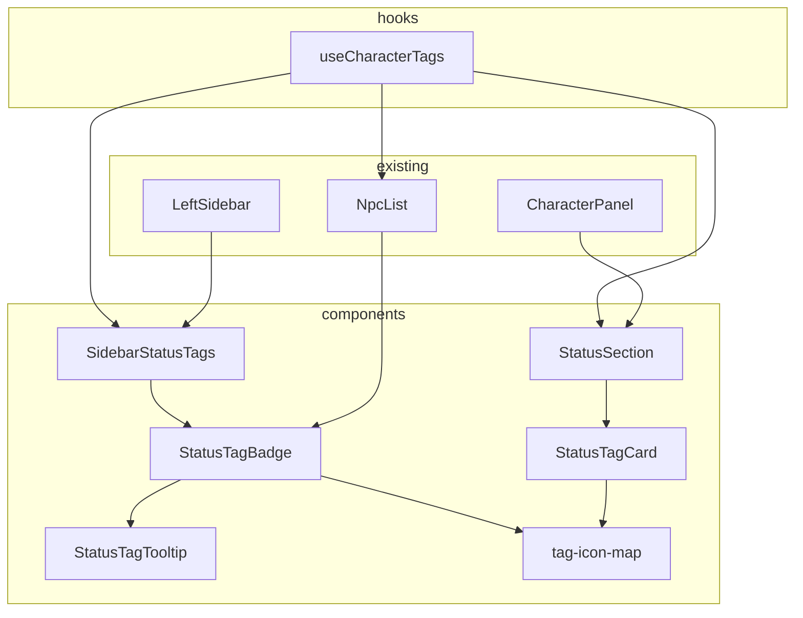

# TAG 状态效果可视化 UI 设计方案

> **状态**：Draft - 待讨论  
> **关联系统**：TAG（TagMetadata）、ConditionConfig、LeftSidebar、CharacterPanel

---

## 1. 问题分析

TAG 系统后端已完整实现（数据结构、引擎执行、触发器管线、Yjs 持久化、AI Prompt 感知），但**完全没有面向玩家的可视化 UI**。

### 当前缺失

| 缺失项                            | 影响                                   |
| --------------------------------- | -------------------------------------- |
| LeftSidebar 无 buff/debuff 状态条 | 玩家无法一眼看到角色当前受到的状态效果 |
| CharacterPanel 无"状态效果"标签页 | 无法查看状态效果的详细信息             |
| NPC 面板无 TAG 展示               | 无法了解 NPC 身上的状态效果            |
| 无 hover 悬浮提示                 | 无法快速查看效果描述、剩余回合等       |
| ConditionConfig.icon 未使用       | 预定义条件的图标配置被浪费             |

### 可用数据

[`TagMetadata`](src/domain/types/result-frame.ts:129) 已包含丰富的展示信息：

```
displayName      → 显示名称（如"中毒"、"炎上"）
effectDescription → 效果描述文字
remainingDuration → 剩余回合数（undefined = 永久）
stacks           → 叠加层数
source           → predefined | ai-generated
category         → talent | condition | equipment
trigger?.timing  → turn_start | on_damage | passive
```

[`ConditionConfig`](src/lib/world/types.ts:80) 中有 `icon` 字段可映射图标。

---

## 2. 设计方案

### 2.1 总体思路：两层展示

```
┌─────────────────────────────────────────────────────────┐
│  Layer 1: LeftSidebar 紧凑状态栏                         │
│  位置：资源条下方                                        │
│  形态：小型 TAG 徽章横向排列                              │
│  交互：hover 显示 Tooltip                                │
├─────────────────────────────────────────────────────────┤
│  Layer 2: CharacterPanel 状态效果标签页                   │
│  位置：新增"状态"标签页（在 talents 后面）                 │
│  形态：卡片列表，每个 TAG 一张卡片，完整信息展示           │
│  交互：查看完整效果描述、触发器类型、来源等                │
└─────────────────────────────────────────────────────────┘
```

### 2.2 Layer 1: LeftSidebar 紧凑状态栏

**位置**：在 [`SidebarResources`](src/components/GameHUD/LeftSidebar.tsx:142) 和 [`SidebarDescription`](src/components/GameHUD/LeftSidebar.tsx:194) 之间。

**布局**：

```
┌──────────────────────────────┐
│  [头像]                       │
│  角色名  LV.5                 │
├──────────────────────────────┤
│  HP ██████████░░ 80/100       │
│  MP ████░░░░░░░░ 30/80        │
├──────────────────────────────┤  ← 新增区域
│  ☠中毒(3) 🔥炎上(2) 🛡守护    │  ← 紧凑TAG徽章
├──────────────────────────────┤
│  外貌: ...                    │
│  性格: ...                    │
└──────────────────────────────┘
```

**TAG 徽章设计**：

```
┌─────────────┐
│ 🔥 炎上  ②  │   ← 图标 + 名称 + 剩余回合数
└─────────────┘
   │     │   │
   │     │   └─ 回合数徽章（永久效果不显示数字）
   │     └───── displayName（截断到4字）
   └─────────── icon 或默认图标
```

**视觉规则**：

| 状态类型 | 颜色主题             | 说明               |
| -------- | -------------------- | ------------------ |
| 负面效果 | `error` 色系         | 如中毒、出血、灼烧 |
| 正面效果 | `primary` 色系       | 如守护、祝福、隐身 |
| 中性效果 | `textSecondary` 色系 | 如标记、追踪       |

> **关于正面/负面区分**：当前 `TagMetadata` 没有 `polarity` 字段来区分正/负面效果。方案有两种：
> 1. **方案 A**：不区分，统一用 `primary` 色系（最简单，推荐初版）
> 2. **方案 B**：扩展 `ConditionConfig` 增加 `polarity: "positive" | "negative" | "neutral"` 字段

**数量限制**：侧边栏最多展示 **6 个** TAG 徽章，超出部分显示 `+N` 溢出指示器。

**分类过滤**：只展示 `category === "condition"` 或 `category === undefined` 的 TAG。天赋（talent）和装备效果（equipment）在各自标签页已有展示。

### 2.3 Layer 2: CharacterPanel 状态效果标签页

**新增标签页**：在 [`TAB_ITEMS`](src/components/CharacterPanel/index.tsx:62) 数组中，`talents` 后面添加 `"status"` 标签页。

```typescript
// 新增标签页
{ key: "status", label: "状态", icon: Activity }
```

**标签页内容**：卡片式列表

```
┌───────────────────────────────────────────────┐
│ 状态效果 (3)                                    │
├───────────────────────────────────────────────┤
│ ┌─────────────────────────────────────────┐   │
│ │ 🔥 炎上                    剩余 2 回合   │   │
│ │ 每回合受到 3 点火焰伤害                   │   │
│ │ ┄┄┄┄┄┄┄┄┄┄┄┄┄┄┄┄┄┄┄┄┄┄┄┄┄┄┄┄┄┄┄┄┄┄   │   │
│ │ 触发: 回合开始  │  来源: 系统预定义       │   │
│ └─────────────────────────────────────────┘   │
│                                               │
│ ┌─────────────────────────────────────────┐   │
│ │ ☠ 中毒  x3                 剩余 5 回合   │   │
│ │ 每回合受到 1d4 毒素伤害                   │   │
│ │ ┄┄┄┄┄┄┄┄┄┄┄┄┄┄┄┄┄┄┄┄┄┄┄┄┄┄┄┄┄┄┄┄┄┄   │   │
│ │ 触发: 回合开始  │  来源: 系统预定义       │   │
│ │ 叠加: 3 层                              │   │
│ └─────────────────────────────────────────┘   │
│                                               │
│ ┌─────────────────────────────────────────┐   │
│ │ ✨ 被通缉                       永久     │   │
│ │ 被当地官方通缉，社交检定 -2               │   │
│ │ ┄┄┄┄┄┄┄┄┄┄┄┄┄┄┄┄┄┄┄┄┄┄┄┄┄┄┄┄┄┄┄┄┄┄   │   │
│ │ 触发: 被动     │  来源: AI 动态创造      │   │
│ └─────────────────────────────────────────┘   │
│                                               │
│ ── 无更多状态效果 ──                            │
└───────────────────────────────────────────────┘
```

**卡片信息项**：

| 字段     | 数据来源                                 | 展示方式                     |
| -------- | ---------------------------------------- | ---------------------------- |
| 图标     | `ConditionConfig.icon` → lucide 图标映射 | 左侧图标                     |
| 名称     | `TagMetadata.displayName`                | 标题文字                     |
| 叠加层数 | `TagMetadata.stacks`                     | 名称后 `x{N}` 徽章           |
| 剩余回合 | `TagMetadata.remainingDuration`          | 右侧 `剩余 N 回合` 或 `永久` |
| 效果描述 | `TagMetadata.effectDescription`          | 副标题文字                   |
| 触发类型 | `TagMetadata.trigger?.timing`            | 底部标签                     |
| 来源     | `TagMetadata.source`                     | 底部标签                     |

**空状态**：角色无任何状态效果时，显示 `当前没有活跃的状态效果` 提示。

### 2.4 NPC TAG 展示

在 [`NpcList`](src/components/CharacterPanel/NpcList.tsx:1) 的 NPC 展开详情中，也展示该 NPC 的 condition 类 TAG，复用与 LeftSidebar 相同的紧凑徽章组件。

```
NPC 展开详情:
┌─────────────────────────────────────────┐
│ 歌尔达（商人）                  在场 🟢  │
│ ────────────────────────────────────────│
│ [属性雷达图]                             │
│ [资源条]                                │
│ 状态: 🔥炎上(2) ☠中毒(3)               │  ← 紧凑TAG徽章
│ [技能列表]                               │
└─────────────────────────────────────────┘
```

### 2.5 Hover Tooltip

所有 TAG 徽章（LeftSidebar 和 NPC 面板中的）支持 hover 显示 Tooltip：

```
┌───────────────────────────┐
│ 🔥 炎上                    │
│ 每回合受到 3 点火焰伤害     │
│ ─────────────────────────  │
│ 剩余: 2 回合               │
│ 触发: 回合开始              │
│ 来源: 系统预定义            │
└───────────────────────────┘
```

使用项目已有的 Tooltip 或 Popover UI 组件实现。

---

## 3. 数据层设计

### 3.1 新增 Hook: `useCharacterTags`

```typescript
// src/hooks/useCharacterTags.ts

interface CharacterTag {
  id: string
  displayName: string
  effectDescription: string
  remainingDuration?: number   // undefined = 永久
  stacks?: number
  source: 'predefined' | 'ai-generated'
  timing?: 'turn_start' | 'on_damage' | 'passive'
  icon?: string               // 来自 ConditionConfig
}

function useCharacterTags(
  character: Character | null,
  worldConfig: WorldConfig
): CharacterTag[]
```

**逻辑**：
1. 调用 `deserializeTagsFromYjs(character.tags)` 获取所有 TAG
2. 过滤掉 `category === "talent"` 和 `category === "equipment"` 的 shadow TAG
3. 与 `worldConfig.conditions` 匹配，补充 `icon` 信息
4. 按来源和持续时间排序（系统预定义在前，AI 生成在后；有限时间在前，永久在后）

### 3.2 图标映射策略

[`ConditionConfig.icon`](src/lib/world/types.ts:95) 字段存储的是字符串标识。

**映射方案**：

```typescript
// src/components/CharacterPanel/tag-icon-map.ts

const TAG_ICON_MAP: Record<string, LucideIcon> = {
  'skull': Skull,         // 毒
  'flame': Flame,         // 炎上
  'droplets': Droplets,   // 出血
  'snowflake': Snowflake, // 冻结
  'shield': Shield,       // 守护
  'zap': Zap,             // 麻痹
  'eye-off': EyeOff,      // 致盲
  // ...
}

// 未配置 icon 的 TAG 使用默认图标
const DEFAULT_TAG_ICON = CircleDot
```

---

## 4. 组件结构

```
src/components/CharacterPanel/
├── StatusSection.tsx          # Layer 2: 状态效果标签页内容
├── StatusTagBadge.tsx         # 紧凑TAG徽章（复用于 LeftSidebar 和 NPC 面板）
├── StatusTagCard.tsx          # Layer 2: 状态效果详情卡片
├── StatusTagTooltip.tsx       # Hover 提示
└── tag-icon-map.ts            # 图标映射表

src/hooks/
├── useCharacterTags.ts        # TAG 数据提取 Hook

src/components/GameHUD/
├── LeftSidebar.tsx            # 修改：在资源条下方添加 SidebarStatusTags
├── SidebarStatusTags.tsx      # Layer 1: 侧边栏紧凑状态栏
```

### 组件依赖关系



---

## 5. 实现步骤

| 步骤 | 内容                                                | 涉及文件                                              |
| ---- | --------------------------------------------------- | ----------------------------------------------------- |
| 1    | 创建 `useCharacterTags` Hook                        | `src/hooks/useCharacterTags.ts`                       |
| 2    | 创建 `tag-icon-map.ts` 图标映射                     | `src/components/CharacterPanel/tag-icon-map.ts`       |
| 3    | 创建 `StatusTagBadge` + `StatusTagTooltip` 组件     | `src/components/CharacterPanel/StatusTagBadge.tsx` 等 |
| 4    | 创建 `SidebarStatusTags` 并嵌入 LeftSidebar         | `src/components/GameHUD/SidebarStatusTags.tsx`        |
| 5    | 创建 `StatusTagCard` + `StatusSection` 并注册标签页 | `src/components/CharacterPanel/StatusSection.tsx` 等  |
| 6    | 在 NpcList 展开详情中添加 TAG 徽章                  | `src/components/CharacterPanel/NpcList.tsx`           |

---

## 6. 待讨论的设计决策

### 决策 1: TAG 正/负面区分

- **方案 A**（推荐初版）：不区分，统一用 `primary` 色系
- **方案 B**：扩展 `ConditionConfig` 增加 `polarity` 字段，后续迭代

### 决策 2: LeftSidebar 徽章最大数量

- 建议 **6 个**，超出显示 `+N`
- 侧边栏宽度有限（~200px），需控制展示量

### 决策 3: 永久效果的展示

- `remainingDuration === undefined` 的 TAG 显示为 `∞` 还是不显示数字？
- 建议：不显示回合数标记，仅显示名称和图标

### 决策 4: NPC 展示范围

- NPC 面板已有较多信息（雷达图、资源条、技能、装备），是否需要展示 TAG？
- 建议：展示，但仅用紧凑徽章形式（与 LeftSidebar 一致）

### 决策 5: TAG 变更通知

- 是否需要在 TAG 添加/移除/到期时显示 Toast 通知？
- 当前不包含在本方案中，建议作为后续迭代
