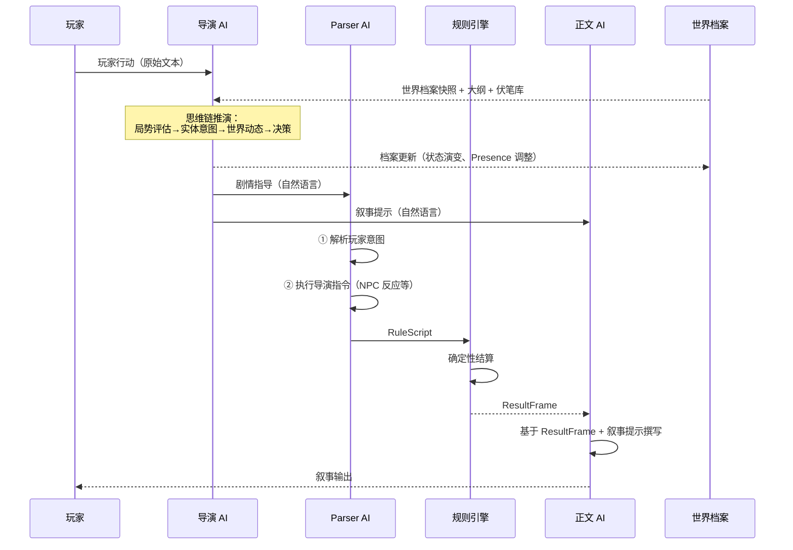

# 世界档案系统与导演 AI 统一设计方案

> **文档状态**：架构决策已确认，待实施
> **创建日期**：2026-02
> **审阅日期**：2026-02-27
> **前置文档**：
> - [director-ai-memory-system-design.md](director-ai-memory-system-design.md)（原 Director AI 概念设计）
> - [memory-system-design.md](memory-system-design.md)（分段记忆系统，已实施）
> - [blackboard-pipeline-design.md](blackboard-pipeline-design.md)（黑板管道架构，Phase A-D 已实施）
> - [npc-full-entity-design.md](npc-full-entity-design.md)（NPC 统一实体方案）
> - [lyra-architecture.md](lyra-architecture.md)（项目愿景与架构白皮书）
>
> **替代关系**：本文档整合并替代 `director-ai-memory-system-design.md` 中的 Director AI 部分设计。  
> 分段记忆系统已独立实施，不受本文档影响。

---

## 1. 设计决策摘要

| 决策项             | 方案                                                                |
| ------------------ | ------------------------------------------------------------------- |
| 系统定位           | 世界档案 + 导演 AI 作为不可分割的整体，是构建动态世界的核心基础设施 |
| 导演 AI 角色       | **编剧/DM**——为整台戏提供剧本指导，不接管其他 AI 的执行工作         |
| 推演职能归属       | 从 Parser AI 和正文 AI 收回推演职能，集中到导演 AI                  |
| 管道流程变化       | 最小变化——导演 AI 作为前置阶段注入指导信息，不改变现有管道结构      |
| 导演输出格式       | 简练的自然语言指导，不输出 RuleScript                               |
| 降级策略           | 不支持关闭导演 AI——动态世界是项目核心卖点                           |
| 实体类型范围       | 先聚焦核心（NPC、事件），保留扩展性，日后按需增加                   |
| 世界档案与现有系统 | 不替代 Character/Lorebook/Memory，而是填补它们之间的空白层          |

---

## 2. 问题背景

### 2.1 核心矛盾

| 矛盾               | 描述                                                | 现有系统为何无法解决                                                              |
| ------------------ | --------------------------------------------------- | --------------------------------------------------------------------------------- |
| **一致性 vs 销毁** | NPC 退场后销毁，再次登场时 AI 可能生成矛盾版本      | Character 只有 `active/off_scene/archived/dead` 四种状态，归档 = 冻结，无演变能力 |
| **完整性 vs 噪音** | 始终发送所有实体数据导致提示词膨胀，AI 注意力被稀释 | 没有按叙事相关性分层注入的机制                                                    |
| **静态 vs 演变**   | 写入世界书变成死数据，无法表达离场期间的经历变化    | Lorebook 是静态文本，不跟踪状态变化                                               |
| **即兴 vs 规划**   | NPC 反应是逐回合即兴的，缺乏长线一致性              | 推演散落在 Parser AI 和正文 AI 中，没有人"全局看棋盘"                             |
| **玩家 vs 世界**   | 世界不会自己运转，一切只在玩家交互时才发生          | 没有驱动世界自主运转的机制                                                        |

### 2.2 现有系统的职责定位

```
┌──────────────────────────────────────────────────────────────────┐
│  Lorebook（世界书）                                               │
│  回答："世界是什么样的"                                           │
│  内容：地理、历史、种族、法则等不变的背景知识                       │
│  特征：静态、关键词被动激活、Token 预算控制                         │
│  局限：不适合存放会演变的实体                                      │
├──────────────────────────────────────────────────────────────────┤
│  Character + Inventory + Skills（游戏数据层）                      │
│  回答："角色的机械属性是什么"                                      │
│  内容：属性值、物品、技能、Tags、装备效果                          │
│  特征：精确的数值数据，供规则引擎使用                               │
│  局限：不包含叙事语义信息（动机、计划、关系网络）                    │
├──────────────────────────────────────────────────────────────────┤
│  Memory（分段记忆）                                                │
│  回答："发生了什么"                                                │
│  内容：叙事摘要、剧情回顾                                          │
│  特征：回顾性的事件时序记录                                        │
│  局限：不记录"谁/什么处于什么状态"                                  │
├──────────────────────────────────────────────────────────────────┤
│  World Archive（世界档案）🆕                                       │
│  回答："世界中有谁/什么，它们现在处于什么状态"                      │
│  内容：NPC 的动机与现状、世界事件的进展、关系网络                   │
│  特征：动态的实体状态注册表，由导演 AI 主动维护                     │
│  与其他系统互补，不替代                                             │
└──────────────────────────────────────────────────────────────────┘
```

---

## 3. 导演 AI 架构

### 3.1 核心定位：编剧，不是控制者

```
导演 AI 不是：
  ❌ 控制者 — 不接管其他 AI 的工作
  ❌ 调度员 — 不编排管线流程
  ❌ 规则翻译器 — 不输出 RuleScript

导演 AI 是：
  ✅ 编剧 — 为整台戏提供剧本指导
  ✅ DM — 推演世界如何回应玩家行动
  ✅ 档案管理员 — 维护世界中所有叙事实体的状态
```

导演 AI 用简练的自然语言输出指导，让下游 AI 自由发挥专业能力：

```
┌────────────────────────────────────────────────────────────┐
│  导演 AI                                                    │
│  "这一幕，守卫应该因为看到伪造通行证而警觉。                  │
│   同时远处传来号角声——北方前线的增援请求到了。                 │
│   リナ在柜台后面偷偷向玩家使眼色。"                          │
│                                                            │
│  ↓ 自然语言指导               ↓ 自然语言指导                │
│                                                            │
│  Parser AI                    Narrator AI                   │
│  自行判断如何翻译为            自行决定如何描写               │
│  RuleScript 指令               这些场景细节                  │
│  （检定、战斗、NPC 行动）      （文风、氛围、节奏）           │
└────────────────────────────────────────────────────────────┘
```

### 3.2 职能收回：推演集中化

```
改造前（推演分散）：
  Parser AI:  解构 + 解析意图 + NPC 反应推演
  正文 AI:    描写结算结果 + 即时叙事涌现

改造后（推演集中）：
  导演 AI:    世界推演 + NPC 决策 + 剧情编排 + 世界档案维护
  Parser AI:  解析意图 + 执行导演指令（不再自行推演 NPC 反应）
  正文 AI:    演绎结算结果 + 遵循导演的叙事指导（不再自由涌现）
```

**关键变化**：

- Parser AI 的"反应推演"步骤改为"执行导演指令"——它不再自己决定 NPC 怎么反应，而是根据导演的指导生成对应的 RuleScript
- 正文 AI 从"自由涌现"变为"向导演的叙事提示靠拢"——仍有创作自由度，但在导演划定的框架内发挥

### 3.3 管道流程

管道的整体结构不变，导演 AI 作为 **Parser AI 之前的前置阶段** 注入：



### 3.4 与黑板管道的集成

在黑板管道架构中，导演 AI 是一个 **必选 Agent**（不可跳过）：

```typescript
const directorAgent: AgentDescriptor = {
  id: 'director',
  name: '导演AI',
  requires: ['playerInput', 'entityAccessor', 'aliasMap'],
  produces: ['plotDirectives', 'narrativeHints', 'archiveUpdates'],
  optional: false,  // ← 不可跳过

  async execute(bb) {
    const directorPreset = bb.presets.director;
    // 导演预设是必须的，缺失时应该在管线启动前校验并报错

    const directorContext = buildDirectorContext(bb);
    const executor = createAiExecutor(bb.aiConfig);
    const result = await executor.execute({
      preset: directorPreset,
      variableContext: directorContext,
    });

    if (result.success && result.content) {
      const parsed = parseDirectorOutput(result.content);
      bb.plotDirectives = parsed.directives;
      bb.narrativeHints = parsed.hints;
      bb.archiveUpdates = parsed.archiveUpdates;
    }
  },
};
```

**黑板字段扩展**：

```typescript
interface PipelineBlackboard {
  // ... 现有字段 ...

  // ═══ 导演层（必选） ═══

  /** 剧情指导（注入 Parser AI） */
  plotDirectives?: string;

  /** 叙事提示（注入 Narrator AI） */
  narrativeHints?: string;

  /** 世界档案更新（管线结束后回写） */
  archiveUpdates?: ArchiveUpdate[];

  // ═══ 世界档案快照（输入层，管线启动前填充） ═══

  /** 当前相关的叙事实体快照 */
  readonly archiveSnapshot?: ArchiveSnapshot;
}
```

### 3.5 导演 AI 输入

导演 AI 每轮收到的上下文：

```
导演 AI 输入：
  ┌─ 玩家行动（本轮原始输入）
  ├─ 世界档案快照
  │   ├─ active 实体（完整信息）
  │   ├─ nearby 实体（摘要信息）
  │   └─ dormant 实体中与当前场景相关的（按需召回）
  ├─ 剧情大纲（当前弧线 + 里程碑状态）
  ├─ 伏笔库（已埋伏笔 + 状态）
  ├─ 分段记忆（大总结 + 近期小总结）
  ├─ 当前游戏状态快照（实体属性摘要）
  └─ 世界观设定（WorldConfig 摘要）
```

### 3.6 导演 AI 定制思维链

```
STEP 1 - 局势评估
  "玩家当前在[地点]，正在做[事情]。
   与当前弧线[弧线名]的关系：[在主线上/小偏离/大偏离]。
   场景中有[active 实体列表]。"

STEP 2 - 实体意图推演
  "对每个 active 的角色类实体：
   [实体名]：核心动机[动机]，面对当前局势会[行为判断]
   对 nearby 的角色类实体：
   [实体名]：当前在[位置]做[事情]，是否应该介入？[判断]"

STEP 3 - 世界动态
  "世界事件时间线中当前应发生的事件：
   事件A：[描述]，是否该在本轮体现？[判断]
   dormant 实体中是否有应该被唤醒的？[判断]"

STEP 4 - 伏笔检查
  "遍历伏笔库：
   伏笔A：触发条件[条件]，当前[满足/接近/不满足]"

STEP 5 - 决策输出
  "本轮剧情指导：[给 Parser AI 的指令]
   本轮叙事提示：[给 Narrator AI 的创作方向]
   档案更新：[需要更新的实体状态]
   大纲/伏笔更新：[如有]"
```

### 3.7 导演 AI 输出格式

导演 AI 输出结构化的自然语言，使用 XML 标签划分区域：

```xml
<plot_directives>
1. 守卫验证通行证时发现伪造痕迹，警觉地按住腰间佩剑。
   建议生成通行证鉴定检定（DC 14，基于 INT）。
2. リナ在柜台后面注意到了玩家的窘境，偷偷向玩家使眼色，
   暗示公会后门可以逃走。这是 NPC 主动行为。
3. 远处传来号角声（北方前线的增援请求），守卫分神片刻。
   这是世界事件的间接影响，可降低检定 DC 或给玩家逃跑窗口。
</plot_directives>

<narrative_hints>
- 氛围：紧张但不绝望，暗示有逃脱的可能
- 守卫的描写：严肃但不冷酷，是在尽职而非刁难
- リナ的小动作要自然，不能太明显（伏笔铺垫阶段）
- 号角声的描写：远方、低沉、不祥，暗示更大的危机
</narrative_hints>

<archive_updates>
- 守卫(npc3)：状态更新为"因伪造通行证事件对玩家产生警觉"
- リナ(npc1)：状态更新为"开始暗中帮助玩家，但仍在犹豫中"
- 世界事件"北方战事"：进展为"前线发出增援请求，号角声传到城镇"
</archive_updates>

<outline_updates>
- 伏笔"リナ的秘密"：暗示次数 +1（本轮使眼色）
- 弧线偏离记录：玩家使用伪造通行证，可能提前触发"通缉"支线
</outline_updates>
```

**解析策略**：

系统从输出中提取四个 XML 区域，分别注入到：
- `plotDirectives` → Parser AI 的上下文
- `narrativeHints` → Narrator AI 的上下文
- `archiveUpdates` → 管线结束后回写世界档案
- `outlineUpdates` → 管线结束后回写剧情大纲/伏笔库

**错误处理**：采用 **fail-fast** 策略——XML 解析失败时直接抛出错误终止管线，而非跳过或静默降级。理由：导演 AI 是必选 Agent，其输出格式错误意味着整轮推演结果不可靠，静默跳过只会造成"看似正常实则停摆"的假象，不如直接报错暴露问题。

**实体引用**：`<archive_updates>` 中的实体引用支持 **ID 模糊匹配**——导演 AI 可能用名称而非精确 ID 引用实体（如 `リナ` 而非 `entity_xxx`），`parseDirectorOutput()` 应在解析时查询世界档案按名称反查 ID。

### 3.8 AI Profile 配置

导演 AI 使用独立的 AI Profile 和专用预设，与 Parser/Narrator/Summarizer 完全独立：

```typescript
// PresetPurpose 扩展
export type PresetPurpose = "narrative" | "parser" | "summarizer" | "director";

// 每种预设独立绑定 AI Profile
// 用户可以为导演 AI 选择不同的模型（如推理能力更强的模型）
```

---

## 4. 世界档案系统

### 4.1 叙事实体（Narrative Entity）

世界档案管理的基本单位是叙事实体——一切"为了演出而存在"的结构化对象：

```typescript
/**
 * 叙事实体 — 世界档案的原子单位
 *
 * 涵盖一切"为了演出而存在"的结构化对象。
 * 当前聚焦 character 和 event 类型，保留扩展性。
 */
interface NarrativeEntity {
  /** 全局唯一 ID */
  id: string;

  /** 实体类别 */
  archetype: EntityArchetype;

  /** 显示名称 */
  name: string;

  // ── 双层描述（核心设计） ──

  /**
   * 本质描述（核心特征，极少变动）
   *
   * 回答"这个实体本质上是什么"。
   * 包含不随剧情变化的核心身份特征。
   * 保证实体在任何时刻重新登场时的一致性。
   *
   * 示例（NPC）：
   *   "冒险者公会受付嬢。性格温柔但内心坚强。
   *    有一个生病的弟弟，是她工作的核心动力。
   *    佩戴弟弟送的银色挂坠。"
   */
  essence: string;

  /**
   * 当前状态（动态信息，导演 AI 每轮可更新）
   *
   * 回答"这个实体现在处于什么状态"。
   * 包含随剧情演变的动态信息。
   * 即使实体不在场景中，导演 AI 也可以推进其状态（幕后演变）。
   *
   * 示例（NPC）：
   *   "弟弟病情恶化，リナ面容憔悴。已向玩家透露弟弟的事。
   *    正焦急等待玩家带回稀有药材。对玩家的态度：深度信任。
   *    最近工作频繁出错，被公会长善意提醒。"
   */
  currentState: string;

  // ── 生命周期 ──

  /** 存在状态（决定注入策略） */
  presence: EntityPresence;

  /** 首次登场的回合 */
  introducedAtTurn: number;

  /** 最后活跃的回合 */
  lastActiveTurn: number;

  // ── 关联 ──

  /**
   * 关联的游戏实体 ID
   *
   * 对 character 类型：指向 Character.id
   * 对其他类型：可能没有对应的游戏实体
   */
  gameEntityId?: string;

  /** 与其他叙事实体的关系 */
  relationships: EntityRelationship[];

  /** 检索标签 */
  tags: string[];

  // ── 演变日志 ──

  /** 状态变更历史（导演 AI 每次更新时追加） */
  evolutionLog: EvolutionEntry[];

  // ── 元数据 ──
  createdAt: number;
  updatedAt: number;
}
```

### 4.2 实体类别

当前聚焦核心类型，保留扩展点：

```typescript
/**
 * 实体类别
 *
 * 当前实现：character, event
 * 预留扩展：faction, location, item_unique, quest, mystery, custom
 */
type EntityArchetype =
  | "character"     // NPC / 重要角色
  | "event"         // 世界事件
  // ── 远期扩展（类型已定义但暂不实现专属逻辑） ──
  | "faction"       // 势力 / 组织
  | "location"      // 重要地点
  | "item_unique"   // 重要 / 独特物品
  | "quest"         // 任务 / 委托
  | "mystery"       // 悬念 / 未解之谜
  | "custom";       // 自定义
```

### 4.3 存在状态与注入策略

```typescript
/**
 * 存在状态
 *
 * 决定实体信息如何注入 AI 上下文。
 * 由导演 AI 主动管理。
 */
type EntityPresence =
  | "active"        // 当前场景中活跃
  | "nearby"        // 不在场景中但在叙事触及范围内
  | "dormant"       // 世界中存在但远离当前叙事
  | "resolved";     // 已完结（事件结束、谜题解开等）
```

注入策略：

```
┌──────────┬──────────────────────────────────────────────────────────┐
│ Presence │ 注入行为                                                 │
├──────────┼──────────────────────────────────────────────────────────┤
│ active   │ 全量注入（essence + currentState + relationships）       │
│          │ 这些实体正在参与当前叙事，AI 需要完整信息                 │
├──────────┼──────────────────────────────────────────────────────────┤
│ nearby   │ 摘要注入（essence + currentState 的首句/摘要）           │
│          │ 它们可能随时介入，AI 需要知道它们的存在                   │
├──────────┼──────────────────────────────────────────────────────────┤
│ dormant  │ 不主动注入到 Parser/Narrator                            │
│          │ 但注入到导演 AI 的上下文中（导演可按需召回）             │
├──────────┼──────────────────────────────────────────────────────────┤
│ resolved │ 不注入，仅作为历史记录保留                               │
│          │ 已完结的事件 / 已解开的谜题 / 永久退场的角色             │
└──────────┴──────────────────────────────────────────────────────────┘
```

### 4.4 essence 与 currentState 的分离 — 核心设计

这是解决一致性与演变矛盾的关键：

```
NPC リナ 的档案：

  essence（本质，极少变动）:
    "冒险者公会受付嬢。性格温柔但内心坚强。
     有一个生病的弟弟，是她工作的核心动力。
     佩戴弟弟送的银色挂坠。"

  currentState（当前状态，导演 AI 每轮可更新）:
    "弟弟病情恶化，リナ面容憔悴。已向玩家透露弟弟的事。
     正焦急等待玩家带回稀有药材。对玩家的态度：深度信任。
     最近工作频繁出错，被公会长善意提醒。"

效果：
  ✅ 一致性保证：无论リナ何时重新登场，essence 确保她始终是
     "那个有弟弟的公会受付嬢"，AI 不会生成矛盾版本
  ✅ 演变能力：即使リナ不在场景中，导演 AI 也可以更新
     currentState（幕后演变）
  ✅ 提示词经济：按需选择注入粒度
     （仅 essence / essence + currentState / 全量含 evolutionLog）
```

**幕后演变示例**：

```
回合 20：玩家离开城镇去寻找药材，リナ从 active → nearby
回合 25：导演 AI 在幕后推演——
  更新 リナ.currentState:
    "弟弟病情进一步恶化，リナ开始考虑高利贷借钱。
     公会长注意到她的异常，私下询问。
     对玩家的态度：信任但焦急，开始担心玩家不会回来。"
  追加 evolutionLog:
    { turn: 25, type: "state_change",
      description: "弟弟病情恶化，リナ焦虑加深",
      cause: "导演推演：玩家离开后时间推进" }
回合 30：玩家带着药材回来，導演把リナ从 nearby → active
  导演的 narrativeHints：
    "リナ形象变化——面容憔悴、眼圈发红。
     看到玩家和药材时的强烈情绪反应。"
```

### 4.5 关系系统

```typescript
interface EntityRelationship {
  /** 目标实体 ID */
  targetEntityId: string;
  /** 关系类型标签 */
  type: string;
  /** 关系描述（自然语言） */
  description: string;
}
```

示例：

```typescript
// リナ 的 relationships
[
  {
    targetEntityId: "entity_rina_brother",
    type: "family",
    description: "弟弟。身患重病，是リナ工作的核心动力"
  },
  {
    targetEntityId: "entity_guild_master",
    type: "superior",
    description: "公会长。对リナ关照有加，私下询问过她的异常"
  }
]
```

### 4.6 演变日志

```typescript
interface EvolutionEntry {
  /** 变更发生的回合 */
  turn: number;
  /** 变更类型 */
  type: "state_change" | "relationship_change" | "presence_change" | "milestone";
  /** 变更描述（导演 AI 生成的自然语言） */
  description: string;
  /** 变更原因 / 触发事件 */
  cause?: string;
  /** 时间戳 */
  timestamp: number;
}
```

演变日志的用途：
- 导演 AI 查阅实体的发展轨迹，做出连贯的推演决策
- 调试和审计：用户可查看导演 AI 对实体做了哪些变更
- 远期：支持回溯到某个时间点的实体状态

**日志裁剪**：当 `evolutionLog` 条目超过阈值（如 50 条）时，早期条目可由 Summarizer AI 压缩合并，类似分段记忆的大总结机制。

---

## 5. 与游戏数据层的关系

### 5.1 NarrativeEntity 与 Character 的关系

```
┌───────────────────────────────────────────────────────────┐
│  World Archive（叙事层）                                    │
│                                                            │
│  NarrativeEntity {                                         │
│    archetype: "character"                                  │
│    name: "リナ"                                             │
│    essence: "公会受付嬢，有生病的弟弟..."                     │
│    currentState: "等待药材，面容憔悴..."                      │
│    gameEntityId: "chr_xxxx"  ─────────────────┐            │
│    relationships: [...]                        │            │
│  }                                             │            │
│                                                │            │
├────────────────────────────────────────────────│────────────┤
│  Character / Inventory / Skills（游戏数据层）    │            │
│                                                ▼            │
│  Character {                                                │
│    id: "chr_xxxx"                                           │
│    name: "リナ"                                              │
│    controlType: "npc"                                       │
│    attributes: { str: 8, int: 14, ... }                     │
│    status: "active" | "off_scene"                           │
│  }                                                          │
│                                                             │
│  InventoryStore["chr_xxxx"] = [...]                         │
│  SkillStore["chr_xxxx"] = [...]                             │
└─────────────────────────────────────────────────────────────┘
```

**原则**：

| 层级                      | 管理内容                                 | 消费者                          |
| ------------------------- | ---------------------------------------- | ------------------------------- |
| Character（游戏数据层）   | 属性值、物品、技能、Tags、装备效果       | 规则引擎、UI 面板               |
| NarrativeEntity（叙事层） | 动机、计划、关系网络、演变历史、叙事状态 | 导演 AI、Parser AI、Narrator AI |

- 通过 `gameEntityId` 双向关联
- 没有 `gameEntityId` 的 NarrativeEntity 完全合法（世界事件、远期的势力等没有对应的游戏实体）
- `Character.status` 与 `NarrativeEntity.presence` 的同步由导演 AI 负责（如导演 AI 将 NPC 从 `dormant` 召回为 `active` 时，同步更新 `Character.status` 为 `active`）

### 5.2 NPC 创建时的自动建档

当 Parser AI 通过 `spawn` 指令创建 NPC 时，系统自动在世界档案中建档：

```typescript
/**
 * NPC 创建后自动建档
 *
 * 由 StructuralChangeConsumer 在处理 spawn 结果时触发。
 * 从 CreatedNpcData 提取信息构建初始 NarrativeEntity。
 */
function createNarrativeEntityFromNpc(
  npcData: CreatedNpcData,
  currentTurn: number,
): NarrativeEntity {
  return {
    id: generateSortableId(),
    archetype: "character",
    name: npcData.name,
    // 从 NPC 数据拼接初始 essence
    essence: buildInitialEssence(npcData),
    // 初始状态为空或简单描述
    currentState: "刚刚登场。",
    presence: "active",
    introducedAtTurn: currentTurn,
    lastActiveTurn: currentTurn,
    gameEntityId: npcData.id,
    relationships: [],
    tags: [],
    evolutionLog: [{
      turn: currentTurn,
      type: "milestone",
      description: `${npcData.name} 首次登场`,
      timestamp: Date.now(),
    }],
    createdAt: Date.now(),
    updatedAt: Date.now(),
  };
}

function buildInitialEssence(npc: CreatedNpcData): string {
  const parts: string[] = [];
  if (npc.description) parts.push(npc.description);
  if (npc.personality) parts.push(`性格：${npc.personality}`);
  if (npc.appearance) parts.push(`外貌：${npc.appearance}`);
  if (npc.age) parts.push(`年龄：${npc.age}`);
  if (npc.gender) parts.push(`性别：${npc.gender}`);
  return parts.join("。") || npc.name;
}
```

**后续由导演 AI 接管**：自动建档只是初始化，导演 AI 在后续回合中会丰富 `essence`（补充核心动机等）、更新 `currentState`、建立 `relationships`。

### 5.3 Presence 与 Character.status 的映射

```
NarrativeEntity.presence    Character.status       说明
─────────────────────────────────────────────────────────────
active                      active                 在场景中
nearby                      off_scene              不在场但可随时登场
dormant                     off_scene / archived   远离当前叙事
resolved                    archived / dead        永久退场
```

**同步机制**：`applyArchiveUpdates()` 处理 `update_presence` 类型的更新时，必须**原子性地**同时更新 `NarrativeEntity.presence` 和对应的 `Character.status`，而非依赖事件异步同步。这确保两个系统在任意时刻的状态映射一致，避免"导演 AI 认为 NPC 在场但游戏数据层标记为离场"的不一致问题。

---

## 6. 剧情大纲与伏笔系统

> 这些结构继承自 `director-ai-memory-system-design.md`，整合到世界档案体系中。

### 6.1 剧情大纲

```typescript
interface PlotOutline {
  /** 当前故事弧线 */
  currentArc: StoryArc;
  /** 已完成的弧线 */
  completedArcs: StoryArc[];
  /** 规划中的未来弧线（可被玩家行动改变） */
  plannedArcs: StoryArc[];
}

interface StoryArc {
  id: string;
  title: string;
  /** 核心冲突 / 目标 */
  premise: string;
  /** 关键节点 */
  milestones: Milestone[];
  /** 涉及的叙事实体 ID */
  involvedEntityIds: string[];
  /** 弧线状态 */
  status: "active" | "completed" | "abandoned" | "modified";
  /** 玩家行动导致的偏离记录 */
  deviations: string[];
}

interface Milestone {
  id: string;
  description: string;
  /** 触发条件描述（自然语言，导演 AI 语义评估） */
  triggerConditions: string;
  /** 触发后的效果描述 */
  effects: string;
  status: "pending" | "triggered" | "skipped";
}
```

### 6.2 伏笔系统

```typescript
interface Foreshadow {
  id: string;
  /** 伏笔内容描述 */
  description: string;
  /** 埋下时的回合 */
  plantedAtTurn: number;
  /** 触发条件描述（自然语言，导演 AI 语义评估） */
  triggerCondition: string;
  /** 揭示时的效果描述 */
  revealEffect: string;
  /** 状态 */
  status: "planted" | "hinted" | "revealed" | "abandoned";
  /** 已暗示的次数 */
  hintCount: number;
  /** 关联的叙事实体 ID */
  relatedEntityIds: string[];
}
```

伏笔生命周期：

```
planted ──→ hinted ──→ hinted ──→ revealed
   │                                  │
   └──→ abandoned                     └──→ [完结]
```

### 6.3 大纲初始化

游戏开始时，导演 AI 基于以下信息生成初始大纲：

```
输入：
  - 玩家角色信息（种族 / 背景 / 性格 / 外貌）
  - 世界观设定（WorldConfig）
  - 开局场景设定（scenario）

输出：
  - 初始 StoryArc（第一章大纲）
  - 初始世界档案（开局关键 NPC 的 NarrativeEntity）
  - 初始伏笔（开局埋下的种子）
```

---

## 7. 持久化存储

### 7.1 存储结构

```
Yjs SaveDoc
├── characters (Map)              ← 现有
├── inventories (Map)             ← 现有
├── skills (Map)                  ← 现有
├── memory (Map)                  ← 现有
├── worldConfig (Map)             ← 现有
├── worldArchive (Map)            ← 🆕 世界档案
│   ├── entities (Map<id, NarrativeEntity 的 JSON 字符串>)
│   └── metadata (Map)
│       ├── entityCounter (number)
│       └── lastMaintenanceTurn (number)
├── plotData (Map)                ← 🆕 剧情数据（导演 AI）
│   ├── outline (Map)             ← 剧情大纲
│   ├── foreshadows (Map<id, Foreshadow 的 JSON 字符串>)
│   └── directorLog (Map)         ← 导演决策日志
│       └── entries (Array<DirectorLogEntry 的 JSON 字符串>)
└── checkpoints (Array)           ← 现有
```

> **序列化策略**：与 WorldConfig 快照一致，使用 JSON 字符串存储。
> 理由：世界档案和剧情数据是"导演 AI 写入、管线读取"的数据，不需要 Yjs 的字段级 CRDT 合并能力。
> 联机模式下导演 AI 只在房主端运行，结果通过 Yjs 同步给其他玩家。

### 7.2 World Archive Store

```typescript
interface WorldArchiveStore {
  /** 所有叙事实体 */
  entities: Record<string, NarrativeEntity>;

  // ── 读取 ──
  getEntity(id: string): NarrativeEntity | undefined;
  getEntitiesByArchetype(archetype: EntityArchetype): NarrativeEntity[];
  getEntitiesByPresence(presence: EntityPresence): NarrativeEntity[];
  getEntityByGameId(gameEntityId: string): NarrativeEntity | undefined;

  // ── 写入 ──
  createEntity(entity: Omit<NarrativeEntity, "id" | "createdAt" | "updatedAt">): NarrativeEntity;
  updateEntityState(id: string, newState: string): void;
  updateEntityPresence(id: string, newPresence: EntityPresence): void;
  addRelationship(id: string, relationship: EntityRelationship): void;
  appendEvolutionEntry(id: string, entry: Omit<EvolutionEntry, "timestamp">): void;
  updateEssence(id: string, newEssence: string): void;

  // ── 批量操作（导演 AI 输出一次性应用） ──
  applyArchiveUpdates(updates: ArchiveUpdate[]): void;
}
```

### 7.3 ArchiveUpdate 类型

```typescript
/**
 * 导演 AI 输出的档案更新指令
 *
 * 由导演 AI 每轮输出，管线结束后批量应用到世界档案。
 */
type ArchiveUpdate =
  | {
      type: "create_entity";
      archetype: EntityArchetype;
      name: string;
      essence: string;
      initialState: string;
      gameEntityId?: string;
      tags?: string[];
    }
  | {
      type: "update_state";
      entityId: string;
      newState: string;
    }
  | {
      type: "update_essence";
      entityId: string;
      newEssence: string;
    }
  | {
      type: "update_presence";
      entityId: string;
      newPresence: EntityPresence;
    }
  | {
      type: "add_relationship";
      entityId: string;
      relationship: EntityRelationship;
    }
  | {
      type: "log_evolution";
      entityId: string;
      evolutionType: EvolutionEntry["type"];
      description: string;
      cause?: string;
    };
```

---

## 8. AI 上下文注入

### 8.1 worldArchive Marker

```typescript
// marker-registry.ts
{
  id: "worldArchive",
  displayName: "世界档案",
  description: "注入当前相关的叙事实体信息",
  render: renderWorldArchive,
  defaultRole: "system",
}
```

```typescript
function renderWorldArchive(context: VariableContext): string {
  const archiveData = context.archiveData;
  if (!archiveData) return "";

  const sections: string[] = [];

  // 1. Active 实体：全量注入
  if (archiveData.active.length > 0) {
    sections.push("【当前场景中的重要存在】");
    for (const entity of archiveData.active) {
      sections.push(formatEntityFull(entity));
    }
  }

  // 2. Nearby 实体：摘要注入
  if (archiveData.nearby.length > 0) {
    sections.push("【附近 / 相关的存在】");
    for (const entity of archiveData.nearby) {
      sections.push(formatEntitySummary(entity));
    }
  }

  return sections.join("\n\n");
}

function formatEntityFull(entity: NarrativeEntity): string {
  const parts = [`[${entity.name}]`, entity.essence, `当前状态：${entity.currentState}`];
  if (entity.relationships.length > 0) {
    parts.push(`关系：${entity.relationships.map(r => `${r.description}`).join("；")}`);
  }
  return parts.join("\n");
}

function formatEntitySummary(entity: NarrativeEntity): string {
  // 取 currentState 的第一句话
  const stateSummary = entity.currentState.split(/[。！？]/)[0] + "。";
  return `[${entity.name}] ${entity.essence.slice(0, 60)}… — ${stateSummary}`;
}
```

### 8.2 VariableContext 扩展

```typescript
interface VariableContext {
  // ... 现有字段 ...

  /** 世界档案数据（由 worldArchive Marker 渲染） */
  archiveData?: {
    /** active 状态的叙事实体 */
    active: NarrativeEntity[];
    /** nearby 状态的叙事实体 */
    nearby: NarrativeEntity[];
  };

  /** 导演 AI 的剧情指导（注入 Parser AI） */
  plotDirectives?: string;

  /** 导演 AI 的叙事提示（注入 Narrator AI） */
  narrativeHints?: string;
}
```

### 8.3 导演 AI 专属上下文

导演 AI 看到的信息比 Parser/Narrator 更多——它需要看到 dormant 实体、完整的大纲、伏笔库等：

```typescript
function buildDirectorContext(bb: PipelineBlackboard): VariableContext {
  const archiveStore = useWorldArchiveStore.getState();

  return {
    ...bb.baseVariableContext,
    worldConfig: bb.worldConfig,
    gameState: buildGameStateSnapshot(bb.entityAccessor!, bb.aliasMap!),

    // 导演看到所有非 resolved 的实体
    archiveData: {
      active: archiveStore.getEntitiesByPresence("active"),
      nearby: archiveStore.getEntitiesByPresence("nearby"),
      // 导演额外看到 dormant 实体的摘要列表
    },

    // 导演专属数据（通过自定义变量注入）
    // plotOutline, foreshadows, directorLog 等
  };
}
```

### 8.4 注入到各 AI 的差异

| 数据           | 导演 AI    | Parser AI                          | Narrator AI |
| -------------- | ---------- | ---------------------------------- | ----------- |
| active 实体    | ✅ 全量     | ✅ 全量（通过 worldArchive Marker） | ✅ 全量      |
| nearby 实体    | ✅ 摘要     | ✅ 摘要                             | ✅ 摘要      |
| dormant 实体   | ✅ 摘要列表 | ❌                                  | ❌           |
| 剧情大纲       | ✅ 完整     | ❌                                  | ❌           |
| 伏笔库         | ✅ 完整     | ❌                                  | ❌           |
| plotDirectives | —          | ✅ 导演输出                         | ❌           |
| narrativeHints | —          | ❌                                  | ✅ 导演输出  |
| resultFrame    | ❌          | ❌                                  | ✅ 引擎输出  |
| evolutionLog   | ✅ 选择性   | ❌                                  | ❌           |

---

## 9. 预设系统集成

### 9.1 导演预设

```typescript
// 新增默认导演预设
const defaultDirectorPreset: Preset = {
  id: "default-director",
  name: "默认导演预设",
  description: "导演 AI — 世界推演与剧情编排",
  purpose: "director",
  blocks: [
    {
      id: "director-system",
      name: "导演系统提示词",
      role: "system",
      marker: false,
      content: DIRECTOR_SYSTEM_PROMPT, // 包含思维链模板
      enabled: true,
    },
    {
      id: "director-archive",
      name: "世界档案",
      role: "system",
      marker: true,
      markerType: "worldArchive",
      content: "",
      enabled: true,
    },
    {
      id: "director-memory",
      name: "分段记忆",
      role: "system",
      marker: true,
      markerType: "memorySummary",
      content: "",
      enabled: true,
    },
    // plotOutline, foreshadows 等通过自定义变量注入
  ],
  blockOrder: ["director-system", "director-archive", "director-memory"],
  metadata: { version: "1.0.0", source: "lyra", createdAt: 0, updatedAt: 0 },
};
```

### 9.2 Parser / Narrator 预设修改

**Parser 预设**：
- 系统提示词中移除"反应推演"的指引
- 改为"执行导演指令"的指引
- 新增 `plotDirectives` 的注入位置（通过 Marker 或变量）

**Narrator 预设**：
- 系统提示词中弱化"自由涌现"的鼓励
- 改为"遵循导演叙事提示"的指引
- 新增 `narrativeHints` 的注入位置

```
// Parser 预设系统提示词（调整后，核心差异）
你是一个 RPG 规则解析引擎。

你的职责：
1. 解析玩家的行动意图，转化为 RuleScript 指令
2. 执行导演 AI 的剧情指导，将导演描述的 NPC 反应、
   世界事件等转化为对应的 RuleScript 指令

你不需要自行推演 NPC 的反应——这由导演 AI 负责。
你只需要将导演的自然语言指导翻译为精确的 RuleScript。

【本轮导演指导】
{{plotDirectives}}
```

```
// Narrator 预设系统提示词（调整后，核心差异）
你是一个 RPG 叙事作家。

你的职责：
基于结算结果和导演的叙事提示，撰写沉浸式的叙事文本。
导演提示为你提供了创作方向和重点，请在此框架内自由发挥你的文学才能。

【本轮叙事提示】
{{narrativeHints}}
```

---

## 10. 模块结构

```
src/modules/world-archive/
├── index.ts                    # 模块入口
├── types.ts                    # NarrativeEntity, ArchiveUpdate 等类型
├── store.ts                    # WorldArchiveStore (Zustand)
├── repository.ts               # Yjs 持久化 CRUD
├── archive-injector.ts         # computeArchiveData — 按 Presence 分层
├── auto-register.ts            # NPC spawn 时自动建档
└── components/
    └── ArchiveManagerDialog.tsx # 世界档案管理界面（远期）

src/modules/director/
├── index.ts                    # 模块入口
├── types.ts                    # PlotOutline, Foreshadow 等类型
├── store.ts                    # DirectorStore (Zustand)
├── repository.ts               # Yjs 持久化
├── output-parser.ts            # 解析导演 AI 的 XML 输出
├── director-agent.ts           # 黑板管道 Agent 实现
├── context-builder.ts          # 构建导演 AI 的 VariableContext
├── initialization.ts           # 大纲初始化逻辑
└── presets/
    └── default-director.ts     # 默认导演预设
```

---

## 11. 分阶段实施

### Phase A：世界档案基础 + 导演 AI 核心

> 这是一个不可分割的基础阶段。

- [ ] `NarrativeEntity` / `EntityArchetype` / `EntityPresence` 类型定义
- [ ] `WorldArchiveStore` 实现（Zustand）
- [ ] `WorldArchiveRepository` 实现（Yjs 持久化）
- [ ] NPC spawn 时自动建档（`auto-register.ts`）
- [ ] `worldArchive` Marker 注册 + 渲染逻辑
- [ ] `computeArchiveData()` — 按 Presence 分层注入计算
- [ ] `PlotOutline` / `Foreshadow` 类型定义
- [ ] `DirectorStore` 实现
- [ ] `DirectorRepository` 实现（Yjs 持久化）
- [ ] 导演 AI 预设设计（定制思维链 prompt）
- [ ] `parseDirectorOutput()` — XML 标签解析
- [ ] `directorAgent` 实现（黑板管道 Agent）
- [ ] `buildDirectorContext()` — 导演 AI 上下文构建
- [ ] `applyArchiveUpdates()` — 管线结束后回写世界档案
- [ ] 扩展 `PresetPurpose`：添加 `"director"`
- [ ] 修改 Parser 预设：注入 `plotDirectives`，移除推演指引
- [ ] 修改 Narrator 预设：注入 `narrativeHints`，调整涌现指引
- [ ] `PipelineBlackboard` 扩展：`archiveSnapshot`、`plotDirectives`、`narrativeHints`、`archiveUpdates` 字段
- [ ] Presence ↔ Character.status 同步逻辑

### Phase B：剧情大纲初始化

- [ ] 开局信息收集 → 导演 AI 生成初始大纲
- [ ] 初始世界档案生成（开局关键 NPC）
- [ ] 初始伏笔埋设

### Phase C：增强与优化

- [ ] 大纲偏离检测与自动修订
- [ ] 伏笔铺垫策略（逐步暗示而非突然揭示）
- [ ] 世界事件的间接影响渲染
- [ ] 演变日志裁剪（压缩早期条目）
- [ ] 世界档案管理 UI（用户可查看/编辑档案）
- [ ] 导演决策日志可视化
- [ ] 新增实体类别（faction、location 等）

---

## 12. 联机模式

- 导演 AI 只在 **房主端** 运行（与 Summarizer AI 一致）
- 世界档案和剧情数据通过 Yjs CRDT 同步给所有联机玩家
- 世界档案管理 UI 对所有玩家可见（只读），仅房主可手动编辑

---

## 13. 风险与已确认决策

### 13.1 已确认的设计决策

> 以下决策经评审讨论后确认，不再视为待讨论事项。

| 决策项                 | 决策                                 | 理由                                                                                                            |
| ---------------------- | ------------------------------------ | --------------------------------------------------------------------------------------------------------------- |
| 导演 AI 必选性         | `optional: false`（不可关闭）        | 推演职能集中化后，缺少导演 AI 等于世界停摆，其他 AI 看似正常实则无法推进剧情。fail-fast 优于 silent degradation |
| XML 输出解析策略       | **fail-fast**——解析失败直接终止管线  | 与必选性一致：导演输出格式错误意味着整轮推演不可靠，静默跳过只会制造"正常假象"，增加问题排查难度                |
| 实体引用方式           | 支持 ID 模糊匹配（名称→ID 反查）     | 导演 AI 可能用名称而非精确 ID 引用实体，`parseDirectorOutput()` 应查询世界档案做名称反查                        |
| Presence ↔ Status 同步 | `applyArchiveUpdates()` 中原子性同步 | 避免异步同步导致的不一致问题（导演认为 NPC 在场但游戏数据层标记为离场）                                         |

### 13.2 风险评估

| 风险 / 议题                      | 描述                                                    | 缓解策略                                                                                  |
| -------------------------------- | ------------------------------------------------------- | ----------------------------------------------------------------------------------------- |
| 导演 AI 输出质量                 | 需要同时理解游戏状态、NPC 动机、剧情大纲和伏笔          | 定制思维链强制分步推理；限制每步输出量                                                    |
| 导演 AI 延迟                     | 每轮多一次 AI 调用增加响应时间                          | 导演 AI 可使用更快/更便宜的模型；限制输入 token 量                                        |
| 导演 AI 的 token 消耗            | 世界档案 + 大纲 + 伏笔 + 记忆 = 大量输入                | 按 Presence 分层裁剪；dormant 实体仅发送名称列表                                          |
| essence 与 currentState 的一致性 | 导演 AI 可能在 currentState 中写入与 essence 矛盾的内容 | prompt 中强调 essence 是不变约束；currentState 不能否定 essence                           |
| 档案膨胀                         | 长时间游戏后实体数量增长                                | resolved 实体不注入；dormant 实体只给导演看摘要；演变日志按 token 量裁剪                  |
| NPC spawn 时的重复建档           | 同一 NPC 可能被 spawn 多次                              | 通过 `gameEntityId` 去重；已存在时更新而非新建                                            |
| 导演指导与 Parser 理解的偏差     | Parser AI 可能误解导演的自然语言指导                    | 导演输出格式半结构化（建议检定 DC、建议行为类型）；Parser prompt 中包含导演指导的理解示例 |
| 大纲灵活性                       | 大纲可能过于限制 AI 的创意                              | 大纲只定义方向不定义细节；导演可自行修订大纲                                              |
| 伏笔连贯性                       | 伏笔可能被遗忘或矛盾                                    | 伏笔持久化 + 导演每轮检查                                                                 |
| 与现有 NpcDevelopmentPlan 的关系 | 原设计中有独立的 NPC 发展计划结构                       | 由 NarrativeEntity 的 essence/currentState/evolutionLog 替代                              |

### 13.3 关于 NpcDevelopmentPlan 的废弃说明

原 `director-ai-memory-system-design.md` 中设计了独立的 `NpcDevelopmentPlan`（含 `coreMotive`、`currentGoal`、`relationshipTrajectory`、`offscreenActivities`、`appearancePlan`）。

在本方案中，这些信息被 NarrativeEntity 的字段自然吸收：

| 原字段                   | 新归属                                           | 说明                                           |
| ------------------------ | ------------------------------------------------ | ---------------------------------------------- |
| `coreMotive`             | `NarrativeEntity.essence`                        | 核心动机是实体本质的一部分                     |
| `currentGoal`            | `NarrativeEntity.currentState`                   | 当前目标是动态状态                             |
| `relationshipTrajectory` | `NarrativeEntity.relationships` + `evolutionLog` | 关系变化通过关系条目和日志追踪                 |
| `offscreenActivities`    | `NarrativeEntity.currentState` + `evolutionLog`  | 幕后活动体现为状态更新                         |
| `appearancePlan`         | 导演 AI 的大纲/思维链                            | 登场计划是导演的内部决策，不需要持久化数据结构 |

导演 AI 不需要一个独立的"NPC 发展计划"数据结构——它通过阅读 NarrativeEntity 的档案来理解每个 NPC 的现状和历史，通过大纲和伏笔来规划未来。计划存在于导演 AI 的思维链中，不需要额外的持久化结构。

---

## 14. 示例场景：完整流程

以下展示一个完整的回合流程，展示各系统如何协作：

### 场景：玩家在冒险者公会出示伪造通行证

**回合开始时的世界档案状态**：

```
active 实体：
  - 城门守卫(npc3)：essence="忠诚尽职的城门守卫" / state="正常巡逻"
  - リナ(npc1)：essence="公会受付嬢，有生病的弟弟" / state="对玩家态度友好"

nearby 实体：
  - 公会长(npc2)：essence="公会管理者" / state="在二楼办公"

dormant 实体：
  - 药草商人(npc4)：essence="流动药商" / state="在北方城镇进货"

伏笔库：
  - "リナ的秘密"：planted, hintCount=2
  - "北方战事"：planted, hintCount=1
```

**玩家输入**："我向守卫亮出通行证"

**Step 1 — 导演 AI 推演**：

```
思维链：
  STEP 1 局势评估：玩家在公会大厅，试图向守卫出示通行证。
    守卫正在检查入城者的证件。
  STEP 2 实体意图：
    守卫(npc3)：尽职检查，发现通行证有伪造痕迹，应当警觉。
    リナ(npc1)：注意到了玩家的窘境，考虑要不要帮忙。
      基于当前好感度（友好），她决定偷偷提示。
  STEP 3 世界动态：
    世界事件"北方战事"应该在本轮有间接体现——
    远处传来号角声（增援请求），守卫会分神。
  STEP 4 伏笔检查：
    "リナ的秘密"可以在本轮 +1 暗示（リナ帮助玩家的行为）。
  STEP 5 决策：输出指导。

输出：
  plotDirectives: "守卫验证通行证，技能检定 INT vs DC14。
    リナ偷偷向玩家使眼色暗示后门。
    远处号角声——可作为逃跑窗口。"
  narrativeHints: "紧张但不绝望的氛围。守卫是尽职不是刁难。
    リナ的小动作要自然。号角声低沉不祥。"
  archiveUpdates:
    - npc3 state → "因伪造通行证对玩家产生警觉"
    - npc1 state → "开始暗中帮助玩家"
    - 事件"北方战事" state → "前线发出增援请求"
```

**Step 2 — Parser AI 解析**：

```
输入：玩家输入 + plotDirectives
输出 RuleScript：
  actions: [
    { type: "check", target: "player", stat: "int", dc: 14,
      description: "守卫鉴定通行证",
      onFailure: [...] },
    { type: "npcAction", target: "npc1",
      description: "リナ向玩家使眼色" }
  ]
```

**Step 3 — 规则引擎结算**：
```
掷骰 INT check → d20 + INT modifier vs DC 14
结果：失败（通行证被识破）
→ ResultFrame 记录检定失败
```

**Step 4 — Narrator AI 撰写**：
```
输入：ResultFrame（检定失败）+ narrativeHints
输出：
  "你将通行证递向守卫。他接过来仔细端详，眉头微蹙。
   ……他的手指摩挲过通行证边缘的封蜡——那里的纹路并不对。
   "这份通行证……"他的手缓缓移向腰间的佩剑。
   远方忽然传来低沉的号角声，在空气中回荡。守卫的目光
   不由自主地向城门外瞥了一眼。
   你余光瞥见柜台后的リナ轻轻抬了抬下巴，示意你身后
   ——公会后方似乎有一条不起眼的通道。"
```
