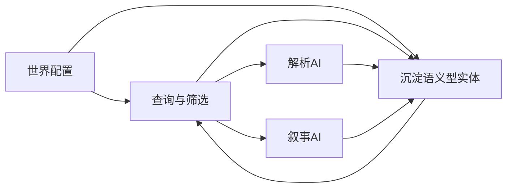

# 世界配置—导演AI—世界档案目标生态设计原则

## 1. 文档目的

本文档不试图提前设计一套完整终局架构。

原因很明确：

- 目标生态的正确形态需要随着实现推进、实际使用反馈与提示词结构演化不断修正
- 当前阶段还不具备把最终模型一次性设计完毕的条件
- 如果过早把未来形态硬编码成具体架构，反而会限制后续演进

因此，本文档只记录三类内容：

1. **目标方向**
2. **设计原则**
3. **未来应逐步逼近的能力结构**

它不规定当前阶段必须一次性实现全部内容，也不提供刚性的迁移路线。

当前阶段的落地范围请参见：

- [`plans/world-config-current-phase-plan.md`](./world-config-current-phase-plan.md)

---

## 2. 当前问题与目标偏差

从当前实现来看，系统已经具备以下基础：

- 运行时规则世界已经能够通过 [`getRuntimeWorldConfig()`](../src/lib/world/resolve-config.ts:26) 与存档快照稳定工作
- 世界书系统可以提供静态世界知识，入口为 [`collectWorldInfoContentSync()`](../src/lib/lorebook/collector.ts:68)
- 世界档案系统已经存在独立仓储，入口为 [`getWorldArchiveRepository()`](../src/modules/world-archive/repository.ts:230)
- 提示词侧已经存在 [`scenario`](../src/lib/prompt/types.ts:219) 这类叙事上下文槽位

但它与目标生态仍有明显偏差：

1. **预设叙事实体没有被视为世界档案的一部分**
   - 例如天赋、物品、技能、角色模板等，当前更多是作为提示词材料或规则模板存在
   - 它们没有自然地进入统一的叙事实体管理体系

2. **世界档案目前更接近运行时涌现实体仓库**
   - 它更偏向承接运行后生成的内容
   - 但未充分承担“预设基础实体 + 运行时新增实体”的统一图书馆角色

3. **导演 AI 已经开始具备基础治理输入，但仍未成为世界档案的有机管理者**
   - 当前阶段已经补齐导演 AI 的冷启动关键信息，使其能够同时看到剧本、静态世界知识与角色描写
   - 也已经补入一致性守门约束，使其开始承担基础的一致性治理职责
   - 但世界配置 → 导演 AI → 世界档案 → 解析 AI / 叙事 AI 的稳定闭环仍未真正形成

4. **叙事实体仍存在全量 prompt 注入倾向**
   - 当前阶段已经明确不再通过预填大量结构化种子来追求表面完备，而是优先让导演 AI 在运行中逐步建档
   - 但当世界规模变大、游戏周期变长时，如果缺少更成熟的剪裁与筛选机制，仍会很快触碰上下文极限
   - 用户已明确认为仅依赖程序化全量注入、向量化检索等方案并不理想，它们未来可以是辅助手段，但不应成为核心组织机制

---

## 3. 目标生态的核心隐喻

目标生态可以用一个稳定的隐喻来描述：

- **世界配置** 是一批基础图书
- **世界档案** 是图书馆
- **导演 AI** 是图书管理员
- **解析 AI / 叙事 AI** 是借阅并使用图书的创作者

这个隐喻背后的核心含义是：

1. 世界配置不只是规则模板，也应是**初始叙事实体的来源之一**
2. 世界档案不只是运行时残留物，而应是**叙事实体的统一管理空间**
3. 导演 AI 不只是剧情建议器，而应是**叙事实体流转与分发的管理者**
4. 解析 AI 与叙事 AI 不应长期依赖全量注入，而应更多依赖**导演 AI 在正确时机提供的相关图书**

---

## 4. 目标生态中的对象角色

## 4.1 世界配置

在目标生态中，世界配置承担两类职责：

1. **规则职责**
   - 定义世界如何运作
   - 对齐 [`WorldConfig`](../src/lib/world/types.ts:228) 这一机械规则主体

2. **种子职责**
   - 提供世界初始就存在的叙事实体来源
   - 提供剧本与开幕语等启动材料
   - 为导演 AI 提供初始世界组织基础
   - 其中剧本长文本本身可以先承担主要种子职责，而不必一开始就扩展为大批结构化实体字段

这意味着在长期目标上，世界配置不应只是“角色创建规则 + 模板表”，而应是“**规则基础 + 初始叙事种子**”。

## 4.2 世界档案

在目标生态中，世界档案应逐步逼近以下定位：

- 它是**统一叙事实体图书馆**
- 既容纳预设阶段就存在的实体，也容纳运行时涌现的新实体
- 它不是单纯的日志，不是只读百科，也不是单纯的数据表
- 它是为一致性服务的长期记忆与管理空间

长期来看，世界档案中的实体应至少覆盖两类。

### A. 语义型叙事实体

这类实体可以没有严密的数据结构支撑，更多体现为语义标签或叙事对象，例如：

- 事件
- 任务
- 势力
- 地点
- 传闻
- 组织关系
- 剧情阶段性线索

这类实体往往：

- 由叙事 AI 在剧情中提到或描写
- 由导演 AI 从正文中抽取、归纳、合并、更新
- 更适合以语义摘要、标签、关系等方式管理

### B. 数据型叙事实体

这类实体具有明确数据支撑，例如：

- 角色
- NPC
- 物品
- 技能
- 天赋
- 可复用能力模块
- 具有结构化属性的战斗或互动对象

这类实体往往：

- 在创建时就需要结构化数据
- 更适合由解析 AI 负责创建、变更与校验
- 可以在需要时通过 ID 或关键引用再次被解析 AI 恢复或复用

这两类实体在管理方式上不必完全一致，但应逐步进入同一个世界档案生态。

## 4.3 导演 AI

在目标生态中，导演 AI 的职责不是替代解析 AI，也不是替代叙事 AI，而是承担**管理与编排职责**。

长期目标上，导演 AI 应逐步靠近以下角色：

1. **世界档案维护者**
   - 识别哪些叙事实体应进入世界档案
   - 维护实体的增删改、归并、去重、关联

2. **叙事实体调度者**
   - 在当前剧情回合中判断哪些实体是相关的
   - 决定哪些信息应该给解析 AI
   - 决定哪些信息应该给叙事 AI

3. **一致性守门人**
   - 避免剧情长期推进后出现明显前后矛盾
   - 在上下文有限的情况下优先保障核心实体的一致性

4. **上下文压缩协调者**
   - 不追求把全部实体都直接塞进 prompt
   - 而是追求“在合适的时机，把合适的实体，按合适的形态交给下游 AI”

---

## 5. 目标生态中的信息流原则

## 5.1 基础流向

长期目标上的理想流向应逐步逼近：

这张图表达的是原则，不代表当前阶段必须完整实现。

## 5.2 世界配置到世界档案

长期方向上，世界配置中的部分内容不应永远停留在配置层，而应在游戏运行时逐步进入世界档案。

典型例子：

- 预设的角色或 NPC 原型
- 预设的技能、物品、天赋
- 与剧本相关的初始任务、事件、势力、地点种子
- 剧情推进中由导演 AI 识别并沉淀出的稳定状态或关系模板

也就是说，世界配置未来不仅是“开局前的配置文件”，还是“图书馆的基础藏书来源”。

## 5.3 导演 AI 到解析 AI

当解析 AI 需要创建或恢复某个具备结构化数据的实体时，导演 AI 不一定需要转交全部详细数据。

更理想的方式是：

- 导演 AI 提供与当前剧情相关的实体引用
- 关键引用可以是 ID、标签、角色名、实体摘要等
- 解析 AI 根据这些引用去使用或恢复已有结构化实体

其重点不在于“导演 AI 自己掌握所有数据”，而在于“导演 AI 知道该把哪本书递出去”。

## 5.4 导演 AI 到叙事 AI

叙事 AI 更需要的是：

- 与当前剧情相关的实体摘要
- 当前阶段剧情重点
- 必须保持一致的设定与关系
- 应当回收、推进或呼应的事件线索

因此，导演 AI 给叙事 AI 的内容更适合是：

- 摘要化指导
- 语义化提醒
- 关系性说明

而不应只是原始数据表的机械拼接。

---

## 6. 关于实体来源的长期原则

## 6.1 预设来源实体与运行时来源实体应逐步统一纳管

长期来看，世界档案不应再把“预设实体”和“运行时实体”割裂为两个完全不同的生态。

更合理的方向是：

- 预设实体是**初始入馆实体**
- 运行时实体是**游戏过程中新增或演化的实体**
- 两者最终都进入统一的世界档案治理视角

## 6.2 语义型实体与数据型实体可以异构，但不应割裂

长期来看，不同实体的表示方式可以不同：

- 语义型实体可以更轻、更自由
- 数据型实体可以更强结构化

但这不意味着它们应该被拆成互不相干的两个系统。

目标不是“绝对同构”，而是“**统一管理语义下的异构实体生态**”。

## 6.3 不把全量注入当成长期解法

长期原则上应避免：

- 把全部世界档案内容直接注入解析 AI
- 把全部世界档案内容直接注入叙事 AI
- 用上下文堆砌替代导演 AI 的选择与治理职责

因为随着世界规模增长，这种方式不可持续。

## 6.4 程序检索可作为辅助，但不应替代导演管理

向量检索、关键词检索、规则筛选等程序化手段未来可以存在，但其角色更适合作为：

- 导演 AI 的辅助工具
- 实体候选集合的缩小器
- 一致性校验与召回增强机制

而不是替代导演 AI 的叙事治理职责本身。

---

## 7. 对当前阶段的反向约束

虽然本文档不是当前实施方案，但它会反过来约束当前阶段不要走错方向。

当前阶段至少要避免以下问题：

1. **不要把世界配置继续设计成纯规则容器**
   - 它必须能承接未来的叙事实体种子职责

2. **不要把剧本仅仅当作一次性 prompt 文本**
   - 它应是未来导演 AI 的稳定上游材料

3. **不要把开幕语混成普通提示词配置项**
   - 它是玩家可见的启动内容

4. **不要把世界档案继续限定为纯运行时涌现仓库**
   - 它未来应能容纳初始种子与运行时新增内容

5. **不要把 UI 做成只适配机械规则的表单**
   - 需要为未来叙事实体种子与配置直编保留扩展位

6. **不要把未来导演 AI 的职责提前写死成固定实现**
   - 当前阶段只能预留接口与方向，不能假装终局已经确定

---

## 8. 未来需要逐步观察和完善的问题

以下问题都属于未来需要逐步逼近与修正的内容，而不是现在就拍板的终局设计。

### 8.1 世界档案的实体最小单元

仍需逐步观察：

- 语义型实体的最小记录单位是什么
- 数据型实体与语义型实体如何关联
- 一个实体是否允许同时具备结构化数据与语义摘要

### 8.2 导演 AI 的管理粒度

仍需逐步观察：

- 导演 AI 是每回合都操作档案，还是按阶段操作
- 它的增删改权限应有多大
- 何时需要人工规则兜底

### 8.3 解析 AI 与叙事 AI 的边界

仍需逐步观察：

- 哪些实体必须由解析 AI 创建
- 哪些实体更适合由导演 AI 从正文抽取
- 哪些变更需要结构化写入，哪些只需要语义沉淀

### 8.4 提供给下游 AI 的信息形态

仍需逐步观察：

- ID 引用的稳定性如何保证
- 摘要、标签、关系、原始数据在不同场景下应如何组合
- 哪些信息应直接注入，哪些信息应通过导演二次整理

### 8.5 世界配置中的叙事实体种子如何表达

当前阶段已经更明确地偏向以下起点：

- 先以剧本长文本承接主要叙事种子职责
- 不把新增大批结构化实体字段当作冷启动前提
- 让导演 AI 在剧情推进中逐步识别、整理并沉淀值得长期保留的实体与状态

仍需逐步观察：

- 在什么规模与复杂度下，自由文本会开始不足
- 是否需要引入半结构化块作为中间层
- 哪些类型的实体值得进一步拆成专门编辑器
- 运行时涌现出的状态、关系、标签，哪些适合回流为更稳定的模板

这些问题都不适合在当前阶段一次性定型。

---

## 9. 长期目标下的 UI 原则

虽然最终架构不能提前定型，但 UI 方向仍可以先明确原则。

### 9.1 UI 应以编辑能力与扩展能力为核心

长期来看，世界相关工作区应优先支持：

- 结构化编辑
- 自由文本编辑
- 原始配置直编
- 对未来实体种子的扩展容纳

而不是优先追求：

- 重度预览
- 演示型界面
- 中看不中用的复杂渲染

这与当前阶段文档中的工作台方向是一致的。

### 9.2 世界编辑器、世界书、世界档案管理器仍应保持分工

长期来看，这三者会更紧密协作，但不代表一定要被合并成一个单体 UI。

更合理的方向仍然是：

- 世界编辑器负责规则与启动种子
- 世界书工作区负责静态知识组织
- 世界档案管理器负责实体视图、检索、校正与治理

它们通过引用、绑定、导入导出与运行时协作联动，而不是被迫收缩成一张巨表单。

---

## 10. 总结

本文档记录的不是最终架构，而是长期目标的方向性共识。

最关键的 5 条原则如下：

1. **世界配置不仅是规则集合，也应逐步成为初始叙事实体与启动材料的来源**
2. **世界档案不只是运行时涌现内容仓库，而应逐步成为统一叙事实体图书馆**
3. **导演 AI 的核心职责是编目、筛选、分发与一致性管理，而不是简单加一层 prompt**
4. **解析 AI 与叙事 AI 获得的信息应由导演 AI 按场景整理，而不是长期依赖全量注入**
5. **当前阶段的设计必须为这一方向留口，但不能假装终局已经确定**

与当前实施文档配合使用时，可以形成清晰分工：

- [`plans/world-config-current-phase-plan.md`](./world-config-current-phase-plan.md) 回答现在做什么
- 本文档回答未来朝什么方向逼近，以及哪些原则不能背离
