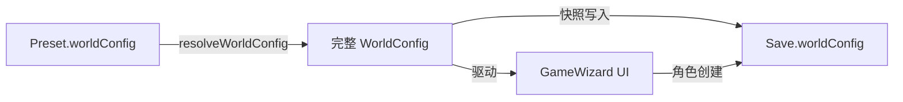
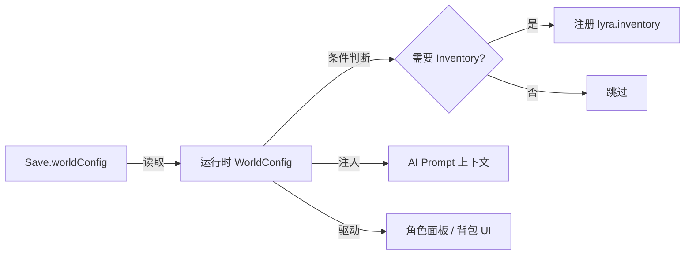

# WorldConfig 快照与条件模块注册设计方案

> **文档状态**：设计中 · 待评审
> **关联系统**：WorldConfig / Save / 模块注册 / 装备系统
> **最后更新**：2025-07

---

## 1. 问题陈述

### 1.1 当前架构

```
Preset (IndexedDB: lyra-presets)
├── blocks[]          ← AI Prompt 配置
├── purpose           ← narrative / parser / summarizer
├── aiSettings?       ← AI 参数覆盖
├── postProcessRules? ← 后处理规则
├── metadata
└── worldConfig?      ← 世界规则（可选，浅覆盖默认值）

Save (Yjs + IndexedDB)
├── characters        ← 角色数据
├── conversations     ← 会话
├── messages          ← 消息
├── gameState         ← 游戏状态
├── inventories       ← 物品实例
├── skills            ← 技能实例
└── (无 worldConfig)  ← ⚠️ 存档不记录使用了哪个世界规则
```

运行时解析逻辑：
```typescript
// src/lib/world/resolve-config.ts
function resolveWorldConfig(preset?: Preset | null): WorldConfig {
  if (!preset?.worldConfig) return DEFAULT_WORLD_CONFIG;
  return { ...DEFAULT_WORLD_CONFIG, ...preset.worldConfig };
}
```

### 1.2 核心问题

**存档与 WorldConfig 之间没有绑定关系。**

WorldConfig 从「当前激活的 Preset」实时解析，而 Preset 是全局切换的。这导致：

| 场景 | 问题 |
|------|------|
| 用户用「异世界奇幻」预设创建存档 A（str/vit/agi 属性，有装备系统）→ 切换到「现代都市」预设 → 加载存档 A | 属性 key 对不上，装备系统的 WorldConfig 消失了，但存档里的 ItemInstance 数据还在 |
| 用户想换叙事风格（如从严肃改为搞笑），但保持同一世界规则 | 不可能 —— 换 Preset 就换了世界规则 |
| 条件模块（如 Inventory）需要根据 WorldConfig 决定是否注册 | 判断依据不可靠 —— 用户随时可能切换 Preset |

### 1.3 根因分析

Preset 中混合了两类本质不同的关注点：

| 关注点 | 变化频率 | 影响范围 | 切换场景 |
|--------|----------|----------|----------|
| **AI 行为**（Prompt 块、模型参数、后处理规则） | 高 — 用户可能频繁调整叙事风格 | 仅影响 AI 输出的文本风格 | 不影响游戏数据 |
| **世界规则**（属性、检定、装备槽位、物品/技能模板） | 低 — 创建世界后很少改动 | 影响角色数据结构、规则引擎行为、模块加载 | 可能破坏存档数据 |

将它们放在同一个实体中，导致切换 AI 行为时误伤世界规则。

---

## 2. 设计目标

| #   | 目标 | 说明 |
|-----|------|------|
| G1  | **存档-规则绑定** | 每个存档自带 WorldConfig 快照，运行时从存档读取，不受 Preset 切换影响 |
| G2  | **条件模块安全** | Inventory 等条件模块基于存档快照中的 WorldConfig 决定是否注册，判断依据稳定可靠 |
| G3  | **Preset 职责聚焦** | Preset 中的 worldConfig 字段降级为「创建新游戏时的模板来源」，运行时不再作为 truth source |
| G4  | **EquipSlot 数据驱动** | 装备槽位从硬编码联合类型改为 WorldConfig 数据驱动，支持不同世界观自定义 |
| G5  | **最小改动** | 不引入新的独立实体/存储，复用现有 Yjs Save 结构 |

### 非目标

| #   | 非目标 | 说明 |
|-----|--------|------|
| N1  | WorldConfig 独立实体 | 不做独立的 CRUD / 独立 IndexedDB 存储，留给 Phase 3 World Builder |
| N2  | 多 Preset 共享 WorldConfig 源 | 可通过 `worldConfigId` 引用实现，但当前不需要 |
| N3  | 旧存档数据迁移 | 项目未上线，不需要向后兼容 |

---

## 3. 架构改进

### 3.1 分层模型

```
┌─────────────────────────────────────────────────────┐
│              创作层 (Authoring)                       │
│                                                     │
│  Preset                                             │
│  ├── blocks[], aiSettings, postProcessRules         │
│  └── worldConfig?  ← 世界规则模板（仅创建新游戏时用） │
│                                                     │
│  未来: WorldConfig Editor                            │
│  → 可编辑 Preset.worldConfig（创作阶段）              │
│  → 可编辑 Save.worldConfig（游戏内调整）              │
│                                                     │
├─────────────────── 创建新游戏时快照 ─────────────────┤
│                                                     │
│              运行层 (Runtime)                         │
│                                                     │
│  Save                                               │
│  ├── characters, conversations, messages, etc.      │
│  └── worldConfig ✨  ← 快照，运行时唯一 truth source │
│                                                     │
└─────────────────────────────────────────────────────┘
```

### 3.2 数据流变化

#### 创建新游戏



#### 加载存档（改进后）



#### 切换 Preset（改进后）

```
切换 Preset 的影响范围：
  ✅ AI 叙事风格改变（blocks）
  ✅ AI 模型参数改变（aiSettings）
  ✅ 后处理规则改变（postProcessRules）
  ❌ 世界规则不变 ← 正确行为，读的是存档快照
```

---

## 4. 详细设计

### 4.1 Save 结构扩展

在 Yjs Save Map 中新增 `worldConfig` 字段：

```
root (Y.Map)
└── saves (Y.Map)
    └── {saveId} (Y.Map)
        ├── id, name, createdAt, updatedAt
        ├── type: "solo" | "multiplayer"
        ├── conversations (Y.Map)
        ├── messages (Y.Map<Y.Array>)
        ├── characters (Y.Map<Y.Map>)
        ├── inventories (Y.Map<Y.Array<Y.Map>>)
        ├── skills (Y.Map<Y.Array<Y.Map>>)
        ├── memory (Y.Map)
        ├── gameState (Y.Map)
        ├── checkpoints (Y.Array)
        └── worldConfig (Y.Map) ✨ 新增 — WorldConfig 快照
```

### 4.2 WorldConfig 序列化/反序列化

需要提供 WorldConfig ↔ Y.Map 的转换函数：

```typescript
// src/lib/world/world-config-codec.ts

/**
 * 将 WorldConfig 序列化为 Y.Map 存储到 Yjs
 *
 * 策略：JSON 序列化后作为单个字符串存储。
 * 理由：WorldConfig 是「创建时一次性写入、运行时只读」的数据，
 *       不需要 Yjs 的字段级 CRDT 合并能力，
 *       JSON 字符串更简单且避免了嵌套 Y.Map 的序列化复杂度。
 */
export function worldConfigToYMap(config: WorldConfig): Y.Map<unknown> {
  const map = new Y.Map<unknown>();
  map.set("version", config.version);
  map.set("data", JSON.stringify(config));
  return map;
}

/**
 * 从 Y.Map 反序列化为 WorldConfig
 */
export function worldConfigFromYMap(
  map: Y.Map<unknown>,
): WorldConfig | null {
  try {
    const data = map.get("data") as string;
    if (!data) return null;
    return JSON.parse(data) as WorldConfig;
  } catch {
    return null;
  }
}
```

> **[设计决策] 序列化策略**：使用 JSON 字符串而非逐字段 Y.Map。WorldConfig 在存档生命周期中是「写入一次、多次读取」的静态数据，不需要 CRDT 的实时协同编辑能力。如果未来需要支持游戏内编辑 WorldConfig，可以替换为逐字段 Y.Map 序列化。

### 4.3 创建存档时写入快照

修改 `createSaveHandler`：

```typescript
// src/modules/save/commands/handlers.ts — createSaveHandler

const createSaveHandler: CommandHandler<CreateSavePayload, string> = async (
  command, context,
) => {
  const { name, initialCharacter } = command.payload;

  // 1. 从当前活动预设解析 WorldConfig
  const activePreset = usePresetStore.getState().activePreset;
  const worldConfig = resolveWorldConfig(activePreset);

  // 2. 创建存档
  const saveId = yjsManager.createSave({ name });
  yjsManager.loadSave(saveId);

  // 3. 将 WorldConfig 快照写入存档
  const save = yjsManager.getCurrentSave();
  if (save) {
    save.set("worldConfig", worldConfigToYMap(worldConfig));
    // ... 写入角色等现有逻辑
  }

  // 4. 发布事件（现有逻辑不变）
  // ...
};
```

### 4.4 运行时 WorldConfig 获取

新增统一的运行时获取函数，替代现有的 `resolveWorldConfig(activePreset)` 调用：

```typescript
// src/lib/world/resolve-config.ts

import { yjsManager } from "@/core/yjs";
import { worldConfigFromYMap } from "./world-config-codec";

/**
 * 获取运行时 WorldConfig
 *
 * 优先级：
 * 1. 当前存档的 WorldConfig 快照
 * 2. 回退到 DEFAULT_WORLD_CONFIG（理论上不应发生）
 *
 * @returns 完整的 WorldConfig
 */
export function getRuntimeWorldConfig(): WorldConfig {
  // 从当前存档读取快照
  const save = yjsManager.getCurrentSave();
  if (save) {
    const wcMap = save.get("worldConfig") as Y.Map<unknown> | undefined;
    if (wcMap) {
      const config = worldConfigFromYMap(wcMap);
      if (config) return config;
    }
  }

  // 兜底：返回默认配置
  return DEFAULT_WORLD_CONFIG;
}

/**
 * [保留] 从预设解析 WorldConfig
 *
 * 仅用于：
 * - GameWizard 创建新游戏时（此时还没有存档）
 * - 预设编辑器预览
 *
 * 运行时业务逻辑应使用 getRuntimeWorldConfig()
 */
export function resolveWorldConfig(preset?: Preset | null): WorldConfig {
  if (!preset?.worldConfig) return DEFAULT_WORLD_CONFIG;
  return { ...DEFAULT_WORLD_CONFIG, ...preset.worldConfig };
}
```

### 4.5 消费端迁移

所有在游戏运行中读取 WorldConfig 的地方，从 `resolveWorldConfig(activePreset)` 迁移到 `getRuntimeWorldConfig()`：

| 消费端 | 当前调用 | 迁移后 | 说明 |
|--------|----------|--------|------|
| `CharacterPanel` | `resolveWorldConfig(activePreset)` | `getRuntimeWorldConfig()` | 渲染属性/天赋名称 |
| `VariableContext.worldConfig` | 从 `activePreset` 解析 | 从存档读取 | AI Prompt 上下文注入 |
| `RulesEngine` 校验 | 从 `activePreset` 解析 | 从存档读取 | Action 校验 |
| `Inventory handlers` | 从 `activePreset` 解析 | 从存档读取 | 物品/技能操作校验 |
| `GameWizard` | `resolveWorldConfig(activePreset)` | **不变** | 创建新游戏时从 Preset 读取模板 |
| `PresetWorkspace` 编辑器 | `resolveWorldConfig(preset)` | **不变** | 编辑预设时预览 |

---

## 5. 条件模块注册

### 5.1 设计原则

- **事件驱动**：模块的注册/注销由 `SAVE_LOADED` 事件触发
- **单一入口**：只有一个地方判断是否需要注册条件模块
- **幂等操作**：重复注册/注销不产生副作用

### 5.2 判断条件

```typescript
// src/modules/conditional.ts

/**
 * 判断 WorldConfig 是否声明了 Inventory 系统需求
 *
 * 判断策略：只要 WorldConfig 中存在以下任一配置，就认为需要 Inventory 模块：
 * - inventoryRules（背包规则配置）
 * - itemTemplates 非空（定义了物品模板）
 * - skillTemplates 非空（定义了技能模板）
 */
function needsInventoryModule(worldConfig: WorldConfig): boolean {
  return !!(
    worldConfig.inventoryRules ||
    (worldConfig.itemTemplates && worldConfig.itemTemplates.length > 0) ||
    (worldConfig.skillTemplates && worldConfig.skillTemplates.length > 0)
  );
}
```

### 5.3 协调逻辑

```typescript
// src/modules/conditional.ts

import { eventBus } from "@/core";
import { registry } from "@/core";
import { SaveEvents } from "@/domain/events/save";
import { getRuntimeWorldConfig } from "@/lib/world/resolve-config";
import {
  registerInventoryModule,
  unregisterInventoryModule,
} from "./inventory";

/**
 * 同步条件模块的注册状态
 *
 * 根据当前 WorldConfig 判断模块是否需要注册，
 * 执行必要的注册或注销操作。
 */
async function syncConditionalModules(): Promise<void> {
  const worldConfig = getRuntimeWorldConfig();

  // ── Inventory 模块 ──
  await syncModule(
    "lyra.inventory",
    needsInventoryModule(worldConfig),
    registerInventoryModule,
    unregisterInventoryModule,
  );

  // 未来其他条件模块在此添加：
  // await syncModule("lyra.combat", needsCombatModule(worldConfig), ...);
}

/**
 * 通用模块同步辅助函数
 */
async function syncModule(
  moduleId: string,
  needed: boolean,
  register: () => Promise<void>,
  unregister: () => Promise<void>,
): Promise<void> {
  const isRegistered = registry.hasModule(moduleId);

  if (needed && !isRegistered) {
    await register();
  } else if (!needed && isRegistered) {
    await unregister();
  }
  // needed === isRegistered → 无需操作
}

/**
 * 初始化条件模块监听
 *
 * 在 registerAllModules() 中调用一次。
 * 监听 SAVE_LOADED 事件，每次加载存档时重新判断条件模块。
 */
export function setupConditionalModules(): () => void {
  const unsubscribe = eventBus.on(
    SaveEvents.SAVE_LOADED,
    async () => {
      await syncConditionalModules();
    },
  );
  return unsubscribe;
}
```

### 5.4 模块注册入口修改

```typescript
// src/modules/index.ts

import { setupConditionalModules } from "./conditional";

let cleanupConditionalModules: (() => void) | null = null;

export async function registerAllModules(): Promise<void> {
  // Phase 1: 核心模块（始终加载）
  await registerSaveModule();
  await registerChatModule();
  await registerMemoryModule();
  await registerDataModule();

  // Phase 2: IRNR 模块（始终加载）
  await registerGameModule();

  // Phase 2.5: 条件模块（事件驱动，不在此处注册）
  // 原：await registerInventoryModule();  ← 删除
  cleanupConditionalModules = setupConditionalModules();

  // Phase 2.6: Checkpoint 模块
  await registerCheckpointModule();

  // Phase 3: 联机模块
  registerRoomModule();
}

export async function unregisterAllModules(): Promise<void> {
  // 清理条件模块监听
  if (cleanupConditionalModules) {
    cleanupConditionalModules();
    cleanupConditionalModules = null;
  }
  // 条件模块的注销
  if (registry.hasModule("lyra.inventory")) {
    await unregisterInventoryModule();
  }

  // 其他模块按逆序卸载（现有逻辑）
  await unregisterDataModule();
  await unregisterMemoryModule();
  await unregisterChatModule();
  await unregisterGameModule();
  await unregisterSaveModule();
}
```

### 5.5 时序图

#### 场景 A：用户创建新游戏（预设含 Inventory 配置）

```
User         GameWizard     SaveHandler    EventBus      ConditionalModules
 │              │               │             │                │
 │──创建游戏──→│               │             │                │
 │              │──创建存档────→│             │                │
 │              │               │─快照 WC───→│                │
 │              │               │─SAVE_LOADED→│                │
 │              │               │             │──sync()───────→│
 │              │               │             │                │─读取 Save.worldConfig
 │              │               │             │                │─needsInventory? → true
 │              │               │             │                │─registerInventoryModule()
 │              │               │             │←───done────────│
 │              │               │             │                │
```

#### 场景 B：用户切换存档（从奇幻切到纯叙事）

```
User         SaveHandler    EventBus      ConditionalModules
 │              │             │                │
 │──加载存档──→│             │                │
 │              │─SAVE_LOADED→│                │
 │              │             │──sync()───────→│
 │              │             │                │─读取 Save.worldConfig
 │              │             │                │─needsInventory? → false
 │              │             │                │─unregisterInventoryModule()
 │              │             │←───done────────│
```

#### 场景 C：用户切换 Preset（不影响世界规则）

```
User         PresetStore    AI Pipeline
 │              │               │
 │──切换预设──→│               │
 │              │               │
 │              │ (无 SAVE_LOADED 事件)
 │              │               │
 │              │ (Inventory 模块状态不变 ✅)
 │              │               │
 │              │──更新 AI 行为→│
 │              │               │
```

---

## 6. EquipSlot 数据驱动化

### 6.1 现状

```typescript
// src/domain/entities/item.ts — 硬编码联合类型
export type EquipSlot =
  | "main_hand" | "off_hand" | "head" | "body"
  | "legs" | "feet" | "accessory_1" | "accessory_2";
```

问题：无法适配不同世界观（修仙的「丹田」「法宝」，科幻的「芯片槽」「义体」）。

### 6.2 改为数据驱动

#### 6.2.1 类型变更

```typescript
// src/domain/entities/item.ts
// 改前：联合类型
// 改后：string（运行时由 WorldConfig 约束合法值）
export type EquipSlot = string;
```

#### 6.2.2 WorldConfig 新增槽位定义

```typescript
// src/lib/world/types.ts

export interface EquipSlotDefinition {
  /** 槽位 ID，如 "main_hand"、"dantian"、"chip_slot" */
  id: string;
  /** 显示名称，如 "主手"、"丹田"、"芯片槽" */
  label: string;
  /** 限制该槽位可装备的物品类别（不设置 = 不限制） */
  allowedCategories?: ItemCategory[];
  /** 该槽位可装备的物品数量（默认 1） */
  maxCount?: number;
}

export interface InventoryRulesConfig {
  /** 默认背包容量，默认 20 */
  defaultCapacity?: number;
  /**
   * 装备槽位定义列表
   *
   * 替代原有的 equipSlots: EquipSlot[] 字段。
   * 每个槽位有独立的 id、label、约束条件。
   * 不设置则表示该世界没有装备系统。
   */
  equipSlotDefinitions?: EquipSlotDefinition[];
}
```

#### 6.2.3 默认配置迁移

```typescript
// DEFAULT_WORLD_CONFIG 中
inventoryRules: {
  defaultCapacity: 20,
  // 改前：
  // equipSlots: ["main_hand", "off_hand", "head", "body", ...]
  // 改后：
  equipSlotDefinitions: [
    { id: "main_hand",   label: "主手",   allowedCategories: ["weapon"] },
    { id: "off_hand",    label: "副手",   allowedCategories: ["weapon", "armor"] },
    { id: "head",        label: "头部",   allowedCategories: ["armor"] },
    { id: "body",        label: "身体",   allowedCategories: ["armor"] },
    { id: "legs",        label: "腿部",   allowedCategories: ["armor"] },
    { id: "feet",        label: "脚部",   allowedCategories: ["armor"] },
    { id: "accessory_1", label: "饰品1",  allowedCategories: ["accessory"] },
    { id: "accessory_2", label: "饰品2",  allowedCategories: ["accessory"] },
  ],
},
```

#### 6.2.4 不同世界观示例

```typescript
// 修仙世界
inventoryRules: {
  defaultCapacity: 50,
  equipSlotDefinitions: [
    { id: "weapon",    label: "法宝",   allowedCategories: ["weapon"] },
    { id: "armor",     label: "法袍",   allowedCategories: ["armor"] },
    { id: "storage",   label: "储物袋", allowedCategories: ["accessory"] },
    { id: "mount",     label: "坐骑",   allowedCategories: ["misc"] },
    { id: "talisman_1", label: "符箓·壹", allowedCategories: ["accessory"] },
    { id: "talisman_2", label: "符箓·贰", allowedCategories: ["accessory"] },
  ],
}

// 现代都市 → 不定义 inventoryRules，Inventory 模块不加载
// （纯叙事，无装备概念）

// 赛博朋克
inventoryRules: {
  defaultCapacity: 30,
  equipSlotDefinitions: [
    { id: "primary_weapon",  label: "主武器",   allowedCategories: ["weapon"] },
    { id: "sidearm",         label: "副武器",   allowedCategories: ["weapon"] },
    { id: "head_implant",    label: "头部义体", allowedCategories: ["accessory"] },
    { id: "arm_implant",     label: "手臂义体", allowedCategories: ["accessory"] },
    { id: "body_armor",      label: "防弹衣",   allowedCategories: ["armor"] },
    { id: "chip_slot",       label: "芯片槽",   allowedCategories: ["accessory"], maxCount: 3 },
  ],
}
```

#### 6.2.5 校验逻辑

装备校验从 TypeScript 类型约束改为运行时校验：

```typescript
// RulesEngine 中的校验逻辑（概念示意）
function validateEquipAction(
  itemInstance: ItemInstance,
  targetSlot: string,
  worldConfig: WorldConfig,
): { valid: boolean; reason?: string } {
  const slotDefs = worldConfig.inventoryRules?.equipSlotDefinitions;
  if (!slotDefs) {
    return { valid: false, reason: "当前世界没有装备系统" };
  }

  const slotDef = slotDefs.find(s => s.id === targetSlot);
  if (!slotDef) {
    return { valid: false, reason: `无效的装备槽位: ${targetSlot}` };
  }

  if (
    slotDef.allowedCategories &&
    !slotDef.allowedCategories.includes(itemInstance.category)
  ) {
    return {
      valid: false,
      reason: `${slotDef.label} 不能装备 ${itemInstance.category} 类物品`,
    };
  }

  return { valid: true };
}
```

---

## 7. 实施步骤

### Phase 1: WorldConfig 快照（前置依赖）

| Step | 内容 | 涉及文件 |
|------|------|----------|
| 1.1 | 新建 `worldConfigToYMap` / `worldConfigFromYMap` 编解码函数 | 新建 `src/lib/world/world-config-codec.ts` |
| 1.2 | 新增 `getRuntimeWorldConfig()` 函数 | 修改 `src/lib/world/resolve-config.ts` |
| 1.3 | `createSaveHandler` 中写入 WorldConfig 快照 | 修改 `src/modules/save/commands/handlers.ts` |
| 1.4 | 消费端迁移：运行时从存档读取 WorldConfig | 修改 `CharacterPanel`, `VariableContext` 注入, `RulesEngine`, `Inventory handlers` 等 |
| 1.5 | 保留 `resolveWorldConfig()` 仅供 GameWizard 和 PresetWorkspace 使用 | 添加 JSDoc 注释 |

### Phase 2: 条件模块注册

| Step | 内容 | 涉及文件 |
|------|------|----------|
| 2.1 | 新建 `setupConditionalModules()` 协调函数 | 新建 `src/modules/conditional.ts` |
| 2.2 | 修改 `registerAllModules()` 删除 Inventory 硬编码注册 | 修改 `src/modules/index.ts` |
| 2.3 | 验证：创建有/无 Inventory 配置的存档，确认模块正确注册/不注册 | 手动测试 |
| 2.4 | 验证：切换存档时模块正确注册/注销 | 手动测试 |

### Phase 3: EquipSlot 数据驱动

| Step | 内容 | 涉及文件 |
|------|------|----------|
| 3.1 | `EquipSlot` 类型改为 `string` | 修改 `src/domain/entities/item.ts` |
| 3.2 | 新增 `EquipSlotDefinition` 接口 | 修改 `src/lib/world/types.ts` |
| 3.3 | `InventoryRulesConfig` 替换 `equipSlots` 为 `equipSlotDefinitions` | 修改 `src/lib/world/types.ts` |
| 3.4 | 更新 `DEFAULT_WORLD_CONFIG` | 修改 `src/lib/world/types.ts` |
| 3.5 | RulesEngine 中装备校验改为运行时查询 `equipSlotDefinitions` | 修改相关校验逻辑 |
| 3.6 | ActionSchema 中装备相关 Action 的参数校验更新 | 修改 `src/modules/inventory/schemas/action-schemas.ts` |

---

## 8. 与现有系统的关系

### 8.1 Checkpoint 系统

Checkpoint 快照中已经包含了角色、物品、技能等数据。WorldConfig 快照存在于 Save 级别（不在 Checkpoint 中），因为 WorldConfig 在存档生命周期内不变。回溯 Checkpoint 时不需要恢复 WorldConfig。

### 8.2 导入/导出

`ExportSaveData` / `ImportSaveData` 需要包含 `worldConfig` 字段：

```typescript
interface ExportSaveData {
  // ... 现有字段
  worldConfig?: WorldConfig;  // 新增
}
```

### 8.3 AI Prompt 上下文

`VariableContext.worldConfig` 的注入来源从 `resolveWorldConfig(activePreset)` 改为 `getRuntimeWorldConfig()`。对 AI 来说输入格式不变。

### 8.4 ActionSchema 注册

当 Inventory 模块未注册时，`actionSchemaRegistry` 中不包含 `inventoryActionSchemas`。
AI Prompt 中 `generateOperationDefinitions()` 自动不包含装备相关 Action。
AI 不会看到 `grantItem`、`equipItem` 等操作，避免在不支持装备的世界中产生幻觉。

---

## 9. 待讨论 / 待定事项

### 9.1 联机模式适配

> **状态**：待后续讨论后补充

联机模式下，WorldConfig 快照的写入和读取涉及 Host/Guest 的协同：
- GameWizard 中的维度选择、属性分配界面在联机成员端的行为
- WorldConfig 是否需要通过 MainDoc 同步给所有成员

此部分等单机模式稳定后再设计和适配。

---

## 10. 关键设计决策摘要

| 决策 | 选择 | 理由 |
|------|------|------|
| WorldConfig 分离方式 | **运行时分离，创作时保留** — 快照到 Save，不独立存储 | 最小改动，G5 |
| 快照序列化方式 | **JSON 字符串** 存储在 Y.Map 中 | WorldConfig 是一次写入只读数据，不需要 CRDT 字段级合并 |
| 条件注册时机 | **SAVE_LOADED 事件驱动** | 单一入口，天然支持存档切换，不需要改 bootstrap 顺序 |
| 条件模块协调者位置 | **`src/modules/conditional.ts`** | 模块数量少时集中管理，未来超过 3 个再抽 ModuleOrchestrator |
| Inventory 注册条件 | `inventoryRules \|\| itemTemplates.length \|\| skillTemplates.length` | 宽松判断，有任何装备/物品/技能配置就加载 |
| EquipSlot 类型 | **`string`** + WorldConfig 数据驱动 | 支持不同世界观自定义槽位 |
| `resolveWorldConfig()` 是否保留 | **保留**，限制使用场景 | 仅 GameWizard 和 PresetWorkspace 使用，运行时用 `getRuntimeWorldConfig()` |
| Preset.worldConfig 字段是否保留 | **保留** | 作为创建新游戏时的模板来源 |
